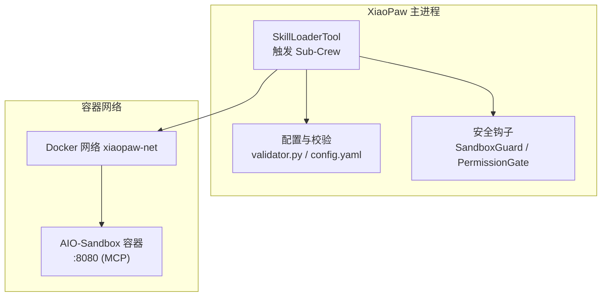
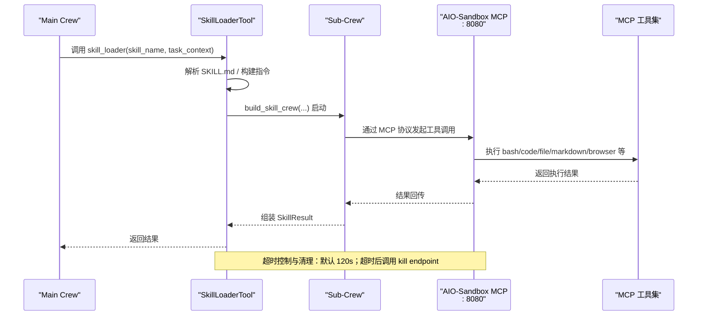
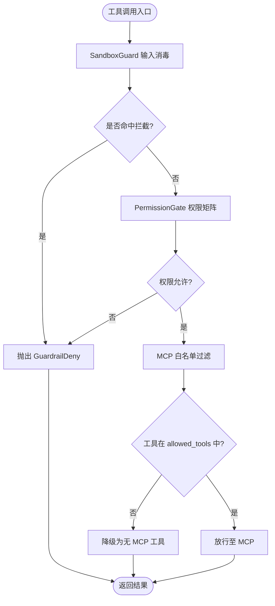
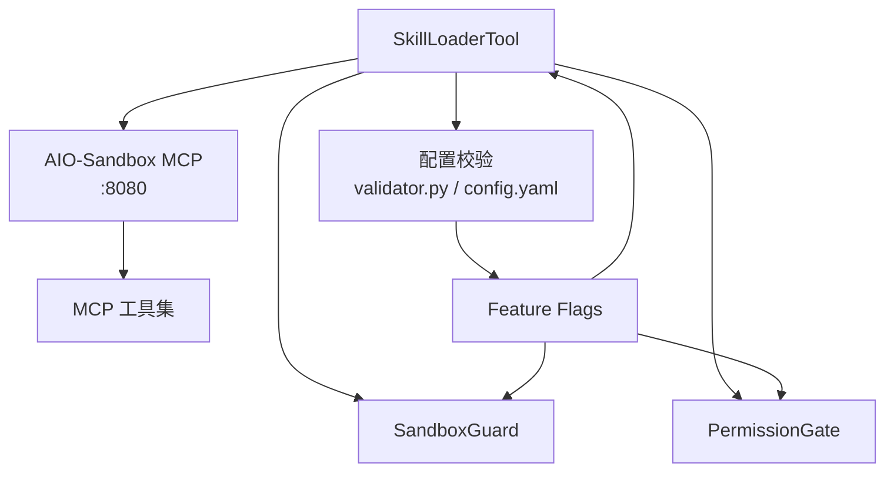

# AIO-Sandbox MCP（出站）

<cite>
**本文档引用的文件**
- [04-api.md](file://docs/04-api.md)
- [07-security.md](file://docs/07-security.md)
- [11-migration-v1-to-v2.md](file://docs/11-migration-v1-to-v2.md)
- [config.yaml.example](file://config.yaml.example)
- [validator.py](file://xiaopaw/config/validator.py)
- [sandbox-docker-compose.yaml](file://sandbox-docker-compose.yaml)
- [ports.md](file://docs/ssot/ports.md)
- [feature-flags.md](file://docs/ssot/feature-flags.md)
- [skill_loader.py](file://xiaopaw/tools/skill_loader.py)
- [permission_gate.py](file://shared_hooks/permission_gate.py)
- [sandbox_guard.py](file://shared_hooks/sandbox_guard.py)
</cite>

## 目录
1. [简介](#简介)
2. [项目结构](#项目结构)
3. [核心组件](#核心组件)
4. [架构总览](#架构总览)
5. [详细组件分析](#详细组件分析)
6. [依赖分析](#依赖分析)
7. [性能考虑](#性能考虑)
8. [故障排查指南](#故障排查指南)
9. [结论](#结论)
10. [附录](#附录)

## 简介
本文件面向集成方与运维人员，系统化阐述 XiaoPaw v2.1 的 AIO-Sandbox MCP 出站接口设计与实现，涵盖：
- MCP 协议接入方式与容器间通信拓扑
- 端口与网络边界（容器内 8080，不对宿主暴露）
- 暴露的 MCP 工具清单（bash 执行、代码执行、文件操作、Markdown 转换、浏览器操作等）
- v2 版本白名单过滤机制与安全策略
- workspace 挂载与路径隔离保护
- 超时控制与容器清理机制
- v2.1 版本“不对宿主暴露端口”的安全设计原则

## 项目结构
围绕 MCP 出站接口的关键文件与职责如下：
- 文档层：接口设计与安全策略
- 配置层：端口、超时、Feature Flags
- 运行时：SkillLoaderTool 触发 Sub-Crew，通过 MCP 协议调用沙箱工具
- 安全层：SandboxGuard 与 PermissionGate 两级前置拦截

图表来源
- [04-api.md:595-664](file://docs/04-api.md#L595-L664)
- [validator.py:30-33](file://xiaopaw/config/validator.py#L30-L33)
- [ports.md](file://docs/ssot/ports.md#L14)

章节来源
- [04-api.md:595-664](file://docs/04-api.md#L595-L664)
- [validator.py:30-33](file://xiaopaw/config/validator.py#L30-L33)
- [ports.md](file://docs/ssot/ports.md#L14)

## 核心组件
- MCP 接入与容器通信
  - 容器间地址：http://aio-sandbox:8080/mcp（Docker DNS 解析 + 容器内 8080）
  - 不对宿主暴露端口（compose 无 host port 映射）
- 暴露的 MCP 工具清单（v2 保留 v1）
  - bash 执行、代码执行、文件操作、Markdown 转换、浏览器导航/截图/可点击元素提取等
- v2 白名单过滤
  - 通过 Feature Flag enable_mcp_whitelist 控制；未声明 allowed_tools 的 Skill 将被降级为“无 MCP 工具”
- workspace 挂载与路径隔离
  - 挂载 ./data/workspace:/workspace:rw
  - 路径隔离：Path.resolve 校验，确保写入路径位于 /workspace/sessions/{sid}/ 或 /workspace/.config/ 内
- 超时与清理
  - 默认超时 120s；超时后调用 sandbox kill endpoint 主动清理
- 安全策略
  - SandboxGuard（前置拦截）+ PermissionGate（权限矩阵）+ Feature Flags（生产默认开启）

章节来源
- [04-api.md:599-662](file://docs/04-api.md#L599-L662)
- [07-security.md:183-214](file://docs/07-security.md#L183-L214)
- [feature-flags.md:18-61](file://docs/ssot/feature-flags.md#L18-L61)
- [sandbox-docker-compose.yaml:22-23](file://sandbox-docker-compose.yaml#L22-L23)

## 架构总览
MCP 出站接口的端到端调用链路如下：

图表来源
- [04-api.md:645-662](file://docs/04-api.md#L645-L662)
- [skill_loader.py:417-441](file://xiaopaw/tools/skill_loader.py#L417-L441)

章节来源
- [04-api.md:599-662](file://docs/04-api.md#L599-L662)
- [skill_loader.py:417-441](file://xiaopaw/tools/skill_loader.py#L417-L441)

## 详细组件分析

### MCP 接入与容器通信
- 接入方式
  - 通过 Docker DNS 解析 aio-sandbox，容器内服务监听 8080 端口
  - 容器间通信，不向宿主暴露端口
- 端口与网络
  - 容器内端口 8080（MCP）
  - 生产 compose 不包含 host port 映射，仅 xiaopaw-net 内部可见
- 配置来源
  - sandbox.url 默认 http://aio-sandbox:8080/mcp
  - sandbox.timeout_s 默认 120s

章节来源
- [04-api.md:599-601](file://docs/04-api.md#L599-L601)
- [ports.md](file://docs/ssot/ports.md#L14)
- [validator.py:30-33](file://xiaopaw/config/validator.py#L30-L33)
- [config.yaml.example:21-23](file://config.yaml.example#L21-L23)

### 暴露的 MCP 工具清单
- 全量工具（v2 保留 v1）
  - bash 执行、代码执行、文件操作、Markdown 转换
  - 浏览器导航、获取 Markdown、截图、获取可点击元素等
- 说明
  - 工具清单来源于 AIO-Sandbox 容器内的 MCP 服务器
  - 具体工具名与行为以容器内实现为准

章节来源
- [04-api.md:614-621](file://docs/04-api.md#L614-L621)

### v2 白名单过滤机制与安全策略
- 白名单过滤
  - 通过 Feature Flag enable_mcp_whitelist 控制
  - SKILL.md frontmatter 中声明 allowed_tools，仅允许列出的工具
  - 未声明 allowed_tools 的 Skill 将被降级为“无 MCP 工具”
- 安全策略
  - SandboxGuard：路径穿越、危险命令、Shell 注入、Prompt 注入等四类检测
  - PermissionGate：工具权限矩阵（deny > warn > allow），默认策略为 warn 或 deny
  - 生产环境强制开启多项安全 Feature Flags

图表来源
- [07-security.md:183-214](file://docs/07-security.md#L183-L214)
- [permission_gate.py:57-94](file://shared_hooks/permission_gate.py#L57-L94)
- [sandbox_guard.py:109-145](file://shared_hooks/sandbox_guard.py#L109-L145)

章节来源
- [07-security.md:183-214](file://docs/07-security.md#L183-L214)
- [permission_gate.py:57-94](file://shared_hooks/permission_gate.py#L57-L94)
- [sandbox_guard.py:109-145](file://shared_hooks/sandbox_guard.py#L109-L145)
- [feature-flags.md:18-61](file://docs/ssot/feature-flags.md#L18-L61)

### workspace 挂载与路径隔离保护
- 挂载配置
  - compose 中挂载 ./data/workspace:/workspace:rw
  - v2.1 保留整个 data/workspace 挂载（含 .config 子目录）
- 路径隔离
  - Sub-Crew 侧 Path.resolve 校验，确保写入路径位于 /workspace/sessions/{sid}/ 或 /workspace/.config/ 内
  - 通过文件锁与内容过滤降低并发覆盖与投毒风险

章节来源
- [04-api.md:633-644](file://docs/04-api.md#L633-L644)
- [11-migration-v1-to-v2.md:154-156](file://docs/11-migration-v1-to-v2.md#L154-L156)
- [07-security.md:751-785](file://docs/07-security.md#L751-L785)

### 超时控制与容器清理机制
- 超时控制
  - 默认 120s（sandbox.timeout_s）
  - Sub-Crew 启动后通过 asyncio.wait_for 控制执行时长
- 容器清理
  - 超时后主动调用 sandbox kill endpoint（/mcp/session/kill）终止会话
  - 避免僵尸进程与资源泄漏

章节来源
- [04-api.md:645-662](file://docs/04-api.md#L645-L662)
- [skill_loader.py:266-278](file://xiaopaw/tools/skill_loader.py#L266-L278)

### v2.1 版本安全设计原则（不对宿主暴露端口）
- 设计原则
  - AIO-Sandbox MCP 仅在容器网络内部可见，不映射 host port
  - 生产 compose 中 aio-sandbox 与 pgvector 均无 ports 节
- 验证方法
  - docker compose config 输出中不应包含 aio-sandbox 的 host ports 映射
  - /metrics 与 /health 统一在 8090 端口，TestAPI 仅 dev 且 loopback 绑定

章节来源
- [04-api.md:599-601](file://docs/04-api.md#L599-L601)
- [ports.md:73-76](file://docs/ssot/ports.md#L73-L76)
- [ports.md:108-111](file://docs/ssot/ports.md#L108-L111)

## 依赖分析
MCP 出站接口的依赖关系如下：

图表来源
- [skill_loader.py:417-441](file://xiaopaw/tools/skill_loader.py#L417-L441)
- [validator.py:30-33](file://xiaopaw/config/validator.py#L30-L33)
- [feature-flags.md:18-61](file://docs/ssot/feature-flags.md#L18-L61)

章节来源
- [skill_loader.py:417-441](file://xiaopaw/tools/skill_loader.py#L417-L441)
- [validator.py:30-33](file://xiaopaw/config/validator.py#L30-L33)
- [feature-flags.md:18-61](file://docs/ssot/feature-flags.md#L18-L61)

## 性能考虑
- 超时与并发
  - 默认 120s 超时，避免长时间占用资源
  - 生产环境建议开启 enable_skill_timeout 与相关安全 Feature Flags
- 连接与资源
  - MCP 工具调用为容器内短链路，避免跨主机网络开销
  - 超时清理机制防止僵尸进程与资源泄漏

## 故障排查指南
- 常见问题与定位
  - MCP 工具不可用：检查 SKILL.md 中 allowed_tools 声明与 enable_mcp_whitelist 设置
  - 路径越界/写入失败：确认 workspace 挂载与 Path.resolve 校验逻辑
  - 超时错误：查看 xiaopaw_skill_timeout_total 指标，必要时调整 sandbox.timeout_s
  - 端口暴露风险：确认 compose 中 aio-sandbox 未映射 host port
- 安全事件
  - SandboxGuard 拦截：检查输入是否命中路径穿越/危险命令/Shell 注入/Prompt 注入
  - PermissionGate 拒绝：检查权限矩阵与默认策略

章节来源
- [07-security.md:183-214](file://docs/07-security.md#L183-L214)
- [permission_gate.py:57-94](file://shared_hooks/permission_gate.py#L57-L94)
- [sandbox_guard.py:109-145](file://shared_hooks/sandbox_guard.py#L109-L145)
- [feature-flags.md:18-61](file://docs/ssot/feature-flags.md#L18-L61)

## 结论
AIO-Sandbox MCP 出站接口在 v2.1 中实现了“容器内通信 + 不对宿主暴露端口”的安全设计，结合白名单过滤、前置输入消毒与权限矩阵，形成纵深防御。默认 120s 超时与主动清理机制有效避免资源泄漏与僵尸进程。生产环境建议开启全部安全 Feature Flags，并严格管理 workspace 挂载与路径隔离。

## 附录
- 相关配置与端口
  - sandbox.url: http://aio-sandbox:8080/mcp
  - sandbox.timeout_s: 120
  - /metrics 与 /health: 8090
  - TestAPI: 9090（仅 dev，loopback 绑定）
- 安全基线
  - 生产环境强制开启：enable_mcp_whitelist、enable_webhook_replay_cache、enable_inbound_rate_limit 等

章节来源
- [config.yaml.example:21-23](file://config.yaml.example#L21-L23)
- [ports.md:12-14](file://docs/ssot/ports.md#L12-L14)
- [ports.md:85-86](file://docs/ssot/ports.md#L85-L86)
- [feature-flags.md:43-61](file://docs/ssot/feature-flags.md#L43-L61)