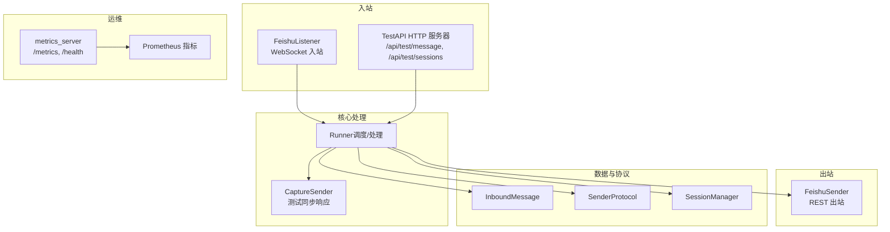
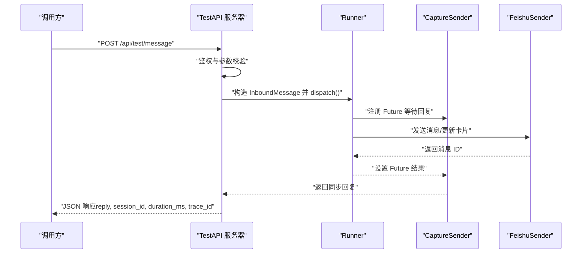
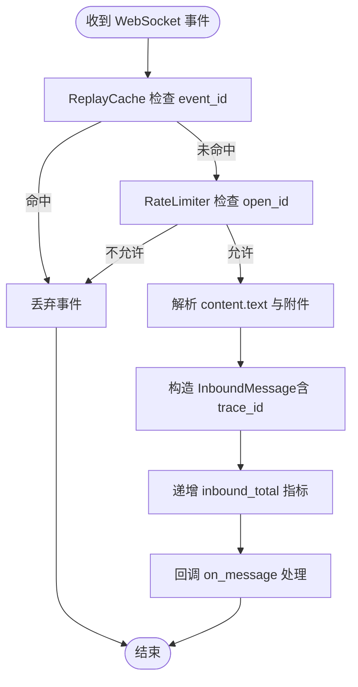
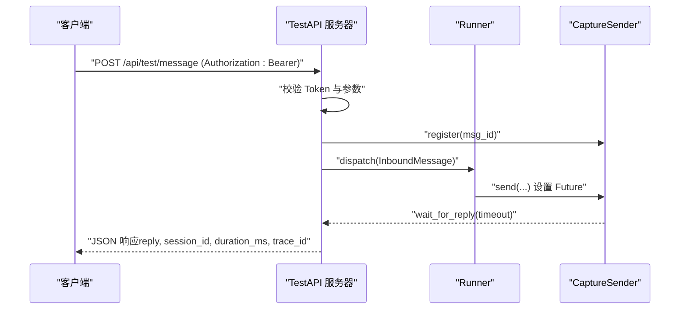
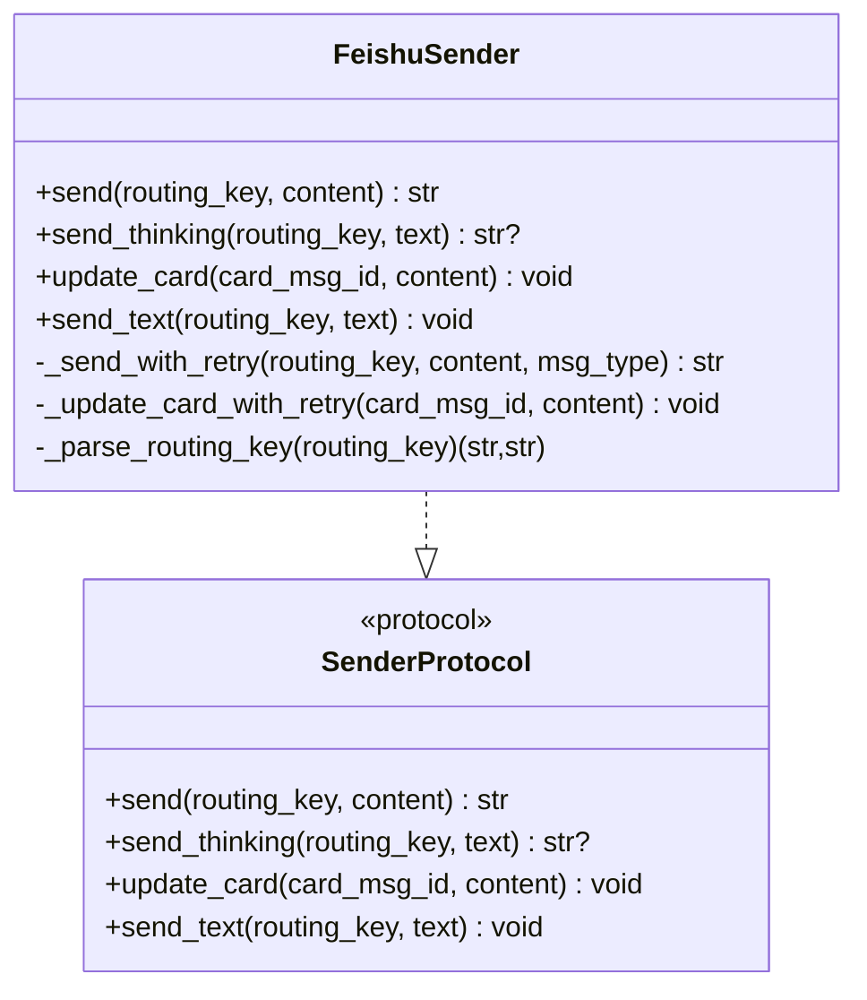
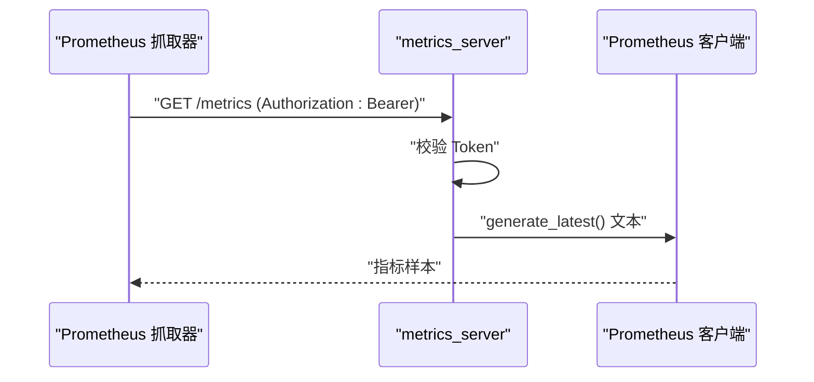
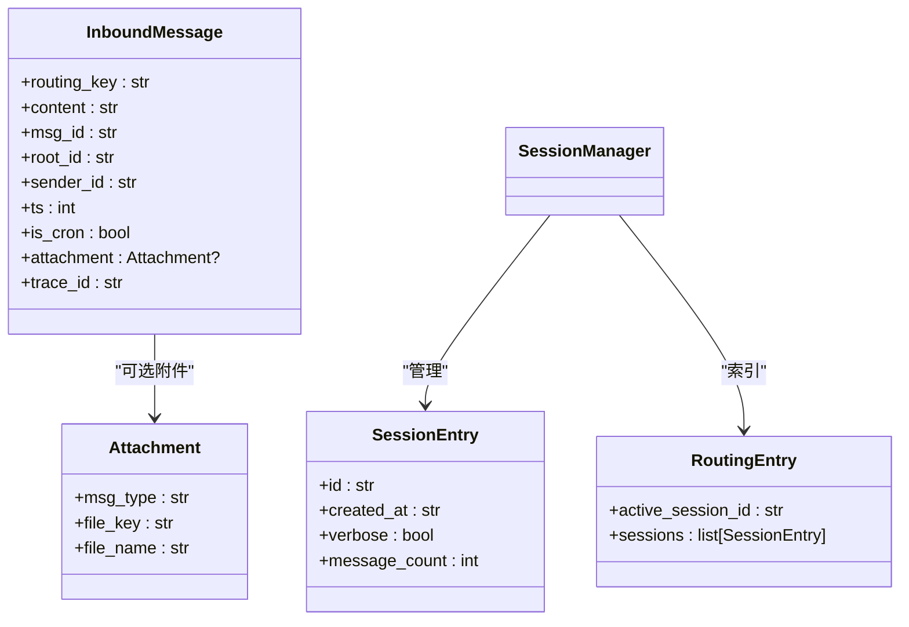
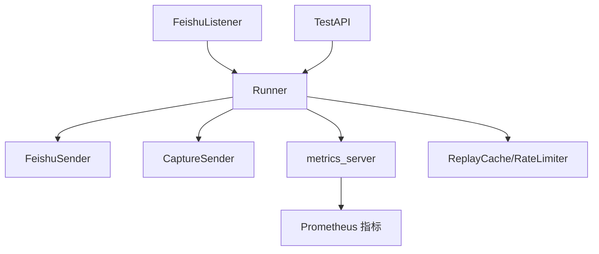

# API 接口参考

<cite>
**本文档引用的文件**
- [docs/04-api.md](file://docs/04-api.md)
- [docs/06-observability.md](file://docs/06-observability.md)
- [xiaopaw/api/test_server.py](file://xiaopaw/api/test_server.py)
- [xiaopaw/api/capture_sender.py](file://xiaopaw/api/capture_sender.py)
- [xiaopaw/api/schemas.py](file://xiaopaw/api/schemas.py)
- [xiaopaw/feishu/listener.py](file://xiaopaw/feishu/listener.py)
- [xiaopaw/feishu/sender.py](file://xiaopaw/feishu/sender.py)
- [xiaopaw/observability/metrics.py](file://xiaopaw/observability/metrics.py)
- [xiaopaw/observability/metrics_server.py](file://xiaopaw/observability/metrics_server.py)
- [xiaopaw/observability/security.py](file://xiaopaw/observability/security.py)
- [xiaopaw/models.py](file://xiaopaw/models.py)
- [xiaopaw/session/manager.py](file://xiaopaw/session/manager.py)
- [xiaopaw/session/models.py](file://xiaopaw/session/models.py)
- [config.yaml.example](file://config.yaml.example)
</cite>

## 目录
1. [简介](#简介)
2. [项目结构](#项目结构)
3. [核心组件](#核心组件)
4. [架构总览](#架构总览)
5. [详细组件分析](#详细组件分析)
6. [依赖分析](#依赖分析)
7. [性能考量](#性能考量)
8. [故障排查指南](#故障排查指南)
9. [结论](#结论)
10. [附录](#附录)

## 简介
本文件为 XiaoPaw v2 的全面 API 接口参考，覆盖以下接口与协议：
- 飞书 WebSocket 入站事件（接收消息与机器人加入群事件）
- TestAPI（开发/测试用的 HTTP 入站接口）
- 飞书 REST 出站接口（发送消息、更新卡片、读取文档/表格/日历、上传文件等）
- 运维端点 /metrics 与 /health
- 内部协议与数据模型（InboundMessage、SenderProtocol、CaptureSender）

文档同时提供协议特定示例、错误处理策略、安全加固（鉴权、速率限制、重放防护）、版本信息、常见用例、客户端实现建议与性能优化技巧，并给出调试与监控方法。

## 项目结构
XiaoPaw v2 将 API 相关能力分布在多个模块中：
- 入站接口：飞书 WebSocket 监听器与 TestAPI HTTP 服务器
- 出站接口：飞书 REST 客户端封装（FeishuSender）与 SDK 调用
- 运维接口：/metrics 与 /health HTTP 服务器
- 数据与协议：核心数据模型、SenderProtocol、会话管理
- 安全与可观测性：速率限制、重放缓存、指标定义与导出

**图表来源**
- [xiaopaw/feishu/listener.py:21-148](file://xiaopaw/feishu/listener.py#L21-L148)
- [xiaopaw/api/test_server.py:19-107](file://xiaopaw/api/test_server.py#L19-L107)
- [xiaopaw/api/capture_sender.py:11-52](file://xiaopaw/api/capture_sender.py#L11-L52)
- [xiaopaw/feishu/sender.py:18-149](file://xiaopaw/feishu/sender.py#L18-L149)
- [xiaopaw/observability/metrics_server.py:40-54](file://xiaopaw/observability/metrics_server.py#L40-L54)
- [xiaopaw/observability/metrics.py:8-64](file://xiaopaw/observability/metrics.py#L8-L64)
- [xiaopaw/models.py:17-35](file://xiaopaw/models.py#L17-L35)
- [xiaopaw/session/manager.py:38-183](file://xiaopaw/session/manager.py#L38-L183)

**章节来源**
- [docs/04-api.md:1-27](file://docs/04-api.md#L1-L27)

## 核心组件
- 飞书 WebSocket 入站监听器：负责建立与飞书的长连接，订阅消息与机器人入群事件，进行重放防护与速率限制，并将消息封装为 InboundMessage 交给 Runner 处理。
- TestAPI HTTP 服务器：提供 /api/test/message 与 /api/test/sessions，用于本地开发与自动化测试，支持 Bearer 鉴权与会话清理。
- FeishuSender：封装飞书 REST API 调用，支持并发限流、重试与 429/限流码识别，支持发送交互卡片与更新卡片。
- 运维 HTTP 服务器：提供 /metrics（Prometheus 文本格式，Bearer 鉴权）与 /health（容器健康检查）。
- SenderProtocol 与 CaptureSender：抽象出发送协议，测试场景下以 CaptureSender 提供同步响应能力。
- 会话管理：SessionManager 负责会话生命周期、历史加载与持久化，支持并发锁与 LRU 缓存。

**章节来源**
- [xiaopaw/feishu/listener.py:21-148](file://xiaopaw/feishu/listener.py#L21-L148)
- [xiaopaw/api/test_server.py:19-107](file://xiaopaw/api/test_server.py#L19-L107)
- [xiaopaw/feishu/sender.py:18-149](file://xiaopaw/feishu/sender.py#L18-L149)
- [xiaopaw/observability/metrics_server.py:40-54](file://xiaopaw/observability/metrics_server.py#L40-L54)
- [xiaopaw/models.py:17-35](file://xiaopaw/models.py#L17-L35)
- [xiaopaw/session/manager.py:38-183](file://xiaopaw/session/manager.py#L38-L183)

## 架构总览
XiaoPaw v2 的接口架构强调“入站少、出站多”与“所有出站必须可重试、所有入站必须可限流”。飞书 WebSocket 作为入站主通道，TestAPI 仅用于开发测试；/metrics 与 /health 提供统一运维端口，采用 Bearer 鉴权保护指标采集。

**图表来源**
- [xiaopaw/api/test_server.py:45-92](file://xiaopaw/api/test_server.py#L45-L92)
- [xiaopaw/api/capture_sender.py:18-51](file://xiaopaw/api/capture_sender.py#L18-L51)
- [xiaopaw/feishu/sender.py:43-70](file://xiaopaw/feishu/sender.py#L43-L70)

**章节来源**
- [docs/04-api.md:16-50](file://docs/04-api.md#L16-L50)

## 详细组件分析

### 飞书 WebSocket 入站（接收消息与机器人入群）
- 接入方式：作为长连接 Client，由飞书主动推送事件，无需公网与证书。
- 订阅事件：im.message.receive_v1（消息）、im.chat.member.bot.added_v1（机器人被拉入群）。
- 鉴权与重放防护：SDK 握手阶段使用 app_secret 校验；应用层通过 ReplayCache 去重（event_id LRU + TTL 5 分钟）。
- 速率限制：默认每用户 20 条/分钟，超限静默丢弃并计数。
- 消息解析：从 content JSON 中提取 text；支持 image/file 附件。
- 入口处理：构建 InboundMessage，打上 trace_id，递增指标 xiaopaw_inbound_total。

**图表来源**
- [xiaopaw/feishu/listener.py:81-147](file://xiaopaw/feishu/listener.py#L81-L147)
- [xiaopaw/observability/security.py:47-73](file://xiaopaw/observability/security.py#L47-L73)
- [xiaopaw/observability/metrics.py:8-12](file://xiaopaw/observability/metrics.py#L8-L12)

**章节来源**
- [docs/04-api.md:52-171](file://docs/04-api.md#L52-L171)
- [xiaopaw/feishu/listener.py:21-148](file://xiaopaw/feishu/listener.py#L21-L148)
- [xiaopaw/observability/security.py:11-73](file://xiaopaw/observability/security.py#L11-L73)
- [xiaopaw/observability/metrics.py:8-12](file://xiaopaw/observability/metrics.py#L8-L12)

### TestAPI（开发/测试用 HTTP 入站）
- 端点清单：
  - POST /api/test/message：模拟用户消息，同步返回 bot 回复
  - POST /api/test/sessions：清空所有会话（危险）
- 鉴权：Bearer Token（XIAOPAW_TESTAPI_TOKEN），且仅允许绑定到 127.0.0.1/localhost。
- 请求体：TestRequest（routing_key、content、msg_id、sender_id、attachment）。
- 响应体：TestResponse（reply、session_id、duration_ms、skills_called）。
- 同步响应机制：通过 CaptureSender 注册 Future，在 Runner 完成处理后设置结果，TestAPI 端等待并返回。

**图表来源**
- [xiaopaw/api/test_server.py:45-92](file://xiaopaw/api/test_server.py#L45-L92)
- [xiaopaw/api/capture_sender.py:18-51](file://xiaopaw/api/capture_sender.py#L18-L51)
- [xiaopaw/api/schemas.py:13-27](file://xiaopaw/api/schemas.py#L13-L27)

**章节来源**
- [docs/04-api.md:173-291](file://docs/04-api.md#L173-L291)
- [xiaopaw/api/test_server.py:19-107](file://xiaopaw/api/test_server.py#L19-L107)
- [xiaopaw/api/capture_sender.py:11-52](file://xiaopaw/api/capture_sender.py#L11-L52)
- [xiaopaw/api/schemas.py:1-27](file://xiaopaw/api/schemas.py#L1-L27)

### 飞书 REST 出站（发送/更新卡片、读取文档/表格/日历、上传文件）
- SDK 客户端：lark-oapi Client，自动管理 tenant_access_token。
- 发送消息：send(routing_key, content) → interactive 卡片（Markdown）。
- 更新卡片：update_card(card_msg_id, content)。
- 发送思考态：send_thinking(routing_key, text) → 返回 card_msg_id；失败则跳过更新，改用 send。
- 并发与限流：Semaphore(5)，避免飞书 429。
- 429 识别：SDK code 与 HTTP 429 双通道识别，结合指数退避重试。
- 附件：支持 image/file 上传后通过消息发送。

**图表来源**
- [xiaopaw/feishu/sender.py:18-149](file://xiaopaw/feishu/sender.py#L18-L149)
- [xiaopaw/models.py:30-35](file://xiaopaw/models.py#L30-L35)

**章节来源**
- [docs/04-api.md:293-398](file://docs/04-api.md#L293-L398)
- [xiaopaw/feishu/sender.py:18-149](file://xiaopaw/feishu/sender.py#L18-L149)

### /metrics 与 /health（运维）
- 端口：8090（统一 aiohttp Application）
- /health：无鉴权，返回状态、git_sha、uptime_sec、started_at
- /metrics：Bearer Token 鉴权（XIAOPAW_METRICS_TOKEN），返回 Prometheus 文本格式
- 指标：inbound_total、agent_latency、llm_calls_total、llm_latency、external_api_retry_total、skill_timeout_total、feishu_rate_limit_total、cron_dlq_total

**图表来源**
- [xiaopaw/observability/metrics_server.py:22-37](file://xiaopaw/observability/metrics_server.py#L22-L37)
- [xiaopaw/observability/metrics.py:8-64](file://xiaopaw/observability/metrics.py#L8-L64)

**章节来源**
- [docs/04-api.md:666-721](file://docs/04-api.md#L666-L721)
- [docs/06-observability.md:526-620](file://docs/06-observability.md#L526-L620)
- [xiaopaw/observability/metrics_server.py:18-54](file://xiaopaw/observability/metrics_server.py#L18-L54)
- [xiaopaw/observability/metrics.py:8-64](file://xiaopaw/observability/metrics.py#L8-L64)

### 内部协议与数据模型
- SenderProtocol：抽象发送接口，v2.1 调用点移除 root_id 参数，话题消息定位由 routing_key 承载。
- InboundMessage：统一入站消息结构，新增 trace_id 字段。
- CaptureSender：测试专用 Sender，基于 asyncio.Future 提供同步等待与一次性回复。
- SessionManager：会话索引与历史存储（index.json + 每会话 JSONL），支持并发锁与 LRU 锁缓存。

**图表来源**
- [xiaopaw/models.py:17-35](file://xiaopaw/models.py#L17-L35)
- [xiaopaw/session/models.py:18-38](file://xiaopaw/session/models.py#L18-L38)
- [xiaopaw/session/manager.py:38-183](file://xiaopaw/session/manager.py#L38-L183)

**章节来源**
- [docs/04-api.md:722-754](file://docs/04-api.md#L722-L754)
- [xiaopaw/models.py:17-35](file://xiaopaw/models.py#L17-L35)
- [xiaopaw/session/models.py:18-38](file://xiaopaw/session/models.py#L18-L38)
- [xiaopaw/session/manager.py:38-183](file://xiaopaw/session/manager.py#L38-L183)

## 依赖分析
- 入站与出站解耦：FeishuListener 与 FeishuSender 分别负责入站与出站，通过 Runner 协调。
- 测试与生产隔离：TestAPI 仅开发可用，生产强制禁用；/metrics 仅 Bearer 可访问。
- 安全与可观测性：ReplayCache 与 RateLimiter 保障入站安全；Prometheus 指标覆盖关键路径。

**图表来源**
- [xiaopaw/feishu/listener.py:21-148](file://xiaopaw/feishu/listener.py#L21-L148)
- [xiaopaw/api/test_server.py:19-107](file://xiaopaw/api/test_server.py#L19-L107)
- [xiaopaw/feishu/sender.py:18-149](file://xiaopaw/feishu/sender.py#L18-L149)
- [xiaopaw/observability/metrics_server.py:40-54](file://xiaopaw/observability/metrics_server.py#L40-L54)
- [xiaopaw/observability/metrics.py:8-64](file://xiaopaw/observability/metrics.py#L8-L64)
- [xiaopaw/observability/security.py:11-73](file://xiaopaw/observability/security.py#L11-L73)

**章节来源**
- [docs/04-api.md:1-50](file://docs/04-api.md#L1-L50)

## 性能考量
- 并发与限流：FeishuSender 使用 Semaphore(5) 控制并发，避免 429；RateLimiter 默认每用户 20 条/分钟。
- 指标观测：agent_latency、llm_latency、inbound_total、feishu_rate_limit_total 等帮助定位瓶颈。
- 重试策略：外部 API 调用统一使用 tenacity 指数退避；飞书 REST 识别 429 与特定 SDK 错误码。
- I/O 优化：会话写入使用 asyncio.to_thread 与锁缓存，降低竞争与阻塞。

**章节来源**
- [docs/04-api.md:45-49](file://docs/04-api.md#L45-L49)
- [xiaopaw/feishu/sender.py:18-149](file://xiaopaw/feishu/sender.py#L18-L149)
- [xiaopaw/observability/metrics.py:18-43](file://xiaopaw/observability/metrics.py#L18-L43)
- [xiaopaw/session/manager.py:18-46](file://xiaopaw/session/manager.py#L18-L46)

## 故障排查指南
- /metrics 401：检查 XIAOPAW_METRICS_TOKEN 是否正确配置与传递（Bearer）。
- /metrics 501：未安装 prometheus_client。
- /health 200：仅表示进程存活，业务健康需结合指标与告警。
- 飞书 WebSocket：断线由 SDK 自动重连；如持续不可用，检查 app_id/app_secret 与网络。
- 429/限流：关注 feishu_rate_limit_total 指标，调整并发或退避策略。
- TestAPI 401：确认 Authorization 头与 XIAOPAW_TESTAPI_TOKEN。
- 会话异常：检查 data/sessions 与 index.json 权限与磁盘空间。

**章节来源**
- [docs/04-api.md:666-721](file://docs/04-api.md#L666-L721)
- [docs/06-observability.md:526-620](file://docs/06-observability.md#L526-L620)
- [xiaopaw/observability/metrics_server.py:22-37](file://xiaopaw/observability/metrics_server.py#L22-L37)
- [xiaopaw/observability/security.py:11-73](file://xiaopaw/observability/security.py#L11-L73)

## 结论
XiaoPaw v2 的 API 设计以安全与可观测为核心，入站采用飞书 WebSocket 并辅以应用层重放与速率限制，出站统一通过 FeishuSender 与 SDK 管理，TestAPI 仅限开发使用，/metrics 与 /health 提供统一运维入口。通过完善的指标与错误处理策略，系统具备良好的可维护性与可扩展性。

## 附录

### 接口规范速览
- 飞书 WebSocket 入站
  - 事件：im.message.receive_v1、im.chat.member.bot.added_v1
  - 鉴权：SDK 握手使用 app_secret；应用层 ReplayCache 去重
  - 速率限制：每用户 20 条/分钟
- TestAPI
  - POST /api/test/message：同步返回 reply、session_id、duration_ms、trace_id
  - POST /api/test/sessions：清空会话
  - 鉴权：Bearer Token + 仅 127.0.0.1 绑定
- 飞书 REST 出站
  - 发送/更新卡片、读取文档/表格/日历、上传文件
  - 并发：Semaphore(5)；429 识别与指数退避
- 运维
  - GET /metrics：Bearer Token；Prometheus 文本
  - GET /health：无鉴权；返回进程存活信息

**章节来源**
- [docs/04-api.md:29-44](file://docs/04-api.md#L29-L44)
- [docs/04-api.md:52-171](file://docs/04-api.md#L52-L171)
- [docs/04-api.md:173-291](file://docs/04-api.md#L173-L291)
- [docs/04-api.md:293-398](file://docs/04-api.md#L293-L398)
- [docs/04-api.md:666-721](file://docs/04-api.md#L666-L721)

### 配置与环境变量
- config.yaml 示例字段（节选）
  - debug.enable_test_api、test_api_host、test_api_port、test_api_token
  - observability.metrics_host、metrics_port
  - rate_limit.per_user_per_minute
  - replay_cache.maxsize、ttl_sec
- 环境变量
  - XIAOPAW_TESTAPI_TOKEN（TestAPI 鉴权）
  - XIAOPAW_METRICS_TOKEN（/metrics 鉴权）
  - XIAOPAW_ENV（生产强制 token 存在）

**章节来源**
- [config.yaml.example:45-58](file://config.yaml.example#L45-L58)
- [config.yaml.example:60-66](file://config.yaml.example#L60-L66)
- [xiaopaw/observability/metrics_server.py:22-29](file://xiaopaw/observability/metrics_server.py#L22-L29)
- [xiaopaw/api/test_server.py:37-42](file://xiaopaw/api/test_server.py#L37-L42)