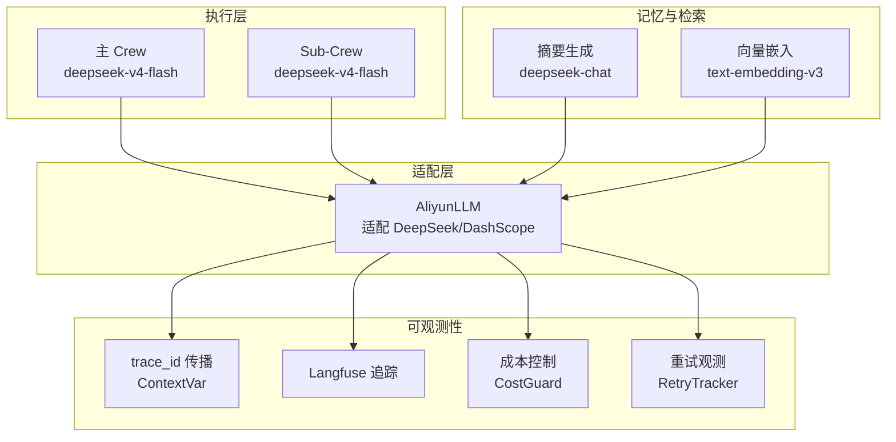
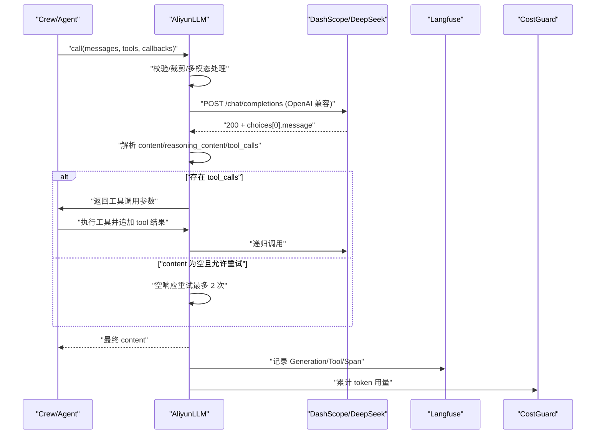
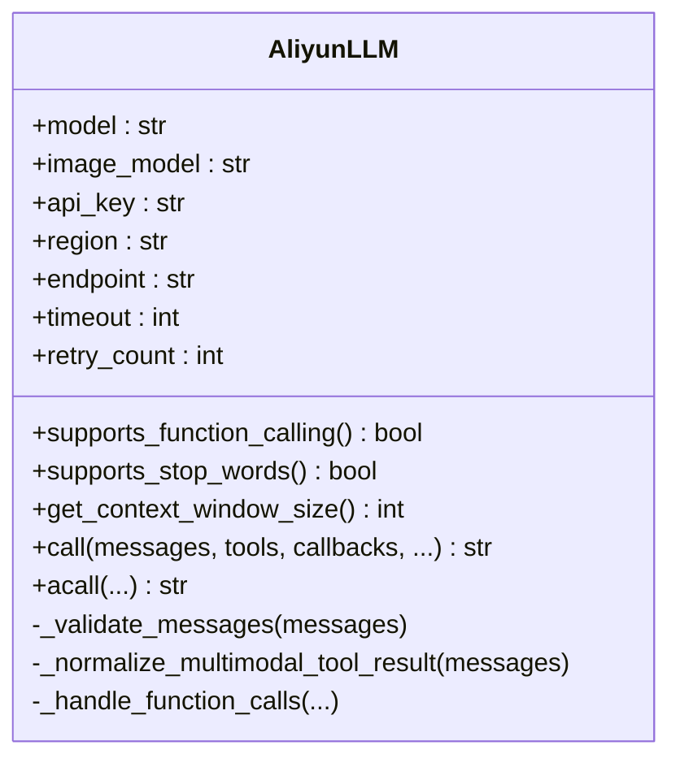
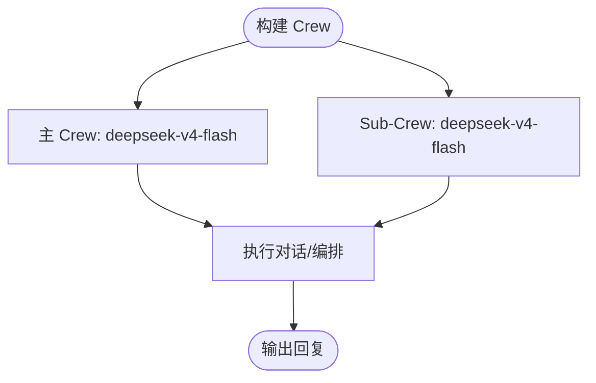
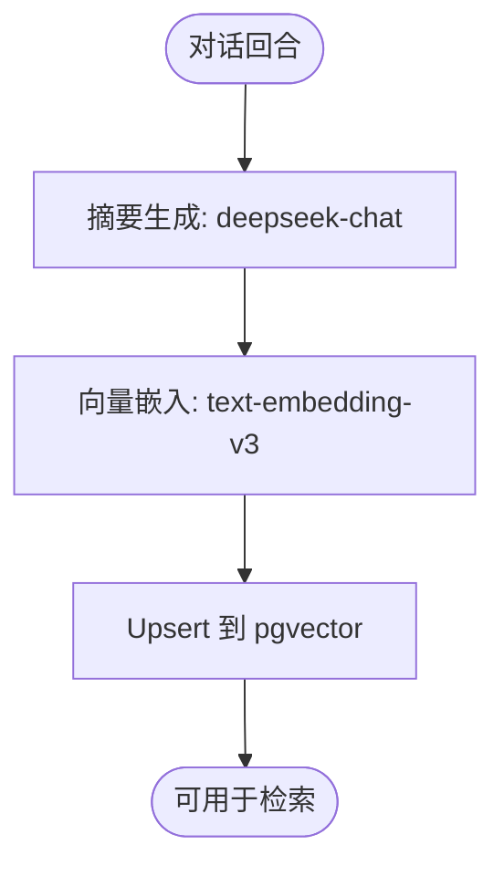
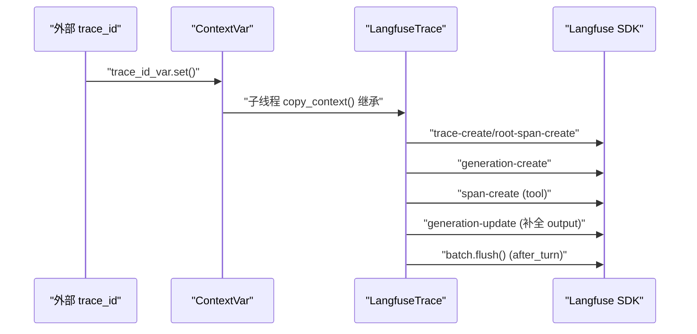
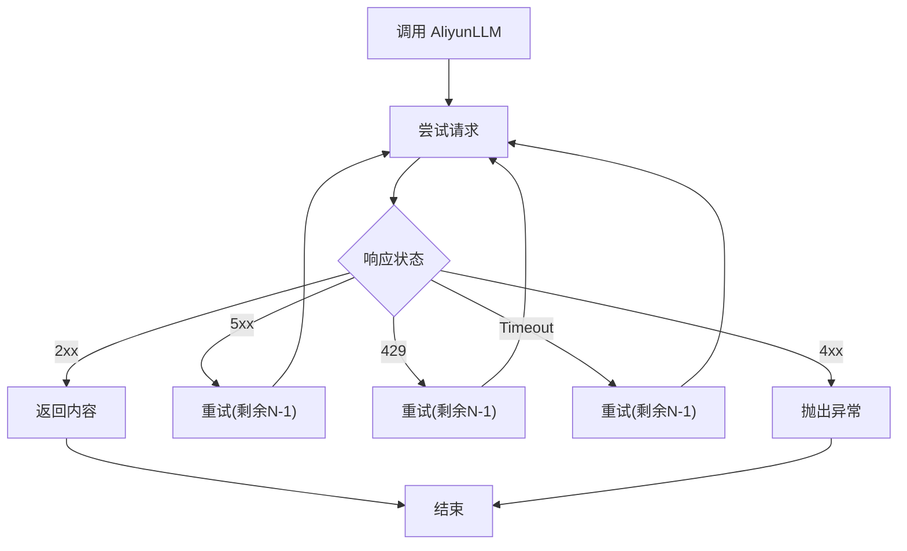
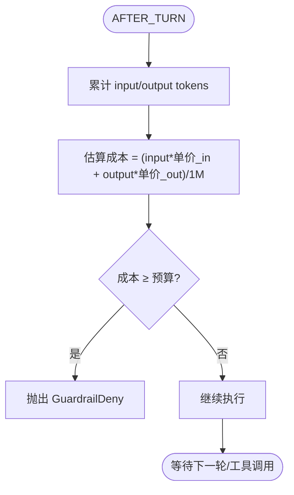
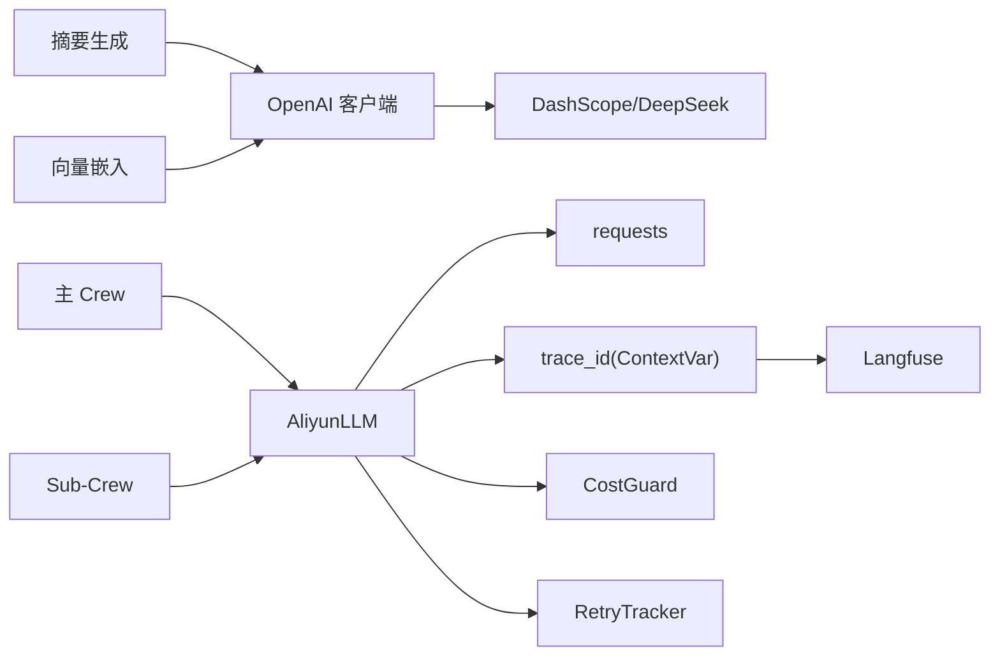

# DeepSeek DashScope API（出站）

<cite>
**本文引用的文件**   
- [aliyun_llm.py](file://xiaopaw/llm/aliyun_llm.py)
- [main_crew.py](file://xiaopaw/agents/main_crew.py)
- [skill_crew.py](file://xiaopaw/agents/skill_crew.py)
- [indexer.py](file://xiaopaw/memory/indexer.py)
- [search.py](file://xiaopaw/skills/search_memory/scripts/search.py)
- [DEEPSEEK_CONFIG.md](file://DEEPSEEK_CONFIG.md)
- [config.yaml.example](file://config.yaml.example)
- [langfuse_trace.py](file://shared_hooks/langfuse_trace.py)
- [trace.py](file://xiaopaw/observability/trace.py)
- [cost_guard.py](file://shared_hooks/cost_guard.py)
- [retry_tracker.py](file://shared_hooks/retry_tracker.py)
- [retry.py](file://xiaopaw/utils/retry.py)
- [test_adapter_integration.py](file://tests/integration/test_adapter_integration.py)
</cite>

## 目录
1. [简介](#简介)
2. [项目结构](#项目结构)
3. [核心组件](#核心组件)
4. [架构总览](#架构总览)
5. [详细组件分析](#详细组件分析)
6. [依赖分析](#依赖分析)
7. [性能考量](#性能考量)
8. [故障排查指南](#故障排查指南)
9. [结论](#结论)
10. [附录](#附录)

## 简介
本文件面向 DeepSeek DashScope API 的“出站”调用，聚焦 AliyunLLM 适配层的实现原理与使用实践，覆盖以下要点：
- OpenAI 兼容格式支持：统一消息结构、函数调用与工具调用、多模态输入处理
- trace_id 注入机制：基于 ContextVar 的跨线程传播与 Langfuse 全链路追踪
- 重试策略：基于 requests 的指数退避重试（含 5xx、429、超时等场景）
- 模型选择与用途：deepseek-v4-flash（主对话与 Sub-Crew）、deepseek-chat（摘要）、text-embedding-v3（向量嵌入）
- 连接端点配置、超时设置（默认 120s）、重试次数（默认 2 次）
- 错误语义处理：状态码分级、异常重抛、可观测性与成本控制

## 项目结构
围绕 DeepSeek DashScope 出站调用的相关模块分布如下：
- LLM 适配层：AliyunLLM（适配 CrewAI BaseLLM，封装 DashScope/DeepSeek 兼容请求）
- Agent 执行层：主 Crew 与 Sub-Crew（分别指定主对话与子任务模型）
- 记忆与检索：摘要生成与向量嵌入（OpenAI 兼容客户端）
- 可观测性：Langfuse 全链路追踪、trace_id 传播、成本与重试观测
- 配置：环境变量与 YAML 配置项

**图表来源**
- [aliyun_llm.py:77-294](file://xiaopaw/llm/aliyun_llm.py#L77-L294)
- [main_crew.py:160-182](file://xiaopaw/agents/main_crew.py#L160-L182)
- [skill_crew.py:98-136](file://xiaopaw/agents/skill_crew.py#L98-L136)
- [indexer.py:32-96](file://xiaopaw/memory/indexer.py#L32-L96)
- [langfuse_trace.py:137-294](file://shared_hooks/langfuse_trace.py#L137-L294)
- [cost_guard.py:34-100](file://shared_hooks/cost_guard.py#L34-L100)
- [retry_tracker.py:21-68](file://shared_hooks/retry_tracker.py#L21-L68)

**章节来源**
- [aliyun_llm.py:77-294](file://xiaopaw/llm/aliyun_llm.py#L77-L294)
- [main_crew.py:160-182](file://xiaopaw/agents/main_crew.py#L160-L182)
- [skill_crew.py:98-136](file://xiaopaw/agents/skill_crew.py#L98-L136)
- [indexer.py:32-96](file://xiaopaw/memory/indexer.py#L32-L96)
- [DEEPSEEK_CONFIG.md:1-149](file://DEEPSEEK_CONFIG.md#L1-L149)

## 核心组件
- AliyunLLM：CrewAI BaseLLM 适配器，负责将 CrewAI 的消息格式转换为 OpenAI 兼容的请求体，调用 DashScope/DeepSeek 的 chat.completions 接口，并处理函数调用、工具调用、多模态输入、超时与重试等。
- 主 Crew 与 Sub-Crew：分别在 orchestrator 与 skill_crew 中实例化 AliyunLLM，模型分别为 deepseek-v4-flash，满足主对话与子任务的通用需求。
- 记忆与检索：摘要生成采用 deepseek-chat，向量嵌入采用 text-embedding-v3，两者均通过 OpenAI 兼容客户端调用。
- 可观测性：trace_id 通过 ContextVar 在线程间传播，Langfuse 将 Hook 事件映射为 trace 树；CostGuard 估算成本并按预算阻断；RetryTracker 观测工具稳定性。

**章节来源**
- [aliyun_llm.py:77-294](file://xiaopaw/llm/aliyun_llm.py#L77-L294)
- [main_crew.py:160-182](file://xiaopaw/agents/main_crew.py#L160-L182)
- [skill_crew.py:98-136](file://xiaopaw/agents/skill_crew.py#L98-L136)
- [indexer.py:32-96](file://xiaopaw/memory/indexer.py#L32-L96)
- [langfuse_trace.py:137-294](file://shared_hooks/langfuse_trace.py#L137-L294)
- [cost_guard.py:34-100](file://shared_hooks/cost_guard.py#L34-L100)
- [retry_tracker.py:21-68](file://shared_hooks/retry_tracker.py#L21-L68)

## 架构总览
DeepSeek 出站调用的端到端流程如下：
- 输入消息经 AliyunLLM 校验与裁剪，按需注入工具调用与多模态内容
- 通过 requests 发送 OpenAI 兼容请求至 DashScope/DeepSeek 端点
- 处理响应：提取 content、reasoning_content、tool_calls
- 若存在 tool_calls，按可用函数执行并递归调用；若 content 为空且允许重试，进行有限次空响应重试
- 通过 Langfuse 记录 LLM/Geneartion/Tool/Span 等观测数据
- 通过 CostGuard 与 RetryTracker 实现成本与重试观测

**图表来源**
- [aliyun_llm.py:153-264](file://xiaopaw/llm/aliyun_llm.py#L153-L264)
- [langfuse_trace.py:327-463](file://shared_hooks/langfuse_trace.py#L327-L463)
- [cost_guard.py:52-82](file://shared_hooks/cost_guard.py#L52-L82)

## 详细组件分析

### AliyunLLM 适配层
- OpenAI 兼容格式支持
  - 消息角色校验：system/user/assistant/tool
  - 工具调用参数规范化：将字符串形式的布尔/None/True/False 转换为字面量
  - 工具结果裁剪：限制单条 tool content 最大字符数，避免超限
  - 多模态输入：识别 base64 图片或 URL，转为 OpenAI 兼容的 multimodal content
- 端点与区域：根据 region 选择 dashscope 国内/国际/金融等端点；默认 deepseek 官方端点
- 超时与重试：默认超时 600s；默认重试 2 次；对 5xx、429、Timeout 分别处理
- 函数/工具调用：支持 function calling 与 tool use；DeepSeek 特有的 reasoning_content 会回填到后续请求
- 异步调用：acall 通过线程池包装同步 call

**图表来源**
- [aliyun_llm.py:77-294](file://xiaopaw/llm/aliyun_llm.py#L77-L294)

**章节来源**
- [aliyun_llm.py:77-294](file://xiaopaw/llm/aliyun_llm.py#L77-L294)

### 主 Crew 与 Sub-Crew 的模型选择
- 主 Crew（orchestrator）：使用 deepseek-v4-flash，温度 0.3，适合主对话与综合编排
- Sub-Crew（技能子任务）：使用 deepseek-v4-flash，温度 0.3，适合特定技能执行
- 配置来源：YAML 中 agent.model 与 agent.sub_agent_model 均指向 deepseek-v4-flash

**图表来源**
- [main_crew.py:160-182](file://xiaopaw/agents/main_crew.py#L160-L182)
- [skill_crew.py:98-136](file://xiaopaw/agents/skill_crew.py#L98-L136)
- [config.yaml.example:12-18](file://config.yaml.example#L12-L18)

**章节来源**
- [main_crew.py:160-182](file://xiaopaw/agents/main_crew.py#L160-L182)
- [skill_crew.py:98-136](file://xiaopaw/agents/skill_crew.py#L98-L136)
- [config.yaml.example:12-18](file://config.yaml.example#L12-L18)

### 摘要与向量嵌入（用于 qwen3-turbo 与 text-embedding-v3）
- 摘要模型：deepseek-chat，用于生成对话摘要，max_tokens=200
- 向量嵌入：text-embedding-v3，维度 1024，用于 pgvector 检索
- 客户端：OpenAI 兼容客户端，基于 DEEPSEEK_API_KEY/QWEN_API_KEY 与 DEEPSEEK_BASE_URL/QWEN_BASE_URL

**图表来源**
- [indexer.py:32-96](file://xiaopaw/memory/indexer.py#L32-L96)
- [search.py:41-56](file://xiaopaw/skills/search_memory/scripts/search.py#L41-L56)

**章节来源**
- [indexer.py:32-96](file://xiaopaw/memory/indexer.py#L32-L96)
- [search.py:41-56](file://xiaopaw/skills/search_memory/scripts/search.py#L41-L56)
- [DEEPSEEK_CONFIG.md:55-64](file://DEEPSEEK_CONFIG.md#L55-L64)

### trace_id 注入与 Langfuse 全链路追踪
- trace_id 传播：通过 ContextVar 在主线程与子线程（Sub-Crew）之间传递
- Langfuse 机制：
  - 机制一：多轮对话同 trace（trace_id = session_id）
  - 机制二：Sub-Crew 自动挂父 trace（copy_context 自动传播）
  - 机制三：Span 栈维护嵌套关系（LIFO）
  - 机制四：Generation 先写后更新（before_llm_handler 关闭上一个 generation 并补全工具输出）
  - 机制五：强制 flush（after_turn_handler 结束时批量提交）
- 事件映射：before_turn/before_llm/before_tool/after_tool/after_turn/task_complete 等

**图表来源**
- [trace.py:13-34](file://xiaopaw/observability/trace.py#L13-L34)
- [langfuse_trace.py:137-294](file://shared_hooks/langfuse_trace.py#L137-L294)
- [langfuse_trace.py:297-463](file://shared_hooks/langfuse_trace.py#L297-L463)
- [langfuse_trace.py:595-709](file://shared_hooks/langfuse_trace.py#L595-L709)

**章节来源**
- [trace.py:13-34](file://xiaopaw/observability/trace.py#L13-L34)
- [langfuse_trace.py:137-294](file://shared_hooks/langfuse_trace.py#L137-L294)
- [langfuse_trace.py:297-463](file://shared_hooks/langfuse_trace.py#L297-L463)
- [langfuse_trace.py:595-709](file://shared_hooks/langfuse_trace.py#L595-L709)

### 重试策略与错误语义处理
- AliyunLLM 内部重试：对 5xx、429、Timeout 进行指数退避重试，默认重试 2 次；其余 4xx 明确报错
- Hook 层重试观测：RetryTracker 记录工具连续失败与成功重试次数，计算 retry_success_rate
- 集成测试验证：对 5xx/Timeout/Rate Limit 的重试行为进行断言

**图表来源**
- [aliyun_llm.py:194-263](file://xiaopaw/llm/aliyun_llm.py#L194-L263)
- [retry_tracker.py:30-57](file://shared_hooks/retry_tracker.py#L30-L57)

**章节来源**
- [aliyun_llm.py:194-263](file://xiaopaw/llm/aliyun_llm.py#L194-L263)
- [retry_tracker.py:30-57](file://shared_hooks/retry_tracker.py#L30-L57)
- [test_adapter_integration.py:40-138](file://tests/integration/test_adapter_integration.py#L40-L138)

### 成本控制与监控
- 成本估算：CostGuard 基于输入/输出 token 数量与模型单价估算美元成本
- 预算阻断：超出预算时抛出拒绝（GuardrailDeny）
- 指标输出：total_input_tokens、total_output_tokens、estimated_cost_usd、deny_count
- 与 Hook 协作：AFTER_TURN 累计 token；BEFORE_TOOL_CALL 再次检查预算，防止单轮提前消费

**图表来源**
- [cost_guard.py:52-82](file://shared_hooks/cost_guard.py#L52-L82)
- [cost_guard.py:92-100](file://shared_hooks/cost_guard.py#L92-L100)

**章节来源**
- [cost_guard.py:34-100](file://shared_hooks/cost_guard.py#L34-L100)
- [test_adapter_integration.py:70-82](file://tests/integration/test_adapter_integration.py#L70-L82)

## 依赖分析
- AliyunLLM 依赖 requests 发送 HTTP 请求，内部处理状态码与 JSON 解析
- 主/子 Crew 通过 AliyunLLM 使用 deepseek-v4-flash
- 记忆与检索使用 OpenAI 兼容客户端调用 deepseek-chat 与 text-embedding-v3
- 可观测性依赖 Langfuse SDK 与 ContextVar 传播 trace_id
- 成本与重试观测通过 Hook 框架注册事件处理器

**图表来源**
- [aliyun_llm.py:14-19](file://xiaopaw/llm/aliyun_llm.py#L14-L19)
- [main_crew.py:160-182](file://xiaopaw/agents/main_crew.py#L160-L182)
- [skill_crew.py:98-136](file://xiaopaw/agents/skill_crew.py#L98-L136)
- [indexer.py:12-24](file://xiaopaw/memory/indexer.py#L12-L24)
- [langfuse_trace.py:40-100](file://shared_hooks/langfuse_trace.py#L40-L100)
- [cost_guard.py:18-28](file://shared_hooks/cost_guard.py#L18-L28)
- [retry_tracker.py:18-28](file://shared_hooks/retry_tracker.py#L18-L28)

**章节来源**
- [aliyun_llm.py:14-19](file://xiaopaw/llm/aliyun_llm.py#L14-L19)
- [indexer.py:12-24](file://xiaopaw/memory/indexer.py#L12-L24)
- [langfuse_trace.py:40-100](file://shared_hooks/langfuse_trace.py#L40-L100)
- [cost_guard.py:18-28](file://shared_hooks/cost_guard.py#L18-L28)
- [retry_tracker.py:18-28](file://shared_hooks/retry_tracker.py#L18-L28)

## 性能考量
- 超时与重试：默认超时 600s，重试 2 次；对于高延迟网络可适当提高 LLM_RETRY_COUNT 或调整 LLM 超时
- 上下文窗口：deepseek-v4-flash 上下文窗口可达 131,072；长对话建议启用压缩与裁剪
- 成本控制：通过 CostGuard 限制预算，结合模型选择与温度调优降低 token 消耗
- 观测开销：Langfuse 批量提交（batch size=50），在 after_turn_handler 强制 flush，确保可见性

[本节为通用指导，不直接分析具体文件]

## 故障排查指南
- 5xx/429/Timeout：AliyunLLM 已内置重试；如仍失败，检查 API Key、端点与网络连通性
- 4xx 错误：通常为参数或权限问题，查看响应体与日志
- 空响应：当 content 为空时，AliyunLLM 会进行有限次重试；若仍为空，检查工具调用与消息格式
- Langfuse 无数据：确认 TRACE_TO_LANGFUSE=true，以及 Langfuse 公钥/密钥/基础地址配置
- 成本超支：检查 COST_GUARD_BUDGET 与模型单价；必要时降低温度或缩短上下文

**章节来源**
- [aliyun_llm.py:194-263](file://xiaopaw/llm/aliyun_llm.py#L194-L263)
- [langfuse_trace.py:60-100](file://shared_hooks/langfuse_trace.py#L60-L100)
- [cost_guard.py:36-44](file://shared_hooks/cost_guard.py#L36-L44)

## 结论
AliyunLLM 通过 OpenAI 兼容接口无缝对接 DeepSeek/DashScope，提供稳定的函数/工具调用、多模态输入与可观测性支持。结合主/子 Crew 的模型选择、摘要与向量嵌入的检索增强，以及成本与重试观测策略，可在保证可靠性的同时优化资源消耗与用户体验。

[本节为总结性内容，不直接分析具体文件]

## 附录

### 端点与模型配置速查
- 主对话模型：deepseek-v4-flash（主 Crew 与 Sub-Crew）
- 摘要模型：deepseek-chat（max_tokens=200）
- 向量嵌入：text-embedding-v3（dimensions=1024）
- 端点：DashScope 国内/国际/金融兼容端点；默认 DeepSeek 官方端点
- 超时：默认 600s；可通过配置调整
- 重试：默认 2 次

**章节来源**
- [DEEPSEEK_CONFIG.md:26-64](file://DEEPSEEK_CONFIG.md#L26-L64)
- [config.yaml.example:12-20](file://config.yaml.example#L12-L20)
- [main_crew.py:160-182](file://xiaopaw/agents/main_crew.py#L160-L182)
- [skill_crew.py:98-136](file://xiaopaw/agents/skill_crew.py#L98-L136)
- [indexer.py:32-96](file://xiaopaw/memory/indexer.py#L32-L96)