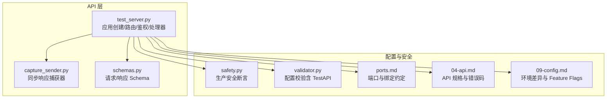
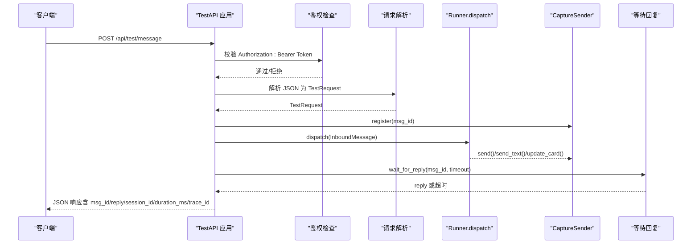
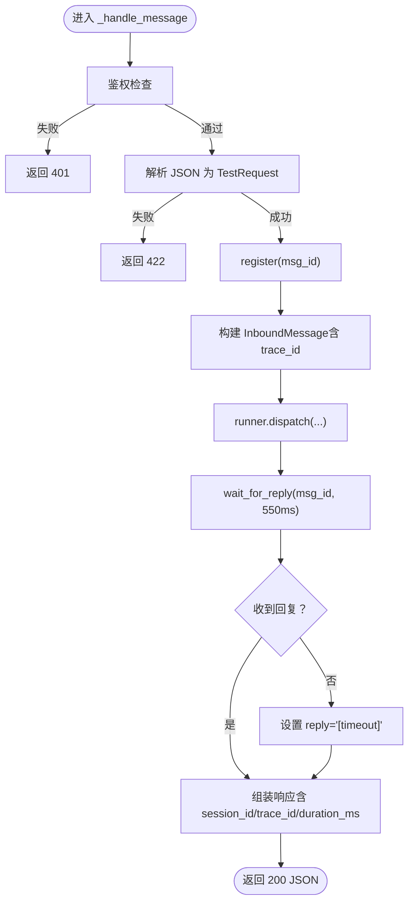
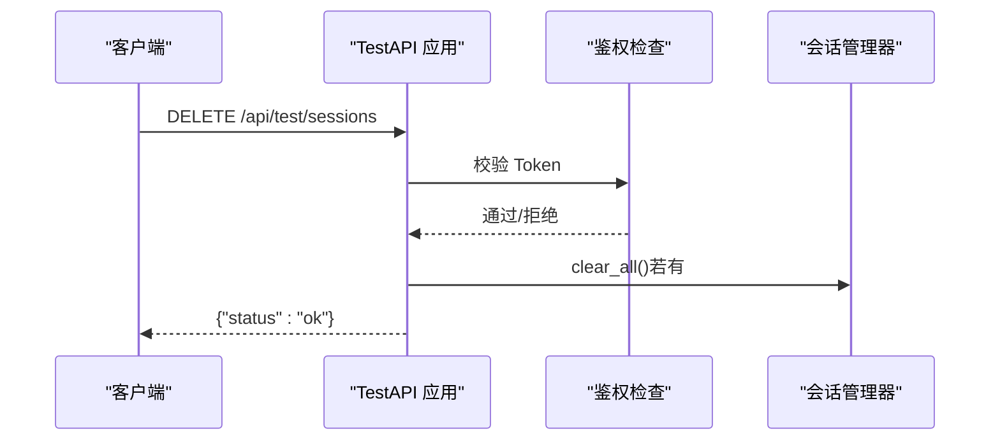
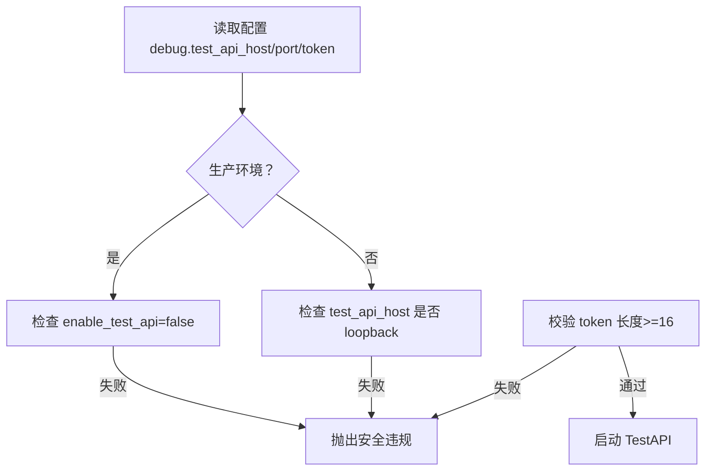
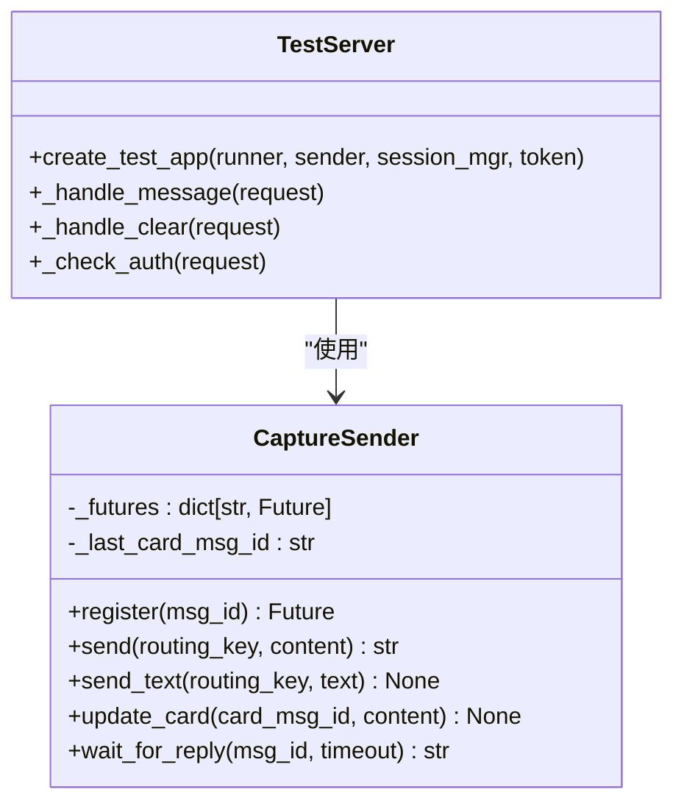
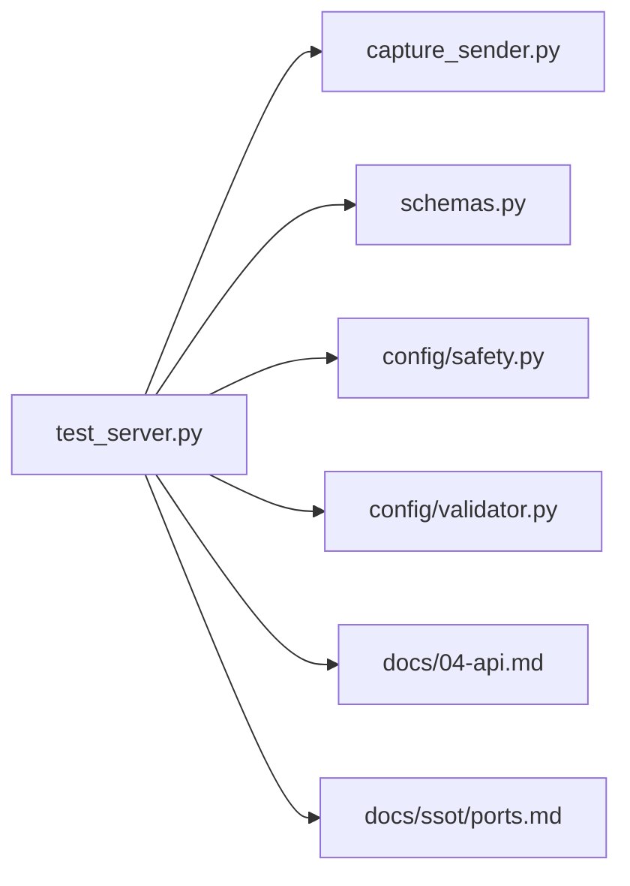

# TestAPI（入站）

<cite>
**本文引用的文件**
- [test_server.py](file://xiaopaw/api/test_server.py)
- [capture_sender.py](file://xiaopaw/api/capture_sender.py)
- [schemas.py](file://xiaopaw/api/schemas.py)
- [safety.py](file://xiaopaw/config/safety.py)
- [validator.py](file://xiaopaw/config/validator.py)
- [04-api.md](file://docs/04-api.md)
- [09-config.md](file://docs/09-config.md)
- [ports.md](file://docs/ssot/ports.md)
- [README.md](file://README.md)
- [conftest.py](file://tests/e2e/conftest.py)
</cite>

## 目录
1. [简介](#简介)
2. [项目结构](#项目结构)
3. [核心组件](#核心组件)
4. [架构总览](#架构总览)
5. [详细组件分析](#详细组件分析)
6. [依赖关系分析](#依赖关系分析)
7. [性能考量](#性能考量)
8. [故障排查指南](#故障排查指南)
9. [结论](#结论)
10. [附录](#附录)

## 简介
本文件为 TestAPI（入站）的全面 API 文档，聚焦两条核心端点：
- POST /api/test/message：模拟入站消息，同步返回 Agent 回复
- DELETE /api/test/sessions：清空所有会话（危险操作）

文档还系统阐述 v2.1 版本的安全加固措施（127.0.0.1 绑定限制、Bearer Token 鉴权、Token 长度要求与生产禁用策略），并深入解析 CaptureSender 同步响应机制的实现原理与使用示例。

## 项目结构
TestAPI 相关代码位于 xiaopaw/api 目录，核心文件如下：
- test_server.py：TestAPI 应用创建、路由注册、鉴权与处理器
- capture_sender.py：CaptureSender 同步响应捕获器
- schemas.py：TestAPI 请求/响应 Schema（TestRequest/TestResponse）

**图表来源**
- [test_server.py:19-34](file://xiaopaw/api/test_server.py#L19-L34)
- [capture_sender.py:11-52](file://xiaopaw/api/capture_sender.py#L11-L52)
- [schemas.py:8-27](file://xiaopaw/api/schemas.py#L8-L27)
- [safety.py:27-48](file://xiaopaw/config/safety.py#L27-L48)
- [validator.py:60-65](file://xiaopaw/config/validator.py#L60-L65)
- [ports.md:35-89](file://docs/ssot/ports.md#L35-L89)
- [04-api.md:34-35](file://docs/04-api.md#L34-L35)

**章节来源**
- [test_server.py:19-34](file://xiaopaw/api/test_server.py#L19-L34)
- [capture_sender.py:11-52](file://xiaopaw/api/capture_sender.py#L11-L52)
- [schemas.py:8-27](file://xiaopaw/api/schemas.py#L8-L27)
- [validator.py:60-65](file://xiaopaw/config/validator.py#L60-L65)

## 核心组件
- TestAPI 应用与路由
  - 应用创建：注册 /api/test/message（POST）与 /api/test/sessions（DELETE）
  - 鉴权：基于 Authorization: Bearer Token 的运行时校验
- CaptureSender 同步响应捕获器
  - 为每个 msg_id 注册 Future，等待 Agent 回复
  - 提供 send/send_text/update_card 等异步方法，供 Runner 调用
- Schema
  - TestRequest：routing_key、content、msg_id、sender_id、attachment
  - TestResponse：msg_id、reply、session_id、duration_ms、skills_called

**章节来源**
- [test_server.py:31-32](file://xiaopaw/api/test_server.py#L31-L32)
- [test_server.py:37-42](file://xiaopaw/api/test_server.py#L37-L42)
- [capture_sender.py:14-22](file://xiaopaw/api/capture_sender.py#L14-L22)
- [capture_sender.py:24-42](file://xiaopaw/api/capture_sender.py#L24-L42)
- [schemas.py:13-18](file://xiaopaw/api/schemas.py#L13-L18)
- [schemas.py:21-27](file://xiaopaw/api/schemas.py#L21-L27)

## 架构总览
TestAPI 的请求处理链路如下：

**图表来源**
- [test_server.py:45-92](file://xiaopaw/api/test_server.py#L45-L92)
- [capture_sender.py:18-22](file://xiaopaw/api/capture_sender.py#L18-L22)
- [capture_sender.py:44-51](file://xiaopaw/api/capture_sender.py#L44-L51)

## 详细组件分析

### /api/test/message 端点
- 方法与路由
  - POST /api/test/message
- 鉴权
  - 若配置了 token，则必须提供 Authorization: Bearer <token>，否则 401
- 请求体 Schema（TestRequest）
  - routing_key：必填，会话标识
  - content：可选，默认空字符串
  - msg_id：可选，若未提供则自动生成
  - sender_id：可选，默认 ou_test001
  - attachment：可选，包含 file_path、file_name
- 处理流程
  - 注册 msg_id 对应 Future
  - 构造 InboundMessage（含 trace_id）
  - 调用 Runner.dispatch
  - 等待 CaptureSender 返回回复（默认超时 550ms）
  - 可选：根据 routing_key 获取 session_id
- 响应体 Schema（TestResponse）
  - msg_id：请求中使用的 msg_id
  - reply：Agent 回复或“[timeout]”
  - session_id：可选，来自会话管理器
  - duration_ms：处理耗时（毫秒）
  - skills_called：可选，调用过的技能列表
- 错误码
  - 401：鉴权失败
  - 422：请求体解析/校验失败
  - 500：Runner 内部异常

**图表来源**
- [test_server.py:45-92](file://xiaopaw/api/test_server.py#L45-L92)

**章节来源**
- [test_server.py:37-42](file://xiaopaw/api/test_server.py#L37-L42)
- [test_server.py:45-92](file://xiaopaw/api/test_server.py#L45-L92)
- [schemas.py:8-27](file://xiaopaw/api/schemas.py#L8-L27)
- [04-api.md:218-225](file://docs/04-api.md#L218-L225)

### /api/test/sessions 端点
- 方法与路由
  - DELETE /api/test/sessions
- 鉴权
  - 同 /api/test/message，需 Bearer Token
- 行为
  - 若配置了会话管理器，则清空所有会话
- 响应
  - {"status": "ok"}

**图表来源**
- [test_server.py:95-103](file://xiaopaw/api/test_server.py#L95-L103)

**章节来源**
- [test_server.py:95-103](file://xiaopaw/api/test_server.py#L95-L103)
- [04-api.md:226-233](file://docs/04-api.md#L226-L233)

### v2.1 安全加固措施
- 127.0.0.1 绑定限制
  - 配置项：debug.test_api_host 默认 127.0.0.1
  - 启动断言：生产环境必须为 127.0.0.1，否则拒绝启动
- Bearer Token 鉴权
  - 运行时校验：Authorization: Bearer <token>
  - 配置项：debug.test_api_token（长度要求见下）
- Token 长度要求与生产禁用策略
  - 长度要求：>= 16（最小长度）
  - 生产环境：debug.enable_test_api 必须为 false
  - 启动断言：若生产环境开启或 host 非 loopback，立即失败
- 端口与绑定约定
  - 端口：9090
  - 开发环境：显式映射 127.0.0.1:9090:9090，防止 0.0.0.0 暴露
  - 生产环境：不暴露 9090

**图表来源**
- [safety.py:27-48](file://xiaopaw/config/safety.py#L27-L48)
- [validator.py:60-65](file://xiaopaw/config/validator.py#L60-L65)
- [ports.md:35-89](file://docs/ssot/ports.md#L35-L89)
- [09-config.md:700-746](file://docs/09-config.md#L700-L746)

**章节来源**
- [safety.py:27-48](file://xiaopaw/config/safety.py#L27-L48)
- [validator.py:60-65](file://xiaopaw/config/validator.py#L60-L65)
- [ports.md:35-89](file://docs/ssot/ports.md#L35-L89)
- [09-config.md:700-746](file://docs/09-config.md#L700-L746)

### CaptureSender 同步响应机制
- 实现原理
  - 为每个 msg_id 维护 asyncio.Future，注册阶段创建并保存
  - Agent 侧通过 CaptureSender 的 send/send_text/update_card 返回内容
  - 等待侧调用 wait_for_reply(msg_id, timeout)，完成后 pop 出该 msg_id
- 使用示例（来自测试）
  - 在测试中通过 create_test_app(runner, sender=CaptureSender(), session_mgr) 构建应用
  - 通过 capture.register(msg_id) 与 runner.dispatch 配合，随后 wait_for_reply(msg_id, timeout) 获取回复
- 注意事项
  - 超时返回 “[timeout]”
  - 每次等待后 Future 会被清理，避免内存泄漏

**图表来源**
- [capture_sender.py:11-52](file://xiaopaw/api/capture_sender.py#L11-L52)
- [test_server.py:19-34](file://xiaopaw/api/test_server.py#L19-L34)

**章节来源**
- [capture_sender.py:11-52](file://xiaopaw/api/capture_sender.py#L11-L52)
- [test_server.py:60-84](file://xiaopaw/api/test_server.py#L60-L84)
- [conftest.py:241-265](file://tests/e2e/conftest.py#L241-L265)

## 依赖关系分析
- 组件耦合
  - TestServer 依赖 CaptureSender 进行同步响应
  - TestServer 可选依赖会话管理器以提供 session_id
  - 鉴权依赖配置中的 token
- 外部依赖
  - aiohttp（web 应用框架）
  - asyncio（Future/超时）
  - pydantic（Schema 校验）

**图表来源**
- [test_server.py:11-14](file://xiaopaw/api/test_server.py#L11-L14)
- [schemas.py:5](file://xiaopaw/api/schemas.py#L5)
- [safety.py:7](file://xiaopaw/config/safety.py#L7)
- [validator.py:9](file://xiaopaw/config/validator.py#L9)

**章节来源**
- [test_server.py:11-14](file://xiaopaw/api/test_server.py#L11-L14)
- [schemas.py:5](file://xiaopaw/api/schemas.py#L5)
- [safety.py:7](file://xiaopaw/config/safety.py#L7)
- [validator.py:9](file://xiaopaw/config/validator.py#L9)

## 性能考量
- 同步等待超时：默认 550ms，避免阻塞
- 会话查询：仅在提供 session_mgr 时查询，减少不必要的 IO
- 响应体字段：仅包含必要字段，避免冗余序列化

[本节为通用指导，无需引用具体文件]

## 故障排查指南
- 401 未授权
  - 检查 Authorization: Bearer <token> 是否与配置一致
  - 确认未在生产环境启用 TestAPI
- 422 请求体错误
  - 检查 routing_key、content、msg_id、attachment 的格式与类型
- 500 内部异常
  - 查看 Runner 处理链路与日志
- 超时
  - reply 为 “[timeout]”，适当调整 Runner 性能或缩短超时

**章节来源**
- [04-api.md:218-225](file://docs/04-api.md#L218-L225)
- [test_server.py:74-78](file://xiaopaw/api/test_server.py#L74-L78)

## 结论
TestAPI 为开发与测试提供了便捷的入站通道，结合 v2.1 的安全加固措施（127.0.0.1 绑定、Bearer Token、Token 长度与生产禁用策略）与 CaptureSender 的同步响应机制，既保证易用性又强化安全性。生产环境务必关闭 TestAPI，开发环境严格限制绑定与鉴权。

[本节为总结，无需引用具体文件]

## 附录

### API 端点一览
- POST /api/test/message
  - 鉴权：Bearer Token
  - 请求体：TestRequest
  - 响应体：TestResponse
- DELETE /api/test/sessions
  - 鉴权：Bearer Token
  - 响应体：{"status": "ok"}

**章节来源**
- [test_server.py:31-32](file://xiaopaw/api/test_server.py#L31-L32)
- [test_server.py:95-103](file://xiaopaw/api/test_server.py#L95-L103)
- [04-api.md:34-35](file://docs/04-api.md#L34-L35)

### 使用示例（来自 README）
- 发送消息
  - curl -X POST http://127.0.0.1:9090/api/test/message -H "Authorization: Bearer $XIAOPAW_TESTAPI_TOKEN" -d '{"routing_key":"p2p:ou_test","text":"你好"}'
- 查看回复
  - curl http://127.0.0.1:9090/api/test/replies?routing_key=p2p:ou_test

**章节来源**
- [README.md:180-208](file://README.md#L180-L208)