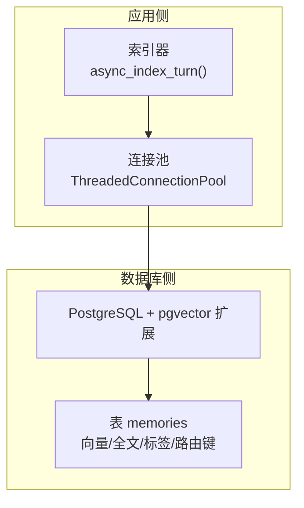
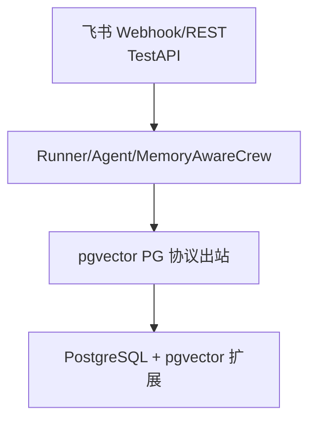
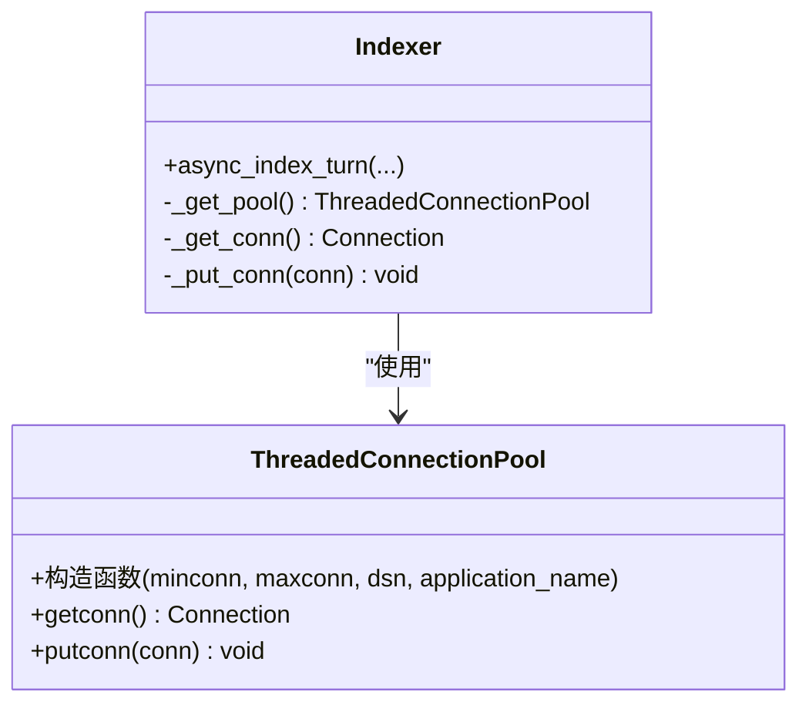
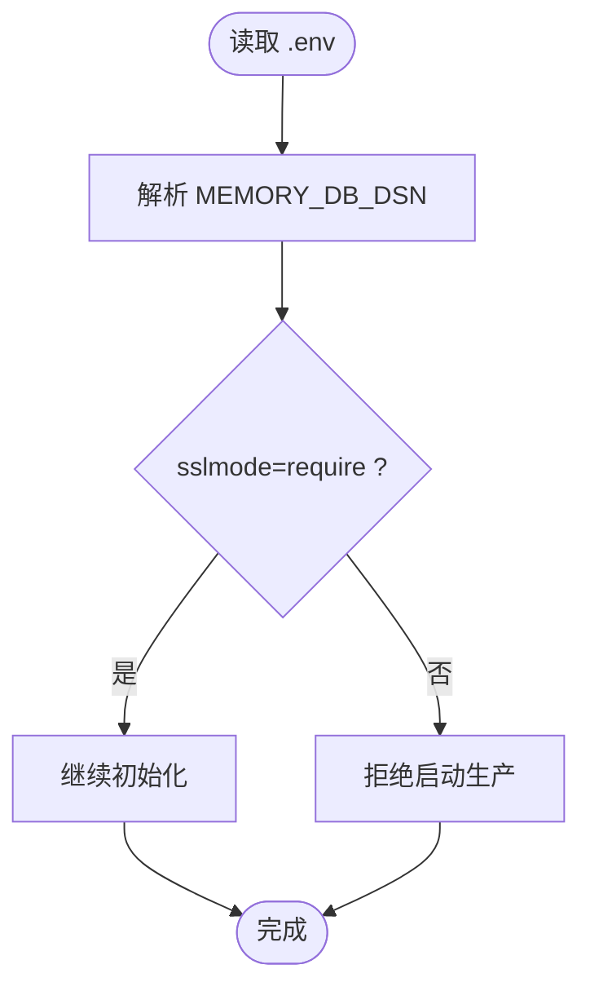
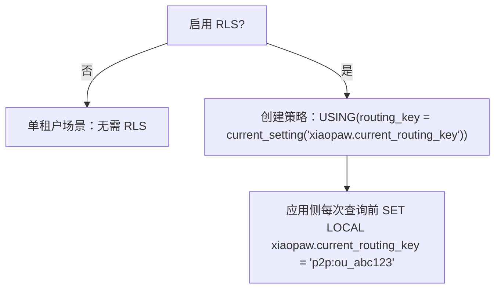
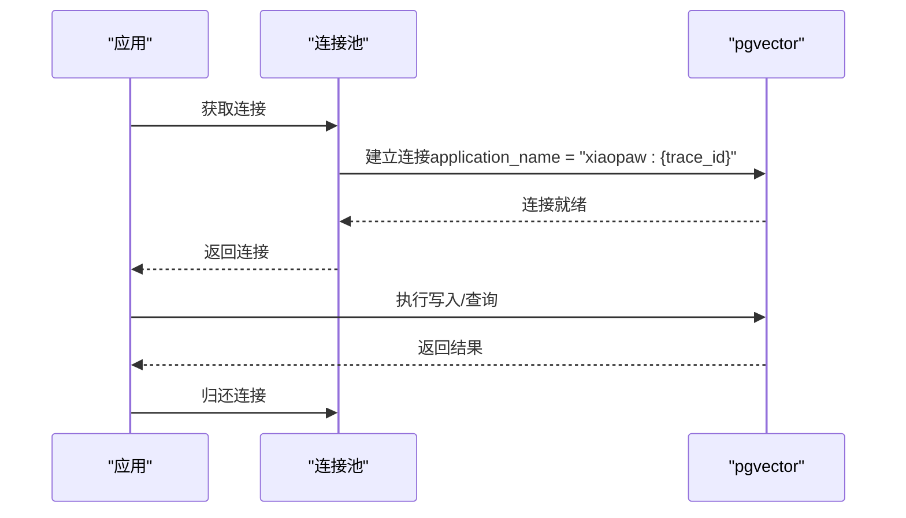
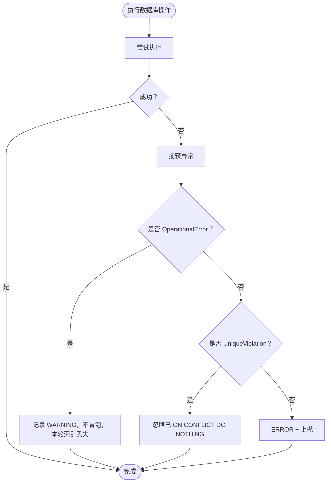
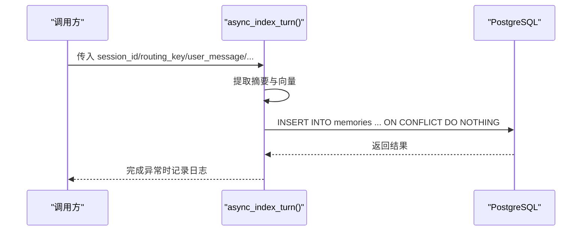
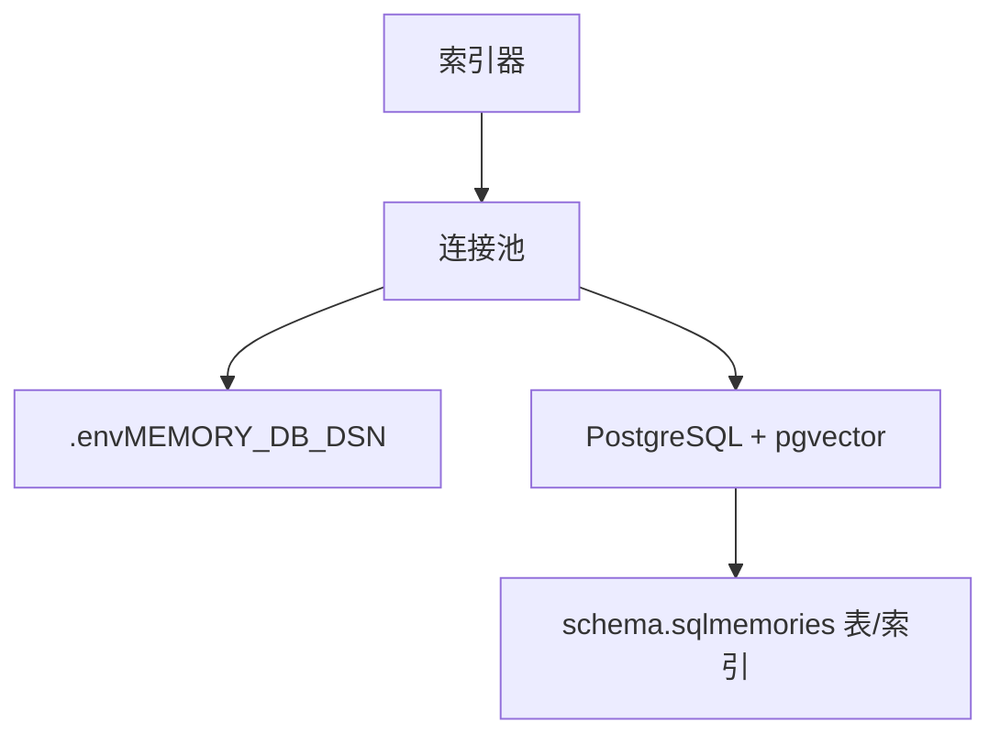

# pgvector PG 协议（出站）

<cite>
**本文引用的文件**
- [docs/04-api.md](file://docs/04-api.md)
- [docs/09-config.md](file://docs/09-config.md)
- [docs/11-migration-v1-to-v2.md](file://docs/11-migration-v1-to-v2.md)
- [schema.sql](file://schema.sql)
- [DESIGN.md](file://DESIGN.md)
- [docs/ssot/feature-flags.md](file://docs/ssot/feature-flags.md)
- [xiaopaw/memory/indexer.py](file://xiaopaw/memory/indexer.py)
- [docs/05-concurrency.md](file://docs/05-concurrency.md)
</cite>

## 目录
1. [简介](#简介)
2. [项目结构](#项目结构)
3. [核心组件](#核心组件)
4. [架构总览](#架构总览)
5. [详细组件分析](#详细组件分析)
6. [依赖分析](#依赖分析)
7. [性能考量](#性能考量)
8. [故障排查指南](#故障排查指南)
9. [结论](#结论)
10. [附录](#附录)

## 简介
本文件面向“pgvector PG 协议（出站）”接口，提供 v2.1 版本的完整 API 文档与实现说明。重点涵盖：
- PostgreSQL 连接参数配置（MEMORY_DB_DSN）与 DSN 格式
- SSL 要求与凭证安全
- 权限最小化原则：独立 DB 用户与最小权限授权（SELECT/INSERT）
- 连接池 ThreadedConnectionPool 的实现与线程安全保证（min=2, max=10）
- trace_id 传递机制（application_name 设置）与 pgvector 侧慢查询追踪
- OperationalError 与 UniqueViolation 等错误语义处理
- v2 版本的性能优化考虑与生产部署建议

## 项目结构
与“pgvector PG 协议（出站）”相关的关键位置如下：
- 连接池与错误语义：docs/04-api.md
- DSN 与 .env 配置：docs/09-config.md
- 迁移与凭证安全：docs/11-migration-v1-to-v2.md
- 数据库模式与索引：schema.sql
- 信任边界与出站接口：DESIGN.md
- 功能开关与生产安全：docs/ssot/feature-flags.md
- 具体实现示例（索引写入）：xiaopaw/memory/indexer.py
- 并发与线程安全：docs/05-concurrency.md

**图表来源**
- [docs/04-api.md:548-572](file://docs/04-api.md#L548-L572)
- [xiaopaw/memory/indexer.py:32-96](file://xiaopaw/memory/indexer.py#L32-L96)
- [schema.sql:1-44](file://schema.sql#L1-L44)

**章节来源**
- [docs/04-api.md:540-592](file://docs/04-api.md#L540-L592)
- [docs/09-config.md:347-370](file://docs/09-config.md#L347-L370)
- [docs/11-migration-v1-to-v2.md:268-296](file://docs/11-migration-v1-to-v2.md#L268-L296)
- [schema.sql:1-44](file://schema.sql#L1-L44)
- [DESIGN.md:250-272](file://DESIGN.md#L250-L272)
- [docs/ssot/feature-flags.md:8-66](file://docs/ssot/feature-flags.md#L8-L66)
- [xiaopaw/memory/indexer.py:32-96](file://xiaopaw/memory/indexer.py#L32-L96)
- [docs/05-concurrency.md:952-961](file://docs/05-concurrency.md#L952-L961)

## 核心组件
- 连接池与线程安全
  - v2.1 默认启用连接池，使用 psycopg2 标准库子模块 ThreadedConnectionPool，min=2、max=10。
  - 连接池通过缓存单例（functools.cache）创建，线程安全，行为对齐 run_in_executor 线程池语义。
  - 连接池在初始化时设置 application_name，用于 trace_id 传递与慢查询追踪。

- DSN 与 SSL 要求
  - MEMORY_DB_DSN 位于 .env，格式为 postgresql:// 用户名:密码@主机:端口/数据库名。
  - .env 示例明确要求 sslmode=require，确保 TLS 传输安全。

- 权限最小化原则
  - 应用侧使用独立 DB 用户（如 xiaopaw_app），仅授予 SELECT/INSERT 权限，遵循最小权限原则。
  - 多租户或合规要求时，可启用 RLS（行级安全策略）与 routing_key 隔离。

- trace_id 传递与慢查询追踪
  - 通过 application_name 传递 trace_id，便于在 pg_stat_activity.application_name 中反查慢查询。

- 错误语义处理
  - OperationalError（连接失败）：记录 WARNING，不冒泡，本轮索引丢失。
  - UniqueViolation（唯一性冲突）：ON CONFLICT DO NOTHING 已处理，不会真出现。
  - 其他 SQL 错误：ERROR + 上抛，测试环境可发现，生产不应出现。

**章节来源**
- [docs/04-api.md:548-592](file://docs/04-api.md#L548-L592)
- [docs/09-config.md:347-370](file://docs/09-config.md#L347-L370)
- [docs/11-migration-v1-to-v2.md:242-252](file://docs/11-migration-v1-to-v2.md#L242-L252)
- [DESIGN.md:250-272](file://DESIGN.md#L250-L272)
- [docs/04-api.md:574-581](file://docs/04-api.md#L574-L581)

## 架构总览
“pgvector PG 协议（出站）”在系统中的信任边界与职责如下：
- 入站：飞书 Webhook/REST、TestAPI、Metrics/Health 等
- 半信任：Runner、Agent、MemoryAwareCrew
- 信任：pgvector（权限最小化 + RLS 隔离）、Workspace 目录
- 出站：pgvector PG 协议（仅经鉴权内部请求访问）

**图表来源**
- [DESIGN.md:250-272](file://DESIGN.md#L250-L272)

**章节来源**
- [DESIGN.md:250-272](file://DESIGN.md#L250-L272)

## 详细组件分析

### 组件一：连接池与线程安全（ThreadedConnectionPool）
- 实现要点
  - 使用 psycopg2.pool.ThreadedConnectionPool，min=2、max=10。
  - 通过 functools.cache 创建单例连接池，避免重复初始化。
  - 线程安全，行为对齐 run_in_executor 线程池语义。
  - 初始化时设置 application_name，用于 trace_id 传递。

- 连接获取与归还
  - 获取连接：pool.getconn()
  - 归还连接：pool.putconn(conn)

- 并发注意事项
  - v2.1 强调同步阻塞线程任务不可取消，CPython 不支持强制终止线程，需接受僵尸任务并打指标，而非假设 cancel 能干净收尾。

**图表来源**
- [docs/04-api.md:548-572](file://docs/04-api.md#L548-L572)
- [docs/05-concurrency.md:952-961](file://docs/05-concurrency.md#L952-L961)

**章节来源**
- [docs/04-api.md:548-572](file://docs/04-api.md#L548-L572)
- [docs/05-concurrency.md:952-961](file://docs/05-concurrency.md#L952-L961)

### 组件二：DSN 配置与 SSL 要求
- DSN 来源
  - MEMORY_DB_DSN 来自 .env，示例中明确 sslmode=require。
- 凭证安全
  - v2 要求将凭证全部迁移到 .env，config.yaml 不含任何凭证字段值。
  - 生产环境禁止使用弱口令，启动时进行正则与哈希双重匹配校验。

**图表来源**
- [docs/09-config.md:347-370](file://docs/09-config.md#L347-L370)
- [docs/11-migration-v1-to-v2.md:268-296](file://docs/11-migration-v1-to-v2.md#L268-L296)
- [docs/09-config.md:372-398](file://docs/09-config.md#L372-L398)

**章节来源**
- [docs/09-config.md:347-370](file://docs/09-config.md#L347-L370)
- [docs/11-migration-v1-to-v2.md:268-296](file://docs/11-migration-v1-to-v2.md#L268-L296)
- [docs/09-config.md:372-398](file://docs/09-config.md#L372-L398)

### 组件三：权限最小化与 RLS
- 用户与权限
  - 应用侧使用独立 DB 用户（如 xiaopaw_app），仅授予 SELECT/INSERT 权限。
- 多租户与合规
  - 可选启用 RLS，基于 routing_key 进行行级隔离。
  - 配置开关：feature_flags.enable_pgvector_rls（v2 默认关，多租户/合规场景建议开启）。

**图表来源**
- [docs/11-migration-v1-to-v2.md:238-252](file://docs/11-migration-v1-to-v2.md#L238-L252)
- [docs/ssot/feature-flags.md:8-66](file://docs/ssot/feature-flags.md#L8-L66)

**章节来源**
- [docs/11-migration-v1-to-v2.md:238-252](file://docs/11-migration-v1-to-v2.md#L238-L252)
- [docs/ssot/feature-flags.md:8-66](file://docs/ssot/feature-flags.md#L8-L66)

### 组件四：trace_id 传递与慢查询追踪
- 传递机制
  - 连接建立时设置 application_name 为 "xiaopaw:{trace_id}"，便于在 pg_stat_activity.application_name 中反查慢查询。
- 追踪价值
  - 通过 trace_id 可在数据库侧定位对应慢查询，辅助性能分析与问题排查。

**图表来源**
- [docs/04-api.md:582-591](file://docs/04-api.md#L582-L591)

**章节来源**
- [docs/04-api.md:582-591](file://docs/04-api.md#L582-L591)

### 组件五：错误语义处理（v2 版本）
- OperationalError（连接失败）
  - 记录 WARNING，不冒泡；本轮索引丢失。
- UniqueViolation（唯一性冲突）
  - ON CONFLICT DO NOTHING 已处理，不会真出现。
- 其他 SQL 错误
  - ERROR + 上抛；测试环境可发现，生产不应出现。

**图表来源**
- [docs/04-api.md:574-581](file://docs/04-api.md#L574-L581)

**章节来源**
- [docs/04-api.md:574-581](file://docs/04-api.md#L574-L581)

### 组件六：具体实现示例（索引写入）
- 异步索引流程
  - 提取摘要与向量，写入 memories 表，使用 ON CONFLICT DO NOTHING 避免重复。
  - 使用 psycopg2.connect 建立连接，完成后关闭连接。
- 注意事项
  - v2.1 默认启用连接池；若禁用，则每次新建连接、用完关闭，无连接池。

**图表来源**
- [xiaopaw/memory/indexer.py:32-96](file://xiaopaw/memory/indexer.py#L32-L96)

**章节来源**
- [xiaopaw/memory/indexer.py:32-96](file://xiaopaw/memory/indexer.py#L32-L96)
- [docs/04-api.md:541-547](file://docs/04-api.md#L541-L547)

## 依赖分析
- 组件耦合
  - 索引器依赖连接池；连接池依赖 DSN 与 .env 配置。
  - 数据库侧依赖 schema.sql 定义的表结构与索引。
- 外部依赖
  - psycopg2（连接与连接池）
  - pgvector（向量扩展）
  - .env（凭证与 DSN）

**图表来源**
- [docs/04-api.md:548-572](file://docs/04-api.md#L548-L572)
- [docs/09-config.md:347-370](file://docs/09-config.md#L347-L370)
- [schema.sql:1-44](file://schema.sql#L1-L44)

**章节来源**
- [docs/04-api.md:548-572](file://docs/04-api.md#L548-L572)
- [docs/09-config.md:347-370](file://docs/09-config.md#L347-L370)
- [schema.sql:1-44](file://schema.sql#L1-L44)

## 性能考量
- 连接池规模
  - min=2、max=10，满足一般并发写入需求；可根据负载调整。
- 线程安全与取消
  - 同步阻塞线程任务不可取消，需接受僵尸任务并打指标，避免假设 cancel 能干净收尾。
- 索引与查询
  - schema.sql 定义了 HNSW 向量索引、GIN 全文索引、标签索引与路由键索引，支撑高效检索。
- 生产开关
  - enable_pgvector_connection_pool 默认开启，生产环境禁止关闭。

**章节来源**
- [docs/04-api.md:548-572](file://docs/04-api.md#L548-L572)
- [docs/05-concurrency.md:952-961](file://docs/05-concurrency.md#L952-L961)
- [schema.sql:1-44](file://schema.sql#L1-L44)
- [docs/ssot/feature-flags.md:8-66](file://docs/ssot/feature-flags.md#L8-L66)

## 故障排查指南
- 连接失败（OperationalError）
  - 现象：WARNING 日志，本轮索引丢失。
  - 排查：检查 DSN、SSL、网络连通性、pgvector 可用性。
- 唯一性冲突（UniqueViolation）
  - 现象：不会真出现（ON CONFLICT DO NOTHING 已处理）。
  - 排查：确认 id 生成逻辑与去重策略。
- 慢查询定位
  - 方法：通过 pg_stat_activity.application_name 反查 trace_id，定位慢查询。
- 生产安全
  - 确认 .env 中 MEMORY_DB_DSN 含 sslmode=require，且未使用弱口令。
  - 确认 feature_flags.enable_pgvector_connection_pool 未被关闭。

**章节来源**
- [docs/04-api.md:574-591](file://docs/04-api.md#L574-L591)
- [docs/09-config.md:372-398](file://docs/09-config.md#L372-L398)
- [docs/ssot/feature-flags.md:8-66](file://docs/ssot/feature-flags.md#L8-L66)

## 结论
v2.1 版本在“pgvector PG 协议（出站）”方面实现了：
- 明确的 DSN 与 SSL 要求，保障传输安全
- 权限最小化与可选 RLS，强化数据隔离
- ThreadedConnectionPool 连接池（min=2, max=10）与线程安全保证
- trace_id 传递与慢查询追踪能力
- 清晰的错误语义处理与生产安全约束

这些改进共同提升了系统的安全性、可观测性与性能稳定性。

## 附录
- DSN 示例与 .env 字段
  - MEMORY_DB_DSN 示例：包含用户名、密码、主机、端口、数据库名与 sslmode=require。
- schema.sql 关键点
  - 表结构、向量维度、HNSW/TSV/GIN/标签索引与路由键索引定义。

**章节来源**
- [docs/09-config.md:347-370](file://docs/09-config.md#L347-L370)
- [schema.sql:1-44](file://schema.sql#L1-L44)