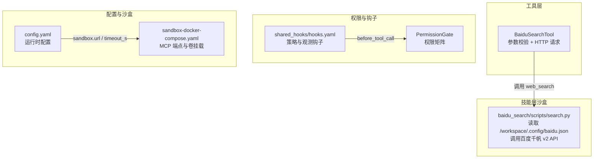
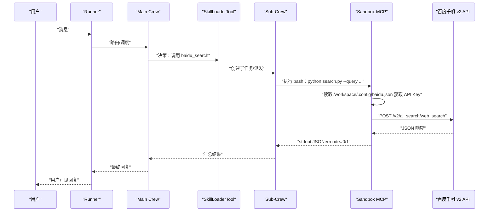
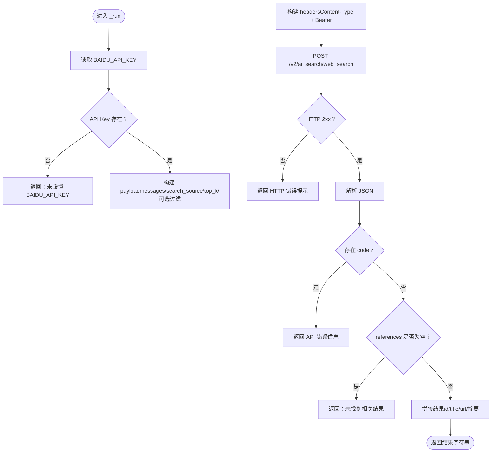
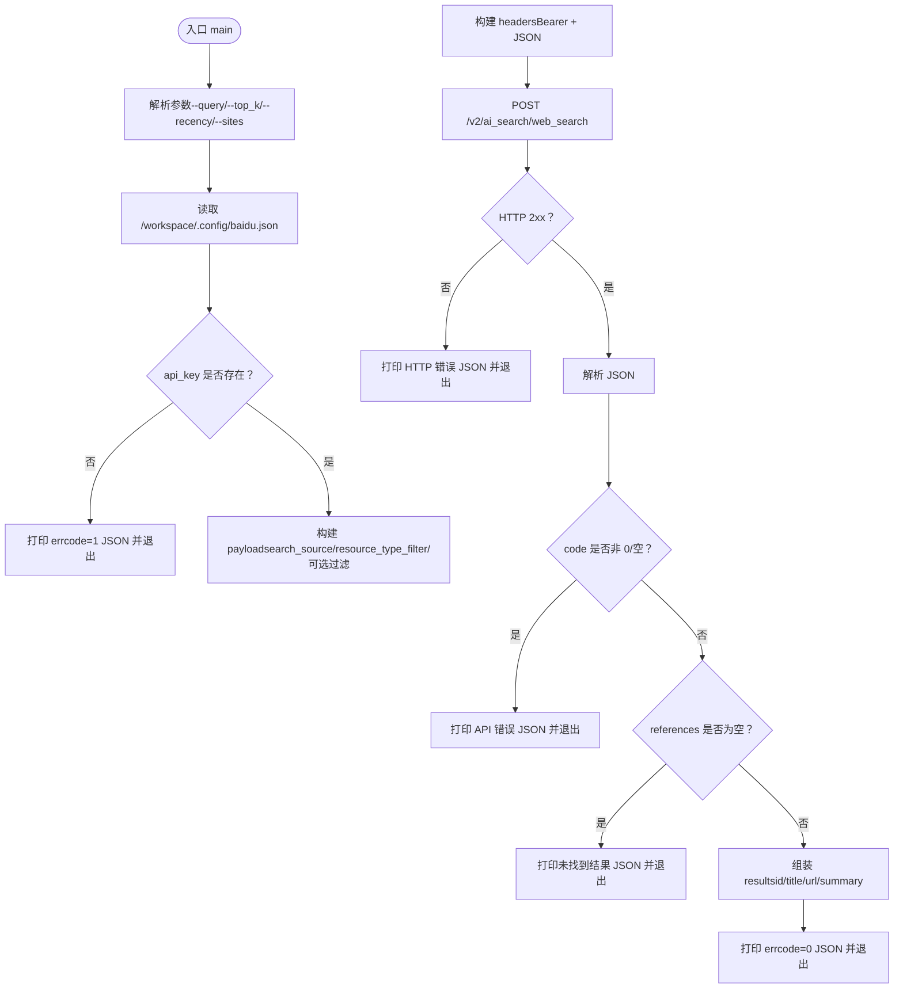
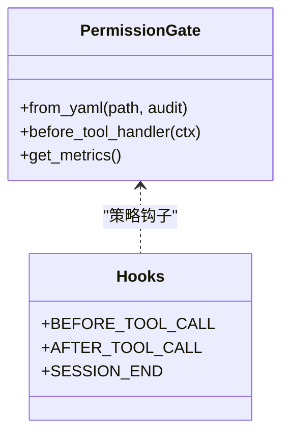
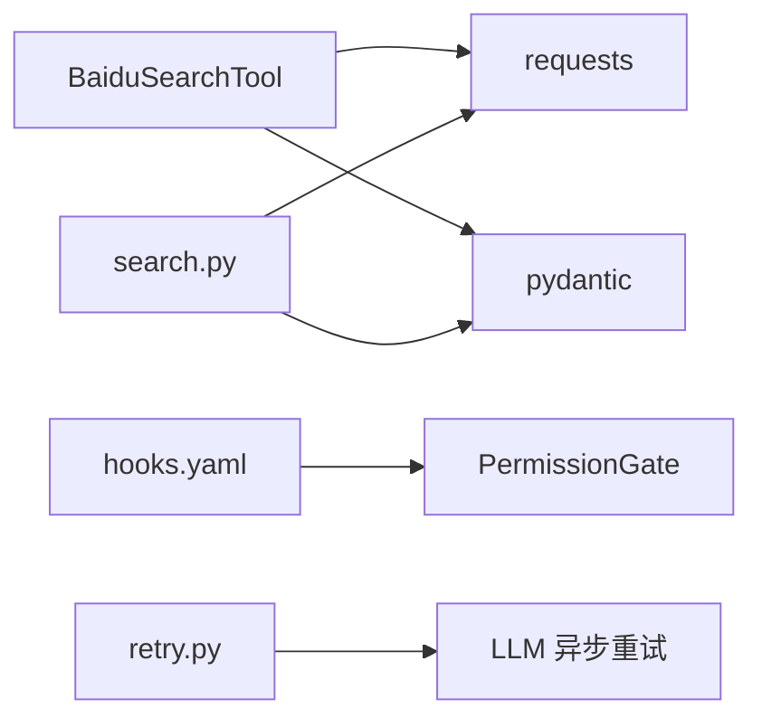

# 百度千帆 API（出站）

<cite>
**本文引用的文件**
- [baidu_search_tool.py](file://xiaopaw/tools/baidu_search_tool.py)
- [search.py](file://xiaopaw/skills/baidu_search/scripts/search.py)
- [SKILL.md](file://xiaopaw/skills/baidu_search/SKILL.md)
- [retry.py](file://xiaopaw/utils/retry.py)
- [hooks.yaml](file://shared_hooks/hooks.yaml)
- [permission_gate.py](file://shared_hooks/permission_gate.py)
- [test_e2e_05_search.py](file://tests/e2e/test_e2e_05_search.py)
- [sandbox-docker-compose.yaml](file://sandbox-docker-compose.yaml)
- [config.yaml](file://config.yaml)
</cite>

## 目录
1. [简介](#简介)
2. [项目结构](#项目结构)
3. [核心组件](#核心组件)
4. [架构总览](#架构总览)
5. [详细组件分析](#详细组件分析)
6. [依赖分析](#依赖分析)
7. [性能考虑](#性能考虑)
8. [故障排查指南](#故障排查指南)
9. [结论](#结论)
10. [附录](#附录)

## 简介
本文件面向百度千帆 API（出站）的“web_search”能力，系统性梳理以下内容：
- BaiduSearchTool 的实现机制与调用方式
- API Key 管理与凭证注入路径（含 bce-v3/xxxxx 格式说明）
- 沙盒内安全访问与权限最小化原则（v2 版本）
- web_search 接口的请求参数与响应格式
- tenacity 重试策略与降级处理机制
- 未配置时的错误处理与用户提示

## 项目结构
围绕百度千帆搜索能力的关键模块分布如下：
- 工具层（crewAI BaseTool）：BaiduSearchTool，负责参数校验与 HTTP 请求
- 技能层（沙盒执行入口）：baidu_search/skills/search.py，负责从沙盒凭证文件读取 API Key 并调用 API
- 权限与钩子：shared_hooks 中的策略与观测钩子，保障最小权限与可观测性
- 配置与沙盒：config.yaml 与 sandbox-docker-compose.yaml，定义运行时环境与挂载

图表来源
- [baidu_search_tool.py:40-105](file://xiaopaw/tools/baidu_search_tool.py#L40-L105)
- [search.py:18-139](file://xiaopaw/skills/baidu_search/scripts/search.py#L18-L139)
- [hooks.yaml:28-73](file://shared_hooks/hooks.yaml#L28-L73)
- [permission_gate.py:32-106](file://shared_hooks/permission_gate.py#L32-L106)
- [config.yaml:21-28](file://config.yaml#L21-L28)
- [sandbox-docker-compose.yaml:13-32](file://sandbox-docker-compose.yaml#L13-L32)

章节来源
- [baidu_search_tool.py:1-105](file://xiaopaw/tools/baidu_search_tool.py#L1-L105)
- [search.py:1-139](file://xiaopaw/skills/baidu_search/scripts/search.py#L1-L139)
- [hooks.yaml:1-73](file://shared_hooks/hooks.yaml#L1-L73)
- [permission_gate.py:32-106](file://shared_hooks/permission_gate.py#L32-L106)
- [config.yaml:21-28](file://config.yaml#L21-L28)
- [sandbox-docker-compose.yaml:1-32](file://sandbox-docker-compose.yaml#L1-L32)

## 核心组件
- BaiduSearchTool（crewAI BaseTool）
  - 参数校验：query、top_k、recency_filter、sites
  - 凭证来源：BAIDU_API_KEY 环境变量（bce-v3/xxxxx 格式）
  - 请求目标：https://qianfan.baidubce.com/v2/ai_search/web_search
  - 响应处理：解析 JSON，提取 references，拼接标题、URL 与摘要
  - 错误处理：超时、HTTP 错误、网络异常、JSON 解析失败
- baidu_search/skills/search.py（沙盒执行入口）
  - 凭证来源：/workspace/.config/baidu.json（系统在启动时写入沙盒）
  - 请求目标：同上
  - 输出规范：stdout JSON（errcode=0 成功，errcode=1 失败），含建议提示
  - 错误处理：超时、HTTP 错误、网络异常、JSON 解析失败、未找到结果
- 权限与钩子
  - BEFORE_TOOL_CALL：PermissionGate 基于策略矩阵进行放行/警告/拒绝
  - 观测钩子：structured_log、langfuse_trace，确保即使被拒绝也留痕

章节来源
- [baidu_search_tool.py:19-105](file://xiaopaw/tools/baidu_search_tool.py#L19-L105)
- [search.py:18-139](file://xiaopaw/skills/baidu_search/scripts/search.py#L18-L139)
- [hooks.yaml:11-25](file://shared_hooks/hooks.yaml#L11-L25)
- [permission_gate.py:32-106](file://shared_hooks/permission_gate.py#L32-L106)

## 架构总览
下图展示从 Agent 到百度千帆 API 的端到端调用链，涵盖权限控制、沙盒执行与错误处理。

图表来源
- [test_e2e_05_search.py:28-62](file://tests/e2e/test_e2e_05_search.py#L28-L62)
- [search.py:47-139](file://xiaopaw/skills/baidu_search/scripts/search.py#L47-L139)
- [hooks.yaml:11-25](file://shared_hooks/hooks.yaml#L11-L25)

## 详细组件分析

### BaiduSearchTool（工具层）
- 参数与校验
  - query：必填，非空校验
  - top_k：默认 20，范围 0..50
  - recency_filter：可选，枚举 week/month/semiyear/year
  - sites：可选，最多 20 个域名
- 凭证注入
  - 从环境变量 BAIDU_API_KEY 读取（bce-v3/xxxxx 格式）
  - 若未设置，直接返回错误提示
- 请求构造
  - URL：https://qianfan.baidubce.com/v2/ai_search/web_search
  - headers：Content-Type 与 X-Appbuilder-Authorization（Bearer）
  - payload：messages、search_source、resource_type_filter、可选 search_recency_filter 与 search_filter
- 响应处理
  - 解析 JSON，若存在 code 则返回错误信息
  - references 为空则提示未找到结果
  - 否则拼接每条结果的 id、title、url 与内容摘要
- 错误处理
  - 超时：返回“搜索超时，请稍后重试”
  - HTTP 错误：返回“搜索请求失败（HTTP 状态码）”
  - 网络异常：返回“网络错误：...”
  - JSON 解析失败：返回“搜索结果解析失败”

图表来源
- [baidu_search_tool.py:49-105](file://xiaopaw/tools/baidu_search_tool.py#L49-L105)

章节来源
- [baidu_search_tool.py:19-105](file://xiaopaw/tools/baidu_search_tool.py#L19-L105)

### 沙盒执行入口（baidu_search/skills/search.py）
- 凭证读取
  - 从 /workspace/.config/baidu.json 读取 api_key
  - 文件缺失或 api_key 为空时，返回带 errcode=1 的 JSON，并给出建议
- 参数与校验
  - 支持 --query、--top_k（1..50）、--recency（week/month/semiyear/year）、--sites（最多 20 个）
  - 对 sites 进行去空白与长度限制
- 请求与响应
  - URL：https://qianfan.baidubce.com/v2/ai_search/web_search
  - headers：X-Appbuilder-Authorization（Bearer）+ Content-Type
  - 成功输出：errcode=0，包含 query、total、results（id、title、url、summary）
  - 失败输出：errcode=1，errmsg 包含错误与建议
- 错误处理
  - 超时、HTTP 错误、网络异常、JSON 解析失败均以 JSON 形式返回并退出码 0

图表来源
- [search.py:47-139](file://xiaopaw/skills/baidu_search/scripts/search.py#L47-L139)

章节来源
- [search.py:18-139](file://xiaopaw/skills/baidu_search/scripts/search.py#L18-L139)
- [SKILL.md:1-181](file://xiaopaw/skills/baidu_search/SKILL.md#L1-L181)

### 权限与钩子（v2 权限最小化）
- 权限矩阵
  - PermissionGate 基于 YAML 配置的 tools/default 字段决定放行/警告/拒绝
  - BEFORE_TOOL_CALL 钩子在策略层执行，确保即使被拒绝也会留痕
- 钩子链
  - 观测钩子（structured_log、langfuse_trace）在 dispatch_gate 中先于策略钩子执行
  - 策略钩子（sandbox_guard、permission_gate、cost_guard、loop_detector、retry_tracker）按顺序参与治理
- 最小权限原则
  - Main Agent 不感知 API Key；凭证由系统注入沙盒，Skill 脚本本地读取
  - Agent 仅通过 SkillLoaderTool 间接调用，避免直接暴露外部 API

图表来源
- [permission_gate.py:32-106](file://shared_hooks/permission_gate.py#L32-L106)
- [hooks.yaml:28-73](file://shared_hooks/hooks.yaml#L28-L73)

章节来源
- [permission_gate.py:32-106](file://shared_hooks/permission_gate.py#L32-L106)
- [hooks.yaml:1-73](file://shared_hooks/hooks.yaml#L1-L73)

### tenacity 重试策略与降级处理
- tenacity 使用场景
  - 本仓库中 tenacity 主要用于 LLM（如 AliyunLLM）的异步重试，策略为指数退避 + 重试条件（Timeout/HTTPStatusError），并在耗尽后抛出原始异常链
- 与百度千帆 API 的关系
  - 当前百度千帆 API 的工具层与技能层未直接使用 tenacity；工具层采用 requests 的同步调用与简单异常分支处理
  - 若未来在沙盒执行或上游服务引入异步/重试需求，可参考统一的 tenacity 策略（reraise=True，保留原始异常链）
- 降级建议
  - 对于网络波动或上游限流，可在调用方增加幂等重试与退避策略（例如基于 async_retry 的指数退避）
  - 对于 503/超时等可恢复错误，结合 PermissionGate 的“warn”策略与可观测性钩子进行记录与追踪

章节来源
- [retry.py:14-36](file://xiaopaw/utils/retry.py#L14-L36)

### web_search 接口调用方法、参数与响应
- 调用方法
  - 工具层：BaiduSearchTool（crewAI BaseTool），通过 _run 方法发起 HTTP 请求
  - 沙盒层：python ./scripts/search.py，通过命令行参数与 stdout JSON 输出
- 请求参数
  - 必填：query
  - 可选：top_k（1..50）、recency（week/month/semiyear/year）、sites（最多 20 个域名）
- 响应格式
  - 工具层：字符串（拼接后的结果列表）
  - 沙盒层：stdout JSON（errcode、errmsg、query、total、results）
- 输出规范
  - 沙盒层要求使用 shell 重定向保存结果，避免 file_operations 的 JSON 写入导致类型校验失败

章节来源
- [baidu_search_tool.py:19-105](file://xiaopaw/tools/baidu_search_tool.py#L19-L105)
- [search.py:47-139](file://xiaopaw/skills/baidu_search/scripts/search.py#L47-L139)
- [SKILL.md:78-129](file://xiaopaw/skills/baidu_search/SKILL.md#L78-L129)

## 依赖分析
- 组件耦合
  - 工具层与技能层共享相同的 API 端点与请求结构，便于统一维护
  - 权限与钩子解耦于业务逻辑，通过钩子框架集中治理
- 外部依赖
  - requests：HTTP 客户端
  - pydantic：参数校验
  - tenacity：异步重试（主要用于 LLM）
- 潜在循环依赖
  - 未发现直接循环导入；权限与钩子通过配置文件加载，避免强耦合

图表来源
- [baidu_search_tool.py:10-12](file://xiaopaw/tools/baidu_search_tool.py#L10-L12)
- [search.py:15-15](file://xiaopaw/skills/baidu_search/scripts/search.py#L15-L15)
- [hooks.yaml:28-73](file://shared_hooks/hooks.yaml#L28-L73)
- [retry.py:14-36](file://xiaopaw/utils/retry.py#L14-L36)

章节来源
- [baidu_search_tool.py:10-12](file://xiaopaw/tools/baidu_search_tool.py#L10-L12)
- [search.py:15-15](file://xiaopaw/skills/baidu_search/scripts/search.py#L15-L15)
- [hooks.yaml:28-73](file://shared_hooks/hooks.yaml#L28-L73)
- [retry.py:14-36](file://xiaopaw/utils/retry.py#L14-L36)

## 性能考虑
- 超时与并发
  - 工具层与技能层均设置 30 秒超时，避免长时间阻塞
  - 可根据网络状况调整超时阈值
- 结果规模与过滤
  - top_k 控制返回数量，recency 与 sites 有助于缩小范围、提升相关性
- 重试与退避
  - 对于不稳定网络，可在调用方引入指数退避重试（参考 async_retry），并结合 PermissionGate 的“warn”策略进行审计

## 故障排查指南
- 未配置 API Key
  - 工具层：BAIDU_API_KEY 未设置时直接返回错误提示
  - 沙盒层：/workspace/.config/baidu.json 不存在或 api_key 为空时返回 errcode=1 JSON，并给出建议
- 超时与网络异常
  - 工具层：返回“搜索超时，请稍后重试”
  - 沙盒层：返回“请求超时（30s）”，建议减少 top_k 或稍后重试
- HTTP 错误与解析失败
  - 工具层：返回“搜索请求失败（HTTP 状态码）”或“网络错误：...”、“搜索结果解析失败”
  - 沙盒层：返回“HTTP 错误 ...”或“响应解析失败”，并给出建议
- 未找到结果
  - 工具层：返回“未找到关于「...」的搜索结果”
  - 沙盒层：返回“未找到与「...」相关的搜索结果”，建议去掉 recency/sites 限制
- 权限与沙盒问题
  - 检查 hooks.yaml 中的策略配置与 BEFORE_TOOL_CALL 行为
  - 确认沙盒 MCP 端点可达，卷挂载正确（/workspace/.config/baidu.json）

章节来源
- [baidu_search_tool.py:57-105](file://xiaopaw/tools/baidu_search_tool.py#L57-L105)
- [search.py:20-139](file://xiaopaw/skills/baidu_search/scripts/search.py#L20-L139)
- [hooks.yaml:28-73](file://shared_hooks/hooks.yaml#L28-L73)
- [sandbox-docker-compose.yaml:21-23](file://sandbox-docker-compose.yaml#L21-L23)

## 结论
- 百度千帆 API 的出站能力在 v2 版本中实现了“权限最小化”：Main Agent 不感知 API Key，凭证由系统注入沙盒，Skill 脚本本地读取
- 工具层与沙盒层分别提供统一的请求结构与输出规范，便于集成与测试
- tenacity 重试策略已在其他组件中落地，未来可借鉴至百度千帆调用链以增强鲁棒性
- 通过 PermissionGate 与钩子体系，系统在安全与可观测性方面具备完善的治理能力

## 附录
- 配置要点
  - sandbox.url：沙盒 MCP 端点
  - sandbox.timeout_s：沙盒超时
  - BAIDU_API_KEY：工具层凭证（bce-v3/xxxxx 格式）
  - /workspace/.config/baidu.json：沙盒层凭证文件
- 测试参考
  - E2E 测试覆盖从 Agent 到沙盒执行的完整链路，验证返回结果与 Langfuse 追踪

章节来源
- [config.yaml:21-28](file://config.yaml#L21-L28)
- [sandbox-docker-compose.yaml:21-23](file://sandbox-docker-compose.yaml#L21-L23)
- [test_e2e_05_search.py:28-62](file://tests/e2e/test_e2e_05_search.py#L28-L62)