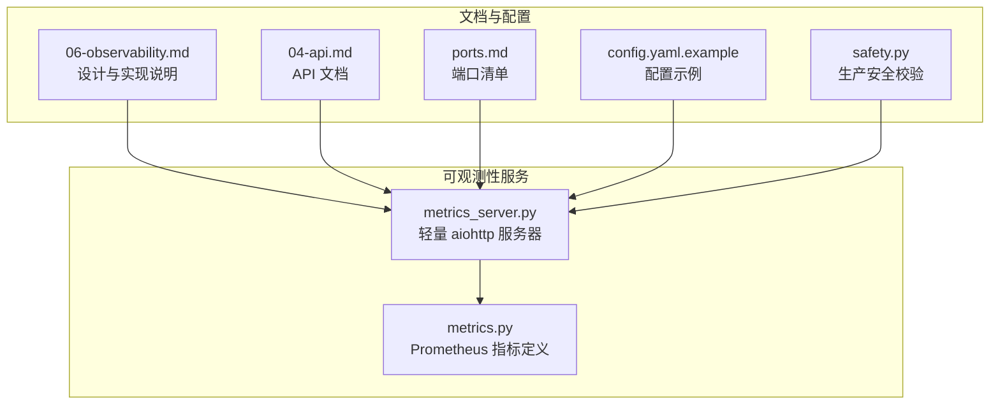
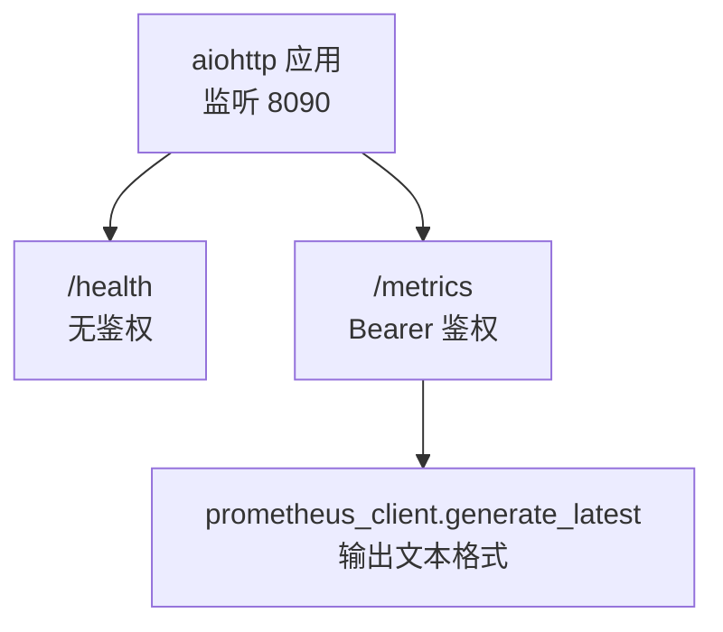
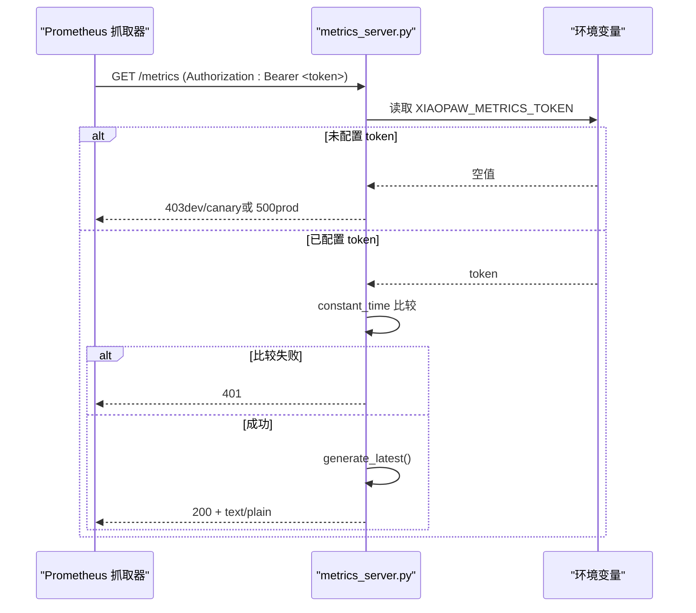
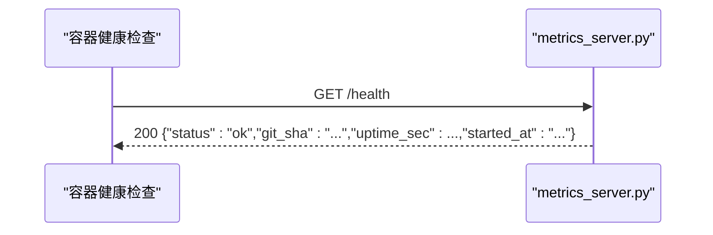
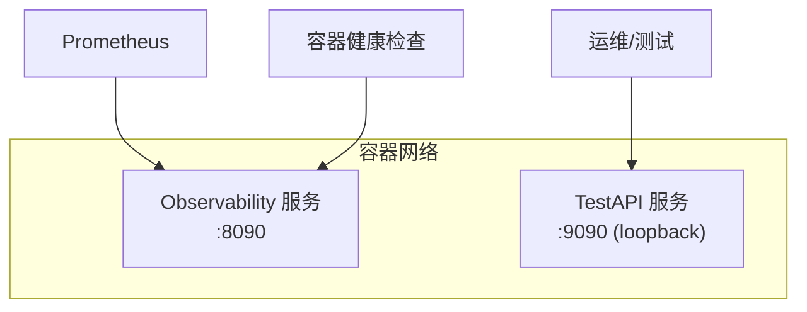
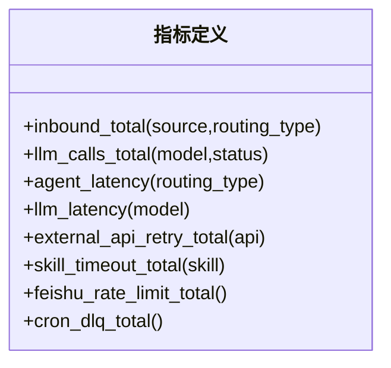
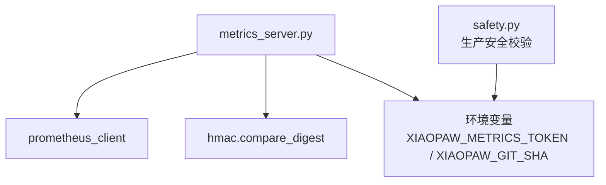

# 运维接口

<cite>
**本文引用的文件**
- [metrics_server.py](file://xiaopaw/observability/metrics_server.py)
- [metrics.py](file://xiaopaw/observability/metrics.py)
- [06-observability.md](file://docs/06-observability.md)
- [04-api.md](file://docs/04-api.md)
- [ports.md](file://docs/ssot/ports.md)
- [safety.py](file://xiaopaw/config/safety.py)
- [config.yaml.example](file://config.yaml.example)
</cite>

## 目录
1. [简介](#简介)
2. [项目结构](#项目结构)
3. [核心组件](#核心组件)
4. [架构总览](#架构总览)
5. [详细组件分析](#详细组件分析)
6. [依赖关系分析](#依赖关系分析)
7. [性能考量](#性能考量)
8. [故障排查指南](#故障排查指南)
9. [结论](#结论)
10. [附录](#附录)

## 简介
本文件面向运维与开发读者，系统化说明 XiaoPaw v2 的 /metrics 与 /health 运维接口，包括：
- /metrics Prometheus 标准文本格式响应与 Bearer Token 鉴权
- constant_time 安全比较（hmac.compare_digest）与 v2 强化安全策略
- /health 健康检查响应格式与最佳实践
- 端口配置（:8090）与与 TestAPI 的端口分离设计
- 完整监控指标说明与健康检查告警建议

## 项目结构
运维接口位于 xiaopaw/observability 子模块，采用轻量 aiohttp 服务器提供 /health 与 /metrics 两个端点，并通过中间件实现 /metrics 的 Bearer 鉴权。

**图表来源**
- [metrics_server.py:1-55](file://xiaopaw/observability/metrics_server.py#L1-L55)
- [metrics.py:1-65](file://xiaopaw/observability/metrics.py#L1-L65)
- [06-observability.md:530-620](file://docs/06-observability.md#L530-L620)
- [04-api.md:666-721](file://docs/04-api.md#L666-L721)
- [ports.md:1-122](file://docs/ssot/ports.md#L1-L122)
- [config.yaml.example:51-58](file://config.yaml.example#L51-L58)
- [safety.py:566-576](file://xiaopaw/config/safety.py#L566-L576)

**章节来源**
- [metrics_server.py:1-55](file://xiaopaw/observability/metrics_server.py#L1-L55)
- [metrics.py:1-65](file://xiaopaw/observability/metrics.py#L1-L65)
- [06-observability.md:530-620](file://docs/06-observability.md#L530-L620)
- [04-api.md:666-721](file://docs/04-api.md#L666-L721)
- [ports.md:1-122](file://docs/ssot/ports.md#L1-L122)
- [config.yaml.example:51-58](file://config.yaml.example#L51-L58)
- [safety.py:566-576](file://xiaopaw/config/safety.py#L566-L576)

## 核心组件
- 轻量 HTTP 服务器：提供 /health 与 /metrics 路由，监听 8090 端口。
- /metrics 鉴权中间件：仅对 /metrics 子路由生效，使用 constant_time 比较。
- /health 健康检查处理器：返回状态、git_sha、uptime_sec、started_at。
- 指标定义：Prometheus Counter/Histogram 指标集合，用于业务与性能观测。

**章节来源**
- [metrics_server.py:14-38](file://xiaopaw/observability/metrics_server.py#L14-L38)
- [metrics.py:8-47](file://xiaopaw/observability/metrics.py#L8-L47)
- [06-observability.md:588-618](file://docs/06-observability.md#L588-L618)

## 架构总览
/health 与 /metrics 共用同一 aiohttp 应用实例，通过路由区分鉴权策略：
- /health：无鉴权，供容器健康检查与外部探活
- /metrics：Bearer Token 鉴权，Prometheus 拉取指标

**图表来源**
- [metrics_server.py:40-44](file://xiaopaw/observability/metrics_server.py#L40-L44)
- [metrics_server.py:31-37](file://xiaopaw/observability/metrics_server.py#L31-L37)

**章节来源**
- [metrics_server.py:40-54](file://xiaopaw/observability/metrics_server.py#L40-L54)
- [06-observability.md:571-581](file://docs/06-observability.md#L571-L581)

## 详细组件分析

### /metrics 接口
- 功能：返回 Prometheus 标准文本格式指标，供 Prometheus 抓取。
- 鉴权：Bearer Token，请求头 Authorization: Bearer <token>。
- 安全：使用 constant_time 比较（hmac.compare_digest）防时序攻击。
- 环境策略：
  - 生产环境（XIAOPAW_ENV=prod）必须设置 XIAOPAW_METRICS_TOKEN，否则启动前安全校验将拒绝。
  - 开发/预发环境若未配置 token，/metrics 将返回 403；生产环境未配置 token 将返回 500。
- 错误码：
  - 401：Token 缺失或错误
  - 501：缺少 prometheus_client
  - 500：生产环境缺少 METRICS_TOKEN（启动阶段已在安全校验中拦截）

**图表来源**
- [metrics_server.py:22-37](file://xiaopaw/observability/metrics_server.py#L22-L37)
- [safety.py:566-576](file://xiaopaw/config/safety.py#L566-L576)

**章节来源**
- [metrics_server.py:22-37](file://xiaopaw/observability/metrics_server.py#L22-L37)
- [06-observability.md:532-587](file://docs/06-observability.md#L532-L587)
- [04-api.md:677-721](file://docs/04-api.md#L677-L721)
- [safety.py:566-576](file://xiaopaw/config/safety.py#L566-L576)

### /health 接口
- 功能：返回进程健康状态与运行元信息。
- 响应字段：
  - status：字符串，固定为 "ok"
  - git_sha：字符串，来自环境变量 XIAOPAW_GIT_SHA（Docker 构建时注入）
  - uptime_sec：整数，自进程启动以来的秒数
  - started_at：ISO8601 UTC 时间戳
- 无鉴权，容器健康检查可直接访问。

**图表来源**
- [metrics_server.py:18-19](file://xiaopaw/observability/metrics_server.py#L18-L19)
- [06-observability.md:598-609](file://docs/06-observability.md#L598-L609)

**章节来源**
- [metrics_server.py:18-19](file://xiaopaw/observability/metrics_server.py#L18-L19)
- [06-observability.md:598-618](file://docs/06-observability.md#L598-L618)
- [04-api.md:692-701](file://docs/04-api.md#L692-L701)

### 端口与部署分离
- /metrics 与 /health 共用 8090 端口，同一应用实例的不同路由。
- TestAPI（/api/test/*）独立监听 9090，且仅绑定 loopback（127.0.0.1），生产环境禁用。
- Dockerfile 暴露 8090 并内置 HEALTHCHECK。

**图表来源**
- [ports.md:12-13](file://docs/ssot/ports.md#L12-L13)
- [ports.md:35-54](file://docs/ssot/ports.md#L35-L54)
- [config.yaml.example:45-49](file://config.yaml.example#L45-L49)

**章节来源**
- [ports.md:1-122](file://docs/ssot/ports.md#L1-L122)
- [config.yaml.example:45-58](file://config.yaml.example#L45-L58)

### 监控指标说明
以下为已定义的 Prometheus 指标（Counter/Histogram），用于观测业务与性能：

- xiaopaw_inbound_total
  - 类型：Counter
  - 用途：入站消息总数
  - 标签：source, routing_type
- xiaopaw_llm_calls_total
  - 类型：Counter
  - 用途：LLM API 调用总数
  - 标签：model, status
- xiaopaw_agent_latency_seconds
  - 类型：Histogram
  - 用途：Agent 处理延迟
  - 标签：routing_type
  - 分桶：(1, 5, 10, 30, 60, 120, 300)
- xiaopaw_llm_latency_seconds
  - 类型：Histogram
  - 用途：LLM API 延迟
  - 标签：model
  - 分桶：(0.5, 1, 2, 5, 10, 30, 60)
- xiaopaw_external_api_retry_total
  - 类型：Counter
  - 用途：外部 API 重试次数
  - 标签：api
- xiaopaw_skill_timeout_total
  - 类型：Counter
  - 用途：Skill 执行超时次数
  - 标签：skill
- xiaopaw_feishu_rate_limit_total
  - 类型：Counter
  - 用途：飞书 API 限流命中次数
- xiaopaw_cron_dlq_total
  - 类型：Counter
  - 用途：定时任务进入死信队列次数

**图表来源**
- [metrics.py:8-47](file://xiaopaw/observability/metrics.py#L8-L47)

**章节来源**
- [metrics.py:1-65](file://xiaopaw/observability/metrics.py#L1-L65)
- [06-observability.md:630-693](file://docs/06-observability.md#L630-L693)

## 依赖关系分析
- /metrics 依赖 prometheus_client.generate_latest 输出文本格式。
- /metrics 依赖 hmac.compare_digest 实现 constant_time 比较。
- 生产环境强制要求 XIAOPAW_METRICS_TOKEN，由安全校验在启动阶段拦截。
- /health 依赖系统时间与环境变量 XIAOPAW_GIT_SHA。

**图表来源**
- [metrics_server.py:31-37](file://xiaopaw/observability/metrics_server.py#L31-L37)
- [metrics_server.py:14-15](file://xiaopaw/observability/metrics_server.py#L14-L15)
- [safety.py:566-576](file://xiaopaw/config/safety.py#L566-L576)

**章节来源**
- [metrics_server.py:31-37](file://xiaopaw/observability/metrics_server.py#L31-L37)
- [safety.py:566-576](file://xiaopaw/config/safety.py#L566-L576)

## 性能考量
- /metrics 文本输出为纯文本，抓取开销极低。
- constant_time 比较避免时序侧信道，对鉴权性能影响可忽略。
- 延迟主要取决于 Prometheus 抓取频率与指标数量，建议控制标签基数与指标数量。
- 建议在生产环境开启指标收集并配合告警规则，避免过度抓取导致 Prometheus 压力。

## 故障排查指南
- /metrics 返回 401
  - 检查 Authorization 头是否为 Bearer Token，且与 XIAOPAW_METRICS_TOKEN 一致。
  - 确认使用 constant_time 比较，避免明文对比。
- /metrics 返回 403 或 500
  - 开发/预发环境未配置 token 返回 403；生产环境未配置 token 返回 500。
  - 生产环境需在启动前完成安全校验，确保 XIAOPAW_METRICS_TOKEN 设置。
- /metrics 返回 501
  - 缺少 prometheus_client，安装后重启服务。
- /health 返回 200，但业务异常
  - /health 仅表示进程存活，业务健康需结合指标与告警判断。
- 端口冲突或不可访问
  - 确认容器仅暴露 8090（/metrics 与 /health），TestAPI 仅在本地 9090（开发环境）。

**章节来源**
- [metrics_server.py:22-37](file://xiaopaw/observability/metrics_server.py#L22-L37)
- [safety.py:566-576](file://xiaopaw/config/safety.py#L566-L576)
- [ports.md:12-13](file://docs/ssot/ports.md#L12-L13)

## 结论
XiaoPaw v2 的运维接口以最小实现提供稳定可靠的监控与健康检查能力：
- /metrics 采用 Bearer Token 与 constant_time 比较，满足生产安全要求
- /health 无鉴权，便于容器健康检查与外部探活
- 8090 端口统一承载两类接口，TestAPI 独立端口并限制在 loopback
- 指标体系覆盖入站、LLM、技能、限流与定时任务等关键维度，配合告警规则可快速定位问题

## 附录
- 健康检查最佳实践
  - 使用 /health 作为容器健康检查探针，结合 Grafana/Prometheus 告警进行综合评估
  - 将 /metrics 与 /health 的抓取频率与标签基数控制在合理范围
- 配置参考
  - 观测性端口与主机：见 config.yaml.example 中 observability.metrics_host/port
  - 端口与暴露策略：见 ssot/ports.md

**章节来源**
- [config.yaml.example:51-58](file://config.yaml.example#L51-L58)
- [ports.md:1-122](file://docs/ssot/ports.md#L1-L122)