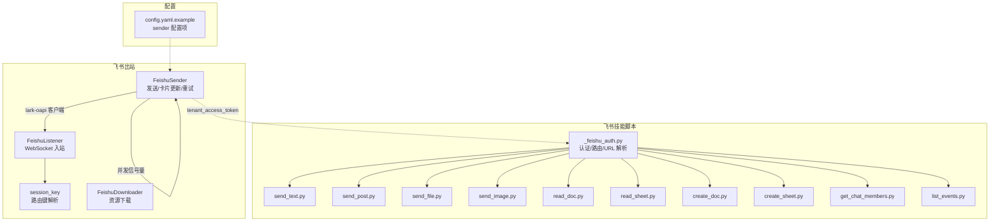
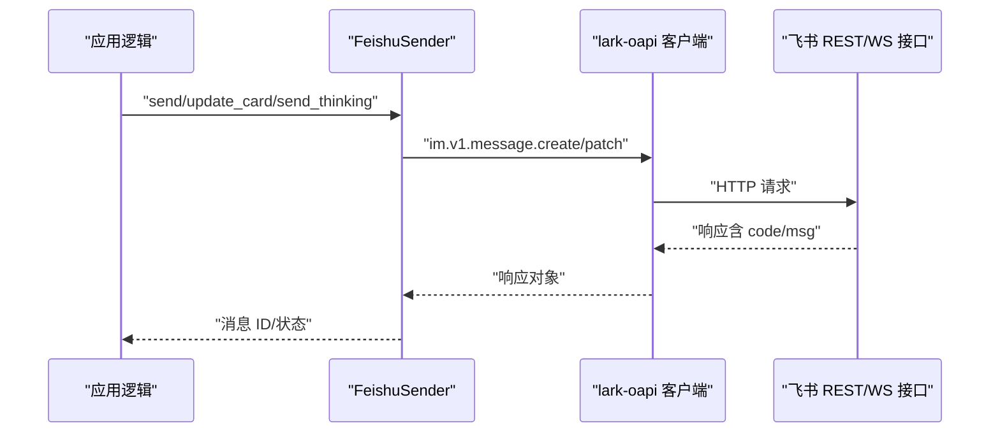
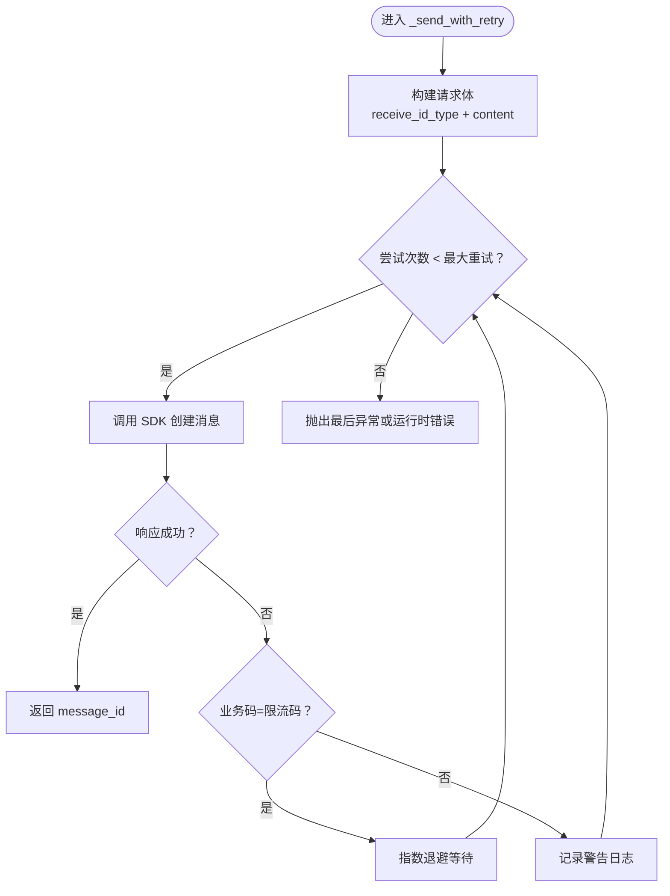
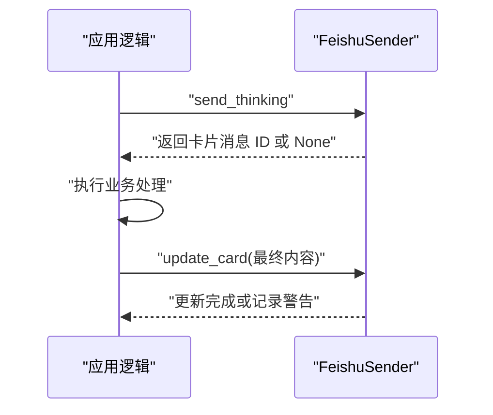
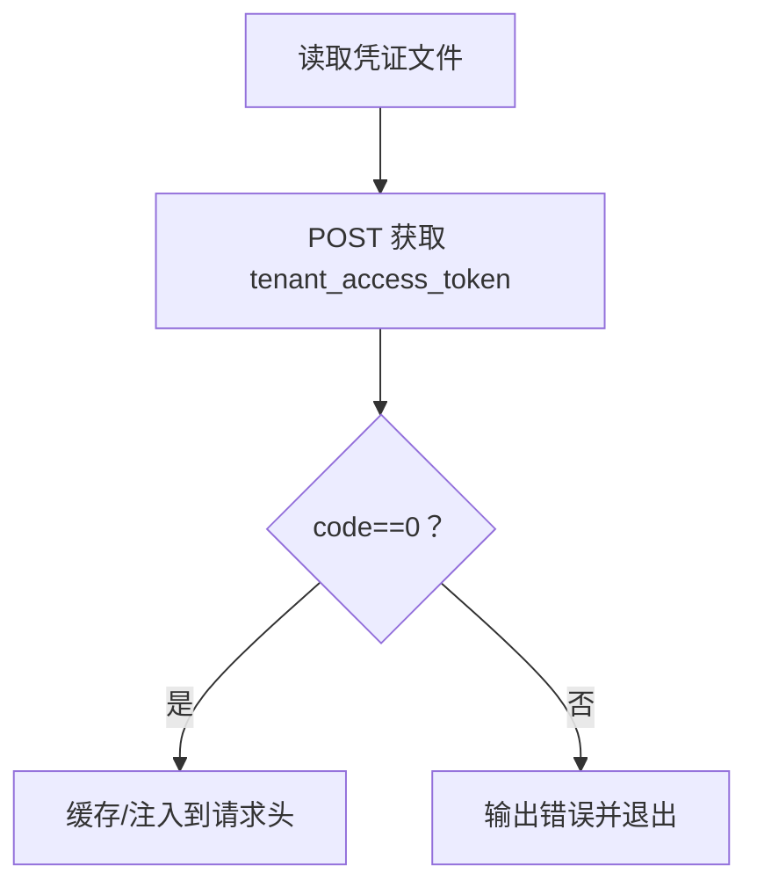
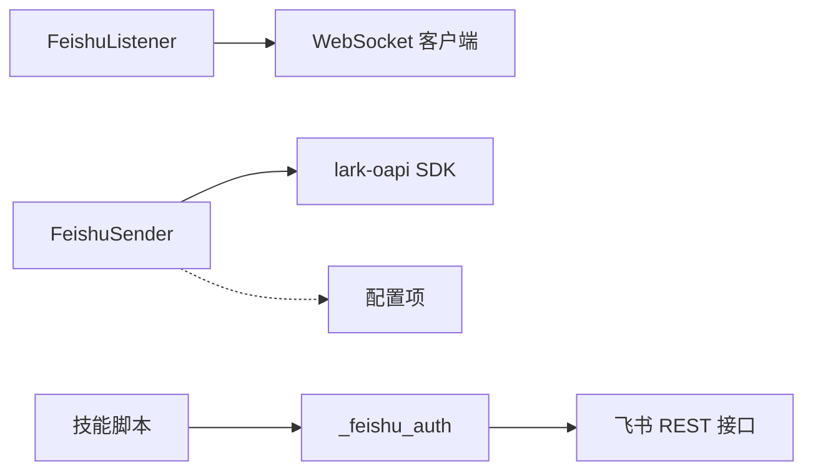

# 飞书 REST API（出站）

<cite>
**本文引用的文件**
- [sender.py](file://xiaopaw/feishu/sender.py)
- [listener.py](file://xiaopaw/feishu/listener.py)
- [session_key.py](file://xiaopaw/feishu/session_key.py)
- [downloader.py](file://xiaopaw/feishu/downloader.py)
- [config.yaml.example](file://config.yaml.example)
- [_feishu_auth.py](file://xiaopaw/skills/feishu_ops/scripts/_feishu_auth.py)
- [send_text.py](file://xiaopaw/skills/feishu_ops/scripts/send_text.py)
- [send_post.py](file://xiaopaw/skills/feishu_ops/scripts/send_post.py)
- [send_file.py](file://xiaopaw/skills/feishu_ops/scripts/send_file.py)
- [send_image.py](file://xiaopaw/skills/feishu_ops/scripts/send_image.py)
- [read_doc.py](file://xiaopaw/skills/feishu_ops/scripts/read_doc.py)
- [read_sheet.py](file://xiaopaw/skills/feishu_ops/scripts/read_sheet.py)
- [create_doc.py](file://xiaopaw/skills/feishu_ops/scripts/create_doc.py)
- [create_sheet.py](file://xiaopaw/skills/feishu_ops/scripts/create_sheet.py)
- [get_chat_members.py](file://xiaopaw/skills/feishu_ops/scripts/get_chat_members.py)
- [list_events.py](file://xiaopaw/skills/feishu_ops/scripts/list_events.py)
</cite>

## 目录
1. [简介](#简介)
2. [项目结构](#项目结构)
3. [核心组件](#核心组件)
4. [架构总览](#架构总览)
5. [详细组件分析](#详细组件分析)
6. [依赖分析](#依赖分析)
7. [性能考虑](#性能考虑)
8. [故障排查指南](#故障排查指南)
9. [结论](#结论)
10. [附录](#附录)

## 简介
本文件面向飞书 REST API 出站能力的使用者与维护者，系统性梳理消息发送、卡片更新、文档读取、表格操作、群成员查询与日历事件管理等场景。重点覆盖以下方面：
- lark-oapi SDK 客户端配置与使用方式
- tenant_access_token 自动管理机制
- FeishuSender 的实现要点与并发控制
- v2.1 版本对 429 错误码识别的改进、HTTP 429 处理与 Retry-After 头部支持现状
- 交互式卡片的三步 UI 模式、Thinking 状态管理与失败回退策略

## 项目结构
围绕飞书出站能力，代码主要分布在以下模块：
- 出站发送与卡片管理：xiaopaw/feishu/sender.py
- 入站监听与事件分发：xiaopaw/feishu/listener.py
- 路由键解析与会话标识：xiaopaw/feishu/session_key.py
- 资源下载（图片/文件）：xiaopaw/feishu/downloader.py
- 配置示例：config.yaml.example
- 飞书技能脚本（REST API 调用示例）：xiaopaw/skills/feishu_ops/scripts/*
  - 认证与工具：_feishu_auth.py
  - 消息发送：send_text.py、send_post.py、send_file.py、send_image.py
  - 文档/表格/日历/成员：read_doc.py、read_sheet.py、create_doc.py、create_sheet.py、get_chat_members.py、list_events.py

图表来源
- [sender.py:1-149](file://xiaopaw/feishu/sender.py#L1-L149)
- [listener.py:1-148](file://xiaopaw/feishu/listener.py#L1-L148)
- [session_key.py:1-21](file://xiaopaw/feishu/session_key.py#L1-L21)
- [downloader.py:1-77](file://xiaopaw/feishu/downloader.py#L1-L77)
- [config.yaml.example:1-90](file://config.yaml.example#L1-L90)
- [_feishu_auth.py:1-145](file://xiaopaw/skills/feishu_ops/scripts/_feishu_auth.py#L1-L145)
- [send_text.py:1-52](file://xiaopaw/skills/feishu_ops/scripts/send_text.py#L1-L52)
- [send_post.py:1-86](file://xiaopaw/skills/feishu_ops/scripts/send_post.py#L1-L86)
- [send_file.py:1-105](file://xiaopaw/skills/feishu_ops/scripts/send_file.py#L1-L105)
- [send_image.py:1-83](file://xiaopaw/skills/feishu_ops/scripts/send_image.py#L1-L83)
- [read_doc.py:1-43](file://xiaopaw/skills/feishu_ops/scripts/read_doc.py#L1-L43)
- [read_sheet.py:1-72](file://xiaopaw/skills/feishu_ops/scripts/read_sheet.py#L1-L72)
- [create_doc.py:1-255](file://xiaopaw/skills/feishu_ops/scripts/create_doc.py#L1-L255)
- [create_sheet.py:1-80](file://xiaopaw/skills/feishu_ops/scripts/create_sheet.py#L1-L80)
- [get_chat_members.py:1-57](file://xiaopaw/skills/feishu_ops/scripts/get_chat_members.py#L1-L57)
- [list_events.py:1-72](file://xiaopaw/skills/feishu_ops/scripts/list_events.py#L1-L72)

章节来源
- [sender.py:1-149](file://xiaopaw/feishu/sender.py#L1-L149)
- [listener.py:1-148](file://xiaopaw/feishu/listener.py#L1-L148)
- [session_key.py:1-21](file://xiaopaw/feishu/session_key.py#L1-L21)
- [downloader.py:1-77](file://xiaopaw/feishu/downloader.py#L1-L77)
- [config.yaml.example:1-90](file://config.yaml.example#L1-L90)

## 核心组件
- FeishuSender：封装 lark-oapi SDK 的消息发送与卡片更新，内置重试、并发控制与速率限制识别。
- FeishuListener：基于 WebSocket 的事件监听器，负责将入站消息转换为统一的 InboundMessage 并投递。
- session_key：将聊天类型与 ID 统一为 routing_key，便于发送侧解析。
- FeishuDownloader：从飞书下载图片/文件资源到本地会话目录。
- 飞书技能脚本：提供 REST API 示例，涵盖消息发送、文档/表格读取、创建、成员查询与日历事件列表。

章节来源
- [sender.py:18-149](file://xiaopaw/feishu/sender.py#L18-L149)
- [listener.py:21-148](file://xiaopaw/feishu/listener.py#L21-L148)
- [session_key.py:6-21](file://xiaopaw/feishu/session_key.py#L6-L21)
- [downloader.py:12-77](file://xiaopaw/feishu/downloader.py#L12-L77)

## 架构总览
下图展示飞书出站能力的整体交互：应用通过 FeishuSender 使用 lark-oapi SDK 发送消息与更新卡片；同时，FeishuListener 通过 WebSocket 接收入站事件并解析为统一消息模型；FeishuDownloader 提供资源下载能力；飞书技能脚本作为 REST API 的命令行示例，统一通过 _feishu_auth.py 进行认证与参数解析。

图表来源
- [sender.py:72-149](file://xiaopaw/feishu/sender.py#L72-L149)

## 详细组件分析

### FeishuSender：发送、卡片更新与重试
- 角色与职责
  - 将文本内容封装为交互式卡片 JSON，并调用 lark-oapi SDK 发送消息。
  - 支持 Thinking 状态发送（非关键路径失败时记录调试日志并回退）。
  - 支持按消息 ID 更新卡片内容。
  - 支持纯文本消息发送。
- 速率限制与重试
  - 识别特定飞书业务码（如 99991663/99991672/99991671）触发指数退避重试。
  - 当前未显式解析 HTTP 429 与 Retry-After 头部，后续版本可在此基础上增强。
- 并发控制
  - 使用 asyncio.Semaphore 控制最大并发数，避免过度占用 SDK 线程池。
- 路由键解析
  - 支持 p2p 与 group 场景，自动选择 receive_id_type（open_id/chat_id）。
- 错误处理
  - 对非成功响应记录警告日志；异常路径在重试耗尽后抛出最后异常。

图表来源
- [sender.py:72-116](file://xiaopaw/feishu/sender.py#L72-L116)

章节来源
- [sender.py:18-149](file://xiaopaw/feishu/sender.py#L18-L149)

### 交互式卡片三步 UI 模式与 Thinking 状态
- 三步模式
  1) 发送 Thinking 卡片（非关键路径，失败仅记录调试日志）。
  2) 执行业务处理（生成最终内容）。
  3) 更新卡片为最终结果（失败记录警告，不中断主流程）。
- 失败回退策略
  - Thinking 发送失败：吞掉异常，继续执行业务逻辑。
  - 卡片更新失败：记录警告，不抛出异常。
- 适用场景
  - 需要向用户反馈“正在处理”的状态，提升体验与可观测性。

图表来源
- [sender.py:49-65](file://xiaopaw/feishu/sender.py#L49-L65)

章节来源
- [sender.py:43-70](file://xiaopaw/feishu/sender.py#L43-L70)

### tenant_access_token 自动管理机制
- 认证来源
  - 从沙盒路径读取凭证文件，调用飞书内部接口获取 tenant_access_token。
- 使用方式
  - REST 脚本通过 _feishu_auth.get_headers() 注入 Authorization Bearer。
  - lark-oapi 客户端通过 SDK 初始化时注入 token（见下节“客户端配置”）。
- 注意事项
  - 凭证文件路径固定，确保容器内挂载正确。
  - token 生命周期与刷新策略由飞书服务端管理，脚本层仅负责获取与注入。

图表来源
- [_feishu_auth.py:16-46](file://xiaopaw/skills/feishu_ops/scripts/_feishu_auth.py#L16-L46)

章节来源
- [_feishu_auth.py:16-46](file://xiaopaw/skills/feishu_ops/scripts/_feishu_auth.py#L16-L46)

### 客户端配置与初始化（lark-oapi）
- 配置项
  - 应用 ID/Secret、允许的群聊列表等在配置文件中定义。
- 初始化要点
  - 在应用启动阶段，使用 app_id/app_secret 初始化 lark-oapi 客户端。
  - 将客户端实例注入 FeishuSender，以便其通过 SDK 调用飞书接口。
- 并发与重试
  - 通过 FeishuSender 的 Semaphore 控制并发度。
  - 通过指数退避与业务码识别实现重试。

章节来源
- [config.yaml.example:7-11](file://config.yaml.example#L7-L11)
- [sender.py:19-30](file://xiaopaw/feishu/sender.py#L19-L30)

### v2.1 版本 429 错误码识别与 Retry-After 支持现状
- 429 识别改进
  - 当前代码识别飞书业务码（如 99991663/99991672/99991671）进行重试。
  - 未显式识别 HTTP 429 状态码与 Retry-After 头部。
- 建议增强方向
  - 在响应判断中增加对 HTTP 429 的识别与 Retry-After 秒数解析。
  - 若存在 Retry-After，则优先使用其值作为退避时间，否则回退到指数退避。
  - 增加对 429 与业务码限流的指标统计与告警。

章节来源
- [sender.py:14-15](file://xiaopaw/feishu/sender.py#L14-L15)
- [sender.py:100-105](file://xiaopaw/feishu/sender.py#L100-L105)

### 出站消息场景与 REST API 对应
- 文本消息
  - 调用 im/v1/messages，msg_type=text。
  - 路由键解析：p2p/group。
- 富文本（Post）
  - 调用 im/v1/messages，msg_type=post。
  - 支持标题与段落元素，段落内可嵌入链接。
- 图片/文件
  - 先调用对应上传接口获取 file_key/image_key，再发送消息。
  - 支持多种类型映射与大小限制。
- 交互式卡片
  - 通过 FeishuSender 构建卡片 JSON 并发送/更新。
  - 适合长文本、分步骤反馈与动态更新。

章节来源
- [send_text.py:30-47](file://xiaopaw/skills/feishu_ops/scripts/send_text.py#L30-L47)
- [send_post.py:60-81](file://xiaopaw/skills/feishu_ops/scripts/send_post.py#L60-L81)
- [send_file.py:50-94](file://xiaopaw/skills/feishu_ops/scripts/send_file.py#L50-L94)
- [send_image.py:27-78](file://xiaopaw/skills/feishu_ops/scripts/send_image.py#L27-L78)
- [sender.py:31-47](file://xiaopaw/feishu/sender.py#L31-L47)

### 文档读取与表格操作
- 文档读取
  - 通过 docx/v1/documents/{doc_token}/raw_content 获取纯文本内容。
  - 需具备 docs:doc:readonly 权限。
- 表格读取
  - 先查询 sheets 列表获取 sheet_id，再读取 values。
  - 支持指定范围（如 A1:D10）。
- 文档/表格创建
  - 创建后可设置组织内持链接可读（tenant_readable）。
  - 文档支持将 Markdown 转换为 docx blocks 并批量写入。

章节来源
- [read_doc.py:27-38](file://xiaopaw/skills/feishu_ops/scripts/read_doc.py#L27-L38)
- [read_sheet.py:21-67](file://xiaopaw/skills/feishu_ops/scripts/read_sheet.py#L21-L67)
- [create_doc.py:146-154](file://xiaopaw/skills/feishu_ops/scripts/create_doc.py#L146-L154)
- [create_sheet.py:60-75](file://xiaopaw/skills/feishu_ops/scripts/create_sheet.py#L60-L75)

### 群成员查询与日历事件管理
- 群成员查询
  - 分页拉取成员列表，支持 open_id 查询。
- 日历事件管理
  - 查询指定日历在时间窗内的事件列表。
  - 说明：tenant_access_token 仅能访问应用已订阅的日历。

章节来源
- [get_chat_members.py:31-52](file://xiaopaw/skills/feishu_ops/scripts/get_chat_members.py#L31-L52)
- [list_events.py:44-67](file://xiaopaw/skills/feishu_ops/scripts/list_events.py#L44-L67)

### 资源下载（图片/文件）
- 功能概述
  - 根据消息 ID 与 file_key/image_key 下载资源到本地目录。
  - 支持图片与文件两类资源。
- 异常处理
  - 下载失败记录警告并返回 None，不影响主流程。

章节来源
- [downloader.py:16-77](file://xiaopaw/feishu/downloader.py#L16-L77)

## 依赖分析
- 组件耦合
  - FeishuSender 依赖 lark-oapi SDK 与配置项（并发、重试、退避）。
  - FeishuListener 依赖 WebSocket 客户端与安全/速率控制组件。
  - 技能脚本依赖 _feishu_auth 提供的认证与路由解析。
- 外部依赖
  - 飞书 REST/WS 接口、lark-oapi SDK。
- 潜在循环依赖
  - 当前模块间为单向依赖，未发现循环。

图表来源
- [sender.py:19-30](file://xiaopaw/feishu/sender.py#L19-L30)
- [listener.py:45-59](file://xiaopaw/feishu/listener.py#L45-L59)
- [_feishu_auth.py:35-46](file://xiaopaw/skills/feishu_ops/scripts/_feishu_auth.py#L35-L46)

章节来源
- [sender.py:19-30](file://xiaopaw/feishu/sender.py#L19-L30)
- [listener.py:45-59](file://xiaopaw/feishu/listener.py#L45-L59)
- [_feishu_auth.py:35-46](file://xiaopaw/skills/feishu_ops/scripts/_feishu_auth.py#L35-L46)

## 性能考虑
- 并发控制
  - 通过 Semaphore 限制最大并发，避免 SDK 线程池过载。
- 重试策略
  - 指数退避减少对飞书接口的压力峰值。
- I/O 优化
  - 图片/文件下载采用二进制写入，避免额外编码开销。
- 指标与可观测性
  - 限流计数器与入站消息计数可用于容量规划与问题定位。

章节来源
- [sender.py:29](file://xiaopaw/feishu/sender.py#L29)
- [sender.py:100-105](file://xiaopaw/feishu/sender.py#L100-L105)
- [downloader.py:52-76](file://xiaopaw/feishu/downloader.py#L52-L76)

## 故障排查指南
- 常见问题与定位
  - 429/业务限流：检查业务码识别与退避策略；必要时引入 Retry-After。
  - 认证失败：确认凭证文件存在、字段完整、权限范围正确。
  - 路由键错误：核对 p2p/group 与 open_id/chat_id 的映射。
  - 成功但无消息 ID：检查响应对象结构与 data 字段。
- 日志与指标
  - 关注发送与更新失败的警告日志。
  - 监控限流计数器与入站消息总量。

章节来源
- [sender.py:100-115](file://xiaopaw/feishu/sender.py#L100-L115)
- [_feishu_auth.py:138-145](file://xiaopaw/skills/feishu_ops/scripts/_feishu_auth.py#L138-L145)

## 结论
本方案以 FeishuSender 为核心，结合 lark-oapi SDK 与 REST 脚本，实现了从消息发送、卡片更新到文档/表格/日历/成员等多场景的飞书出站能力。v2.1 已具备对特定业务码的限流识别与重试，建议进一步完善对 HTTP 429 与 Retry-After 的支持，以提升稳定性与资源利用效率。交互式卡片与 Thinking 状态管理提升了用户体验与可观测性，配合严格的并发与重试策略，可在高负载场景下保持稳定表现。

## 附录
- 配置项参考
  - sender.max_retries、sender.retry_backoff、sender.max_concurrent
- 路由键格式
  - p2p:open_id、group:chat_id、thread:chat_id:thread_id
- 认证与路由解析
  - 通过 _feishu_auth 提供的 get_headers 与 parse_routing_key

章节来源
- [config.yaml.example:40-44](file://config.yaml.example#L40-L44)
- [session_key.py:6-21](file://xiaopaw/feishu/session_key.py#L6-L21)
- [_feishu_auth.py:51-69](file://xiaopaw/skills/feishu_ops/scripts/_feishu_auth.py#L51-L69)