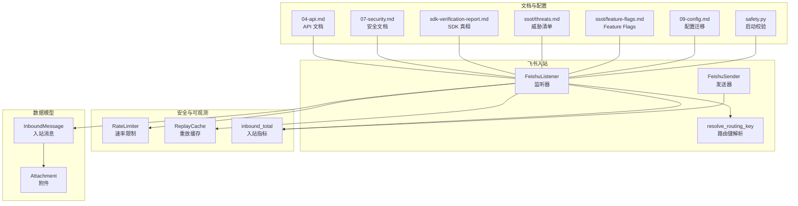
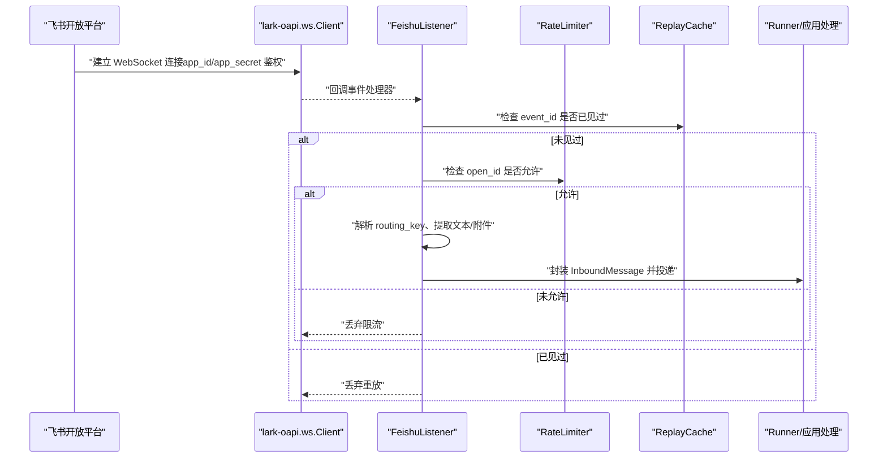
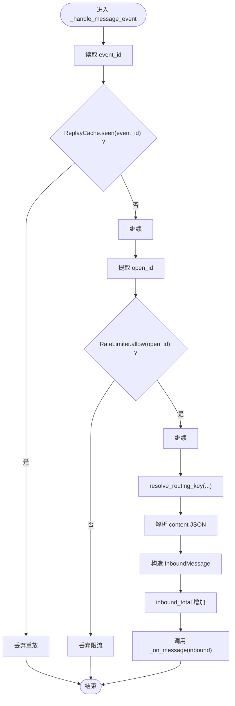
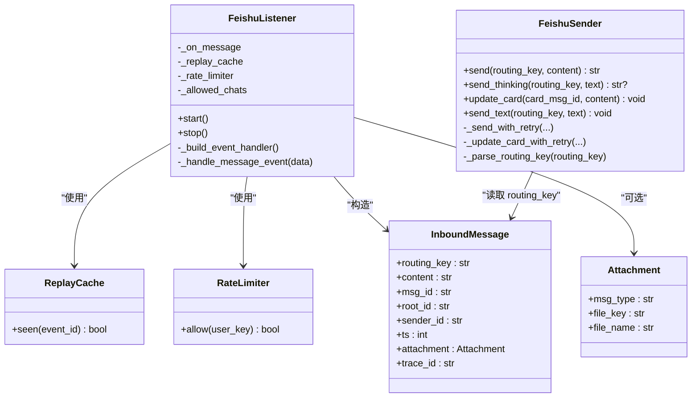

# 飞书 Webhook（入站）

<cite>
**本文引用的文件**
- [listener.py](file://xiaopaw/feishu/listener.py)
- [sender.py](file://xiaopaw/feishu/sender.py)
- [session_key.py](file://xiaopaw/feishu/session_key.py)
- [models.py](file://xiaopaw/models.py)
- [security.py](file://xiaopaw/observability/security.py)
- [04-api.md](file://docs/04-api.md)
- [07-security.md](file://docs/07-security.md)
- [sdk-verification-report.md](file://docs/sdk-verification-report.md)
- [ssot/threats.md](file://docs/ssot/threats.md)
- [ssot/feature-flags.md](file://docs/ssot/feature-flags.md)
- [09-config.md](file://docs/09-config.md)
- [safety.py](file://xiaopaw/config/safety.py)
</cite>

## 目录
1. [简介](#简介)
2. [项目结构](#项目结构)
3. [核心组件](#核心组件)
4. [架构总览](#架构总览)
5. [详细组件分析](#详细组件分析)
6. [依赖分析](#依赖分析)
7. [性能考虑](#性能考虑)
8. [故障排查指南](#故障排查指南)
9. [结论](#结论)
10. [附录](#附录)

## 简介
本文件面向飞书 WebSocket 入站 Webhook 的 API 文档，覆盖以下主题：
- WebSocket 连接建立与断线重连
- 事件订阅机制与消息处理流程
- 两种事件类型：im.message.receive_v1 与 im.chat.member.bot.added_v1 的触发条件、消息格式与处理逻辑
- SDK 真相说明（app_id/app_secret 鉴权）
- 应用层重放防护（ReplayCache）
- 速率限制机制
- 错误处理策略
- 完整事件 Schema 定义
- 鉴权配置与 v2.1 版本安全加固要点

## 项目结构
围绕飞书入站 Webhook 的相关代码主要位于 xiaopaw/feishu 目录，配合 observability 安全与可观测性模块、共享数据模型以及文档化的安全与配置基线。

图表来源
- [listener.py:1-148](file://xiaopaw/feishu/listener.py#L1-L148)
- [sender.py:1-149](file://xiaopaw/feishu/sender.py#L1-L149)
- [session_key.py:1-21](file://xiaopaw/feishu/session_key.py#L1-L21)
- [security.py:1-73](file://xiaopaw/observability/security.py#L1-L73)
- [models.py:1-35](file://xiaopaw/models.py#L1-L35)
- [04-api.md:52-171](file://docs/04-api.md#L52-L171)
- [07-security.md:1-200](file://docs/07-security.md#L1-L200)
- [sdk-verification-report.md:1-173](file://docs/sdk-verification-report.md#L1-L173)
- [ssot/threats.md:1-147](file://docs/ssot/threats.md#L1-L147)
- [ssot/feature-flags.md:1-170](file://docs/ssot/feature-flags.md#L1-L170)
- [09-config.md:795-816](file://docs/09-config.md#L795-L816)
- [safety.py:1-47](file://xiaopaw/config/safety.py#L1-L47)

章节来源
- [04-api.md:52-171](file://docs/04-api.md#L52-L171)
- [07-security.md:1-200](file://docs/07-security.md#L1-L200)
- [sdk-verification-report.md:1-173](file://docs/sdk-verification-report.md#L1-L173)
- [ssot/threats.md:1-147](file://docs/ssot/threats.md#L1-L147)
- [ssot/feature-flags.md:1-170](file://docs/ssot/feature-flags.md#L1-L170)
- [09-config.md:795-816](file://docs/09-config.md#L795-L816)
- [safety.py:1-47](file://xiaopaw/config/safety.py#L1-L47)

## 核心组件
- FeishuListener：负责建立与飞书的 WebSocket 连接，注册事件处理器，接收 im.message.receive_v1 与 im.chat.member.bot.added_v1 事件，进行速率限制、重放防护、路由键解析与消息封装，最终投递给应用层 on_message 回调。
- FeishuSender：负责将消息以交互卡片或文本形式发送回飞书，具备并发限制、重试与退避、限流码识别与指标上报。
- ReplayCache：应用层去重缓存，基于 LRU + TTL（约 5 分钟），用于抵御飞书 WebSocket 模式下的重放攻击。
- RateLimiter：每用户滑动窗口限流（默认每用户 20 条/分钟），用于抵御 DoS。
- resolve_routing_key：根据聊天类型、chat_id、open_id、thread_id 生成统一的 routing_key，便于下游路由与会话管理。
- InboundMessage/Attachment：入站消息与附件的数据模型，承载 trace_id、路由键、消息体、时间戳、附件等信息。

章节来源
- [listener.py:21-148](file://xiaopaw/feishu/listener.py#L21-L148)
- [sender.py:18-149](file://xiaopaw/feishu/sender.py#L18-L149)
- [security.py:11-73](file://xiaopaw/observability/security.py#L11-L73)
- [session_key.py:6-21](file://xiaopaw/feishu/session_key.py#L6-L21)
- [models.py:10-35](file://xiaopaw/models.py#L10-L35)

## 架构总览
飞书 WebSocket 入站采用“长连接 Client”模式，由 XiaoPaw 主动连接飞书开放平台，飞书在握手阶段使用 app_id/app_secret 完成服务端鉴权，随后主动推送事件。应用层在入口处实施 ReplayCache 去重与 RateLimiter 限流，再将标准化的 InboundMessage 投递至业务处理链。

图表来源
- [listener.py:42-148](file://xiaopaw/feishu/listener.py#L42-L148)
- [security.py:11-73](file://xiaopaw/observability/security.py#L11-L73)
- [sdk-verification-report.md:9-34](file://docs/sdk-verification-report.md#L9-L34)

章节来源
- [04-api.md:54-123](file://docs/04-api.md#L54-L123)
- [07-security.md:10-148](file://docs/07-security.md#L10-L148)
- [sdk-verification-report.md:9-34](file://docs/sdk-verification-report.md#L9-L34)

## 详细组件分析

### WebSocket 连接与事件订阅
- 连接建立：FeishuListener.start() 创建 lark-oapi.ws.Client，传入 app_id、app_secret、event_handler，并在独立线程中运行 ws.Client.start()，主线程通过 asyncio loop 与回调桥接。
- 事件订阅：注册 im.message.receive_v1（私聊消息）与 im.chat.member.bot.added_v1（机器人被加入群组）两类事件；其中私聊消息通过 _build_event_handler 注册 p2_im_message_receive_v1。
- 断线重连：lark-oapi 自动重连，指数退避；5 分钟未重连触发告警。

章节来源
- [listener.py:42-79](file://xiaopaw/feishu/listener.py#L42-L79)
- [04-api.md:54-73](file://docs/04-api.md#L54-L73)
- [04-api.md:160-165](file://docs/04-api.md#L160-L165)

### 事件处理流程（im.message.receive_v1）
- 入口：_handle_message_event(data)
- 去重：从 data.header.event_id 获取 event_id，调用 ReplayCache.seen(event_id)。若已见过则直接返回。
- 限流：从 sender.sender_id.open_id 获取 open_id，调用 RateLimiter.allow(open_id)。若不允许则记录指标并丢弃。
- 路由键：resolve_routing_key(chat_type, chat_id, open_id, thread_id) 生成 routing_key。
- 内容解析：解析 msg.content（JSON 字符串），提取 text；根据 message_type 与 content 字段构造 Attachment（image/file）。
- 封装消息：构建 InboundMessage，包含 routing_key、content、msg_id/root_id、sender_id、ts、attachment、trace_id。
- 指标：inbound_total 增加，标签包含 source=feishu 与 routing_type。
- 投递：await self._on_message(inbound)。

图表来源
- [listener.py:81-148](file://xiaopaw/feishu/listener.py#L81-L148)
- [session_key.py:6-21](file://xiaopaw/feishu/session_key.py#L6-L21)
- [models.py:17-35](file://xiaopaw/models.py#L17-L35)

章节来源
- [listener.py:81-148](file://xiaopaw/feishu/listener.py#L81-L148)
- [session_key.py:6-21](file://xiaopaw/feishu/session_key.py#L6-L21)
- [models.py:17-35](file://xiaopaw/models.py#L17-L35)

### 事件处理流程（im.chat.member.bot.added_v1）
- 入口：_build_event_handler 注册的回调在收到机器人被加入群事件时触发。
- 处理：FeishuListener.on_bot_added（可选回调）被调用，用于发送欢迎语或初始化群会话。
- 说明：该事件不参与 im.message.receive_v1 的消息处理路径，但属于入站事件订阅的一部分。

章节来源
- [listener.py:68-79](file://xiaopaw/feishu/listener.py#L68-L79)
- [04-api.md:67-73](file://docs/04-api.md#L67-L73)

### SDK 真相与鉴权说明
- lark-oapi.ws.Client 真实签名仅接受 app_id、app_secret、log_level、event_handler、domain、auto_reconnect，不支持 encrypt_key/verification_token。
- WebSocket 模式下，飞书服务端在握手阶段使用 app_secret 签发 token 并校验，应用侧无需 HMAC 验签。
- 因此 v2.1 将 T3 防御聚焦到应用层 ReplayCache（event_id LRU + TTL），与 SDK 真相对齐。

章节来源
- [sdk-verification-report.md:9-34](file://docs/sdk-verification-report.md#L9-L34)
- [04-api.md:91-123](file://docs/04-api.md#L91-L123)

### 应用层重放防护（ReplayCache）
- 职责：防御 T3 飞书 Webhook 重放（见 ssot/threats.md#T3）。
- 实现：LRU + TTL（约 5 分钟），进程级缓存，重启丢失；跨重启/多节点需改用 Redis SET event_id 1 EX 300 NX。
- Feature Flag：F9 enable_webhook_replay_cache（v2.1 从 enable_webhook_signature 改名），生产环境强制开启。

章节来源
- [security.py:47-73](file://xiaopaw/observability/security.py#L47-L73)
- [ssot/threats.md:14](file://docs/ssot/threats.md#L14)
- [ssot/feature-flags.md:20-21](file://docs/ssot/feature-flags.md#L20-L21)
- [04-api.md:124-145](file://docs/04-api.md#L124-L145)

### 速率限制机制
- RateLimiter：每用户 60 秒滑动窗口，阈值默认 20 条/分钟；超限静默丢弃并增加指标。
- 适用范围：入站消息（im.message.receive_v1）按 open_id 限流；发送侧（FeishuSender）通过 asyncio.Semaphore 控制并发。

章节来源
- [security.py:11-27](file://xiaopaw/observability/security.py#L11-L27)
- [sender.py:18-30](file://xiaopaw/feishu/sender.py#L18-L30)
- [04-api.md:146-156](file://docs/04-api.md#L146-L156)

### 错误处理策略
- WebSocket 断开：lark-oapi 自动重连，指数退避；5 分钟未重连触发告警。
- 事件解析失败：记录 WARNING 日志，丢弃该事件，不影响后续。
- 下游异常：_on_message 内 try/except 兜底，避免异常冒泡导致 Client 断开。

章节来源
- [04-api.md:160-165](file://docs/04-api.md#L160-L165)
- [listener.py:146-148](file://xiaopaw/feishu/listener.py#L146-L148)

### 事件 Schema 定义
- im.message.receive_v1（私聊消息）关键字段（来自 lark-oapi 自动解析）：
  - message_id: str（om_xxx）
  - chat_id: str（oc_xxx）
  - thread_id: str（ot_xxx，话题消息）
  - chat_type: str（p2p/group）
  - message_type: str（text/image/file/post/audio）
  - content: str（JSON 字符串）
  - sender: Sender
  - create_time: int（毫秒）
- im.chat.member.bot.added_v1（机器人被加入群）：用于触发欢迎语或初始化群会话。

章节来源
- [04-api.md:74-89](file://docs/04-api.md#L74-L89)
- [04-api.md:67-73](file://docs/04-api.md#L67-L73)

### 鉴权配置与 v2.1 安全加固
- 配置迁移（v2.1）：凭证全部迁至 .env；encrypt_key/verification_token 从配置 schema 移除；prod 强制启用若干 Feature Flags。
- 启动校验（safety.py）：app_id/app_secret 非空且强度达标；TestAPI 仅允许 loopback 且 dev 可用；prod 禁用 TestAPI。
- 安全加固（v2.1）：WebSocket 模式下 SDK 仅用 app_id/app_secret 鉴权；应用层 ReplayCache 必须启用（F9）；RateLimiter 必须启用（F10）。

章节来源
- [09-config.md:795-816](file://docs/09-config.md#L795-L816)
- [safety.py:27-47](file://xiaopaw/config/safety.py#L27-L47)
- [04-api.md:116-123](file://docs/04-api.md#L116-L123)
- [ssot/feature-flags.md:41-63](file://docs/ssot/feature-flags.md#L41-L63)

## 依赖分析
- FeishuListener 依赖：
  - lark-oapi.ws.Client（WebSocket 客户端）
  - ReplayCache（应用层去重）
  - RateLimiter（入站限流）
  - resolve_routing_key（路由键解析）
  - InboundMessage/Attachment（消息封装）
- FeishuSender 依赖：
  - lark-oapi.api.im.v1（消息创建/更新接口）
  - asyncio.Semaphore（并发控制）
  - 指标上报（feishu_rate_limit_total）

图表来源
- [listener.py:21-148](file://xiaopaw/feishu/listener.py#L21-L148)
- [sender.py:18-149](file://xiaopaw/feishu/sender.py#L18-L149)
- [security.py:11-73](file://xiaopaw/observability/security.py#L11-L73)
- [models.py:10-35](file://xiaopaw/models.py#L10-L35)

章节来源
- [listener.py:21-148](file://xiaopaw/feishu/listener.py#L21-L148)
- [sender.py:18-149](file://xiaopaw/feishu/sender.py#L18-L149)
- [security.py:11-73](file://xiaopaw/observability/security.py#L11-L73)
- [models.py:10-35](file://xiaopaw/models.py#L10-L35)

## 性能考虑
- 并发与限流：
  - 入站：每用户 20 条/分钟滑动窗口限流，避免 DoS。
  - 出站：发送器使用 asyncio.Semaphore 控制最大并发，默认 5；对飞书限流码进行识别并按退避策略重试。
- 指标与可观测：
  - inbound_total 按 source=feishu 与 routing_type 维度统计入站消息。
  - feishu_rate_limit_total 记录飞书限流事件。
- 缓存与内存：
  - ReplayCache 使用 LRU + TTL，容量与 TTL 可配置；注意进程重启后缓存丢失。

章节来源
- [security.py:11-27](file://xiaopaw/observability/security.py#L11-L27)
- [sender.py:14-30](file://xiaopaw/feishu/sender.py#L14-L30)
- [04-api.md:666-721](file://docs/04-api.md#L666-L721)

## 故障排查指南
- WebSocket 断连：
  - 现象：长时间无事件或网络抖动导致断开。
  - 处理：lark-oapi 自动重连；若 5 分钟未恢复，触发告警。检查 app_id/app_secret 有效性与网络可达性。
- 事件重复：
  - 现象：短时间内收到相同 event_id 的重复事件。
  - 处理：ReplayCache 已去重；若频繁发生，检查是否跨节点部署且未使用 Redis 去重。
- 速率限制：
  - 现象：大量消息被静默丢弃。
  - 处理：查看 RateLimiter 阈值与 open_id 分布；必要时提升阈值或分流。
- 发送失败：
  - 现象：飞书返回限流码或 HTTP 429。
  - 处理：FeishuSender 已内置退避重试与指标上报；检查限流码识别与 Retry-After 处理。

章节来源
- [04-api.md:160-165](file://docs/04-api.md#L160-L165)
- [sdk-verification-report.md:81-97](file://docs/sdk-verification-report.md#L81-L97)
- [security.py:47-73](file://xiaopaw/observability/security.py#L47-L73)

## 结论
本方案以 lark-oapi WebSocket 长连接为基础，结合应用层 ReplayCache 与 RateLimiter，形成对 T3（重放）与 T7（DoS）的双重防护；v2.1 将“SDK 侧验签”的假设修正为“服务端建连验签 + 应用层去重”，并在配置与启动校验层面强化了生产环境的安全基线。对于多节点部署，建议将 ReplayCache 替换为分布式缓存（如 Redis）以实现跨节点去重。

## 附录

### 事件类型与处理逻辑对照
- im.message.receive_v1
  - 触发条件：私聊或群聊中的消息事件
  - 处理逻辑：去重 → 限流 → 解析 routing_key → 解析 content → 构造 InboundMessage → 投递
- im.chat.member.bot.added_v1
  - 触发条件：机器人被加入群组
  - 处理逻辑：调用 on_bot_added 回调（可选），用于欢迎语或初始化

章节来源
- [04-api.md:67-73](file://docs/04-api.md#L67-L73)
- [listener.py:68-79](file://xiaopaw/feishu/listener.py#L68-L79)