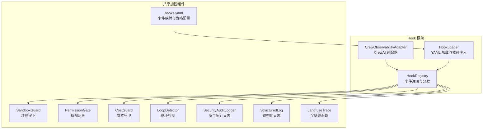
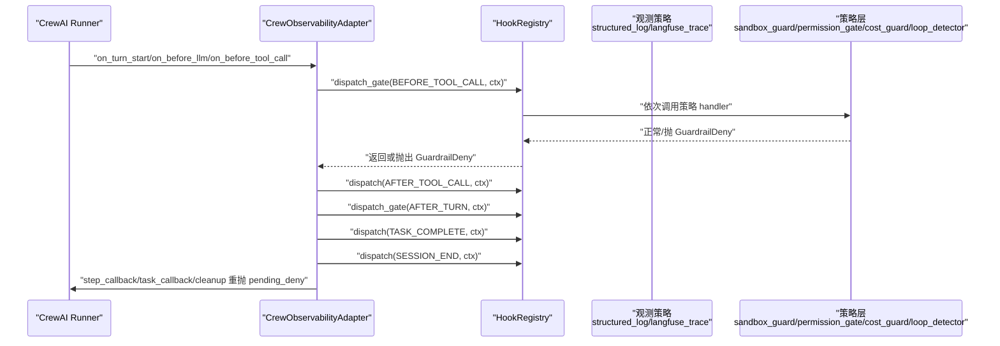
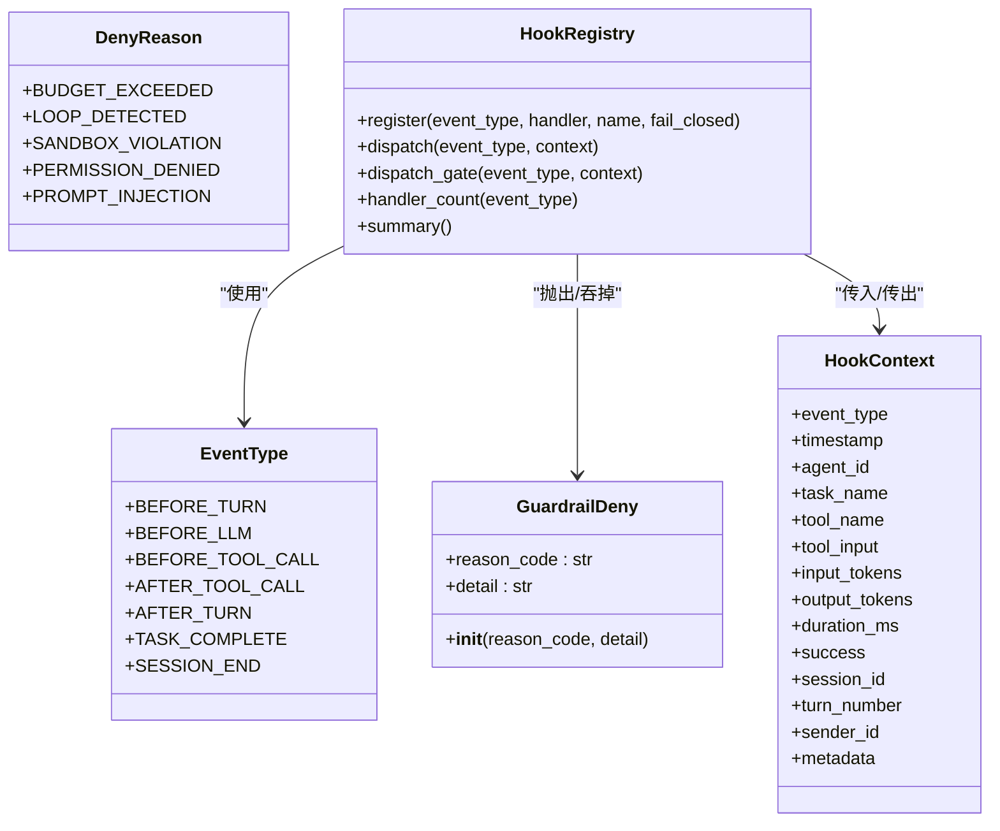
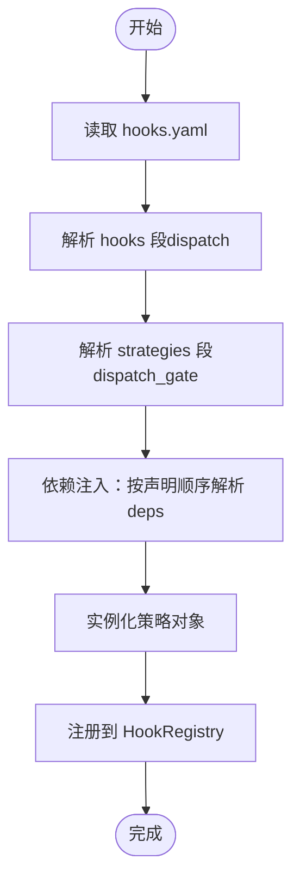
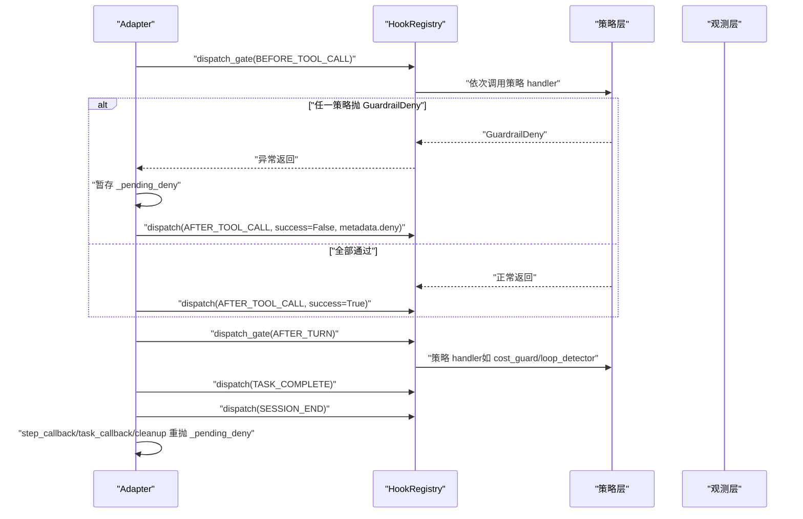
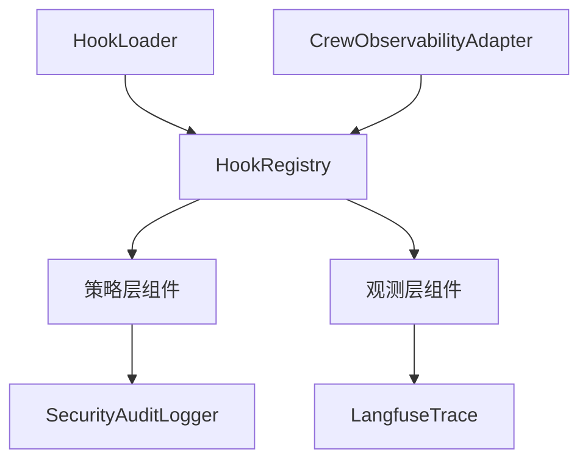

# Hook 框架加固层

<cite>
**本文档引用的文件**
- [registry.py](file://xiaopaw/hook_framework/registry.py)
- [loader.py](file://xiaopaw/hook_framework/loader.py)
- [crew_adapter.py](file://xiaopaw/hook_framework/crew_adapter.py)
- [hooks.yaml](file://shared_hooks/hooks.yaml)
- [sandbox_guard.py](file://shared_hooks/sandbox_guard.py)
- [permission_gate.py](file://shared_hooks/permission_gate.py)
- [cost_guard.py](file://shared_hooks/cost_guard.py)
- [loop_detector.py](file://shared_hooks/loop_detector.py)
- [audit_logger.py](file://shared_hooks/audit_logger.py)
- [structured_log.py](file://shared_hooks/structured_log.py)
- [langfuse_trace.py](file://shared_hooks/langfuse_trace.py)
- [test_hook_registry.py](file://tests/unit/hook_framework/test_hook_registry.py)
- [test_hook_loader.py](file://tests/unit/hook_framework/test_hook_loader.py)
- [test_crew_adapter.py](file://tests/unit/hook_framework/test_crew_adapter.py)
- [test_adapter_integration.py](file://tests/integration/test_adapter_integration.py)
</cite>

## 目录
1. [引言](#引言)
2. [项目结构](#项目结构)
3. [核心组件](#核心组件)
4. [架构总览](#架构总览)
5. [详细组件分析](#详细组件分析)
6. [依赖分析](#依赖分析)
7. [性能考虑](#性能考虑)
8. [故障排除指南](#故障排除指南)
9. [结论](#结论)
10. [附录](#附录)

## 引言
本文件面向 XiaoPaw v2 的 Hook 框架加固层，系统性阐述 HookRegistry、HookLoader 与 CrewObservabilityAdapter 的设计与实现，详解五类策略层组件（观测策略、安全策略、可靠性策略）的职责、交互与集成方式，并提供来自实际代码库的示例路径、配置选项、参数与返回值说明，以及常见问题与解决方案。

## 项目结构
Hook 框架加固层位于 xiaopaw/hook_framework 目录，配合 shared_hooks 中的观测与策略组件共同工作。核心文件包括：
- registry.py：事件类型、上下文、注册中心与两套分发机制
- loader.py：hooks.yaml 解析、两层加载与依赖注入
- crew_adapter.py：CrewAI 回调适配器，将 CrewAI 生命周期翻译为 5+2 事件
- shared_hooks/hooks.yaml：全局加固层配置，定义 hooks 与 strategies 段
- shared_hooks 下的策略与观测组件：sandbox_guard、permission_gate、cost_guard、loop_detector、audit_logger、structured_log、langfuse_trace

图表来源
- [registry.py:118-209](file://xiaopaw/hook_framework/registry.py#L118-L209)
- [loader.py:29-246](file://xiaopaw/hook_framework/loader.py#L29-L246)
- [crew_adapter.py:63-357](file://xiaopaw/hook_framework/crew_adapter.py#L63-L357)
- [hooks.yaml:1-73](file://shared_hooks/hooks.yaml#L1-L73)

章节来源
- [registry.py:1-209](file://xiaopaw/hook_framework/registry.py#L1-L209)
- [loader.py:1-246](file://xiaopaw/hook_framework/loader.py#L1-L246)
- [crew_adapter.py:1-357](file://xiaopaw/hook_framework/crew_adapter.py#L1-L357)
- [hooks.yaml:1-73](file://shared_hooks/hooks.yaml#L1-L73)

## 核心组件
本节聚焦 HookRegistry、HookLoader、CrewObservabilityAdapter 的职责、接口与行为。

- HookRegistry
  - 定义 EventType（5 个核心事件 + 2 个补充事件）
  - 定义只读 HookContext（frozen + MappingProxyType）
  - 提供两套分发机制：
    - dispatch：报警器模式，异常吞掉，不影响业务
    - dispatch_gate：保险丝模式，唯一能穿透的异常是 GuardrailDeny，支持 fail-closed
  - 支持注册顺序即执行顺序，便于按 hooks.yaml 行序控制链路

- HookLoader
  - 从 hooks.yaml 加载两层配置：hooks（观测层）与 strategies（策略层）
  - 严格保证 hooks 段先于 strategies 段加载，确保即使策略层阻断，观测 handler 已记录完整证据链
  - 支持依赖注入：strategies 段通过 deps 指定依赖，按声明顺序实例化
  - 支持两层加载：先全局 shared_hooks，后 workspace 用户级 hooks

- CrewObservabilityAdapter
  - 将 CrewAI 生命周期事件翻译为 5+2 事件
  - 使用 pending_deny 模式：CrewAI 吞掉 BEFORE_TOOL_CALL 异常，通过 step_callback/task_callback/cleanup 安全出口统一重抛
  - 计算工具调用耗时 duration_ms，推断 turn 边界，维护 _current_turn_has_llm 标记
  - 与 LangfuseTrace 协作，保证 trace 关闭与 flush 的正确时机

章节来源
- [registry.py:28-209](file://xiaopaw/hook_framework/registry.py#L28-L209)
- [loader.py:29-246](file://xiaopaw/hook_framework/loader.py#L29-L246)
- [crew_adapter.py:63-357](file://xiaopaw/hook_framework/crew_adapter.py#L63-L357)

## 架构总览
Hook 框架加固层采用“事件驱动 + 分层策略”的设计。CrewAI 通过 CrewObservabilityAdapter 将其回调转换为 Hook 事件，HookRegistry 负责事件分发；观测层（structured_log、langfuse_trace）使用 dispatch；策略层（sandbox_guard、permission_gate、cost_guard、loop_detector、retry_tracker）使用 dispatch_gate 并可阻断业务流。

图表来源
- [crew_adapter.py:160-357](file://xiaopaw/hook_framework/crew_adapter.py#L160-L357)
- [registry.py:153-198](file://xiaopaw/hook_framework/registry.py#L153-L198)
- [hooks.yaml:1-73](file://shared_hooks/hooks.yaml#L1-L73)

## 详细组件分析

### HookRegistry：事件与分发引擎
- 事件类型（EventType）
  - 核心事件：BEFORE_TURN、BEFORE_LLM、BEFORE_TOOL_CALL、AFTER_TOOL_CALL、AFTER_TURN
  - 补充事件：TASK_COMPLETE、SESSION_END
- 上下文（HookContext）
  - frozen=True + MappingProxyType，确保 handler 间数据不可变
  - 字段包含事件类型、时间戳、会话/轮次信息、工具名与输入、token 用量、耗时、成功标志、元数据等
- 分发机制
  - dispatch：异常吞掉，适合观测层（如日志/trace 写失败不应影响业务）
  - dispatch_gate：唯一能穿透的异常是 GuardrailDeny；fail-closed=True 时，handler 内部异常转为 GuardrailDeny，确保安全组件崩溃时默认拒绝
- 异常（GuardrailDeny）
  - 原因码（DenyReason）：预算超支、循环检测、沙箱违规、权限不足、提示注入
  - 用于阻断 BEFORE_TOOL_CALL 链路，由 runner 捕获并反馈用户

图表来源
- [registry.py:28-209](file://xiaopaw/hook_framework/registry.py#L28-L209)

章节来源
- [registry.py:28-209](file://xiaopaw/hook_framework/registry.py#L28-L209)

### HookLoader：YAML 解析与依赖注入
- 两段式 YAML 结构
  - hooks：观测层 handler（无状态函数），使用 dispatch
  - strategies：策略层对象（有状态），使用 dispatch_gate
- 两层加载
  - 先全局 shared_hooks，后 workspace 用户级 hooks
  - 保证即使策略层阻断，观测 handler 已记录完整 trace
- 依赖注入
  - strategies 段通过 deps 指定依赖，按声明顺序实例化
  - 依赖缺失仅警告（fail-open），但运行时 AttributeError 会被 fail-closed 策略转换为 GuardrailDeny
- 安全约束
  - 路径遍历检测，模块/类/函数解析失败时打印错误但不中断流程

图表来源
- [loader.py:37-154](file://xiaopaw/hook_framework/loader.py#L37-L154)

章节来源
- [loader.py:29-246](file://xiaopaw/hook_framework/loader.py#L29-L246)
- [hooks.yaml:1-73](file://shared_hooks/hooks.yaml#L1-L73)

### CrewObservabilityAdapter：CrewAI 适配器
- 事件映射
  - on_turn_start → BEFORE_TURN
  - on_before_llm → BEFORE_LLM
  - on_before_tool_call → BEFORE_TOOL_CALL（dispatch_gate + pending_deny）
  - on_after_tool_call → AFTER_TOOL_CALL（dispatch）
  - step_callback → AFTER_TURN（安全出口，重抛 pending_deny）
  - task_callback → TASK_COMPLETE（安全出口，重抛 pending_deny）
  - cleanup → SESSION_END（flush Langfuse）
- pending_deny 模式
  - CrewAI 吞掉 BEFORE_TOOL_CALL 抛出的异常，Adapter 暂存 GuardrailDeny，等待安全出口统一重抛
  - 即使工具未执行，仍发送一次 AFTER_TOOL_CALL（标记 guardrail_deny），确保 trace 完整
- 耗时与转储
  - 工具调用耗时 duration_ms 基于 time.monotonic() 计算
  - after_turn_handler 末尾强制 flush，保证用户收到回复时 Langfuse 数据已就绪

图表来源
- [crew_adapter.py:160-357](file://xiaopaw/hook_framework/crew_adapter.py#L160-L357)
- [registry.py:153-198](file://xiaopaw/hook_framework/registry.py#L153-L198)

章节来源
- [crew_adapter.py:63-357](file://xiaopaw/hook_framework/crew_adapter.py#L63-L357)

### 五类策略层组件

#### 观测策略
- structured_log：每事件一行 JSON 输出到 stderr，无状态函数，使用 dispatch
- langfuse_trace：Langfuse 全链路追踪，基于 ContextVar 与批处理缓冲，强制 flush 保证可见性

章节来源
- [structured_log.py:1-97](file://shared_hooks/structured_log.py#L1-L97)
- [langfuse_trace.py:1-800](file://shared_hooks/langfuse_trace.py#L1-L800)

#### 安全策略
- sandbox_guard：确定性输入消毒（fail-closed），检测路径穿越、危险命令、Shell 注入、提示注入，支持审计日志记录
- permission_gate：工具权限网关（deny > warn > allow），支持从 YAML 加载权限矩阵，默认 deny/warn/allow 策略

章节来源
- [sandbox_guard.py:1-168](file://shared_hooks/sandbox_guard.py#L1-L168)
- [permission_gate.py:1-107](file://shared_hooks/permission_gate.py#L1-L107)
- [audit_logger.py:1-90](file://shared_hooks/audit_logger.py#L1-L90)

#### 可靠性策略
- cost_guard：实时 token 成本追踪与预算硬停，双事件挂载（BEFORE_TOOL_CALL、AFTER_TURN），确保顺序敏感
- loop_detector：通过状态哈希去重检测循环（tool_loop、turn_loop），阈值可配置
- retry_tracker：重试次数跟踪，防止过度重试

章节来源
- [cost_guard.py:1-100](file://shared_hooks/cost_guard.py#L1-L100)
- [loop_detector.py:1-84](file://shared_hooks/loop_detector.py#L1-L84)
- [hooks.yaml:67-73](file://shared_hooks/hooks.yaml#L67-L73)

### 策略层关系与集成
- hooks.yaml 定义事件与 handler 的绑定，strategies 段通过 deps 共享 audit_logger 实例
- 顺序约束：
  - hooks 段必须整体先于 strategies 段加载，确保被策略阻断时仍有完整观测记录
  - cost_guard 必须在 loop_detector 之前，避免循环场景下预算统计偏差
- fail-closed 与 fail-open：
  - 安全策略 handler 建议设置 fail_closed=True，崩溃即拒绝
  - 依赖缺失仅警告（fail-open），但运行时 AttributeError 会被转换为 GuardrailDeny

章节来源
- [loader.py:13-18](file://xiaopaw/hook_framework/loader.py#L13-L18)
- [hooks.yaml:1-73](file://shared_hooks/hooks.yaml#L1-L73)
- [cost_guard.py:11-16](file://shared_hooks/cost_guard.py#L11-L16)

## 依赖分析
- 组件耦合
  - HookRegistry 与策略层通过事件枚举耦合，策略层通过 fail-closed 控制语义
  - HookLoader 与 YAML 配置强耦合，依赖策略声明顺序与依赖键
  - CrewObservabilityAdapter 与 HookRegistry 强耦合，依赖 pending_deny 与安全出口
- 外部依赖
  - Langfuse SDK（可选启用），通过环境变量控制
  - YAML 解析与模块动态加载（importlib）

图表来源
- [loader.py:29-154](file://xiaopaw/hook_framework/loader.py#L29-L154)
- [registry.py:118-209](file://xiaopaw/hook_framework/registry.py#L118-L209)
- [crew_adapter.py:63-100](file://xiaopaw/hook_framework/crew_adapter.py#L63-L100)

章节来源
- [loader.py:29-246](file://xiaopaw/hook_framework/loader.py#L29-L246)
- [registry.py:118-209](file://xiaopaw/hook_framework/registry.py#L118-L209)
- [crew_adapter.py:63-100](file://xiaopaw/hook_framework/crew_adapter.py#L63-L100)

## 性能考虑
- dispatch 与 dispatch_gate 的异常吞掉策略避免观测层抖动影响业务
- fail-closed 仅在策略层启用，降低安全组件故障带来的风险
- LangfuseTrace 使用批处理缓冲与强制 flush，减少网络调用频率
- 工具耗时基于 monotonic 时间测量，避免时钟回拨影响
- 循环检测使用 MD5 前缀与滑动窗口，内存占用可控

## 故障排除指南
- 策略层被阻断但无观测记录
  - 检查 hooks.yaml 是否将 hooks 段置于 strategies 段之前
  - 确认观测 handler 已注册并使用 dispatch
- 安全组件崩溃导致系统拒绝
  - 将相关策略 handler 设置 fail_closed=True，确保崩溃即拒绝
- 依赖缺失导致 AttributeError
  - 确保 deps 指定的策略在 hooks.yaml 中先声明并实例化
  - 若依赖缺失，仅警告（fail-open），但运行时会触发 GuardrailDeny
- pending_deny 未被正确重抛
  - 确认 step_callback/task_callback/cleanup 是否被调用
  - 检查 Adapter 的 _pending_deny 字段是否为空
- Langfuse 数据未就绪
  - 确认 after_turn_handler 末尾的 flush 调用
  - 检查 TRACE_TO_LANGFUSE 环境变量与密钥配置

章节来源
- [test_hook_registry.py:72-144](file://tests/unit/hook_framework/test_hook_registry.py#L72-L144)
- [test_hook_loader.py:208-287](file://tests/unit/hook_framework/test_hook_loader.py#L208-L287)
- [test_crew_adapter.py:145-245](file://tests/unit/hook_framework/test_crew_adapter.py#L145-L245)
- [test_adapter_integration.py:38-138](file://tests/integration/test_adapter_integration.py#L38-L138)

## 结论
Hook 框架加固层通过 HookRegistry 的两套分发机制、HookLoader 的两层加载与依赖注入、CrewObservabilityAdapter 的安全出口模式，实现了“观测无侵入、策略可阻断、顺序可约束”的加固体系。结合五类策略层组件，系统在安全性、可观测性与可靠性方面形成闭环，既满足生产环境的强约束，又保持良好的可维护性与扩展性。

## 附录

### 配置选项与参数说明
- hooks.yaml
  - hooks 段：事件名 → handler 列表（模块.函数）
  - strategies 段：name/class/config/hooks/deps
  - 示例路径：[hooks.yaml:1-73](file://shared_hooks/hooks.yaml#L1-L73)
- 环境变量
  - TRACE_TO_LANGFUSE：启用 LangfuseTrace
  - XIAOPAW_LANGFUSE_PUBLIC_KEY/SECRET_KEY/BASE_URL：Langfuse 凭证
  - SECURITY_AUDIT_FILE：安全审计日志文件路径
  - COST_GUARD_BUDGET：成本预算（美元）
- 策略配置示例
  - cost_guard：budget_usd、model
  - loop_detector：threshold
  - permission_gate：tools（字典）、default（deny/warn/allow）
  - sandbox_guard：与 audit_logger 共享实例
  - retry_tracker：max_retries

章节来源
- [hooks.yaml:28-73](file://shared_hooks/hooks.yaml#L28-L73)
- [langfuse_trace.py:38-100](file://shared_hooks/langfuse_trace.py#L38-L100)
- [cost_guard.py:34-44](file://shared_hooks/cost_guard.py#L34-L44)
- [loop_detector.py:28-31](file://shared_hooks/loop_detector.py#L28-L31)
- [permission_gate.py:32-39](file://shared_hooks/permission_gate.py#L32-L39)
- [sandbox_guard.py:93-108](file://shared_hooks/sandbox_guard.py#L93-L108)
- [retry_tracker.py:1-200](file://shared_hooks/retry_tracker.py#L1-L200)