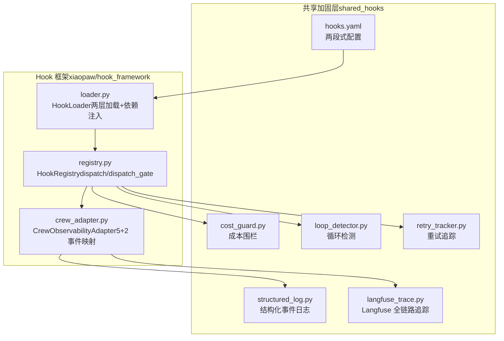
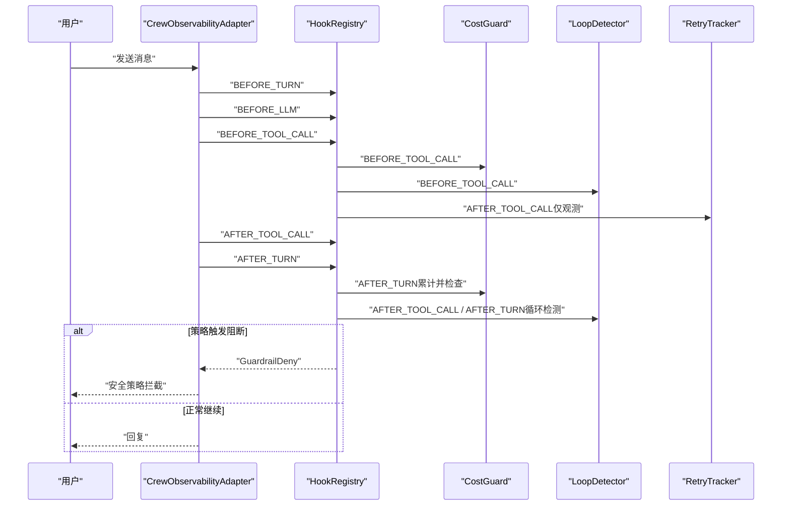
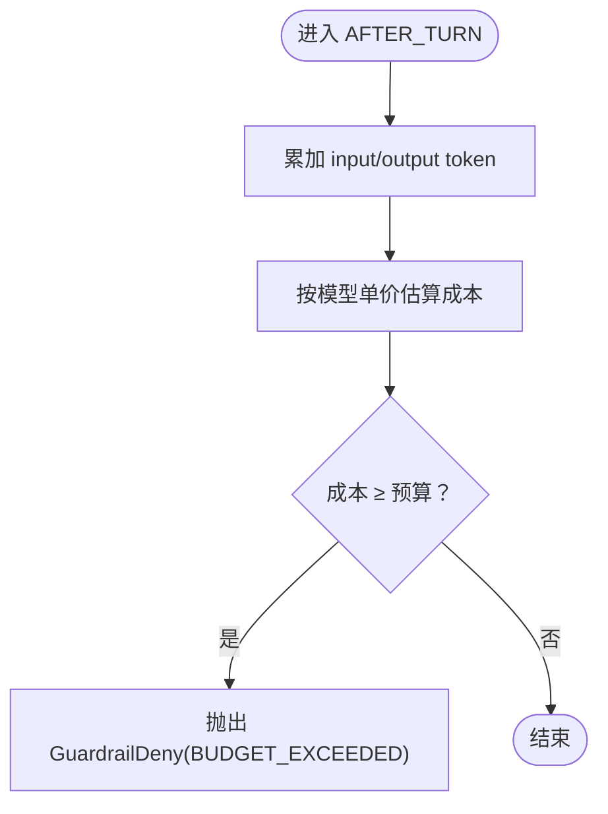
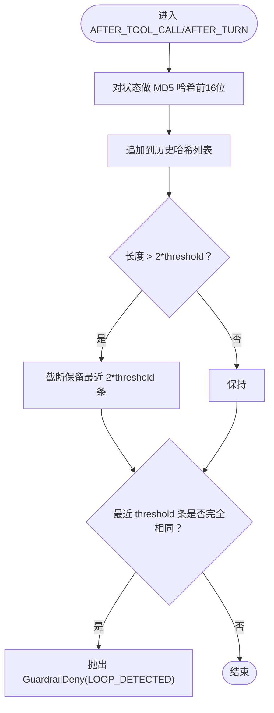
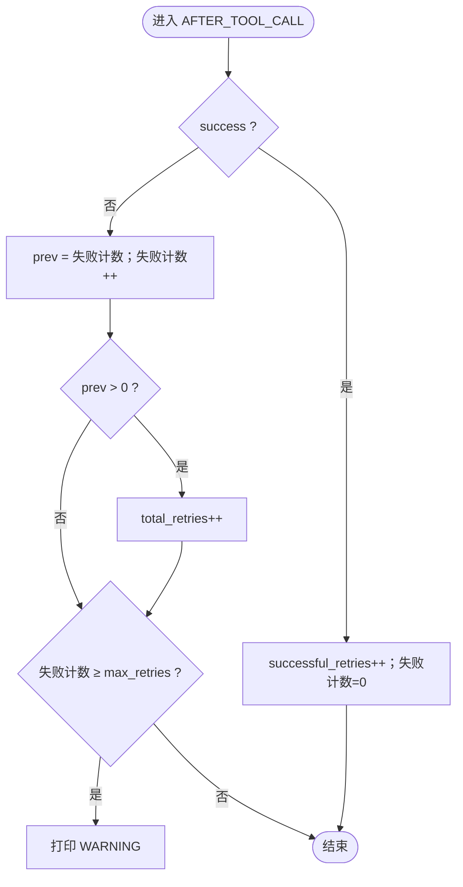
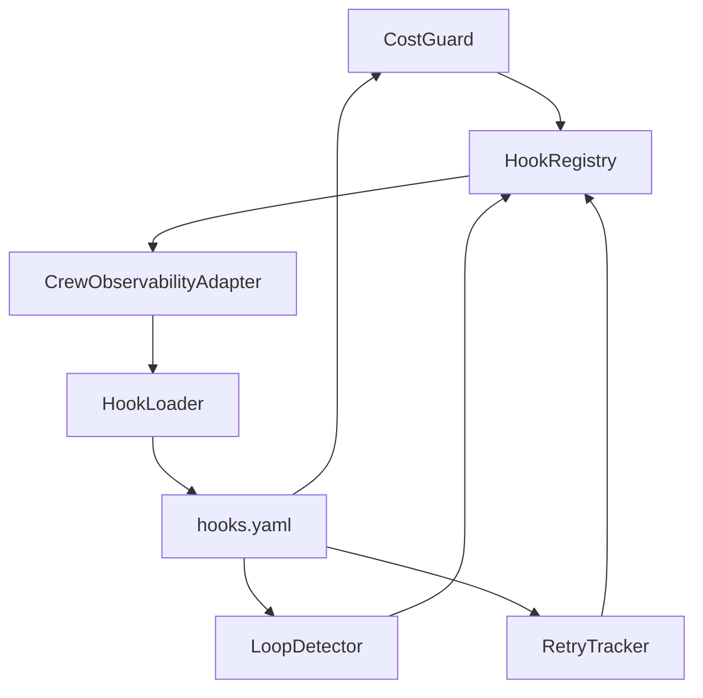

# 可靠性策略层

<cite>
**本文引用的文件**
- [cost_guard.py](file://shared_hooks/cost_guard.py)
- [loop_detector.py](file://shared_hooks/loop_detector.py)
- [retry_tracker.py](file://shared_hooks/retry_tracker.py)
- [hooks.yaml](file://shared_hooks/hooks.yaml)
- [registry.py](file://xiaopaw/hook_framework/registry.py)
- [loader.py](file://xiaopaw/hook_framework/loader.py)
- [crew_adapter.py](file://xiaopaw/hook_framework/crew_adapter.py)
- [test_cost_guard.py](file://tests/unit/shared_hooks/test_cost_guard.py)
- [test_loop_detector.py](file://tests/unit/shared_hooks/test_loop_detector.py)
- [test_retry_tracker.py](file://tests/unit/shared_hooks/test_retry_tracker.py)
- [test_e2e_12_reliability.py](file://tests/e2e/test_e2e_12_reliability.py)
- [structured_log.py](file://shared_hooks/structured_log.py)
- [langfuse_trace.py](file://shared_hooks/langfuse_trace.py)
- [DESIGN.md](file://DESIGN.md)
- [09-config.md](file://docs/09-config.md)
</cite>

## 目录
1. [简介](#简介)
2. [项目结构](#项目结构)
3. [核心组件](#核心组件)
4. [架构总览](#架构总览)
5. [详细组件分析](#详细组件分析)
6. [依赖关系分析](#依赖关系分析)
7. [性能考量](#性能考量)
8. [故障排查指南](#故障排查指南)
9. [结论](#结论)
10. [附录](#附录)

## 简介
本文件面向 XiaoPaw v2 的可靠性策略层，系统性阐述成本围栏（CostGuard）、循环检测（LoopDetector）与重试追踪（RetryTracker）的实现原理、事件处理机制、配置方法与监控指标，并结合真实测试用例与端到端场景，给出稳定性优化建议与故障恢复策略。

## 项目结构
可靠性策略层位于 shared_hooks 目录，采用“两段式 hooks.yaml”配置：
- 观测层（hooks 段）：使用 dispatch 模式，异常吞掉不影响业务，确保即使被策略层拦截，Langfuse 仍能记录完整 trace。
- 策略层（strategies 段）：使用 dispatch_gate 模式，仅 GuardrailDeny 能穿透，形成“保险丝”阻断链路。

可靠性策略层包含三个核心策略：
- CostGuard：实时 token 成本追踪 + 预算硬停
- LoopDetector：MD5 状态哈希去重检测循环
- RetryTracker：纯观测策略，统计工具重试成功率

图表来源
- [hooks.yaml:1-73](file://shared_hooks/hooks.yaml#L1-L73)
- [loader.py:37-154](file://xiaopaw/hook_framework/loader.py#L37-L154)
- [registry.py:118-209](file://xiaopaw/hook_framework/registry.py#L118-L209)
- [crew_adapter.py:63-357](file://xiaopaw/hook_framework/crew_adapter.py#L63-L357)

章节来源
- [hooks.yaml:1-73](file://shared_hooks/hooks.yaml#L1-L73)
- [loader.py:37-154](file://xiaopaw/hook_framework/loader.py#L37-L154)
- [registry.py:118-209](file://xiaopaw/hook_framework/registry.py#L118-L209)
- [crew_adapter.py:63-357](file://xiaopaw/hook_framework/crew_adapter.py#L63-L357)

## 核心组件
- 成本围栏（CostGuard）
  - 作用：在每轮结束后累计 input/output token，按模型单价估算美元成本；超过预算立即阻断。
  - 关键事件：AFTER_TURN（累计并检查）、BEFORE_TOOL_CALL（工具调用前二次校验）。
  - 配置项：budget_usd（支持环境变量覆盖）。
  - 指标：总输入/输出 token、估算成本、预算、拒绝次数。
- 循环检测（LoopDetector）
  - 作用：对工具维度与对话维度的状态做 MD5 哈希，连续 N 次相同即判定循环阻断。
  - 关键事件：AFTER_TOOL_CALL（工具循环）、AFTER_TURN（对话循环）。
  - 配置项：threshold（默认 3）。
  - 指标：总轮次、总工具调用、唯一状态数、循环检测次数。
- 重试追踪（RetryTracker）
  - 作用：统计每个工具的连续失败次数与“成功重试”的比例，仅观测不阻断。
  - 关键事件：AFTER_TOOL_CALL。
  - 配置项：max_retries（WARNING 阈值，非阻断阈值）。
  - 指标：活跃失败工具、总重试次数、成功重试次数、重试成功率。

章节来源
- [cost_guard.py:34-100](file://shared_hooks/cost_guard.py#L34-L100)
- [loop_detector.py:28-84](file://shared_hooks/loop_detector.py#L28-L84)
- [retry_tracker.py:21-68](file://shared_hooks/retry_tracker.py#L21-L68)
- [hooks.yaml:51-73](file://shared_hooks/hooks.yaml#L51-L73)

## 架构总览
可靠性策略层的执行顺序与事件流如下：

图表来源
- [crew_adapter.py:160-301](file://xiaopaw/hook_framework/crew_adapter.py#L160-L301)
- [registry.py:170-198](file://xiaopaw/hook_framework/registry.py#L170-L198)
- [cost_guard.py:68-82](file://shared_hooks/cost_guard.py#L68-L82)
- [loop_detector.py:38-72](file://shared_hooks/loop_detector.py#L38-L72)
- [retry_tracker.py:30-57](file://shared_hooks/retry_tracker.py#L30-L57)

章节来源
- [crew_adapter.py:160-301](file://xiaopaw/hook_framework/crew_adapter.py#L160-L301)
- [registry.py:170-198](file://xiaopaw/hook_framework/registry.py#L170-L198)

## 详细组件分析

### 成本围栏（CostGuard）
- 实现要点
  - 模型定价表与默认保守估价，按百万分之一计算美元成本。
  - AFTER_TURN 累计 token 并即时检查预算；BEFORE_TOOL_CALL 再次检查，防止工具调用前的越界消费。
  - 拒绝计数与环境变量覆盖（COST_GUARD_BUDGET）。
- 事件处理
  - AFTER_TURN：累计 token → 估算成本 → 超预算抛 GuardrailDeny（BUDGET_EXCEEDED）。
  - BEFORE_TOOL_CALL：若累计成本已达预算，再次阻断。
- 指标输出
  - total_input_tokens、total_output_tokens、estimated_cost_usd、budget_usd、deny_count。

图表来源
- [cost_guard.py:52-66](file://shared_hooks/cost_guard.py#L52-L66)

章节来源
- [cost_guard.py:34-100](file://shared_hooks/cost_guard.py#L34-L100)
- [test_cost_guard.py:27-107](file://tests/unit/shared_hooks/test_cost_guard.py#L27-L107)

### 循环检测（LoopDetector）
- 实现要点
  - 对工具维度（tool_name + tool_output）与对话维度（LLM 输出）分别做 MD5 哈希，连续 threshold 次相同即判定循环。
  - 使用 list 维护历史哈希，长度超过 2*threshold 时截断，避免内存膨胀。
- 事件处理
  - AFTER_TOOL_CALL：记录工具状态哈希，检测工具循环。
  - AFTER_TURN：记录 LLM 输出哈希，检测对话循环。
- 指标输出
  - total_turns、total_tool_calls、unique_tool_states、unique_turn_states、loop_detections。

图表来源
- [loop_detector.py:56-72](file://shared_hooks/loop_detector.py#L56-L72)

章节来源
- [loop_detector.py:28-84](file://shared_hooks/loop_detector.py#L28-L84)
- [test_loop_detector.py:27-85](file://tests/unit/shared_hooks/test_loop_detector.py#L27-L85)

### 重试追踪（RetryTracker）
- 实现要点
  - 仅观测不阻断：连续失败达到 max_retries 时打印 WARNING，不抛异常。
  - 状态机：失败计数随工具名独立维护；成功后清零并计入“成功重试”。
  - 重试成功率 = 成功重试次数 / 总重试次数。
- 事件处理
  - AFTER_TOOL_CALL：根据 success 更新失败计数与统计。
- 指标输出
  - active_failures（活跃失败工具）、total_retries、successful_retries、retry_success_rate。

图表来源
- [retry_tracker.py:30-57](file://shared_hooks/retry_tracker.py#L30-L57)

章节来源
- [retry_tracker.py:21-68](file://shared_hooks/retry_tracker.py#L21-L68)
- [test_retry_tracker.py:18-67](file://tests/unit/shared_hooks/test_retry_tracker.py#L18-L67)

### 事件处理与执行顺序
- 事件映射与顺序
  - BEFORE_TURN → BEFORE_LLM → BEFORE_TOOL_CALL → AFTER_TOOL_CALL → AFTER_TURN
  - 策略层注册顺序即执行顺序，hooks.yaml 中 cost_guard 必须在 loop_detector 之前，以确保循环场景下先算账再阻断。
- 拒绝传播
  - dispatch_gate 模式下，仅 GuardrailDeny 能穿透；其他异常被吞掉或转换为 fail-closed（安全 handler）。
- pending_deny 机制
  - CrewAI 会吞掉 @before_tool_use 抛出的异常，因此在 step_callback / task_callback 等“安全出口”重抛，确保 Runner 能收到并回复用户“安全策略拦截”。

章节来源
- [crew_adapter.py:160-301](file://xiaopaw/hook_framework/crew_adapter.py#L160-L301)
- [registry.py:170-198](file://xiaopaw/hook_framework/registry.py#L170-L198)
- [hooks.yaml:51-73](file://shared_hooks/hooks.yaml#L51-L73)

## 依赖关系分析
可靠性策略层的依赖与耦合关系如下：

图表来源
- [cost_guard.py:21-22](file://shared_hooks/cost_guard.py#L21-L22)
- [loop_detector.py:25-26](file://shared_hooks/loop_detector.py#L25-L26)
- [retry_tracker.py:18-19](file://shared_hooks/retry_tracker.py#L18-L19)
- [loader.py:100-154](file://xiaopaw/hook_framework/loader.py#L100-L154)
- [hooks.yaml:51-73](file://shared_hooks/hooks.yaml#L51-L73)

章节来源
- [loader.py:100-154](file://xiaopaw/hook_framework/loader.py#L100-L154)
- [registry.py:118-209](file://xiaopaw/hook_framework/registry.py#L118-L209)

## 性能考量
- 成本估算复杂度
  - CostGuard 的成本计算为 O(1)，仅涉及整数乘法与加法，开销极低。
- 循环检测复杂度
  - LoopDetector 对每条状态做 MD5 哈希 O(n)，n 为状态字符串长度；维护长度为 O(k) 的列表，k 为 threshold 的倍数，内存占用可控。
- 重试追踪复杂度
  - RetryTracker 使用字典按工具名维护失败计数，查询/更新均为平均 O(1)。
- 观测与追踪
  - structured_log.py 输出 JSON 到 stderr，不阻断业务；langfuse_trace.py 使用批处理缓冲与显式 flush，避免频繁网络调用。

章节来源
- [cost_guard.py:84-90](file://shared_hooks/cost_guard.py#L84-L90)
- [loop_detector.py:56-72](file://shared_hooks/loop_detector.py#L56-L72)
- [retry_tracker.py:25-28](file://shared_hooks/retry_tracker.py#L25-L28)
- [structured_log.py:22-27](file://shared_hooks/structured_log.py#L22-L27)
- [langfuse_trace.py:111-135](file://shared_hooks/langfuse_trace.py#L111-L135)

## 故障排查指南
- 预算超支（BUDGET_EXCEEDED）
  - 现象：用户收到“安全策略拦截：预算超支”提示。
  - 排查：检查 COST_GUARD_BUDGET 环境变量与 hooks.yaml 中 budget_usd；确认 AFTER_TURN 是否正确累计 token。
  - 参考测试：E2E-12 零预算直接阻断。
- 循环阻断（LOOP_DETECTED）
  - 现象：Agent 重复输出或工具返回相同结果导致阻断。
  - 排查：降低 threshold 或检查工具输出是否稳定；关注 unique_tool_states 与 unique_turn_states 指标。
- 重试风暴预警
  - 现象：WARNING 提示某工具连续失败达到 max_retries。
  - 排查：关注 retry_success_rate，低于 30% 的工具需排查；结合工具调用耗时与成功率分析。
- 拒绝未生效
  - 现象：策略层异常被吞掉，业务未阻断。
  - 排查：确认策略 handler 是否注册为 fail_closed；检查 dispatch_gate 的异常传播路径。

章节来源
- [test_e2e_12_reliability.py:21-51](file://tests/e2e/test_e2e_12_reliability.py#L21-L51)
- [test_cost_guard.py:54-107](file://tests/unit/shared_hooks/test_cost_guard.py#L54-L107)
- [test_loop_detector.py:27-85](file://tests/unit/shared_hooks/test_loop_detector.py#L27-L85)
- [test_retry_tracker.py:18-67](file://tests/unit/shared_hooks/test_retry_tracker.py#L18-L67)
- [registry.py:170-198](file://xiaopaw/hook_framework/registry.py#L170-L198)

## 结论
可靠性策略层通过“成本围栏 + 循环检测 + 重试追踪”的组合，实现了对高消耗与高风险场景的主动治理。其设计遵循“观测先于策略”的原则，确保即使被阻断，trace 与日志依然完整；同时通过严格的事件顺序与 fail-closed 机制，保障策略链路的确定性与可恢复性。运维可通过指标与测试用例快速定位问题，持续优化阈值与预算，提升系统稳定性与成本可控性。

## 附录

### 配置方法与监控指标
- 预算控制（CostGuard）
  - hooks.yaml：budget_usd（默认 1.0）；支持环境变量 COST_GUARD_BUDGET 覆盖。
  - 指标：estimated_cost_usd、deny_count。
- 循环检测（LoopDetector）
  - hooks.yaml：threshold（默认 3）。
  - 指标：loop_detections、unique_tool_states、unique_turn_states。
- 重试追踪（RetryTracker）
  - hooks.yaml：max_retries（默认 5）。
  - 指标：retry_success_rate、total_retries、successful_retries。
- 事件与可观测
  - structured_log.py：每事件一行 JSON 输出到 stderr。
  - langfuse_trace.py：trace_id = session_id，强制 flush 保证可见性。

章节来源
- [hooks.yaml:51-73](file://shared_hooks/hooks.yaml#L51-L73)
- [cost_guard.py:34-99](file://shared_hooks/cost_guard.py#L34-L99)
- [loop_detector.py:28-83](file://shared_hooks/loop_detector.py#L28-L83)
- [retry_tracker.py:21-67](file://shared_hooks/retry_tracker.py#L21-L67)
- [structured_log.py:22-97](file://shared_hooks/structured_log.py#L22-L97)
- [langfuse_trace.py:116-151](file://shared_hooks/langfuse_trace.py#L116-L151)