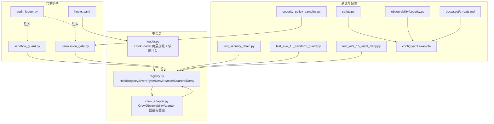
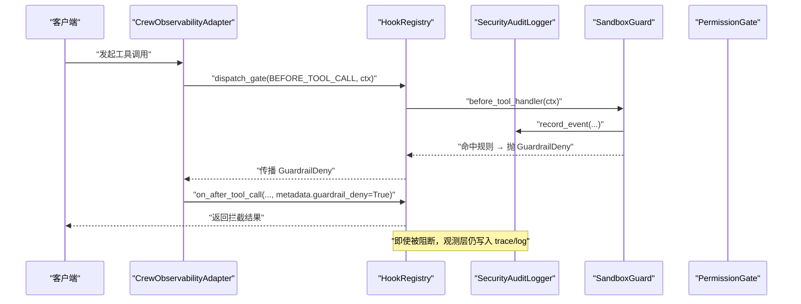
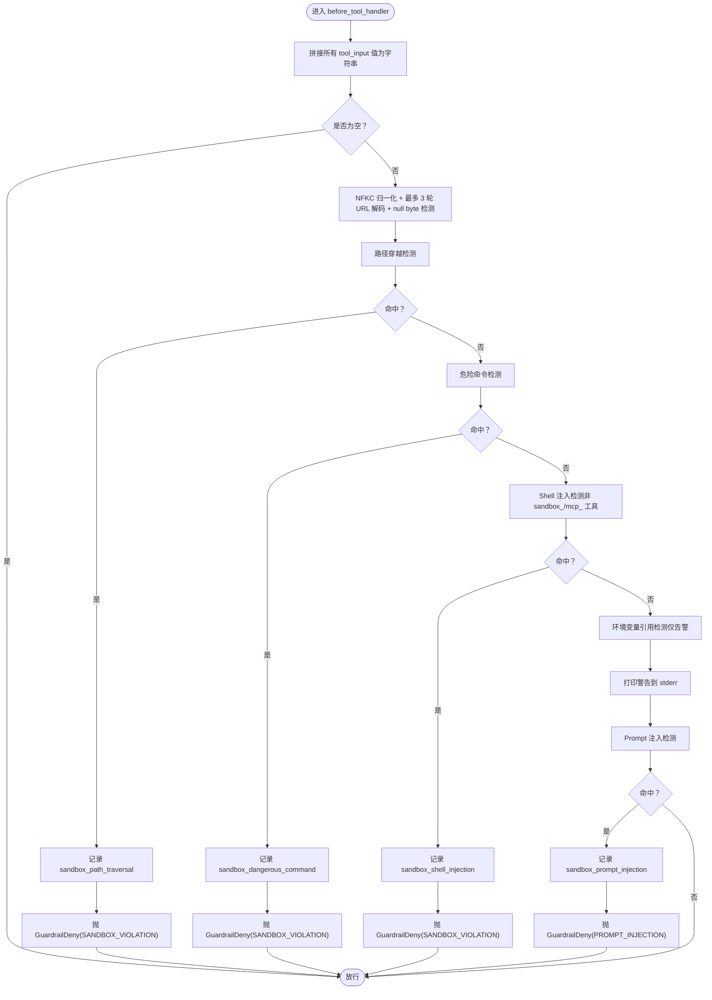
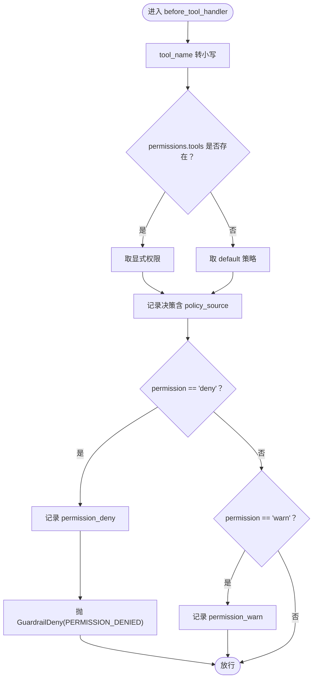
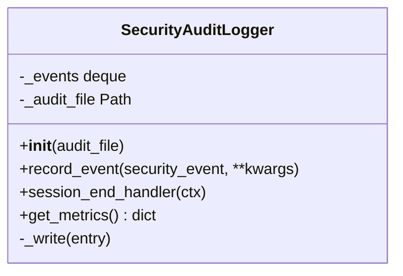
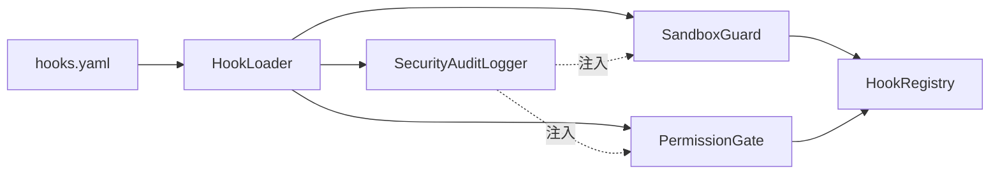
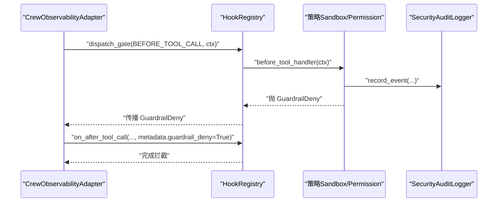
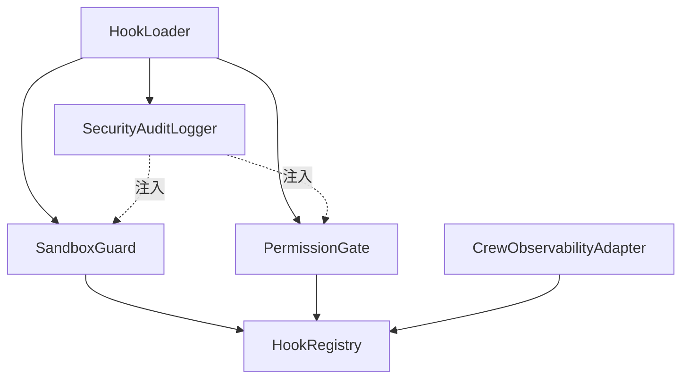

# 安全策略层

<cite>
**本文引用的文件**
- [shared_hooks/sandbox_guard.py](file://shared_hooks/sandbox_guard.py)
- [shared_hooks/permission_gate.py](file://shared_hooks/permission_gate.py)
- [shared_hooks/audit_logger.py](file://shared_hooks/audit_logger.py)
- [shared_hooks/hooks.yaml](file://shared_hooks/hooks.yaml)
- [xiaopaw/hook_framework/registry.py](file://xiaopaw/hook_framework/registry.py)
- [xiaopaw/hook_framework/loader.py](file://xiaopaw/hook_framework/loader.py)
- [xiaopaw/hook_framework/crew_adapter.py](file://xiaopaw/hook_framework/crew_adapter.py)
- [tests/integration/test_security_chain.py](file://tests/integration/test_security_chain.py)
- [tests/e2e/test_e2e_13_sandbox_guard.py](file://tests/e2e/test_e2e_13_sandbox_guard.py)
- [tests/e2e/test_e2e_15_audit_deny.py](file://tests/e2e/test_e2e_15_audit_deny.py)
- [tests/fixtures/security_policy_samples.py](file://tests/fixtures/security_policy_samples.py)
- [xiaopaw/config/safety.py](file://xiaopaw/config/safety.py)
- [xiaopaw/observability/security.py](file://xiaopaw/observability/security.py)
- [docs/ssot/threats.md](file://docs/ssot/threats.md)
- [config.yaml.example](file://config.yaml.example)
</cite>

## 目录
1. [简介](#简介)
2. [项目结构](#项目结构)
3. [核心组件](#核心组件)
4. [架构总览](#架构总览)
5. [详细组件分析](#详细组件分析)
6. [依赖分析](#依赖分析)
7. [性能考量](#性能考量)
8. [故障排查指南](#故障排查指南)
9. [结论](#结论)
10. [附录](#附录)

## 简介
本文件面向 XiaoPaw v2 的安全策略层，系统性阐述三层安全机制：沙箱防护（SandboxGuard）、权限门禁（PermissionGate）与审计日志（SecurityAuditLogger）。文档深入解释依赖注入系统（deps）如何在 hooks.yaml 中实现策略实例化与共享，以及 BEFORE_TOOL_CALL 事件的拦截与处理流程。同时提供来自实际代码库的示例路径，展示安全策略的配置与使用方法，并给出安全最佳实践与威胁防护指南。

## 项目结构
安全策略层位于共享钩子目录 shared_hooks 中，配合 hook_framework 提供的事件分发与依赖注入能力，在运行时形成“观测层（dispatch）+ 策略层（dispatch_gate）”的双轨机制。hooks.yaml 定义了策略的声明顺序、依赖关系与事件绑定，确保审计日志在最前、沙箱与权限策略紧随其后，从而实现 fail-closed 的兜底安全。

图表来源
- [shared_hooks/hooks.yaml:28-73](file://shared_hooks/hooks.yaml#L28-L73)
- [xiaopaw/hook_framework/loader.py:37-154](file://xiaopaw/hook_framework/loader.py#L37-L154)
- [xiaopaw/hook_framework/registry.py:118-209](file://xiaopaw/hook_framework/registry.py#L118-L209)
- [xiaopaw/hook_framework/crew_adapter.py:163-187](file://xiaopaw/hook_framework/crew_adapter.py#L163-L187)
- [tests/integration/test_security_chain.py:70-148](file://tests/integration/test_security_chain.py#L70-L148)
- [tests/e2e/test_e2e_13_sandbox_guard.py:24-79](file://tests/e2e/test_e2e_13_sandbox_guard.py#L24-L79)
- [tests/e2e/test_e2e_15_audit_deny.py:30-94](file://tests/e2e/test_e2e_15_audit_deny.py#L30-L94)
- [tests/fixtures/security_policy_samples.py:1-25](file://tests/fixtures/security_policy_samples.py#L1-L25)
- [xiaopaw/config/safety.py:27-48](file://xiaopaw/config/safety.py#L27-L48)
- [xiaopaw/observability/security.py:11-73](file://xiaopaw/observability/security.py#L11-L73)
- [docs/ssot/threats.md:1-147](file://docs/ssot/threats.md#L1-L147)
- [config.yaml.example:1-90](file://config.yaml.example#L1-L90)

章节来源
- [shared_hooks/hooks.yaml:1-73](file://shared_hooks/hooks.yaml#L1-L73)
- [xiaopaw/hook_framework/loader.py:37-154](file://xiaopaw/hook_framework/loader.py#L37-L154)
- [xiaopaw/hook_framework/registry.py:118-209](file://xiaopaw/hook_framework/registry.py#L118-L209)

## 核心组件
- 沙箱防护（SandboxGuard）：在 BEFORE_TOOL_CALL 事件上执行确定性输入消毒，涵盖路径穿越、危险命令、Shell 注入、Prompt 注入等五类规则，命中即抛 GuardrailDeny，fail-closed 兜底。
- 权限门禁（PermissionGate）：基于工具名的三级权限模型（deny > warn > allow），支持从 YAML 配置加载，默认策略为 warn 或 deny，未显式声明的工具走 default，fail-closed 与沙箱协同。
- 审计日志（SecurityAuditLogger）：append-only JSONL 安全审计日志，被多策略共享，支持会话级摘要，确保即使策略层阻断，观测层仍留有完整证据链。

章节来源
- [shared_hooks/sandbox_guard.py:93-168](file://shared_hooks/sandbox_guard.py#L93-L168)
- [shared_hooks/permission_gate.py:32-107](file://shared_hooks/permission_gate.py#L32-L107)
- [shared_hooks/audit_logger.py:30-90](file://shared_hooks/audit_logger.py#L30-L90)

## 架构总览
安全策略层采用“声明式配置 + 依赖注入 + 事件分发”的架构。hooks.yaml 中的 strategies 段定义策略实例化顺序与依赖关系；HookLoader 保证观测层先于策略层加载，策略层通过 deps 共享同一审计实例；HookRegistry 提供 dispatch 与 dispatch_gate 两种分发模式，前者用于观测层（异常吞掉），后者用于策略层（GuardrailDeny 阻断）。

图表来源
- [shared_hooks/hooks.yaml:28-49](file://shared_hooks/hooks.yaml#L28-L49)
- [xiaopaw/hook_framework/registry.py:170-198](file://xiaopaw/hook_framework/registry.py#L170-L198)
- [xiaopaw/hook_framework/crew_adapter.py:163-187](file://xiaopaw/hook_framework/crew_adapter.py#L163-L187)
- [shared_hooks/sandbox_guard.py:109-146](file://shared_hooks/sandbox_guard.py#L109-L146)
- [shared_hooks/permission_gate.py:57-94](file://shared_hooks/permission_gate.py#L57-L94)
- [shared_hooks/audit_logger.py:41-70](file://shared_hooks/audit_logger.py#L41-L70)

## 详细组件分析

### 沙箱防护（SandboxGuard）
- 事件绑定：BEFORE_TOOL_CALL，fail_closed=True，确保自身异常也转为拒绝。
- 输入预处理：NFKC 归一化 + 最多 3 轮 URL 解码 + null byte 检测，抵御编码绕过。
- 检测规则（短路求值）：
  1) 路径穿越：../ 或 ..\ 任一出现即拒绝。
  2) 危险命令：rm -rf、sudo、chmod 777、curl|sh、eval()/exec() 等。
  3) Shell 注入：; | && $( `，但对 sandbox_/mcp_ 前缀工具豁免（隔离容器内合法）。
  4) 环境变量引用：$VAR/${VAR} 仅告警，不拦截。
  5) Prompt 注入：[SYSTEM]/[INST]、<|system|>、忽略指令的中英文表达等，命中即拒绝。
- 审计记录：命中任一规则均通过共享 audit 实例写入安全事件，类型前缀为 sandbox_*。
- 指标输出：统计违规总数与按类型分布，便于运营监控。

图表来源
- [shared_hooks/sandbox_guard.py:109-146](file://shared_hooks/sandbox_guard.py#L109-L146)
- [shared_hooks/sandbox_guard.py:65-90](file://shared_hooks/sandbox_guard.py#L65-L90)

章节来源
- [shared_hooks/sandbox_guard.py:93-168](file://shared_hooks/sandbox_guard.py#L93-L168)

### 权限门禁（PermissionGate）
- 事件绑定：BEFORE_TOOL_CALL，fail-closed 与沙箱协同，先做输入安全检查再做权限判定。
- 权限模型：deny > warn > allow，未显式声明的工具走 default（建议设为 warn 或 deny）。
- 配置来源：支持从 YAML 文件加载 permissions.tools 与 default 策略，policy_source 字段区分“显式”与“默认”，便于事后审计。
- 审计记录：deny 与 warn 会写入安全事件，allow 静默放行。
- 指标输出：统计 allow/warn/deny 数量与被拒绝工具列表。

图表来源
- [shared_hooks/permission_gate.py:57-94](file://shared_hooks/permission_gate.py#L57-L94)

章节来源
- [shared_hooks/permission_gate.py:32-107](file://shared_hooks/permission_gate.py#L32-L107)
- [tests/fixtures/security_policy_samples.py:3-24](file://tests/fixtures/security_policy_samples.py#L3-L24)

### 审计日志（SecurityAuditLogger）
- 设计要点：append-only JSONL，每行一条事件；多策略共享同一实例；SESSION_END 写入会话摘要。
- 事件记录：record_event(timestamp, security_event, ...)，支持任意关键字参数。
- 会话摘要：session_end_handler 聚合事件类型与数量，便于巡检与报表。
- 指标输出：统计总事件数与按类型分布。

图表来源
- [shared_hooks/audit_logger.py:30-90](file://shared_hooks/audit_logger.py#L30-L90)

章节来源
- [shared_hooks/audit_logger.py:30-90](file://shared_hooks/audit_logger.py#L30-L90)

### 依赖注入系统（deps）与 hooks.yaml
- 策略实例化顺序：HookLoader 严格先加载 hooks 段（观测层），再加载 strategies 段（策略层），确保即使策略层阻断，观测 handler 已执行。
- 依赖注入约束：strategies 按声明顺序实例化，deps 中被依赖的策略必须在前面已实例化；否则只打 WARNING（fail-open），但运行时 AttributeError 会因 fail_closed 被转换为 GuardrailDeny，导致系统拒绝所有请求。
- hooks.yaml 示例：
  - audit_logger 必须排在 sandbox_guard 与 permission_gate 之前；
  - sandbox_guard 与 permission_gate 通过 deps: { audit: audit_logger } 注入同一审计实例；
  - BEFORE_TOOL_CALL 事件分别绑定各策略的 before_tool_handler。

图表来源
- [shared_hooks/hooks.yaml:28-49](file://shared_hooks/hooks.yaml#L28-L49)
- [xiaopaw/hook_framework/loader.py:88-154](file://xiaopaw/hook_framework/loader.py#L88-L154)
- [xiaopaw/hook_framework/registry.py:118-152](file://xiaopaw/hook_framework/registry.py#L118-L152)

章节来源
- [shared_hooks/hooks.yaml:28-49](file://shared_hooks/hooks.yaml#L28-L49)
- [xiaopaw/hook_framework/loader.py:88-154](file://xiaopaw/hook_framework/loader.py#L88-L154)

### BEFORE_TOOL_CALL 拦截与处理流程
- CrewObservabilityAdapter 在 on_before_tool_call 中构造 HookContext 并调用 dispatch_gate；
- 若任一策略抛出 GuardrailDeny，Adapter 捕获并暂存（pending_deny），随后补发一次 AFTER_TOOL_CALL（metadata.guardrail_deny=True），确保 Langfuse trace 完整；
- 完成拦截后系统恢复，后续正常消息可继续处理。

图表来源
- [xiaopaw/hook_framework/crew_adapter.py:163-187](file://xiaopaw/hook_framework/crew_adapter.py#L163-L187)
- [xiaopaw/hook_framework/registry.py:170-198](file://xiaopaw/hook_framework/registry.py#L170-L198)
- [shared_hooks/sandbox_guard.py:147-158](file://shared_hooks/sandbox_guard.py#L147-L158)
- [shared_hooks/permission_gate.py:77-93](file://shared_hooks/permission_gate.py#L77-L93)

章节来源
- [xiaopaw/hook_framework/crew_adapter.py:163-187](file://xiaopaw/hook_framework/crew_adapter.py#L163-L187)
- [tests/integration/test_security_chain.py:70-148](file://tests/integration/test_security_chain.py#L70-L148)

## 依赖分析
- 组件耦合：
  - SandboxGuard 与 PermissionGate 共享 SecurityAuditLogger 实例，降低重复依赖与配置复杂度。
  - HookLoader 通过 strategies 列表顺序与 deps 映射，强制依赖满足与实例化顺序。
- 外部依赖：
  - hooks.yaml 作为配置源，驱动 HookLoader 与 HookRegistry 的装配。
  - CrewObservabilityAdapter 作为运行时适配器，负责拦截与重抛 GuardrailDeny。
- 潜在风险：
  - 若 audit_logger 在 sandbox_guard/permission_gate 之后声明，运行时会因 None 注入导致 AttributeError，fail_closed 将触发 GuardrailDeny，系统被拒绝。
  - 权限策略 default 建议设为 warn 或 deny，避免新工具上线时默认 allow 导致误授权。

图表来源
- [xiaopaw/hook_framework/loader.py:100-154](file://xiaopaw/hook_framework/loader.py#L100-L154)
- [shared_hooks/sandbox_guard.py:96-100](file://shared_hooks/sandbox_guard.py#L96-L100)
- [shared_hooks/permission_gate.py:33-39](file://shared_hooks/permission_gate.py#L33-L39)

章节来源
- [xiaopaw/hook_framework/loader.py:88-154](file://xiaopaw/hook_framework/loader.py#L88-L154)
- [shared_hooks/sandbox_guard.py:96-100](file://shared_hooks/sandbox_guard.py#L96-L100)
- [shared_hooks/permission_gate.py:33-39](file://shared_hooks/permission_gate.py#L33-L39)

## 性能考量
- 输入预处理成本：NFKC 归一化 + 多轮 URL 解码，最多 3 轮，兼顾安全性与性能。
- 内存占用：SandboxGuard 与 PermissionGate 使用固定长度队列记录近期事件，避免长会话内存膨胀。
- 事件写入：SecurityAuditLogger 采用 append-only JSONL，写入为顺序追加，性能稳定。
- 建议：
  - 控制 tool_input 字段数量与长度，减少拼接成本；
  - 合理设置 default 权限策略，避免过多 warn 事件导致日志膨胀；
  - 使用环境变量 SECURITY_AUDIT_FILE 指定审计文件路径，便于外部 SIEM 系统消费。

[本节为通用指导，不涉及具体文件分析]

## 故障排查指南
- 现象：系统被拒绝（所有请求失败）
  - 可能原因：hooks.yaml 中 audit_logger 未排在 sandbox_guard/permission_gate 之前，导致 None 注入，fail_closed 触发 GuardrailDeny。
  - 处理：调整 hooks.yaml 策略声明顺序，确保 audit_logger 在前。
- 现象：权限策略未生效
  - 可能原因：default 设置为 allow，或 YAML 配置格式错误。
  - 处理：将 default 设为 warn/deny，检查 YAML 语法与 permissions.tools 键值。
- 现象：审计日志缺失
  - 可能原因：未设置 SECURITY_AUDIT_FILE 或文件不可写。
  - 处理：设置环境变量或传入 audit_file 参数，确认路径可写。
- 现象：提示被拦截但 trace 未记录
  - 可能原因：策略层阻断后未正确补发 AFTER_TOOL_CALL。
  - 处理：确认 CrewObservabilityAdapter 的 pending_deny 与重发逻辑。

章节来源
- [shared_hooks/audit_logger.py:14-20](file://shared_hooks/audit_logger.py#L14-L20)
- [shared_hooks/hooks.yaml:28-49](file://shared_hooks/hooks.yaml#L28-L49)
- [tests/e2e/test_e2e_15_audit_deny.py:33-94](file://tests/e2e/test_e2e_15_audit_deny.py#L33-L94)

## 结论
XiaoPaw v2 的安全策略层通过 hooks.yaml 的声明式配置与 HookLoader 的依赖注入，实现了“观测层先于策略层”的可靠证据链与 fail-closed 的兜底安全。SandboxGuard 与 PermissionGate 在 BEFORE_TOOL_CALL 事件上协同工作，前者专注输入安全，后者聚焦权限控制，二者共享 SecurityAuditLogger，确保所有安全事件可审计、可追踪。结合 CrewObservabilityAdapter 的拦截与重抛机制，系统在阻断攻击的同时保留完整的 trace 证据，满足生产环境的合规与可观测性需求。

[本节为总结性内容，不涉及具体文件分析]

## 附录

### 配置与使用示例（路径指引）
- 在 hooks.yaml 中声明策略与依赖：
  - [hooks.yaml 策略段与 deps 示例:28-49](file://shared_hooks/hooks.yaml#L28-L49)
- SandboxGuard 输入消毒与拦截：
  - [SandboxGuard 检测与拦截逻辑:109-146](file://shared_hooks/sandbox_guard.py#L109-L146)
- PermissionGate 权限策略加载与决策：
  - [PermissionGate YAML 加载与决策:42-94](file://shared_hooks/permission_gate.py#L42-L94)
  - [权限策略样例（YAML）:3-24](file://tests/fixtures/security_policy_samples.py#L3-L24)
- 审计日志写入与会话摘要：
  - [SecurityAuditLogger 事件记录与摘要:41-70](file://shared_hooks/audit_logger.py#L41-L70)
- E2E 场景验证：
  - [E2E-13：沙箱防护多规则覆盖:24-79](file://tests/e2e/test_e2e_13_sandbox_guard.py#L24-L79)
  - [E2E-15：审计日志与拒绝传播链:30-94](file://tests/e2e/test_e2e_15_audit_deny.py#L30-L94)
- 生产安全断言（弱凭证检测等）：
  - [生产安全断言与弱凭证检测:27-48](file://xiaopaw/config/safety.py#L27-L48)
- 威胁建模与防御矩阵：
  - [SSOT 威胁清单与 STRIDE 映射:1-147](file://docs/ssot/threats.md#L1-L147)
- 配置示例（含调试与可观测性开关）：
  - [配置示例（含 debug/observability/rate_limit/replay_cache）:45-90](file://config.yaml.example#L45-L90)

### 安全最佳实践与威胁防护
- 策略层顺序与依赖：
  - audit_logger 必须在 sandbox_guard/permission_gate 之前声明，避免 None 注入导致 fail-closed 拒绝。
- 权限策略默认值：
  - default 建议设为 warn 或 deny，避免新工具上线时默认 allow。
- 审计日志：
  - 使用 SECURITY_AUDIT_FILE 指定审计文件，便于外部 SIEM 系统消费；开启 SESSION_END 摘要便于巡检。
- 输入安全：
  - 依赖 SandboxGuard 的多轮 URL 解码与 NFKC 归一化，抵御编码绕过；对 sandbox_/mcp_ 工具的 Shell 命令组合给予合理豁免。
- 运行时拦截：
  - 确保 CrewObservabilityAdapter 正确处理 pending_deny 并补发 AFTER_TOOL_CALL，保留 trace 完整性。
- 威胁与缓解：
  - 参考威胁清单与防御矩阵，结合速率限制、ReplayCache、容器网络隔离等综合防御。

章节来源
- [shared_hooks/hooks.yaml:28-49](file://shared_hooks/hooks.yaml#L28-L49)
- [shared_hooks/sandbox_guard.py:96-100](file://shared_hooks/sandbox_guard.py#L96-L100)
- [shared_hooks/permission_gate.py:12-22](file://shared_hooks/permission_gate.py#L12-L22)
- [shared_hooks/audit_logger.py:14-20](file://shared_hooks/audit_logger.py#L14-L20)
- [docs/ssot/threats.md:63-82](file://docs/ssot/threats.md#L63-L82)
- [config.yaml.example:45-90](file://config.yaml.example#L45-L90)