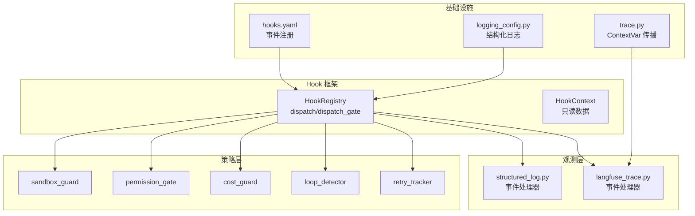
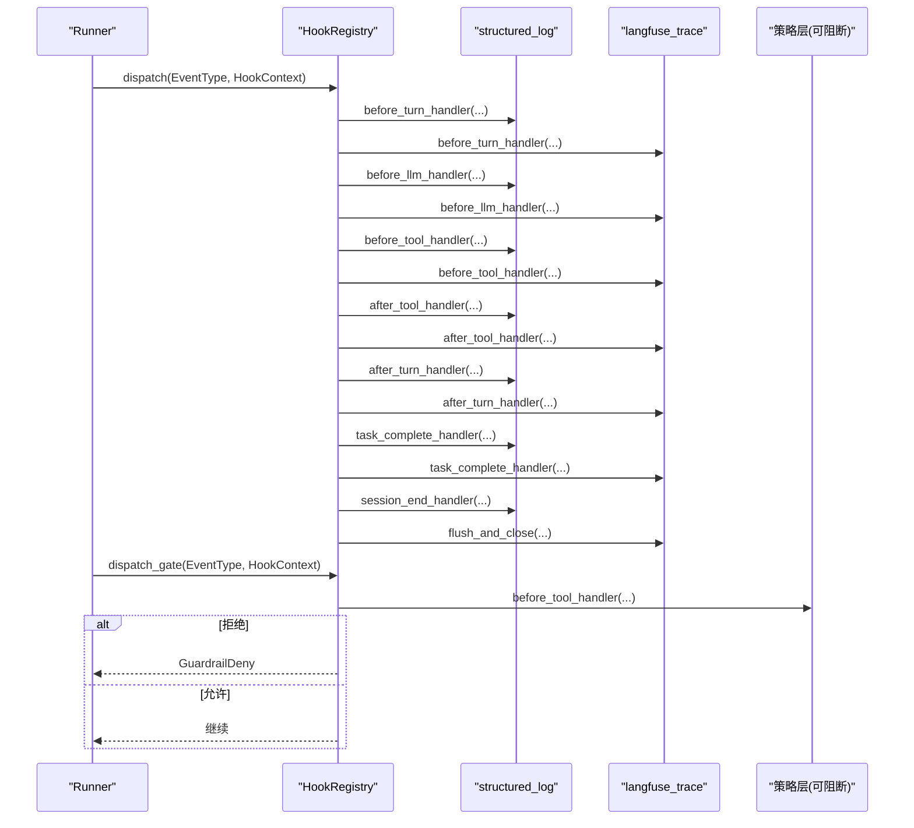
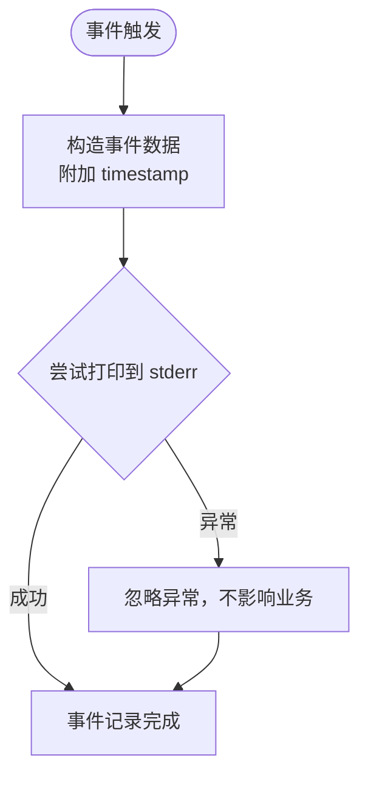
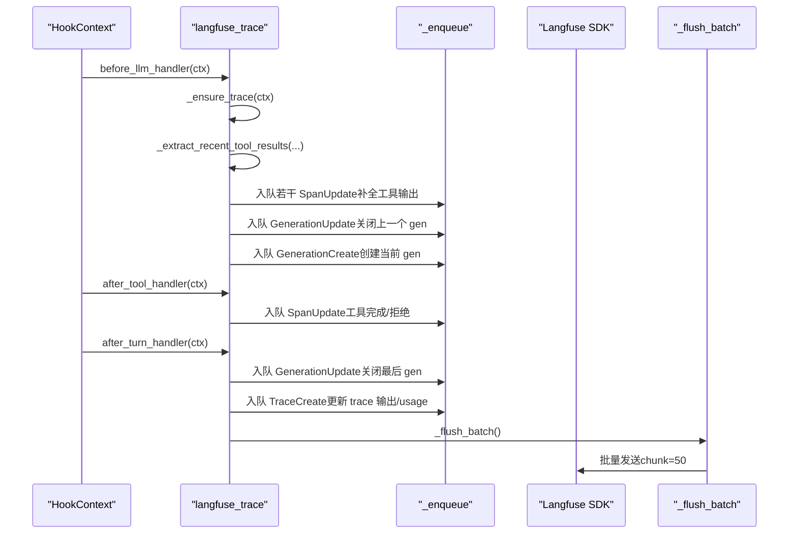
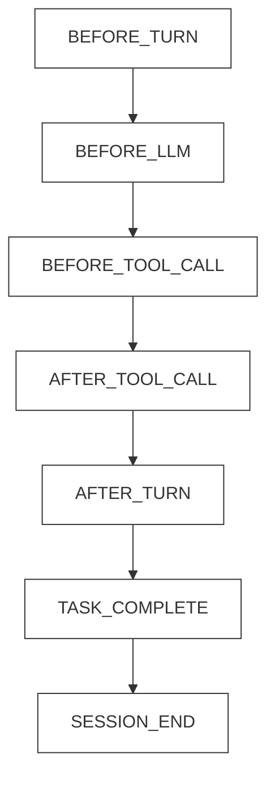
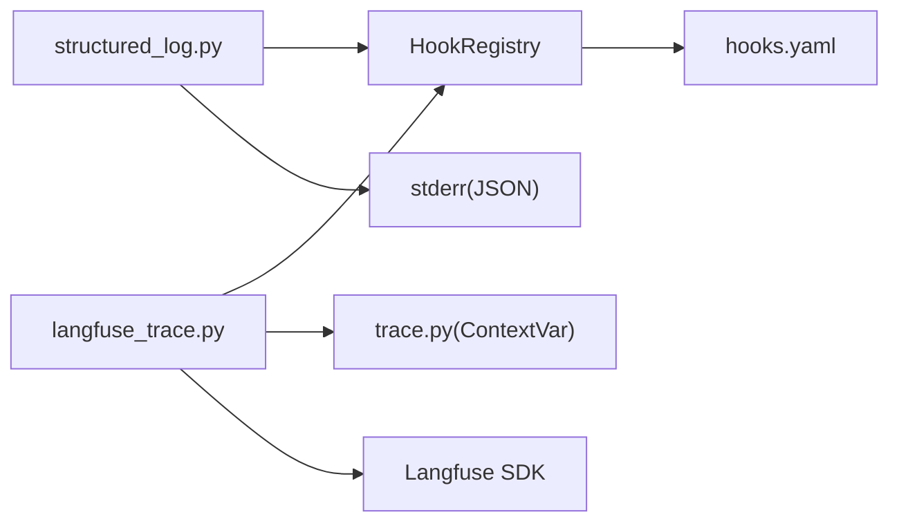

# 观测策略层

<cite>
**本文引用的文件**
- [shared_hooks/structured_log.py](file://shared_hooks/structured_log.py)
- [shared_hooks/langfuse_trace.py](file://shared_hooks/langfuse_trace.py)
- [shared_hooks/hooks.yaml](file://shared_hooks/hooks.yaml)
- [xiaopaw/hook_framework/registry.py](file://xiaopaw/hook_framework/registry.py)
- [xiaopaw/observability/trace.py](file://xiaopaw/observability/trace.py)
- [xiaopaw/observability/logging_config.py](file://xiaopaw/observability/logging_config.py)
- [tests/unit/shared_hooks/test_structured_log.py](file://tests/unit/shared_hooks/test_structured_log.py)
- [tests/unit/shared_hooks/test_langfuse_init.py](file://tests/unit/shared_hooks/test_langfuse_init.py)
- [tests/e2e/test_e2e_10_langfuse_trace.py](file://tests/e2e/test_e2e_10_langfuse_trace.py)
- [tests/e2e/test_e2e_11_events.py](file://tests/e2e/test_e2e_11_events.py)
- [docs/06-observability.md](file://docs/06-observability.md)
- [docs/15-e2e-fix-structured-log-and-timing.md](file://docs/15-e2e-fix-structured-log-and-timing.md)
- [docs/e2e-05-langfuse-trace-deep-analysis.md](file://docs/e2e-05-langfuse-trace-deep-analysis.md)
</cite>

## 目录
1. [简介](#简介)
2. [项目结构](#项目结构)
3. [核心组件](#核心组件)
4. [架构总览](#架构总览)
5. [详细组件分析](#详细组件分析)
6. [依赖分析](#依赖分析)
7. [性能考虑](#性能考虑)
8. [故障排除指南](#故障排除指南)
9. [结论](#结论)
10. [附录](#附录)

## 简介
本文件面向 XiaoPaw v2 的“观测策略层”，系统性阐述结构化日志系统（StructuredLog）与 Langfuse Trace 追踪系统的实现细节、事件处理器工作机制、配置与使用模式、数据采集/处理/传输机制，并提供性能优化建议与故障排除指南。观测策略层通过“5+2 事件体系”在 Hook 框架中实现可观测性，既保证业务稳健（观测失败不影响主流程），又提供强大的调试与审计能力。

## 项目结构
观测策略层位于共享钩子模块（shared_hooks），与策略层（sandbox_guard、permission_gate、cost_guard 等）共同构成 Hook 框架的“双层”设计：
- 观测层（dispatch）：结构化日志与 Langfuse Trace，负责事件记录与追踪，失败不影响业务
- 策略层（dispatch_gate）：安全与治理策略，失败可阻断业务

**图表来源**
- [shared_hooks/hooks.yaml:1-73](file://shared_hooks/hooks.yaml#L1-L73)
- [xiaopaw/hook_framework/registry.py:118-209](file://xiaopaw/hook_framework/registry.py#L118-L209)
- [shared_hooks/structured_log.py:1-97](file://shared_hooks/structured_log.py#L1-L97)
- [shared_hooks/langfuse_trace.py:1-800](file://shared_hooks/langfuse_trace.py#L1-L800)
- [xiaopaw/observability/trace.py:1-34](file://xiaopaw/observability/trace.py#L1-L34)
- [xiaopaw/observability/logging_config.py:1-61](file://xiaopaw/observability/logging_config.py#L1-L61)

**章节来源**
- [shared_hooks/hooks.yaml:1-73](file://shared_hooks/hooks.yaml#L1-L73)
- [xiaopaw/hook_framework/registry.py:1-209](file://xiaopaw/hook_framework/registry.py#L1-L209)

## 核心组件
- 结构化日志（structured_log.py）：每事件一行 JSON 输出至 stderr，提供 BEFORE_TURN、BEFORE_LLM、BEFORE_TOOL_CALL、AFTER_TOOL_CALL、AFTER_TURN、TASK_COMPLETE、SESSION_END 的处理器，确保“本地可观测”与“云端可观测”的事件覆盖一致。
- Langfuse Trace（langfuse_trace.py）：将 5+2 事件翻译为 Langfuse 的 trace 树，包含五大机制（同 session 同 trace、子 Crew 自动挂父 trace、Span 栈管理父子、Generation 先写后更新、强制 flush），通过 ContextVar 与批处理保障线程安全与可见性。
- Hook 注册中心（registry.py）：定义 EventType、HookContext、dispatch（报警器）与 dispatch_gate（保险丝）两种分发模式，确保观测层失败不阻断、策略层失败可阻断。
- Trace ID 传播（trace.py）：通过 ContextVar 在线程池/子线程中自动传播 trace_id，配合 run_in_executor_with_context 实现跨执行器的上下文透传。
- 结构化日志配置（logging_config.py）：提供 JSON 行格式化器与 PII 掩码，统一日志输出与隐私保护。

**章节来源**
- [shared_hooks/structured_log.py:1-97](file://shared_hooks/structured_log.py#L1-L97)
- [shared_hooks/langfuse_trace.py:1-800](file://shared_hooks/langfuse_trace.py#L1-L800)
- [xiaopaw/hook_framework/registry.py:28-209](file://xiaopaw/hook_framework/registry.py#L28-L209)
- [xiaopaw/observability/trace.py:1-34](file://xiaopaw/observability/trace.py#L1-L34)
- [xiaopaw/observability/logging_config.py:1-61](file://xiaopaw/observability/logging_config.py#L1-L61)

## 架构总览
观测策略层围绕“5+2 事件体系”构建，事件在 HookRegistry 中按配置注册，观测层与策略层分别走不同的分发路径：
- 观测层（dispatch）：所有 handler 串行执行，异常吞掉，不影响业务
- 策略层（dispatch_gate）：仅 GuardrailDeny 能穿透，其他异常可转换为拒绝（fail-closed）

**图表来源**
- [shared_hooks/hooks.yaml:1-73](file://shared_hooks/hooks.yaml#L1-L73)
- [xiaopaw/hook_framework/registry.py:153-198](file://xiaopaw/hook_framework/registry.py#L153-L198)
- [shared_hooks/structured_log.py:30-97](file://shared_hooks/structured_log.py#L30-L97)
- [shared_hooks/langfuse_trace.py:297-800](file://shared_hooks/langfuse_trace.py#L297-L800)

## 详细组件分析

### 结构化日志系统（StructuredLog）
- 设计要点
  - 每事件一行 JSON，直接输出到 stderr，避免污染 stdout
  - handler 为模块级函数，无状态，确保可并行与可重试
  - 与 Langfuse 并行挂载，Langfuse 出问题不影响本地日志
- 事件处理器
  - before_turn_handler：记录会话、轮次、代理标识
  - before_llm_handler：记录输入 token 预估
  - before_tool_handler：记录工具名与输入预览
  - after_tool_handler：记录工具执行结果、成功与否、耗时、是否虚拟工具（如 final_answer）
  - after_turn_handler：记录轮次耗时、输入/输出 token
  - task_complete_handler：记录任务描述与代理标识
  - session_end_handler：记录会话结束
- 配置与使用
  - hooks.yaml 中为每个事件注册 structured_log 与 langfuse_trace 的 handler
  - 通过 stderr 消费，可被日志管道（如 fluentd/Loki）直接消费

**图表来源**
- [shared_hooks/structured_log.py:22-28](file://shared_hooks/structured_log.py#L22-L28)

**章节来源**
- [shared_hooks/structured_log.py:1-97](file://shared_hooks/structured_log.py#L1-L97)
- [shared_hooks/hooks.yaml:1-26](file://shared_hooks/hooks.yaml#L1-L26)

### Langfuse Trace 追踪系统
- 五大机制
  - 机制一：多轮对话同 trace（trace_id = session_id）
  - 机制二：子 Crew 自动挂父 trace（ContextVar + copy_context）
  - 机制三：Span 栈维护父子关系（不可变元组栈，LIFO）
  - 机制四：Generation 先写后更新（before_llm 关闭上一个 gen 并补全期间工具输出）
  - 机制五：强制 flush（after_turn_handler 末尾调用 _flush_batch）
- 关键实现
  - _ensure_client：惰性初始化，支持环境变量与失败降级
  - _enqueue/_flush_batch：显式批处理，chunk 分片发送
  - _get_trace_id：优先外部 trace_id，否则使用 session_id
  - _extract_recent_tool_results/_extract_prev_llm_output：从消息历史中提取工具结果与上一轮 LLM 输出
  - _get_tool_parent_id/_get_gen_parent_id：根据栈与外部 trace_id 决定父节点
  - before_turn/before_llm/before_tool/after_tool/after_turn/task_complete/subcrew_cleanup/flush_and_close：按事件类型生成/更新 trace/span/generation

**图表来源**
- [shared_hooks/langfuse_trace.py:327-710](file://shared_hooks/langfuse_trace.py#L327-L710)
- [shared_hooks/langfuse_trace.py:111-135](file://shared_hooks/langfuse_trace.py#L111-L135)

**章节来源**
- [shared_hooks/langfuse_trace.py:1-800](file://shared_hooks/langfuse_trace.py#L1-L800)

### 事件处理器工作原理与使用模式
- BEFORE_TURN
  - structured_log：记录会话、轮次、代理标识
  - langfuse_trace：确保 trace 存在，初始化计数器与清理状态
- BEFORE_LLM
  - structured_log：记录输入 token 预估
  - langfuse_trace：先写后更新机制：关闭上一个 generation 并补全期间工具输出，再创建当前 generation
- BEFORE_TOOL_CALL
  - structured_log：记录工具名与输入预览
  - langfuse_trace：创建工具 span，压入不可变元组栈，父节点依据栈/外部 trace_id 决定
- AFTER_TOOL_CALL
  - structured_log：记录工具执行结果、成功与否、耗时、是否虚拟工具
  - langfuse_trace：从栈中匹配工具 span，更新输出/级别/阶段；若未找到则补偿创建
- AFTER_TURN
  - structured_log：记录轮次耗时、输入/输出 token
  - langfuse_trace：关闭最后 generation，清理剩余 span，更新 trace 输出/usage/模型/拒绝标记，强制 flush
- TASK_COMPLETE
  - structured_log：记录任务描述与代理标识
  - langfuse_trace：创建 task-complete span，父节点为栈顶或 root
- SESSION_END
  - structured_log：记录会话结束
  - langfuse_trace：触发 flush_and_close，确保 trace 可见

**图表来源**
- [xiaopaw/hook_framework/registry.py:28-45](file://xiaopaw/hook_framework/registry.py#L28-L45)
- [shared_hooks/hooks.yaml:4-26](file://shared_hooks/hooks.yaml#L4-L26)

**章节来源**
- [shared_hooks/hooks.yaml:4-26](file://shared_hooks/hooks.yaml#L4-L26)
- [shared_hooks/structured_log.py:30-97](file://shared_hooks/structured_log.py#L30-L97)
- [shared_hooks/langfuse_trace.py:297-745](file://shared_hooks/langfuse_trace.py#L297-L745)

### 配置与使用示例
- hooks.yaml
  - 观测层：每个事件注册 structured_log 与 langfuse_trace 的 handler
  - 策略层：按名称注册策略组件及其挂钩事件
- 环境变量（Langfuse）
  - TRACE_TO_LANGFUSE：启用/禁用 Langfuse
  - XIAOPAW_LANGFUSE_PUBLIC_KEY/SECRET_KEY/BASE_URL 或 LANGFUSE_*：SDK 初始化凭据
- 运行时行为
  - 观测层 handler 在 dispatch 模式下串行执行，异常被吞掉
  - 策略层 handler 在 dispatch_gate 模式下执行，GuardrailDeny 可阻断

**章节来源**
- [shared_hooks/hooks.yaml:1-73](file://shared_hooks/hooks.yaml#L1-L73)
- [shared_hooks/langfuse_trace.py:38-100](file://shared_hooks/langfuse_trace.py#L38-L100)

## 依赖分析
- 组件耦合
  - structured_log 与 langfuse_trace 均依赖 HookContext 与 hooks.yaml 的注册顺序
  - langfuse_trace 依赖 ContextVar 传播 trace_id，避免参数穿透
  - HookRegistry 的 dispatch/dispatch_gate 提供失败语义分离
- 外部依赖
  - Langfuse SDK：显式批处理接口，便于控制 flush 时机
  - logging_config：统一结构化日志格式与 PII 掩码

**图表来源**
- [shared_hooks/structured_log.py:1-97](file://shared_hooks/structured_log.py#L1-L97)
- [shared_hooks/langfuse_trace.py:1-800](file://shared_hooks/langfuse_trace.py#L1-L800)
- [shared_hooks/hooks.yaml:1-73](file://shared_hooks/hooks.yaml#L1-L73)
- [xiaopaw/observability/trace.py:1-34](file://xiaopaw/observability/trace.py#L1-L34)

**章节来源**
- [xiaopaw/hook_framework/registry.py:118-209](file://xiaopaw/hook_framework/registry.py#L118-L209)
- [xiaopaw/observability/logging_config.py:1-61](file://xiaopaw/observability/logging_config.py#L1-L61)

## 性能考虑
- 批处理与分片
  - Langfuse 使用显式批处理（ingestion.batch），chunk=50，降低网络往返与 API 压力
- 线程安全与上下文透传
  - ContextVar + copy_context，避免全局状态与线程共享问题
  - run_in_executor_with_context 在自定义执行器中保留 trace_id
- I/O 降级
  - 结构化日志写 stderr，失败不阻断业务
  - Langfuse 初始化失败仅记录警告，不阻断对话
- 采样与落盘
  - 可配置 trace 采样策略，支持按路径/哈希采样，降低大规模场景成本
  - 日志轮转与归档策略，控制磁盘占用

**章节来源**
- [shared_hooks/langfuse_trace.py:116-135](file://shared_hooks/langfuse_trace.py#L116-L135)
- [xiaopaw/observability/trace.py:26-34](file://xiaopaw/observability/trace.py#L26-L34)
- [docs/06-observability.md:789-836](file://docs/06-observability.md#L789-L836)

## 故障排除指南
- Langfuse 初始化失败
  - 现象：0 条 trace 且无告警
  - 根因：缺少必要环境变量或 SDK 初始化异常
  - 处理：检查 XIAOPAW_LANGFUSE_PUBLIC_KEY/SECRET_KEY/BASE_URL 或 LANGFUSE_*；确认日志 WARNING 级别可见
- 工具输出缺失
  - 现象：工具 span 输出为空（auto-closed-by-next-llm/auto-closed-by-after-turn）
  - 根因：before_llm 关闭 span 时仅设置 end_time 与 metadata，未携带 output；after_tool 时栈已清空
  - 处理：在 before_llm 中延迟输出，或在 after_tool 中携带 output
- Sub-Crew 层级扁平化
  - 现象：Sub-Crew 观察项直接挂到 root，而非 skill_loader
  - 根因：_reset_langfuse_contextvars 重置了 span 栈但保留了 root_span_id
  - 处理：在子 Crew 结束时将 root_span_id 设为 skill_loader 的 span_id
- Token Usage 为零
  - 现象：Langfuse 无法计算成本
  - 根因：CrewAI Hook 框架不传递 token 计数
  - 处理：从 CrewAI callback 或 LLM API 响应头获取 token 使用量
- final_answer 无 input
  - 现象：final_answer span input 为空
  - 根因：final_answer 的 tool_input 可能为空
  - 处理：确保传递必要的输入或在 UI/查询中结合其他事件还原

**章节来源**
- [tests/unit/shared_hooks/test_langfuse_init.py:1-66](file://tests/unit/shared_hooks/test_langfuse_init.py#L1-L66)
- [docs/e2e-05-langfuse-trace-deep-analysis.md:133-349](file://docs/e2e-05-langfuse-trace-deep-analysis.md#L133-L349)
- [docs/15-e2e-fix-structured-log-and-timing.md:167-231](file://docs/15-e2e-fix-structured-log-and-timing.md#L167-L231)

## 结论
XiaoPaw v2 的观测策略层通过“结构化日志 + Langfuse Trace”的双轨设计，既满足本地可观测性（轻量、可靠），又提供云端全链路追踪（树形结构、批处理、可见性保障）。依托 HookRegistry 的分层分发与 ContextVar 的上下文透传，系统在多线程/子线程环境下保持稳定与可审计。针对现有问题（工具输出缺失、层级扁平化、Token 使用统计），建议采用延迟输出与父节点修正等机制，持续提升 trace 的完整性与可读性。

## 附录
- 事件完整性验证
  - 单元测试覆盖 after_turn/task_complete/session_end 的 JSON 输出
  - E2E 测试验证 5+2 事件在完整对话链路中的完整性
- 设计自查与课程一致性
  - 修复遵循最小改动原则，不引入新抽象
  - 与第 30-32 课知识点保持一致

**章节来源**
- [tests/unit/shared_hooks/test_structured_log.py:1-114](file://tests/unit/shared_hooks/test_structured_log.py#L1-L114)
- [tests/e2e/test_e2e_10_langfuse_trace.py:1-79](file://tests/e2e/test_e2e_10_langfuse_trace.py#L1-L79)
- [tests/e2e/test_e2e_11_events.py:1-89](file://tests/e2e/test_e2e_11_events.py#L1-L89)
- [docs/15-e2e-fix-structured-log-and-timing.md:381-425](file://docs/15-e2e-fix-structured-log-and-timing.md#L381-L425)