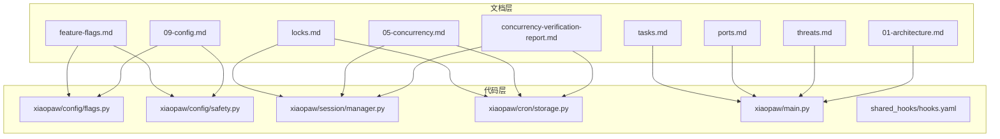
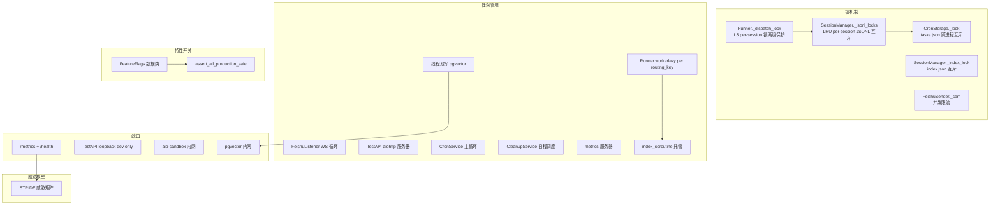
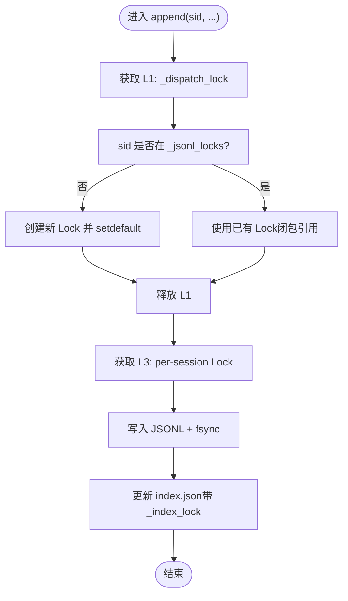
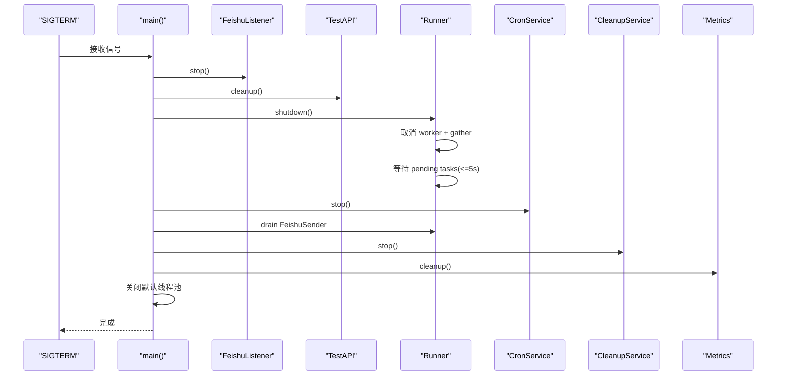
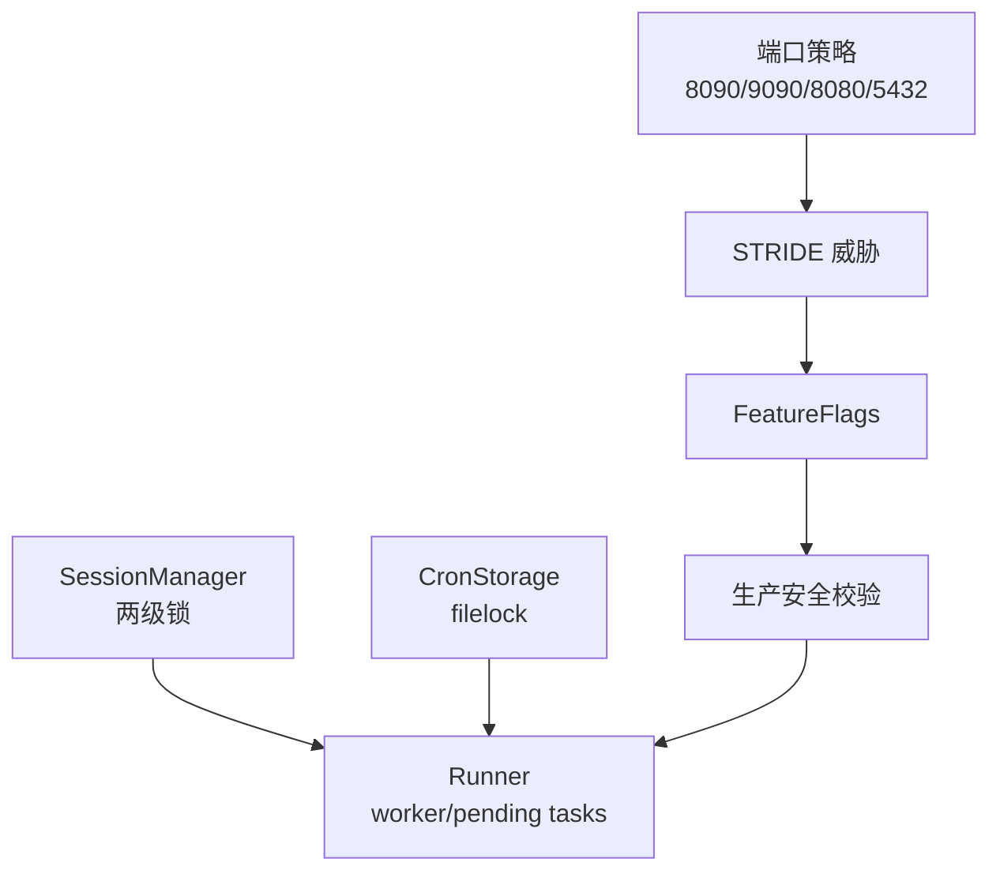

# SSOT 权威清单

<cite>
**本文档引用的文件**
- [docs/ssot/locks.md](file://docs/ssot/locks.md)
- [docs/ssot/tasks.md](file://docs/ssot/tasks.md)
- [docs/ssot/ports.md](file://docs/ssot/ports.md)
- [docs/ssot/feature-flags.md](file://docs/ssot/feature-flags.md)
- [docs/ssot/threats.md](file://docs/ssot/threats.md)
- [xiaopaw/config/flags.py](file://xiaopaw/config/flags.py)
- [xiaopaw/config/safety.py](file://xiaopaw/config/safety.py)
- [xiaopaw/cron/storage.py](file://xiaopaw/cron/storage.py)
- [xiaopaw/session/manager.py](file://xiaopaw/session/manager.py)
- [xiaopaw/main.py](file://xiaopaw/main.py)
- [shared_hooks/hooks.yaml](file://shared_hooks/hooks.yaml)
- [docs/05-concurrency.md](file://docs/05-concurrency.md)
- [docs/concurrency-verification-report.md](file://docs/concurrency-verification-report.md)
- [docs/09-config.md](file://docs/09-config.md)
- [docs/01-architecture.md](file://docs/01-architecture.md)
</cite>

## 目录
1. [简介](#简介)
2. [项目结构](#项目结构)
3. [核心组件](#核心组件)
4. [架构总览](#架构总览)
5. [详细组件分析](#详细组件分析)
6. [依赖关系分析](#依赖关系分析)
7. [性能考量](#性能考量)
8. [故障排查指南](#故障排查指南)
9. [结论](#结论)
10. [附录](#附录)

## 简介
本文件为 XiaoPaw v2 的 SSOT（Single Source of Truth）权威清单，系统性梳理并权威定义以下五类关键清单：
- 锁机制清单：明确单进程 asyncio 锁、跨进程 filelock、函数级原子性与协作式并发控制，确保数据一致性与正确性。
- 任务管理清单：定义长生命周期与短生命周期任务、线程池任务、取消语义与优雅关停顺序，保障运行时稳定性。
- 端口配置清单：统一对外/对内端口、路由与暴露策略，确保可观测性与安全边界。
- 特性开关清单：定义 Feature Flags 的类型、默认值、回滚风险、热重载能力与关联指标，支撑渐进式发布与安全基线。
- 威胁模型清单：基于 STRIDE 的威胁识别与防御矩阵，明确残余风险与合规对齐，指导安全设计与测试锚点。

上述清单通过“SSOT 权威来源 + 代码映射 + 测试锚点”的闭环，确保文档一致性与可追溯性，并提供维护流程与最佳实践。

## 项目结构
围绕 SSOT 的相关文件分布如下：
- 文档层：位于 docs/ssot 与 docs 相关架构/并发/配置文档
- 代码层：配置解析与安全校验、会话与任务管理、Cron 跨进程锁、主程序启动与关停
- 配置层：Feature Flags 数据类与 hooks.yaml 策略编排

图表来源
- [docs/ssot/locks.md:1-86](file://docs/ssot/locks.md#L1-L86)
- [docs/ssot/tasks.md:1-122](file://docs/ssot/tasks.md#L1-L122)
- [docs/ssot/ports.md:1-122](file://docs/ssot/ports.md#L1-L122)
- [docs/ssot/feature-flags.md:1-170](file://docs/ssot/feature-flags.md#L1-L170)
- [docs/ssot/threats.md:1-147](file://docs/ssot/threats.md#L1-L147)
- [xiaopaw/config/flags.py:1-23](file://xiaopaw/config/flags.py#L1-L23)
- [xiaopaw/config/safety.py:1-48](file://xiaopaw/config/safety.py#L1-L48)
- [xiaopaw/session/manager.py:1-183](file://xiaopaw/session/manager.py#L1-L183)
- [xiaopaw/cron/storage.py:1-49](file://xiaopaw/cron/storage.py#L1-L49)
- [xiaopaw/main.py:1-218](file://xiaopaw/main.py#L1-L218)
- [shared_hooks/hooks.yaml:1-73](file://shared_hooks/hooks.yaml#L1-L73)
- [docs/05-concurrency.md:70-602](file://docs/05-concurrency.md#L70-L602)
- [docs/concurrency-verification-report.md:1-79](file://docs/concurrency-verification-report.md#L1-L79)
- [docs/09-config.md:1-34](file://docs/09-config.md#L1-L34)
- [docs/01-architecture.md:349-395](file://docs/01-architecture.md#L349-L395)

章节来源
- [docs/ssot/locks.md:1-86](file://docs/ssot/locks.md#L1-L86)
- [docs/ssot/tasks.md:1-122](file://docs/ssot/tasks.md#L1-L122)
- [docs/ssot/ports.md:1-122](file://docs/ssot/ports.md#L1-L122)
- [docs/ssot/feature-flags.md:1-170](file://docs/ssot/feature-flags.md#L1-L170)
- [docs/ssot/threats.md:1-147](file://docs/ssot/threats.md#L1-L147)
- [docs/05-concurrency.md:70-602](file://docs/05-concurrency.md#L70-L602)
- [docs/concurrency-verification-report.md:1-79](file://docs/concurrency-verification-report.md#L1-L79)
- [docs/09-config.md:1-34](file://docs/09-config.md#L1-L34)
- [docs/01-architecture.md:349-395](file://docs/01-architecture.md#L349-L395)

## 核心组件
- 锁机制：单进程 asyncio.Lock/Semaphore、跨进程 filelock、函数级原子性（装饰器/RLock/ContextVar）
- 任务管理：长生命周期 Task、短生命周期 Task、线程池任务、取消语义与关停顺序
- 端口配置：8090（metrics/health）、9090（TestAPI loopback dev only）、8080（aio-sandbox 内网）、5432（pgvector 内网）
- 特性开关：12 个 Feature Flags，覆盖并发容错、可观测、安全与数据库连接池
- 威胁模型：STRIDE 威胁识别与防御矩阵，明确残余风险与合规对齐

章节来源
- [docs/ssot/locks.md:8-86](file://docs/ssot/locks.md#L8-L86)
- [docs/ssot/tasks.md:8-122](file://docs/ssot/tasks.md#L8-L122)
- [docs/ssot/ports.md:8-122](file://docs/ssot/ports.md#L8-L122)
- [docs/ssot/feature-flags.md:8-170](file://docs/ssot/feature-flags.md#L8-L170)
- [docs/ssot/threats.md:8-147](file://docs/ssot/threats.md#L8-L147)

## 架构总览
SSOT 清单与代码的映射关系如下：

图表来源
- [docs/ssot/locks.md:10-48](file://docs/ssot/locks.md#L10-L48)
- [docs/ssot/tasks.md:10-113](file://docs/ssot/tasks.md#L10-L113)
- [docs/ssot/ports.md:10-15](file://docs/ssot/ports.md#L10-L15)
- [docs/ssot/feature-flags.md:10-107](file://docs/ssot/feature-flags.md#L10-L107)
- [docs/ssot/threats.md:10-82](file://docs/ssot/threats.md#L10-L82)
- [xiaopaw/session/manager.py:18-47](file://xiaopaw/session/manager.py#L18-L47)
- [xiaopaw/cron/storage.py:14-48](file://xiaopaw/cron/storage.py#L14-L48)
- [xiaopaw/main.py:125-211](file://xiaopaw/main.py#L125-L211)
- [xiaopaw/config/safety.py:27-47](file://xiaopaw/config/safety.py#L27-L47)

## 详细组件分析

### 锁机制清单
- 单进程 asyncio 保护
  - L1：Runner._dispatch_lock 保护队列/工作器/队列生成器与 per-session 锁缓存的原子获取
  - L2：SessionManager._index_lock 保护 index.json 读写
  - L3：SessionManager._jsonl_locks（LRU 缓存）提供 per-session JSONL 互斥，两级取锁避免 LRUCache 驱逐竞态
  - L4：FeishuSender._sem（信号量）限制出站飞书 API 并发
  - L5：ReplayCache._lock（内部）保护 event_id LRU 缓存的检查/插入
- 跨进程 filelock
  - F1：CronStorage._lock 保护 tasks.json 读写，跨 CronService 与 scheduler_mgr Skill
  - F2：memory-save topic 锁保护 data/workspace/{topic}.md 写入
- 函数级原子性
  - A1：functools/lru_cache 装饰器 + CPython RLock 保证 LLM client 单例收敛
  - A2：CPython GIL 作为最后兜底
  - A3：contextvars.ContextVar + set/reset 保证 trace_id 传播与 finally 重置
- 两级锁正确获取模式
  - 必须先持 L1，再取 L3，避免 LRUCache 驱逐 + 并发 getter 竞态导致新旧锁并存
- v2 与 v1 差异
  - L3 从无界 dict 改为 LRUCache(1000)+L1 两级；新增 L4/L5；F1/F2 引入 filelock

图表来源
- [docs/ssot/locks.md:18-35](file://docs/ssot/locks.md#L18-L35)
- [xiaopaw/session/manager.py:132-168](file://xiaopaw/session/manager.py#L132-L168)
- [docs/05-concurrency.md:70-90](file://docs/05-concurrency.md#L70-L90)
- [docs/concurrency-verification-report.md:6-22](file://docs/concurrency-verification-report.md#L6-L22)

章节来源
- [docs/ssot/locks.md:8-86](file://docs/ssot/locks.md#L8-L86)
- [xiaopaw/session/manager.py:18-47](file://xiaopaw/session/manager.py#L18-L47)
- [xiaopaw/cron/storage.py:14-48](file://xiaopaw/cron/storage.py#L14-L48)
- [docs/05-concurrency.md:70-602](file://docs/05-concurrency.md#L70-L602)
- [docs/concurrency-verification-report.md:1-79](file://docs/concurrency-verification-report.md#L1-L79)

### 任务管理清单
- 长生命周期任务
  - T1：FeishuListener WebSocket 事件循环（最先停）
  - T2：TestAPI aiohttp 服务器（按需启用）
  - T3：Runner worker（按 routing_key lazy 创建）
  - T4：CronService 主循环
  - T5：CleanupService 日程调度
  - T6：metrics 服务器（最后停）
- 短生命周期任务
  - S1：index_coroutine 由 Runner 托管，防止 Crew 自建 Task 导致 GC 风险
  - S2/S3：Runner 内同步等待或 Sub-Crew akickoff 超时包装
- 线程池任务
  - E1-E4：psycopg2 写 pgvector、JSONL 倒序读、tokenizer 加载、压缩摘要 LLM 调用
  - 取消语义：run_in_executor/to_thread 任务不可取消，需通过超时与指标观测
- shutdown 顺序
  - 严格顺序：先停入站（Listener）→ TestAPI → Runner（取消 worker、等待 pending index tasks 最多 5s）→ CronService → FeishuSender drain → CleanupService → metrics → 关闭默认线程池
  - 使用公开 API 关闭线程池，避免私有接口

图表来源
- [docs/ssot/tasks.md:62-94](file://docs/ssot/tasks.md#L62-L94)
- [xiaopaw/main.py:203-213](file://xiaopaw/main.py#L203-L213)
- [docs/05-concurrency.md:497-530](file://docs/05-concurrency.md#L497-L530)

章节来源
- [docs/ssot/tasks.md:8-122](file://docs/ssot/tasks.md#L8-L122)
- [xiaopaw/main.py:125-213](file://xiaopaw/main.py#L125-L213)
- [docs/05-concurrency.md:457-530](file://docs/05-concurrency.md#L457-L530)

### 端口配置清单
- 端口总表
  - 8090：metrics/health（统一端口，/metrics 需 Bearer）
  - 9090：TestAPI loopback only（dev only，prod 强制禁用）
  - 8080：aio-sandbox 内网（v2 T9 防御：不得映射 host ports）
  - 5432：pgvector 内网
- Docker Compose
  - 生产：仅暴露 8090；aio-sandbox/pgvector 无 host ports
  - 开发：暴露 8090 与 9090（显式 loopback）
- 客户端侧引用
  - observability.metrics_port=8090；debug.test_api_port=9090；sandbox.url=http://aio-sandbox:8080/mcp；memory.db_dsn 指向 pgvector
- v2.1 修正点
  - 删除 health_port；统一 metrics_port=8090；sandbox.url 端口 8080；dev 显式 loopback；强制 aio-sandbox 无 host ports

章节来源
- [docs/ssot/ports.md:8-122](file://docs/ssot/ports.md#L8-L122)
- [docs/01-architecture.md:349-395](file://docs/01-architecture.md#L349-L395)

### 特性开关清单
- Flag 清单（v2.1 终表）
  - F1：token_counter_mode（Literal["qwen_official","hf_qwen","rough"]）
  - F2-F5：enable_skill_timeout、enable_cron_filelock、enable_memory_save_filelock、enable_feishu_rate_limit_aware
  - F6：enable_trace_id
  - F7-F10：enable_mcp_whitelist、enable_memory_save_filter、enable_webhook_replay_cache、enable_inbound_rate_limit
  - F11-F12：enable_pgvector_rls、enable_pgvector_connection_pool
- 启动校验（prod）
  - assert_all_production_safe 强制要求若干关键 Flag 必须开启（如 F7-F10、F12），否则启动失败
- 数据类与配置
  - FeatureFlags 数据类定义字段与默认值；config.yaml.example 提供终版字段
  - 启动时将 Flag 暴露为指标，便于 Grafana 监控
- v2.1 变更
  - 新增 F9（原 enable_webhook_signature 改名）；F1 扩展为三值；F12 补入注册表

章节来源
- [docs/ssot/feature-flags.md:8-170](file://docs/ssot/feature-flags.md#L8-L170)
- [xiaopaw/config/flags.py:9-23](file://xiaopaw/config/flags.py#L9-L23)
- [xiaopaw/config/safety.py:27-47](file://xiaopaw/config/safety.py#L27-L47)
- [docs/09-config.md:12-17](file://docs/09-config.md#L12-L17)

### 威胁模型清单（STRIDE）
- 威胁总览（T1-T11）
  - T1：Prompt Injection → sandbox 逃逸（MCP 白名单 + seccomp）
  - T2：Memory Poisoning（BLOCKED_PATTERNS + 长度限制 + memory-governance）
  - T3：飞书 Webhook 重放（应用层 ReplayCache）
  - T4：凭证泄露（docker secrets + 强度校验）
  - T5：Sub-Crew 路径遍历（workspace mount + 路径越界校验）
  - T6：SKILL.md YAML 注入（safe_load + 路径白名单）
  - T7：DoS（入站速率限制）
  - T8：Cron → Runner 注入（BLOCKED_PATTERNS + schema 校验）
  - T9：MCP 端口暴露（compose 无 host ports）
  - T10：Cron payload 内容注入（schema + command 白名单）
  - T11：routing_key 伪造（三层强制 + 可选 RLS）
- STRIDE 映射与信任边界
  - 明确伪造/篡改/抵赖/泄露/拒绝服务/提权的威胁归属
  - 信任边界：Untrusted → Semi-Trusted 入口 → Runner → Sub-Crew → Trusted 存储
- 残余风险与补偿
  - T1：HIGH（Prompt Injection 成功率仍高），补偿包括审计日志、trace 覆盖与用户教育
  - T2：中高（正则可绕过），补偿包括离线审计与 Agent 约束
  - T3：低（WS 验签 + 应用层 ReplayCache + 5 分钟 TTL）
- 合规对齐
  - PIPL/GDPR 等要求与实现（去标识化/匿名化、跨境传输披露、访问控制/审计）

章节来源
- [docs/ssot/threats.md:8-147](file://docs/ssot/threats.md#L8-L147)
- [docs/09-config.md:12-17](file://docs/09-config.md#L12-L17)

## 依赖关系分析
- 锁与任务的耦合
  - SessionManager 的两级锁与 Runner 的 worker/索引任务协同，避免 LRUCache 驱逐导致的竞态
  - CronStorage 的 filelock 与 Runner 的调度链路解耦，通过 DLQ 与超时降级提升可靠性
- 端口与安全
  - 8080/5432 仅内网，避免 T9/T11 风险；9090 仅 loopback dev，避免误暴露
- 特性开关与安全基线
  - 生产环境强制开启关键安全 Flag，未满足则启动失败
- 威胁与防御
  - STRIDE 威胁与 Feature Flags/端口/锁/任务形成闭环防御

图表来源
- [xiaopaw/session/manager.py:132-168](file://xiaopaw/session/manager.py#L132-L168)
- [xiaopaw/cron/storage.py:14-48](file://xiaopaw/cron/storage.py#L14-L48)
- [xiaopaw/main.py:125-213](file://xiaopaw/main.py#L125-L213)
- [docs/ssot/ports.md:10-15](file://docs/ssot/ports.md#L10-L15)
- [docs/ssot/threats.md:10-82](file://docs/ssot/threats.md#L10-L82)
- [docs/ssot/feature-flags.md:41-61](file://docs/ssot/feature-flags.md#L41-L61)
- [xiaopaw/config/safety.py:27-47](file://xiaopaw/config/safety.py#L27-L47)

章节来源
- [xiaopaw/session/manager.py:18-47](file://xiaopaw/session/manager.py#L18-L47)
- [xiaopaw/cron/storage.py:14-48](file://xiaopaw/cron/storage.py#L14-L48)
- [xiaopaw/main.py:125-213](file://xiaopaw/main.py#L125-L213)
- [docs/ssot/ports.md:8-122](file://docs/ssot/ports.md#L8-L122)
- [docs/ssot/threats.md:8-147](file://docs/ssot/threats.md#L8-L147)
- [docs/ssot/feature-flags.md:41-61](file://docs/ssot/feature-flags.md#L41-L61)
- [xiaopaw/config/safety.py:27-47](file://xiaopaw/config/safety.py#L27-L47)

## 性能考量
- 锁粒度与热点
  - L3 per-session 锁避免全局互斥，LRU 1000 覆盖峰值活跃会话，超限触发运维告警而非正确性依赖
  - L4 信号量 5 控制飞书 API 并发，平衡吞吐与限流
- 线程池与取消语义
  - E1-E4 不可取消任务需通过超时与指标观测，避免阻塞关停
  - 使用公开 API 关闭默认线程池，减少关停延迟
- 指标可观测
  - Feature Flags 指标化，便于实时监控与快速回滚

## 故障排查指南
- 锁相关
  - 症状：并发 append 写冲突/重复写
  - 排查：确认两级锁获取顺序（L1→L3），检查 LRUCache 驱逐是否导致新旧锁并存
  - 参考：两级锁正确获取模式与并发真相报告
- 任务相关
  - 症状：关停卡住/僵尸线程
  - 排查：确认 pending tasks 是否在 5s 内完成；检查线程池是否通过公开 API 关闭
  - 参考：shutdown 顺序与时序图
- 端口相关
  - 症状：8080 暴露/9090 暴露
  - 排查：核对 compose 配置，确保 aio-sandbox/pgvector 无 host ports，TestAPI 仅 loopback
- 特性开关相关
  - 症状：启动失败
  - 排查：核对生产安全校验，确保关键 Flag 开启；检查 config.yaml 与数据类字段一致
- 威胁相关
  - 症状：凭证泄露/DoS/MCP 暴露
  - 排查：核对 STRIDE 防御矩阵与端口策略；检查速率限制与 ReplayCache

章节来源
- [docs/concurrency-verification-report.md:1-79](file://docs/concurrency-verification-report.md#L1-L79)
- [docs/ssot/tasks.md:62-122](file://docs/ssot/tasks.md#L62-L122)
- [docs/ssot/ports.md:58-122](file://docs/ssot/ports.md#L58-L122)
- [docs/ssot/feature-flags.md:41-61](file://docs/ssot/feature-flags.md#L41-L61)
- [docs/ssot/threats.md:123-147](file://docs/ssot/threats.md#L123-L147)

## 结论
SSOT 权威清单通过“权威来源 + 代码映射 + 测试锚点”三位一体，确保 XiaoPaw v2 在并发正确性、运行时稳定性、安全边界与可观测性方面具备可追溯、可验证、可演进的工程基础。建议在变更流程中遵循“先 SSOT 更新，再代码映射，后测试覆盖”的原则，持续维护清单与实现的一致性。

## 附录
- 维护流程与更新机制
  - 变更触发：需求评审/安全评估/并发验证
  - SSOT 更新：在对应清单文件中更新条目、版本与测试锚点
  - 代码映射：在实现文件中落实锁/任务/端口/Flag/威胁的对应逻辑
  - 测试覆盖：补充/回归 TC，确保清单可验证
  - 发布前校验：对照生产安全校验与配置规范
- 最佳实践与注意事项
  - 锁：始终遵循两级锁获取顺序；LRU 容量应覆盖峰值活跃会话
  - 任务：短生命周期任务由 Runner 托管；线程池任务不可取消，需超时与指标兜底
  - 端口：严格遵守暴露级别；dev 仅 loopback；生产无 host ports
  - 特性开关：生产环境禁止关闭关键安全 Flag；未知字段拒绝
  - 威胁：STRIDE 防御矩阵与端口/锁/任务联动；残余风险文档化并制定补偿措施