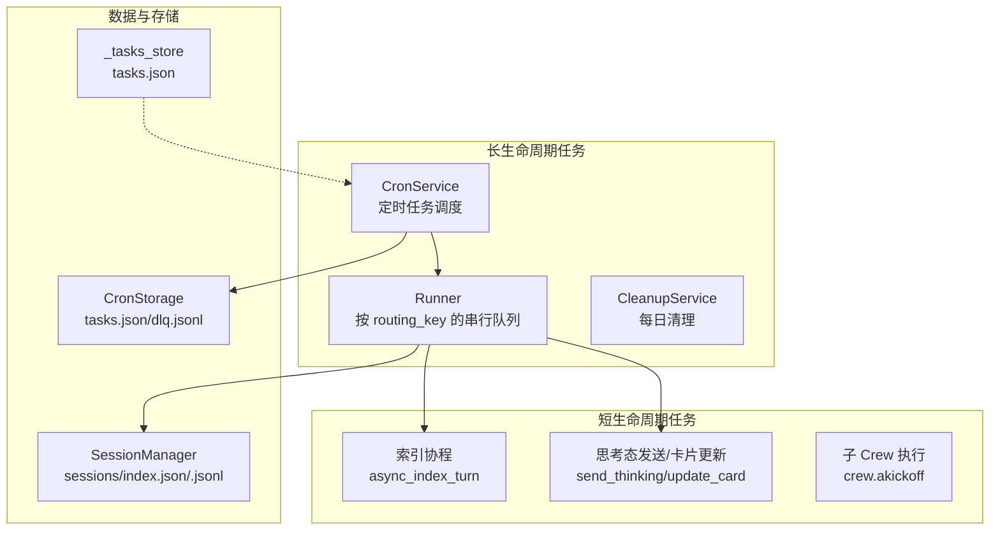
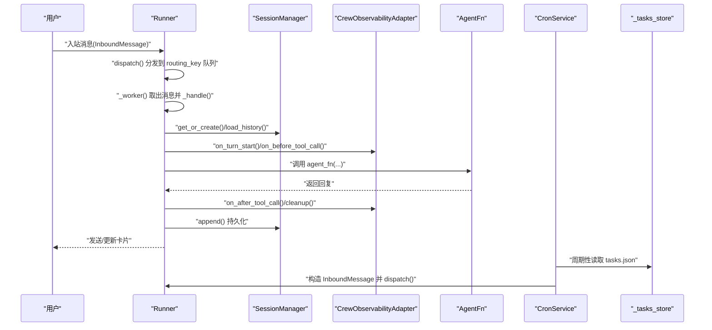
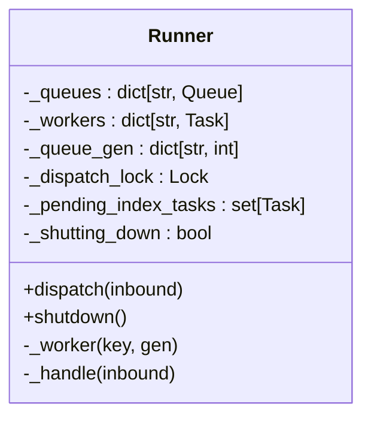
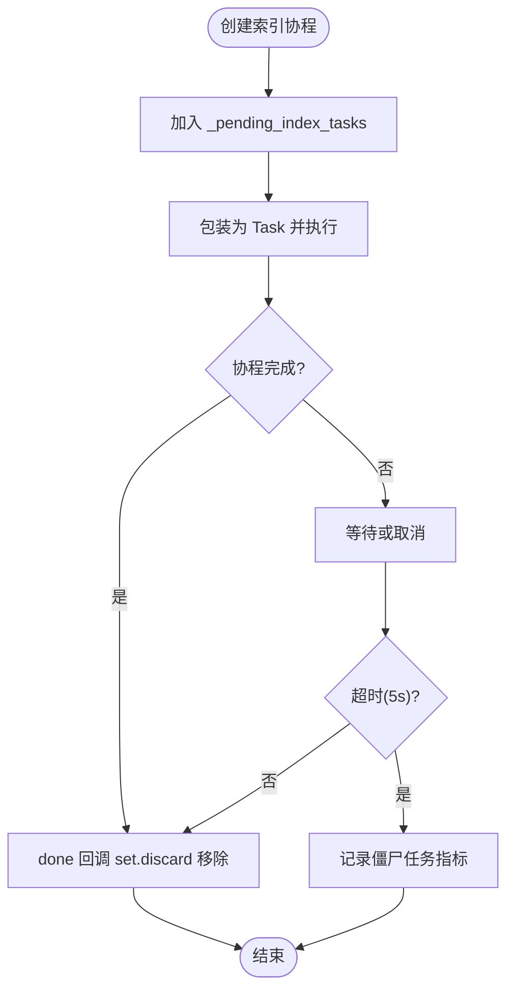
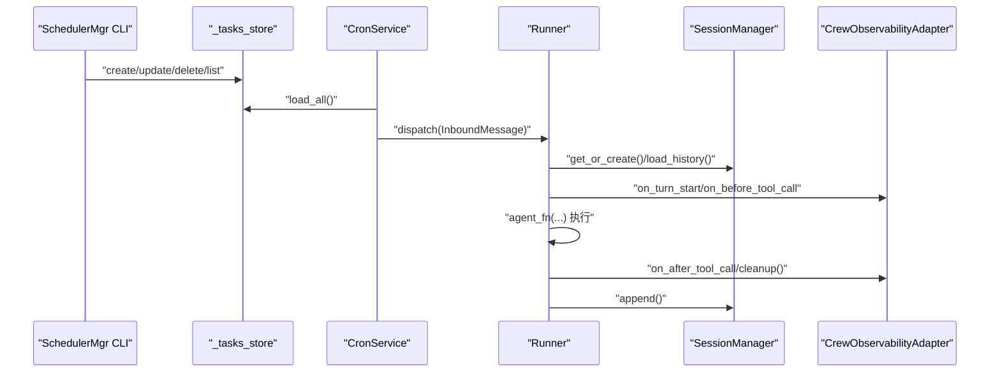
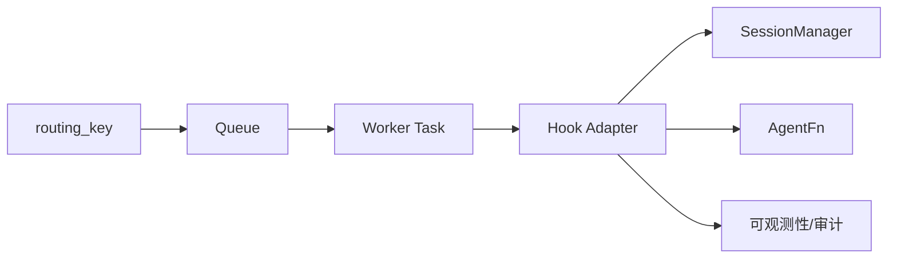
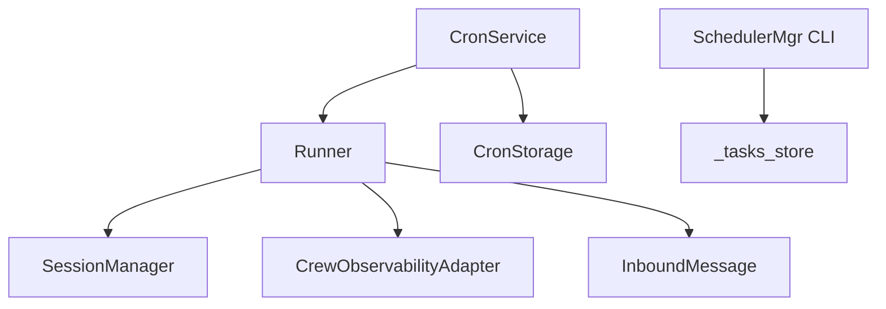

# 任务管理清单

<cite>
**本文引用的文件**
- [xiaopaw/runner.py](file://xiaopaw/runner.py)
- [xiaopaw/models.py](file://xiaopaw/models.py)
- [xiaopaw/session/manager.py](file://xiaopaw/session/manager.py)
- [xiaopaw/cron/service.py](file://xiaopaw/cron/service.py)
- [xiaopaw/cron/storage.py](file://xiaopaw/cron/storage.py)
- [xiaopaw/skills/scheduler_mgr/scripts/_tasks_store.py](file://xiaopaw/skills/scheduler_mgr/scripts/_tasks_store.py)
- [xiaopaw/skills/scheduler_mgr/scripts/create_task.py](file://xiaopaw/skills/scheduler_mgr/scripts/create_task.py)
- [xiaopaw/skills/scheduler_mgr/scripts/update_task.py](file://xiaopaw/skills/scheduler_mgr/scripts/update_task.py)
- [xiaopaw/skills/scheduler_mgr/scripts/delete_task.py](file://xiaopaw/skills/scheduler_mgr/scripts/delete_task.py)
- [xiaopaw/hook_framework/crew_adapter.py](file://xiaopaw/hook_framework/crew_adapter.py)
- [docs/ssot/tasks.md](file://docs/ssot/tasks.md)
</cite>

## 目录
1. [简介](#简介)
2. [项目结构](#项目结构)
3. [核心组件](#核心组件)
4. [架构总览](#架构总览)
5. [详细组件分析](#详细组件分析)
6. [依赖分析](#依赖分析)
7. [性能考量](#性能考量)
8. [故障排查指南](#故障排查指南)
9. [结论](#结论)
10. [附录](#附录)

## 简介
本技术文档围绕 XiaoPaw v2 的“任务管理”主题，系统阐述任务调度、任务生命周期管理与任务协作机制。重点覆盖以下方面：
- Runner 的任务托管集合、任务状态跟踪与优雅关闭流程
- 任务与锁机制的关系，特别是 _pending_index_tasks 的作用与管理方式
- 任务创建、执行、监控与清理的完整流程
- 任务优先级、超时处理与错误恢复策略
- 任务管理在系统并发正确性中的关键作用

## 项目结构
XiaoPaw v2 将“任务”分为两类：
- 长生命周期任务：随服务启动创建，随服务优雅关闭取消（如 Runner worker、CronService、CleanupService 等）
- 短生命周期任务：一次性 fire-and-forget，由 Runner 或内存索引流程托管，完成后自动清理

长生命周期任务的托管与关闭顺序详见单源事实文档。

**图表来源**
- [docs/ssot/tasks.md:62-94](file://docs/ssot/tasks.md#L62-L94)
- [xiaopaw/runner.py:33-108](file://xiaopaw/runner.py#L33-L108)
- [xiaopaw/cron/service.py:19-97](file://xiaopaw/cron/service.py#L19-L97)
- [xiaopaw/cron/storage.py:14-49](file://xiaopaw/cron/storage.py#L14-L49)
- [xiaopaw/skills/scheduler_mgr/scripts/_tasks_store.py:9-322](file://xiaopaw/skills/scheduler_mgr/scripts/_tasks_store.py#L9-L322)
- [xiaopaw/session/manager.py:38-183](file://xiaopaw/session/manager.py#L38-L183)

**章节来源**
- [docs/ssot/tasks.md:8-28](file://docs/ssot/tasks.md#L8-L28)

## 核心组件
- Runner：按 routing_key 维持串行队列，负责消息分发、工作线程生命周期、Hook 适配器、安全拦截与优雅关闭
- SessionManager：会话索引与历史持久化，提供并发安全的会话读写与 LRU 锁缓存
- CronService/CronStorage：基于文件的任务清单与调度器，支持 at/every/cron 三种调度类型
- SchedulerMgr 脚本：tasks.json 的 CRUD 操作工具，配合 CronService 使用
- CrewObservabilityAdapter：将 CrewAI 回调翻译为 5+2 事件体系，支撑安全拦截与可观测性

**章节来源**
- [xiaopaw/runner.py:33-108](file://xiaopaw/runner.py#L33-L108)
- [xiaopaw/session/manager.py:38-183](file://xiaopaw/session/manager.py#L38-L183)
- [xiaopaw/cron/service.py:19-97](file://xiaopaw/cron/service.py#L19-L97)
- [xiaopaw/cron/storage.py:14-49](file://xiaopaw/cron/storage.py#L14-L49)
- [xiaopaw/skills/scheduler_mgr/scripts/_tasks_store.py:9-322](file://xiaopaw/skills/scheduler_mgr/scripts/_tasks_store.py#L9-L322)
- [xiaopaw/hook_framework/crew_adapter.py:63-357](file://xiaopaw/hook_framework/crew_adapter.py#L63-L357)

## 架构总览
下图展示了任务从“入站消息”到“执行与清理”的整体流转，以及与会话、Hook、定时任务与索引任务的关系。

**图表来源**
- [xiaopaw/runner.py:60-282](file://xiaopaw/runner.py#L60-L282)
- [xiaopaw/session/manager.py:70-168](file://xiaopaw/session/manager.py#L70-L168)
- [xiaopaw/hook_framework/crew_adapter.py:91-357](file://xiaopaw/hook_framework/crew_adapter.py#L91-L357)
- [xiaopaw/cron/service.py:53-97](file://xiaopaw/cron/service.py#L53-L97)
- [xiaopaw/skills/scheduler_mgr/scripts/_tasks_store.py:39-134](file://xiaopaw/skills/scheduler_mgr/scripts/_tasks_store.py#L39-L134)

## 详细组件分析

### Runner：任务调度与生命周期管理
- 串行队列与工作线程
  - 按 routing_key 维护 asyncio.Queue，首次遇到时惰性创建 worker Task，并以 generation 记录版本
  - 空闲超时（idle_timeout）驱动 worker 自动退出，避免僵尸线程
- 任务状态跟踪
  - _queues、_workers、_queue_gen 三元组实现 per-key 的队列与 worker 状态跟踪
  - _pending_index_tasks 用于托管短生命周期的索引协程，确保优雅关闭时等待其完成
- 优雅关闭
  - 取消所有 worker 与 _pending_index_tasks，gather 并忽略异常
  - 严格遵循 shutdown 顺序，确保可观测性数据落盘与资源释放

**图表来源**
- [xiaopaw/runner.py:33-108](file://xiaopaw/runner.py#L33-L108)

**章节来源**
- [xiaopaw/runner.py:33-108](file://xiaopaw/runner.py#L33-L108)
- [docs/ssot/tasks.md:62-94](file://docs/ssot/tasks.md#L62-L94)

### 任务与锁机制：_pending_index_tasks 的作用与管理
- 作用
  - 托管“一次性 fire-and-forget”的索引协程（如 async_index_turn），避免在 Runner 退出时被强制中断
- 管理方式
  - Runner 在创建索引协程后将其加入 _pending_index_tasks，并为其注册 done 回调 set.discard，确保完成后自动移除
  - 优雅关闭时，Runner 会取消并等待这些任务最多 5 秒；超时后不会阻塞退出，通过指标记录僵尸任务数量

**图表来源**
- [docs/ssot/tasks.md:21-28](file://docs/ssot/tasks.md#L21-L28)
- [docs/ssot/tasks.md:74-81](file://docs/ssot/tasks.md#L74-L81)

**章节来源**
- [docs/ssot/tasks.md:21-28](file://docs/ssot/tasks.md#L21-L28)
- [docs/ssot/tasks.md:74-81](file://docs/ssot/tasks.md#L74-L81)

### 任务创建、执行、监控与清理流程
- 创建
  - 通过 SchedulerMgr 脚本向 tasks.json 写入任务定义（名称、路由键、消息、调度表达式、时区、是否删除后运行等）
- 执行
  - CronService 周期性扫描 tasks.json，命中条件后构造 InboundMessage 并通过 Runner.dispatch() 分发
  - Runner._handle() 完整执行：会话加载、Hook 触发、预飞行安全检查、调用 Agent、回复用户、持久化、指标上报、Hook 清理
- 监控
  - 任务状态字段（下次运行时间、上次运行时间、状态、错误）在更新调度配置后由 CronService 触发重新计算
  - DLQ（死信队列）记录失败任务及其错误，便于事后分析
- 清理
  - Runner 优雅关闭时等待 _pending_index_tasks 完成；CronService 停止；FeishuSender 完成待发送项；CleanupService 停止；metrics 服务器关闭；默认线程池关闭

**图表来源**
- [xiaopaw/skills/scheduler_mgr/scripts/create_task.py:8-34](file://xiaopaw/skills/scheduler_mgr/scripts/create_task.py#L8-L34)
- [xiaopaw/skills/scheduler_mgr/scripts/update_task.py:8-44](file://xiaopaw/skills/scheduler_mgr/scripts/update_task.py#L8-L44)
- [xiaopaw/skills/scheduler_mgr/scripts/delete_task.py:8-15](file://xiaopaw/skills/scheduler_mgr/scripts/delete_task.py#L8-L15)
- [xiaopaw/skills/scheduler_mgr/scripts/_tasks_store.py:39-134](file://xiaopaw/skills/scheduler_mgr/scripts/_tasks_store.py#L39-L134)
- [xiaopaw/cron/service.py:53-97](file://xiaopaw/cron/service.py#L53-L97)
- [xiaopaw/runner.py:60-282](file://xiaopaw/runner.py#L60-L282)
- [xiaopaw/session/manager.py:70-168](file://xiaopaw/session/manager.py#L70-L168)
- [xiaopaw/hook_framework/crew_adapter.py:91-357](file://xiaopaw/hook_framework/crew_adapter.py#L91-L357)

**章节来源**
- [xiaopaw/skills/scheduler_mgr/scripts/_tasks_store.py:39-134](file://xiaopaw/skills/scheduler_mgr/scripts/_tasks_store.py#L39-L134)
- [xiaopaw/cron/service.py:53-97](file://xiaopaw/cron/service.py#L53-L97)
- [xiaopaw/runner.py:60-282](file://xiaopaw/runner.py#L60-L282)
- [xiaopaw/session/manager.py:70-168](file://xiaopaw/session/manager.py#L70-L168)
- [xiaopaw/hook_framework/crew_adapter.py:91-357](file://xiaopaw/hook_framework/crew_adapter.py#L91-L357)

### 任务优先级、超时处理与错误恢复策略
- 优先级
  - 当前实现未显式区分任务优先级；调度由 CronService 周期性检查决定
- 超时处理
  - Worker 空闲超时自动退出（idle_timeout）
  - 子 Crew 执行使用 wait_for 设置超时（参考单源事实文档中对 CrewAI 的超时策略）
  - 优雅关闭时对 _pending_index_tasks 等待最多 5 秒
- 错误恢复
  - 定时任务失败进入 DLQ，记录错误信息，避免无限重试
  - Runner 对 GuardrailDeny 进行兜底处理，向用户友好提示并上报事件
  - 会话持久化采用异步线程写入，避免阻塞事件循环

**章节来源**
- [docs/ssot/tasks.md:74-81](file://docs/ssot/tasks.md#L74-L81)
- [xiaopaw/cron/service.py:75-97](file://xiaopaw/cron/service.py#L75-L97)
- [xiaopaw/runner.py:222-282](file://xiaopaw/runner.py#L222-L282)

### 任务协作机制与并发正确性
- 会话隔离
  - 按 routing_key 维持 per-key 的串行队列，天然避免跨会话并发冲突
- 并发控制
  - SessionManager 使用 LRU 锁缓存，保障同一会话的写入互斥
  - CronService 与 Runner 通过文件锁保护 tasks.json，避免竞态
- Hook 协作
  - CrewObservabilityAdapter 将 CrewAI 的回调翻译为 5+2 事件，统一触发安全拦截与可观测性
  - pending_deny 模式确保异常在安全出口统一重抛，避免被 CrewAI 吞掉

**图表来源**
- [xiaopaw/runner.py:60-108](file://xiaopaw/runner.py#L60-L108)
- [xiaopaw/session/manager.py:38-46](file://xiaopaw/session/manager.py#L38-L46)
- [xiaopaw/hook_framework/crew_adapter.py:63-90](file://xiaopaw/hook_framework/crew_adapter.py#L63-L90)

**章节来源**
- [xiaopaw/session/manager.py:38-46](file://xiaopaw/session/manager.py#L38-L46)
- [xiaopaw/hook_framework/crew_adapter.py:63-90](file://xiaopaw/hook_framework/crew_adapter.py#L63-L90)

## 依赖分析
- Runner 依赖
  - SessionManager：会话读写与历史加载
  - SenderProtocol：消息发送、思考态卡片与文本回复
  - HookRegistry/CrewObservabilityAdapter：事件触发与安全拦截
  - InboundMessage：统一入站消息模型
- CronService 依赖
  - CronStorage：任务清单与 DLQ 文件访问
  - Runner.dispatch：将定时任务转为普通消息分发
- SchedulerMgr 脚本依赖
  - _tasks_store：tasks.json 的读写与校验

**图表来源**
- [xiaopaw/runner.py:14-21](file://xiaopaw/runner.py#L14-L21)
- [xiaopaw/cron/service.py:19-28](file://xiaopaw/cron/service.py#L19-L28)
- [xiaopaw/skills/scheduler_mgr/scripts/_tasks_store.py:9-33](file://xiaopaw/skills/scheduler_mgr/scripts/_tasks_store.py#L9-L33)

**章节来源**
- [xiaopaw/runner.py:14-21](file://xiaopaw/runner.py#L14-L21)
- [xiaopaw/cron/service.py:19-28](file://xiaopaw/cron/service.py#L19-L28)
- [xiaopaw/skills/scheduler_mgr/scripts/_tasks_store.py:9-33](file://xiaopaw/skills/scheduler_mgr/scripts/_tasks_store.py#L9-L33)

## 性能考量
- 队列容量与背压
  - Runner 对队列设置最大长度，满载时丢弃新消息，避免内存膨胀
- I/O 与阻塞
  - 会话写入与 JSONL 读取通过异步线程执行，降低对事件循环的影响
- 线程池与取消语义
  - 同步任务（如数据库写入、tokenizer 加载）通过异步线程执行，取消不可靠，需容忍“僵尸线程”，通过指标监控
- 指标与可观测性
  - AgentLatency、Cron DLQ 等指标用于评估性能与稳定性

**章节来源**
- [xiaopaw/runner.py:39-48](file://xiaopaw/runner.py#L39-L48)
- [xiaopaw/session/manager.py:141-154](file://xiaopaw/session/manager.py#L141-L154)
- [docs/ssot/tasks.md:31-59](file://docs/ssot/tasks.md#L31-L59)

## 故障排查指南
- 定时任务未触发
  - 检查 tasks.json 是否存在、格式是否正确、表达式是否有效
  - 确认 CronService 是否正常运行且未被停止
- 任务被拦截
  - 查看 Hook 事件链路（BEFORE_TOOL_CALL/AFTER_TURN）与 pending_deny 是否被触发
  - 检查安全策略链路（permission_gate、sandbox_guard）日志
- 优雅关闭卡住
  - 检查 _pending_index_tasks 是否长时间未完成，确认是否存在不可取消的同步任务
  - 关注僵尸任务指标，评估是否需要延长等待时间或优化同步任务
- 会话写入异常
  - 检查 SessionManager 的索引锁与 JSONL 写入锁是否竞争严重
  - 确认磁盘空间与文件权限

**章节来源**
- [xiaopaw/cron/service.py:53-97](file://xiaopaw/cron/service.py#L53-L97)
- [xiaopaw/hook_framework/crew_adapter.py:160-207](file://xiaopaw/hook_framework/crew_adapter.py#L160-L207)
- [docs/ssot/tasks.md:74-81](file://docs/ssot/tasks.md#L74-L81)
- [xiaopaw/session/manager.py:49-68](file://xiaopaw/session/manager.py#L49-L68)

## 结论
XiaoPaw v2 的任务管理以 Runner 为核心，结合会话隔离、Hook 适配与文件锁保护，实现了高可靠、可观测的任务调度与生命周期管理。通过 _pending_index_tasks 与严格的优雅关闭顺序，系统在并发正确性与资源释放之间取得了平衡。定时任务与 SchedulerMgr 脚本提供了灵活的任务编排能力，配合 DLQ 与指标监控，能够有效支撑生产环境的稳定性与可维护性。

## 附录
- 单源事实：任务与关闭顺序、取消语义矩阵、测试锚点
- 相关模型：InboundMessage、SessionEntry、RoutingEntry、MessageEntry、CronJob

**章节来源**
- [docs/ssot/tasks.md:62-122](file://docs/ssot/tasks.md#L62-L122)
- [xiaopaw/models.py:17-35](file://xiaopaw/models.py#L17-L35)