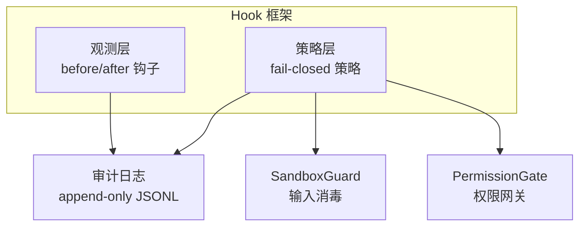
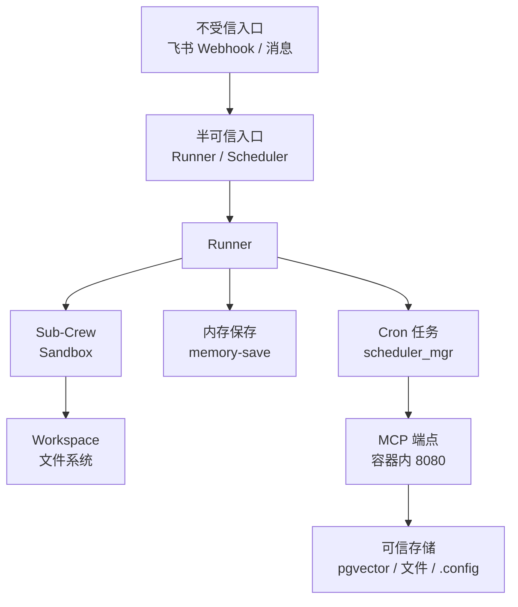
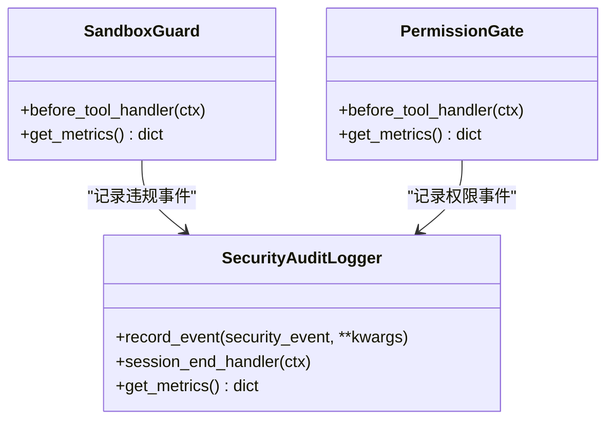
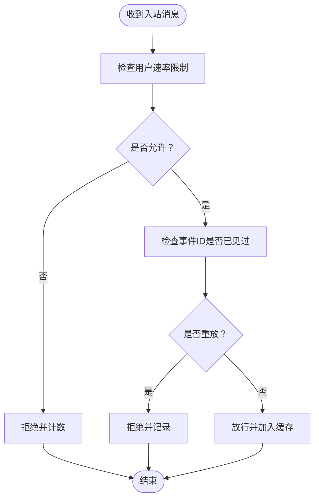
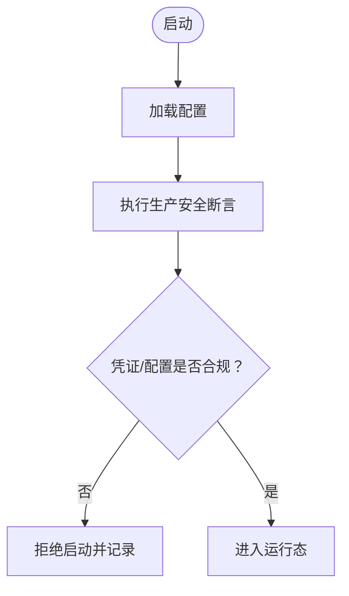
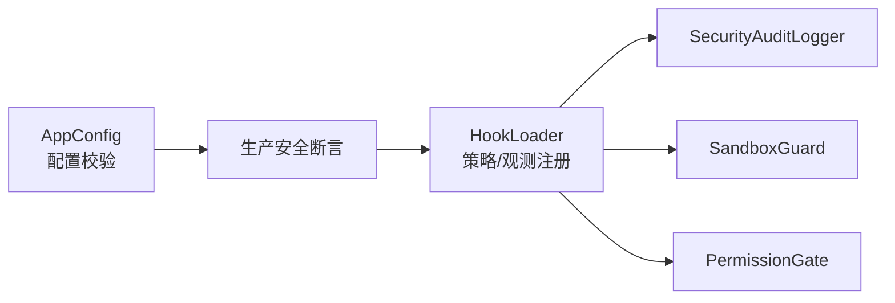

# 威胁模型清单

<cite>
**本文引用的文件**   
- [threats.md](file://docs/ssot/threats.md)
- [hooks.yaml](file://shared_hooks/hooks.yaml)
- [audit_logger.py](file://shared_hooks/audit_logger.py)
- [sandbox_guard.py](file://shared_hooks/sandbox_guard.py)
- [permission_gate.py](file://shared_hooks/permission_gate.py)
- [security.py](file://xiaopaw/observability/security.py)
- [safety.py](file://xiaopaw/config/safety.py)
- [validator.py](file://xiaopaw/config/validator.py)
- [ports.md](file://docs/ssot/ports.md)
- [01-architecture.md](file://docs/01-architecture.md)
- [12-hook-hardening.md](file://docs/12-hook-hardening.md)
- [09-config.md](file://docs/09-config.md)
- [test_e2e_13_sandbox_guard.py](file://tests/e2e/test_e2e_13_sandbox_guard.py)
- [test_e2e_15_audit_deny.py](file://tests/e2e/test_e2e_15_audit_deny.py)
- [sandbox-docker-compose.yaml](file://sandbox-docker-compose.yaml)
- [models.py](file://xiaopaw/cron/models.py)
- [SKILL.md（memory-governance）](file://xiaopaw/skills/memory-governance/SKILL.md)
</cite>

## 目录
1. [简介](#简介)
2. [项目结构](#项目结构)
3. [核心组件](#核心组件)
4. [架构总览](#架构总览)
5. [详细组件分析](#详细组件分析)
6. [依赖分析](#依赖分析)
7. [性能考量](#性能考量)
8. [故障排除指南](#故障排除指南)
9. [结论](#结论)
10. [附录](#附录)

## 简介
本文件面向 XiaoPaw v2 的威胁模型清单，系统化梳理威胁类型、风险评估、防护策略与控制措施的对应关系，并给出检测、响应与缓解方法。文档基于仓库中的威胁清单、Hook 安全框架、速率限制与重放缓存、凭证安全校验、端口与网络隔离、以及端到端测试用例进行技术化解读，帮助读者快速理解各层安全策略如何协同工作，抵御注入攻击、权限提升、信息泄露与拒绝服务等威胁。

## 项目结构
XiaoPaw v2 将安全策略以 Hook 插件的形式集成在统一的 Hook 框架中，形成“观测层”和“策略层”的双层结构。策略层在工具调用前执行，具备 fail-closed 能力，可阻断危险输入与越权调用；观测层负责结构化日志与链路追踪，确保可审计与可回溯。

图表来源
- [hooks.yaml:1-73](file://shared_hooks/hooks.yaml#L1-L73)
- [audit_logger.py:1-90](file://shared_hooks/audit_logger.py#L1-90)
- [sandbox_guard.py:1-168](file://shared_hooks/sandbox_guard.py#L1-168)
- [permission_gate.py:1-107](file://shared_hooks/permission_gate.py#L1-107)

章节来源
- [hooks.yaml:1-73](file://shared_hooks/hooks.yaml#L1-L73)
- [12-hook-hardening.md:44-66](file://docs/12-hook-hardening.md#L44-L66)

## 核心组件
- 安全审计日志（SecurityAuditLogger）：以追加只读 JSONL 形式记录所有安全事件，支持会话级摘要，便于外部 SIEM 消费与事后分析。
- SandboxGuard：在工具调用前执行确定性输入消毒，涵盖路径穿越、危险命令、Shell 注入、提示词注入等，命中即阻断。
- PermissionGate：基于工具维度的权限网关，默认拒绝，支持 deny/warn/allow 三种策略，拦截越权工具调用。
- 入站速率限制与重放缓存：在消息入口层对用户维度进行滑动窗口限流，并以 LRU+TTL 的重放缓存降低重放风险。
- 凭证安全校验与启动安全断言：在启动阶段强制校验凭证强度与关键配置，阻止弱凭据与错误配置进入生产。
- 端口与网络隔离：严格限制对外暴露端口，容器间通信采用内部网络，MCP 端点不向宿主暴露。

章节来源
- [audit_logger.py:1-90](file://shared_hooks/audit_logger.py#L1-90)
- [sandbox_guard.py:1-168](file://shared_hooks/sandbox_guard.py#L1-168)
- [permission_gate.py:1-107](file://shared_hooks/permission_gate.py#L1-107)
- [security.py:1-73](file://xiaopaw/observability/security.py#L1-73)
- [safety.py:1-48](file://xiaopaw/config/safety.py#L1-48)
- [ports.md:1-122](file://docs/ssot/ports.md#L1-L122)

## 架构总览
下图展示了威胁模型与安全控制在系统中的分布与交互关系，强调信任边界与跨层防护。

图表来源
- [threats.md:41-59](file://docs/ssot/threats.md#L41-L59)
- [01-architecture.md:349-395](file://docs/01-architecture.md#L349-L395)
- [ports.md:12-14](file://docs/ssot/ports.md#L12-L14)

章节来源
- [threats.md:41-59](file://docs/ssot/threats.md#L41-L59)
- [01-architecture.md:349-395](file://docs/01-architecture.md#L349-L395)

## 详细组件分析

### 威胁与控制矩阵（STRIDE 映射）
- Spoofing（伪造）：T3 飞书 Webhook 重放、T11 routing_key 伪造
- Tampering（篡改）：T2 内存投毒、T8 Cron 注入
- Repudiation（抵赖）：T3（trace_id + 原始日志追加只读审计）
- Information Disclosure（泄露）：T4 凭证泄露、T5 路径遍历
- Denial of Service（拒绝服务）：T7 消息洪水
- Elevation of Privilege（权限提升）：T1 Prompt Injection、T5 路径遍历、T6 SKILL.md 注入、T8 Cron 注入、T9 MCP 暴露、T10 Cron payload 注入

章节来源
- [threats.md:28-37](file://docs/ssot/threats.md#L28-L37)

### 输入消毒与权限网关（SandboxGuard 与 PermissionGate）
- SandboxGuard 在 BEFORE_TOOL_CALL 阶段执行四类检测：路径穿越、危险命令、Shell 注入（沙箱原生工具豁免）、提示词注入；同时进行 NFKC 归一化、多轮 URL 解码与空字节拦截，形成 fail-closed 防护。
- PermissionGate 以“默认拒绝”原则管理工具权限，支持 deny/warn/allow 三态；与审计日志共享实例，确保拦截事件可被统一记录与统计。

图表来源
- [audit_logger.py:30-90](file://shared_hooks/audit_logger.py#L30-L90)
- [sandbox_guard.py:93-168](file://shared_hooks/sandbox_guard.py#L93-L168)
- [permission_gate.py:32-107](file://shared_hooks/permission_gate.py#L32-L107)

章节来源
- [sandbox_guard.py:1-168](file://shared_hooks/sandbox_guard.py#L1-L168)
- [permission_gate.py:1-107](file://shared_hooks/permission_gate.py#L1-L107)
- [audit_logger.py:1-90](file://shared_hooks/audit_logger.py#L1-L90)

### 入站速率限制与重放缓存
- RateLimiter：基于用户维度的滑动窗口限流，防止消息洪水型 DoS。
- ReplayCache：基于事件 ID 的 LRU+TTL 去重，降低 Webhook 重放风险；结合飞书 SDK 服务端验签，形成“服务端验签 + 应用层去重”的双重保障。

图表来源
- [security.py:11-73](file://xiaopaw/observability/security.py#L11-L73)

章节来源
- [security.py:1-73](file://xiaopaw/observability/security.py#L1-L73)
- [threats.md:13-18](file://docs/ssot/threats.md#L13-L18)

### 凭证安全与启动断言
- 凭证强度校验：最小长度、弱口令字典、重复字符等判定，拒绝弱凭证启动。
- 启动安全断言：统一在生产环境强制执行，禁止 TestAPI 对外暴露、校验网络与端口配置、必要特性标志位开启等。

图表来源
- [safety.py:27-48](file://xiaopaw/config/safety.py#L27-L48)
- [validator.py:97-122](file://xiaopaw/config/validator.py#L97-L122)

章节来源
- [safety.py:1-48](file://xiaopaw/config/safety.py#L1-L48)
- [validator.py:1-122](file://xiaopaw/config/validator.py#L1-L122)
- [09-config.md:508-576](file://docs/09-config.md#L508-L576)

### 端口与网络隔离
- 生产环境仅暴露 /metrics 与 /health（8090），TestAPI（9090）仅 loopback；MCP 端点（8080）仅容器内网络可达，不映射到宿主。
- 开发环境可映射以便调试，但需显式绑定 loopback，避免误暴露。

章节来源
- [ports.md:1-122](file://docs/ssot/ports.md#L1-L122)
- [01-architecture.md:349-395](file://docs/01-architecture.md#L349-L395)
- [sandbox-docker-compose.yaml:1-32](file://sandbox-docker-compose.yaml#L1-L32)

### Cron 与调度注入防护
- CronJob 数据模型禁止额外字段，确保 payload 结构受控。
- 任务调度前执行内容过滤与白名单校验，避免 shell/prompt 注入。

章节来源
- [models.py:1-16](file://xiaopaw/cron/models.py#L1-L16)
- [threats.md:18-22](file://docs/ssot/threats.md#L18-L22)

### 记忆治理与内存投毒缓解
- memory-governance 技能定期审计记忆文件与技能目录，识别死链、过期、冲突、冗余与可疑来源，降低上下文腐化与安全风险。
- 结合 BLOCKED_PATTERNS 与长度限制，缓解内存投毒风险。

章节来源
- [SKILL.md（memory-governance）:1-139](file://xiaopaw/skills/memory-governance/SKILL.md#L1-L139)
- [security.py:29-44](file://xiaopaw/observability/security.py#L29-L44)
- [threats.md:12-14](file://docs/ssot/threats.md#L12-L14)

### 端到端测试与验证锚点
- E2E-13：SandboxGuard 多规则拦截覆盖路径穿越、危险命令、Shell 注入、提示词注入与环境变量引用告警。
- E2E-15：审计日志写入与拒绝传播链路验证，系统在拦截后可恢复。

章节来源
- [test_e2e_13_sandbox_guard.py:1-79](file://tests/e2e/test_e2e_13_sandbox_guard.py#L1-L79)
- [test_e2e_15_audit_deny.py:1-94](file://tests/e2e/test_e2e_15_audit_deny.py#L1-L94)

## 依赖分析
- Hook 框架顺序：审计日志必须在策略层之前初始化，否则 fail-closed 场景会导致 AttributeError，从而阻断所有请求。
- 策略层依赖：SandboxGuard 与 PermissionGate 共享审计日志实例，确保事件统一记录与统计。
- 配置与断言：AppConfig 提供强类型配置，safety.assert_all_production_safe 在启动时统一校验。

图表来源
- [validator.py:97-122](file://xiaopaw/config/validator.py#L97-L122)
- [safety.py:27-48](file://xiaopaw/config/safety.py#L27-L48)
- [hooks.yaml:28-73](file://shared_hooks/hooks.yaml#L28-L73)

章节来源
- [hooks.yaml:28-73](file://shared_hooks/hooks.yaml#L28-L73)
- [audit_logger.py:14-20](file://shared_hooks/audit_logger.py#L14-L20)

## 性能考量
- 输入消毒的预处理（NFKC 归一化、多轮 URL 解码）在实战中以不超过 3 轮为限，兼顾覆盖率与性能。
- 重放缓存使用有序字典与异步锁，保证并发安全与内存占用可控。
- 速率限制采用滑动窗口，避免突发流量导致的误判与资源浪费。

章节来源
- [sandbox_guard.py:65-90](file://shared_hooks/sandbox_guard.py#L65-L90)
- [security.py:47-73](file://xiaopaw/observability/security.py#L47-L73)

## 故障排除指南
- 拦截后系统无法继续：检查 Hook 策略注册顺序，确保审计日志在 SandboxGuard/PermissionGate 之前初始化。
- 审计日志未写入：确认 SECURITY_AUDIT_FILE 环境变量或构造参数设置正确，文件可写。
- 拒绝传播链路异常：通过 E2E-15 验证 deny 事件是否被记录，系统是否在拦截后恢复正常。
- 速率限制误伤：调整 per_user_per_minute 阈值，结合业务峰值合理配置。

章节来源
- [audit_logger.py:30-40](file://shared_hooks/audit_logger.py#L30-L40)
- [hooks.yaml:28-49](file://shared_hooks/hooks.yaml#L28-L49)
- [test_e2e_15_audit_deny.py:30-94](file://tests/e2e/test_e2e_15_audit_deny.py#L30-L94)

## 结论
XiaoPaw v2 通过 Hook 框架将安全策略以插件化方式统一接入，形成“观测层 + 策略层”的纵深防御。结合入站速率限制、重放缓存、凭证强度校验、端口与网络隔离、以及严格的启动断言，有效覆盖注入、权限提升、信息泄露与拒绝服务等主要威胁。配合持续的端到端测试与审计日志，系统具备可观测、可审计、可恢复的安全能力。

## 附录

### 威胁与控制对应关系（摘要）
- T1 Prompt Injection → SandboxGuard 白名单 + 容器 seccomp
- T2 内存投毒 → BLOCKED_PATTERNS + 长度限制 + memory-governance
- T3 飞书 Webhook 重放 → SDK 服务端验签 + 应用层 ReplayCache
- T4 凭证泄露 → Phase 0 强制轮换 + docker secrets + 凭证强度校验
- T5 路径遍历 → workspace 精确挂载 + 路径解析越界校验
- T6 SKILL.md 注入 → safe_load + 路径白名单
- T7 DoS（消息洪水） → 入站速率限制
- T8 Cron 注入 → 调度前过滤 + tasks.json schema 校验
- T9 MCP 暴露 → docker compose 仅内部网络
- T10 Cron payload 注入 → Pydantic 校验 + 命令白名单
- T11 routing_key 伪造 → 应用层三层强制 + 可选数据库 RLS

章节来源
- [threats.md:10-24](file://docs/ssot/threats.md#L10-L24)

### 残余风险与补偿措施
- T1：残余风险高，业界研究表明 tool-use agent 的注入成功率仍较高；补偿包括审计日志与 trace 覆盖、运维监控与用户教育。
- T2：BLOCKED_PATTERNS 可被分段绕过，memory-governance 与 Agent 调用存在循环依赖；补偿包括离线审计与已知限制记录。
- T3：WS 模式下服务端验签 + 应用层缓存基本覆盖重放场景；进程重启时缓存丢失，但窗口极短。

章节来源
- [threats.md:85-109](file://docs/ssot/threats.md#L85-L109)

### 威胁响应流程（RACI 简版）
- T4 凭证泄露：运维轮换、安全审计范围、决策层级
- T1 Prompt Injection 成功：运维终止会话、安全加约束、决策层级
- T7 DoS：运维拉黑、产品评估封号策略、运营负责人
- T9 MCP 暴露：运维立即关闭端口、架构审计 compose、架构负责人

章节来源
- [threats.md:123-131](file://docs/ssot/threats.md#L123-L131)

### 测试锚点索引
- TC-P0-1-a/b：T3 ReplayCache
- TC-P0-2-a：T1 MCP 白名单
- TC-P0-6：T4 凭证强度
- TC-P1-6：T8 Cron 注入
- TC-P1-7：T9 MCP 端口
- TC-P1-8：T10 Cron payload schema
- TC-P1-14：T5 路径遍历
- TC-P2-1：T11 routing_key 伪造
- TC-P2-3：T2 内存投毒
- TC-P2-6：T6 YAML 注入
- TC-P2-8：T7 DoS 限流

章节来源
- [threats.md:134-147](file://docs/ssot/threats.md#L134-L147)