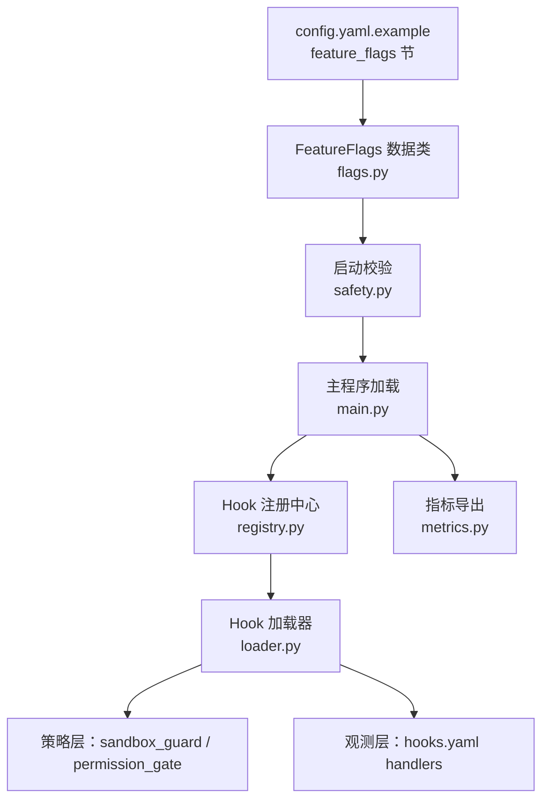
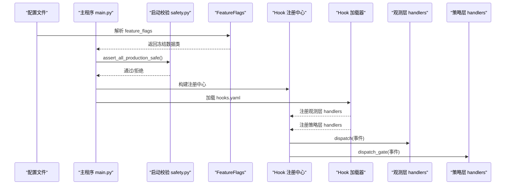
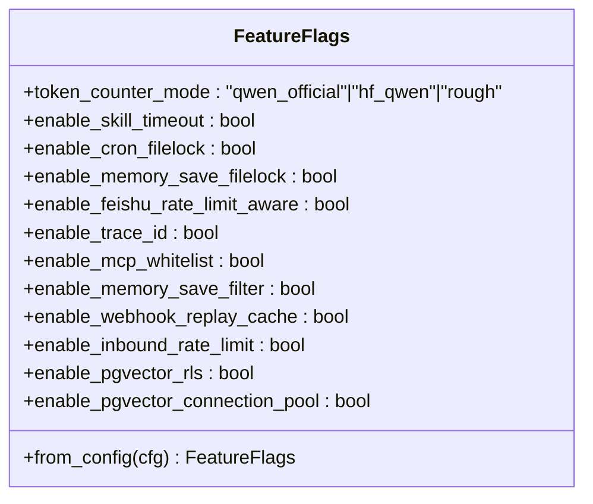
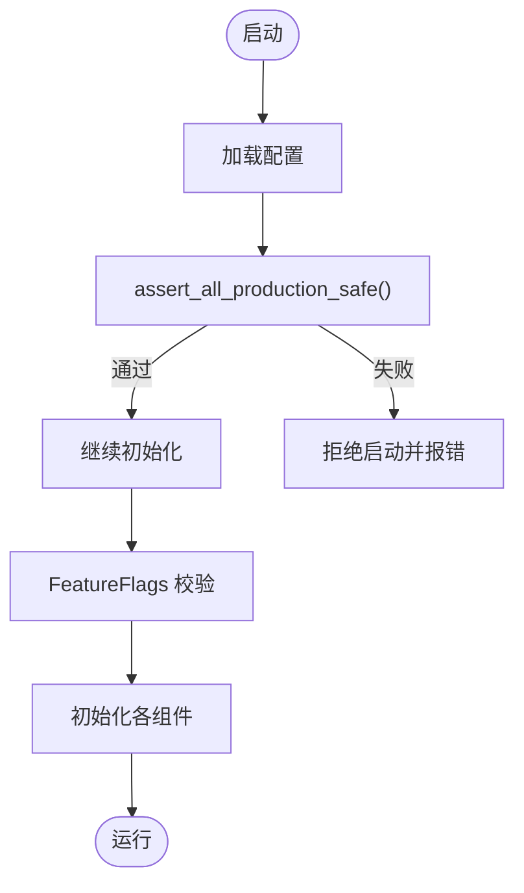
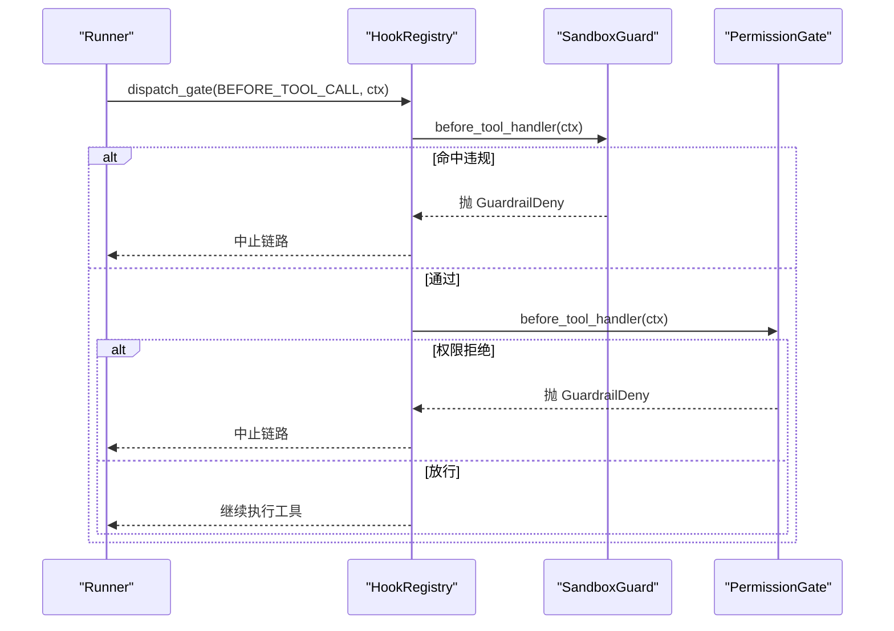
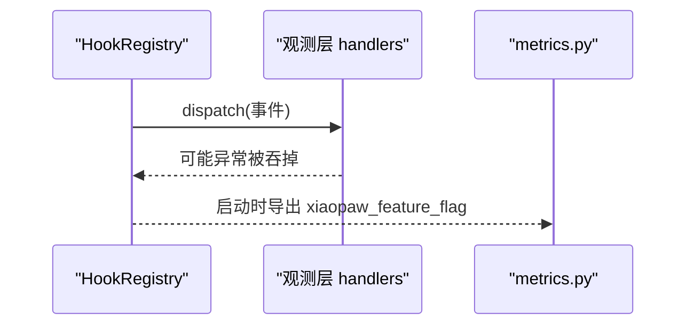
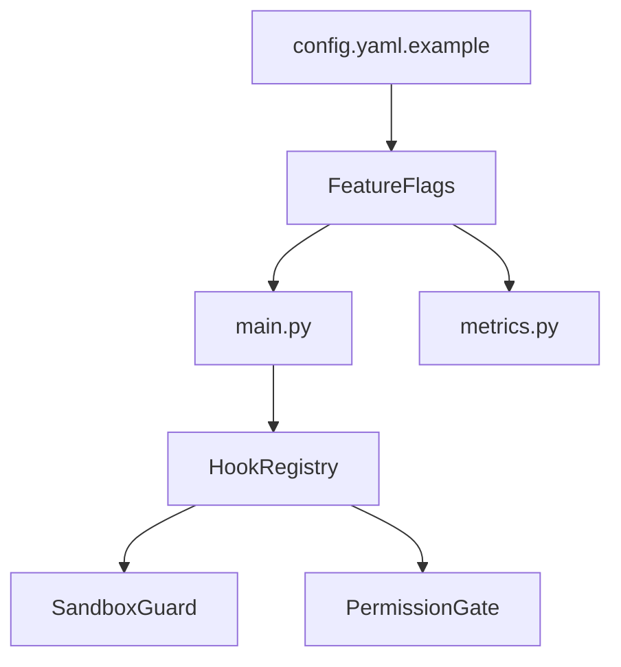

# 特性开关清单

<cite>
**本文档引用的文件**
- [flags.py](file://xiaopaw/config/flags.py)
- [feature-flags.md](file://docs/ssot/feature-flags.md)
- [09-config.md](file://docs/09-config.md)
- [config.yaml.example](file://config.yaml.example)
- [hooks.yaml](file://shared_hooks/hooks.yaml)
- [registry.py](file://xiaopaw/hook_framework/registry.py)
- [loader.py](file://xiaopaw/hook_framework/loader.py)
- [permission_gate.py](file://shared_hooks/permission_gate.py)
- [sandbox_guard.py](file://shared_hooks/sandbox_guard.py)
- [metrics.py](file://xiaopaw/observability/metrics.py)
- [main.py](file://xiaopaw/main.py)
- [safety.py](file://xiaopaw/config/safety.py)
</cite>

## 目录
1. [简介](#简介)
2. [项目结构](#项目结构)
3. [核心组件](#核心组件)
4. [架构总览](#架构总览)
5. [详细组件分析](#详细组件分析)
6. [依赖分析](#依赖分析)
7. [性能考虑](#性能考虑)
8. [故障排查指南](#故障排查指南)
9. [结论](#结论)
10. [附录](#附录)

## 简介
本文件为 XiaoPaw v2 的特性开关（Feature Flags）技术文档，面向工程与运维读者，系统阐述特性开关的定义、分类、管理机制与生命周期。重点覆盖：
- 功能开关：用于控制功能启用/禁用，如并发容错、速率限制、内存保存锁等
- 实验性功能开关：如 token 计数器模式切换
- 安全相关开关：如 MCP 白名单、内存保存过滤、Webhook 重放缓存、入站速率限制等
- 生命周期管理：启用、禁用、灰度发布、回滚流程
- 配置方式、优先级与覆盖规则
- 监控指标与效果评估方法
- 在系统演进与风险控制中的作用

## 项目结构
特性开关相关的关键位置与职责：
- 配置与清单
  - 数据类定义与默认值：xiaopaw/config/flags.py
  - 单一可信源（SSOT）清单与说明：docs/ssot/feature-flags.md
  - 示例配置节：config.yaml.example
- 运行时加载与校验
  - 启动校验（生产环境强制策略）：xiaopaw/config/safety.py
  - 主程序加载与热重载：xiaopaw/main.py
- 观测与策略框架
  - Hook 注册与分发引擎：xiaopaw/hook_framework/registry.py
  - Hook 加载器（含策略层）：xiaopaw/hook_framework/loader.py
  - 安全策略（策略层）：shared_hooks/sandbox_guard.py、shared_hooks/permission_gate.py
  - 观测策略（hooks.yaml）：shared_hooks/hooks.yaml
- 指标与可观测性
  - Prometheus 指标定义：xiaopaw/observability/metrics.py

图表来源
- [config.yaml.example:80-90](file://config.yaml.example#L80-L90)
- [flags.py:9-23](file://flags.py#L9-L23)
- [safety.py:27-47](file://safety.py#L27-L47)
- [main.py:103-113](file://main.py#L103-L113)
- [registry.py:118-198](file://registry.py#L118-L198)
- [loader.py:29-134](file://loader.py#L29-L134)
- [hooks.yaml:4-26](file://shared_hooks/hooks.yaml#L4-L26)
- [metrics.py:8-48](file://xiaopaw/observability/metrics.py#L8-L48)

章节来源
- [flags.py:9-23](file://xiaopaw/config/flags.py#L9-L23)
- [config.yaml.example:80-90](file://config.yaml.example#L80-L90)
- [feature-flags.md:10-24](file://docs/ssot/feature-flags.md#L10-L24)
- [safety.py:27-47](file://xiaopaw/config/safety.py#L27-L47)
- [main.py:103-113](file://xiaopaw/main.py#L103-L113)
- [registry.py:118-198](file://xiaopaw/hook_framework/registry.py#L118-L198)
- [loader.py:29-134](file://xiaopaw/hook_framework/loader.py#L29-L134)
- [hooks.yaml:4-26](file://shared_hooks/hooks.yaml#L4-L26)
- [metrics.py:8-48](file://xiaopaw/observability/metrics.py#L8-L48)

## 核心组件
- FeatureFlags 数据类：集中定义所有特性开关字段、默认值与 from_config 校验逻辑
- 启动校验（assert_all_production_safe）：生产环境强制要求若干开关开启
- Hook 注册中心与加载器：将 hooks.yaml 中的观测层与策略层处理器注册到事件流
- 安全策略：SandboxGuard 与 PermissionGate 在 BEFORE_TOOL_CALL 阶段执行
- 指标导出：启动时将所有 flag 值暴露为 Prometheus 指标，便于 Grafana 监控

章节来源
- [flags.py:9-23](file://xiaopaw/config/flags.py#L9-L23)
- [feature-flags.md:67-107](file://docs/ssot/feature-flags.md#L67-L107)
- [safety.py:27-47](file://xiaopaw/config/safety.py#L27-L47)
- [registry.py:118-198](file://xiaopaw/hook_framework/registry.py#L118-L198)
- [loader.py:29-134](file://xiaopaw/hook_framework/loader.py#L29-L134)
- [metrics.py:8-48](file://xiaopaw/observability/metrics.py#L8-L48)

## 架构总览
特性开关在系统中的作用路径：
- 配置层：config.yaml.example 提供 feature_flags 节，实际运行时由 FeatureFlags.from_config 解析
- 启动层：main.py 加载配置并通过 safety.py 校验，随后构建 Agent、Runner、Hook 框架
- 运行层：Hook 注册中心按事件分发；策略层在 BEFORE_TOOL_CALL 阶段执行安全判定
- 监控层：metrics.py 暴露 xiaopaw_feature_flag 指标，Grafana 可直接查看开关状态

图表来源
- [config.yaml.example:80-90](file://config.yaml.example#L80-L90)
- [flags.py:98-107](file://flags.py#L98-L107)
- [safety.py:27-47](file://safety.py#L27-L47)
- [main.py:103-113](file://main.py#L103-L113)
- [loader.py:66-134](file://loader.py#L66-L134)
- [registry.py:153-198](file://registry.py#L153-L198)

## 详细组件分析

### 数据类与清单（FeatureFlags）
- 字段类型与默认值：布尔开关与字面量枚举（token_counter_mode）
- 字段数量与一致性：SSOT 文档规定字段数为 12，确保配置漂移受控
- 校验策略：from_config 严格比对已知字段，未知字段直接报错，防止拼写错误或历史字段残留

图表来源
- [flags.py:9-23](file://xiaopaw/config/flags.py#L9-L23)
- [flags.py:98-107](file://flags.py#L98-L107)
- [feature-flags.md:67-107](file://docs/ssot/feature-flags.md#L67-L107)

章节来源
- [flags.py:9-23](file://xiaopaw/config/flags.py#L9-L23)
- [flags.py:98-107](file://xiaopaw/config/flags.py#L98-L107)
- [feature-flags.md:10-24](file://docs/ssot/feature-flags.md#L10-L24)
- [feature-flags.md:67-107](file://docs/ssot/feature-flags.md#L67-L107)

### 启动校验与生产策略
- 生产环境强制开启：REQUIRED_ON_IN_PROD 列表中的开关在 prod 环境必须为真
- 与配置变更管理联动：config.yaml.example 中字段变更需经 PR 审核
- 与热重载边界：部分开关需重启生效，部分支持热重载

图表来源
- [safety.py:27-47](file://xiaopaw/config/safety.py#L27-L47)
- [feature-flags.md:41-64](file://docs/ssot/feature-flags.md#L41-L64)
- [09-config.md:601-671](file://docs/09-config.md#L601-L671)

章节来源
- [safety.py:27-47](file://xiaopaw/config/safety.py#L27-L47)
- [feature-flags.md:41-64](file://docs/ssot/feature-flags.md#L41-L64)
- [09-config.md:601-671](file://docs/09-config.md#L601-L671)

### Hook 框架与策略层
- 事件体系：BEFORE_TURN → BEFORE_LLM → BEFORE_TOOL_CALL → AFTER_TOOL_CALL → AFTER_TURN；策略层在 BEFORE_TOOL_CALL 执行
- 策略层 fail-closed：SandboxGuard 与 PermissionGate 注册时 fail_closed=True，异常即转换为拒绝
- 依赖注入：策略可共享审计日志实例，统一写入安全审计文件

图表来源
- [registry.py:170-198](file://xiaopaw/hook_framework/registry.py#L170-L198)
- [sandbox_guard.py:93-146](file://shared_hooks/sandbox_guard.py#L93-L146)
- [permission_gate.py:32-107](file://shared_hooks/permission_gate.py#L32-L107)
- [loader.py:88-134](file://xiaopaw/hook_framework/loader.py#L88-L134)

章节来源
- [registry.py:28-45](file://xiaopaw/hook_framework/registry.py#L28-L45)
- [registry.py:170-198](file://xiaopaw/hook_framework/registry.py#L170-L198)
- [sandbox_guard.py:13-22](file://shared_hooks/sandbox_guard.py#L13-L22)
- [permission_gate.py:1-22](file://shared_hooks/permission_gate.py#L1-L22)
- [loader.py:88-134](file://xiaopaw/hook_framework/loader.py#L88-L134)

### 观测层与指标
- 观测层 handlers：hooks.yaml 中的 BEFORE_* / AFTER_* 事件处理器在 dispatch 模式下执行，异常被吞掉不影响业务
- 指标导出：启动时将 FeatureFlags 的当前值暴露为 xiaopaw_feature_flag 指标，支持 Grafana 直观查看

图表来源
- [hooks.yaml:4-26](file://shared_hooks/hooks.yaml#L4-L26)
- [registry.py:153-169](file://xiaopaw/hook_framework/registry.py#L153-L169)
- [metrics.py:8-48](file://xiaopaw/observability/metrics.py#L8-L48)

章节来源
- [hooks.yaml:4-26](file://shared_hooks/hooks.yaml#L4-L26)
- [registry.py:153-169](file://xiaopaw/hook_framework/registry.py#L153-L169)
- [metrics.py:8-48](file://xiaopaw/observability/metrics.py#L8-L48)

### 配置方式、优先级与覆盖规则
- 配置来源：config.yaml.example 提供 feature_flags 节，实际运行时由 FeatureFlags.from_config 解析
- 优先级：配置文件优先于默认值；生产环境由 assert_all_production_safe 强制策略覆盖
- 覆盖规则：未知字段直接报错，防止拼写错误或历史字段残留

章节来源
- [config.yaml.example:80-90](file://config.yaml.example#L80-L90)
- [flags.py:98-107](file://flags.py#L98-L107)
- [feature-flags.md:101-106](file://docs/ssot/feature-flags.md#L101-L106)
- [safety.py:40-45](file://xiaopaw/config/safety.py#L40-L45)

### 生命周期管理：启用、禁用、灰度发布与回滚
- 启用/禁用：通过修改 config.yaml 中 feature_flags 对应字段实现
- 热重载：SIGHUP 触发重新加载可热重载的配置（如 rate_limit、log_level、feature_flags.enable_* 多数开关）
- 灰度发布：结合观测层指标与策略层 fail-closed 机制，逐步扩大开关影响范围
- 回滚：若开关导致异常，可通过热重载恢复旧配置；对需重启的开关，采用蓝绿部署回滚

章节来源
- [09-config.md:601-671](file://docs/09-config.md#L601-L671)
- [main.py:624-652](file://xiaopaw/main.py#L624-L652)
- [registry.py:170-198](file://xiaopaw/hook_framework/registry.py#L170-L198)

### 监控指标与效果评估
- 启动时指标：xiaopaw_feature_flag（布尔开关为 0/1，字面量开关为 name:value）
- 业务指标：xiaopaw_skill_timeout_total、xiaopaw_feishu_rate_limit_total、xiaopaw_cron_dlq_total 等
- 评估方法：对比开关开启/关闭期间的指标变化，结合告警阈值与 SLA 进行回归评估

章节来源
- [metrics.py:8-48](file://xiaopaw/observability/metrics.py#L8-L48)
- [feature-flags.md:140-159](file://docs/ssot/feature-flags.md#L140-L159)

## 依赖分析
- 配置到运行时依赖：config.yaml.example → FeatureFlags → main.py → Hook 注册中心 → 策略层
- 安全策略依赖：SandboxGuard 与 PermissionGate 依赖 Hook 注册中心的 fail-closed 语义
- 指标依赖：metrics.py 依赖 FeatureFlags 的当前值进行导出

图表来源
- [config.yaml.example:80-90](file://config.yaml.example#L80-L90)
- [flags.py:9-23](file://xiaopaw/config/flags.py#L9-L23)
- [main.py:103-113](file://main.py#L103-L113)
- [registry.py:118-198](file://xiaopaw/hook_framework/registry.py#L118-L198)
- [metrics.py:8-48](file://xiaopaw/observability/metrics.py#L8-L48)

章节来源
- [config.yaml.example:80-90](file://config.yaml.example#L80-L90)
- [flags.py:9-23](file://xiaopaw/config/flags.py#L9-L23)
- [main.py:103-113](file://xiaopaw/main.py#L103-L113)
- [registry.py:118-198](file://xiaopaw/hook_framework/registry.py#L118-L198)
- [metrics.py:8-48](file://xiaopaw/observability/metrics.py#L8-L48)

## 性能考虑
- 连接池与资源：enable_pgvector_connection_pool 控制连接池开关，影响索引器性能
- Token 计数：token_counter_mode 可在精度与性能之间权衡，切换时需清理 tokenizer 缓存
- 并发与容错：enable_skill_timeout、enable_cron_filelock、enable_memory_save_filelock 等提升稳定性，但可能带来额外开销

章节来源
- [feature-flags.md:10-24](file://docs/ssot/feature-flags.md#L10-L24)
- [feature-flags.md:140-159](file://docs/ssot/feature-flags.md#L140-L159)

## 故障排查指南
- 启动失败：生产环境关闭 REQUIRED_ON_IN_PROD 中的开关将导致启动失败
- 策略层异常：fail-closed 机制下，安全 handler 自身异常将转换为拒绝，需检查 handler 日志
- 配置漂移：from_config 对未知字段直接报错，检查 config.yaml.example 与实际配置一致性
- 指标缺失：确认 metrics 服务已启动且 XIAOPAW_METRICS_TOKEN 配置正确

章节来源
- [safety.py:40-45](file://xiaopaw/config/safety.py#L40-L45)
- [registry.py:170-198](file://xiaopaw/hook_framework/registry.py#L170-L198)
- [flags.py:98-107](file://flags.py#L98-L107)
- [09-config.md:621-660](file://docs/09-config.md#L621-L660)

## 结论
特性开关是 XiaoPaw v2 在功能演进与风险控制中的关键抓手。通过集中定义、严格校验、可观测导出与 fail-closed 策略，实现了“可试验、可回滚、可灰度”的发布能力。配合生产环境强制策略与热重载机制，可在保障安全的前提下快速验证新功能。

## 附录

### 特性开关清单与分类
- 功能开关（并发与容错）：enable_skill_timeout、enable_cron_filelock、enable_memory_save_filelock、enable_feishu_rate_limit_aware
- 观测（横切）：enable_trace_id
- 安全（策略层）：enable_mcp_whitelist、enable_memory_save_filter、enable_webhook_replay_cache、enable_inbound_rate_limit
- 数据与存储：enable_pgvector_rls、enable_pgvector_connection_pool
- 实验性/精度：token_counter_mode

章节来源
- [feature-flags.md:10-24](file://docs/ssot/feature-flags.md#L10-L24)
- [flags.py:9-23](file://xiaopaw/config/flags.py#L9-L23)