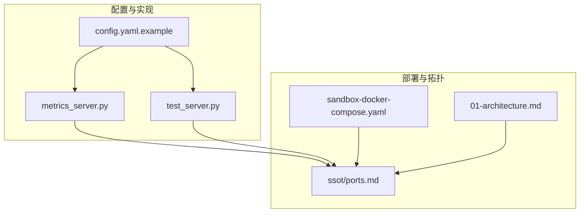
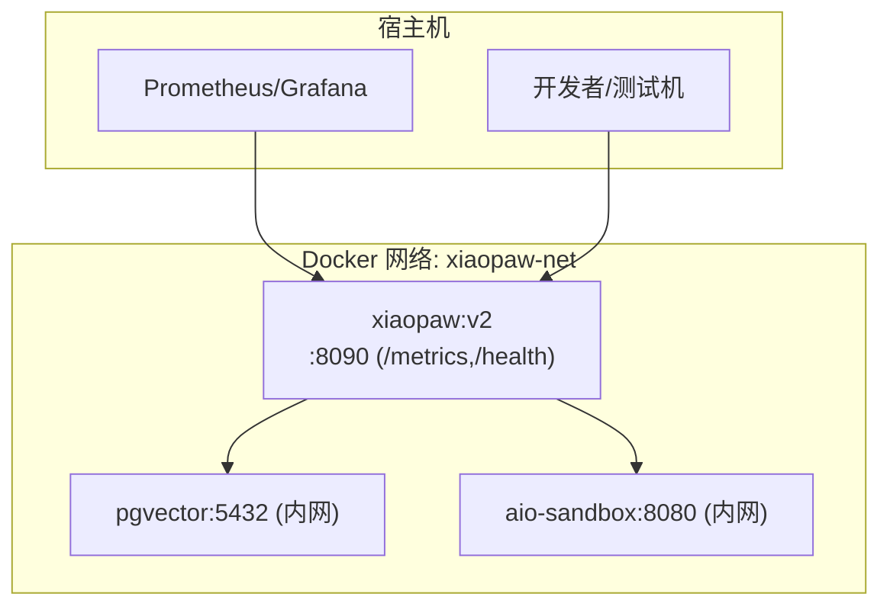
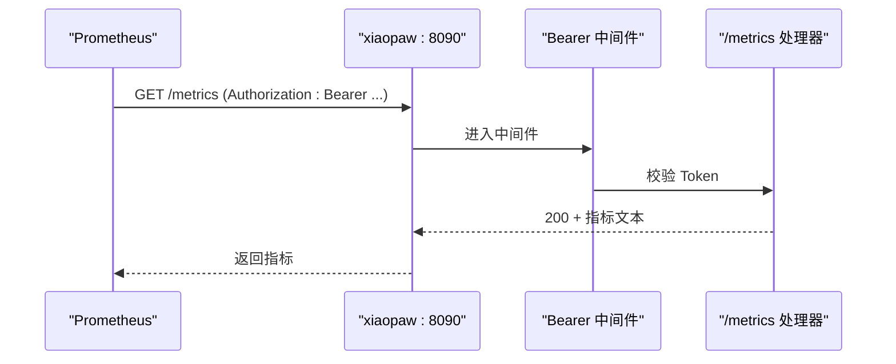
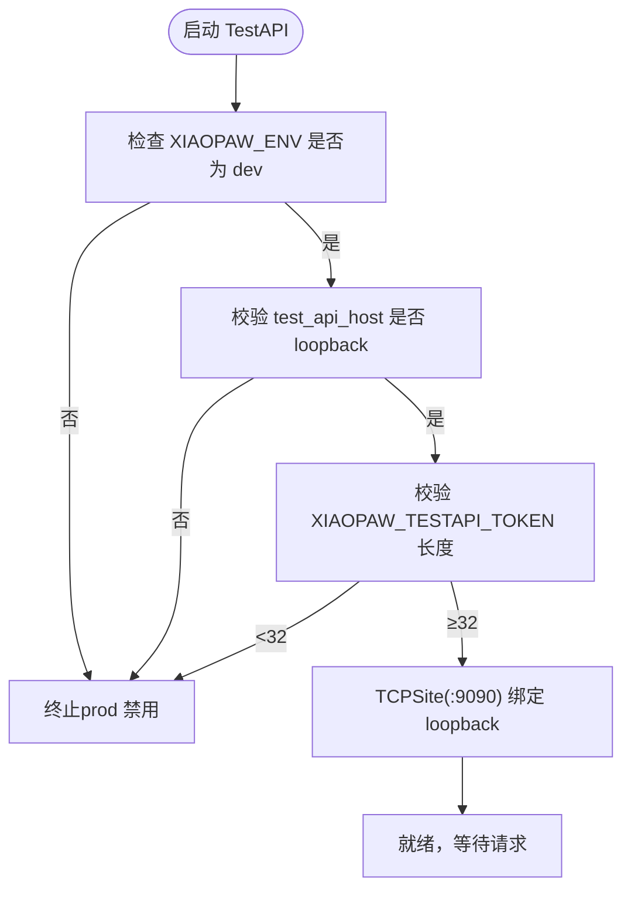
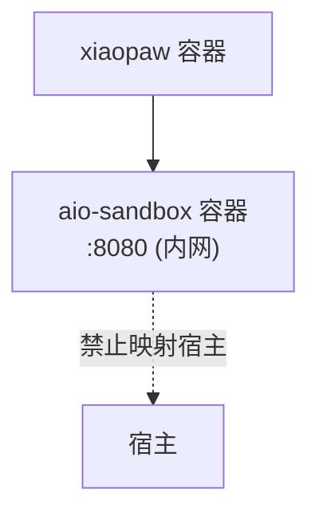
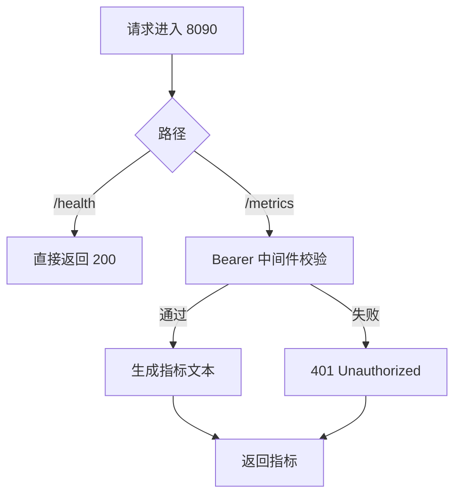
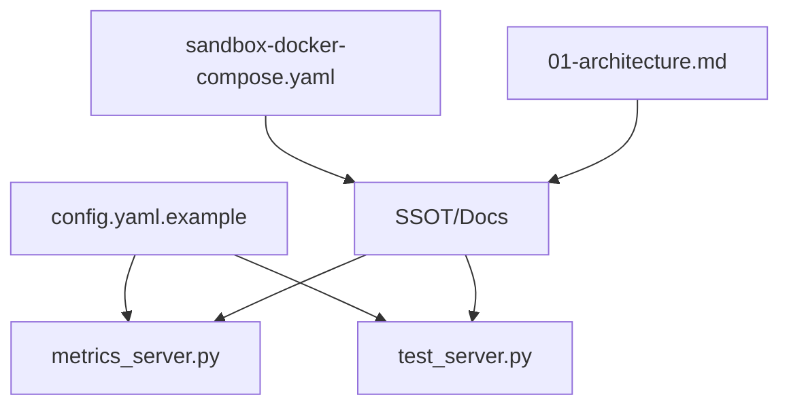

# 端口配置清单

<cite>
**本文引用的文件**
- [docs/ssot/ports.md](file://docs/ssot/ports.md)
- [config.yaml.example](file://config.yaml.example)
- [xiaopaw/observability/metrics_server.py](file://xiaopaw/observability/metrics_server.py)
- [xiaopaw/api/test_server.py](file://xiaopaw/api/test_server.py)
- [sandbox-docker-compose.yaml](file://sandbox-docker-compose.yaml)
- [DESIGN.md](file://DESIGN.md)
- [docs/04-api.md](file://docs/04-api.md)
- [docs/06-observability.md](file://docs/06-observability.md)
- [docs/09-config.md](file://docs/09-config.md)
- [docs/01-architecture.md](file://docs/01-architecture.md)
- [docs/ssot/threats.md](file://docs/ssot/threats.md)
</cite>

## 目录
1. [简介](#简介)
2. [项目结构与端口相关位置](#项目结构与端口相关位置)
3. [核心端口总览](#核心端口总览)
4. [架构与部署拓扑中的端口关系](#架构与部署拓扑中的端口关系)
5. [详细端口分析](#详细端口分析)
6. [端口分配原则与冲突避免](#端口分配原则与冲突避免)
7. [动态端口管理与最佳实践](#动态端口管理与最佳实践)
8. [安全考虑与鉴权机制](#安全考虑与鉴权机制)
9. [监控、故障排除与性能优化](#监控故障排除与性能优化)
10. [依赖关系与耦合分析](#依赖关系与耦合分析)
11. [结论](#结论)

## 简介
本文件面向 XiaoPaw v2 的运维与开发团队，提供系统中所有网络端口的权威技术说明。内容涵盖端口用途、配置方式、安全鉴权、冲突避免、动态管理、监控与故障排除，以及与部署拓扑的关系。所有端口定义与变更以“单一可信来源”（SSOT）文档为准，并在相关实现文件中落地。

## 项目结构与端口相关位置
- 端口权威清单与变更记录：docs/ssot/ports.md
- 配置样例与默认值：config.yaml.example
- 观测服务实现（/metrics 与 /health）：xiaopaw/observability/metrics_server.py
- TestAPI 实现（开发专用）：xiaopaw/api/test_server.py
- Docker Compose 示例（开发/沙箱）：sandbox-docker-compose.yaml
- 设计文档与部署视图：DESIGN.md、docs/01-architecture.md
- API 与可观测文档：docs/04-api.md、docs/06-observability.md
- 配置规范与启动校验：docs/09-config.md
- 安全威胁与端口暴露约束：docs/ssot/threats.md

**图表来源**
- [config.yaml.example:1-90](file://config.yaml.example#L1-L90)
- [xiaopaw/observability/metrics_server.py:1-54](file://xiaopaw/observability/metrics_server.py#L1-L54)
- [xiaopaw/api/test_server.py:1-107](file://xiaopaw/api/test_server.py#L1-L107)
- [sandbox-docker-compose.yaml:1-32](file://sandbox-docker-compose.yaml#L1-L32)
- [docs/ssot/ports.md:1-122](file://docs/ssot/ports.md#L1-L122)
- [docs/01-architecture.md:349-395](file://docs/01-architecture.md#L349-L395)

**章节来源**
- [docs/ssot/ports.md:1-122](file://docs/ssot/ports.md#L1-L122)
- [config.yaml.example:1-90](file://config.yaml.example#L1-L90)
- [DESIGN.md:108-117](file://DESIGN.md#L108-L117)

## 核心端口总览
- 8090：xiaopaw 主进程观测服务（/metrics + /health），对宿主开放，/metrics 需 Bearer Token，/health 无鉴权。
- 9090：TestAPI（开发专用），仅 loopback 绑定（127.0.0.1 或 ::1），生产环境强制禁用。
- 8080：AIO-Sandbox MCP（容器内部通信），不在宿主暴露，禁止映射 host ports。
- 5432：pgvector PostgreSQL（容器内部通信），不在宿主暴露，使用 TLS。

以上端口与路由、鉴权、暴露级别、环境约束均以 SSOT 为准。

**章节来源**
- [docs/ssot/ports.md:8-16](file://docs/ssot/ports.md#L8-L16)
- [docs/04-api.md:666-721](file://docs/04-api.md#L666-L721)

## 架构与部署拓扑中的端口关系
- 单节点生产部署推荐形态：xiaopaw、pgvector、aio-sandbox 位于同一 Docker 网络（xiaopaw-net），仅 xiaopaw 暴露 8090 至宿主，其余服务仅容器内可见。
- TestAPI（9090）仅在开发环境显式绑定 loopback，生产环境禁用。
- AIO-Sandbox 的 MCP 端口 8080 仅容器内使用，禁止映射至宿主，避免暴露面扩大。
- Prometheus 通过 8090 端口拉取指标，需携带 Bearer Token。

**图表来源**
- [docs/01-architecture.md:349-395](file://docs/01-architecture.md#L349-L395)
- [docs/ssot/ports.md:58-86](file://docs/ssot/ports.md#L58-L86)

**章节来源**
- [docs/01-architecture.md:349-395](file://docs/01-architecture.md#L349-L395)
- [docs/ssot/ports.md:58-86](file://docs/ssot/ports.md#L58-L86)

## 详细端口分析

### 8090：观测服务（/metrics + /health）
- 路由与鉴权
  - /health：无鉴权，用于容器健康检查，返回进程状态、git_sha、运行时长等。
  - /metrics：Bearer Token 鉴权，Prometheus 拉取标准文本格式指标。
- 实现要点
  - 同一 aiohttp Application 下挂载 /health 与 /metrics 子应用，/metrics 子应用附加 Bearer 中间件。
  - 生产环境强制要求设置 XIAOPAW_METRICS_TOKEN，否则启动即报错。
  - Dockerfile 暴露 8090 并内置 HEALTHCHECK 调用 /health。
- 配置来源
  - observability.metrics_host/metrics_port 默认监听 0.0.0.0:8090。
  - health_port 字段已删除，统一使用 metrics_port。

**图表来源**
- [xiaopaw/observability/metrics_server.py:40-54](file://xiaopaw/observability/metrics_server.py#L40-L54)
- [docs/06-observability.md:571-580](file://docs/06-observability.md#L571-L580)

**章节来源**
- [docs/04-api.md:666-721](file://docs/04-api.md#L666-L721)
- [docs/06-observability.md:530-628](file://docs/06-observability.md#L530-L628)
- [config.yaml.example:51-58](file://config.yaml.example#L51-L58)
- [docs/09-config.md:511-576](file://docs/09-config.md#L511-L576)

### 9090：TestAPI（开发专用）
- 功能与绑定
  - 仅在开发环境启用，绑定到 loopback（127.0.0.1 或 ::1），生产环境强制禁用。
  - 提供 /api/test/message 与 /api/test/sessions 清理接口，支持 Bearer Token 鉴权。
- 安全与合规
  - 启动前进行 loopback 绑定校验与环境校验（prod 禁用）。
  - 开发环境需设置 XIAOPAW_TESTAPI_TOKEN（长度 ≥32）。
- 配置来源
  - debug.enable_test_api、debug.test_api_host、debug.test_api_port、debug.test_api_token。

**图表来源**
- [xiaopaw/api/test_server.py:19-35](file://xiaopaw/api/test_server.py#L19-L35)
- [docs/09-config.md:548-556](file://docs/09-config.md#L548-L556)

**章节来源**
- [docs/ssot/ports.md:35-54](file://docs/ssot/ports.md#L35-L54)
- [docs/09-config.md:45-49](file://docs/09-config.md#L45-L49)

### 8080：AIO-Sandbox MCP（容器内部）
- 暴露级别与绑定
  - 仅容器内部通信，不在宿主暴露；禁止在 compose 中映射 host ports。
- 安全约束
  - T9 威胁明确要求：aio-sandbox 不得对外暴露 8080 端口，仅允许容器内网络访问。
- 配置来源
  - sandbox.url 默认为 http://aio-sandbox:8080/mcp（容器内 DNS 地址）。

**图表来源**
- [docs/ssot/threats.md:18-22](file://docs/ssot/threats.md#L18-L22)
- [docs/ssot/ports.md:12-15](file://docs/ssot/ports.md#L12-L15)

**章节来源**
- [docs/ssot/ports.md:12-15](file://docs/ssot/ports.md#L12-L15)
- [docs/ssot/threats.md:18-22](file://docs/ssot/threats.md#L18-L22)

### 5432：pgvector PostgreSQL（容器内部）
- 暴露级别与绑定
  - 仅容器内部通信，不在宿主暴露；使用 TLS 连接。
- 配置来源
  - memory.db_dsn 默认为 postgresql://...@pgvector:5432/...（容器内 DNS 地址）。

**章节来源**
- [docs/ssot/ports.md:12-15](file://docs/ssot/ports.md#L12-L15)
- [config.yaml.example:25-31](file://config.yaml.example#L25-L31)

## 端口分配原则与冲突避免
- 原则
  - 同一服务尽量复用端口，减少暴露面（如 8090 同时承载 /metrics 与 /health）。
  - 开发专用端口（9090）严格限制在 loopback，生产禁用。
  - 容器间通信端口（8080、5432）不映射至宿主，避免扩大攻击面。
- 冲突避免
  - 8090 与 9090 分属不同服务域（观测 vs 开发），互不干扰。
  - 8080 与 5432 仅容器内使用，不与宿主端口冲突。
  - 启动校验确保生产环境关键配置（如 XIAOPAW_METRICS_TOKEN）满足要求，避免运行时冲突。

**章节来源**
- [docs/09-config.md:511-576](file://docs/09-config.md#L511-L576)
- [docs/ssot/ports.md:103-112](file://docs/ssot/ports.md#L103-L112)

## 动态端口管理与最佳实践
- 动态端口
  - 当前实现采用固定端口策略（8090、9090、8080、5432），便于运维与监控。
  - 若未来引入动态端口，建议：
    - 通过环境变量或配置中心下发端口；
    - 在容器健康检查中使用动态端口；
    - 在服务发现与监控采集中支持端口变更。
- 最佳实践
  - 保持端口与服务一一对应，避免混用；
  - 对外暴露端口仅限 8090（/metrics + /health）；
  - 开发环境显式绑定 loopback（127.0.0.1 或 ::1），生产环境禁用 TestAPI；
  - 容器间通信端口不映射宿主，使用 Docker 网络隔离。

**章节来源**
- [docs/09-config.md:511-576](file://docs/09-config.md#L511-L576)
- [docs/ssot/ports.md:58-86](file://docs/ssot/ports.md#L58-L86)

## 安全考虑与鉴权机制
- /metrics 鉴权
  - Bearer Token 中间件仅作用于 /metrics 子应用，/health 无鉴权。
  - 生产环境强制要求 XIAOPAW_METRICS_TOKEN（长度 ≥32），缺失或错误将导致 500/401。
- /health 鉴权
  - 无鉴权，仅返回进程基础信息，不包含业务数据。
- TestAPI 鉴权
  - 开发环境需设置 XIAOPAW_TESTAPI_TOKEN（长度 ≥32），否则启动即报错。
  - 绑定 loopback，防止外部访问。
- 网络约束
  - 生产环境禁止将 8080、5432 暴露至宿主，避免被外部探测与利用。

**图表来源**
- [xiaopaw/observability/metrics_server.py:22-38](file://xiaopaw/observability/metrics_server.py#L22-L38)
- [docs/06-observability.md:530-580](file://docs/06-observability.md#L530-L580)

**章节来源**
- [docs/06-observability.md:530-628](file://docs/06-observability.md#L530-L628)
- [docs/09-config.md:548-576](file://docs/09-config.md#L548-L576)

## 监控、故障排除与性能优化
- 监控
  - Prometheus 通过 8090 拉取 /metrics，需携带 Bearer Token。
  - 健康检查使用 /health，容器健康检查依赖该端点。
- 故障排除
  - /metrics 401：检查 Authorization 头与 XIAOPAW_METRICS_TOKEN。
  - /health 500：检查容器是否正确暴露 8090 并执行 HEALTHCHECK。
  - TestAPI 无法访问：确认 XIAOPAW_ENV 为 dev，test_api_host 为 loopback，且 XIAOPAW_TESTAPI_TOKEN 符合长度要求。
  - 容器间通信失败：确认 sandbox.url 使用容器内 DNS 地址（aio-sandbox:8080），且未映射宿主端口。
- 性能优化
  - 指标导出使用轻量 aiohttp，避免额外开销。
  - /metrics 仅在需要时拉取，合理设置抓取间隔。

**章节来源**
- [docs/04-api.md:666-721](file://docs/04-api.md#L666-L721)
- [docs/06-observability.md:618-628](file://docs/06-observability.md#L618-L628)
- [docs/09-config.md:548-576](file://docs/09-config.md#L548-L576)

## 依赖关系与耦合分析
- 配置到实现
  - config.yaml.example 提供 observability.metrics_host/metrics_port、debug.* 等配置项，最终在 metrics_server.py 与 test_server.py 中生效。
- 文档到实现
  - SSOT 与 06-observability.md、04-api.md、09-config.md 等文档共同约束端口行为与安全策略。
- 部署到实现
  - sandbox-docker-compose.yaml 体现开发环境的端口映射策略；生产部署遵循 01-architecture.md 的网络隔离原则。

**图表来源**
- [config.yaml.example:51-58](file://config.yaml.example#L51-L58)
- [xiaopaw/observability/metrics_server.py:47-54](file://xiaopaw/observability/metrics_server.py#L47-L54)
- [xiaopaw/api/test_server.py:19-35](file://xiaopaw/api/test_server.py#L19-L35)
- [docs/ssot/ports.md:1-122](file://docs/ssot/ports.md#L1-L122)
- [docs/01-architecture.md:349-395](file://docs/01-architecture.md#L349-L395)

**章节来源**
- [config.yaml.example:51-58](file://config.yaml.example#L51-L58)
- [docs/ssot/ports.md:1-122](file://docs/ssot/ports.md#L1-L122)
- [docs/01-architecture.md:349-395](file://docs/01-architecture.md#L349-L395)

## 结论
XiaoPaw v2 的端口配置以“最小暴露面、强鉴权、容器内通信”为核心原则。8090 作为统一观测端口承载 /metrics 与 /health，9090 仅开发环境 loopback 使用，8080 与 5432 严格限制在容器内通信。通过配置样例、实现代码与权威文档的协同，确保端口行为稳定、安全可控，并与部署拓扑高度一致。建议在后续扩展中继续保持固定端口策略与严格的启动校验，以降低运维复杂度与安全风险。