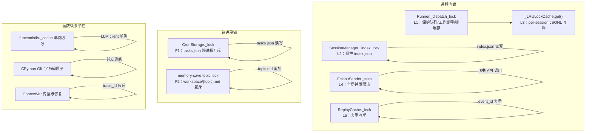
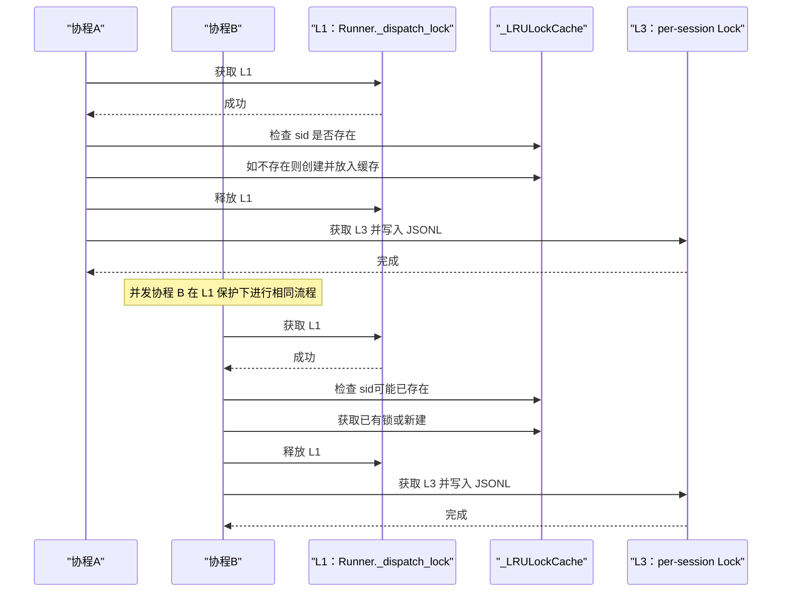
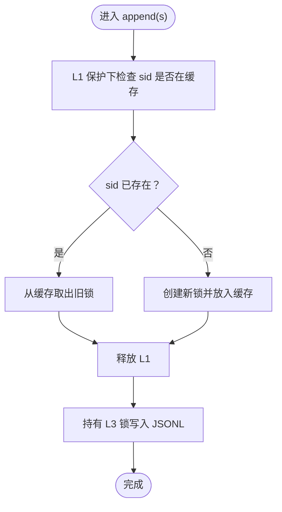
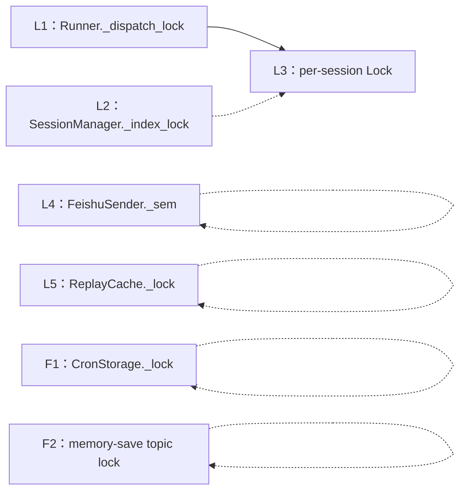

# 锁机制清单

<cite>
**本文引用的文件**
- [docs/ssot/locks.md](file://docs/ssot/locks.md)
- [docs/05-concurrency.md](file://docs/05-concurrency.md)
- [docs/concurrency-verification-report.md](file://docs/concurrency-verification-report.md)
- [xiaopaw/session/manager.py](file://xiaopaw/session/manager.py)
- [xiaopaw/cron/storage.py](file://xiaopaw/cron/storage.py)
- [xiaopaw/feishu/sender.py](file://xiaopaw/feishu/sender.py)
- [xiaopaw/observability/security.py](file://xiaopaw/observability/security.py)
- [docs/02-modules.md](file://docs/02-modules.md)
- [docs/04-api.md](file://docs/04-api.md)
- [docs/10-testing.md](file://docs/10-testing.md)
</cite>

## 目录
1. [简介](#简介)
2. [项目结构](#项目结构)
3. [核心组件](#核心组件)
4. [架构总览](#架构总览)
5. [详细组件分析](#详细组件分析)
6. [依赖分析](#依赖分析)
7. [性能考量](#性能考量)
8. [故障排查指南](#故障排查指南)
9. [结论](#结论)
10. [附录](#附录)

## 简介
本文件系统化梳理 XiaoPaw v2 的锁机制，覆盖进程内锁（asyncio.Lock、asyncio.Semaphore）、跨进程锁（filelock.FileLock）与函数级原子性保障，重点阐述两级锁模式（L1+L3）的设计原理与实现细节，解释 LRUCache 驱逐后的竞态处理、锁的获取顺序与失败降级策略，并提供 v2 与 v1 的差异对比与测试锚点说明。

## 项目结构
围绕锁机制的关键实现与文档分布如下：
- 进程内锁与两级锁模式：位于会话管理模块与并发文档
- 跨进程锁：位于 Cron 存储与技能脚本
- 限流与并发控制：位于飞书发送器
- 函数级原子性：位于安全可观测性模块与并发真相报告
- 测试与验证：位于测试文档与相关测试用例

图表来源
- [docs/05-concurrency.md](file://docs/05-concurrency.md)
- [docs/ssot/locks.md](file://docs/ssot/locks.md)
- [xiaopaw/session/manager.py](file://xiaopaw/session/manager.py)
- [xiaopaw/cron/storage.py](file://xiaopaw/cron/storage.py)
- [xiaopaw/feishu/sender.py](file://xiaopaw/feishu/sender.py)
- [xiaopaw/observability/security.py](file://xiaopaw/observability/security.py)

章节来源
- [docs/05-concurrency.md](file://docs/05-concurrency.md)
- [docs/ssot/locks.md](file://docs/ssot/locks.md)

## 核心组件
- L1：Runner._dispatch_lock（全局，<1ms，阻塞等待）
  - 保护队列、工作线程、锁缓存的“检查+创建+获取”三步原子性
- L2：SessionManager._index_lock（全局，<5ms，阻塞等待）
  - 保护 index.json 的读写一致性
- L3：_LRULockCache.get()/per-session asyncio.Lock（LRU 缓存 + per-session，<10ms，阻塞等待）
  - 两级锁模式：L1 保护 setdefault，L3 提供 per-session 互斥
- L4：FeishuSender._sem（全局，Semaphore(5)，排队等待）
  - 控制飞书 API 并发，避免 429
- L5：ReplayCache._lock（全局，<1ms，阻塞等待）
  - 保护 event_id 去重的 LRU 更新
- F1：CronStorage._lock（filelock.FileLock，10s 超时）
  - 跨 CronService 与 scheduler_mgr Skill 的 tasks.json 互斥
- F2：memory-save topic lock（filelock.FileLock，10s 超时）
  - 同 topic 的并发写入互斥
- 函数级原子性：functools.cache/lru_cache、GIL、ContextVar

章节来源
- [docs/ssot/locks.md](file://docs/ssot/locks.md)
- [docs/05-concurrency.md](file://docs/05-concurrency.md)
- [xiaopaw/session/manager.py](file://xiaopaw/session/manager.py)
- [xiaopaw/cron/storage.py](file://xiaopaw/cron/storage.py)
- [xiaopaw/feishu/sender.py](file://xiaopaw/feishu/sender.py)
- [xiaopaw/observability/security.py](file://xiaopaw/observability/security.py)

## 架构总览
两级锁模式（L1+L3）的核心目标是：在 LRUCache 防 OOM 的前提下，通过 L1 保护“检查+创建+获取”的原子性，避免 LRUCache 驱逐后并发 getter 各自新建锁导致的互斥失效；L3 提供 per-session 的真正互斥，确保 JSONL 追加与 fsync 的一致性。

图表来源
- [docs/05-concurrency.md](file://docs/05-concurrency.md)
- [docs/ssot/locks.md](file://docs/ssot/locks.md)
- [xiaopaw/session/manager.py](file://xiaopaw/session/manager.py)

## 详细组件分析

### 进程内锁：Runner._dispatch_lock（L1）
- 保护范围：_queues、_workers、_queue_gen、_jsonl_locks（作为 L1）
- 持有时间：<1ms，仅字典操作与任务创建
- 典型使用场景：dispatch 新建队列与 worker，以及 L3 锁缓存的 setdefault 原子性
- 失败降级：阻塞等待；不存在失败路径（任务创建在事件循环内）

章节来源
- [docs/05-concurrency.md](file://docs/05-concurrency.md)

### 进程内锁：SessionManager._index_lock（L2）
- 保护范围：sessions/index.json 的读写
- 持有时间：<5ms
- 典型使用场景：会话索引的创建、更新、清理
- 失败降级：阻塞等待

章节来源
- [xiaopaw/session/manager.py](file://xiaopaw/session/manager.py)

### 两级锁：_LRULockCache + L1（L3）
- LRU 缓存上限：1000，防 OOM；活跃会话峰值超限时需告警
- L1 保护：在 L1 内完成“检查+创建+获取”，避免 LRUCache 驱逐后并发 getter 各自新建锁
- L3：真正的 per-session 互斥，保护 JSONL 追加与 fsync
- 竞态说明：LRUCache 非原子 setdefault，驱逐后并发访问可能产生新旧锁并存；但 L1 保护下不会出现“检查未完成就创建”的竞态

图表来源
- [docs/05-concurrency.md](file://docs/05-concurrency.md)
- [docs/ssot/locks.md](file://docs/ssot/locks.md)
- [xiaopaw/session/manager.py](file://xiaopaw/session/manager.py)

章节来源
- [docs/05-concurrency.md](file://docs/05-concurrency.md)
- [docs/ssot/locks.md](file://docs/ssot/locks.md)
- [docs/concurrency-verification-report.md](file://docs/concurrency-verification-report.md)
- [xiaopaw/session/manager.py](file://xiaopaw/session/manager.py)

### 进程内锁：FeishuSender._sem（L4）
- 保护范围：全局飞书 API 并发
- 并发上限：Semaphore(5)
- 失败降级：排队等待；结合 429 识别与指数退避，避免触发平台限流

章节来源
- [docs/05-concurrency.md](file://docs/05-concurrency.md)
- [docs/02-modules.md](file://docs/02-modules.md)
- [docs/04-api.md](file://docs/04-api.md)
- [xiaopaw/feishu/sender.py](file://xiaopaw/feishu/sender.py)

### 进程内锁：ReplayCache._lock（L5）
- 保护范围：event_id 去重的 LRU 更新
- 持有时间：<1ms
- 典型使用场景：防御 webhook 重放攻击
- 失败降级：阻塞等待；跨重启/多节点需 Redis 做持久化

章节来源
- [xiaopaw/observability/security.py](file://xiaopaw/observability/security.py)
- [docs/02-modules.md](file://docs/02-modules.md)

### 跨进程锁：CronStorage._lock（F1）
- 保护范围：data/cron/tasks.json 的读写
- 锁类型：filelock.FileLock（Linux 默认 fcntl.flock）
- 超时：10s；捕获 Timeout 后读失败返回上次缓存，写失败记录指标并重试 1 次

章节来源
- [xiaopaw/cron/storage.py](file://xiaopaw/cron/storage.py)
- [docs/05-concurrency.md](file://docs/05-concurrency.md)

### 跨进程锁：memory-save topic lock（F2）
- 保护范围：data/workspace/{topic}.md 的并发追加
- 锁粒度：topic 粒度，互不阻塞
- 超时：10s；捕获 Timeout 返回 408

章节来源
- [docs/05-concurrency.md](file://docs/05-concurrency.md)

### 函数级原子性
- functools.cache/lru_cache：CPython 内置 RLock 保证并发首次调用收敛到同一实例
- CPython GIL：字节码级原子（不依赖，仅兜底）
- ContextVar：trace_id 传播，finally 保证 reset 到正确值

章节来源
- [docs/ssot/locks.md](file://docs/ssot/locks.md)
- [docs/concurrency-verification-report.md](file://docs/concurrency-verification-report.md)

## 依赖分析
- L1 依赖 L3：L1 保护 L3 的获取过程，避免竞态
- L2 独立：仅保护 index.json，不依赖 L3
- L4 与 L5 独立：分别保护 API 并发与去重逻辑
- F1/F2 与进程内锁无直接耦合，但共同保护跨进程/跨容器的文件一致性

图表来源
- [docs/ssot/locks.md](file://docs/ssot/locks.md)
- [docs/05-concurrency.md](file://docs/05-concurrency.md)

章节来源
- [docs/ssot/locks.md](file://docs/ssot/locks.md)
- [docs/05-concurrency.md](file://docs/05-concurrency.md)

## 性能考量
- L1 持有时间极短（<1ms），对整体吞吐影响可忽略
- L3 持有时间包含磁盘写与 fsync（<10ms），建议将写放大操作批量化
- L4 通过限流与退避避免平台 429，提升端到端稳定性
- LRU 上限 1000 在峰值活跃会话以下时稳定；超限需告警并扩容

## 故障排查指南
- LRU 驱逐后并发写 JSONL
  - 现象：竞态导致消息交错或丢失
  - 根因：LRUCache 非原子 setdefault，驱逐后并发 getter 各自新建锁
  - 处理：确保通过 L1 保护“检查+创建+获取”；监控活跃会话是否接近 1000
- Cron tasks.json 读写失败
  - 现象：Timeout 异常
  - 处理：读失败返回上次缓存；写失败记录指标并重试 1 次
- memory-save topic 写入失败
  - 现象：返回 408
  - 处理：由上游 Skill 决定重试或放弃
- 飞书 429
  - 现象：HTTP 429 或 SDK 错误码
  - 处理：L4 限流 + 指数退避；确保 Semaphore(5) 未被长期占用

章节来源
- [docs/concurrency-verification-report.md](file://docs/concurrency-verification-report.md)
- [docs/05-concurrency.md](file://docs/05-concurrency.md)
- [xiaopaw/cron/storage.py](file://xiaopaw/cron/storage.py)
- [xiaopaw/feishu/sender.py](file://xiaopaw/feishu/sender.py)

## 结论
XiaoPaw v2 的锁体系以“两级锁模式（L1+L3）”为核心，既满足 LRUCache 防 OOM 的需求，又通过 L1 原子化保护避免竞态；辅以跨进程 filelock 与函数级原子性，形成从进程内到跨进程的完整一致性保障。结合限流与退避策略，系统在高并发场景下具备良好的稳定性与可维护性。

## 附录

### v2 与 v1 差异对比
- L3：v1 无界 dict 导致 OOM，v2 采用 LRUCache(1000)+L1 两级锁
- L4：v1 无限流，v2 引入 Semaphore(5)
- L5：v1 无去重互斥，v2 新增 ReplayCache._lock
- F1：v1 单进程写-重命名不跨进程，v2 采用 filelock 跨进程 + DLQ
- F2：v1 无锁覆盖风险，v2 采用 topic 粒度 filelock

章节来源
- [docs/ssot/locks.md](file://docs/ssot/locks.md)

### 测试锚点
- TC-P0-4-a/b：LRUCache 驱逐 + 并发 append 互斥（L1+L3）
- TC-P1-6-a：Cron 跨进程锁（F1）
- TC-P0-4-c：memory-save topic 锁（F2）
- TC-P2-7-a：FeishuSender Semaphore 限流（L4）
- TC-P0-1-b：ReplayCache 重放拒绝（L5）

章节来源
- [docs/ssot/locks.md](file://docs/ssot/locks.md)
- [docs/10-testing.md](file://docs/10-testing.md)