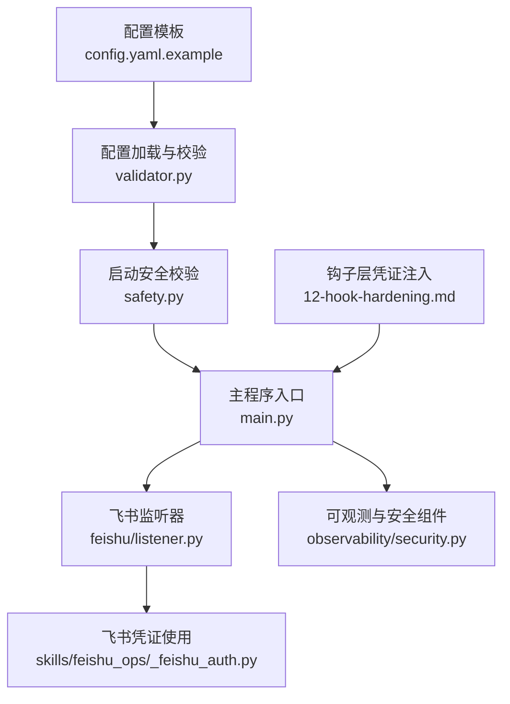
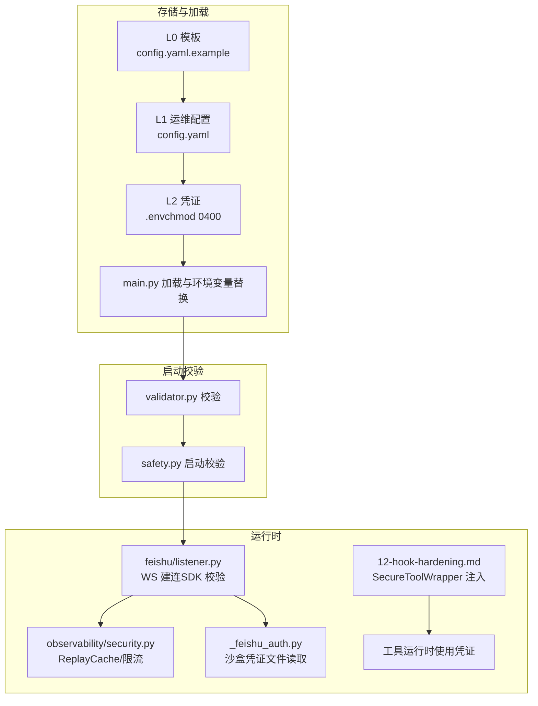
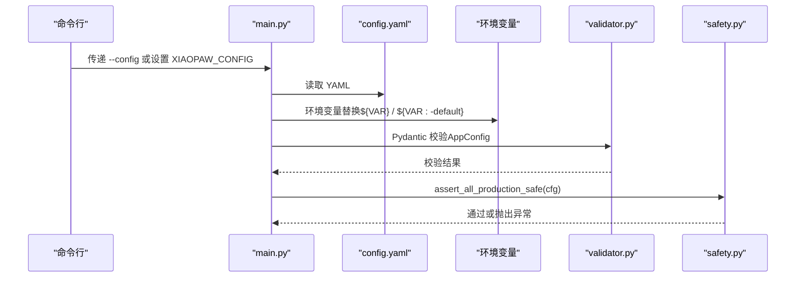
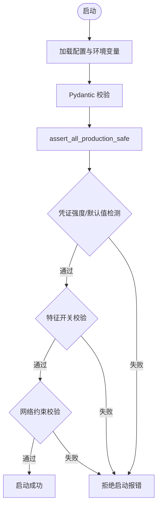
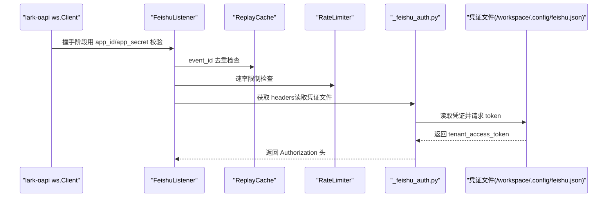
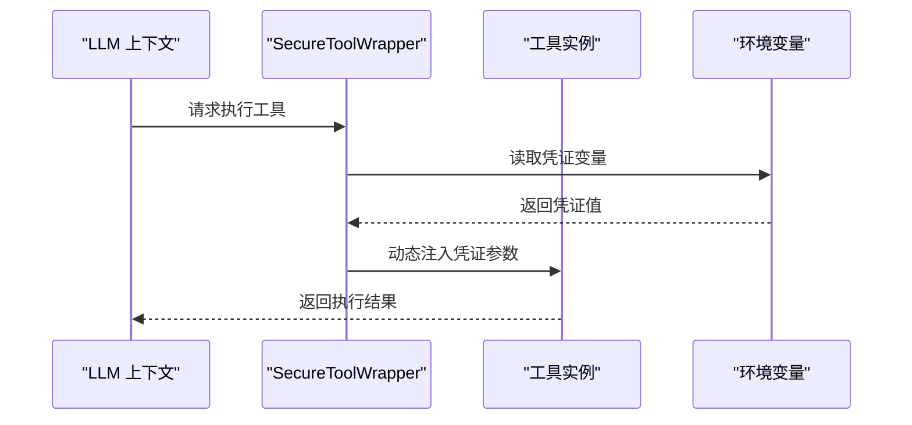
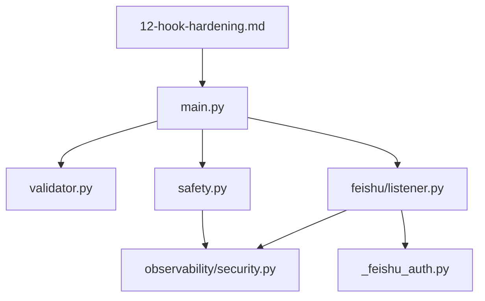

# 凭证管理

<cite>
**本文引用的文件**
- [config.yaml.example](file://config.yaml.example)
- [main.py](file://xiaopaw/main.py)
- [validator.py](file://xiaopaw/config/validator.py)
- [safety.py](file://xiaopaw/config/safety.py)
- [_feishu_auth.py](file://xiaopaw/skills/feishu_ops/scripts/_feishu_auth.py)
- [listener.py](file://xiaopaw/feishu/listener.py)
- [session_key.py](file://xiaopaw/feishu/session_key.py)
- [security.py](file://xiaopaw/observability/security.py)
- [07-security.md](file://docs/07-security.md)
- [09-config.md](file://docs/09-config.md)
- [12-hook-hardening.md](file://docs/12-hook-hardening.md)
- [01-architecture.md](file://docs/01-architecture.md)
- [11-migration-v1-to-v2.md](file://docs/11-migration-v1-to-v2.md)
</cite>

## 目录
1. [简介](#简介)
2. [项目结构](#项目结构)
3. [核心组件](#核心组件)
4. [架构总览](#架构总览)
5. [详细组件分析](#详细组件分析)
6. [依赖关系分析](#依赖关系分析)
7. [性能考量](#性能考量)
8. [故障排查指南](#故障排查指南)
9. [结论](#结论)
10. [附录](#附录)

## 简介
本文件面向 XiaoPaw v2 的凭证管理，系统性阐述凭证安全管理体系的设计原则与落地实现，包括凭证存储、传输与使用的要求，以及针对飞书 App Secret、API Key、数据库凭证等敏感信息的管理方法。文档还提供凭证轮换手册的执行流程与最佳实践、配置指南与运维建议，以及不同环境下的处理策略与安全边界。

## 项目结构
围绕凭证管理的关键文件与职责如下：
- 配置模板与加载：config.yaml.example、xiaopaw/main.py、xiaopaw/config/validator.py
- 启动安全校验：xiaopaw/config/safety.py、docs/09-config.md、docs/07-security.md
- 飞书凭证使用与隔离：xiaopaw/skills/feishu_ops/scripts/_feishu_auth.py、xiaopaw/feishu/listener.py
- 运行时安全与重放防护：xiaopaw/observability/security.py
- 钩子层凭证注入：docs/12-hook-hardening.md
- 迁移与轮换策略：docs/01-architecture.md、docs/11-migration-v1-to-v2.md

图表来源
- [config.yaml.example:1-90](file://config.yaml.example#L1-L90)
- [validator.py:97-122](file://xiaopaw/config/validator.py#L97-L122)
- [safety.py:27-47](file://xiaopaw/config/safety.py#L27-L47)
- [main.py:18-32](file://xiaopaw/main.py#L18-L32)
- [listener.py:98-114](file://xiaopaw/feishu/listener.py#L98-L114)
- [security.py:486-510](file://xiaopaw/observability/security.py#L486-L510)
- [_feishu_auth.py:16-40](file://xiaopaw/skills/feishu_ops/scripts/_feishu_auth.py#L16-L40)
- [12-hook-hardening.md:460-475](file://docs/12-hook-hardening.md#L460-L475)

章节来源
- [config.yaml.example:1-90](file://config.yaml.example#L1-L90)
- [validator.py:97-122](file://xiaopaw/config/validator.py#L97-L122)
- [safety.py:27-47](file://xiaopaw/config/safety.py#L27-L47)
- [main.py:18-32](file://xiaopaw/main.py#L18-L32)

## 核心组件
- 配置分层与优先级：L0 模板、L1 运维配置、L2 凭证、L3 命令行；优先级自高而低依次为命令行参数、环境变量、config.yaml、代码默认值。
- 启动安全校验：统一入口 assert_all_production_safe，覆盖凭证强度、TestAPI 约束、特征开关、网络约束等。
- 飞书凭证使用：WS 模式下由 SDK 在握手阶段完成身份校验，应用层通过沙盒隔离文件与运行时注入保障安全。
- 运行时安全：ReplayCache（event_id 去重 + TTL）、速率限制、路由键不可外部覆盖等。
- 钩子层凭证注入：SecureToolWrapper 在工具运行时从环境变量注入凭证，避免 LLM 上下文接触敏感信息。

章节来源
- [09-config.md:35-80](file://docs/09-config.md#L35-L80)
- [09-config.md:372-576](file://docs/09-config.md#L372-L576)
- [07-security.md:476-538](file://docs/07-security.md#L476-L538)
- [12-hook-hardening.md:460-475](file://docs/12-hook-hardening.md#L460-L475)

## 架构总览
凭证安全体系贯穿“存储-传输-使用”全链路，结合配置分层、启动校验、运行时防护与隔离注入，形成多层纵深防御。

图表来源
- [config.yaml.example:1-90](file://config.yaml.example#L1-L90)
- [main.py:64-76](file://xiaopaw/main.py#L64-L76)
- [validator.py:97-122](file://xiaopaw/config/validator.py#L97-L122)
- [safety.py:27-47](file://xiaopaw/config/safety.py#L27-L47)
- [listener.py:98-114](file://xiaopaw/feishu/listener.py#L98-L114)
- [security.py:486-510](file://xiaopaw/observability/security.py#L486-L510)
- [_feishu_auth.py:16-40](file://xiaopaw/skills/feishu_ops/scripts/_feishu_auth.py#L16-L40)
- [12-hook-hardening.md:460-475](file://docs/12-hook-hardening.md#L460-L475)

## 详细组件分析

### 配置分层与加载流程
- 分层与优先级：命令行参数 > 环境变量 > config.yaml > 代码默认值。
- 加载顺序：解析命令行 → 读取 YAML → 环境变量替换 → Pydantic 校验 → 启动安全校验。
- 飞书配置字段：app_id、app_secret、allowed_chats；数据库 DSN 与密码部分需满足最小长度与强度要求。

图表来源
- [main.py:64-76](file://xiaopaw/main.py#L64-L76)
- [validator.py:116-122](file://xiaopaw/config/validator.py#L116-L122)
- [safety.py:27-47](file://xiaopaw/config/safety.py#L27-L47)

章节来源
- [09-config.md:35-80](file://docs/09-config.md#L35-L80)
- [config.yaml.example:7-10](file://config.yaml.example#L7-L10)
- [validator.py:14-17](file://xiaopaw/config/validator.py#L14-L17)
- [validator.py:97-113](file://xiaopaw/config/validator.py#L97-L113)

### 启动安全校验与凭证强度
- 统一入口：assert_all_production_safe，覆盖凭证强度、TestAPI 约束、特征开关、网络约束。
- 凭证强度要求：飞书 app_secret、数据库密码、metrics token 等最小长度与字符集要求。
- 禁止默认值与弱值：正则 + SHA256 哈希双层拒绝；禁止空值、占位符、常见弱字典等。
- 特征开关：生产环境禁止关闭若干安全相关开关，确保最小可用安全基线。

图表来源
- [safety.py:27-47](file://xiaopaw/config/safety.py#L27-L47)
- [09-config.md:372-576](file://docs/09-config.md#L372-L576)

章节来源
- [safety.py:18-24](file://xiaopaw/config/safety.py#L18-L24)
- [09-config.md:372-576](file://docs/09-config.md#L372-L576)

### 飞书凭证使用与安全边界
- WS 建连校验：SDK 在握手阶段用 app_id + app_secret 完成服务端身份校验，应用层无需 HMAC 验签。
- 应用层防护：ReplayCache（LRU + TTL）对 event_id 去重；速率限制；allowed_chats 白名单；routing_key 不可外部覆盖。
- 凭证隔离：飞书脚本通过沙盒路径读取凭证文件，不暴露给 LLM；WS 模式不使用 encrypt_key/verification_token。

图表来源
- [listener.py:98-114](file://xiaopaw/feishu/listener.py#L98-L114)
- [security.py:486-510](file://xiaopaw/observability/security.py#L486-L510)
- [_feishu_auth.py:16-40](file://xiaopaw/skills/feishu_ops/scripts/_feishu_auth.py#L16-L40)
- [session_key.py:6-21](file://xiaopaw/feishu/session_key.py#L6-L21)

章节来源
- [07-security.md:476-538](file://docs/07-security.md#L476-L538)
- [07-security.md:1748-1787](file://docs/07-security.md#L1748-L1787)
- [_feishu_auth.py:1-40](file://xiaopaw/skills/feishu_ops/scripts/_feishu_auth.py#L1-L40)
- [listener.py:98-114](file://xiaopaw/feishu/listener.py#L98-L114)
- [security.py:486-510](file://xiaopaw/observability/security.py#L486-L510)
- [session_key.py:6-21](file://xiaopaw/feishu/session_key.py#L6-L21)

### 钩子层凭证注入（运行时）
- SecureToolWrapper 在工具运行时从环境变量注入凭证，确保 LLM 上下文不接触敏感信息。
- 与 v2 凭证管理配合：config.yaml + .env + safety.py 负责存储与启动校验，SecureToolWrapper 负责运行时注入。

图表来源
- [12-hook-hardening.md:460-475](file://docs/12-hook-hardening.md#L460-L475)

章节来源
- [12-hook-hardening.md:460-475](file://docs/12-hook-hardening.md#L460-L475)

### 凭证轮换手册（执行流程与最佳实践）
- 轮换周期：90 天；迁移阶段提供 24 小时过渡窗口，允许新旧凭证短暂并存。
- 执行步骤（概要）：
  - 准备：在飞书开放平台生成新 App Secret；在外部系统（如数据库、Langfuse、Metrics）生成新密钥/令牌。
  - Canary 验证：先在 canary 环境使用新凭证，验证功能与安全基线。
  - 生产切换：在 24 小时窗口内逐步切换 prod，监控重放与异常。
  - 回滚策略：若切换失败，按文档回退至旧凭证或进行二次轮换。
- 最佳实践：
  - 使用 Secret Manager 托管凭证，避免以环境变量落盘。
  - 轮换前后进行启动校验与端到端验证。
  - 严格遵循“最小权限”与“最小暴露面”，凭证仅在必要路径可见。

章节来源
- [09-config.md:372-396](file://docs/09-config.md#L372-L396)
- [01-architecture.md:470-475](file://docs/01-architecture.md#L470-L475)
- [11-migration-v1-to-v2.md:640-669](file://docs/11-migration-v1-to-v2.md#L640-L669)

### 配置指南与运维建议
- 存储与权限：
  - .env 使用 chmod 0400，提交到 L2 层，随环境生命周期轮换。
  - config.yaml 不含密钥，提交到 L1 层。
- 传输与使用：
  - 飞书 WS 模式下，凭证仅在 SDK 握手阶段参与服务端校验；应用层通过 ReplayCache 与速率限制防护重放与滥用。
  - 钩子层通过环境变量注入凭证，避免 LLM 上下文接触敏感信息。
- 环境策略：
  - 生产环境必须配置 metrics token，sandbox.url 必须为容器间地址。
  - 生产环境禁止开启 TestAPI，test_api_host 必须为 127.0.0.1。
- 安全边界：
  - allowed_chats 白名单策略；routing_key 由内部计算，不可外部覆盖。
  - 消息长度限制与附件大小限制，降低资源滥用风险。

章节来源
- [09-config.md:35-80](file://docs/09-config.md#L35-L80)
- [09-config.md:566-576](file://docs/09-config.md#L566-L576)
- [07-security.md:1709-1742](file://docs/07-security.md#L1709-L1742)
- [07-security.md:1807-1831](file://docs/07-security.md#L1807-L1831)
- [07-security.md:476-538](file://docs/07-security.md#L476-L538)
- [12-hook-hardening.md:460-475](file://docs/12-hook-hardening.md#L460-L475)

## 依赖关系分析
凭证管理涉及的主要依赖与耦合：
- main.py 依赖 validator.py 与 safety.py 完成配置加载与启动校验。
- feishu/listener.py 依赖 SDK 完成 WS 建连，依赖 observability/security.py 提供 ReplayCache 与限流。
- skills/feishu_ops/_feishu_auth.py 依赖凭证文件与外部 API 获取 token。
- 12-hook-hardening.md 的 SecureToolWrapper 与工具运行时交互，实现凭证注入。

图表来源
- [main.py:11-42](file://xiaopaw/main.py#L11-L42)
- [validator.py:97-122](file://xiaopaw/config/validator.py#L97-L122)
- [safety.py:27-47](file://xiaopaw/config/safety.py#L27-L47)
- [security.py:486-510](file://xiaopaw/observability/security.py#L486-L510)
- [listener.py:98-114](file://xiaopaw/feishu/listener.py#L98-L114)
- [_feishu_auth.py:16-40](file://xiaopaw/skills/feishu_ops/scripts/_feishu_auth.py#L16-L40)
- [12-hook-hardening.md:460-475](file://docs/12-hook-hardening.md#L460-L475)

章节来源
- [main.py:11-42](file://xiaopaw/main.py#L11-L42)
- [validator.py:97-122](file://xiaopaw/config/validator.py#L97-L122)
- [safety.py:27-47](file://xiaopaw/config/safety.py#L27-L47)
- [security.py:486-510](file://xiaopaw/observability/security.py#L486-L510)
- [listener.py:98-114](file://xiaopaw/feishu/listener.py#L98-L114)
- [_feishu_auth.py:16-40](file://xiaopaw/skills/feishu_ops/scripts/_feishu_auth.py#L16-L40)
- [12-hook-hardening.md:460-475](file://docs/12-hook-hardening.md#L460-L475)

## 性能考量
- ReplayCache 使用 LRU + TTL，内存占用有界，适合长周期运行的进程。
- 速率限制与消息长度限制降低异常流量对下游的影响，提升系统稳定性。
- WS 模式下 SDK 完成服务端校验，应用层无需 HMAC 计算，减少 CPU 开销。

## 故障排查指南
- 启动失败（生产环境）：
  - 检查是否满足凭证强度与禁止默认值规则；查看启动日志中的安全违规项。
  - 确认生产环境特征开关未被关闭；确认 metrics token 已配置；确认 sandbox.url 为容器间地址。
- WS 重放与重复消息：
  - 检查 ReplayCache 是否生效；确认 event_id 去重逻辑正常；关注重放命中指标。
- 飞书凭证相关问题：
  - 确认凭证文件存在且格式正确；检查外部 API 返回码与消息；确认 allowed_chats 白名单配置。
- 钩子层凭证注入问题：
  - 确认环境变量已正确注入；检查工具运行时参数是否包含凭证；避免 LLM 上下文暴露敏感信息。

章节来源
- [safety.py:27-47](file://xiaopaw/config/safety.py#L27-L47)
- [security.py:486-510](file://xiaopaw/observability/security.py#L486-L510)
- [_feishu_auth.py:16-40](file://xiaopaw/skills/feishu_ops/scripts/_feishu_auth.py#L16-L40)
- [12-hook-hardening.md:460-475](file://docs/12-hook-hardening.md#L460-L475)

## 结论
XiaoPaw v2 的凭证管理体系通过“分层存储 + 启动校验 + 运行时防护 + 隔离注入”的组合拳，实现了对飞书 App Secret、API Key、数据库凭证等敏感信息的全生命周期安全管控。配合 90 天轮换与 24 小时过渡窗口，确保在变更过程中的连续性与安全性。建议在生产环境中严格执行最小权限、最小暴露面与 Secret Manager 托管策略，并持续进行端到端验证与监控告警。

## 附录
- 飞书凭证文件位置与用途：/workspace/.config/feishu.json，仅在沙盒路径读取，不暴露给 LLM。
- WS 模式下 SDK 参数不包含 encrypt_key/verification_token，应用层无需 HMAC 验签。
- routing_key 由内部计算，不可外部覆盖，避免路由欺骗。

章节来源
- [_feishu_auth.py:1-40](file://xiaopaw/skills/feishu_ops/scripts/_feishu_auth.py#L1-L40)
- [07-security.md:1748-1787](file://docs/07-security.md#L1748-L1787)
- [session_key.py:6-21](file://xiaopaw/feishu/session_key.py#L6-L21)