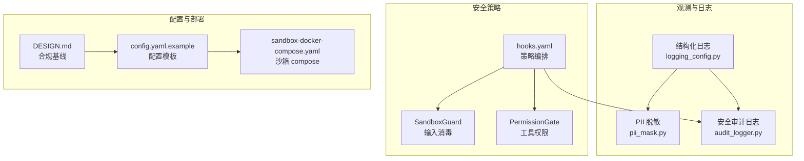
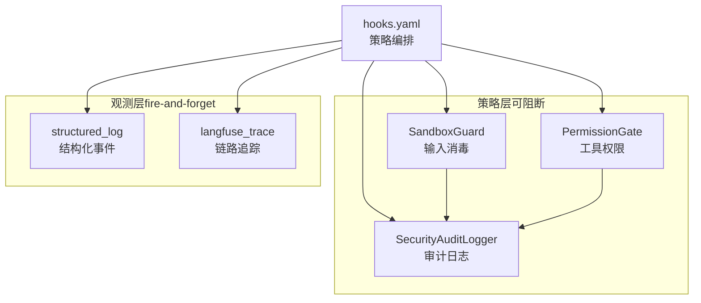
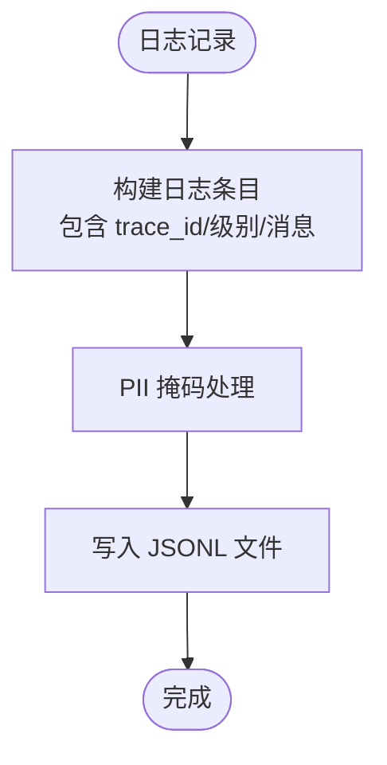
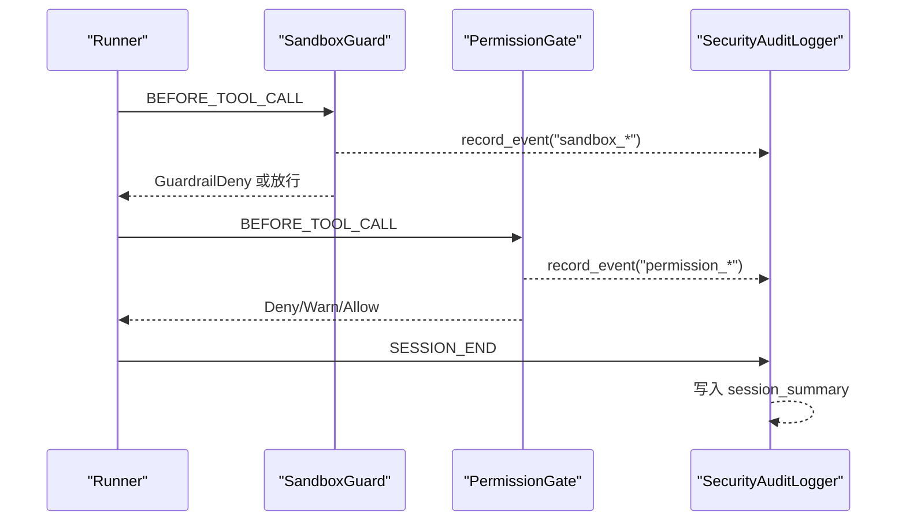
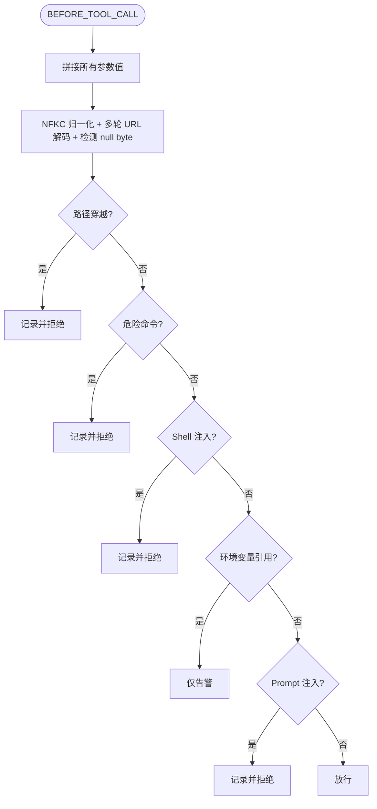
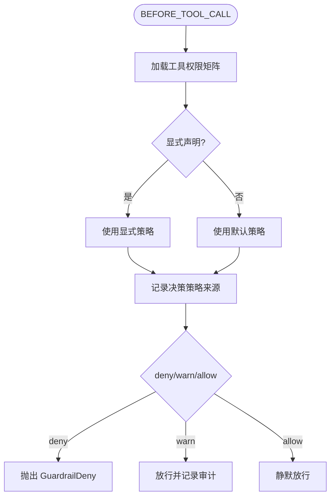
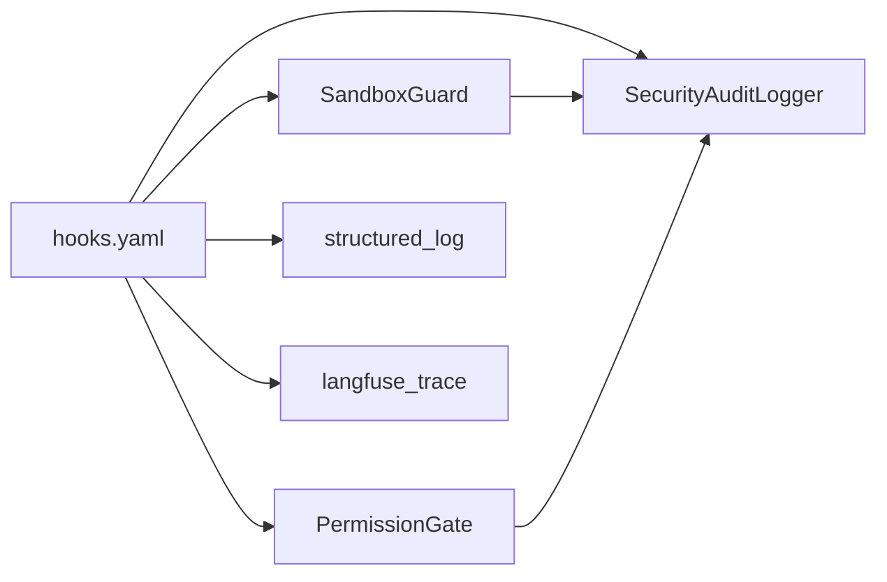

# 合规要求

<cite>
**本文引用的文件**
- [DESIGN.md](file://DESIGN.md)
- [config.yaml.example](file://config.yaml.example)
- [sandbox-docker-compose.yaml](file://sandbox-docker-compose.yaml)
- [shared_hooks/hooks.yaml](file://shared_hooks/hooks.yaml)
- [shared_hooks/audit_logger.py](file://shared_hooks/audit_logger.py)
- [shared_hooks/sandbox_guard.py](file://shared_hooks/sandbox_guard.py)
- [shared_hooks/permission_gate.py](file://shared_hooks/permission_gate.py)
- [xiaopaw/observability/pii_mask.py](file://xiaopaw/observability/pii_mask.py)
- [xiaopaw/observability/logging_config.py](file://xiaopaw/observability/logging_config.py)
- [xiaopaw/observability/security.py](file://xiaopaw/observability/security.py)
- [tests/e2e/test_e2e_14_credential_isolation.py](file://tests/e2e/test_e2e_14_credential_isolation.py)
- [tests/e2e/test_e2e_15_audit_deny.py](file://tests/e2e/test_e2e_15_audit_deny.py)
- [tests/fixtures/security_policy_samples.py](file://tests/fixtures/security_policy_samples.py)
- [DEEPSEEK_CONFIG.md](file://DEEPSEEK_CONFIG.md)
</cite>

## 目录
1. [简介](#简介)
2. [项目结构](#项目结构)
3. [核心组件](#核心组件)
4. [架构总览](#架构总览)
5. [详细组件分析](#详细组件分析)
6. [依赖分析](#依赖分析)
7. [性能考虑](#性能考虑)
8. [故障排查指南](#故障排查指南)
9. [结论](#结论)
10. [附录](#附录)

## 简介
本文件面向 XiaoPaw v2 的合规要求，聚焦数据保护、隐私合规与安全标准的实现与验证。内容覆盖：
- PII 脱敏机制与日志落盘策略
- 数据本地化披露与日志留存
- 数据主体权利保障与数据生命周期管理
- 容器非 root 运行、凭证轮换与安全审计
- 与相关法规（如《个人信息保护法》PIPL）的符合性要点与证明材料
- 访问控制、安全监控与合规检查清单及验证方法

## 项目结构
XiaoPaw v2 在 v3 阶段引入“Hook 框架 + shared_hooks 加固层”，将观测、可靠性与安全策略以零侵入方式集成到业务流程中。合规相关的实现主要分布在以下模块：
- 观测与日志：结构化日志、PII 脱敏、安全审计日志
- 安全策略：输入消毒（SandboxGuard）、工具权限门禁（PermissionGate）、审计日志（SecurityAuditLogger）
- 配置与部署：配置模板、沙箱 compose、凭证轮换与生产安全基线
- 测试：端到端安全场景验证（凭证隔离、审计日志记录）

**图表来源**
- [shared_hooks/hooks.yaml:1-73](file://shared_hooks/hooks.yaml#L1-L73)
- [shared_hooks/audit_logger.py:1-90](file://shared_hooks/audit_logger.py#L1-L90)
- [shared_hooks/sandbox_guard.py:1-168](file://shared_hooks/sandbox_guard.py#L1-L168)
- [shared_hooks/permission_gate.py:1-107](file://shared_hooks/permission_gate.py#L1-L107)
- [xiaopaw/observability/logging_config.py:1-61](file://xiaopaw/observability/logging_config.py#L1-L61)
- [xiaopaw/observability/pii_mask.py:1-18](file://xiaopaw/observability/pii_mask.py#L1-L18)
- [config.yaml.example:1-90](file://config.yaml.example#L1-L90)
- [sandbox-docker-compose.yaml:1-32](file://sandbox-docker-compose.yaml#L1-L32)
- [DESIGN.md:579-590](file://DESIGN.md#L579-L590)

**章节来源**
- [DESIGN.md:579-590](file://DESIGN.md#L579-L590)
- [DESIGN.md:281-429](file://DESIGN.md#L281-L429)
- [shared_hooks/hooks.yaml:1-73](file://shared_hooks/hooks.yaml#L1-L73)

## 核心组件
- PII 脱敏与日志落盘
  - 在结构化日志输出前对手机号、邮箱、身份证等敏感信息进行掩码处理，确保日志落盘不泄露个人敏感信息。
  - 参考实现：[结构化日志格式化器:15-38](file://xiaopaw/observability/logging_config.py#L15-L38)，[PII 掩码规则:7-17](file://xiaopaw/observability/pii_mask.py#L7-L17)。

- 安全审计日志（JSONL）
  - 审计日志采用“追加只写”（append-only）格式，每行一条 JSON 事件，支持会话级摘要统计，便于事后关联分析与合规审计。
  - 参考实现：[审计日志类:30-90](file://shared_hooks/audit_logger.py#L30-L90)。

- 输入消毒与权限门禁
  - SandboxGuard 通过确定性正则对输入进行路径穿越、危险命令、Shell 注入、Prompt 注入等检测，命中即阻断。
  - PermissionGate 提供工具级权限三级控制（deny > warn > allow），默认策略严格，支持策略来源追踪。
  - 参考实现：[SandboxGuard:93-168](file://shared_hooks/sandbox_guard.py#L93-L168)，[PermissionGate:32-107](file://shared_hooks/permission_gate.py#L32-L107)。

- 配置与凭证管理
  - 配置模板提供日志、指标、速率限制、清理策略等合规相关参数；凭证轮换与最小权限注入通过环境变量与 Secret Manager 实施。
  - 参考实现：[配置模板:51-90](file://config.yaml.example#L51-L90)，[凭证轮换基线:579-590](file://DESIGN.md#L579-L590)。

**章节来源**
- [xiaopaw/observability/logging_config.py:15-38](file://xiaopaw/observability/logging_config.py#L15-L38)
- [xiaopaw/observability/pii_mask.py:7-17](file://xiaopaw/observability/pii_mask.py#L7-L17)
- [shared_hooks/audit_logger.py:30-90](file://shared_hooks/audit_logger.py#L30-L90)
- [shared_hooks/sandbox_guard.py:93-168](file://shared_hooks/sandbox_guard.py#L93-L168)
- [shared_hooks/permission_gate.py:32-107](file://shared_hooks/permission_gate.py#L32-L107)
- [config.yaml.example:51-90](file://config.yaml.example#L51-L90)
- [DESIGN.md:579-590](file://DESIGN.md#L579-L590)

## 架构总览
下图展示 XiaoPaw v2 在“策略层”（可阻断）与“观测层”（fire-and-forget）的合规与安全集成方式。策略层通过 HookLoader 以 hooks.yaml 声明式配置，保证审计日志前置、输入消毒优先、权限门禁次之，并在会话结束时输出审计摘要。

**图表来源**
- [shared_hooks/hooks.yaml:27-73](file://shared_hooks/hooks.yaml#L27-L73)
- [shared_hooks/audit_logger.py:30-90](file://shared_hooks/audit_logger.py#L30-L90)
- [shared_hooks/sandbox_guard.py:93-168](file://shared_hooks/sandbox_guard.py#L93-L168)
- [shared_hooks/permission_gate.py:32-107](file://shared_hooks/permission_gate.py#L32-L107)

## 详细组件分析

### PII 脱敏与日志落盘
- 落盘前脱敏：结构化日志格式化器在构造 JSON 条目时调用 PII 掩码函数，对手机号、邮箱、身份证等进行规则化替换，避免敏感信息进入日志文件。
- 日志格式：同时包含时间戳、级别、trace_id、消息体与异常信息，便于审计与定位。
- 参考实现路径：
  - [结构化日志格式化器:15-38](file://xiaopaw/observability/logging_config.py#L15-L38)
  - [PII 掩码规则:7-17](file://xiaopaw/observability/pii_mask.py#L7-L17)

**图表来源**
- [xiaopaw/observability/logging_config.py:15-38](file://xiaopaw/observability/logging_config.py#L15-L38)
- [xiaopaw/observability/pii_mask.py:14-17](file://xiaopaw/observability/pii_mask.py#L14-L17)

**章节来源**
- [xiaopaw/observability/logging_config.py:15-38](file://xiaopaw/observability/logging_config.py#L15-L38)
- [xiaopaw/observability/pii_mask.py:7-17](file://xiaopaw/observability/pii_mask.py#L7-L17)

### 安全审计日志（JSONL）
- 追加只写：每条安全事件写入一行 JSON，永不修改或删除，支持外部 SIEM 直接消费。
- 会话摘要：在 SESSION_END 时输出 session_summary，聚合各类事件数量，便于宏观巡检。
- 可观测指标：提供 total_security_events 与按类型统计，辅助运营与安全部门分析。
- 参考实现路径：
  - [审计日志类:30-90](file://shared_hooks/audit_logger.py#L30-L90)

**图表来源**
- [shared_hooks/sandbox_guard.py:147-158](file://shared_hooks/sandbox_guard.py#L147-L158)
- [shared_hooks/permission_gate.py:77-93](file://shared_hooks/permission_gate.py#L77-L93)
- [shared_hooks/audit_logger.py:50-70](file://shared_hooks/audit_logger.py#L50-L70)

**章节来源**
- [shared_hooks/audit_logger.py:30-90](file://shared_hooks/audit_logger.py#L30-L90)

### 输入消毒（SandboxGuard）
- 确定性检测：通过 NFKC 归一化 + 多轮 URL 解码 + null byte 拦截，再以硬编码正则检测路径穿越、危险命令、Shell 注入、Prompt 注入。
- 豁免策略：对沙箱原生工具（命名含 sandbox_/mcp_）的 Shell 组合给予合理豁免。
- 参考实现路径：
  - [输入预处理与正则集:65-59](file://shared_hooks/sandbox_guard.py#L65-L59)
  - [BEFORE_TOOL_CALL 检测与记录:109-146](file://shared_hooks/sandbox_guard.py#L109-L146)

**图表来源**
- [shared_hooks/sandbox_guard.py:65-146](file://shared_hooks/sandbox_guard.py#L65-L146)

**章节来源**
- [shared_hooks/sandbox_guard.py:93-168](file://shared_hooks/sandbox_guard.py#L93-L168)

### 工具权限门禁（PermissionGate）
- 三级控制：deny（直接拦截）、warn（放行并记录）、allow（静默放行）。
- 默认策略：default 应设为 warn 或 deny，避免新工具上线时默认放行。
- 策略来源：显式声明与默认策略在审计日志中标注，便于事后排查。
- 参考实现路径：
  - [权限矩阵加载与决策:42-75](file://shared_hooks/permission_gate.py#L42-L75)
  - [deny/warn/allow 分支与审计记录:77-93](file://shared_hooks/permission_gate.py#L77-L93)

**图表来源**
- [shared_hooks/permission_gate.py:57-93](file://shared_hooks/permission_gate.py#L57-L93)

**章节来源**
- [shared_hooks/permission_gate.py:32-107](file://shared_hooks/permission_gate.py#L32-L107)

### 配置与凭证轮换
- 配置模板：提供日志、指标、速率限制、清理策略等参数，满足合规与运营需求。
- 凭证轮换：生产环境强制轮换（如每 90 天），结合 Secret Manager 注入，避免明文入库。
- 参考实现路径：
  - [配置模板（含日志/指标/清理/速率限制）:51-90](file://config.yaml.example#L51-L90)
  - [合规基线（PII 脱敏、数据本地化披露、日志留存、凭证轮换）:579-590](file://DESIGN.md#L579-L590)

**章节来源**
- [config.yaml.example:51-90](file://config.yaml.example#L51-L90)
- [DESIGN.md:579-590](file://DESIGN.md#L579-L590)

### 数据本地化披露与日志留存
- 数据本地化披露：对外部服务（如 Qwen API、百度千帆 API）的使用在 README 中明确说明，便于企业合规评估。
- 日志留存：会话 JSONL 180 天、trace 30 天、raw audit 30 天，清理服务按策略定期归档/删除。
- 参考实现路径：
  - [数据概览与生命周期:472-489](file://DESIGN.md#L472-L489)

**章节来源**
- [DESIGN.md:472-489](file://DESIGN.md#L472-L489)

### 容器非 root 运行与沙箱安全
- 容器非 root：通过 compose 配置 USER nobody，降低容器内权限风险。
- 沙箱安全：AIO-Sandbox 使用 seccomp:unconfined（开发环境）并配合路径越界校验与 mount 精确到会话目录，减少攻击面。
- 参考实现路径：
  - [沙箱 compose 配置:14-32](file://sandbox-docker-compose.yaml#L14-L32)
  - [信任边界与沙箱隔离:250-272](file://DESIGN.md#L250-L272)

**章节来源**
- [sandbox-docker-compose.yaml:14-32](file://sandbox-docker-compose.yaml#L14-L32)
- [DESIGN.md:250-272](file://DESIGN.md#L250-L272)

### 数据主体权利保障
- 导出与删除：提供数据导出与删除接口，满足 PIPL 对数据主体权利的要求。
- 参考实现路径：
  - [合规基线（数据主体权利）:579-590](file://DESIGN.md#L579-L590)

**章节来源**
- [DESIGN.md:579-590](file://DESIGN.md#L579-L590)

## 依赖分析
策略层通过 hooks.yaml 声明式配置，形成“审计前置、输入消毒优先、权限门禁次之”的执行顺序，确保即使发生拒绝，也能在观测层留下完整轨迹。

**图表来源**
- [shared_hooks/hooks.yaml:27-73](file://shared_hooks/hooks.yaml#L27-L73)

**章节来源**
- [shared_hooks/hooks.yaml:1-73](file://shared_hooks/hooks.yaml#L1-L73)

## 性能考虑
- 审计日志缓冲：内存中仅保留有限条违规记录，避免长时间会话导致内存膨胀。
- 速率限制：每用户每分钟 20 次，缓解 DoS 风险。
- ReplayCache：事件 ID 去重与 TTL，兼顾去重效果与内存占用。
- 参考实现路径：
  - [SandboxGuard 内存限制:102-107](file://shared_hooks/sandbox_guard.py#L102-L107)
  - [RateLimiter:11-26](file://xiaopaw/observability/security.py#L11-L26)
  - [ReplayCache:47-72](file://xiaopaw/observability/security.py#L47-L72)

**章节来源**
- [shared_hooks/sandbox_guard.py:102-107](file://shared_hooks/sandbox_guard.py#L102-L107)
- [xiaopaw/observability/security.py:11-26](file://xiaopaw/observability/security.py#L11-L26)
- [xiaopaw/observability/security.py:47-72](file://xiaopaw/observability/security.py#L47-L72)

## 故障排查指南
- 审计日志未写入
  - 检查 SECURITY_AUDIT_FILE 环境变量或构造参数是否配置；确认文件路径可写且未被外部系统删除。
  - 参考实现：[审计日志写入:72-80](file://shared_hooks/audit_logger.py#L72-L80)

- SandboxGuard 误拦截
  - 检查输入是否包含路径穿越、危险命令或 Shell 注入特征；确认沙箱原生工具命名是否包含 sandbox_/mcp_ 豁免前缀。
  - 参考实现：[检测与记录:120-146](file://shared_hooks/sandbox_guard.py#L120-L146)

- PermissionGate 默认策略宽松
  - 确认 security.yaml 中 default 是否为 deny 或 warn；检查策略来源标注以便溯源。
  - 参考实现：[默认策略与来源标注:66-75](file://shared_hooks/permission_gate.py#L66-L75)

- 凭证泄露风险
  - 确认未将明文凭证提交至仓库；生产通过 Secret Manager 注入；定期轮换。
  - 参考实现：[合规基线与凭证轮换:579-590](file://DESIGN.md#L579-L590)

**章节来源**
- [shared_hooks/audit_logger.py:72-80](file://shared_hooks/audit_logger.py#L72-L80)
- [shared_hooks/sandbox_guard.py:120-146](file://shared_hooks/sandbox_guard.py#L120-L146)
- [shared_hooks/permission_gate.py:66-75](file://shared_hooks/permission_gate.py#L66-L75)
- [DESIGN.md:579-590](file://DESIGN.md#L579-L590)

## 结论
XiaoPaw v2 通过“Hook 框架 + shared_hooks 加固层”实现了可观测、可靠、安全的合规基线。PII 脱敏、审计日志、输入消毒与权限门禁共同构成数据保护与隐私合规的核心防线；配置模板与凭证轮换基线确保部署与运维层面的合规落地；日志留存与数据主体权利接口满足生命周期管理与法律要求。结合端到端测试与持续集成门禁，系统具备可验证、可持续改进的合规能力。

## 附录

### 合规检查清单与验证方法
- PII 脱敏
  - 检查点：日志落盘前是否进行手机号/邮箱/身份证掩码；是否存在明文敏感信息。
  - 验证方法：运行 PII 掩码验证脚本；查看日志文件样例。
  - 参考实现：[PII 掩码规则:7-17](file://xiaopaw/observability/pii_mask.py#L7-L17)，[结构化日志格式化器:15-38](file://xiaopaw/observability/logging_config.py#L15-L38)

- 安全审计日志
  - 检查点：JSONL 是否为追加只写；会话结束是否输出 session_summary。
  - 验证方法：发送触发拦截的消息，检查审计文件是否存在 path_traversal/permission_deny 等事件。
  - 参考实现：[审计日志类:30-90](file://shared_hooks/audit_logger.py#L30-L90)

- 输入消毒与权限门禁
  - 检查点：SandboxGuard 是否在 BEFORE_TOOL_CALL 优先执行；PermissionGate 默认策略是否为 deny/warn。
  - 验证方法：端到端测试覆盖凭证探测、环境变量泄漏尝试、跨用户隔离等场景。
  - 参考实现：[SandboxGuard:93-168](file://shared_hooks/sandbox_guard.py#L93-L168)，[PermissionGate:32-107](file://shared_hooks/permission_gate.py#L32-L107)

- 凭证轮换与最小权限
  - 检查点：生产环境是否通过 Secret Manager 注入；是否定期轮换；是否避免明文入库。
  - 验证方法：检查配置与部署文档；审查轮换记录与权限注入流程。
  - 参考实现：[合规基线:579-590](file://DESIGN.md#L579-L590)

- 数据本地化披露与日志留存
  - 检查点：README 是否披露外部服务使用；日志留存策略是否符合生命周期要求。
  - 验证方法：核对数据概览与清理策略。
  - 参考实现：[数据概览与生命周期:472-489](file://DESIGN.md#L472-L489)

- 容器非 root 与沙箱安全
  - 检查点：compose 是否使用 USER nobody；沙箱 mount 是否精确到会话目录。
  - 验证方法：查看 compose 配置与部署文档。
  - 参考实现：[沙箱 compose:14-32](file://sandbox-docker-compose.yaml#L14-L32)，[信任边界:250-272](file://DESIGN.md#L250-L272)

- 数据主体权利
  - 检查点：是否提供导出/删除接口；流程是否可追溯。
  - 验证方法：对照合规基线文档。
  - 参考实现：[合规基线:579-590](file://DESIGN.md#L579-L590)

**章节来源**
- [xiaopaw/observability/pii_mask.py:7-17](file://xiaopaw/observability/pii_mask.py#L7-L17)
- [xiaopaw/observability/logging_config.py:15-38](file://xiaopaw/observability/logging_config.py#L15-L38)
- [shared_hooks/audit_logger.py:30-90](file://shared_hooks/audit_logger.py#L30-L90)
- [shared_hooks/sandbox_guard.py:93-168](file://shared_hooks/sandbox_guard.py#L93-L168)
- [shared_hooks/permission_gate.py:32-107](file://shared_hooks/permission_gate.py#L32-L107)
- [DESIGN.md:472-489](file://DESIGN.md#L472-L489)
- [sandbox-docker-compose.yaml:14-32](file://sandbox-docker-compose.yaml#L14-L32)

### 与 PIPL 的符合性要点与证明材料
- 数据最小化与目的限制：通过工具白名单与 MCP 限制，最小化外部调用面。
- 透明度与告知义务：在 README 中披露外部服务使用，满足数据本地化披露要求。
- 数据主体权利：提供导出/删除接口，满足访问权与删除权。
- 安全与保密：通过非 root 容器、沙箱隔离、凭证轮换与审计日志，落实技术与组织措施。
- 证据材料：审计日志、端到端测试结果、配置模板与合规基线文档。

**章节来源**
- [DESIGN.md:579-590](file://DESIGN.md#L579-L590)
- [tests/e2e/test_e2e_14_credential_isolation.py:1-82](file://tests/e2e/test_e2e_14_credential_isolation.py#L1-L82)
- [tests/e2e/test_e2e_15_audit_deny.py:1-94](file://tests/e2e/test_e2e_15_audit_deny.py#L1-L94)