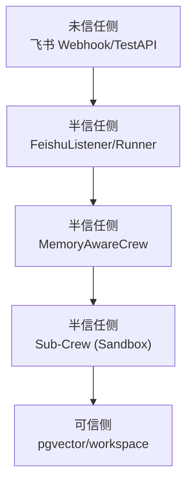
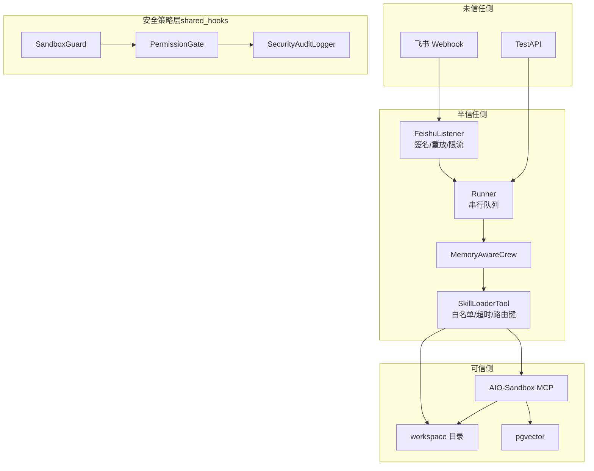
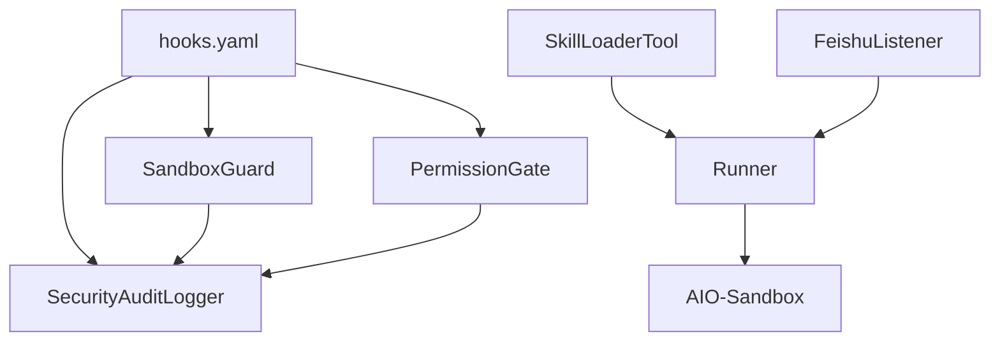

# 威胁模型分析

<cite>
**本文引用的文件**
- [威胁清单（SSOT）](file://docs/ssot/threats.md)
- [设计总纲（DESIGN.md）](file://DESIGN.md)
- [Hook 框架配置 hooks.yaml](file://shared_hooks/hooks.yaml)
- [沙箱守卫 sandbox_guard.py](file://shared_hooks/sandbox_guard.py)
- [权限网关 permission_gate.py](file://shared_hooks/permission_gate.py)
- [安全审计日志 audit_logger.py](file://shared_hooks/audit_logger.py)
- [飞书监听器 listener.py](file://xiaopaw/feishu/listener.py)
- [技能加载器 skill_loader.py](file://xiaopaw/tools/skill_loader.py)
- [端口清单（SSOT）](file://docs/ssot/ports.md)
- [模块设计（02-modules.md）](file://docs/02-modules.md)
- [API 设计（04-api.md）](file://docs/04-api.md)
- [测试设计（10-testing.md）](file://docs/10-testing.md)
- [Hook 加固设计（12-hook-hardening.md）](file://docs/12-hook-hardening.md)
- [测试夹具：沙箱守卫输入](file://tests/fixtures/hook_tool_inputs.py)
</cite>

## 目录
1. [简介](#简介)
2. [项目结构](#项目结构)
3. [核心组件](#核心组件)
4. [架构总览](#架构总览)
5. [详细组件分析](#详细组件分析)
6. [依赖分析](#依赖分析)
7. [性能考虑](#性能考虑)
8. [故障排查指南](#故障排查指南)
9. [结论](#结论)
10. [附录](#附录)

## 简介
本文件面向 XiaoPaw v2 的威胁模型分析，聚焦七种主要威胁（T1–T7）的攻击向量、影响范围与发生概率，结合 STRIDE 分类进行归类，并给出来自代码库的实际威胁示例与对应的防御措施。文档还总结了威胁建模的方法论与评估标准，解释威胁缓解策略的设计原理与实施细节，覆盖 Prompt Injection、Memory Poisoning、Webhook 伪造、凭证泄露、路径遍历、YAML 注入与 DoS 等威胁场景。

## 项目结构
XiaoPaw v2 采用“三层安全”与“Hook 加固”的设计思路，围绕飞书入站消息、Runner 串行队列、Sub-Crew 沙箱执行与可信存储（pgvector/workspace）构建信任边界。核心模块包括：
- 入站与速率限制：FeishuListener（签名 + 重放缓存 + 速率限制）
- 业务执行：Runner（按 routing_key 串行队列）
- 安全策略：shared_hooks（沙箱守卫、权限网关、审计日志、成本围栏、循环检测、重试追踪）
- 技能与沙箱：SkillLoaderTool（MCP 工具白名单 + 超时 + 路由键强制）
- 存储与隔离：workspace 精确挂载 + 路径越界校验 + pgvector RLS（可选）

图表来源
- [设计总纲（信任边界）:250-278](file://DESIGN.md#L250-L278)

章节来源
- [设计总纲（信任边界）:250-278](file://DESIGN.md#L250-L278)
- [模块设计（02-modules.md）:738-740](file://docs/02-modules.md#L738-L740)

## 核心组件
- 沙箱守卫（SandboxGuard）：在 BEFORE_TOOL_CALL 阶段对输入进行确定性消毒，阻断路径穿越、危险命令、Shell 注入与 Prompt 注入。
- 权限网关（PermissionGate）：基于 YAML 的三级权限模型（deny > warn > allow），默认拒绝，确保最小授权。
- 安全审计日志（SecurityAuditLogger）：append-only JSONL 审计，集中记录安全事件并在会话结束写摘要。
- FeishuListener：飞书 WebSocket 事件监听，负责验签、重放缓存与速率限制。
- SkillLoaderTool：技能清单与指令加载，强制 routing_key、MCP 工具白名单、超时与路径越界校验。
- 端口与网络：AIO-Sandbox MCP 仅容器内网络暴露，禁止宿主端口映射。

章节来源
- [Hook 框架配置 hooks.yaml:1-73](file://shared_hooks/hooks.yaml#L1-L73)
- [沙箱守卫 sandbox_guard.py:1-168](file://shared_hooks/sandbox_guard.py#L1-L168)
- [权限网关 permission_gate.py:1-107](file://shared_hooks/permission_gate.py#L1-L107)
- [安全审计日志 audit_logger.py:1-90](file://shared_hooks/audit_logger.py#L1-L90)
- [飞书监听器 listener.py:1-148](file://xiaopaw/feishu/listener.py#L1-L148)
- [技能加载器 skill_loader.py:1-535](file://xiaopaw/tools/skill_loader.py#L1-L535)
- [端口清单（SSOT）:1-122](file://docs/ssot/ports.md#L1-L122)

## 架构总览
下图展示威胁与防御层在系统中的分布与交互：

图表来源
- [设计总纲（信任边界）:250-278](file://DESIGN.md#L250-L278)
- [Hook 框架配置 hooks.yaml:1-73](file://shared_hooks/hooks.yaml#L1-L73)

章节来源
- [设计总纲（信任边界）:250-278](file://DESIGN.md#L250-L278)
- [Hook 框架配置 hooks.yaml:1-73](file://shared_hooks/hooks.yaml#L1-L73)

## 详细组件分析

### 威胁 T1：Prompt Injection → sandbox 逃逸（STRIDE：Elevation of Privilege）
- 攻击向量
  - 通过 LLM 上下文注入，诱导 Agent 使用受控工具并尝试逃逸沙箱
  - 即使存在 MCP 工具白名单，仍可能利用合法工具的 shell/文件操作能力
- 影响范围
  - 可能读取/写入 /workspace/sessions/{sid}/ 与 .config，或通过沙箱执行任意命令
- 发生概率
  - 高（业界研究表明在有上下文隔离时仍可达 30–60% 成功率）
- 残余风险
  - 高（v2.1 承认从 MEDIUM 提升至 HIGH）
- 防御措施
  - MCP 工具白名单 + sandbox seccomp
  - shared_hooks 中 SandboxGuard 在 BEFORE_TOOL_CALL 阶段阻断 Prompt 注入与 Shell 注入
  - 运维层：审计日志 + trace 覆盖率检查
- 代码示例与路径
  - 沙箱守卫正则检测 Prompt 注入与 Shell 注入，命中即 GuardrailDeny
  - 测试夹具包含多种 Prompt 注入样例
- STRIDE 分类
  - Elevation of Privilege（提升权限）

章节来源
- [威胁清单（SSOT）:87-95](file://docs/ssot/threats.md#L87-L95)
- [沙箱守卫 sandbox_guard.py:51-58](file://shared_hooks/sandbox_guard.py#L51-L58)
- [沙箱守卫 sandbox_guard.py:142-145](file://shared_hooks/sandbox_guard.py#L142-L145)
- [测试夹具：沙箱守卫输入:25-30](file://tests/fixtures/hook_tool_inputs.py#L25-L30)

### 威胁 T2：Memory Poisoning（STRIDE：Tampering）
- 攻击向量
  - 在 memory-save 中注入恶意内容（如覆盖指令、忽略指令、Shell 命令）
- 影响范围
  - 可能污染 Agent 记忆，导致后续推理与工具调用被误导
- 发生概率
  - 中（BLOCKED_PATTERNS 可被分段绕过）
- 残余风险
  - 中高（memory-governance 作为 Skill 依赖 Agent 调用，存在循环依赖）
- 防御措施
  - memory-save BLOCKED_PATTERNS 过滤 + 长度限制
  - memory-governance 定期审计与清理
- 代码示例与路径
  - 测试用例覆盖多种注入模式并断言被拦截
- STRIDE 分类
  - Tampering（篡改）

章节来源
- [威胁清单（SSOT）:96-104](file://docs/ssot/threats.md#L96-L104)
- [测试设计（10-testing.md）:879-918](file://docs/10-testing.md#L879-L918)

### 威胁 T3：飞书 Webhook 伪造（STRIDE：Spoofing/Repudiation）
- 攻击向量
  - 伪造 event_id 或重放历史事件，冒充飞书消息
- 影响范围
  - 可能重复触发业务逻辑，造成重复处理或滥用
- 发生概率
  - 低（WS 模式下飞书服务端验签；应用层 ReplayCache 防重放）
- 残余风险
  - 低（5 分钟 TTL 覆盖大多数场景；进程重启时缓存丢失）
- 防御措施
  - 飞书 SDK 验签 + 应用层 ReplayCache（LRU+TTL）
  - FeishuListener 速率限制（每用户 20/min）
  - 审计日志记录 trace_id 与 raw.jsonl 追踪
- 代码示例与路径
  - Listener 中 ReplayCache 与 RateLimiter 的使用
  - 测试覆盖签名缺失、签名错误与重放丢弃
- STRIDE 分类
  - Spoofing（伪造）
  - Repudiation（抵赖）

章节来源
- [威胁清单（SSOT）:105-109](file://docs/ssot/threats.md#L105-L109)
- [飞书监听器 listener.py:81-106](file://xiaopaw/feishu/listener.py#L81-L106)
- [API 设计（04-api.md）:121-158](file://docs/04-api.md#L121-L158)
- [测试设计（10-testing.md）:787-839](file://docs/10-testing.md#L787-L839)

### 威胁 T4：凭证泄露（STRIDE：Information Disclosure）
- 攻击向量
  - .env 或 Docker Secrets 泄露导致密钥外泄
- 影响范围
  - 可能导致飞书 App Secret、数据库凭据、第三方 API Key 失窃
- 发生概率
  - 中
- 残余风险
  - 低（Phase 0 强制轮换 + Docker Secrets + 强密码校验）
- 防御措施
  - Phase 0 强制轮换 + docker secrets + is_weak_credential 校验
  - 配置安全校验与凭证轮换 runbook
- STRIDE 分类
  - Information Disclosure（信息泄露）

章节来源
- [威胁清单（SSOT）](file://docs/ssot/threats.md#L14)
- [设计总纲（凭证安全）:649-667](file://DESIGN.md#L649-L667)

### 威胁 T5：Sub-Crew 路径遍历（STRIDE：Elevation of Privilege/Information Disclosure）
- 攻击向量
  - 通过 skill 路径或脚本路径穿越，读取/写入宿主机敏感文件
- 影响范围
  - 可能读取 .config 或写入 workspace/sessions 外部路径
- 发生概率
  - 中
- 残余风险
  - 低（workspace 精确挂载到 {sid}/ + Path.resolve() 越界校验）
- 防御措施
  - workspace mount 精确到 {sid}/
  - Path.resolve() 越界校验
- 代码示例与路径
  - 技能加载器对路径进行白名单与越界校验
- STRIDE 分类
  - Elevation of Privilege（提升权限）
  - Information Disclosure（信息泄露）

章节来源
- [威胁清单（SSOT）](file://docs/ssot/threats.md#L16)
- [模块设计（02-modules.md）:703-723](file://docs/02-modules.md#L703-L723)
- [技能加载器 skill_loader.py:260-293](file://xiaopaw/tools/skill_loader.py#L260-L293)

### 威胁 T6：SKILL.md YAML 注入（STRIDE：Elevation of Privilege）
- 攻击向量
  - 通过 SKILL.md frontmatter 注入恶意脚本路径或 allowed-tools，绕过白名单
- 影响范围
  - 可能将不受控脚本加入 allowed-tools，扩大工具面
- 发生概率
  - 低（强制 yaml.safe_load + 路径白名单 + scripts 在 skill_dir 内）
- 残余风险
  - 低
- 防御措施
  - yaml.safe_load 强制 + 路径白名单 + scripts 越界校验
- 代码示例与路径
  - 模块设计中对 SKILL.md 加载安全的实现
- STRIDE 分类
  - Elevation of Privilege（提升权限）

章节来源
- [威胁清单（SSOT）](file://docs/ssot/threats.md#L17)
- [模块设计（02-modules.md）:703-723](file://docs/02-modules.md#L703-L723)

### 威胁 T7：DoS（消息洪水）（STRIDE：Denial of Service）
- 攻击向量
  - 大量消息冲击入站，导致系统资源耗尽
- 影响范围
  - 可能导致队列积压、内存占用上升、响应延迟
- 发生概率
  - 高
- 残余风险
  - 低（FeishuListener 入站速率限制：每用户 20/min）
- 防御措施
  - FeishuListener 速率限制（每用户 20/min）+ 静默丢弃
- 代码示例与路径
  - Listener 中速率限制逻辑
- STRIDE 分类
  - Denial of Service（拒绝服务）

章节来源
- [威胁清单（SSOT）](file://docs/ssot/threats.md#L18)
- [API 设计（04-api.md）:146-158](file://docs/04-api.md#L146-L158)
- [飞书监听器 listener.py:92-95](file://xiaopaw/feishu/listener.py#L92-L95)

### 威胁 T8–T11（补充）
- T8：Cron → Runner 注入（Tampering/Elevation of Privilege）
  - 防御：CronService dispatch 前 BLOCKED_PATTERNS；tasks.json 写入 schema 校验
- T9：MCP endpoint 暴露宿主机（Elevation of Privilege）
  - 防御：docker compose 强制 aio-sandbox 无 ports 节，仅 internal network
- T10：Cron Job payload 内容注入（Shell/Prompt）
  - 防御：Pydantic schema 校验 payload 字段；command 字段白名单
- T11：routing_key 伪造（Spoofing）
  - 防御：应用层三层强制 + 可选 pgvector RLS

章节来源
- [威胁清单（SSOT）:19-22](file://docs/ssot/threats.md#L19-L22)
- [端口清单（SSOT）:1-122](file://docs/ssot/ports.md#L1-L122)

## 依赖分析
- shared_hooks 的策略层通过 hooks.yaml 串联，AuditLogger 作为共享依赖注入到 SandboxGuard 与 PermissionGate，确保事件一致性与可审计性。
- SkillLoaderTool 依赖 SKILL.md frontmatter 的 allowed-tools 与 routing_key 校验，配合 Runner 的串行队列与沙箱隔离，降低跨会话/跨租户泄露风险。
- FeishuListener 依赖 ReplayCache 与 RateLimiter，形成入站安全闭环。

图表来源
- [Hook 框架配置 hooks.yaml:1-73](file://shared_hooks/hooks.yaml#L1-L73)
- [安全审计日志 audit_logger.py:30-90](file://shared_hooks/audit_logger.py#L30-L90)
- [沙箱守卫 sandbox_guard.py:93-168](file://shared_hooks/sandbox_guard.py#L93-L168)
- [权限网关 permission_gate.py:32-107](file://shared_hooks/permission_gate.py#L32-L107)
- [技能加载器 skill_loader.py:223-535](file://xiaopaw/tools/skill_loader.py#L223-L535)
- [飞书监听器 listener.py:21-148](file://xiaopaw/feishu/listener.py#L21-L148)

章节来源
- [Hook 框架配置 hooks.yaml:1-73](file://shared_hooks/hooks.yaml#L1-L73)
- [安全审计日志 audit_logger.py:30-90](file://shared_hooks/audit_logger.py#L30-L90)
- [沙箱守卫 sandbox_guard.py:93-168](file://shared_hooks/sandbox_guard.py#L93-L168)
- [权限网关 permission_gate.py:32-107](file://shared_hooks/permission_gate.py#L32-L107)
- [技能加载器 skill_loader.py:223-535](file://xiaopaw/tools/skill_loader.py#L223-L535)
- [飞书监听器 listener.py:21-148](file://xiaopaw/feishu/listener.py#L21-L148)

## 性能考虑
- 沙箱守卫的输入预处理（NFKC + 多轮 URL 解码）与正则匹配在 BEFORE_TOOL_CALL 阶段执行，短路求值减少无效计算。
- ReplayCache 与 RateLimiter 为进程级缓存，重启丢失但语义正常；跨重启/多节点建议使用 Redis。
- 速率限制与超时（如 Sub-Crew 5 分钟）在保障安全的同时避免资源耗尽。

## 故障排查指南
- Prompt Injection 成功
  - 现象：sandbox_execute_bash 异常调用模式
  - 处置：SRE kill 会话；安全工程师加强 backstory 约束
- 凭证泄露
  - 现象：.env 提交到 git/Git secrets 告警
  - 处置：运维 SRE 轮换；安全工程师审计泄露范围
- DoS
  - 现象：xiaopaw_rate_limited_total 突增
  - 处置：SRE 加黑名单；产品评估封号策略
- MCP 暴露
  - 现象：Nmap 扫描发现 8080 开放
  - 处置：SRE 立即关闭端口；架构师审计 compose

章节来源
- [威胁清单（SSOT）:123-131](file://docs/ssot/threats.md#L123-L131)

## 结论
XiaoPaw v2 通过“入站安全 + Hook 加固 + 沙箱隔离 + 可信存储”的纵深防御，有效缓解七种主要威胁。其中 T1（Prompt Injection）与 T2（Memory Poisoning）残余风险较高，需持续通过审计日志、trace 覆盖率与定期治理来降低影响。T3–T7 在现有防御下具备较低残余风险，建议维持并结合测试锚点持续验证。

## 附录

### 威胁建模方法论与评估标准
- 方法论
  - 识别信任边界与威胁来源（未信任/半信任/可信）
  - 基于 STRIDE 分类映射威胁
  - 评估可行性（低/中/高）、原始影响（低/中/高）、残余风险（低/中/高）
  - 以“确定性检测/最小权限/可观测”为设计原则
- 评估标准
  - 可行性：攻击者是否具备条件（SDK 验签、速率限制、白名单等）
  - 影响：对数据、功能、可用性的损害程度
  - 残余风险：在现有防御下的剩余暴露水平
  - 测试锚点：TC-P0–P2 的具体用例编号，确保可验证

章节来源
- [威胁清单（SSOT）:8-25](file://docs/ssot/threats.md#L8-L25)

### STRIDE 分类映射
- Spoofing（伪造）：T3、T11
- Tampering（篡改）：T2、T8
- Repudiation（抵赖）：T3（trace_id + raw.jsonl）
- Information Disclosure（信息泄露）：T4、T5
- Denial of Service（拒绝服务）：T7
- Elevation of Privilege（权限提升）：T1、T5、T6、T8、T9、T10

章节来源
- [威胁清单（SSOT）:28-38](file://docs/ssot/threats.md#L28-L38)