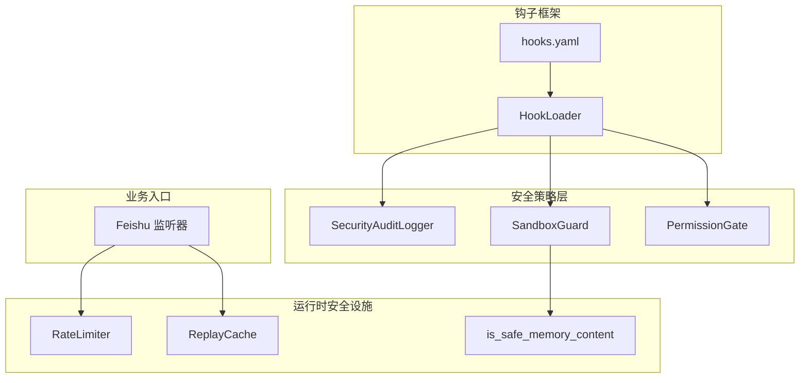
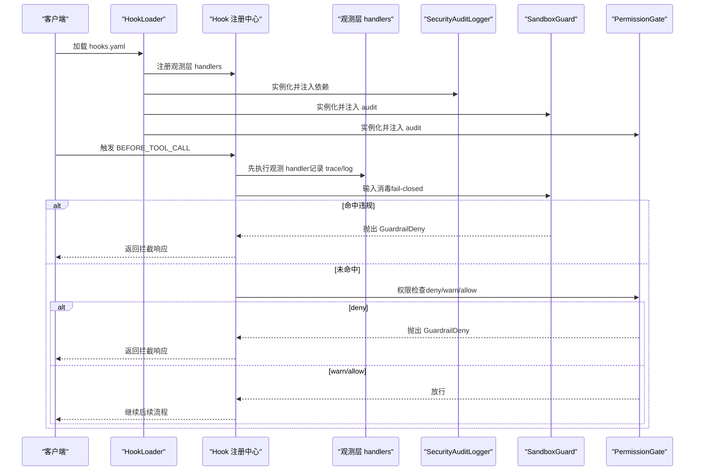
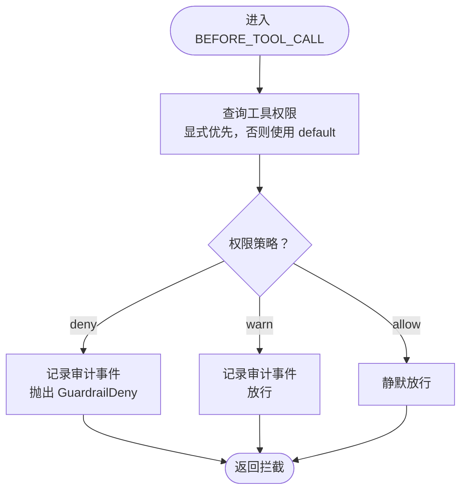
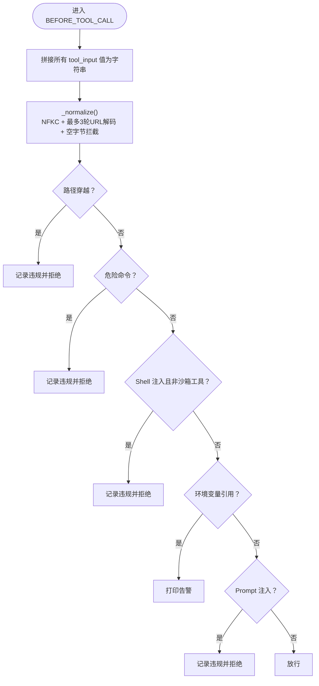
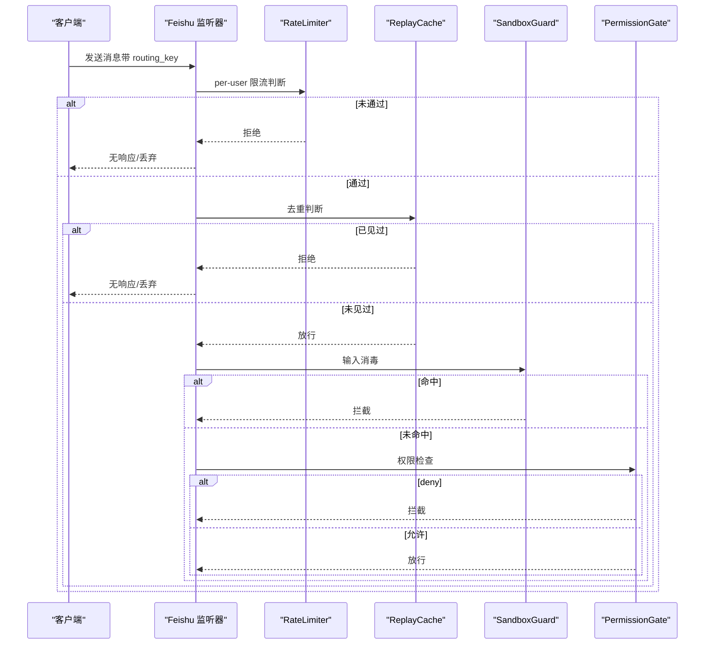
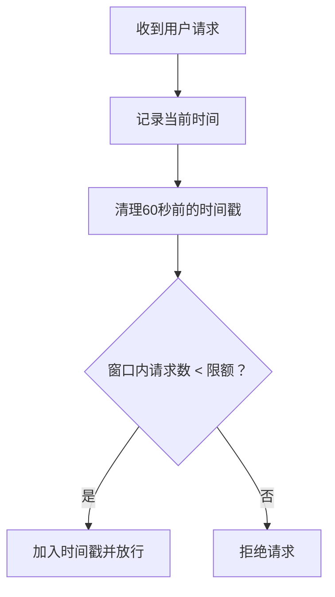
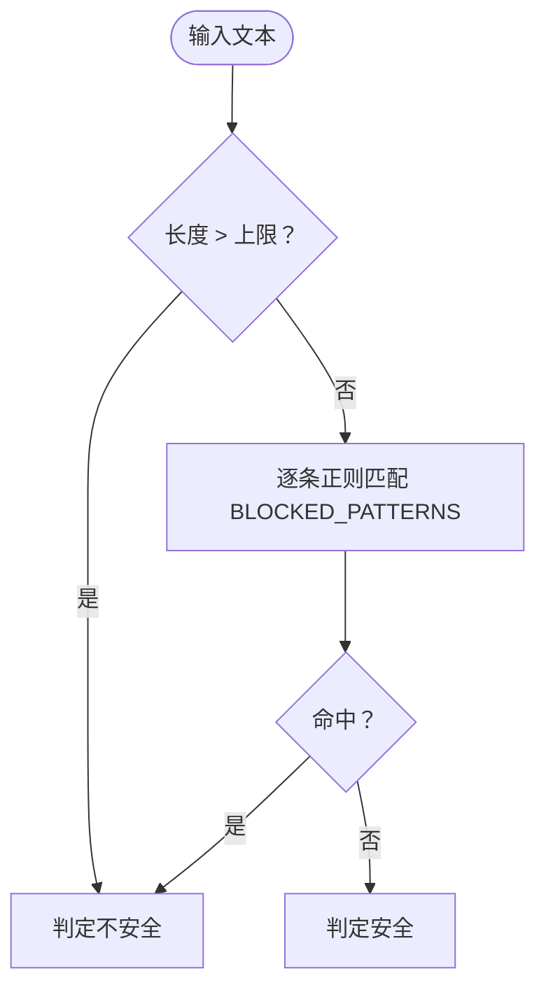
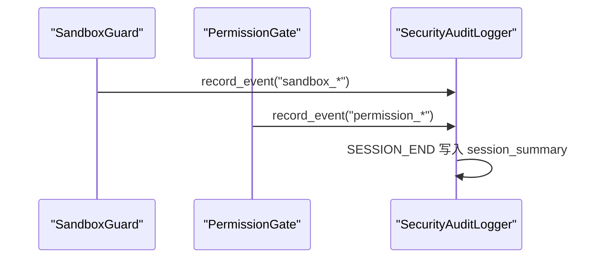
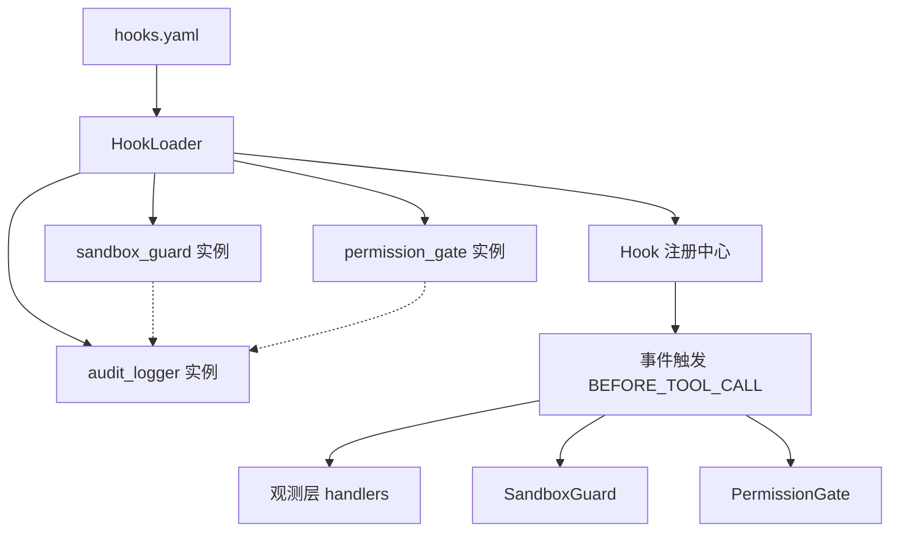

# 安全策略实施

<cite>
**本文引用的文件**   
- [safety.py](file://xiaopaw/config/safety.py)
- [sandbox_guard.py](file://shared_hooks/sandbox_guard.py)
- [permission_gate.py](file://shared_hooks/permission_gate.py)
- [audit_logger.py](file://shared_hooks/audit_logger.py)
- [security.py](file://xiaopaw/observability/security.py)
- [hooks.yaml](file://shared_hooks/hooks.yaml)
- [loader.py](file://xiaopaw/hook_framework/loader.py)
- [validator.py](file://xiaopaw/config/validator.py)
- [listener.py](file://xiaopaw/feishu/listener.py)
- [test_e2e_13_sandbox_guard.py](file://tests/e2e/test_e2e_13_sandbox_guard.py)
- [test_e2e_14_credential_isolation.py](file://tests/e2e/test_e2e_14_credential_isolation.py)
- [test_e2e_15_audit_deny.py](file://tests/e2e/test_e2e_15_audit_deny.py)
- [security_policy_samples.py](file://tests/fixtures/security_policy_samples.py)
- [02-modules.md](file://docs/02-modules.md)
- [12-hook-hardening.md](file://docs/12-hook-hardening.md)
</cite>

## 目录
1. [简介](#简介)
2. [项目结构](#项目结构)
3. [核心组件](#核心组件)
4. [架构总览](#架构总览)
5. [详细组件分析](#详细组件分析)
6. [依赖分析](#依赖分析)
7. [性能考虑](#性能考虑)
8. [故障排查指南](#故障排查指南)
9. [结论](#结论)
10. [附录](#附录)

## 简介
本文件面向 XiaoPaw v2 的安全策略实施，系统化阐述五层安全策略的设计与实现：MCP 工具白名单机制、路径遍历防护、凭证安全管理、入站速率限制、内存投毒过滤。文档结合真实代码与测试用例，解释各层技术实现、配置选项与运行时行为，并给出配置指南、调优建议以及策略间协同与优先级处理方式。同时覆盖输入消毒、权限控制、审计日志等核心安全机制。

## 项目结构
XiaoPaw v2 的安全能力主要分布在以下模块：
- 全局安全钩子层：hooks.yaml 声明策略顺序与依赖，HookLoader 负责解析与实例化，确保“观测层先于策略层”执行。
- 安全策略层：SandboxGuard（输入消毒）、PermissionGate（工具权限网关）、SecurityAuditLogger（审计日志）。
- 运行时安全设施：RateLimiter（入站速率限制）、ReplayCache（重放防护）、is_safe_memory_content（内存投毒过滤）。
- 配置与启动校验：validator.py（配置模型与字段校验）、safety.py（生产部署安全断言）。
- 入口与集成点：Feishu 监听器在业务入口处应用速率限制与去重。

图表来源
- [hooks.yaml:28-73](file://shared_hooks/hooks.yaml#L28-L73)
- [loader.py:37-65](file://xiaopaw/hook_framework/loader.py#L37-L65)
- [security.py:11-73](file://xiaopaw/observability/security.py#L11-L73)
- [listener.py:87-111](file://xiaopaw/feishu/listener.py#L87-L111)

章节来源
- [hooks.yaml:1-73](file://shared_hooks/hooks.yaml#L1-L73)
- [loader.py:1-246](file://xiaopaw/hook_framework/loader.py#L1-L246)
- [security.py:1-73](file://xiaopaw/observability/security.py#L1-L73)
- [listener.py:87-111](file://xiaopaw/feishu/listener.py#L87-L111)

## 核心组件
- 安全审计日志（SecurityAuditLogger）：以追加只写 JSONL 格式记录安全事件，支持会话级摘要，被多策略共享。
- 沙箱守卫（SandboxGuard）：确定性输入消毒，覆盖路径穿越、危险命令、Shell 注入、环境变量引用告警、Prompt 注入，fail-closed。
- 权限网关（PermissionGate）：基于工具名的白名单/黑名单/警告策略，默认 deny/warn，fail-closed。
- 入站速率限制（RateLimiter）：基于滑动窗口的 per-user 限流。
- 内存投毒过滤（is_safe_memory_content）：基于正则的确定性过滤，阻断系统指令类模式。

章节来源
- [audit_logger.py:30-90](file://shared_hooks/audit_logger.py#L30-L90)
- [sandbox_guard.py:93-168](file://shared_hooks/sandbox_guard.py#L93-L168)
- [permission_gate.py:32-107](file://shared_hooks/permission_gate.py#L32-L107)
- [security.py:11-45](file://xiaopaw/observability/security.py#L11-L45)

## 架构总览
XiaoPaw v2 的安全策略采用“钩子框架 + 多策略层”的分层设计。hooks.yaml 明确声明策略顺序与依赖，HookLoader 严格遵循“观测层先于策略层”的执行顺序，确保即使策略阻断，观测与追踪仍完整记录。SandboxGuard 与 PermissionGate 共享 SecurityAuditLogger，统一输出审计事件。

图表来源
- [hooks.yaml:27-49](file://shared_hooks/hooks.yaml#L27-L49)
- [loader.py:66-154](file://xiaopaw/hook_framework/loader.py#L66-L154)
- [audit_logger.py:30-90](file://shared_hooks/audit_logger.py#L30-L90)
- [sandbox_guard.py:93-146](file://shared_hooks/sandbox_guard.py#L93-L146)
- [permission_gate.py:32-94](file://shared_hooks/permission_gate.py#L32-L94)

## 详细组件分析

### 1) MCP 工具白名单机制（PermissionGate）
- 设计原则：默认 deny/warn，显式声明优先，未声明工具走默认策略，强调“最小授权 + 人工审核”。
- 实现要点：
  - 从 YAML 加载权限矩阵，支持 tools 映射与 default 策略。
  - BEFORE_TOOL_CALL 钩子中根据 tool_name 查询权限，记录决策并写审计日志（deny/warn）。
  - get_metrics 输出 allow/warn/deny 统计与被拒绝工具列表。
- 配置示例参考测试夹具中的默认 deny/allow/ask 策略样例。

图表来源
- [permission_gate.py:57-94](file://shared_hooks/permission_gate.py#L57-L94)
- [security_policy_samples.py:1-25](file://tests/fixtures/security_policy_samples.py#L1-L25)

章节来源
- [permission_gate.py:32-107](file://shared_hooks/permission_gate.py#L32-L107)
- [security_policy_samples.py:1-25](file://tests/fixtures/security_policy_samples.py#L1-L25)

### 2) 路径遍历防护（SandboxGuard）
- 设计原则：fail-closed，四组正则短路检测，输入预处理（NFKC + 多轮 URL 解码 + 空字节拦截）。
- 实现要点：
  - 路径穿越：匹配 ../ 或 ..\。
  - 危险命令：rm -rf、sudo、chmod 777、curl|sh、eval/exec、dd/mkfs/shred/doas/pkexec/su 等。
  - Shell 注入：; | && $( `，对 sandbox_/mcp_ 工具豁免。
  - Prompt 注入：[SYSTEM]/[INST]/[/INST]、<|system|> 等角色标签，以及忽略指令的中英文表达。
  - 环境变量引用：$VAR/${VAR} 仅告警，不拦截。
  - _normalize 防编码绕过，空字节直接拒绝。
- E2E 测试覆盖路径穿越、Shell 注入、Prompt 注入、URL 编码绕过、环境变量引用告警。

图表来源
- [sandbox_guard.py:109-146](file://shared_hooks/sandbox_guard.py#L109-L146)
- [test_e2e_13_sandbox_guard.py:27-79](file://tests/e2e/test_e2e_13_sandbox_guard.py#L27-L79)

章节来源
- [sandbox_guard.py:93-168](file://shared_hooks/sandbox_guard.py#L93-L168)
- [test_e2e_13_sandbox_guard.py:1-79](file://tests/e2e/test_e2e_13_sandbox_guard.py#L1-L79)

### 3) 凭证安全管理（生产部署安全断言 + 路由隔离）
- 生产部署安全断言（safety.py）：
  - 强制最小凭证长度、禁止弱口令（重复字符、常见占位符）。
  - 禁止生产开启测试 API 与非回环地址暴露。
- 路由隔离与凭证隐藏（E2E-14）：
  - routing_key 隔离不同用户会话，阻止跨用户访问。
  - 阻止 LLM 从上下文中泄漏 API Key、DashScope Key、App Secret 等敏感信息。
  - Prompt 注入尝试（忽略指令、system 标签）被拦截，防止敏感信息外泄。

图表来源
- [listener.py:87-111](file://xiaopaw/feishu/listener.py#L87-L111)
- [security.py:11-27](file://xiaopaw/observability/security.py#L11-L27)
- [sandbox_guard.py:93-146](file://shared_hooks/sandbox_guard.py#L93-L146)
- [permission_gate.py:32-94](file://shared_hooks/permission_gate.py#L32-L94)

章节来源
- [safety.py:27-48](file://xiaopaw/config/safety.py#L27-L48)
- [test_e2e_14_credential_isolation.py:1-82](file://tests/e2e/test_e2e_14_credential_isolation.py#L1-L82)

### 4) 入站速率限制（RateLimiter）
- 实现：基于滑动窗口的 per-user 限流，每用户每分钟窗口内记录时间戳，超过阈值拒绝。
- 配置：RateLimitConfig.per_user_per_minute（默认 20）。
- 集成：Feishu 监听器在接收消息前进行限流判断。

图表来源
- [security.py:11-27](file://xiaopaw/observability/security.py#L11-L27)
- [listener.py:93-95](file://xiaopaw/feishu/listener.py#L93-L95)

章节来源
- [security.py:11-27](file://xiaopaw/observability/security.py#L11-L27)
- [validator.py:73-75](file://xiaopaw/config/validator.py#L73-L75)
- [listener.py:93-95](file://xiaopaw/feishu/listener.py#L93-L95)

### 5) 内存投毒过滤（is_safe_memory_content）
- 设计：确定性正则过滤，阻断系统指令类模式（如忽略指令、system 标签、伪装 system 的代码块等）。
- 阈值：最大长度限制与 BLOCKED_PATTERNS 列表匹配。
- 文档修订：SandboxGuard 增强 Prompt 注入检测，与内存过滤形成双保险。

图表来源
- [security.py:38-44](file://xiaopaw/observability/security.py#L38-L44)
- [12-hook-hardening.md:1083-1097](file://docs/12-hook-hardening.md#L1083-L1097)

章节来源
- [security.py:29-44](file://xiaopaw/observability/security.py#L29-L44)
- [12-hook-hardening.md:1076-1097](file://docs/12-hook-hardening.md#L1076-L1097)

### 6) 审计日志与策略协同（SecurityAuditLogger）
- 设计：追加只写 JSONL，统一事件格式，支持会话级摘要；多策略共享同一实例，便于关联分析。
- 协作：SandboxGuard 与 PermissionGate 在触发 deny/warn 时写入审计事件；HookLoader 严格按声明顺序实例化，确保依赖注入正确（audit_logger 必须在 sandbox_guard/permission_gate 之前）。
- E2E：拦截事件可在审计文件中定位，系统被拦截后仍可继续正常交互。

图表来源
- [audit_logger.py:41-71](file://shared_hooks/audit_logger.py#L41-L71)
- [sandbox_guard.py:154-158](file://shared_hooks/sandbox_guard.py#L154-L158)
- [permission_gate.py:79-92](file://shared_hooks/permission_gate.py#L79-L92)
- [hooks.yaml:29-49](file://shared_hooks/hooks.yaml#L29-L49)
- [loader.py:98-99](file://xiaopaw/hook_framework/loader.py#L98-L99)

章节来源
- [audit_logger.py:30-90](file://shared_hooks/audit_logger.py#L30-L90)
- [test_e2e_15_audit_deny.py:33-94](file://tests/e2e/test_e2e_15_audit_deny.py#L33-L94)

## 依赖分析
- 策略依赖注入：hooks.yaml 中 strategies 段按声明顺序实例化，依赖通过 deps 注入；若依赖缺失，仅 fail-open（打印警告），但运行时 fail-closed 的安全 handler 会因 AttributeError 导致 GuardrailDeny，从而拒绝所有请求。
- 执行顺序：HookLoader 强制“观测层先于策略层”，确保 deny 时仍有完整观测记录。
- 配置与启动：validator.py 提供配置模型与字段校验；safety.py 在生产部署前进行安全断言。

图表来源
- [hooks.yaml:28-73](file://shared_hooks/hooks.yaml#L28-L73)
- [loader.py:88-154](file://xiaopaw/hook_framework/loader.py#L88-L154)
- [audit_logger.py:30-40](file://shared_hooks/audit_logger.py#L30-L40)

章节来源
- [loader.py:37-154](file://xiaopaw/hook_framework/loader.py#L37-L154)
- [hooks.yaml:28-73](file://shared_hooks/hooks.yaml#L28-L73)

## 性能考虑
- 输入消毒成本：SandboxGuard 的 _normalize 进行 NFKC 归一化与最多 3 轮 URL 解码，兼顾安全性与性能；正则匹配短路执行，避免无效计算。
- 内存占用：SandboxGuard 与 PermissionGate 使用固定长度队列记录近期决策/违规，避免长期会话内存膨胀。
- 限流与去重：RateLimiter 与 ReplayCache 使用轻量结构（字典/有序字典 + 锁），适合高并发场景。
- 建议：对高频工具调用可考虑缓存正则编译结果；对超长输入可设置更严格的长度阈值。

## 故障排查指南
- 拦截后系统无法继续：确认 deny 是否为 GuardrailDeny 导致 fail-closed；检查 hooks.yaml 中 audit_logger 是否在 sandbox_guard/permission_gate 之前声明。
- 审计日志为空：确认 SECURITY_AUDIT_FILE 环境变量或构造参数是否正确；检查文件写入权限。
- 权限策略误判：核对 security.yaml 的 tools 映射与 default 设置；通过 get_metrics 查看 deny/warn/allow 比例。
- 速率限制误伤：调整 RateLimitConfig.per_user_per_minute；检查用户标识是否稳定（open_id）。
- Prompt 注入绕过：确认 SandboxGuard 的 Prompt 注入正则是否覆盖最新变体；结合 is_safe_memory_content 二次过滤。

章节来源
- [test_e2e_15_audit_deny.py:70-94](file://tests/e2e/test_e2e_15_audit_deny.py#L70-L94)
- [audit_logger.py:30-40](file://shared_hooks/audit_logger.py#L30-L40)
- [permission_gate.py:95-107](file://shared_hooks/permission_gate.py#L95-L107)
- [validator.py:73-75](file://xiaopaw/config/validator.py#L73-L75)

## 结论
XiaoPaw v2 的安全策略通过“钩子框架 + 多策略层”的设计实现了端到端的安全闭环：输入消毒、权限控制、凭证保护、入站限流与内存投毒过滤相互配合，fail-closed 的策略在 fail-open 的风险面前提供了更强的鲁棒性。通过统一的审计日志与明确的执行顺序，系统在保障安全的同时保持可观测与可维护性。

## 附录

### 配置指南与调优建议
- 安全审计文件
  - 环境变量：SECURITY_AUDIT_FILE 指向审计文件路径。
  - 建议：与 SIEM 系统对接，定期轮转与备份。
- 权限策略
  - 默认策略：建议设为 deny 或 warn，显式声明工具权限。
  - 动态调整：通过 security.yaml 的 tools/default 字段快速变更。
- 速率限制
  - per_user_per_minute：根据业务峰值与 SLA 调整；对异常用户可临时降级。
- 内存投毒过滤
  - BLOCKED_PATTERNS：持续监控误杀率，必要时引入属性测试与阈值调优。
- SandboxGuard
  - 对沙箱工具的 Shell 注入豁免需谨慎评估；建议定期审计工具命名与输入来源。

章节来源
- [audit_logger.py:30-40](file://shared_hooks/audit_logger.py#L30-L40)
- [permission_gate.py:32-56](file://shared_hooks/permission_gate.py#L32-L56)
- [security.py:73-80](file://xiaopaw/observability/security.py#L73-L80)
- [validator.py:73-75](file://xiaopaw/config/validator.py#L73-L75)
- [12-hook-hardening.md:1083-1097](file://docs/12-hook-hardening.md#L1083-L1097)