# 安全设计

<cite>
**本文引用的文件**
- [docs/ssot/threats.md](file://docs/ssot/threats.md)
- [shared_hooks/audit_logger.py](file://shared_hooks/audit_logger.py)
- [shared_hooks/sandbox_guard.py](file://shared_hooks/sandbox_guard.py)
- [shared_hooks/permission_gate.py](file://shared_hooks/permission_gate.py)
- [shared_hooks/hooks.yaml](file://shared_hooks/hooks.yaml)
- [xiaopaw/feishu/listener.py](file://xiaopaw/feishu/listener.py)
- [xiaopaw/feishu/session_key.py](file://xiaopaw/feishu/session_key.py)
- [xiaopaw/observability/security.py](file://xiaopaw/observability/security.py)
- [xiaopaw/config/safety.py](file://xiaopaw/config/safety.py)
- [xiaopaw/tools/skill_loader.py](file://xiaopaw/tools/skill_loader.py)
- [xiaopaw/cron/service.py](file://xiaopaw/cron/service.py)
- [sandbox-docker-compose.yaml](file://sandbox-docker-compose.yaml)
- [docs/04-api.md](file://docs/04-api.md)
- [docs/01-architecture.md](file://docs/01-architecture.md)
- [tests/unit/shared_hooks/test_sandbox_guard.py](file://tests/unit/shared_hooks/test_sandbox_guard.py)
- [tests/fixtures/security_policy_samples.py](file://tests/fixtures/security_policy_samples.py)
- [docs/12-hook-hardening.md](file://docs/12-hook-hardening.md)
</cite>

## 目录
1. [简介](#简介)
2. [项目结构](#项目结构)
3. [核心组件](#核心组件)
4. [架构总览](#架构总览)
5. [详细组件分析](#详细组件分析)
6. [依赖分析](#依赖分析)
7. [性能考虑](#性能考虑)
8. [故障排除指南](#故障排除指南)
9. [结论](#结论)
10. [附录](#附录)

## 简介
本文件面向 XiaoPaw v2 的安全设计，系统化阐述威胁模型、安全策略、凭证管理与合规要求，详解七种主要威胁（T1–T7）及对应防御措施，说明三层信任边界的设计与落地，给出安全配置指南、最佳实践与常见问题的解决方案。文档同时结合实际代码库中的实现位置，提供可追溯的“章节来源”与“图表来源”。

## 项目结构
XiaoPaw v2 的安全相关模块分布于以下区域：
- 策略与钩子框架：shared_hooks（审计日志、沙箱守卫、权限网关、Langfuse 钩子等）
- 入口与路由：Feishu 监听器、路由键解析
- 安全工具：速率限制、重放缓存、内存内容过滤
- 工具与子舱：SkillLoaderTool（触发子舱）、MCP 白名单
- 配置与启动：生产安全断言
- 部署与网络：容器编排（仅内部网络、非 root 用户）

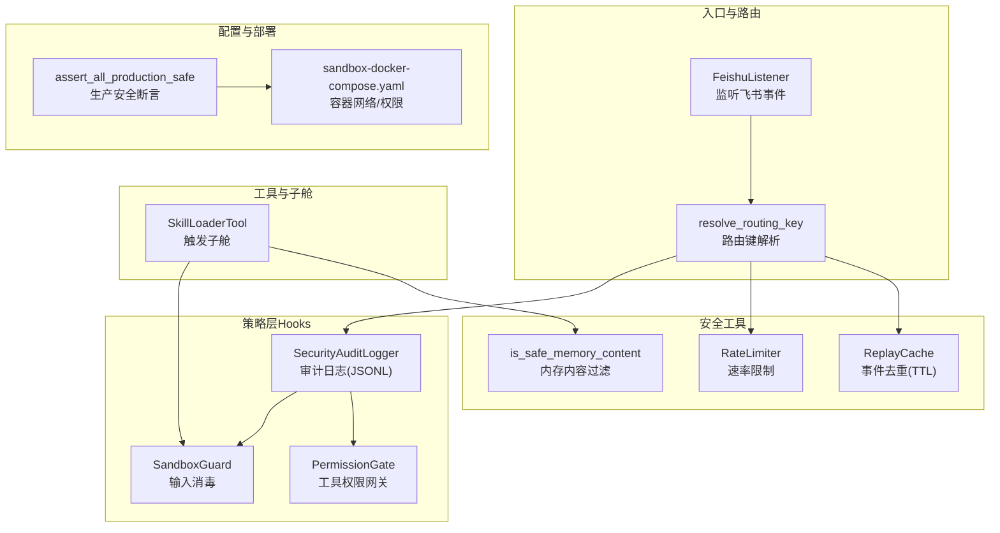

**图表来源**
- [xiaopaw/feishu/listener.py:21-148](file://xiaopaw/feishu/listener.py#L21-L148)
- [xiaopaw/feishu/session_key.py:6-21](file://xiaopaw/feishu/session_key.py#L6-L21)
- [shared_hooks/audit_logger.py:30-90](file://shared_hooks/audit_logger.py#L30-L90)
- [shared_hooks/sandbox_guard.py:93-168](file://shared_hooks/sandbox_guard.py#L93-L168)
- [shared_hooks/permission_gate.py:32-107](file://shared_hooks/permission_gate.py#L32-L107)
- [xiaopaw/observability/security.py:11-73](file://xiaopaw/observability/security.py#L11-L73)
- [xiaopaw/tools/skill_loader.py:223-535](file://xiaopaw/tools/skill_loader.py#L223-L535)
- [xiaopaw/config/safety.py:27-48](file://xiaopaw/config/safety.py#L27-L48)
- [sandbox-docker-compose.yaml:13-31](file://sandbox-docker-compose.yaml#L13-L31)

**章节来源**
- [docs/01-architecture.md:349-395](file://docs/01-architecture.md#L349-L395)

## 核心组件
- 安全审计日志（SecurityAuditLogger）：以追加只读 JSONL 记录安全事件，支持会话级摘要，被多个策略共享。
- 沙箱守卫（SandboxGuard）：在 BEFORE_TOOL_CALL 阶段进行确定性输入消毒，阻断路径穿越、危险命令、Shell 注入、Prompt 注入等。
- 权限网关（PermissionGate）：基于工具名的默认拒绝策略，支持显式 deny/warn/allow，拦截越权工具调用。
- Feishu 入站安全：速率限制、重放缓存、路由键校验与聊天白名单。
- 内存内容过滤：长度限制与敏感模式过滤，缓解内存投毒。
- 生产安全断言：禁止弱凭证、测试接口暴露等。
- 子舱与 MCP 白名单：隔离执行与工具暴露控制。

**章节来源**
- [shared_hooks/audit_logger.py:30-90](file://shared_hooks/audit_logger.py#L30-L90)
- [shared_hooks/sandbox_guard.py:93-168](file://shared_hooks/sandbox_guard.py#L93-L168)
- [shared_hooks/permission_gate.py:32-107](file://shared_hooks/permission_gate.py#L32-L107)
- [xiaopaw/feishu/listener.py:21-148](file://xiaopaw/feishu/listener.py#L21-L148)
- [xiaopaw/observability/security.py:11-73](file://xiaopaw/observability/security.py#L11-L73)
- [xiaopaw/config/safety.py:27-48](file://xiaopaw/config/safety.py#L27-L48)

## 架构总览
XiaoPaw v2 的安全采用“三层信任边界”：
- Untrusted（不受信）：飞书 WS/Webhook、外部系统
- Semi-Trusted（半受信）：入口层（FeishuListener、路由键、速率限制、重放缓存）
- Runner（受控执行）：Runner → Sub-Crew（沙箱）→ MCP 工具 → 宿主机资源
- Trusted 存储：数据库（pgvector）、文件系统、配置

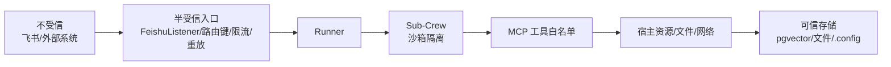

**图表来源**
- [docs/ssot/threats.md:41-59](file://docs/ssot/threats.md#L41-L59)
- [xiaopaw/feishu/listener.py:21-148](file://xiaopaw/feishu/listener.py#L21-L148)
- [xiaopaw/tools/skill_loader.py:223-535](file://xiaopaw/tools/skill_loader.py#L223-L535)

## 详细组件分析

### 威胁模型与防御矩阵
- T1 Prompt Injection → 沙箱逃逸：MCP 工具白名单 + sandbox seccomp
- T2 内存投毒：BLOCKED_PATTERNS + 长度限制 + memory-governance
- T3 飞书 Webhook 重放：服务端验签 + 应用层 ReplayCache（event_id LRU+TTL）
- T4 凭证泄露（.env/docker secrets）：强制轮换 + docker secrets + is_weak_credential
- T5 Sub-Crew 路径遍历：workspace 精确挂载到 {sid}/ + Path.resolve() 越界校验
- T6 SKILL.md YAML 注入：yaml.safe_load + 路径白名单 + scripts: 在 skill_dir 内
- T7 DoS（消息洪水）：FeishuListener 入站速率限制（每用户 20/min）

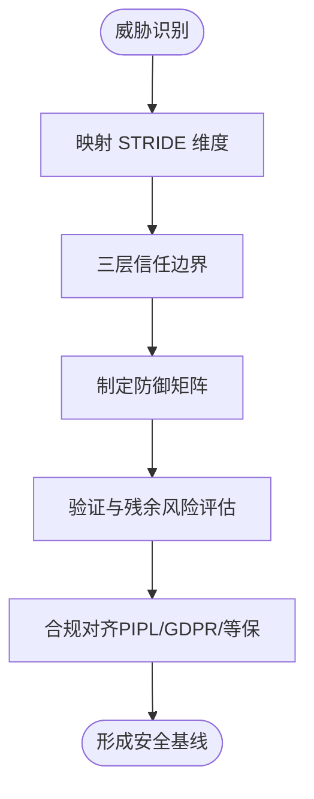

**图表来源**
- [docs/ssot/threats.md:28-82](file://docs/ssot/threats.md#L28-L82)

**章节来源**
- [docs/ssot/threats.md:8-26](file://docs/ssot/threats.md#L8-L26)
- [docs/ssot/threats.md:41-59](file://docs/ssot/threats.md#L41-L59)
- [docs/ssot/threats.md:63-82](file://docs/ssot/threats.md#L63-L82)
- [docs/ssot/threats.md:85-104](file://docs/ssot/threats.md#L85-L104)
- [docs/ssot/threats.md:111-121](file://docs/ssot/threats.md#L111-L121)

### 安全审计日志（SecurityAuditLogger）
- 设计要点：追加只读 JSONL、多策略共享、会话级摘要
- 与策略协作：SandboxGuard 与 PermissionGate 通过依赖注入共享同一实例
- 顺序约束：必须在 hooks.yaml 的 strategies 段首位，避免 fail-closed 时 AttributeError

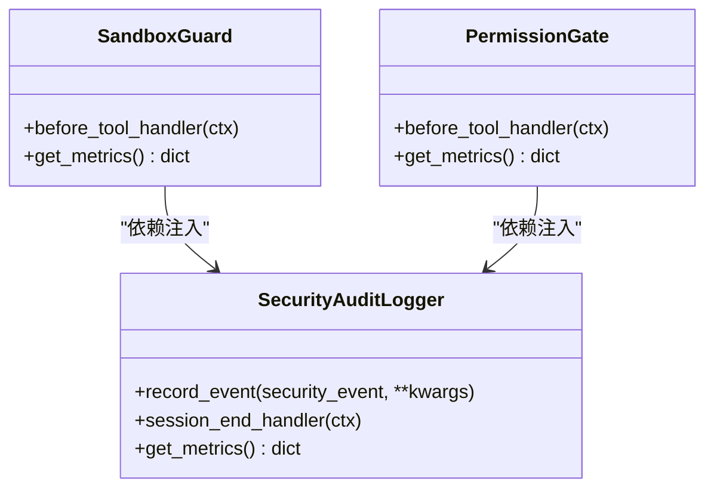

**图表来源**
- [shared_hooks/audit_logger.py:30-90](file://shared_hooks/audit_logger.py#L30-L90)
- [shared_hooks/sandbox_guard.py:93-168](file://shared_hooks/sandbox_guard.py#L93-L168)
- [shared_hooks/permission_gate.py:32-107](file://shared_hooks/permission_gate.py#L32-L107)
- [shared_hooks/hooks.yaml:29-49](file://shared_hooks/hooks.yaml#L29-L49)

**章节来源**
- [shared_hooks/audit_logger.py:30-90](file://shared_hooks/audit_logger.py#L30-L90)
- [shared_hooks/hooks.yaml:29-49](file://shared_hooks/hooks.yaml#L29-L49)

### 沙箱守卫（SandboxGuard）
- 检测维度：路径穿越、危险命令、Shell 注入、环境变量引用（告警）、Prompt 注入
- 输入预处理：NFKC 归一化 + 多轮 URL 解码 + 空字节拦截
- 执行顺序：路径穿越 → 危险命令 → Shell 注入 → 环境变量（告警）→ Prompt 注入
- 沙箱原生工具豁免：sandbox_/mcp_ 前缀工具允许 shell 组合符（容器内合法）

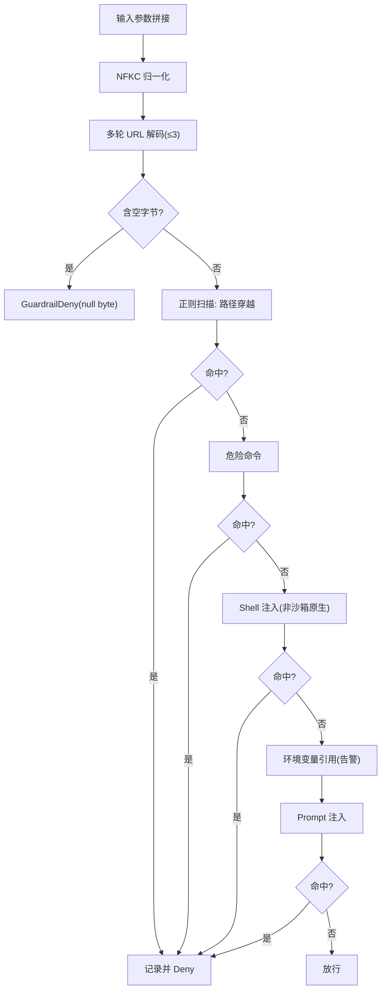

**图表来源**
- [shared_hooks/sandbox_guard.py:65-91](file://shared_hooks/sandbox_guard.py#L65-L91)
- [shared_hooks/sandbox_guard.py:109-146](file://shared_hooks/sandbox_guard.py#L109-L146)

**章节来源**
- [shared_hooks/sandbox_guard.py:93-168](file://shared_hooks/sandbox_guard.py#L93-L168)
- [tests/unit/shared_hooks/test_sandbox_guard.py:36-68](file://tests/unit/shared_hooks/test_sandbox_guard.py#L36-L68)
- [tests/unit/shared_hooks/test_sandbox_guard.py:136-193](file://tests/unit/shared_hooks/test_sandbox_guard.py#L136-L193)

### 权限网关（PermissionGate）
- 策略原则：未显式声明的工具走 default；default 应为 warn 或 deny，严禁 allow
- 执行阶段：BEFORE_TOOL_CALL；与 SandboxGuard 协作，先拦非法输入再做权限判定
- 审计与指标：记录决策、统计 allow/warn/deny 比例

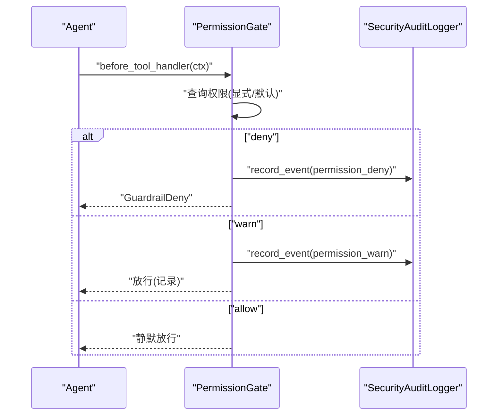

**图表来源**
- [shared_hooks/permission_gate.py:57-94](file://shared_hooks/permission_gate.py#L57-L94)
- [shared_hooks/audit_logger.py:41-48](file://shared_hooks/audit_logger.py#L41-L48)

**章节来源**
- [shared_hooks/permission_gate.py:32-107](file://shared_hooks/permission_gate.py#L32-L107)
- [tests/fixtures/security_policy_samples.py:3-25](file://tests/fixtures/security_policy_samples.py#L3-L25)

### 飞书入站安全（Listener、路由键、限流、重放）
- 验签与建连：依赖飞书 SDK 服务端验签与 app_secret
- 速率限制：每用户每分钟 20 次滑动窗口
- 重放缓存：LRU + TTL（5 分钟）去重 event_id
- 路由键：p2p/group/thread 三类，防止伪造 routing_key
- 聊天白名单：可选限制允许的群聊

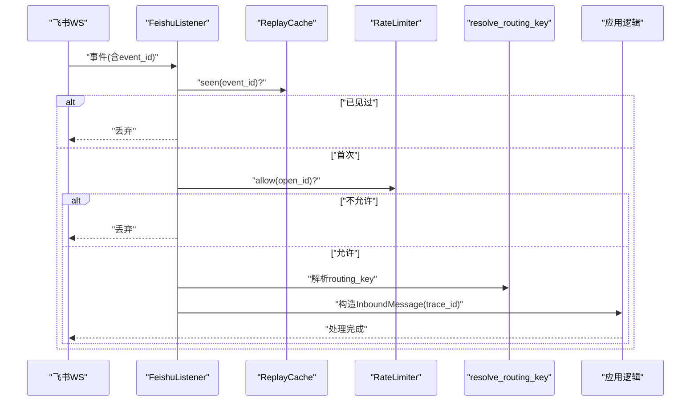

**图表来源**
- [xiaopaw/feishu/listener.py:81-148](file://xiaopaw/feishu/listener.py#L81-L148)
- [xiaopaw/feishu/session_key.py:6-21](file://xiaopaw/feishu/session_key.py#L6-L21)
- [xiaopaw/observability/security.py:11-73](file://xiaopaw/observability/security.py#L11-L73)

**章节来源**
- [xiaopaw/feishu/listener.py:21-148](file://xiaopaw/feishu/listener.py#L21-L148)
- [xiaopaw/feishu/session_key.py:6-21](file://xiaopaw/feishu/session_key.py#L6-L21)
- [xiaopaw/observability/security.py:11-73](file://xiaopaw/observability/security.py#L11-L73)

### 内存投毒过滤与子舱隔离
- 内存内容过滤：BLOCKED_PATTERNS + 长度限制，缓解恶意内容持久化
- 子舱隔离：SkillLoaderTool 触发子舱，使用沙箱执行，严格路径隔离与工作区挂载
- MCP 工具白名单：仅允许受控工具暴露，降低“用对工具干坏事”的风险

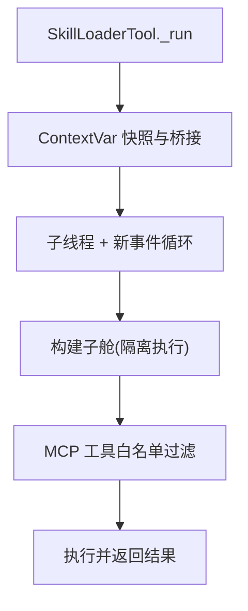

**图表来源**
- [xiaopaw/tools/skill_loader.py:451-535](file://xiaopaw/tools/skill_loader.py#L451-L535)
- [docs/04-api.md:614-632](file://docs/04-api.md#L614-L632)

**章节来源**
- [xiaopaw/tools/skill_loader.py:200-204](file://xiaopaw/tools/skill_loader.py#L200-L204)
- [xiaopaw/tools/skill_loader.py:321-359](file://xiaopaw/tools/skill_loader.py#L321-L359)
- [xiaopaw/observability/security.py:38-44](file://xiaopaw/observability/security.py#L38-L44)
- [docs/04-api.md:614-632](file://docs/04-api.md#L614-L632)

### 凭证管理与生产安全断言
- 强制轮换与密钥管理：docker secrets + .env mode 0400
- 弱凭证检测：长度阈值、重复字符、占位符关键字
- 生产断言：禁止测试接口对外暴露、限定测试接口仅回环地址

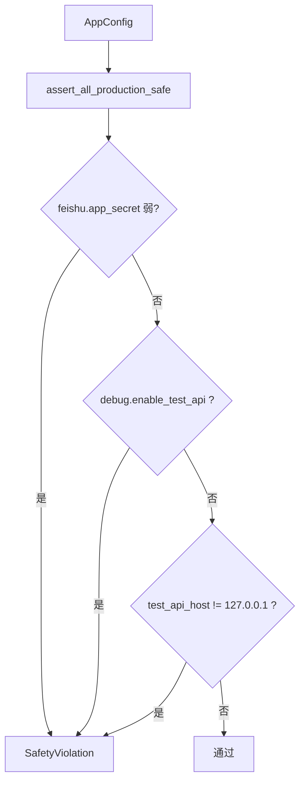

**图表来源**
- [xiaopaw/config/safety.py:27-48](file://xiaopaw/config/safety.py#L27-L48)

**章节来源**
- [xiaopaw/config/safety.py:18-25](file://xiaopaw/config/safety.py#L18-L25)
- [xiaopaw/config/safety.py:27-48](file://xiaopaw/config/safety.py#L27-L48)

### 部署与网络隔离（T9 防护）
- 容器网络：仅内部网络，MCP 端口不向宿主暴露
- 非 root 用户：容器以非特权用户运行
- 挂载卷：严格控制 RW/R/O 与路径隔离

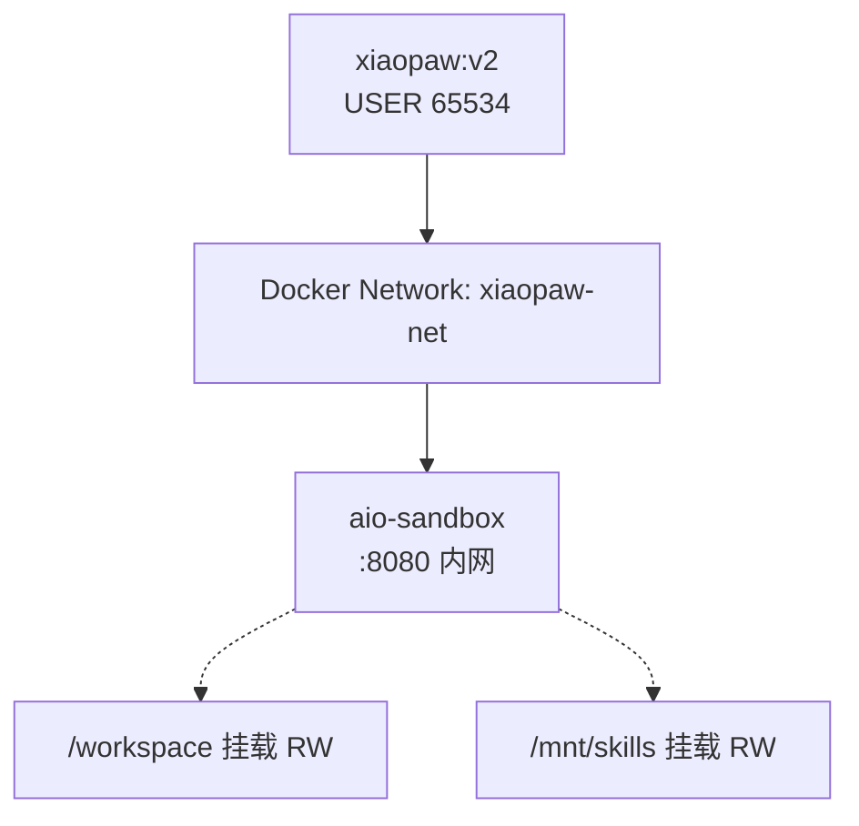

**图表来源**
- [docs/01-architecture.md:356-381](file://docs/01-architecture.md#L356-L381)
- [sandbox-docker-compose.yaml:13-31](file://sandbox-docker-compose.yaml#L13-L31)

**章节来源**
- [sandbox-docker-compose.yaml:13-31](file://sandbox-docker-compose.yaml#L13-L31)
- [docs/01-architecture.md:356-381](file://docs/01-architecture.md#L356-L381)

## 依赖分析
- Hooks 顺序：审计日志必须在最前，随后是沙箱守卫与权限网关
- 依赖注入：SandboxGuard 与 PermissionGate 共享 SecurityAuditLogger
- 子舱与工具：SkillLoaderTool 依赖 Langfuse Trace 上下文桥接，确保子舱 trace 挂靠父 span

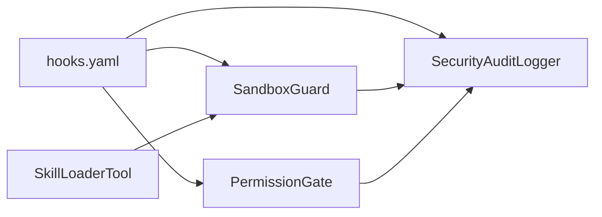

**图表来源**
- [shared_hooks/hooks.yaml:29-49](file://shared_hooks/hooks.yaml#L29-L49)
- [shared_hooks/sandbox_guard.py:93-100](file://shared_hooks/sandbox_guard.py#L93-L100)
- [shared_hooks/permission_gate.py:38-40](file://shared_hooks/permission_gate.py#L38-L40)

**章节来源**
- [shared_hooks/hooks.yaml:27-73](file://shared_hooks/hooks.yaml#L27-L73)
- [xiaopaw/tools/skill_loader.py:109-129](file://xiaopaw/tools/skill_loader.py#L109-L129)

## 性能考虑
- 输入预处理：NFKC + 多轮 URL 解码最多 3 轮，兼顾安全性与性能
- 缓存与限流：ReplayCache 使用有序字典 + 锁，TTL 驱逐；RateLimiter 滑动窗口 O(1) 去除过期时间戳
- 日志写入：append-only JSONL，异步写入失败仅打印错误，不阻塞主流程
- 子舱执行：子线程 + 新事件循环，避免与主线程事件循环冲突

[本节为通用指导，不直接分析具体文件]

## 故障排除指南
- 审计日志未写入
  - 检查 SECURITY_AUDIT_FILE 环境变量或构造参数是否设置
  - 确认 hooks.yaml 中 audit_logger 是否在首位
- 所有请求被拒绝（fail-closed）
  - 可能由于 audit_logger 未在首位导致 SandboxGuard 初始化时 audit 为空
- 沙箱守卫误报
  - 自然语言括号、空输入等为正常场景，测试用例覆盖了 False Positive 控制
- 权限网关默认策略
  - default 必须为 deny/warn，避免 allow 导致新工具上线风险
- 路由键伪造
  - 依赖 resolve_routing_key 与 allowed_chats 白名单双重校验
- 凭证泄露
  - 检查 .env mode 0400、docker secrets 使用、is_weak_credential 断言

**章节来源**
- [shared_hooks/audit_logger.py:30-40](file://shared_hooks/audit_logger.py#L30-L40)
- [shared_hooks/sandbox_guard.py:109-146](file://shared_hooks/sandbox_guard.py#L109-L146)
- [shared_hooks/permission_gate.py:12-16](file://shared_hooks/permission_gate.py#L12-L16)
- [xiaopaw/feishu/session_key.py:6-21](file://xiaopaw/feishu/session_key.py#L6-L21)
- [xiaopaw/config/safety.py:18-25](file://xiaopaw/config/safety.py#L18-L25)

## 结论
XiaoPaw v2 的安全设计以“三层信任边界”为核心，结合 Hooks 策略层的确定性输入消毒与权限控制、飞书入站的限流与重放防护、容器网络隔离与非 root 运行、以及生产安全断言与凭证管理，形成多层纵深防御。针对 T1–T7 的威胁，文档提供了明确的防御矩阵与残余风险评估，并给出了可追溯的实现位置与测试锚点，便于持续演进与合规落地。

[本节为总结性内容，不直接分析具体文件]

## 附录

### 安全配置指南与最佳实践
- 入站安全
  - 启用飞书服务端验签与 app_secret 建连
  - 配置 allowed_chats 白名单（群聊场景）
  - 设置 per_user_per_minute=20 的速率限制
  - 启用 ReplayCache（默认 TTL=300s，LRU 最大 10000）
- 策略层
  - hooks.yaml 中 audit_logger 必须在首位
  - default 权限策略设为 deny/warn，严禁 allow
  - SandboxGuard 保持 fail-closed
- 子舱与工具
  - 使用 MCP 工具白名单，仅暴露必要工具
  - 子舱执行前进行路径越界校验（Path.resolve）
  - 内存内容过滤：BLOCKED_PATTERNS + 长度限制
- 凭证与部署
  - 使用 docker secrets 管理密钥，.env mode 0400
  - 生产环境禁止测试接口对外暴露，仅回环地址
  - 容器网络仅内部可达，MCP 端口不暴露宿主

**章节来源**
- [xiaopaw/observability/security.py:11-73](file://xiaopaw/observability/security.py#L11-L73)
- [shared_hooks/hooks.yaml:29-49](file://shared_hooks/hooks.yaml#L29-L49)
- [shared_hooks/permission_gate.py:12-16](file://shared_hooks/permission_gate.py#L12-L16)
- [docs/04-api.md:614-632](file://docs/04-api.md#L614-L632)
- [xiaopaw/tools/skill_loader.py:267-269](file://xiaopaw/tools/skill_loader.py#L267-L269)
- [xiaopaw/config/safety.py:34-38](file://xiaopaw/config/safety.py#L34-L38)
- [sandbox-docker-compose.yaml:13-31](file://sandbox-docker-compose.yaml#L13-L31)

### 威胁响应流程（RACI 简版）
- T4 凭证泄露：运维 SRE 轮换，安全工程师审计范围
- T1 Prompt Injection 成功：SRE 终止会话，安全工程师加强约束
- T7 DoS：SRE 加黑名单，产品评估封号策略
- T9 MCP 暴露：SRE 立即关闭端口，架构师审计 compose

**章节来源**
- [docs/ssot/threats.md:123-131](file://docs/ssot/threats.md#L123-L131)