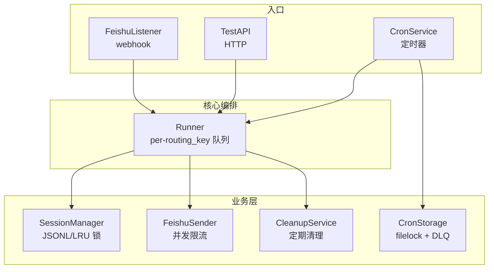
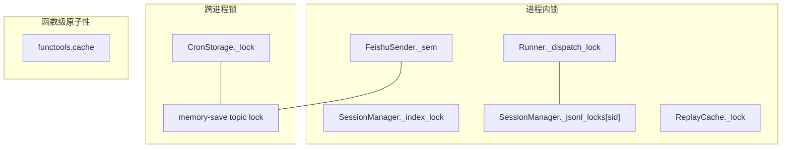
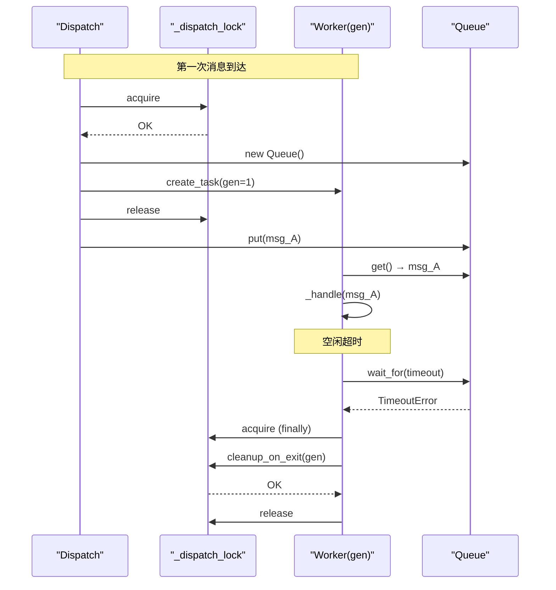
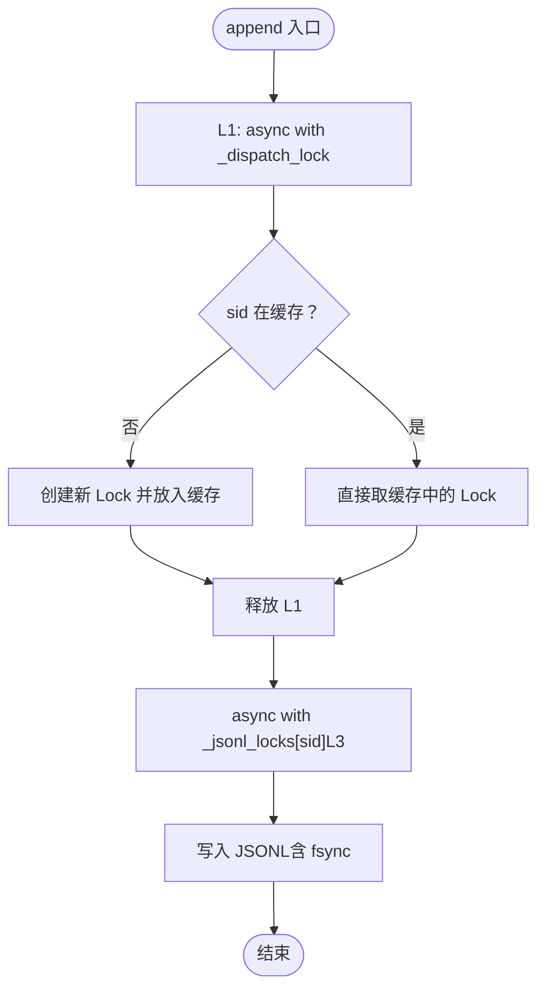
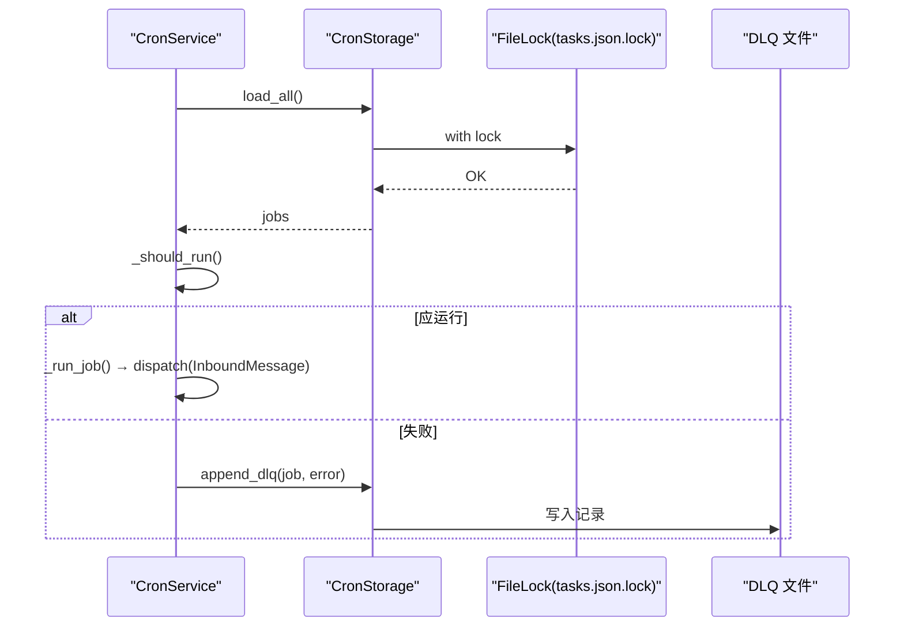
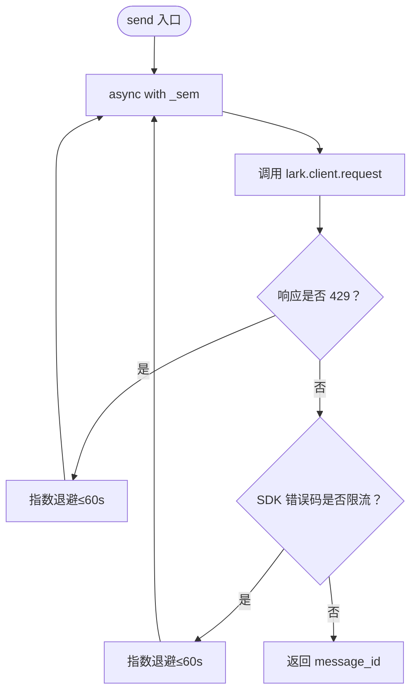
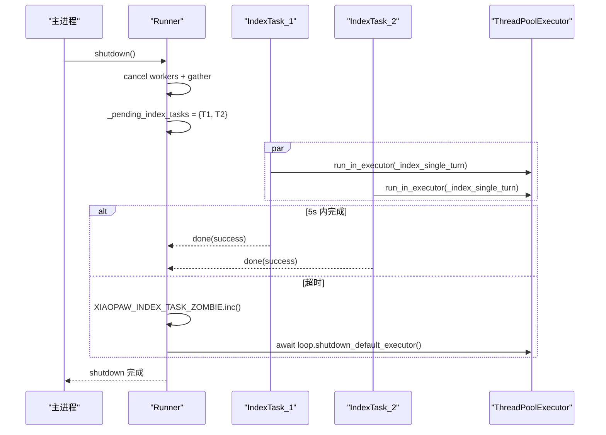
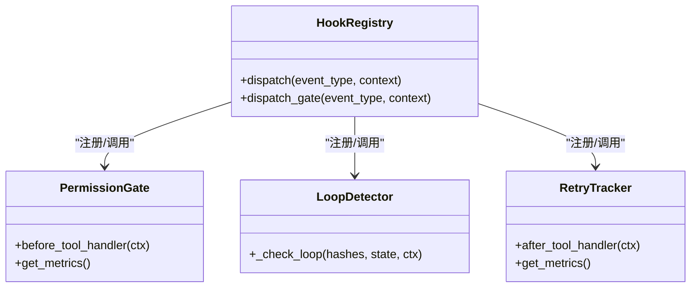
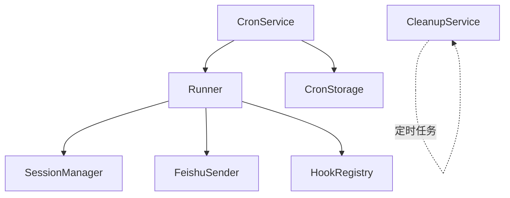

# 并发与可靠性

<cite>
**本文引用的文件**
- [docs/05-并发与锁模型（v2 核心加固）.md](file://docs/05-concurrency.md)
- [docs/ssot/locks.md](file://docs/ssot/locks.md)
- [docs/ssot/tasks.md](file://docs/ssot/tasks.md)
- [docs/02-模块与架构.md](file://docs/02-modules.md)
- [docs/04-API.md](file://docs/04-api.md)
- [docs/09-配置.md](file://docs/09-config.md)
- [docs/10-测试.md](file://docs/10-testing.md)
- [docs/12-hook-hardening.md](file://docs/12-hook-hardening.md)
- [docs/13-测试设计-钩子加固.md](file://docs/13-test-design-hook-hardening.md)
- [xiaopaw/runner.py](file://xiaopaw/runner.py)
- [xiaopaw/session/manager.py](file://xiaopaw/session/manager.py)
- [xiaopaw/cron/service.py](file://xiaopaw/cron/service.py)
- [xiaopaw/cron/storage.py](file://xiaopaw/cron/storage.py)
- [xiaopaw/feishu/sender.py](file://xiaopaw/feishu/sender.py)
- [xiaopaw/main.py](file://xiaopaw/main.py)
- [shared_hooks/permission_gate.py](file://shared_hooks/permission_gate.py)
- [tests/unit/shared_hooks/test_retry_tracker.py](file://tests/unit/shared_hooks/test_retry_tracker.py)
</cite>

## 目录
1. [简介](#简介)
2. [项目结构](#项目结构)
3. [核心组件](#核心组件)
4. [架构总览](#架构总览)
5. [详细组件分析](#详细组件分析)
6. [依赖关系分析](#依赖关系分析)
7. [性能考量](#性能考量)
8. [故障排查指南](#故障排查指南)
9. [结论](#结论)
10. [附录](#附录)

## 简介
本文件面向 XiaoPaw v2 的并发与可靠性系统，系统性阐述锁机制设计、队列管理、超时控制与容错降级的实现细节与使用模式。重点覆盖以下主题：
- per-routing_key 队列与 worker 生命周期管理，确保消息严格串行与空闲自清理
- SessionManager 的 LRUCache + 两级锁模型，解决 LRU 驱逐带来的竞态互斥问题
- Cron 跨进程 filelock 与 DLQ，保障 tasks.json 的一致性与可恢复性
- FeishuSender 的并发限流（Semaphore）与 429 退避策略
- 任务生命周期管理与优雅停机，包括线程池僵尸任务的可观测与容忍
- Hook 框架中的安全策略（PermissionGate、LoopDetector、RetryTracker）与 fail-closed 语义
- 性能优化建议与常见并发问题的解决方案

## 项目结构
XiaoPaw v2 采用“单事件循环、单进程、单节点”的 asyncio 应用模型，围绕 Runner 统一做 routing_key 维度的串行化，业务层（SessionManager、MemoryAwareCrew、SkillLoaderTool）在同一 routing_key 的调用顺序由 Runner 保证，无需自行维护 per-session 锁。

图表来源
- [xiaopaw/main.py:174-191](file://xiaopaw/main.py#L174-L191)
- [xiaopaw/runner.py:60-84](file://xiaopaw/runner.py#L60-L84)
- [xiaopaw/session/manager.py:38-47](file://xiaopaw/session/manager.py#L38-L47)
- [xiaopaw/feishu/sender.py:18-30](file://xiaopaw/feishu/sender.py#L18-L30)
- [xiaopaw/cron/storage.py:14-21](file://xiaopaw/cron/storage.py#L14-L21)
- [xiaopaw/cleanup/service.py:14-28](file://xiaopaw/cleanup/service.py#L14-L28)

章节来源
- [docs/02-模块与架构.md:46-56](file://docs/02-modules.md#L46-L56)
- [xiaopaw/main.py:174-191](file://xiaopaw/main.py#L174-L191)

## 核心组件
- Runner：基于 per-routing_key 的 asyncio.Queue + 生成器计数（gen）+ worker 任务，确保同 key 严格串行、空闲超时自清理、并发 dispatch 与 worker 清理不产生竞态
- SessionManager：LRUCache + 两级锁（L1 + L3），保护 index.json 与 {sid}.jsonl 的互斥写入，LRU 驱逐后通过 L1 保护 setdefault 原子性
- CronService/CronStorage：filelock 保护 tasks.json 的读写，失败时记录 DLQ，避免跨进程写竞态与 JSON 损坏
- FeishuSender：Semaphore(5) 控制并发，结合 429 退避与指数回退，提升对外部 API 的鲁棒性
- 任务生命周期管理：Runner 的 _pending_index_tasks 集合 + add_done_callback，优雅等待与清理；shutdown 顺序与线程池僵尸任务容忍
- Hook 框架：PermissionGate、LoopDetector、RetryTracker 等，fail-closed 与 fail-open 的策略选择，统一在 Runner._handle 中触发

章节来源
- [docs/05-并发与锁模型（v2 核心加固）.md:104-222](file://docs/05-concurrency.md#L104-L222)
- [docs/ssot/locks.md:8-65](file://docs/ssot/locks.md#L8-L65)
- [xiaopaw/runner.py:33-107](file://xiaopaw/runner.py#L33-L107)
- [xiaopaw/session/manager.py:18-47](file://xiaopaw/session/manager.py#L18-L47)
- [xiaopaw/cron/service.py:19-97](file://xiaopaw/cron/service.py#L19-L97)
- [xiaopaw/cron/storage.py:14-49](file://xiaopaw/cron/storage.py#L14-L49)
- [xiaopaw/feishu/sender.py:18-47](file://xiaopaw/feishu/sender.py#L18-L47)
- [docs/ssot/tasks.md:62-102](file://docs/ssot/tasks.md#L62-L102)
- [docs/12-hook-hardening.md:114-143](file://docs/12-hook-hardening.md#L114-L143)

## 架构总览
XiaoPaw v2 的并发与可靠性以“锁最小化、持有时间短、失败可度量”为核心设计原则。锁分为三类：
- 进程内 asyncio.Primitives：Runner._dispatch_lock、SessionManager._index_lock、SessionManager._jsonl_locks[sid]、FeishuSender._sem、ReplayCache._lock
- 跨进程 filelock：CronStorage.tasks.json.lock、memory-save topic 锁
- 函数级原子性：functools.cache（CPython 内置 RLock 保护）

图表来源
- [docs/ssot/locks.md:10-57](file://docs/ssot/locks.md#L10-L57)

章节来源
- [docs/05-并发与锁模型（v2 核心加固）.md:31-101](file://docs/05-concurrency.md#L31-L101)
- [docs/ssot/locks.md:10-57](file://docs/ssot/locks.md#L10-L57)

## 详细组件分析

### Runner：per-routing_key 队列与 worker 生命周期
- 设计目标：同 routing_key 严格串行、不同 routing_key 并行、空闲 300s 自动退出、并发 dispatch 与 worker timeout 不丢消息
- 关键机制：
  - dispatch 时持 _dispatch_lock，仅做字典读写与 create_task，O(1) 持有时间
  - 引入 _queue_gen[key] 世代计数器，每次新建 queue +1；worker 退出时对比 gen，防止误删新 queue
  - worker 使用 asyncio.wait_for(timeout=queue_idle_timeout_s)，超时后清理并退出
- 异常处理：_handle 内部异常仅记录日志，finally 无条件 task_done，不传播至队列
- 优雅停机：先取消所有 worker，gather 等待；再取消并等待 _pending_index_tasks（最多 5s），超时后容忍线程池僵尸任务，打指标

图表来源
- [xiaopaw/runner.py:60-107](file://xiaopaw/runner.py#L60-L107)
- [docs/05-并发与锁模型（v2 核心加固）.md:179-222](file://docs/05-concurrency.md#L179-L222)

章节来源
- [xiaopaw/runner.py:33-107](file://xiaopaw/runner.py#L33-L107)
- [docs/05-并发与锁模型（v2 核心加固）.md:104-222](file://docs/05-concurrency.md#L104-L222)
- [docs/10-测试.md:720-747](file://docs/10-testing.md#L720-L747)

### SessionManager：LRUCache + 两级锁（L1 + L3）
- 问题背景：v1 的 dict[str, asyncio.Lock] 无界，长跑 OOM；LRUCache 非原子 setdefault，驱逐后并发 getter 会各自新建锁
- v2 解决方案：
  - L1（Runner._dispatch_lock）保护“check + create + get”三步原子，避免 LRUCache 驱逐 + 并发 getter 导致的双锁
  - L3（_jsonl_locks[sid]）为真正的 per-session 互斥，持有时长 <10ms
  - maxsize=1000 防 OOM，峰值活跃 session 数必须 >1000 时需调大或分片
- load_history 通过 asyncio.to_thread 避免阻塞事件循环

图表来源
- [xiaopaw/session/manager.py:132-168](file://xiaopaw/session/manager.py#L132-L168)
- [docs/ssot/locks.md:18-35](file://docs/ssot/locks.md#L18-L35)

章节来源
- [docs/05-并发与锁模型（v2 核心加固）.md:331-441](file://docs/05-concurrency.md#L331-L441)
- [docs/ssot/locks.md:18-35](file://docs/ssot/locks.md#L18-L35)
- [xiaopaw/session/manager.py:18-47](file://xiaopaw/session/manager.py#L18-L47)

### Cron 跨进程锁 filelock + DLQ
- 跨进程写者：CronService（主进程）、scheduler_mgr Skill（沙盒进程）
- filelock 保护 tasks.json：读写均在 with lock 上下文中进行，失败捕获 Timeout 并重试
- DLQ：超过最大重试次数的任务写入 tasks.dlq.jsonl，记录 trace_id 与错误信息，便于人工处理
- 429/限流：CronService 侧也具备退避与失败处理，避免对下游造成冲击

图表来源
- [xiaopaw/cron/service.py:53-97](file://xiaopaw/cron/service.py#L53-L97)
- [xiaopaw/cron/storage.py:31-49](file://xiaopaw/cron/storage.py#L31-L49)

章节来源
- [docs/05-并发与锁模型（v2 核心加固）.md:566-642](file://docs/05-concurrency.md#L566-L642)
- [xiaopaw/cron/service.py:19-97](file://xiaopaw/cron/service.py#L19-L97)
- [xiaopaw/cron/storage.py:14-49](file://xiaopaw/cron/storage.py#L14-L49)

### FeishuSender：并发限流与 429 退避
- 限流：Semaphore(5) 控制并发，避免对外部 API 的突发压力
- 429 退避：优先处理 HTTP 429（标准语义），其次处理 SDK 错误码经验集合；指数退避不超过 60s
- 重试：连接类异常（Timeout/ConnectionError）按 retry_backoff 重试，达到最大次数抛出

图表来源
- [xiaopaw/feishu/sender.py:43-47](file://xiaopaw/feishu/sender.py#L43-L47)
- [docs/09-配置.md:164-168](file://docs/09-config.md#L164-L168)
- [docs/04-API.md:324-356](file://docs/04-api.md#L324-L356)

章节来源
- [docs/05-并发与锁模型（v2 核心加固）.md:7-26](file://docs/05-concurrency.md#L7-L26)
- [docs/09-配置.md:164-168](file://docs/09-config.md#L164-L168)
- [xiaopaw/feishu/sender.py:18-47](file://xiaopaw/feishu/sender.py#L18-L47)

### 任务生命周期管理与优雅停机
- Runner._pending_index_tasks：强引用集合 + add_done_callback(set.discard)，避免 Task 被 GC 导致的中断
- shutdown 顺序：
  1) 停止入站（FeishuListener/TestAPI）
  2) Runner.shutdown：取消 worker、gather；等待 _pending_index_tasks 最多 5s
  3) CronService.stop、FeishuSender drain、CleanupService.stop
  4) metrics server.cleanup、await loop.shutdown_default_executor（公开 API）
  5) loop.close
- 僵尸线程容忍：线程池同步任务（如 psycopg2）无法强制取消，超时后记录指标，不阻塞退出

图表来源
- [docs/ssot/tasks.md:62-102](file://docs/ssot/tasks.md#L62-L102)
- [docs/05-并发与锁模型（v2 核心加固）.md:497-563](file://docs/05-concurrency.md#L497-L563)
- [xiaopaw/runner.py:318-335](file://xiaopaw/runner.py#L318-L335)

章节来源
- [docs/ssot/tasks.md:62-102](file://docs/ssot/tasks.md#L62-L102)
- [docs/05-并发与锁模型（v2 核心加固）.md:497-563](file://docs/05-concurrency.md#L497-L563)
- [xiaopaw/runner.py:318-335](file://xiaopaw/runner.py#L318-L335)

### Hook 框架：安全策略与 fail-closed
- dispatch vs dispatch_gate：观测类 handler 使用 dispatch（异常吞掉不影响执行），策略类 handler 使用 dispatch_gate（GuardrailDeny 传播）
- PermissionGate：三级权限模型（deny > warn > allow），默认策略应为 warn 或 deny，fail-closed 可选
- LoopDetector：状态哈希去重，连续 N 次相同判定循环
- RetryTracker：纯观测，统计 total_retries、successful_retries、retry_success_rate，辅助评估重试有效性

图表来源
- [docs/12-hook-hardening.md:114-143](file://docs/12-hook-hardening.md#L114-L143)
- [shared_hooks/permission_gate.py:32-107](file://shared_hooks/permission_gate.py#L32-L107)

章节来源
- [docs/12-hook-hardening.md:114-143](file://docs/12-hook-hardening.md#L114-L143)
- [shared_hooks/permission_gate.py:32-107](file://shared_hooks/permission_gate.py#L32-L107)
- [tests/unit/shared_hooks/test_retry_tracker.py:34-66](file://tests/unit/shared_hooks/test_retry_tracker.py#L34-L66)

## 依赖关系分析
- Runner 依赖 SessionManager（append/load_history）、FeishuSender（发送/思考卡片）、HookRegistry（事件钩子）
- CronService 依赖 CronStorage（tasks.json 读写）并通过 Runner.dispatch 触发业务消息
- CleanupService 与 CronService/CleanupService 无直接耦合，均通过 asyncio 任务驱动
- FeishuListener 与 TestAPI 仅在入口阶段接入 Runner.dispatch

图表来源
- [xiaopaw/main.py:115-150](file://xiaopaw/main.py#L115-L150)
- [xiaopaw/runner.py:109-282](file://xiaopaw/runner.py#L109-L282)
- [xiaopaw/cron/service.py:19-97](file://xiaopaw/cron/service.py#L19-L97)

章节来源
- [xiaopaw/main.py:115-150](file://xiaopaw/main.py#L115-L150)
- [xiaopaw/runner.py:109-282](file://xiaopaw/runner.py#L109-L282)

## 性能考量
- 队列与 worker
  - max_queue_size 与 idle_timeout_s 需结合流量特征调优；队列满时丢弃消息，避免阻塞其他 routing_key
  - gen 计数器避免竞态清理，减少不必要的重建
- SessionManager
  - max_active_sessions ≥ 峰值活跃 session 数；接近上限时应调大或分片
  - append 写入通过 asyncio.to_thread，避免阻塞事件循环
- Cron
  - filelock 超时失败时记录 metric 并重试，避免 JSON 损坏
  - DLQ 降低失败任务对主流程的影响
- FeishuSender
  - 并发上限 5，结合 429 退避与指数回退，避免对外部 API 的冲击
- 任务生命周期
  - add_done_callback 避免手写 try/finally 的侵入性
  - shutdown 5s 超时容忍线程池僵尸任务，不阻塞进程退出

## 故障排查指南
- Runner 队列丢失/双 worker
  - 现象：并发 dispatch 与 worker timeout 时消息丢失或重复
  - 排查：确认 _queue_gen 是否正确 +1，worker 退出时 gen 校验是否生效
  - 参考用例：runner_queue_gen_race
- SessionManager LRU 驱逐 + 并发 append
  - 现象：JSONL 写入交叉、数据损坏
  - 排查：确认 append 是否通过 L1 保护 setdefault；maxsize 是否足够
  - 参考用例：test_session_lock_evict_and_reacquire
- Cron 跨进程锁失败
  - 现象：tasks.json 损坏、调度表丢失
  - 排查：filelock 超时是否被捕获并重试；DLQ 是否写入
  - 参考用例：test_cron_filelock_cross_process
- FeishuSender 429 退避导致饥饿
  - 现象：不同 routing_key 互相影响
  - 排查：Semaphore 是否被长期占用；并发上限是否合理
  - 参考用例：test_feishu_sender_429_backoff_does_not_starve_other_rk
- Hook 策略异常
  - 现象：安全 handler 抛异常被吞掉导致放行
  - 排查：fail_closed 是否启用；PermissionGate 默认策略是否为 warn/deny

章节来源
- [docs/10-测试.md:720-747](file://docs/10-testing.md#L720-L747)
- [docs/10-测试.md:563-604](file://docs/10-testing.md#L563-L604)
- [docs/12-hook-hardening.md:898-918](file://docs/12-hook-hardening.md#L898-L918)

## 结论
XiaoPaw v2 的并发与可靠性体系以“锁最小化、持有时间短、失败可度量”为核心，通过 per-routing_key 队列、LRUCache + 两级锁、filelock + DLQ、Semaphore 限流与优雅停机等手段，构建了高可用、可观测、可扩展的单事件循环应用。遵循本文档的设计原则与最佳实践，可在生产环境中稳定运行并快速定位与解决问题。

## 附录
- 配置项参考
  - session.max_active_sessions：SessionManager LRU 上限
  - runner.queue_idle_timeout_s / max_queue_size：Runner 队列参数
  - sender.max_concurrent：FeishuSender 并发上限
  - cron.filelock_timeout_s：CronStorage filelock 超时
- 锁清单与测试锚点
  - 锁清单：L1~L5、F1~F2、A1~A3
  - 测试锚点：TC-P0-4-a/b、TC-P1-6-a、TC-P0-4-c、TC-P2-7-a、TC-P0-1-b

章节来源
- [docs/09-配置.md:150-168](file://docs/09-config.md#L150-L168)
- [docs/ssot/locks.md:79-86](file://docs/ssot/locks.md#L79-L86)