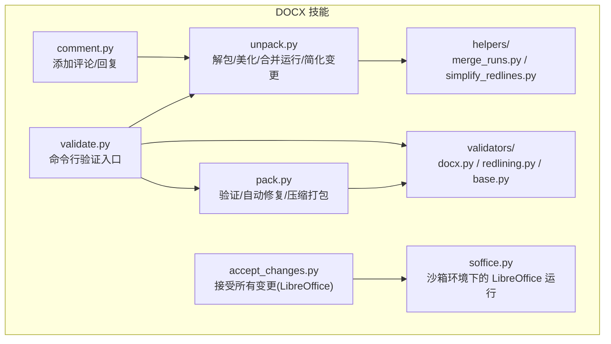
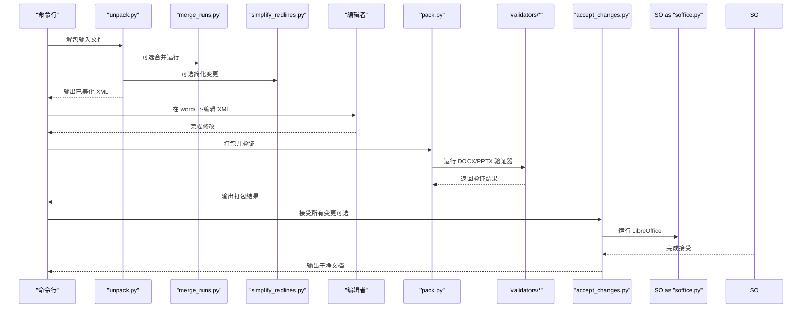
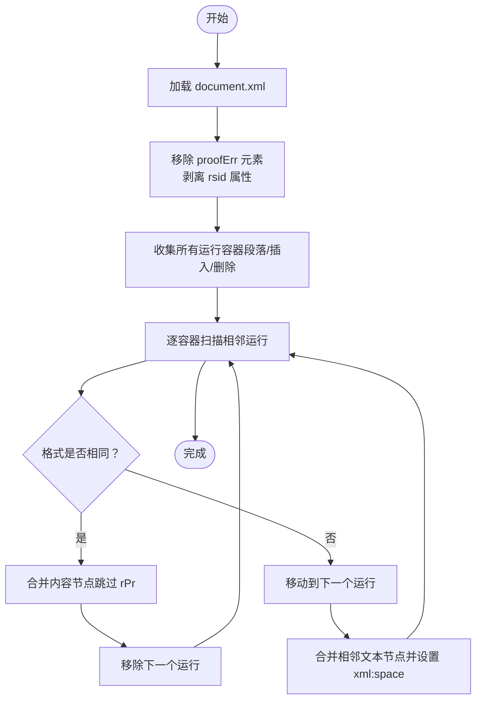
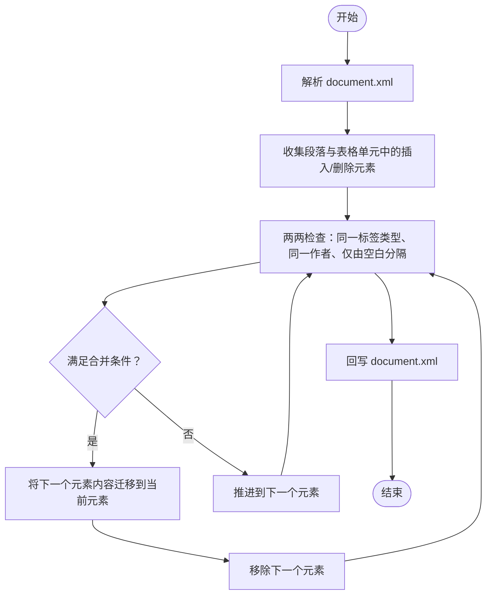
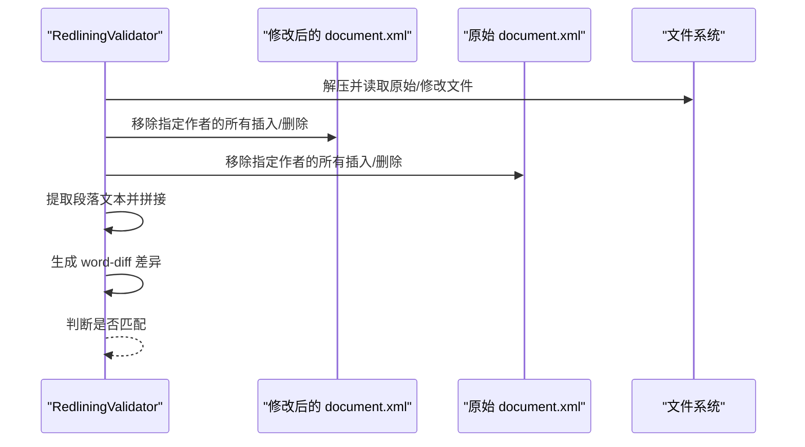
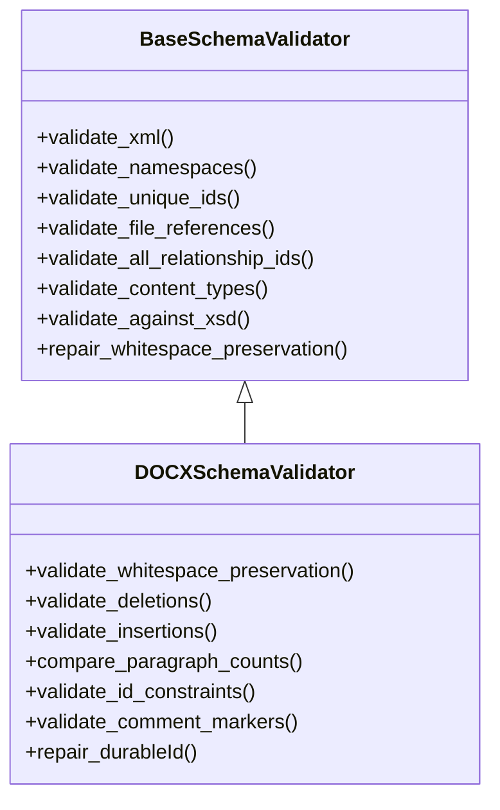
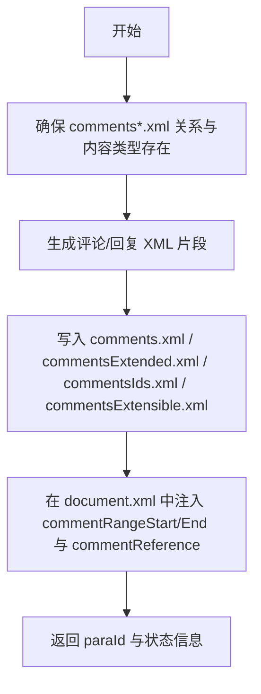
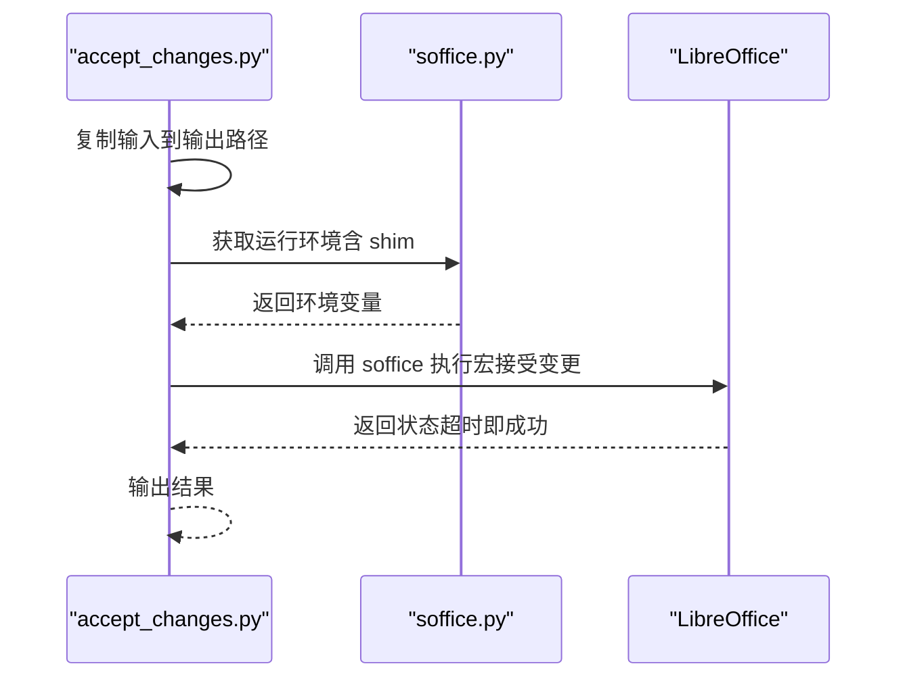
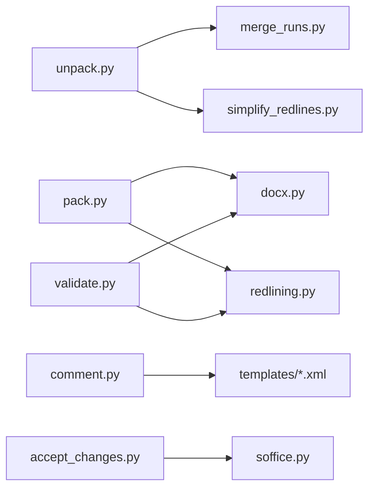

# DOCX 文档处理

<cite>
**本文引用的文件**
- [merge_runs.py](file://xiaopaw/skills/docx/scripts/office/helpers/merge_runs.py)
- [simplify_redlines.py](file://xiaopaw/skills/docx/scripts/office/helpers/simplify_redlines.py)
- [redlining.py](file://xiaopaw/skills/docx/scripts/office/validators/redlining.py)
- [docx.py](file://xiaopaw/skills/docx/scripts/office/validators/docx.py)
- [base.py](file://xiaopaw/skills/docx/scripts/office/validators/base.py)
- [unpack.py](file://xiaopaw/skills/docx/scripts/office/unpack.py)
- [pack.py](file://xiaopaw/skills/docx/scripts/office/pack.py)
- [soffice.py](file://xiaopaw/skills/docx/scripts/office/soffice.py)
- [accept_changes.py](file://xiaopaw/skills/docx/scripts/accept_changes.py)
- [comment.py](file://xiaopaw/skills/docx/scripts/comment.py)
- [validate.py](file://xiaopaw/skills/docx/scripts/office/validate.py)
- [SKILL.md](file://xiaopaw/skills/docx/SKILL.md)
</cite>

## 目录
1. [简介](#简介)
2. [项目结构](#项目结构)
3. [核心组件](#核心组件)
4. [架构总览](#架构总览)
5. [详细组件分析](#详细组件分析)
6. [依赖分析](#依赖分析)
7. [性能考量](#性能考量)
8. [故障排除指南](#故障排除指南)
9. [结论](#结论)
10. [附录](#附录)

## 简介
本文件系统性阐述 DOCX 文档处理技能的设计与实现，覆盖以下主题：
- 文档结构解析：基于 ZIP 包内 XML 的解包、美化与遍历
- 样式与格式化文本提取：通过运行（run）合并与空白保留策略保证渲染一致性
- 变更追踪（红线条）系统：合并相邻插入/删除、作者推断与验证、接受变更
- 批注管理：评论与回复的模板化生成与标记注入
- 文档验证架构：ISO/IEC 29500 第 4 部分、ECMA 与 Microsoft 扩展模式的映射与校验
- 实际使用场景、性能优化与最佳实践

## 项目结构
该能力位于 xiaopaw 项目的 docx 技能目录中，围绕 Office 解包/打包工具链与验证器构建，形成“解包编辑再打包”的闭环，并提供变更追踪与批注辅助工具。

图表来源
- [unpack.py:34-74](file://xiaopaw/skills/docx/scripts/office/unpack.py#L34-L74)
- [pack.py:24-66](file://xiaopaw/skills/docx/scripts/office/pack.py#L24-L66)
- [docx.py:16-64](file://xiaopaw/skills/docx/scripts/office/validators/docx.py#L16-L64)
- [redlining.py:11-24](file://xiaopaw/skills/docx/scripts/office/validators/redlining.py#L11-L24)
- [base.py:94-104](file://xiaopaw/skills/docx/scripts/office/validators/base.py#L94-L104)
- [merge_runs.py:16-36](file://xiaopaw/skills/docx/scripts/office/helpers/merge_runs.py#L16-L36)
- [simplify_redlines.py:22-41](file://xiaopaw/skills/docx/scripts/office/helpers/simplify_redlines.py#L22-L41)
- [comment.py:218-291](file://xiaopaw/skills/docx/scripts/comment.py#L218-L291)
- [accept_changes.py:36-88](file://xiaopaw/skills/docx/scripts/accept_changes.py#L36-L88)
- [soffice.py:24-37](file://xiaopaw/skills/docx/scripts/office/soffice.py#L24-L37)
- [validate.py:25-107](file://xiaopaw/skills/docx/scripts/office/validate.py#L25-L107)

章节来源
- [SKILL.md:1-591](file://xiaopaw/skills/docx/SKILL.md#L1-L591)

## 核心组件
- 解包与预处理
  - 解包：ZIP 展开、XML 美化、智能引号转义、可选运行合并与变更简化
  - 参考路径：[unpack.py:34-74](file://xiaopaw/skills/docx/scripts/office/unpack.py#L34-L74)
- 运行合并（merge_runs）
  - 合并相邻且格式相同的运行（<w:r>），移除修订元数据与拼写/语法标记，合并相邻文本节点
  - 参考路径：[merge_runs.py:16-200](file://xiaopaw/skills/docx/scripts/office/helpers/merge_runs.py#L16-L200)
- 变更简化（simplify_redlines）
  - 合并同一作者相邻的插入/删除块，确保相邻性仅由空白节点构成
  - 参考路径：[simplify_redlines.py:22-198](file://xiaopaw/skills/docx/scripts/office/helpers/simplify_redlines.py#L22-L198)
- 验证器体系
  - 基类：通用 XML、命名空间、唯一 ID、关系引用、内容类型、XSD 映射与忽略规则
    - 参考路径：[base.py:12-800](file://xiaopaw/skills/docx/scripts/office/validators/base.py#L12-L800)
  - DOCX 验证器：空白保留、删除/插入约束、段落数对比、评论标记配对、durableId 自动修复
    - 参考路径：[docx.py:16-447](file://xiaopaw/skills/docx/scripts/office/validators/docx.py#L16-L447)
  - 红线条验证器：按作者移除变更后比对文本，生成差异报告
    - 参考路径：[redlining.py:11-248](file://xiaopaw/skills/docx/scripts/office/validators/redlining.py#L11-L248)
- 打包与修复
  - 验证与自动修复（空白保留、durableId 等），压缩为 ZIP 并清理冗余空白
  - 参考路径：[pack.py:24-160](file://xiaopaw/skills/docx/scripts/office/pack.py#L24-L160)
- 批注管理
  - 自动生成评论/回复所需 XML 片段与关系声明，注入到 comments*.xml 与文档标记
  - 参考路径：[comment.py:218-319](file://xiaopaw/skills/docx/scripts/comment.py#L218-L319)
- 变更接受
  - 使用 LibreOffice 宏接受所有变更；沙箱环境自动检测并注入 LD_PRELOAD shim
  - 参考路径：[accept_changes.py:36-136](file://xiaopaw/skills/docx/scripts/accept_changes.py#L36-L136)，[soffice.py:24-184](file://xiaopaw/skills/docx/scripts/office/soffice.py#L24-L184)
- 命令行验证入口
  - 支持对已打包或解包目录进行验证，必要时自动修复并输出差异
  - 参考路径：[validate.py:25-112](file://xiaopaw/skills/docx/scripts/office/validate.py#L25-L112)

章节来源
- [unpack.py:34-74](file://xiaopaw/skills/docx/scripts/office/unpack.py#L34-L74)
- [merge_runs.py:16-200](file://xiaopaw/skills/docx/scripts/office/helpers/merge_runs.py#L16-L200)
- [simplify_redlines.py:22-198](file://xiaopaw/skills/docx/scripts/office/helpers/simplify_redlines.py#L22-L198)
- [docx.py:16-447](file://xiaopaw/skills/docx/scripts/office/validators/docx.py#L16-L447)
- [redlining.py:11-248](file://xiaopaw/skills/docx/scripts/office/validators/redlining.py#L11-L248)
- [base.py:94-104](file://xiaopaw/skills/docx/scripts/office/validators/base.py#L94-L104)
- [pack.py:24-160](file://xiaopaw/skills/docx/scripts/office/pack.py#L24-L160)
- [comment.py:218-319](file://xiaopaw/skills/docx/scripts/comment.py#L218-L319)
- [accept_changes.py:36-136](file://xiaopaw/skills/docx/scripts/accept_changes.py#L36-L136)
- [soffice.py:24-184](file://xiaopaw/skills/docx/scripts/office/soffice.py#L24-L184)
- [validate.py:25-112](file://xiaopaw/skills/docx/scripts/office/validate.py#L25-L112)

## 架构总览
整体流程从“解包—编辑—打包—验证”闭环出发，结合变更追踪与批注工具，形成可扩展的 DOCX 编辑流水线。

图表来源
- [unpack.py:34-74](file://xiaopaw/skills/docx/scripts/office/unpack.py#L34-L74)
- [merge_runs.py:16-36](file://xiaopaw/skills/docx/scripts/office/helpers/merge_runs.py#L16-L36)
- [simplify_redlines.py:22-41](file://xiaopaw/skills/docx/scripts/office/helpers/simplify_redlines.py#L22-L41)
- [pack.py:24-105](file://xiaopaw/skills/docx/scripts/office/pack.py#L24-L105)
- [docx.py:16-64](file://xiaopaw/skills/docx/scripts/office/validators/docx.py#L16-L64)
- [redlining.py:25-102](file://xiaopaw/skills/docx/scripts/office/validators/redlining.py#L25-L102)
- [accept_changes.py:36-88](file://xiaopaw/skills/docx/scripts/accept_changes.py#L36-L88)
- [soffice.py:24-37](file://xiaopaw/skills/docx/scripts/office/soffice.py#L24-L37)

## 详细组件分析

### 组件一：运行合并（merge_runs）
目标：减少相邻格式一致的运行数量，提升渲染与处理效率；同时清理修订元数据与拼写/语法标记，避免合并冲突。

图表来源
- [merge_runs.py:16-200](file://xiaopaw/skills/docx/scripts/office/helpers/merge_runs.py#L16-L200)

章节来源
- [merge_runs.py:16-200](file://xiaopaw/skills/docx/scripts/office/helpers/merge_runs.py#L16-L200)

### 组件二：变更简化（simplify_redlines）
目标：将同一作者相邻的插入/删除块合并，降低嵌套层级，便于后续处理与审阅。

图表来源
- [simplify_redlines.py:22-198](file://xiaopaw/skills/docx/scripts/office/helpers/simplify_redlines.py#L22-L198)

章节来源
- [simplify_redlines.py:22-198](file://xiaopaw/skills/docx/scripts/office/helpers/simplify_redlines.py#L22-L198)

### 组件三：变更追踪验证（RedliningValidator）
目标：以作者维度移除其变更后，比较原文与修改后的纯文本，确保未在他人变更内做非规范修改。

图表来源
- [redlining.py:25-102](file://xiaopaw/skills/docx/scripts/office/validators/redlining.py#L25-L102)

章节来源
- [redlining.py:11-248](file://xiaopaw/skills/docx/scripts/office/validators/redlining.py#L11-L248)

### 组件四：文档验证（DOCXSchemaValidator）
目标：基于 ISO/IEC 29500 第 4 部分与 ECMA/Microsoft 扩展模式，执行多维校验与自动修复。

图表来源
- [base.py:12-800](file://xiaopaw/skills/docx/scripts/office/validators/base.py#L12-L800)
- [docx.py:16-447](file://xiaopaw/skills/docx/scripts/office/validators/docx.py#L16-L447)

章节来源
- [base.py:94-800](file://xiaopaw/skills/docx/scripts/office/validators/base.py#L94-L800)
- [docx.py:16-447](file://xiaopaw/skills/docx/scripts/office/validators/docx.py#L16-L447)

### 组件五：批注管理（comment.py）
目标：自动生成评论与回复所需的 XML 片段、关系与内容类型声明，并在文档中标注范围与引用。

图表来源
- [comment.py:137-291](file://xiaopaw/skills/docx/scripts/comment.py#L137-L291)

章节来源
- [comment.py:218-319](file://xiaopaw/skills/docx/scripts/comment.py#L218-L319)

### 组件六：变更接受（accept_changes.py + soffice.py）
目标：通过 LibreOffice 宏接受所有变更；在受限环境中自动注入 LD_PRELOAD shim 以绕过 AF_UNIX 套接字限制。

图表来源
- [accept_changes.py:36-88](file://xiaopaw/skills/docx/scripts/accept_changes.py#L36-L88)
- [soffice.py:24-37](file://xiaopaw/skills/docx/scripts/office/soffice.py#L24-L37)

章节来源
- [accept_changes.py:36-136](file://xiaopaw/skills/docx/scripts/accept_changes.py#L36-L136)
- [soffice.py:24-184](file://xiaopaw/skills/docx/scripts/office/soffice.py#L24-L184)

## 依赖分析
- 组件耦合
  - unpack.py 依赖 helpers 子模块（运行合并、变更简化），并在解包后执行
  - pack.py 依赖 validators（DOCXSchemaValidator、RedliningValidator）进行验证与自动修复
  - comment.py 依赖模板与 XML DOM 库，生成多份 comments*.xml
  - accept_changes.py 依赖 soffice.py 提供的环境配置
- 外部依赖
  - lxml.etree、defusedxml.minidom、xml.etree.ElementTree 用于 XML 解析与修复
  - LibreOffice（soffice）用于接受变更
  - git（diff）用于生成 word-diff 差异报告

图表来源
- [unpack.py:23-24](file://xiaopaw/skills/docx/scripts/office/unpack.py#L23-L24)
- [pack.py:22-22](file://xiaopaw/skills/docx/scripts/office/pack.py#L22-L22)
- [validate.py:22-22](file://xiaopaw/skills/docx/scripts/office/validate.py#L22-L22)
- [comment.py:25-25](file://xiaopaw/skills/docx/scripts/comment.py#L25-L25)
- [accept_changes.py:12-12](file://xiaopaw/skills/docx/scripts/accept_changes.py#L12-L12)
- [soffice.py:17-21](file://xiaopaw/skills/docx/scripts/office/soffice.py#L17-L21)

章节来源
- [unpack.py:23-24](file://xiaopaw/skills/docx/scripts/office/unpack.py#L23-L24)
- [pack.py:22-22](file://xiaopaw/skills/docx/scripts/office/pack.py#L22-L22)
- [validate.py:22-22](file://xiaopaw/skills/docx/scripts/office/validate.py#L22-L22)
- [comment.py:25-25](file://xiaopaw/skills/docx/scripts/comment.py#L25-L25)
- [accept_changes.py:12-12](file://xiaopaw/skills/docx/scripts/accept_changes.py#L12-L12)
- [soffice.py:17-21](file://xiaopaw/skills/docx/scripts/office/soffice.py#L17-L21)

## 性能考量
- 解包阶段
  - XML 美化与智能引号转义为 O(n) 遍历，建议批量处理时复用 DOM 对象
  - 参考路径：[unpack.py:82-98](file://xiaopaw/skills/docx/scripts/office/unpack.py#L82-L98)
- 运行合并
  - 合并策略按容器线性扫描，复杂度近似 O(k)，k 为运行数；建议在大文档上先简化变更再合并
  - 参考路径：[merge_runs.py:108-125](file://xiaopaw/skills/docx/scripts/office/helpers/merge_runs.py#L108-L125)
- 变更简化
  - 两两比较与相邻性判断为 O(m^2)，m 为同类变更块数；可通过区间扫描优化
  - 参考路径：[simplify_redlines.py:47-72](file://xiaopaw/skills/docx/scripts/office/helpers/simplify_redlines.py#L47-L72)
- 验证阶段
  - XSD 校验与关系检查为 O(p+q+r)，p/q/r 分别为元素、关系、内容类型条目；建议缓存 schema 与错误集合
  - 参考路径：[base.py:636-786](file://xiaopaw/skills/docx/scripts/office/validators/base.py#L636-L786)
- 打包阶段
  - 条件压缩与空白清理为 O(t)，t 为 XML 节点数；建议在 CI 中开启自动修复
  - 参考路径：[pack.py:108-128](file://xiaopaw/skills/docx/scripts/office/pack.py#L108-L128)

[本节为通用性能讨论，不直接分析具体文件]

## 故障排除指南
- 解包失败
  - 症状：提示不是有效的 Office 文件或缺少 XML
  - 处理：确认输入为 .docx/.pptx/.xlsx；检查 ZIP 结构与权限
  - 参考路径：[unpack.py:76-79](file://xiaopaw/skills/docx/scripts/office/unpack.py#L76-L79)
- 运行合并异常
  - 症状：合并后格式错乱或出现多余空格
  - 处理：禁用合并运行选项；检查 proofErr 与 rsid 清理逻辑
  - 参考路径：[merge_runs.py:22-36](file://xiaopaw/skills/docx/scripts/office/helpers/merge_runs.py#L22-L36)
- 变更简化误判
  - 症状：跨段落或跨单元的变更被错误合并
  - 处理：确保相邻性仅由空白节点构成；按容器（段落/表格单元）分别处理
  - 参考路径：[simplify_redlines.py:34-41](file://xiaopaw/skills/docx/scripts/office/helpers/simplify_redlines.py#L34-L41)
- 验证失败（XSD/关系/内容类型）
  - 症状：显示新引入的错误或关系引用不匹配
  - 处理：启用自动修复；核对 [Content_Types].xml 与 .rels；检查命名空间声明
  - 参考路径：[base.py:289-383](file://xiaopaw/skills/docx/scripts/office/validators/base.py#L289-L383)，[docx.py:492-596](file://xiaopaw/skills/docx/scripts/office/validators/docx.py#L492-L596)
- 红线条验证失败
  - 症状：提示在他人变更内做了修改或嵌套不正确
  - 处理：按提示修正嵌套结构；使用作者推断函数确定作者
  - 参考路径：[redlining.py:104-125](file://xiaopaw/skills/docx/scripts/office/validators/redlining.py#L104-L125)
- 批注标记不生效
  - 症状：评论无法关联或引用缺失
  - 处理：确保 commentRangeStart/End 与 commentReference 成对出现；检查 comments*.xml 内容
  - 参考路径：[comment.py:293-319](file://xiaopaw/skills/docx/scripts/comment.py#L293-L319)
- 接受变更失败
  - 症状：LibreOffice 无法启动或超时
  - 处理：检查 soffice 环境；在受限环境中启用 shim；确认宏文件存在
  - 参考路径：[accept_changes.py:55-88](file://xiaopaw/skills/docx/scripts/accept_changes.py#L55-L88)，[soffice.py:44-65](file://xiaopaw/skills/docx/scripts/office/soffice.py#L44-L65)

章节来源
- [unpack.py:76-79](file://xiaopaw/skills/docx/scripts/office/unpack.py#L76-L79)
- [merge_runs.py:22-36](file://xiaopaw/skills/docx/scripts/office/helpers/merge_runs.py#L22-L36)
- [simplify_redlines.py:34-41](file://xiaopaw/skills/docx/scripts/office/helpers/simplify_redlines.py#L34-L41)
- [base.py:289-383](file://xiaopaw/skills/docx/scripts/office/validators/base.py#L289-L383)
- [docx.py:492-596](file://xiaopaw/skills/docx/scripts/office/validators/docx.py#L492-L596)
- [redlining.py:104-125](file://xiaopaw/skills/docx/scripts/office/validators/redlining.py#L104-L125)
- [comment.py:293-319](file://xiaopaw/skills/docx/scripts/comment.py#L293-L319)
- [accept_changes.py:55-88](file://xiaopaw/skills/docx/scripts/accept_changes.py#L55-L88)
- [soffice.py:44-65](file://xiaopaw/skills/docx/scripts/office/soffice.py#L44-L65)

## 结论
该 DOCX 处理技能以“解包—编辑—打包—验证”为核心闭环，结合运行合并、变更简化、红线条验证与批注管理，实现了对 ISO/IEC 29500、ECMA 与 Microsoft 扩展的兼容处理。通过自动修复与命令行工具，用户可在多种环境下稳定地创建、编辑与导出高质量 Word 文档。

[本节为总结性内容，不直接分析具体文件]

## 附录
- 实际使用场景
  - 创建新文档：使用 docx-js 生成缓冲区后，通过 validate.py 校验
    - 参考路径：[SKILL.md:56-79](file://xiaopaw/skills/docx/SKILL.md#L56-L79)
  - 编辑现有文档：unpack → 编辑 → pack（可选验证）
    - 参考路径：[SKILL.md:398-441](file://xiaopaw/skills/docx/SKILL.md#L398-L441)
  - 接受变更：accept_changes.py + soffice.py
    - 参考路径：[SKILL.md:46-52](file://xiaopaw/skills/docx/SKILL.md#L46-L52)
- 最佳实践
  - 使用作者“Claude”作为默认作者；在多人协作中明确作者推断策略
  - 保持段落与运行结构清晰，避免在他人变更内部直接修改
  - 使用智能引号实体与 xml:space="preserve" 保证排版一致性
  - 在 CI 中启用自动修复与验证，减少人工干预
  - 参考路径：[SKILL.md:408-448](file://xiaopaw/skills/docx/SKILL.md#L408-L448)