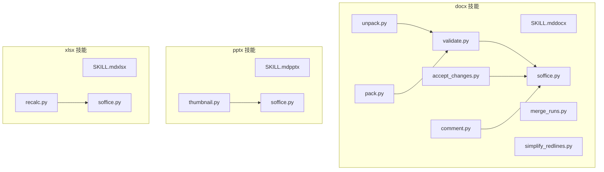
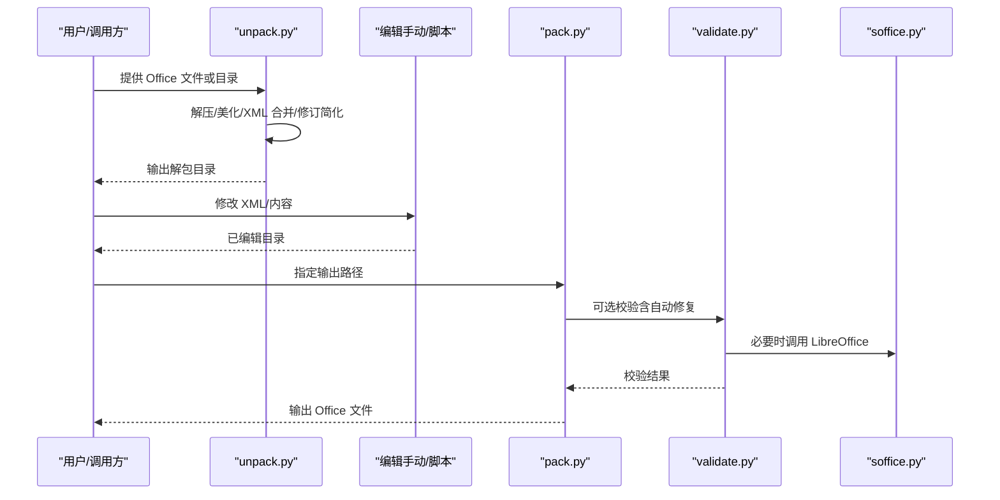
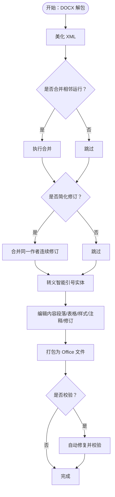
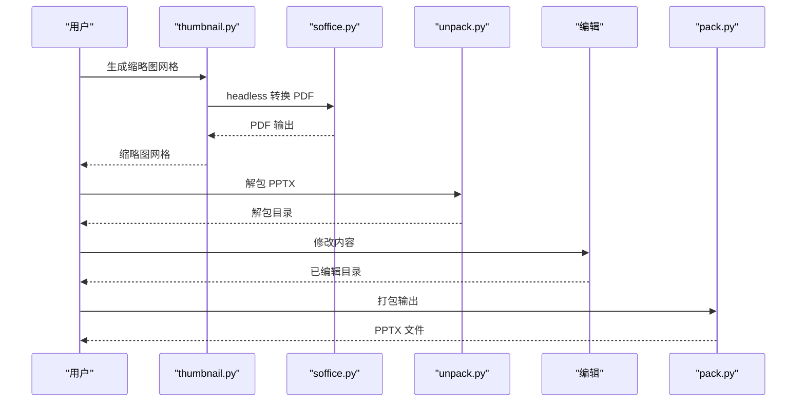
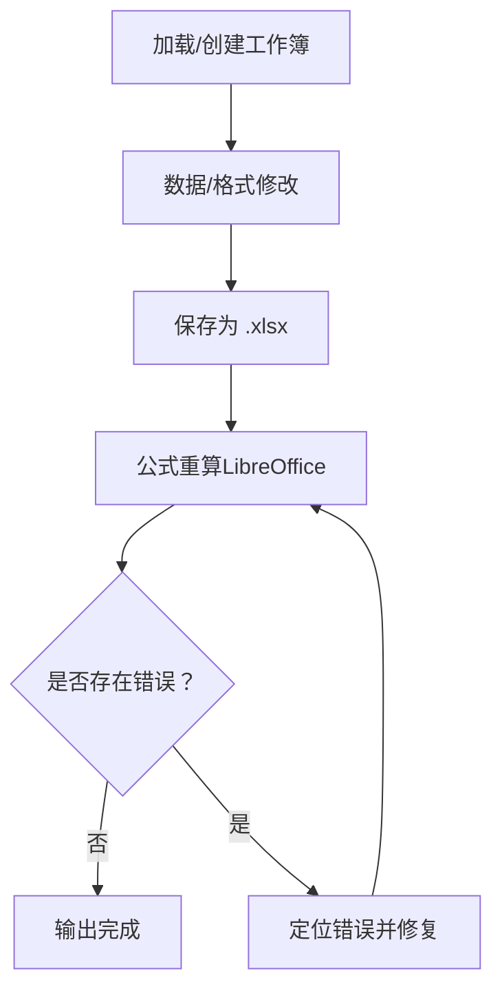
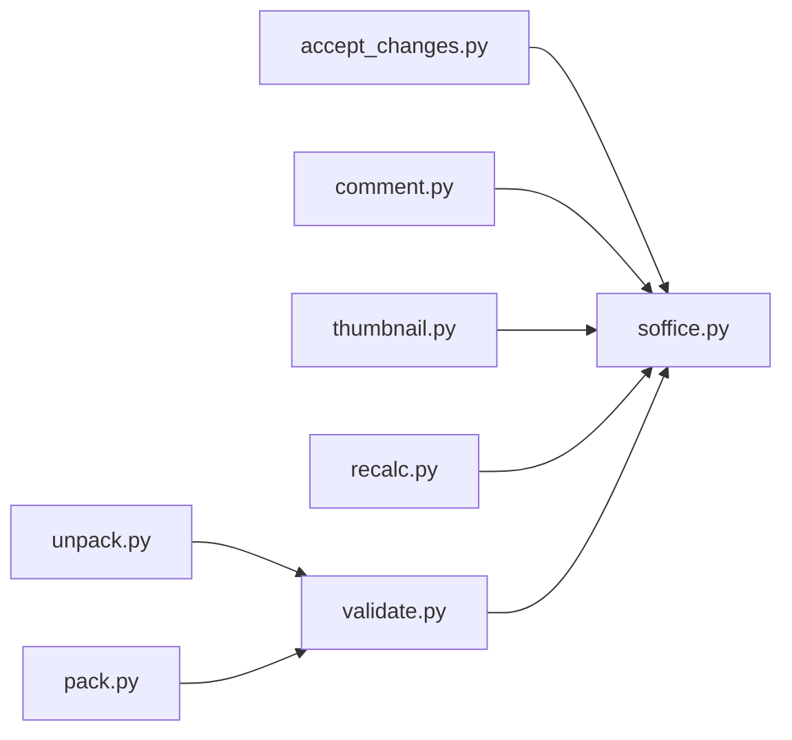

# Office 文件处理技能

<cite>
**本文引用的文件**
- [SKILL.md（docx）](file://xiaopaw/skills/docx/SKILL.md)
- [SKILL.md（pptx）](file://xiaopaw/skills/pptx/SKILL.md)
- [SKILL.md（xlsx）](file://xiaopaw/skills/xlsx/SKILL.md)
- [unpack.py（docx 脚本）](file://xiaopaw/skills/docx/scripts/office/unpack.py)
- [pack.py（docx 脚本）](file://xiaopaw/skills/docx/scripts/office/pack.py)
- [validate.py（docx 验证器）](file://xiaopaw/skills/docx/scripts/office/validate.py)
- [soffice.py（docx/pptx/xlsx 助手）](file://xiaopaw/skills/docx/scripts/office/soffice.py)
- [merge_runs.py（docx 辅助）](file://xiaopaw/skills/docx/scripts/office/helpers/merge_runs.py)
- [simplify_redlines.py（docx 辅助）](file://xiaopaw/skills/docx/scripts/office/helpers/simplify_redlines.py)
- [accept_changes.py（docx 辅助）](file://xiaopaw/skills/docx/scripts/accept_changes.py)
- [comment.py（docx 辅助）](file://xiaopaw/skills/docx/scripts/comment.py)
- [thumbnail.py（pptx 辅助）](file://xiaopaw/skills/pptx/scripts/thumbnail.py)
- [recalc.py（xlsx 计算器）](file://xiaopaw/skills/xlsx/scripts/recalc.py)
</cite>

## 目录
1. [简介](#简介)
2. [项目结构](#项目结构)
3. [核心组件](#核心组件)
4. [架构总览](#架构总览)
5. [详细组件分析](#详细组件分析)
6. [依赖关系分析](#依赖关系分析)
7. [性能考量](#性能考量)
8. [故障排除指南](#故障排除指南)
9. [结论](#结论)
10. [附录](#附录)

## 简介
本文件系统化梳理 XiaoPaw v2 中 Office 文件处理技能，覆盖 DOCX、PPTX、XLSX 的解析、样式与格式处理、表格操作、验证与安全、以及性能优化策略。文档以“可读性优先”的方式组织，既面向一线使用者，也便于开发者快速定位实现细节与最佳实践。

## 项目结构
Office 技能按“功能域”组织在各子目录中，每个技能包含：
- 技能说明文档（SKILL.md），定义触发条件、工作流、最佳实践与依赖
- scripts/office 及其子模块：通用解包/打包、验证、辅助工具
- 其他专用脚本：如 PPTX 的缩略图生成、XLSX 的公式重算

图表来源
- [SKILL.md（docx）](file://xiaopaw/skills/docx/SKILL.md)
- [SKILL.md（pptx）](file://xiaopaw/skills/pptx/SKILL.md)
- [SKILL.md（xlsx）](file://xiaopaw/skills/xlsx/SKILL.md)
- [unpack.py（docx 脚本）](file://xiaopaw/skills/docx/scripts/office/unpack.py)
- [pack.py（docx 脚本）](file://xiaopaw/skills/docx/scripts/office/pack.py)
- [validate.py（docx 验证器）](file://xiaopaw/skills/docx/scripts/office/validate.py)
- [soffice.py（docx/pptx/xlsx 助手）](file://xiaopaw/skills/docx/scripts/office/soffice.py)
- [merge_runs.py（docx 辅助）](file://xiaopaw/skills/docx/scripts/office/helpers/merge_runs.py)
- [simplify_redlines.py（docx 辅助）](file://xiaopaw/skills/docx/scripts/office/helpers/simplify_redlines.py)
- [accept_changes.py（docx 辅助）](file://xiaopaw/skills/docx/scripts/accept_changes.py)
- [comment.py（docx 辅助）](file://xiaopaw/skills/docx/scripts/comment.py)
- [thumbnail.py（pptx 辅助）](file://xiaopaw/skills/pptx/scripts/thumbnail.py)
- [recalc.py（xlsx 计算器）](file://xiaopaw/skills/xlsx/scripts/recalc.py)

章节来源
- [SKILL.md（docx）](file://xiaopaw/skills/docx/SKILL.md)
- [SKILL.md（pptx）](file://xiaopaw/skills/pptx/SKILL.md)
- [SKILL.md（xlsx）](file://xiaopaw/skills/xlsx/SKILL.md)

## 核心组件
- 解包与美化：统一将 .docx/.pptx/.xlsx 解压为目录，美化 XML 并进行智能处理（如合并相邻文本运行、简化修订）。
- 打包与校验：将编辑后的目录重新压缩为 Office 文件，并执行自动修复与校验。
- LibreOffice 协作：在受限环境中通过 soffice 助手自动配置环境变量与动态库注入，确保 headless 转换与宏执行稳定。
- 专用能力：
  - DOCX：接受修订、添加评论、模板与样式处理、表格宽度与边框规范等。
  - PPTX：缩略图网格生成，辅助视觉审查与 QA。
  - XLSX：公式重算与错误扫描，颜色与格式标准，数据一致性保障。

章节来源
- [unpack.py（docx 脚本）](file://xiaopaw/skills/docx/scripts/office/unpack.py)
- [pack.py（docx 脚本）](file://xiaopaw/skills/docx/scripts/office/pack.py)
- [validate.py（docx 验证器）](file://xiaopaw/skills/docx/scripts/office/validate.py)
- [soffice.py（docx/pptx/xlsx 助手）](file://xiaopaw/skills/docx/scripts/office/soffice.py)
- [merge_runs.py（docx 辅助）](file://xiaopaw/skills/docx/scripts/office/helpers/merge_runs.py)
- [simplify_redlines.py（docx 辅助）](file://xiaopaw/skills/docx/scripts/office/helpers/simplify_redlines.py)
- [accept_changes.py（docx 辅助）](file://xiaopaw/skills/docx/scripts/accept_changes.py)
- [comment.py（docx 辅助）](file://xiaopaw/skills/docx/scripts/comment.py)
- [thumbnail.py（pptx 辅助）](file://xiaopaw/skills/pptx/scripts/thumbnail.py)
- [recalc.py（xlsx 计算器）](file://xiaopaw/skills/xlsx/scripts/recalc.py)

## 架构总览
Office 处理遵循“解包-编辑-打包-校验”的流水线，关键节点如下：
- 输入：.docx/.pptx/.xlsx 或已解包目录
- 处理：XML 美化、运行合并、修订简化、内容修改
- 输出：Office 文件或中间产物（PDF/图片）
- 安全与兼容：自动修复常见 OOXML 问题；在受限环境下通过 soffice 自动适配

图表来源
- [unpack.py（docx 脚本）](file://xiaopaw/skills/docx/scripts/office/unpack.py)
- [pack.py（docx 脚本）](file://xiaopaw/skills/docx/scripts/office/pack.py)
- [validate.py（docx 验证器）](file://xiaopaw/skills/docx/scripts/office/validate.py)
- [soffice.py（docx/pptx/xlsx 助手）](file://xiaopaw/skills/docx/scripts/office/soffice.py)

## 详细组件分析

### DOCX：解析、样式与格式处理
- 解包流程
  - 支持 .docx/.pptx/.xlsx 统一解包
  - 美化 XML、可选合并相邻运行、简化同一作者的连续修订
  - 智能替换引号实体，保证转义正确
- 编辑与打包
  - 支持对解包目录进行内容修改后重新打包
  - 打包阶段可执行自动修复与校验
- 修订与评论
  - 接受所有修订（需 LibreOffice）
  - 添加评论并生成关联关系与标记
- 样式与表格
  - 使用明确的页面尺寸与方向设置
  - 表格必须同时设置表宽与单元格宽，且使用 DXA 单位
  - 使用清晰着色避免黑底，合理设置内边距与边框

图表来源
- [unpack.py（docx 脚本）](file://xiaopaw/skills/docx/scripts/office/unpack.py)
- [merge_runs.py（docx 辅助）](file://xiaopaw/skills/docx/scripts/office/helpers/merge_runs.py)
- [simplify_redlines.py（docx 辅助）](file://xiaopaw/skills/docx/scripts/office/helpers/simplify_redlines.py)
- [comment.py（docx 辅助）](file://xiaopaw/skills/docx/scripts/comment.py)
- [accept_changes.py（docx 辅助）](file://xiaopaw/skills/docx/scripts/accept_changes.py)
- [pack.py（docx 脚本）](file://xiaopaw/skills/docx/scripts/office/pack.py)
- [validate.py（docx 验证器）](file://xiaopaw/skills/docx/scripts/office/validate.py)

章节来源
- [SKILL.md（docx）](file://xiaopaw/skills/docx/SKILL.md)
- [unpack.py（docx 脚本）](file://xiaopaw/skills/docx/scripts/office/unpack.py)
- [merge_runs.py（docx 辅助）](file://xiaopaw/skills/docx/scripts/office/helpers/merge_runs.py)
- [simplify_redlines.py（docx 辅助）](file://xiaopaw/skills/docx/scripts/office/helpers/simplify_redlines.py)
- [comment.py（docx 辅助）](file://xiaopaw/skills/docx/scripts/comment.py)
- [accept_changes.py（docx 辅助）](file://xiaopaw/skills/docx/scripts/accept_changes.py)
- [pack.py（docx 脚本）](file://xiaopaw/skills/docx/scripts/office/pack.py)
- [validate.py（docx 验证器）](file://xiaopaw/skills/docx/scripts/office/validate.py)

### PPTX：阅读、编辑与可视化审查
- 内容提取与预览
  - 文本提取：支持基于标记的提取
  - 视觉概览：生成缩略图网格，便于快速审查布局与内容
- 编辑流程
  - 通过缩略图识别模板结构，再进行解包、修改、清理与打包
- 图像导出
  - 将 PPTX 转 PDF 再转图像，支持指定分辨率与范围

图表来源
- [thumbnail.py（pptx 辅助）](file://xiaopaw/skills/pptx/scripts/thumbnail.py)
- [soffice.py（docx/pptx/xlsx 助手）](file://xiaopaw/skills/docx/scripts/office/soffice.py)
- [unpack.py（docx 脚本）](file://xiaopaw/skills/docx/scripts/office/unpack.py)
- [pack.py（docx 脚本）](file://xiaopaw/skills/docx/scripts/office/pack.py)

章节来源
- [SKILL.md（pptx）](file://xiaopaw/skills/pptx/SKILL.md)
- [thumbnail.py（pptx 辅助）](file://xiaopaw/skills/pptx/scripts/thumbnail.py)

### XLSX：表格操作与公式重算
- 数据与格式
  - 使用 pandas 进行数据分析与导出
  - 使用 openpyxl 进行复杂格式与公式维护
- 公式重算与错误检测
  - 通过 LibreOffice 宏执行重算
  - 扫描并统计常见错误类型（#REF!、#DIV/0!、#VALUE! 等）
- 标准与规范
  - 颜色编码与数字格式标准
  - 假设值集中管理与跨表引用规范
  - 零值显示与负数格式约定

图表来源
- [SKILL.md（xlsx）](file://xiaopaw/skills/xlsx/SKILL.md)
- [recalc.py（xlsx 计算器）](file://xiaopaw/skills/xlsx/scripts/recalc.py)
- [soffice.py（docx/pptx/xlsx 助手）](file://xiaopaw/skills/docx/scripts/office/soffice.py)

章节来源
- [SKILL.md（xlsx）](file://xiaopaw/skills/xlsx/SKILL.md)
- [recalc.py（xlsx 计算器）](file://xiaopaw/skills/xlsx/scripts/recalc.py)

## 依赖关系分析
- 组件耦合
  - 解包/打包与验证紧密耦合，形成“编辑-校验-修复”的闭环
  - LibreOffice 作为外部依赖，通过 soffice 助手统一注入环境变量与动态库
- 外部依赖
  - LibreOffice（soffice/headless 转换、宏执行）
  - Poppler（pdftoppm 图像导出）
  - Python 库：defusedxml、openpyxl、pillow、argparse、subprocess 等

图表来源
- [unpack.py（docx 脚本）](file://xiaopaw/skills/docx/scripts/office/unpack.py)
- [pack.py（docx 脚本）](file://xiaopaw/skills/docx/scripts/office/pack.py)
- [validate.py（docx 验证器）](file://xiaopaw/skills/docx/scripts/office/validate.py)
- [accept_changes.py（docx 辅助）](file://xiaopaw/skills/docx/scripts/accept_changes.py)
- [comment.py（docx 辅助）](file://xiaopaw/skills/docx/scripts/comment.py)
- [thumbnail.py（pptx 辅助）](file://xiaopaw/skills/pptx/scripts/thumbnail.py)
- [recalc.py（xlsx 计算器）](file://xiaopaw/skills/xlsx/scripts/recalc.py)
- [soffice.py（docx/pptx/xlsx 助手）](file://xiaopaw/skills/docx/scripts/office/soffice.py)

章节来源
- [soffice.py（docx/pptx/xlsx 助手）](file://xiaopaw/skills/docx/scripts/office/soffice.py)

## 性能考量
- 解包与打包
  - 仅对必要文件进行 XML 美化与压缩，避免重复处理
  - 在打包前进行 XML 紧缩，减少文件体积
- LibreOffice 调用
  - 通过 soffice 自动注入环境变量，避免反复初始化开销
  - 限制超时时间，防止长时间阻塞
- 图像导出
  - 控制 DPI 与分页输出，平衡质量与速度
- 表格与公式
  - 优先使用 openpyxl 的写入模式，避免不必要的读写往返
  - 公式重算采用一次性批量执行，减少多次启动成本

## 故障排除指南
- 常见问题与对策
  - 解包失败：检查输入文件是否为有效 Office 压缩包
  - XML 格式异常：启用自动修复或手动修正命名空间与元素顺序
  - 修订/评论不生效：确认作者信息一致与关联关系完整
  - LibreOffice 无法启动：检查 soffice 环境变量与动态库注入
  - 公式错误：使用 recalc.py 扫描并定位错误位置，逐项修复
- 定位步骤
  - 先进行最小化复现（仅修改关键段落/单元格）
  - 使用 validate.py 校验并查看自动修复提示
  - 对照 SKILL.md 的规则清单逐条核对（页面尺寸、表格宽度、字体与颜色等）

章节来源
- [validate.py（docx 验证器）](file://xiaopaw/skills/docx/scripts/office/validate.py)
- [soffice.py（docx/pptx/xlsx 助手）](file://xiaopaw/skills/docx/scripts/office/soffice.py)
- [recalc.py（xlsx 计算器）](file://xiaopaw/skills/xlsx/scripts/recalc.py)

## 结论
XiaoPaw v2 的 Office 技能以“可编辑的 ZIP + XML”为核心理念，结合统一的解包/打包与验证流程、LibreOffice 的强大生态，实现了对 DOCX/PPTX/XLSX 的高可靠处理。通过严格的样式与表格规范、完善的修订与评论支持，以及稳健的公式重算与错误检测，能够满足专业文档与数据模型的交付要求。

## 附录
- 最佳实践清单
  - DOCX：显式设置页面尺寸与方向；表格同时设置表宽与单元格宽；使用 DXA 单位；避免百分比宽度；使用清晰着色；保持标题层级与 TOC 一致性
  - PPTX：先生成缩略图网格进行整体审查；模板驱动修改；注意占位符清理与布局一致性
  - XLSX：集中管理假设值；使用公式而非硬编码；颜色与格式标准化；重算后再发布
- 扩展开发建议
  - 新增验证器：在 validate.py 中扩展对应类型的校验逻辑
  - 自动化修复：在 pack.py 的自动修复链路中加入新规则
  - 安全加固：对输入文件进行白名单校验与沙箱隔离
  - 性能优化：缓存 soffice 初始化状态、批量处理大文件、延迟加载大型 XML