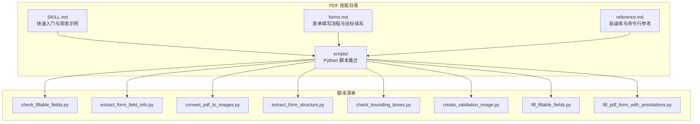
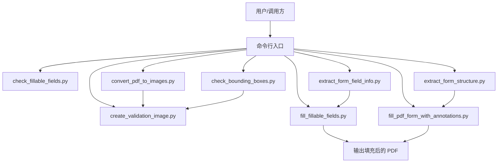
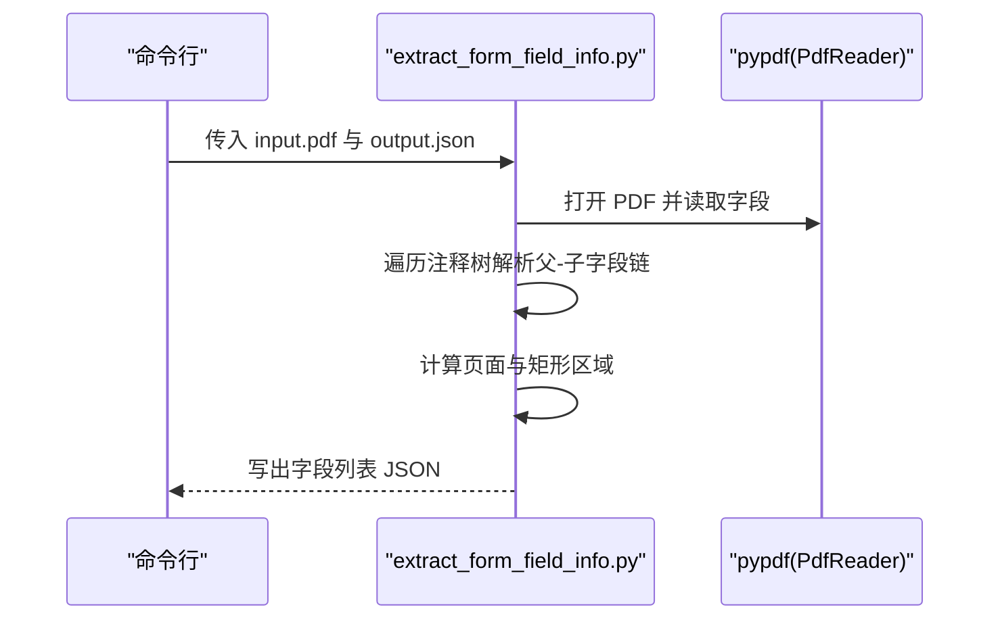
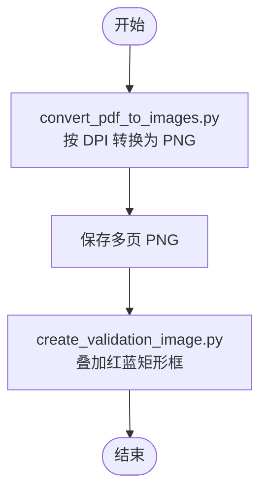
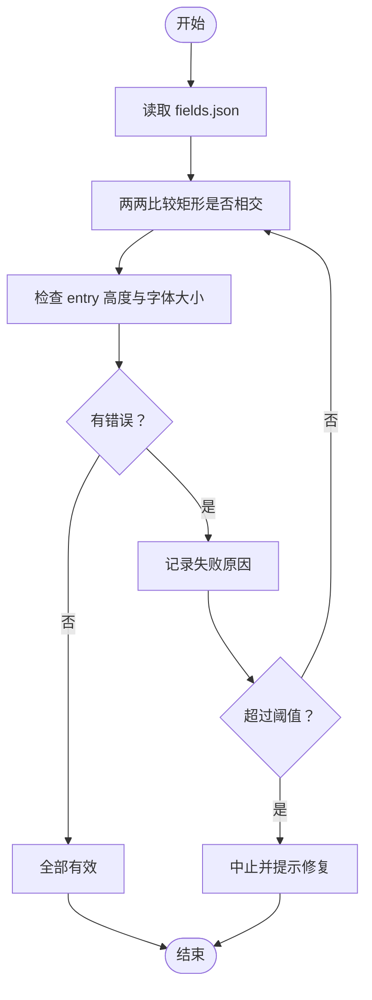
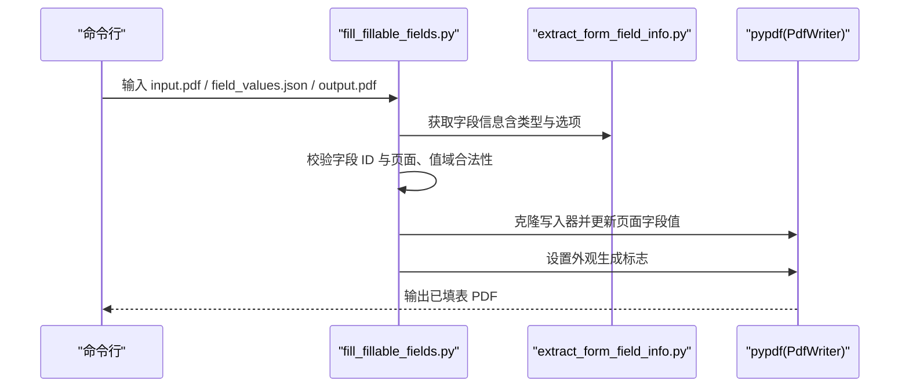
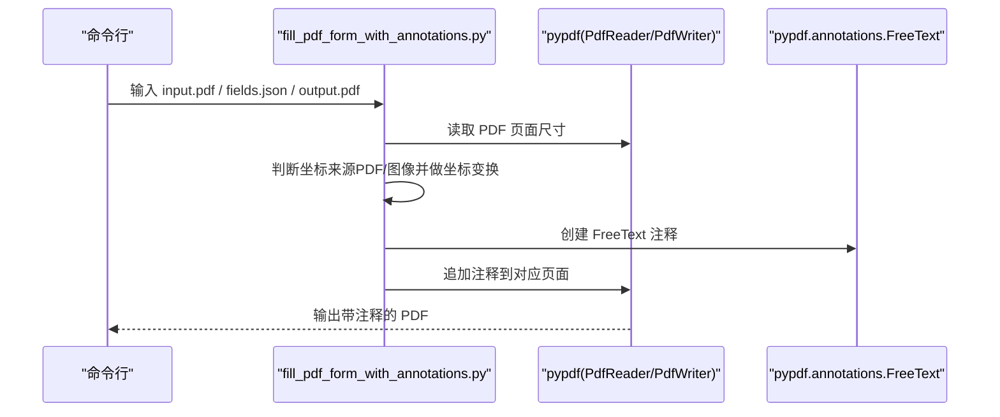
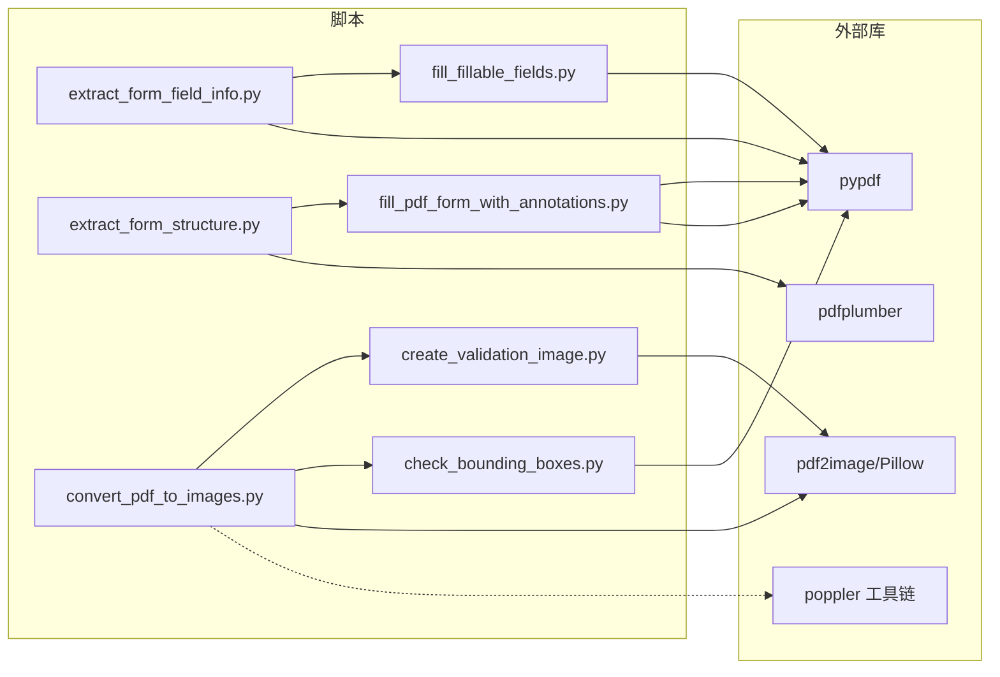

# PDF 处理技能

<cite>
**本文引用的文件**
- [SKILL.md](file://xiaopaw/skills/pdf/SKILL.md)
- [forms.md](file://xiaopaw/skills/pdf/forms.md)
- [reference.md](file://xiaopaw/skills/pdf/reference.md)
- [load_skills.yaml](file://xiaopaw/skills/load_skills.yaml)
- [check_fillable_fields.py](file://xiaopaw/skills/pdf/scripts/check_fillable_fields.py)
- [extract_form_field_info.py](file://xiaopaw/skills/pdf/scripts/extract_form_field_info.py)
- [convert_pdf_to_images.py](file://xiaopaw/skills/pdf/scripts/convert_pdf_to_images.py)
- [extract_form_structure.py](file://xiaopaw/skills/pdf/scripts/extract_form_structure.py)
- [check_bounding_boxes.py](file://xiaopaw/skills/pdf/scripts/check_bounding_boxes.py)
- [create_validation_image.py](file://xiaopaw/skills/pdf/scripts/create_validation_image.py)
- [fill_fillable_fields.py](file://xiaopaw/skills/pdf/scripts/fill_fillable_fields.py)
- [fill_pdf_form_with_annotations.py](file://xiaopaw/skills/pdf/scripts/fill_pdf_form_with_annotations.py)
- [pyproject.toml](file://pyproject.toml)
</cite>

## 目录
1. [简介](#简介)
2. [项目结构](#项目结构)
3. [核心组件](#核心组件)
4. [架构总览](#架构总览)
5. [组件详解](#组件详解)
6. [依赖关系分析](#依赖关系分析)
7. [性能与优化](#性能与优化)
8. [故障排查指南](#故障排查指南)
9. [结论](#结论)
10. [附录](#附录)

## 简介
本文件面向 XiaoPaw v2 的 PDF 处理技能，系统性阐述其脚本化工作流、数据结构、验证与安全注意事项，并提供可操作的使用示例、性能优化建议与常见问题解决方案。该技能覆盖以下能力：
- PDF 解析与基础操作（合并、拆分、旋转、元数据读取）
- 文本与表格提取（布局感知与坐标提取）
- 图像提取与转换（命令行与程序化）
- 表单字段提取与填写（可填写字段与注释标注两种路径）
- 命令行工具链与高级技巧（OCR、加密、修复等）

## 项目结构
PDF 技能位于 xiaopaw/skills/pdf 目录，包含技能说明文档与一组 Python 脚本，用于自动化处理流程。技能清单在 load_skills.yaml 中声明为 task 类型并启用。

图示来源
- [SKILL.md](file://xiaopaw/skills/pdf/SKILL.md)
- [forms.md](file://xiaopaw/skills/pdf/forms.md)
- [reference.md](file://xiaopaw/skills/pdf/reference.md)
- [load_skills.yaml](file://xiaopaw/skills/load_skills.yaml)

章节来源
- [load_skills.yaml](file://xiaopaw/skills/load_skills.yaml)
- [SKILL.md](file://xiaopaw/skills/pdf/SKILL.md)

## 核心组件
- 表单字段检测与信息提取：通过 pypdf 读取 AcroForm 字段，解析类型、页面、位置与状态值，输出结构化 JSON。
- 结构化表单结构提取：通过 pdfplumber 提取标签、横线（行边界）、复选框等几何元素，生成可用于坐标推导的数据。
- 图像转换与验证：将 PDF 按页转为 PNG，支持缩放；提供可视化验证图片与边界盒校验。
- 注释标注填表：对非可填写表单，基于结构或视觉估计生成坐标，向 PDF 添加 FreeText 注释。
- 可填写字段填表：对可填写表单，直接设置字段值并进行类型/选项合法性校验。
- 基础 PDF 操作：合并、拆分、旋转、加水印、加密等。

章节来源
- [extract_form_field_info.py](file://xiaopaw/skills/pdf/scripts/extract_form_field_info.py)
- [extract_form_structure.py](file://xiaopaw/skills/pdf/scripts/extract_form_structure.py)
- [convert_pdf_to_images.py](file://xiaopaw/skills/pdf/scripts/convert_pdf_to_images.py)
- [create_validation_image.py](file://xiaopaw/skills/pdf/scripts/create_validation_image.py)
- [check_bounding_boxes.py](file://xiaopaw/skills/pdf/scripts/check_bounding_boxes.py)
- [fill_pdf_form_with_annotations.py](file://xiaopaw/skills/pdf/scripts/fill_pdf_form_with_annotations.py)
- [fill_fillable_fields.py](file://xiaopaw/skills/pdf/scripts/fill_fillable_fields.py)

## 架构总览
PDF 技能采用“脚本化流水线”架构：以命令行入口驱动多个专用脚本，每个脚本聚焦单一职责，通过中间 JSON 文件传递结构化数据，形成可组合、可验证的工作流。

图示来源
- [check_fillable_fields.py](file://xiaopaw/skills/pdf/scripts/check_fillable_fields.py)
- [extract_form_field_info.py](file://xiaopaw/skills/pdf/scripts/extract_form_field_info.py)
- [convert_pdf_to_images.py](file://xiaopaw/skills/pdf/scripts/convert_pdf_to_images.py)
- [extract_form_structure.py](file://xiaopaw/skills/pdf/scripts/extract_form_structure.py)
- [check_bounding_boxes.py](file://xiaopaw/skills/pdf/scripts/check_bounding_boxes.py)
- [create_validation_image.py](file://xiaopaw/skills/pdf/scripts/create_validation_image.py)
- [fill_fillable_fields.py](file://xiaopaw/skills/pdf/scripts/fill_fillable_fields.py)
- [fill_pdf_form_with_annotations.py](file://xiaopaw/skills/pdf/scripts/fill_pdf_form_with_annotations.py)

## 组件详解

### 表单字段检测与信息提取
- 功能要点
  - 使用 pypdf 读取表单字段字典，识别字段类型（文本、复选框、选择框、单选组）。
  - 支持父子字段链路（如单选组），拼接完整字段 ID。
  - 计算字段所在页面与矩形区域，按页面+位置排序输出。
- 关键数据结构
  - 字段对象包含：field_id、page、rect、type、以及针对不同类型的附加属性（如复选框的 checked_value/unchecked_value、单选组的 radio_options、选择框的 choice_options）。
- 典型调用序列

图示来源
- [extract_form_field_info.py](file://xiaopaw/skills/pdf/scripts/extract_form_field_info.py)

章节来源
- [extract_form_field_info.py](file://xiaopaw/skills/pdf/scripts/extract_form_field_info.py)

### 结构化表单结构提取
- 功能要点
  - 使用 pdfplumber 提取文字词块、水平线、小矩形（复选框）。
  - 按页面统计尺寸与行边界，便于后续推导输入框区域。
- 输出结构
  - pages：每页宽高
  - labels：文本及其精确坐标
  - lines：长水平线（行边界）
  - checkboxes：候选复选框中心
  - row_boundaries：相邻行的上下边界

章节来源
- [extract_form_structure.py](file://xiaopaw/skills/pdf/scripts/extract_form_structure.py)

### 图像转换与验证
- 功能要点
  - 将 PDF 每页转换为 PNG，支持 DPI 与最大边缩放。
  - 生成验证图：在指定页上绘制 label 与 entry 边界盒，辅助人工核验。
- 流程图

图示来源
- [convert_pdf_to_images.py](file://xiaopaw/skills/pdf/scripts/convert_pdf_to_images.py)
- [create_validation_image.py](file://xiaopaw/skills/pdf/scripts/create_validation_image.py)

章节来源
- [convert_pdf_to_images.py](file://xiaopaw/skills/pdf/scripts/convert_pdf_to_images.py)
- [create_validation_image.py](file://xiaopaw/skills/pdf/scripts/create_validation_image.py)

### 边界盒校验
- 功能要点
  - 检查同一页面内 label 与 entry 是否重叠。
  - 检查 entry 高度是否小于字体大小。
  - 限制最多输出若干条错误提示，避免噪声。
- 流程图

图示来源
- [check_bounding_boxes.py](file://xiaopaw/skills/pdf/scripts/check_bounding_boxes.py)

章节来源
- [check_bounding_boxes.py](file://xiaopaw/skills/pdf/scripts/check_bounding_boxes.py)

### 可填写字段填表
- 功能要点
  - 读取字段值 JSON，按页面聚合后写入表单。
  - 对字段类型进行合法性校验（复选框/单选组/选择框的有效值范围）。
  - 修补 pypdf 的某些字段属性读取差异，确保选项列表正确。
- 序列图

图示来源
- [fill_fillable_fields.py](file://xiaopaw/skills/pdf/scripts/fill_fillable_fields.py)
- [extract_form_field_info.py](file://xiaopaw/skills/pdf/scripts/extract_form_field_info.py)

章节来源
- [fill_fillable_fields.py](file://xiaopaw/skills/pdf/scripts/fill_fillable_fields.py)

### 注释标注填表（非可填写表单）
- 功能要点
  - 自动识别坐标系统（PDF 坐标或图像坐标），进行坐标变换。
  - 在目标区域添加 FreeText 注释，支持字体、字号、颜色。
  - 支持混合坐标（结构提取用 PDF 坐标，视觉估计用图像坐标时自动转换）。
- 序列图

图示来源
- [fill_pdf_form_with_annotations.py](file://xiaopaw/skills/pdf/scripts/fill_pdf_form_with_annotations.py)

章节来源
- [fill_pdf_form_with_annotations.py](file://xiaopaw/skills/pdf/scripts/fill_pdf_form_with_annotations.py)

### 基础 PDF 操作与命令行工具
- 合并与拆分、旋转、加水印、加密等基础操作可通过 pypdf 实现。
- 命令行工具（如 qpdf、pdftotext、pdfimages）提供高性能替代方案，适合批量与运维场景。
- OCR（扫描版 PDF）可借助 pdf2image + pytesseract 完成。

章节来源
- [SKILL.md](file://xiaopaw/skills/pdf/SKILL.md)
- [reference.md](file://xiaopaw/skills/pdf/reference.md)

## 依赖关系分析
- 脚本间依赖
  - extract_form_field_info.py 与 fill_fillable_fields.py 协作，前者输出字段信息，后者消费并写回表单。
  - extract_form_structure.py 与 fill_pdf_form_with_annotations.py 协作，前者输出结构，后者据此生成注释。
  - convert_pdf_to_images.py 与 create_validation_image.py/ check_bounding_boxes.py 协作，用于人工核验与质量控制。
- 外部库依赖
  - pypdf：表单读取、写入、注释、页面操作
  - pdfplumber：结构化文本/表格提取、几何元素识别
  - pdf2image + Pillow：图像转换与可视化
  - poppler 工具链：命令行文本/图像提取与优化

图示来源
- [fill_fillable_fields.py](file://xiaopaw/skills/pdf/scripts/fill_fillable_fields.py)
- [fill_pdf_form_with_annotations.py](file://xiaopaw/skills/pdf/scripts/fill_pdf_form_with_annotations.py)
- [extract_form_field_info.py](file://xiaopaw/skills/pdf/scripts/extract_form_field_info.py)
- [extract_form_structure.py](file://xiaopaw/skills/pdf/scripts/extract_form_structure.py)
- [convert_pdf_to_images.py](file://xiaopaw/skills/pdf/scripts/convert_pdf_to_images.py)
- [create_validation_image.py](file://xiaopaw/skills/pdf/scripts/create_validation_image.py)
- [check_bounding_boxes.py](file://xiaopaw/skills/pdf/scripts/check_bounding_boxes.py)

章节来源
- [pyproject.toml](file://pyproject.toml)

## 性能与优化
- 大文件处理
  - 优先使用命令行工具（如 qpdf 分页拆分、pdfimages 提取图像）以降低内存占用。
  - 对超大 PDF 采用分块处理策略，避免一次性加载。
- 文本与表格提取
  - 纯文本：pdftotext -bbox-layout 最快；结构化数据：pdfplumber。
  - 表格复杂场景：调整 pdfplumber 的提取策略参数并配合可视化调试。
- 图像提取
  - 原始质量提取优先使用 pdfimages；预览用低分辨率，最终用高分辨率。
- 表单填写
  - 可填写字段：优先使用 pdf-lib（JS）保持表单结构；Python 端可用 pypdf，但需注意兼容性修补。
  - 非可填写字段：尽量先结构提取，再结合少量视觉估计，减少注释数量与渲染成本。
- 内存管理
  - 逐页处理、及时释放中间对象；批处理时记录日志并捕获异常。

章节来源
- [reference.md](file://xiaopaw/skills/pdf/reference.md)

## 故障排查指南
- 加密/权限问题
  - 使用 qpdf 检查与移除密码；Python 端读取前确认解密成功。
- 文本提取异常
  - 扫描版 PDF：先转图像再 OCR；若仍失败，检查图像质量与语言模型配置。
- 表单字段不匹配
  - 核对字段 ID 与页面号；复核值域（复选框/单选组/选择框）。
- 坐标不准确
  - 使用 create_validation_image.py 与 check_bounding_boxes.py 校验；必要时放大裁剪精修。
- 性能瓶颈
  - 大文件拆分、降低分辨率、避免重复渲染；优先使用命令行工具。

章节来源
- [reference.md](file://xiaopaw/skills/pdf/reference.md)
- [check_bounding_boxes.py](file://xiaopaw/skills/pdf/scripts/check_bounding_boxes.py)

## 结论
PDF 技能在 XiaoPaw v2 中以脚本化流水线形式提供从解析、提取、转换到填表的全链路能力。通过明确的中间数据格式与严格的校验机制，既保证了可维护性，也提升了可扩展性。建议在生产环境中结合命令行工具与 Python 脚本，按任务特性选择最优路径，并持续完善坐标校验与异常处理流程。

## 附录

### 使用示例（步骤化）
- 可填写表单
  1) 检查是否可填写：python scripts/check_fillable_fields.py <file.pdf>
  2) 提取字段信息：python scripts/extract_form_field_info.py <input.pdf> <field_info.json>
  3) 可选：将 PDF 转为图片辅助定位：python scripts/convert_pdf_to_images.py <file.pdf> <output_dir>
  4) 编写字段值 JSON（field_values.json）
  5) 填写并输出：python scripts/fill_fillable_fields.py <input.pdf> <field_values.json> <output.pdf>
- 非可填写表单
  1) 结构提取：python scripts/extract_form_structure.py <input.pdf> form_structure.json
  2) 若无结构标签，转图片后进行视觉估计，生成 fields.json
  3) 校验边界盒：python scripts/check_bounding_boxes.py fields.json
  4) 注释填表：python scripts/fill_pdf_form_with_annotations.py <input.pdf> fields.json <output.pdf>
- 图像与文本
  - 图像提取：pdfimages -j <input.pdf> <prefix>
  - 文本提取：pdftotext -layout <input.pdf> <output.txt>
- 基础操作
  - 合并/拆分/旋转/加水印/加密：参考 SKILL.md 与 reference.md 的示例与命令行片段

章节来源
- [forms.md](file://xiaopaw/skills/pdf/forms.md)
- [SKILL.md](file://xiaopaw/skills/pdf/SKILL.md)
- [reference.md](file://xiaopaw/skills/pdf/reference.md)