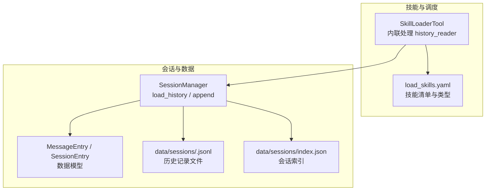
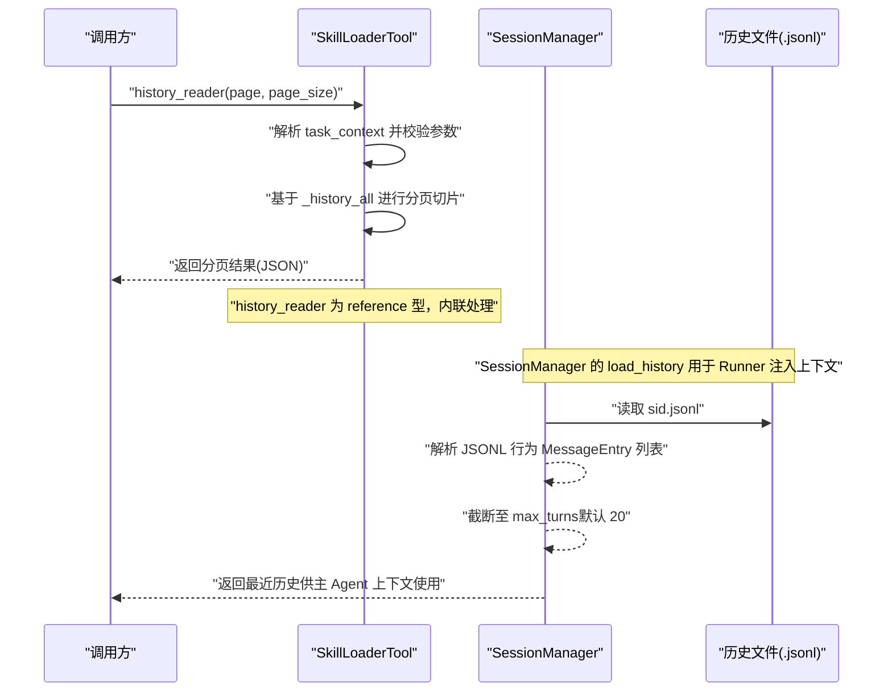
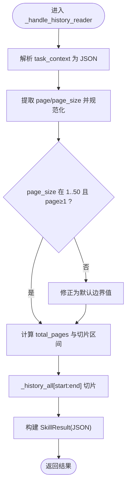
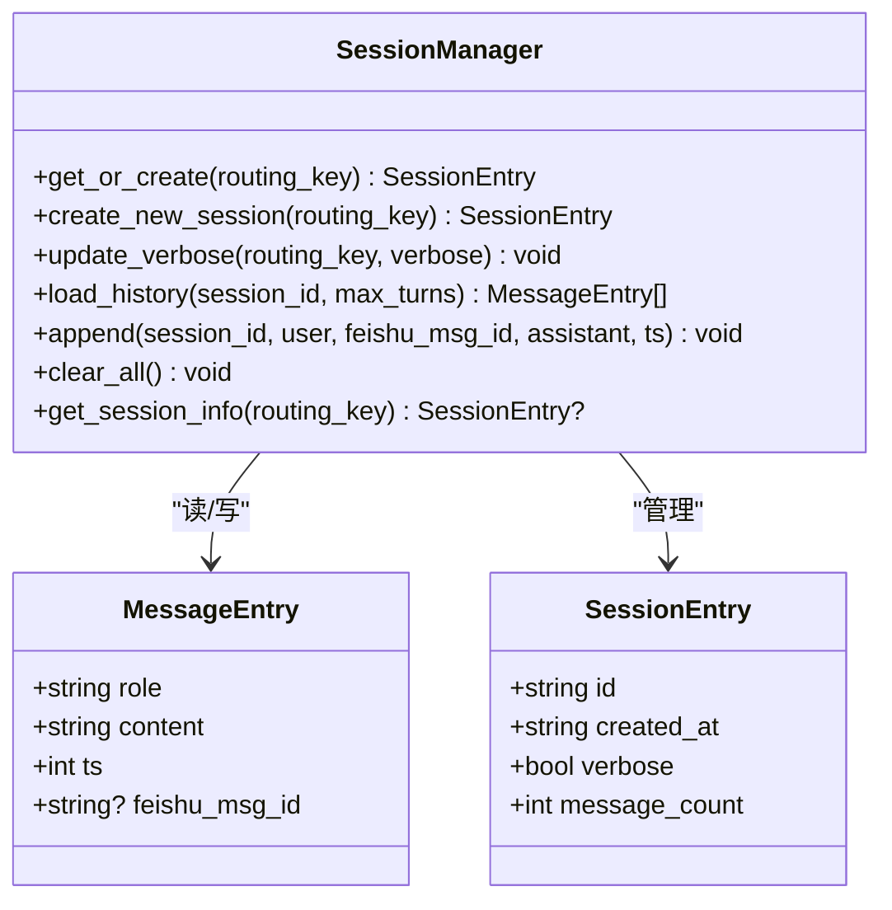
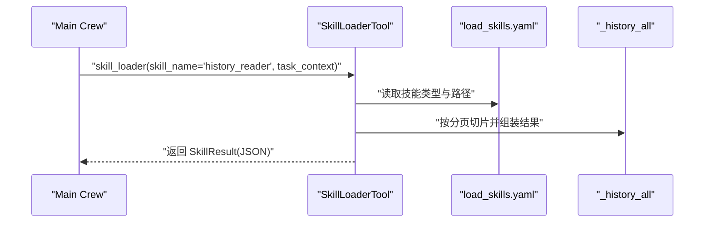
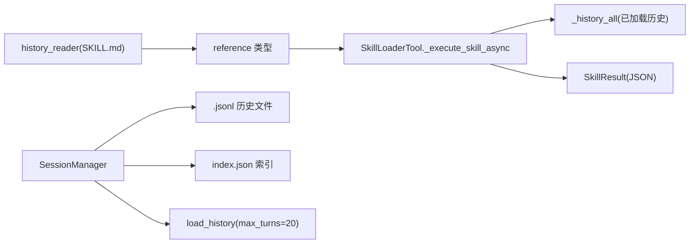

# 历史读取技能

<cite>
**本文引用的文件**
- [SKILL.md](file://xiaopaw/skills/history_reader/SKILL.md)
- [load_skills.yaml](file://xiaopaw/skills/load_skills.yaml)
- [manager.py](file://xiaopaw/session/manager.py)
- [models.py](file://xiaopaw/session/models.py)
- [skill_loader.py](file://xiaopaw/tools/skill_loader.py)
- [02-modules.md](file://docs/02-modules.md)
- [03-data.md](file://docs/03-data.md)
- [DESIGN.md](file://DESIGN.md)
- [README.md](file://README.md)
</cite>

## 目录
1. [简介](#简介)
2. [项目结构](#项目结构)
3. [核心组件](#核心组件)
4. [架构总览](#架构总览)
5. [组件详解](#组件详解)
6. [依赖关系分析](#依赖关系分析)
7. [性能考量](#性能考量)
8. [故障排查指南](#故障排查指南)
9. [结论](#结论)
10. [附录](#附录)

## 简介
历史读取技能用于在会话历史被截断时，按分页方式读取当前会话的完整历史对话记录。该技能由系统内联处理，无需沙盒执行，适合在主 Agent 上下文之外回溯早期对话，满足“回顾/复盘/引用早期结论”等常见需求。

- 技能类型：reference（参考型，内联）
- 会话数据存储：会话历史以 JSONL 文件按会话 ID 存储，索引文件负责路由与元信息
- 分页策略：按页码与页大小返回历史消息，支持从最旧到最新的顺序翻页

## 项目结构
与历史读取技能直接相关的模块与文件如下：
- 技能清单与类型声明：xiaopaw/skills/load_skills.yaml
- 技能说明文档：xiaopaw/skills/history_reader/SKILL.md
- 会话管理与历史读取：xiaopaw/session/manager.py、xiaopaw/session/models.py
- 技能调度与内联处理：xiaopaw/tools/skill_loader.py
- 文档与设计说明：docs/02-modules.md、docs/03-data.md、DESIGN.md、README.md

图表来源
- [skill_loader.py:361-391](file://xiaopaw/tools/skill_loader.py#L361-L391)
- [manager.py:111-130](file://xiaopaw/session/manager.py#L111-L130)
- [models.py:18-38](file://xiaopaw/session/models.py#L18-L38)
- [load_skills.yaml:36-38](file://xiaopaw/skills/load_skills.yaml#L36-L38)

章节来源
- [load_skills.yaml:36-38](file://xiaopaw/skills/load_skills.yaml#L36-L38)
- [SKILL.md:1-72](file://xiaopaw/skills/history_reader/SKILL.md#L1-L72)
- [manager.py:111-130](file://xiaopaw/session/manager.py#L111-L130)
- [models.py:18-38](file://xiaopaw/session/models.py#L18-L38)
- [skill_loader.py:361-391](file://xiaopaw/tools/skill_loader.py#L361-L391)
- [02-modules.md:1050-1057](file://docs/02-modules.md#L1050-L1057)
- [03-data.md:750-767](file://docs/03-data.md#L750-L767)
- [DESIGN.md:394-395](file://DESIGN.md#L394-L395)
- [README.md:326-326](file://README.md#L326-L326)

## 核心组件
- 历史读取技能（reference 型）：由 SkillLoaderTool 内联处理，直接基于已加载的历史消息进行分页切片与返回
- SessionManager：负责会话索引与历史文件的读写，提供 load_history 与 append 等能力
- 数据模型：MessageEntry 描述单条消息（角色、内容、时间戳、飞书消息 ID），SessionEntry 描述会话元信息
- 技能清单：load_skills.yaml 声明 history_reader 为 reference 类型，不启用 Sub-Crew

章节来源
- [SKILL.md:1-72](file://xiaopaw/skills/history_reader/SKILL.md#L1-L72)
- [manager.py:111-130](file://xiaopaw/session/manager.py#L111-L130)
- [models.py:18-38](file://xiaopaw/session/models.py#L18-L38)
- [load_skills.yaml:36-38](file://xiaopaw/skills/load_skills.yaml#L36-L38)

## 架构总览
历史读取技能的调用路径与数据流如下：

图表来源
- [skill_loader.py:361-391](file://xiaopaw/tools/skill_loader.py#L361-L391)
- [manager.py:111-130](file://xiaopaw/session/manager.py#L111-L130)
- [03-data.md:750-767](file://docs/03-data.md#L750-L767)

章节来源
- [skill_loader.py:361-391](file://xiaopaw/tools/skill_loader.py#L361-L391)
- [manager.py:111-130](file://xiaopaw/session/manager.py#L111-L130)
- [03-data.md:750-767](file://docs/03-data.md#L750-L767)

## 组件详解

### 历史读取技能（reference 型）
- 技能类型：reference（内联，不启用 Sub-Crew）
- 输入参数（task_context）：
  - page：页码，从 1 开始，默认 1（最旧的消息）
  - page_size：每页条数，1-50，默认 20
- 输出格式（SkillResult）：
  - errcode：整数，0 表示成功
  - message：字符串，描述本次分页读取情况
  - data.messages：消息数组，每项包含 role、content、ts
  - data.total/page/page_size/total_pages：统计信息
- 分页规则：page=1 返回最旧的 page_size 条，page 越大越新；如需最新消息，使用较大 page 或直接从主 Agent 上下文获取

图表来源
- [skill_loader.py:361-391](file://xiaopaw/tools/skill_loader.py#L361-L391)

章节来源
- [SKILL.md:25-71](file://xiaopaw/skills/history_reader/SKILL.md#L25-L71)
- [skill_loader.py:361-391](file://xiaopaw/tools/skill_loader.py#L361-L391)

### SessionManager 与历史文件
- 历史文件：每个会话一个 JSONL 文件，按时间顺序追加消息行
- 索引文件：index.json 记录路由键到会话列表的映射，以及活跃会话 ID
- load_history：
  - 读取 sid.jsonl，逐行解析为 MessageEntry
  - 截断策略：默认返回最近 max_turns（20）条，用于主 Agent 上下文
- append：
  - 为每个会话维护独立锁，保证并发安全
  - 追加用户与助手消息各一行

图表来源
- [manager.py:38-183](file://xiaopaw/session/manager.py#L38-L183)
- [models.py:18-38](file://xiaopaw/session/models.py#L18-L38)

章节来源
- [manager.py:111-130](file://xiaopaw/session/manager.py#L111-L130)
- [models.py:18-38](file://xiaopaw/session/models.py#L18-L38)
- [02-modules.md:269-317](file://docs/02-modules.md#L269-L317)

### 技能注册与内联处理
- load_skills.yaml 声明 history_reader 为 reference 类型，不启用 Sub-Crew
- SkillLoaderTool：
  - 解析 SKILL.md 获取技能说明（reference 型时仅注入说明）
  - history_reader：直接在 _execute_skill_async 中内联处理，不走 Sub-Crew
  - 返回结构化 JSON，遵循 SkillResult 规范

图表来源
- [load_skills.yaml:36-38](file://xiaopaw/skills/load_skills.yaml#L36-L38)
- [skill_loader.py:392-449](file://xiaopaw/tools/skill_loader.py#L392-L449)

章节来源
- [load_skills.yaml:36-38](file://xiaopaw/skills/load_skills.yaml#L36-L38)
- [skill_loader.py:392-449](file://xiaopaw/tools/skill_loader.py#L392-L449)
- [03-data.md:750-767](file://docs/03-data.md#L750-L767)

## 依赖关系分析
- 技能类型依赖：history_reader 在 load_skills.yaml 中声明为 reference，因此 SkillLoaderTool 内联处理
- 数据依赖：历史读取依赖 SessionManager 的历史文件与索引；主 Agent 上下文依赖 SessionManager 的 load_history 截断逻辑
- 并发与锁：append 使用 per-session 锁，load_history 通过线程池执行 IO，避免阻塞事件循环

图表来源
- [SKILL.md:1-72](file://xiaopaw/skills/history_reader/SKILL.md#L1-L72)
- [load_skills.yaml:36-38](file://xiaopaw/skills/load_skills.yaml#L36-L38)
- [skill_loader.py:392-449](file://xiaopaw/tools/skill_loader.py#L392-L449)
- [manager.py:111-130](file://xiaopaw/session/manager.py#L111-L130)

章节来源
- [SKILL.md:1-72](file://xiaopaw/skills/history_reader/SKILL.md#L1-L72)
- [load_skills.yaml:36-38](file://xiaopaw/skills/load_skills.yaml#L36-L38)
- [skill_loader.py:392-449](file://xiaopaw/tools/skill_loader.py#L392-L449)
- [manager.py:111-130](file://xiaopaw/session/manager.py#L111-L130)

## 性能考量
- 历史读取为内联处理，不涉及沙盒与外部服务，延迟低
- SessionManager 的 load_history 使用线程池执行 IO，避免阻塞事件循环
- 建议：
  - 合理设置 page_size（1-50），避免单次返回过大
  - 对于超大历史，优先使用较大 page 获取较新的记录，减少扫描范围
  - 若需频繁回溯早期对话，建议结合 search_memory 技能进行语义检索

章节来源
- [02-modules.md:288-317](file://docs/02-modules.md#L288-L317)
- [02-modules.md:295-309](file://docs/02-modules.md#L295-L309)
- [03-data.md:248-274](file://docs/03-data.md#L248-L274)

## 故障排查指南
- 未找到技能：确认 load_skills.yaml 中 history_reader 已启用且类型为 reference
- 参数异常：检查 task_context 是否为合法 JSON，page 与 page_size 是否在允许范围内
- 历史为空：确认会话 ID 正确且历史文件存在；若刚创建会话，尚未有历史记录属正常
- 并发写入：如遇写入冲突，确认 append 使用 per-session 锁，避免竞态

章节来源
- [load_skills.yaml:36-38](file://xiaopaw/skills/load_skills.yaml#L36-L38)
- [skill_loader.py:442-449](file://xiaopaw/tools/skill_loader.py#L442-L449)
- [manager.py:132-154](file://xiaopaw/session/manager.py#L132-L154)

## 结论
历史读取技能以 reference 型内联实现，具备低延迟、易用性强的特点，适合在主 Agent 上下文之外回溯早期对话。其与 SessionManager 的紧密协作确保了会话数据的可靠存储与高效读取。结合合理的分页参数与配套的记忆检索技能，可满足多样化的对话回顾与知识回溯需求。

## 附录

### 使用示例与参数说明
- 输入参数（task_context）：
  - page：页码，从 1 开始，默认 1
  - page_size：每页条数，1-50，默认 20
- 输出字段：
  - data.messages：消息数组（role/content/ts）
  - data.total/page/page_size/total_pages：统计信息
- 调用方式：通过 skill_loader 调用 history_reader，并传入 task_context

章节来源
- [SKILL.md:25-71](file://xiaopaw/skills/history_reader/SKILL.md#L25-L71)
- [skill_loader.py:361-391](file://xiaopaw/tools/skill_loader.py#L361-L391)

### 数据格式与存储
- 历史文件：data/sessions/{sid}.jsonl，每行一条 JSON 行，按时间顺序追加
- 索引文件：data/sessions/index.json，记录路由键到会话列表的映射
- 截断策略：load_history 默认返回最近 20 条，用于主 Agent 上下文

章节来源
- [manager.py:111-130](file://xiaopaw/session/manager.py#L111-L130)
- [03-data.md:45-45](file://docs/03-data.md#L45-L45)
- [03-data.md:248-274](file://docs/03-data.md#L248-L274)

### 扩展开发指南
- 新增 reference 型技能：在 load_skills.yaml 中声明 type: reference，并在 SKILL.md 中编写说明
- 内联处理：在 SkillLoaderTool 中新增分支处理逻辑，遵循 SkillResult 规范
- 并发与安全：参考 SessionManager 的锁策略与线程池使用，避免阻塞事件循环

章节来源
- [load_skills.yaml:1-55](file://xiaopaw/skills/load_skills.yaml#L1-L55)
- [DESIGN.md:394-395](file://DESIGN.md#L394-L395)
- [02-modules.md:295-309](file://docs/02-modules.md#L295-L309)