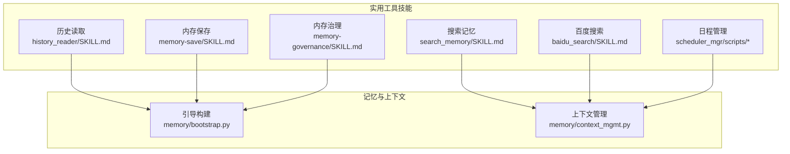
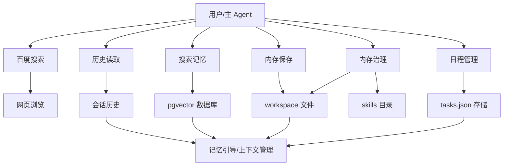
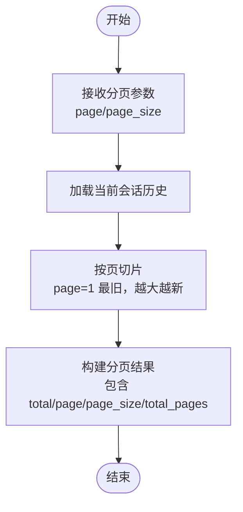
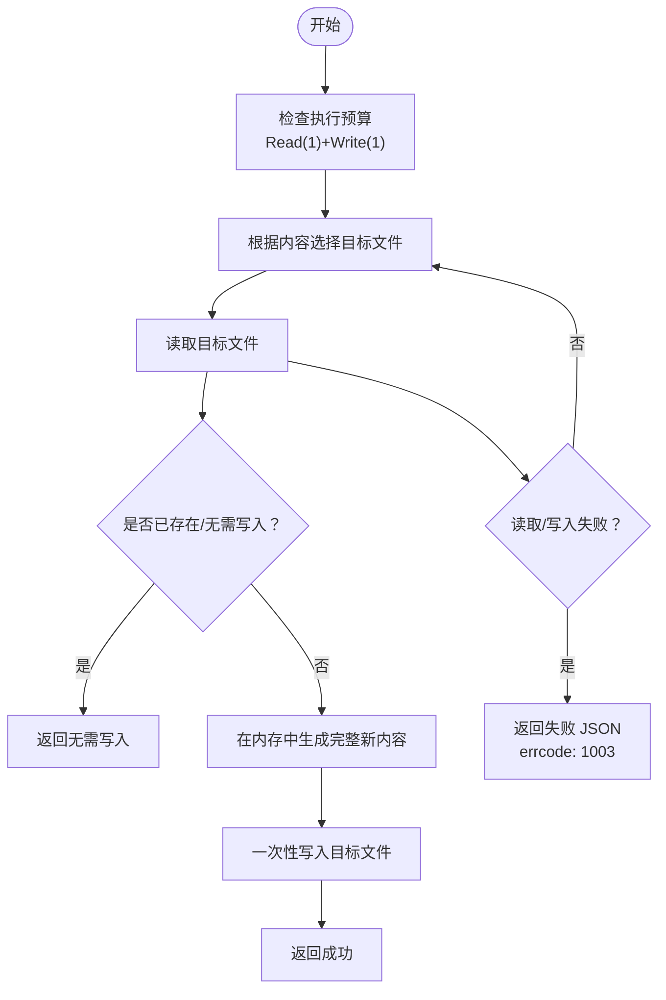
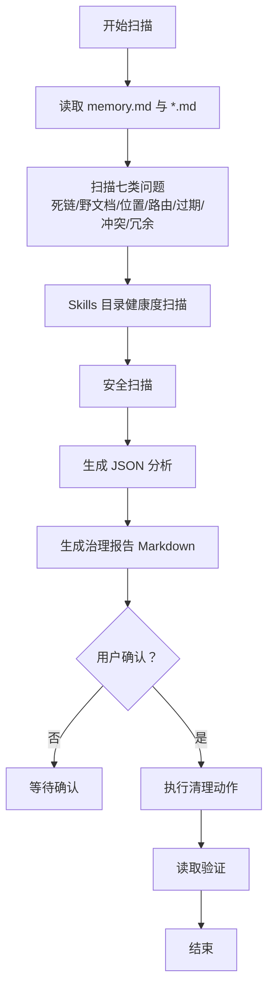
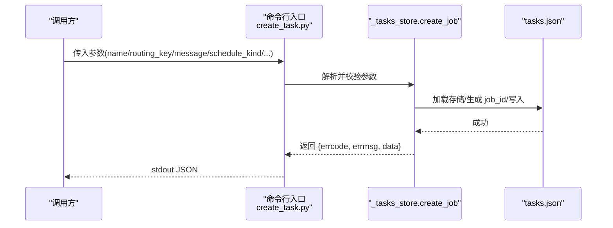
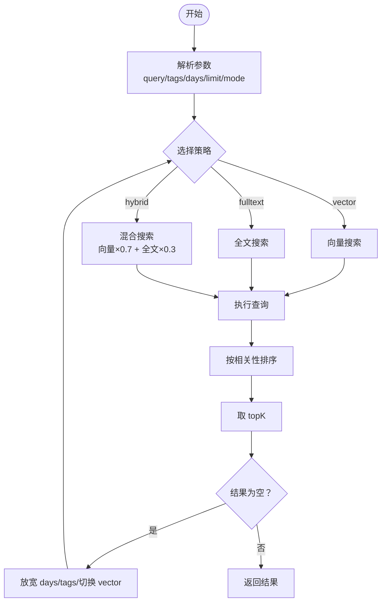
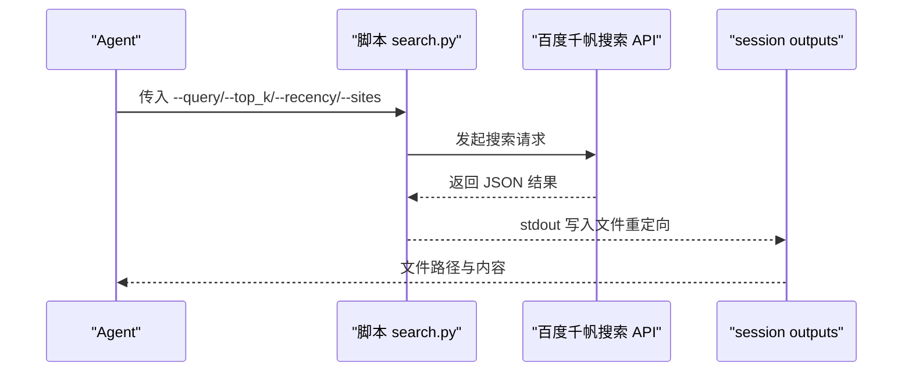
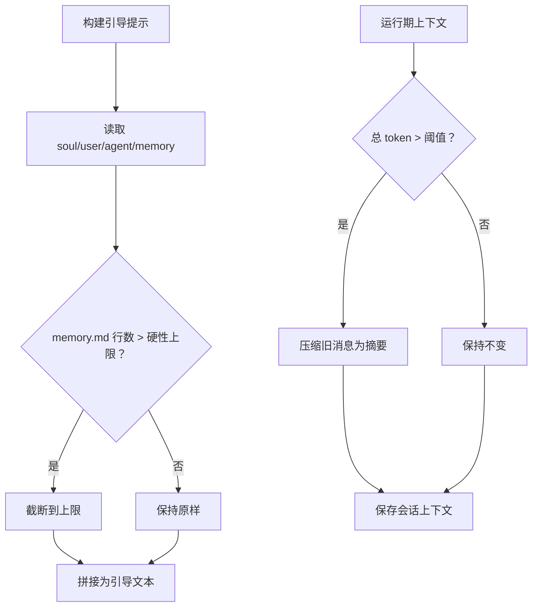
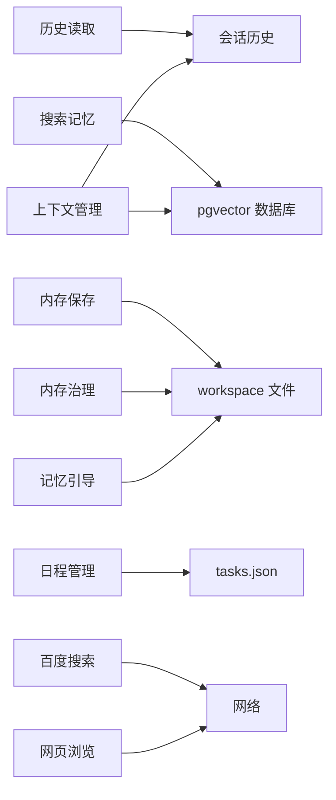

# 实用工具技能

<cite>
**本文引用的文件**
- [history_reader/SKILL.md](file://xiaopaw/skills/history_reader/SKILL.md)
- [memory-save/SKILL.md](file://xiaopaw/skills/memory-save/SKILL.md)
- [memory-governance/SKILL.md](file://xiaopaw/skills/memory-governance/SKILL.md)
- [scheduler_mgr/scripts/_tasks_store.py](file://xiaopaw/skills/scheduler_mgr/scripts/_tasks_store.py)
- [scheduler_mgr/scripts/create_task.py](file://xiaopaw/skills/scheduler_mgr/scripts/create_task.py)
- [scheduler_mgr/scripts/list_tasks.py](file://xiaopaw/skills/scheduler_mgr/scripts/list_tasks.py)
- [scheduler_mgr/scripts/delete_task.py](file://xiaopaw/skills/scheduler_mgr/scripts/delete_task.py)
- [scheduler_mgr/scripts/update_task.py](file://xiaopaw/skills/scheduler_mgr/scripts/update_task.py)
- [search_memory/SKILL.md](file://xiaopaw/skills/search_memory/SKILL.md)
- [baidu_search/SKILL.md](file://xiaopaw/skills/baidu_search/SKILL.md)
- [bootstrap.py](file://xiaopaw/memory/bootstrap.py)
- [context_mgmt.py](file://xiaopaw/memory/context_mgmt.py)
</cite>

## 目录
1. [简介](#简介)
2. [项目结构](#项目结构)
3. [核心组件](#核心组件)
4. [架构总览](#架构总览)
5. [详细组件分析](#详细组件分析)
6. [依赖分析](#依赖分析)
7. [性能考虑](#性能考虑)
8. [故障排查指南](#故障排查指南)
9. [结论](#结论)
10. [附录](#附录)

## 简介
本文件聚焦 XiaoPaw v2 的“实用工具技能”，系统化解析以下能力：
- 历史读取：从当前会话历史中分页检索早期对话，辅助上下文不足场景
- 内存保存：将对话中的关键信息持久化到 workspace 文件，确保跨会话可用
- 内存治理：定期审计与清理记忆文件与技能目录，防止上下文腐化、冗余与安全风险
- 日程管理：基于本地 JSON 存储的任务调度器，支持一次性(at)、周期性(every)与 Cron(cron)三种调度
- 搜索记忆：基于向量与全文的混合检索，快速召回历史对话片段
- 网页浏览：与搜索技能配合，抓取并解析网页内容，支撑事实核查与深度阅读

这些工具技能在系统中既可独立使用，也可组合协作：历史读取与搜索记忆用于“回溯”上下文，内存保存与治理保障“长期记忆”的质量与安全，日程管理驱动“定时任务”，网页浏览为“事实核查”提供数据来源。

## 项目结构
围绕实用工具技能的关键目录与文件：
- 历史读取：xiaopaw/skills/history_reader/SKILL.md
- 内存保存：xiaopaw/skills/memory-save/SKILL.md
- 内存治理：xiaopaw/skills/memory-governance/SKILL.md
- 日程管理：xiaopaw/skills/scheduler_mgr/scripts/*（任务存储与 CRUD）
- 搜索记忆：xiaopaw/skills/search_memory/SKILL.md
- 百度搜索：xiaopaw/skills/baidu_search/SKILL.md
- 记忆引导：xiaopaw/memory/bootstrap.py（从 workspace 文件构建引导提示）
- 上下文管理：xiaopaw/memory/context_mgmt.py（压缩、裁剪、持久化）

图表来源
- [history_reader/SKILL.md:1-72](file://xiaopaw/skills/history_reader/SKILL.md#L1-L72)
- [memory-save/SKILL.md:1-98](file://xiaopaw/skills/memory-save/SKILL.md#L1-L98)
- [memory-governance/SKILL.md:1-225](file://xiaopaw/skills/memory-governance/SKILL.md#L1-L225)
- [search_memory/SKILL.md:1-135](file://xiaopaw/skills/search_memory/SKILL.md#L1-L135)
- [baidu_search/SKILL.md:1-181](file://xiaopaw/skills/baidu_search/SKILL.md#L1-L181)
- [bootstrap.py:1-37](file://xiaopaw/memory/bootstrap.py#L1-L37)
- [context_mgmt.py:1-99](file://xiaopaw/memory/context_mgmt.py#L1-L99)

章节来源
- [history_reader/SKILL.md:1-72](file://xiaopaw/skills/history_reader/SKILL.md#L1-L72)
- [memory-save/SKILL.md:1-98](file://xiaopaw/skills/memory-save/SKILL.md#L1-L98)
- [memory-governance/SKILL.md:1-225](file://xiaopaw/skills/memory-governance/SKILL.md#L1-L225)
- [search_memory/SKILL.md:1-135](file://xiaopaw/skills/search_memory/SKILL.md#L1-L135)
- [baidu_search/SKILL.md:1-181](file://xiaopaw/skills/baidu_search/SKILL.md#L1-L181)
- [bootstrap.py:1-37](file://xiaopaw/memory/bootstrap.py#L1-L37)
- [context_mgmt.py:1-99](file://xiaopaw/memory/context_mgmt.py#L1-L99)

## 核心组件
- 历史读取：面向当前会话的历史分页检索，避免上下文截断带来的信息缺失
- 内存保存：单次 Read + 单次 Write 的严格预算，确保跨会话记忆的可靠性与一致性
- 内存治理：七类扫描与安全审计，生成治理报告并经用户确认后执行清理
- 日程管理：统一的任务存储与 CRUD 接口，支持 at/every/cron 三种调度
- 搜索记忆：pgvector 向量与全文混合检索，支持标签、时间窗与多策略
- 百度搜索：网络检索与结果保存规范，强调“一步完成搜索+保存”
- 记忆引导：从 soul/user/agent/memory 文件构建系统引导，控制记忆上限
- 上下文管理：消息压缩、裁剪与会话上下文持久化，保障长对话稳定性

章节来源
- [history_reader/SKILL.md:1-72](file://xiaopaw/skills/history_reader/SKILL.md#L1-L72)
- [memory-save/SKILL.md:1-98](file://xiaopaw/skills/memory-save/SKILL.md#L1-L98)
- [memory-governance/SKILL.md:1-225](file://xiaopaw/skills/memory-governance/SKILL.md#L1-L225)
- [scheduler_mgr/scripts/_tasks_store.py:1-322](file://xiaopaw/skills/scheduler_mgr/scripts/_tasks_store.py#L1-L322)
- [search_memory/SKILL.md:1-135](file://xiaopaw/skills/search_memory/SKILL.md#L1-L135)
- [baidu_search/SKILL.md:1-181](file://xiaopaw/skills/baidu_search/SKILL.md#L1-L181)
- [bootstrap.py:1-37](file://xiaopaw/memory/bootstrap.py#L1-L37)
- [context_mgmt.py:1-99](file://xiaopaw/memory/context_mgmt.py#L1-L99)

## 架构总览
实用工具技能在系统中的角色与交互：
- 历史读取与搜索记忆：在上下文不足时回溯历史，前者按页读取，后者按语义/全文检索
- 内存保存与治理：前者负责“写入”，后者负责“审计与清理”，二者共同保证长期记忆的质量与安全
- 日程管理：以任务为中心，将 routing_key 与 message 组织为可调度单元，落地到 JSON 存储
- 百度搜索与网页浏览：前者提供外部事实，后者提供网页内容解析，二者常配合使用
- 记忆引导与上下文管理：前者决定初始上下文规模与来源，后者决定运行期上下文的压缩与持久化

图表来源
- [history_reader/SKILL.md:1-72](file://xiaopaw/skills/history_reader/SKILL.md#L1-L72)
- [search_memory/SKILL.md:1-135](file://xiaopaw/skills/search_memory/SKILL.md#L1-L135)
- [memory-save/SKILL.md:1-98](file://xiaopaw/skills/memory-save/SKILL.md#L1-L98)
- [memory-governance/SKILL.md:1-225](file://xiaopaw/skills/memory-governance/SKILL.md#L1-L225)
- [scheduler_mgr/scripts/_tasks_store.py:1-322](file://xiaopaw/skills/scheduler_mgr/scripts/_tasks_store.py#L1-L322)
- [baidu_search/SKILL.md:1-181](file://xiaopaw/skills/baidu_search/SKILL.md#L1-L181)
- [bootstrap.py:1-37](file://xiaopaw/memory/bootstrap.py#L1-L37)
- [context_mgmt.py:1-99](file://xiaopaw/memory/context_mgmt.py#L1-L99)

## 详细组件分析

### 历史读取（history_reader）
- 作用：在主 Agent 上下文截断后，按页读取早期对话，支持分页与结构化返回
- 关键点：由系统内联处理，无需沙盒；输入为分页参数；输出包含消息列表与分页统计
- 使用场景：用户追问早期内容、回顾历史、统计关键决策

图表来源
- [history_reader/SKILL.md:1-72](file://xiaopaw/skills/history_reader/SKILL.md#L1-L72)

章节来源
- [history_reader/SKILL.md:1-72](file://xiaopaw/skills/history_reader/SKILL.md#L1-L72)

### 内存保存（memory-save）
- 作用：将对话中的关键信息写入 workspace 文件，确保跨会话可用
- 预算与约束：仅允许一次 Read + 一次 Write；目标路径严格限定；失败即刻返回，严禁静默绕道
- 写入策略：按目标类型（soul/user/agent/topic）进行替换/追加/勾选/删除等操作
- 返回格式：成功/放弃/失败三态，失败时携带明确 errcode 与 message

图表来源
- [memory-save/SKILL.md:1-98](file://xiaopaw/skills/memory-save/SKILL.md#L1-L98)

章节来源
- [memory-save/SKILL.md:1-98](file://xiaopaw/skills/memory-save/SKILL.md#L1-L98)

### 内存治理（memory-governance）
- 作用：定期审计 workspace 记忆文件与 skills 目录，生成治理报告并经用户确认后清理
- 扫描维度：记忆健康、野文档、位置合规、路由错配、过期文件、表述冲突、表述冗余、技能健康、安全扫描
- 流程：扫描生成 JSON 分析 → 生成 Markdown 报告 → 用户确认 → 清理执行 → 读取验证
- 重要原则：用户确认前不执行任何变更；执行后必须读取验证

图表来源
- [memory-governance/SKILL.md:1-225](file://xiaopaw/skills/memory-governance/SKILL.md#L1-L225)

章节来源
- [memory-governance/SKILL.md:1-225](file://xiaopaw/skills/memory-governance/SKILL.md#L1-L225)

### 日程管理（scheduler_mgr）
- 作用：统一的任务调度与存储，支持 at/every/cron 三种调度类型
- 存储：tasks.json，采用原子写入（tmp + rename）保证一致性
- 接口：list/create/delete/update，参数校验严格，错误返回明确
- 时区与时间：cron 支持 tz；at/every 明确时间单位与校验

图表来源
- [scheduler_mgr/scripts/create_task.py:1-39](file://xiaopaw/skills/scheduler_mgr/scripts/create_task.py#L1-L39)
- [scheduler_mgr/scripts/_tasks_store.py:1-322](file://xiaopaw/skills/scheduler_mgr/scripts/_tasks_store.py#L1-L322)

章节来源
- [scheduler_mgr/scripts/create_task.py:1-39](file://xiaopaw/skills/scheduler_mgr/scripts/create_task.py#L1-L39)
- [scheduler_mgr/scripts/list_tasks.py:1-16](file://xiaopaw/skills/scheduler_mgr/scripts/list_tasks.py#L1-L16)
- [scheduler_mgr/scripts/delete_task.py:1-21](file://xiaopaw/skills/scheduler_mgr/scripts/delete_task.py#L1-L21)
- [scheduler_mgr/scripts/update_task.py:1-50](file://xiaopaw/skills/scheduler_mgr/scripts/update_task.py#L1-L50)
- [scheduler_mgr/scripts/_tasks_store.py:1-322](file://xiaopaw/skills/scheduler_mgr/scripts/_tasks_store.py#L1-L322)

### 搜索记忆（search_memory）
- 作用：在 pgvector 数据库中检索历史对话，支持语义向量、全文与混合搜索
- 数据库：memories 表，包含摘要向量、原始消息向量、全文索引等
- 调用：通过命令行参数传入 query/tags/days/limit/mode，返回按相关性排序的结果
- 策略：根据场景选择 pure vector/fulltext/hybrid；空结果时按顺序放宽条件重试

图表来源
- [search_memory/SKILL.md:1-135](file://xiaopaw/skills/search_memory/SKILL.md#L1-L135)

章节来源
- [search_memory/SKILL.md:1-135](file://xiaopaw/skills/search_memory/SKILL.md#L1-L135)

### 百度搜索（baidu_search）
- 作用：通过百度千帆搜索 API 获取网络结果，返回标题、URL 与摘要
- 保存规范：必须使用 shell 重定向保存结果，避免 file_operations 的类型限制
- 工具调用：MCP 工具参数类型严格（布尔/数字/路径），错误写法会导致执行失败
- 依赖与建议：依赖 requests；top_k 选择策略随场景变化

图表来源
- [baidu_search/SKILL.md:1-181](file://xiaopaw/skills/baidu_search/SKILL.md#L1-L181)

章节来源
- [baidu_search/SKILL.md:1-181](file://xiaopaw/skills/baidu_search/SKILL.md#L1-L181)

### 记忆引导与上下文管理
- 记忆引导：从 soul/user/agent/memory 文件构建引导提示，其中 memory.md 会被截断至硬性上限
- 上下文管理：在消息超过阈值时进行压缩（提取式摘要），或裁剪工具结果，同时提供会话上下文的持久化与原始日志追加

图表来源
- [bootstrap.py:1-37](file://xiaopaw/memory/bootstrap.py#L1-L37)
- [context_mgmt.py:1-99](file://xiaopaw/memory/context_mgmt.py#L1-L99)

章节来源
- [bootstrap.py:1-37](file://xiaopaw/memory/bootstrap.py#L1-L37)
- [context_mgmt.py:1-99](file://xiaopaw/memory/context_mgmt.py#L1-L99)

## 依赖分析
- 历史读取与搜索记忆依赖会话历史与 pgvector 数据库；两者互补：前者按页回溯，后者按语义召回
- 内存保存与治理依赖 workspace 文件系统；治理为保存提供“质量保障”
- 日程管理依赖 tasks.json 存储；其 CRUD 与调度参数校验保证任务生命周期可控
- 百度搜索与网页浏览配合：前者提供 URL 列表，后者抓取具体内容
- 记忆引导与上下文管理贯穿系统初始化与运行期，决定初始上下文规模与运行期稳定性

图表来源
- [history_reader/SKILL.md:1-72](file://xiaopaw/skills/history_reader/SKILL.md#L1-L72)
- [search_memory/SKILL.md:1-135](file://xiaopaw/skills/search_memory/SKILL.md#L1-L135)
- [memory-save/SKILL.md:1-98](file://xiaopaw/skills/memory-save/SKILL.md#L1-L98)
- [memory-governance/SKILL.md:1-225](file://xiaopaw/skills/memory-governance/SKILL.md#L1-L225)
- [scheduler_mgr/scripts/_tasks_store.py:1-322](file://xiaopaw/skills/scheduler_mgr/scripts/_tasks_store.py#L1-L322)
- [baidu_search/SKILL.md:1-181](file://xiaopaw/skills/baidu_search/SKILL.md#L1-L181)
- [bootstrap.py:1-37](file://xiaopaw/memory/bootstrap.py#L1-L37)
- [context_mgmt.py:1-99](file://xiaopaw/memory/context_mgmt.py#L1-L99)

章节来源
- [history_reader/SKILL.md:1-72](file://xiaopaw/skills/history_reader/SKILL.md#L1-L72)
- [search_memory/SKILL.md:1-135](file://xiaopaw/skills/search_memory/SKILL.md#L1-L135)
- [memory-save/SKILL.md:1-98](file://xiaopaw/skills/memory-save/SKILL.md#L1-L98)
- [memory-governance/SKILL.md:1-225](file://xiaopaw/skills/memory-governance/SKILL.md#L1-L225)
- [scheduler_mgr/scripts/_tasks_store.py:1-322](file://xiaopaw/skills/scheduler_mgr/scripts/_tasks_store.py#L1-L322)
- [baidu_search/SKILL.md:1-181](file://xiaopaw/skills/baidu_search/SKILL.md#L1-L181)
- [bootstrap.py:1-37](file://xiaopaw/memory/bootstrap.py#L1-L37)
- [context_mgmt.py:1-99](file://xiaopaw/memory/context_mgmt.py#L1-L99)

## 性能考虑
- 历史读取：分页避免一次性加载过多消息；建议优先使用最新页，必要时再翻页
- 内存保存：严格预算（Read+Write 各一次）减少 IO；写入前在内存中生成完整内容，降低多次写入开销
- 内存治理：定期执行（如超过 150 行）可显著降低上下文腐化带来的注意力稀释与 API 成本上升
- 日程管理：统一存储与原子写入避免并发竞争；合理设置 delete_after_run 降低存储膨胀
- 搜索记忆：混合搜索在大多数场景效果最佳；空结果时按顺序放宽条件，减少无效重试
- 百度搜索：top_k 选择应与问题精度需求匹配；结果保存使用重定向避免二次写入
- 记忆引导与上下文管理：压缩阈值与保留回合数需结合模型上下文限制与对话复杂度调整

## 故障排查指南
- 内存保存失败
  - 现象：返回 errcode 1003，message 包含原始错误
  - 排查：确认目标路径是否在允许范围内；检查权限与只读文件系统；避免静默绕道
  - 处置：立即返回失败，不尝试替代路径或命令行 chmod/cp
- 日程管理参数错误
  - 现象：errcode=1，errmsg 指明无效的 schedule.kind 或缺少必需字段
  - 排查：核对 cron/at/every 的必需参数；at 需 at_ms，every 需 every_ms，cron 需 expr
  - 处置：按建议补充参数后重试
- 搜索记忆无结果
  - 现象：返回空数组
  - 排查：先去掉 days 限制，再去掉 tags，最后切换为 vector 模式
  - 处置：逐步放宽条件，避免盲目扩大 topK
- 百度搜索结果保存异常
  - 现象：file_operations 写入失败
  - 排查：确认使用 shell 重定向保存；路径使用绝对路径
  - 处置：按规范一步完成搜索+保存，避免中间层写入
- 记忆引导截断
  - 现象：memory.md 超过硬性上限被截断
  - 排查：关注治理报告；必要时执行治理清理
  - 处置：定期治理，避免上下文膨胀影响模型表现

章节来源
- [memory-save/SKILL.md:1-98](file://xiaopaw/skills/memory-save/SKILL.md#L1-L98)
- [scheduler_mgr/scripts/_tasks_store.py:1-322](file://xiaopaw/skills/scheduler_mgr/scripts/_tasks_store.py#L1-L322)
- [search_memory/SKILL.md:1-135](file://xiaopaw/skills/search_memory/SKILL.md#L1-L135)
- [baidu_search/SKILL.md:1-181](file://xiaopaw/skills/baidu_search/SKILL.md#L1-L181)
- [bootstrap.py:1-37](file://xiaopaw/memory/bootstrap.py#L1-L37)

## 结论
实用工具技能在 XiaoPaw v2 中承担“回溯上下文、持久化记忆、治理长期知识、编排定时任务、检索历史、获取外部事实”的关键职责。通过严格的执行预算、参数校验与治理流程，系统在可用性与安全性之间取得平衡。建议在日常使用中：
- 优先使用搜索记忆与历史读取回溯上下文
- 使用内存保存与治理保障长期记忆质量
- 通过日程管理编排自动化任务
- 百度搜索与网页浏览配合，提升事实核查效率
- 结合记忆引导与上下文管理，维持稳定的对话体验

## 附录
- 使用场景速览
  - 历史读取：用户追问早期内容、回顾历史、统计决策
  - 内存保存：用户表达偏好/习惯、纠正 Agent 行为、记录关键事实
  - 内存治理：接近 150+ 行或用户请求清理、审计技能目录
  - 日程管理：一次性提醒、周期性任务、Cron 定时
  - 搜索记忆：语义/全文/混合检索，支持标签与时间窗
  - 百度搜索：最新资讯、技术问题、精准事实查询
- 扩展开发建议
  - 新增工具技能时，遵循 allowed-tools 与执行预算
  - 严格区分“内联处理”与“沙盒执行”，避免不必要的隔离成本
  - 重视失败即刻返回与读取验证，确保可观测与可恢复
  - 为工具技能提供清晰的输入/输出规范与错误码约定