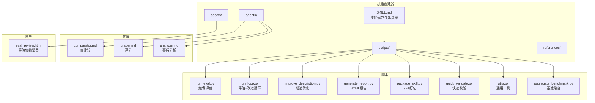
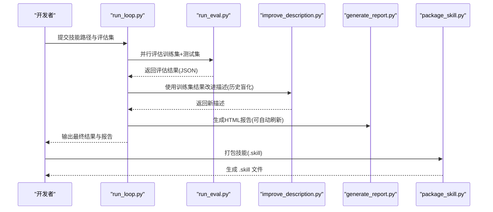
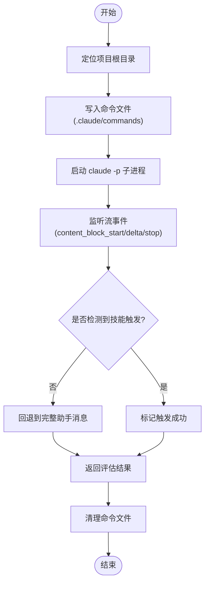
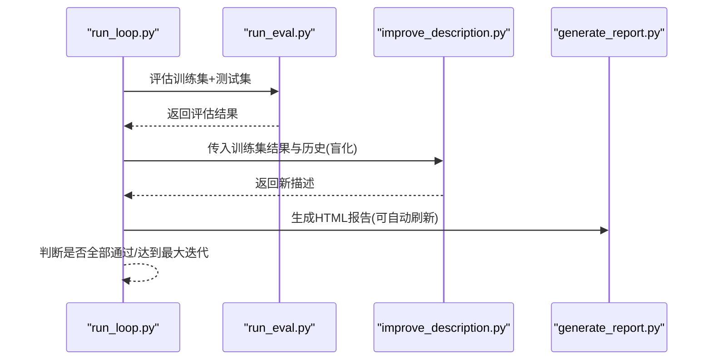
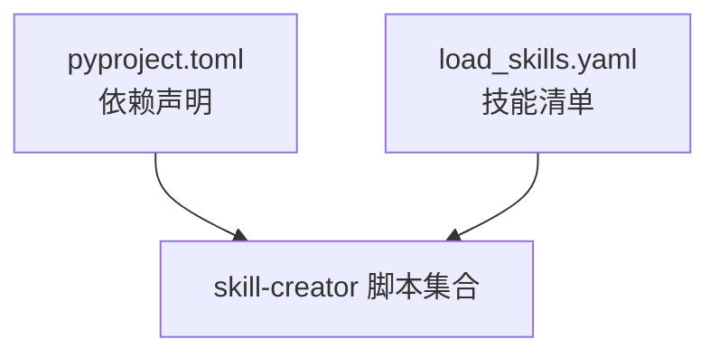

# 技能创建器

<cite>
**本文引用的文件**
- [SKILL.md](file://xiaopaw/skills/skill-creator/SKILL.md)
- [package_skill.py](file://xiaopaw/skills/skill-creator/scripts/package_skill.py)
- [run_eval.py](file://xiaopaw/skills/skill-creator/scripts/run_eval.py)
- [generate_report.py](file://xiaopaw/skills/skill-creator/scripts/generate_report.py)
- [run_loop.py](file://xiaopaw/skills/skill-creator/scripts/run_loop.py)
- [improve_description.py](file://xiaopaw/skills/skill-creator/scripts/improve_description.py)
- [quick_validate.py](file://xiaopaw/skills/skill-creator/scripts/quick_validate.py)
- [utils.py](file://xiaopaw/skills/skill-creator/scripts/utils.py)
- [analyzer.md](file://xiaopaw/skills/skill-creator/agents/analyzer.md)
- [comparator.md](file://xiaopaw/skills/skill-creator/agents/comparator.md)
- [grader.md](file://xiaopaw/skills/skill-creator/agents/grader.md)
- [aggregate_benchmark.py](file://xiaopaw/skills/skill-creator/scripts/aggregate_benchmark.py)
- [eval_review.html](file://xiaopaw/skills/skill-creator/assets/eval_review.html)
- [load_skills.yaml](file://xiaopaw/skills/load_skills.yaml)
- [pyproject.toml](file://pyproject.toml)
</cite>

## 目录
1. [简介](#简介)
2. [项目结构](#项目结构)
3. [核心组件](#核心组件)
4. [架构总览](#架构总览)
5. [详细组件分析](#详细组件分析)
6. [依赖关系分析](#依赖关系分析)
7. [性能考量](#性能考量)
8. [故障排查指南](#故障排查指南)
9. [结论](#结论)
10. [附录](#附录)

## 简介
本文件面向 XiaoPaw v2 的技能创建器，系统化阐述从技能开发、评估、打包到发布的完整流程；深入解析技能描述优化的评估体系、质量控制与自动化测试机制；提供最佳实践、模板使用与扩展指南，并给出具体开发示例、评估报告生成与技能优化建议。

技能创建器的核心目标是：将可重复的工作流固化为高质量、可触发、可维护的技能，支持自动化的触发评估、描述优化、基准评测与可视化报告生成，最终形成可分发的 .skill 包。

## 项目结构
技能创建器位于 xiaopaw/skills/skill-creator 目录下，主要由以下部分组成：
- 脚本层：用于触发评估、描述优化、报告生成、打包与快速校验
- 代理层：用于盲比较、评分与事后分析
- 资产与模板：HTML 评估集编辑器、评测报告模板
- 配置与清单：技能清单 load_skills.yaml，项目依赖 pyproject.toml

图表来源
- [SKILL.md:1-157](file://xiaopaw/skills/skill-creator/SKILL.md#L1-L157)
- [run_eval.py:1-311](file://xiaopaw/skills/skill-creator/scripts/run_eval.py#L1-L311)
- [run_loop.py:1-329](file://xiaopaw/skills/skill-creator/scripts/run_loop.py#L1-L329)
- [improve_description.py:1-248](file://xiaopaw/skills/skill-creator/scripts/improve_description.py#L1-L248)
- [generate_report.py:1-327](file://xiaopaw/skills/skill-creator/scripts/generate_report.py#L1-L327)
- [package_skill.py:1-137](file://xiaopaw/skills/skill-creator/scripts/package_skill.py#L1-L137)
- [quick_validate.py:1-103](file://xiaopaw/skills/skill-creator/scripts/quick_validate.py#L1-L103)
- [utils.py:1-48](file://xiaopaw/skills/skill-creator/scripts/utils.py#L1-L48)
- [aggregate_benchmark.py:1-402](file://xiaopaw/skills/skill-creator/scripts/aggregate_benchmark.py#L1-L402)
- [eval_review.html:1-147](file://xiaopaw/skills/skill-creator/assets/eval_review.html#L1-L147)
- [comparator.md:1-203](file://xiaopaw/skills/skill-creator/agents/comparator.md#L1-L203)
- [grader.md:1-224](file://xiaopaw/skills/skill-creator/agents/grader.md#L1-L224)
- [analyzer.md:1-275](file://xiaopaw/skills/skill-creator/agents/analyzer.md#L1-L275)

章节来源
- [SKILL.md:1-157](file://xiaopaw/skills/skill-creator/SKILL.md#L1-L157)
- [load_skills.yaml:1-55](file://xiaopaw/skills/load_skills.yaml#L1-L55)

## 核心组件
- 触发评估 run_eval.py：基于 Claude Code 的 claude -p 子进程，读取技能描述，构造命令文件，流式监听事件以尽早判定是否触发，统计触发率并输出 JSON 结果。
- 描述优化 run_loop.py + improve_description.py：结合训练/测试集拆分、并行评估、历史盲化、迭代改进，生成最优描述；支持实时 HTML 报告与结果目录落盘。
- 报告生成 generate_report.py：将 run_loop 输出转换为交互式 HTML 报表，标注训练/测试列与得分等级，支持自动刷新。
- 打包 package_skill.py：对技能目录进行白名单/黑名单过滤，校验后打包为 .skill 文件（zip）。
- 快速校验 quick_validate.py：最小化校验 SKILL.md 元数据格式、字段类型与长度限制。
- 代理 agents：comparator（盲比较）、grader（评分）、analyzer（事后分析），用于客观对比不同技能版本或执行输出。
- 基准聚合 aggregate_benchmark.py：从多次运行的 grading.json 聚合统计，生成基准报告与 Markdown 概要。
- 评估集编辑器 eval_review.html：可视化编辑评估集，导出 JSON。

章节来源
- [run_eval.py:1-311](file://xiaopaw/skills/skill-creator/scripts/run_eval.py#L1-L311)
- [run_loop.py:1-329](file://xiaopaw/skills/skill-creator/scripts/run_loop.py#L1-L329)
- [improve_description.py:1-248](file://xiaopaw/skills/skill-creator/scripts/improve_description.py#L1-L248)
- [generate_report.py:1-327](file://xiaopaw/skills/skill-creator/scripts/generate_report.py#L1-L327)
- [package_skill.py:1-137](file://xiaopaw/skills/skill-creator/scripts/package_skill.py#L1-L137)
- [quick_validate.py:1-103](file://xiaopaw/skills/skill-creator/scripts/quick_validate.py#L1-L103)
- [comparator.md:1-203](file://xiaopaw/skills/skill-creator/agents/comparator.md#L1-L203)
- [grader.md:1-224](file://xiaopaw/skills/skill-creator/agents/grader.md#L1-L224)
- [analyzer.md:1-275](file://xiaopaw/skills/skill-creator/agents/analyzer.md#L1-L275)
- [aggregate_benchmark.py:1-402](file://xiaopaw/skills/skill-creator/scripts/aggregate_benchmark.py#L1-L402)
- [eval_review.html:1-147](file://xiaopaw/skills/skill-creator/assets/eval_review.html#L1-L147)

## 架构总览
技能创建器采用“脚本驱动 + 代理协作”的流水线式架构：
- 输入：技能目录（含 SKILL.md）与评估集 JSON
- 处理：并行触发评估 → 训练集优化 → 测试集验证 → 报告生成 → 可选打包
- 输出：优化后的描述、HTML 报告、可分发 .skill 包、基准报告

图表来源
- [run_loop.py:47-242](file://xiaopaw/skills/skill-creator/scripts/run_loop.py#L47-L242)
- [run_eval.py:184-257](file://xiaopaw/skills/skill-creator/scripts/run_eval.py#L184-L257)
- [improve_description.py:50-192](file://xiaopaw/skills/skill-creator/scripts/improve_description.py#L50-L192)
- [generate_report.py:16-302](file://xiaopaw/skills/skill-creator/scripts/generate_report.py#L16-L302)
- [package_skill.py:42-109](file://xiaopaw/skills/skill-creator/scripts/package_skill.py#L42-L109)

## 详细组件分析

### 触发评估 run_eval.py
- 功能要点
  - 定位项目根目录，动态创建命令文件至 .claude/commands，使技能描述临时出现在可用技能列表中
  - 通过 claude -p 发起对话，启用流式事件监听，尽早识别 content_block_start 中的工具调用，判断是否触发
  - 支持多进程池并发评估，超时控制与清理
  - 输出包含每个查询的触发次数、运行次数与通过状态
- 关键流程

图表来源
- [run_eval.py:35-182](file://xiaopaw/skills/skill-creator/scripts/run_eval.py#L35-L182)

章节来源
- [run_eval.py:1-311](file://xiaopaw/skills/skill-creator/scripts/run_eval.py#L1-L311)

### 描述优化 run_loop.py + improve_description.py
- run_loop.py
  - 将评估集按 should_trigger 分层随机拆分为训练/测试集，防止过拟合
  - 循环执行：评估 → 统计 → 若未全过则基于训练集改进描述 → 写入实时 HTML 报告
  - 历史盲化：仅向改进模型暴露训练集结果，避免泄露测试集信息
  - 支持结果目录落盘与最终报告生成
- improve_description.py
  - 基于失败样例与历史尝试，生成更优描述
  - 限制描述长度（字符上限），必要时二次改写
  - 记录改进过程日志（prompt、响应、解析结果）

图表来源
- [run_loop.py:47-242](file://xiaopaw/skills/skill-creator/scripts/run_loop.py#L47-L242)
- [improve_description.py:50-192](file://xiaopaw/skills/skill-creator/scripts/improve_description.py#L50-L192)
- [generate_report.py:16-302](file://xiaopaw/skills/skill-creator/scripts/generate_report.py#L16-L302)

章节来源
- [run_loop.py:1-329](file://xiaopaw/skills/skill-creator/scripts/run_loop.py#L1-L329)
- [improve_description.py:1-248](file://xiaopaw/skills/skill-creator/scripts/improve_description.py#L1-L248)

### 报告生成 generate_report.py
- 将 run_loop 的历史记录渲染为 HTML 表格，区分训练/测试列，标注每轮得分等级与最佳迭代
- 支持自动刷新（开发阶段）与静态输出（最终报告）

章节来源
- [generate_report.py:1-327](file://xiaopaw/skills/skill-creator/scripts/generate_report.py#L1-L327)

### 打包 package_skill.py
- 校验技能目录与 SKILL.md 存在性
- 快速校验前置通过
- 排除构建产物与隐藏文件，按需排除根目录特定子目录
- 生成 .skill 文件（zip），输出路径与结果

章节来源
- [package_skill.py:1-137](file://xiaopaw/skills/skill-creator/scripts/package_skill.py#L1-L137)
- [quick_validate.py:1-103](file://xiaopaw/skills/skill-creator/scripts/quick_validate.py#L1-L103)

### 快速校验 quick_validate.py
- 校验 YAML frontmatter 结构、必需字段 name/description
- 校验字段类型与长度限制（名称/描述/兼容性）
- 便于在打包前快速发现问题

章节来源
- [quick_validate.py:1-103](file://xiaopaw/skills/skill-creator/scripts/quick_validate.py#L1-L103)

### 代理：盲比较 comparator.md
- 无偏见对比两个输出（A/B），依据内容与结构维度打分
- 可选断言检查作为辅助证据
- 输出赢家、理由与结构化评分

章节来源
- [comparator.md:1-203](file://xiaopaw/skills/skill-creator/agents/comparator.md#L1-L203)

### 代理：评分 grader.md
- 基于执行转录与输出文件，逐条断言判定通过/失败
- 提取并验证隐含主张，审阅评测设计
- 输出评分摘要、执行度量与时间数据

章节来源
- [grader.md:1-224](file://xiaopaw/skills/skill-creator/agents/grader.md#L1-L224)

### 代理：事后分析 analyzer.md
- 在盲比较后，读取胜者/败者技能与转录，分析指令遵循、工具使用与错误处理差异
- 生成可操作的改进建议，聚焦对结果影响最大的因素

章节来源
- [analyzer.md:1-275](file://xiaopaw/skills/skill-creator/agents/analyzer.md#L1-L275)

### 基准聚合 aggregate_benchmark.py
- 从多次运行的 grading.json 聚合统计（均值/标准差/极值）
- 计算不同配置间的差异（pass_rate/time/tokens）
- 生成 benchmark.json 与 Markdown 概要

章节来源
- [aggregate_benchmark.py:1-402](file://xiaopaw/skills/skill-creator/scripts/aggregate_benchmark.py#L1-L402)

### 评估集编辑器 eval_review.html
- 可视化编辑评估集，支持新增/删除/切换 should_trigger
- 导出为 JSON，供 run_eval.py/run_loop.py 使用

章节来源
- [eval_review.html:1-147](file://xiaopaw/skills/skill-creator/assets/eval_review.html#L1-L147)

## 依赖关系分析
- 项目依赖（pyproject.toml）：Python ≥ 3.11，crewai、aiohttp、pyyaml、requests 等
- 技能清单（load_skills.yaml）：声明 skill-creator 为 task 类型并启用，确保可在运行时加载

图表来源
- [pyproject.toml:1-63](file://pyproject.toml#L1-L63)
- [load_skills.yaml:1-55](file://xiaopaw/skills/load_skills.yaml#L1-L55)

章节来源
- [pyproject.toml:1-63](file://pyproject.toml#L1-L63)
- [load_skills.yaml:1-55](file://xiaopaw/skills/load_skills.yaml#L1-L55)

## 性能考量
- 并行评估：run_eval.py 使用 ProcessPoolExecutor 并发评估多个查询，显著缩短总耗时
- 流式事件：run_eval.py 通过流事件尽早判定触发，减少等待完整消息的时间
- 采样与阈值：run_loop.py 支持 runs-per-query 与触发阈值，平衡稳定性与效率
- 打包过滤：package_skill.py 排除构建产物与隐藏文件，减小 .skill 包体积
- 报告增量：generate_report.py 支持自动刷新，便于迭代观察

## 故障排查指南
- 触发评估失败
  - 检查 claude -p 是否可用，确认环境变量 CLAUDECODE 的处理逻辑
  - 查看流事件解析是否正确，关注 content_block_start/delta/stop 的匹配
  - 确认命令文件已写入 .claude/commands 且权限正确
- 描述优化无效
  - 确保训练集覆盖关键失败样例，避免过度拟合
  - 检查历史盲化是否正确移除了测试集信息
  - 控制描述长度，必要时二次改写
- 报告生成异常
  - 确认 run_loop 输出结构与 generate_report.py 的输入字段一致
  - 检查 HTML 模板占位符是否被替换
- 打包失败
  - 使用 quick_validate.py 预检，修复 frontmatter 与字段约束
  - 确认排除规则与输出目录权限
- 基准聚合缺失
  - 确认 grading.json 字段完整性（summary/expectations）
  - 检查 timing.json/execution_metrics 是否存在

章节来源
- [run_eval.py:1-311](file://xiaopaw/skills/skill-creator/scripts/run_eval.py#L1-L311)
- [run_loop.py:1-329](file://xiaopaw/skills/skill-creator/scripts/run_loop.py#L1-L329)
- [generate_report.py:1-327](file://xiaopaw/skills/skill-creator/scripts/generate_report.py#L1-L327)
- [package_skill.py:1-137](file://xiaopaw/skills/skill-creator/scripts/package_skill.py#L1-L137)
- [quick_validate.py:1-103](file://xiaopaw/skills/skill-creator/scripts/quick_validate.py#L1-L103)
- [aggregate_benchmark.py:1-402](file://xiaopaw/skills/skill-creator/scripts/aggregate_benchmark.py#L1-L402)

## 结论
技能创建器通过“触发评估 + 描述优化 + 盲比较/评分/事后分析 + 基准聚合 + 可视化报告 + 自动打包”的闭环，实现了从开发到发布的自动化与可验证化。其核心优势在于：
- 以 Claude Code 的真实触发行为为评估标准，避免误判
- 通过训练/测试拆分与历史盲化，降低过拟合并提升泛化
- 以 HTML 报告与基准聚合提供持续反馈与量化改进
- 以 .skill 打包简化分发与复用

## 附录

### 开发流程最佳实践
- 明确意图：先理解用户意图与触发条件，再撰写 SKILL.md
- 最小工具集：仅列出实际需要的工具，避免虚构业务工具名
- 代码沉淀：将复杂流程封装为脚本，通过 Bash/运行时调用
- 保持简洁：描述控制在 1024 字以内，突出用户意图与触发关键词
- 逐步迭代：使用 run_loop + generate_report 实时观察改进效果
- 质量门禁：先用 quick_validate 预检，再 run_eval 验证，最后打包发布

章节来源
- [SKILL.md:26-106](file://xiaopaw/skills/skill-creator/SKILL.md#L26-L106)
- [quick_validate.py:1-103](file://xiaopaw/skills/skill-creator/scripts/quick_validate.py#L1-L103)
- [run_loop.py:1-329](file://xiaopaw/skills/skill-creator/scripts/run_loop.py#L1-L329)
- [generate_report.py:1-327](file://xiaopaw/skills/skill-creator/scripts/generate_report.py#L1-L327)
- [package_skill.py:1-137](file://xiaopaw/skills/skill-creator/scripts/package_skill.py#L1-L137)

### 模板与扩展指南
- SKILL.md 模板：参考内置模板的 YAML frontmatter 与正文结构
- 评估集模板：使用 eval_review.html 编辑 should_trigger 与查询语句
- 代理扩展：可按 comparator/grader/analyzer 的结构新增自定义代理，统一输出 JSON 即可接入流水线

章节来源
- [SKILL.md:63-106](file://xiaopaw/skills/skill-creator/SKILL.md#L63-L106)
- [eval_review.html:1-147](file://xiaopaw/skills/skill-creator/assets/eval_review.html#L1-L147)
- [comparator.md:1-203](file://xiaopaw/skills/skill-creator/agents/comparator.md#L1-L203)
- [grader.md:1-224](file://xiaopaw/skills/skill-creator/agents/grader.md#L1-L224)
- [analyzer.md:1-275](file://xiaopaw/skills/skill-creator/agents/analyzer.md#L1-L275)

### 开发示例与优化建议
- 示例：使用 run_loop 对 SKILL.md 的描述进行多轮优化，观察 HTML 报告中训练/测试列的变化
- 建议：
  - 保持描述的“意图导向”，避免罗列具体查询
  - 针对失败样例生成更广义的触发规则
  - 引入盲比较与评分代理，客观评估不同描述版本
  - 通过基准聚合识别资源消耗与稳定性问题，持续优化

章节来源
- [run_loop.py:1-329](file://xiaopaw/skills/skill-creator/scripts/run_loop.py#L1-L329)
- [generate_report.py:1-327](file://xiaopaw/skills/skill-creator/scripts/generate_report.py#L1-L327)
- [aggregate_benchmark.py:1-402](file://xiaopaw/skills/skill-creator/scripts/aggregate_benchmark.py#L1-L402)