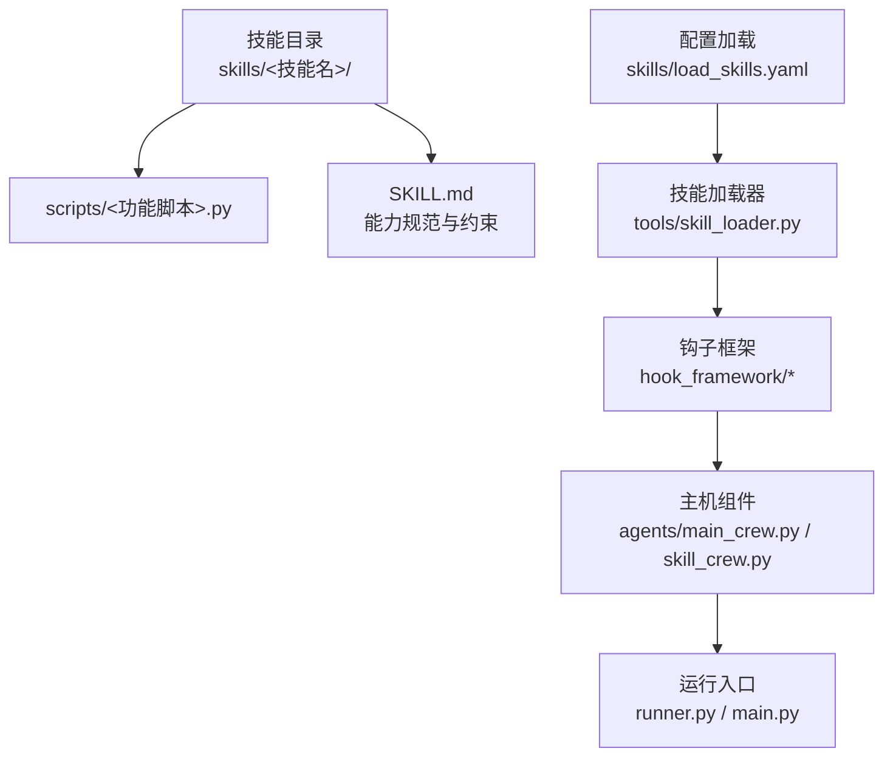
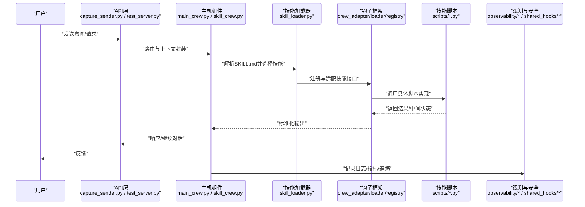
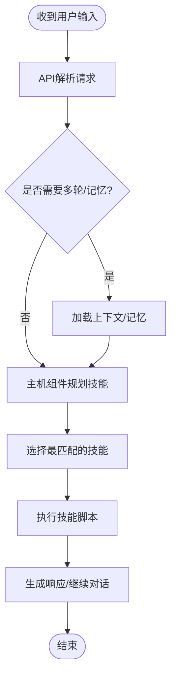
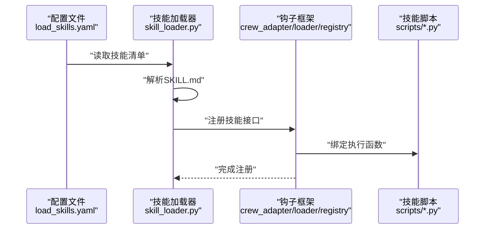
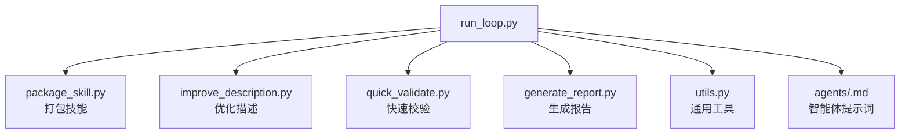
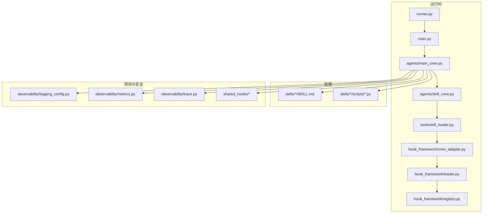

# 技能创建流程

<cite>
**本文引用的文件**
- [load_skills.yaml](file://xiaopaw/skills/load_skills.yaml)
- [skill-creator/SKILL.md](file://xiaopaw/skills/skill-creator/SKILL.md)
- [skill-creator/scripts/package_skill.py](file://xiaopaw/skills/skill-creator/scripts/package_skill.py)
- [skill-creator/scripts/run_loop.py](file://xiaopaw/skills/skill-creator/scripts/run_loop.py)
- [skill-creator/scripts/improve_description.py](file://xiaopaw/skills/skill-creator/scripts/improve_description.py)
- [skill-creator/scripts/quick_validate.py](file://xiaopaw/skills/skill-creator/scripts/quick_validate.py)
- [skill-creator/scripts/generate_report.py](file://xiaopaw/skills/skill-creator/scripts/generate_report.py)
- [skill-creator/scripts/utils.py](file://xiaopaw/skills/skill-creator/scripts/utils.py)
- [skill-creator/agents/analyzer.md](file://xiaopaw/skills/skill-creator/agents/analyzer.md)
- [skill-creator/agents/comparator.md](file://xiaopaw/skills/skill-creator/agents/comparator.md)
- [skill-creator/agents/grader.md](file://xiaopaw/skills/skill-creator/agents/grader.md)
- [baidu_search/SKILL.md](file://xiaopaw/skills/baidu_search/SKILL.md)
- [docx/SKILL.md](file://xiaopaw/skills/docx/SKILL.md)
- [pdf/SKILL.md](file://xiaopaw/skills/pdf/SKILL.md)
- [pptx/SKILL.md](file://xiaopaw/skills/pptx/SKILL.md)
- [xlsx/SKILL.md](file://xiaopaw/skills/xlsx/SKILL.md)
- [feishu_ops/SKILL.md](file://xiaopaw/skills/feishu_ops/SKILL.md)
- [scheduler_mgr/SKILL.md](file://xiaopaw/skills/scheduler_mgr/SKILL.md)
- [memory-save/SKILL.md](file://xiaopaw/skills/memory-save/SKILL.md)
- [memory-governance/SKILL.md](file://xiaopaw/skills/memory-governance/SKILL.md)
- [history_reader/SKILL.md](file://xiaopaw/skills/history_reader/SKILL.md)
- [search_memory/SKILL.md](file://xiaopaw/skills/search_memory/SKILL.md)
- [web_browse/SKILL.md](file://xiaopaw/skills/web_browse/SKILL.md)
- [tools/skill_loader.py](file://xiaopaw/tools/skill_loader.py)
- [hook_framework/crew_adapter.py](file://xiaopaw/hook_framework/crew_adapter.py)
- [hook_framework/loader.py](file://xiaopaw/hook_framework/loader.py)
- [hook_framework/registry.py](file://xiaopaw/hook_framework/registry.py)
- [agents/main_crew.py](file://xiaopaw/agents/main_crew.py)
- [agents/skill_crew.py](file://xiaopaw/agents/skill_crew.py)
- [models.py](file://xiaopaw/models.py)
- [runner.py](file://xiaopaw/runner.py)
- [main.py](file://xiaopaw/main.py)
- [api/capture_sender.py](file://xiaopaw/api/capture_sender.py)
- [api/schemas.py](file://xiaopaw/api/schemas.py)
- [api/test_server.py](file://xiaopaw/api/test_server.py)
- [memory/bootstrap.py](file://xiaopaw/memory/bootstrap.py)
- [memory/context_mgmt.py](file://xiaopaw/memory/context_mgmt.py)
- [memory/indexer.py](file://xiaopaw/memory/indexer.py)
- [memory/token_counter.py](file://xiaopaw/memory/token_counter.py)
- [session/manager.py](file://xiaopaw/session/manager.py)
- [session/models.py](file://xiaopaw/session/models.py)
- [config/flags.py](file://xiaopaw/config/flags.py)
- [config/safety.py](file://xiaopaw/config/safety.py)
- [config/validator.py](file://xiaopaw/config/validator.py)
- [llm/aliyun_llm.py](file://xiaopaw/llm/aliyun_llm.py)
- [observability/logging_config.py](file://xiaopaw/observability/logging_config.py)
- [observability/metrics.py](file://xiaopaw/observability/metrics.py)
- [observability/metrics_server.py](file://xiaopaw/observability/metrics_server.py)
- [observability/security.py](file://xiaopaw/observability/security.py)
- [observability/trace.py](file://xiaopaw/observability/trace.py)
- [cron/service.py](file://xiaopaw/cron/service.py)
- [cron/storage.py](file://xiaopaw/cron/storage.py)
- [cleanup/service.py](file://xiaopaw/cleanup/service.py)
- [feishu/listener.py](file://xiaopaw/feishu/listener.py)
- [feishu/sender.py](file://xiaopaw/feishu/sender.py)
- [feishu/downloader.py](file://xiaopaw/feishu/downloader.py)
- [feishu/session_key.py](file://xiaopaw/feishu/session_key.py)
- [shared_hooks/hooks.yaml](file://shared_hooks/hooks.yaml)
- [shared_hooks/audit_logger.py](file://shared_hooks/audit_logger.py)
- [shared_hooks/cost_guard.py](file://shared_hooks/cost_guard.py)
- [shared_hooks/langfuse_trace.py](file://shared_hooks/langfuse_trace.py)
- [shared_hooks/loop_detector.py](file://shared_hooks/loop_detector.py)
- [shared_hooks/permission_gate.py](file://shared_hooks/permission_gate.py)
- [shared_hooks/retry_tracker.py](file://shared_hooks/retry_tracker.py)
- [shared_hooks/sandbox_guard.py](file://shared_hooks/sandbox_guard.py)
- [shared_hooks/structured_log.py](file://shared_hooks/structured_log.py)
</cite>

## 目录
1. [引言](#引言)
2. [项目结构](#项目结构)
3. [核心组件](#核心组件)
4. [架构总览](#架构总览)
5. [详细组件分析](#详细组件分析)
6. [依赖关系分析](#依赖关系分析)
7. [性能考虑](#性能考虑)
8. [故障排查指南](#故障排查指南)
9. [结论](#结论)
10. [附录](#附录)

## 引言
本文件面向技能开发者与产品团队，系统化阐述“技能创建流程”的端到端方法论与工程实践，覆盖从“用户意图捕获”到“技能发布”的全流程：包括意图理解、面试调研、SKILL.md 编写、工具约束与渐进披露等关键步骤；并总结技能开发最佳实践（描述编写技巧、触发条件设计、输出格式规范），提供可复用的开发范式与常见问题解决方案。

## 项目结构
该仓库以“技能即模块”的理念组织，每个技能目录包含：
- 脚本实现：位于 scripts/ 下，按功能拆分的 Python 模块
- 文档规范：每个技能根目录包含 SKILL.md，定义能力边界、触发条件、输入输出、安全与合规要求
- 配置加载：通过 load_skills.yaml 统一注册与加载所有技能

图示来源
- [load_skills.yaml](file://xiaopaw/skills/load_skills.yaml)
- [tools/skill_loader.py](file://xiaopaw/tools/skill_loader.py)
- [hook_framework/crew_adapter.py](file://xiaopaw/hook_framework/crew_adapter.py)
- [hook_framework/loader.py](file://xiaopaw/hook_framework/loader.py)
- [hook_framework/registry.py](file://xiaopaw/hook_framework/registry.py)
- [agents/main_crew.py](file://xiaopaw/agents/main_crew.py)
- [agents/skill_crew.py](file://xiaopaw/agents/skill_crew.py)
- [runner.py](file://xiaopaw/runner.py)
- [main.py](file://xiaopaw/main.py)

章节来源
- [load_skills.yaml](file://xiaopaw/skills/load_skills.yaml)
- [tools/skill_loader.py](file://xiaopaw/tools/skill_loader.py)

## 核心组件
- 技能规范 SKILL.md：统一的能力说明书，明确“做什么、如何触发、输入输出、安全与合规、错误处理、渐进披露策略”
- 技能加载器 skill_loader：负责扫描 skills/ 目录，解析 SKILL.md 并注册到运行时
- 钩子框架 hook_framework：提供 CrewAdapter、Loader、Registry 等能力，支撑技能在运行期的编排与执行
- 主机组件 agents/main_crew.py 与 agents/skill_crew.py：承载对话与任务编排逻辑，驱动技能调用
- 运行入口 runner.py 与 main.py：应用启动与生命周期管理
- 观测性与安全：observability/* 与 shared_hooks/* 提供日志、指标、追踪、成本守卫、权限门等横切能力

章节来源
- [hook_framework/crew_adapter.py](file://xiaopaw/hook_framework/crew_adapter.py)
- [hook_framework/loader.py](file://xiaopaw/hook_framework/loader.py)
- [hook_framework/registry.py](file://xiaopaw/hook_framework/registry.py)
- [agents/main_crew.py](file://xiaopaw/agents/main_crew.py)
- [agents/skill_crew.py](file://xiaopaw/agents/skill_crew.py)
- [runner.py](file://xiaopaw/runner.py)
- [main.py](file://xiaopaw/main.py)

## 架构总览
下图展示“意图捕获—技能编排—执行—观测”的闭环：

图示来源
- [api/capture_sender.py](file://xiaopaw/api/capture_sender.py)
- [api/test_server.py](file://xiaopaw/api/test_server.py)
- [agents/main_crew.py](file://xiaopaw/agents/main_crew.py)
- [agents/skill_crew.py](file://xiaopaw/agents/skill_crew.py)
- [tools/skill_loader.py](file://xiaopaw/tools/skill_loader.py)
- [hook_framework/crew_adapter.py](file://xiaopaw/hook_framework/crew_adapter.py)
- [hook_framework/loader.py](file://xiaopaw/hook_framework/loader.py)
- [hook_framework/registry.py](file://xiaopaw/hook_framework/registry.py)
- [observability/logging_config.py](file://xiaopaw/observability/logging_config.py)
- [observability/metrics.py](file://xiaopaw/observability/metrics.py)
- [observability/trace.py](file://xiaopaw/observability/trace.py)
- [shared_hooks/audit_logger.py](file://shared_hooks/audit_logger.py)
- [shared_hooks/cost_guard.py](file://shared_hooks/cost_guard.py)
- [shared_hooks/permission_gate.py](file://shared_hooks/permission_gate.py)

## 详细组件分析

### 1) 意图捕获与对话编排
- API 层负责接收用户输入并进行基础校验与路由
- 主机组件根据上下文与历史消息选择合适的技能或组合
- 会话管理与内存上下文由 session/manager.py 与 memory/* 协同维护

图示来源
- [api/capture_sender.py](file://xiaopaw/api/capture_sender.py)
- [api/schemas.py](file://xiaopaw/api/schemas.py)
- [agents/main_crew.py](file://xiaopaw/agents/main_crew.py)
- [agents/skill_crew.py](file://xiaopaw/agents/skill_crew.py)
- [session/manager.py](file://xiaopaw/session/manager.py)
- [memory/context_mgmt.py](file://xiaopaw/memory/context_mgmt.py)

章节来源
- [api/capture_sender.py](file://xiaopaw/api/capture_sender.py)
- [api/schemas.py](file://xiaopaw/api/schemas.py)
- [agents/main_crew.py](file://xiaopaw/agents/main_crew.py)
- [agents/skill_crew.py](file://xiaopaw/agents/skill_crew.py)
- [session/manager.py](file://xiaopaw/session/manager.py)
- [memory/context_mgmt.py](file://xiaopaw/memory/context_mgmt.py)

### 2) 技能加载与注册
- load_skills.yaml 定义技能清单与加载规则
- skill_loader 扫描技能目录，解析 SKILL.md，注册到钩子框架
- hook_framework 提供 CrewAdapter、Loader、Registry，确保技能以一致接口暴露

图示来源
- [load_skills.yaml](file://xiaopaw/skills/load_skills.yaml)
- [tools/skill_loader.py](file://xiaopaw/tools/skill_loader.py)
- [hook_framework/crew_adapter.py](file://xiaopaw/hook_framework/crew_adapter.py)
- [hook_framework/loader.py](file://xiaopaw/hook_framework/loader.py)
- [hook_framework/registry.py](file://xiaopaw/hook_framework/registry.py)

章节来源
- [load_skills.yaml](file://xiaopaw/skills/load_skills.yaml)
- [tools/skill_loader.py](file://xiaopaw/tools/skill_loader.py)
- [hook_framework/crew_adapter.py](file://xiaopaw/hook_framework/crew_adapter.py)
- [hook_framework/loader.py](file://xiaopaw/hook_framework/loader.py)
- [hook_framework/registry.py](file://xiaopaw/hook_framework/registry.py)

### 3) SKILL.md 规范与渐进披露
- 每个技能必须提供 SKILL.md，明确能力边界、触发条件、输入输出、错误处理、安全与合规、渐进披露策略
- 渐进披露建议：先提供最小可用描述，再逐步细化工具链、参数范围与边界条件
- 示例参考：baidu_search、docx、pdf、pptx、xlsx、feishu_ops、scheduler_mgr、memory-*、history_reader、search_memory、web_browse 等

章节来源
- [baidu_search/SKILL.md](file://xiaopaw/skills/baidu_search/SKILL.md)
- [docx/SKILL.md](file://xiaopaw/skills/docx/SKILL.md)
- [pdf/SKILL.md](file://xiaopaw/skills/pdf/SKILL.md)
- [pptx/SKILL.md](file://xiaopaw/skills/pptx/SKILL.md)
- [xlsx/SKILL.md](file://xiaopaw/skills/xlsx/SKILL.md)
- [feishu_ops/SKILL.md](file://xiaopaw/skills/feishu_ops/SKILL.md)
- [scheduler_mgr/SKILL.md](file://xiaopaw/skills/scheduler_mgr/SKILL.md)
- [memory-save/SKILL.md](file://xiaopaw/skills/memory-save/SKILL.md)
- [memory-governance/SKILL.md](file://xiaopaw/skills/memory-governance/SKILL.md)
- [history_reader/SKILL.md](file://xiaopaw/skills/history_reader/SKILL.md)
- [search_memory/SKILL.md](file://xiaopaw/skills/search_memory/SKILL.md)
- [web_browse/SKILL.md](file://xiaopaw/skills/web_browse/SKILL.md)

### 4) 技能创建工具链（skill-creator）
skill-creator 提供自动化辅助与评估能力，帮助提升 SKILL.md 质量与技能稳定性。

图示来源
- [skill-creator/scripts/run_loop.py](file://xiaopaw/skills/skill-creator/scripts/run_loop.py)
- [skill-creator/scripts/package_skill.py](file://xiaopaw/skills/skill-creator/scripts/package_skill.py)
- [skill-creator/scripts/improve_description.py](file://xiaopaw/skills/skill-creator/scripts/improve_description.py)
- [skill-creator/scripts/quick_validate.py](file://xiaopaw/skills/skill-creator/scripts/quick_validate.py)
- [skill-creator/scripts/generate_report.py](file://xiaopaw/skills/skill-creator/scripts/generate_report.py)
- [skill-creator/scripts/utils.py](file://xiaopaw/skills/skill-creator/scripts/utils.py)
- [skill-creator/agents/analyzer.md](file://xiaopaw/skills/skill-creator/agents/analyzer.md)
- [skill-creator/agents/comparator.md](file://xiaopaw/skills/skill-creator/agents/comparator.md)
- [skill-creator/agents/grader.md](file://xiaopaw/skills/skill-creator/agents/grader.md)

章节来源
- [skill-creator/SKILL.md](file://xiaopaw/skills/skill-creator/SKILL.md)
- [skill-creator/scripts/run_loop.py](file://xiaopaw/skills/skill-creator/scripts/run_loop.py)
- [skill-creator/scripts/package_skill.py](file://xiaopaw/skills/skill-creator/scripts/package_skill.py)
- [skill-creator/scripts/improve_description.py](file://xiaopaw/skills/skill-creator/scripts/improve_description.py)
- [skill-creator/scripts/quick_validate.py](file://xiaopaw/skills/skill-creator/scripts/quick_validate.py)
- [skill-creator/scripts/generate_report.py](file://xiaopaw/skills/skill-creator/scripts/generate_report.py)
- [skill-creator/scripts/utils.py](file://xiaopaw/skills/skill-creator/scripts/utils.py)
- [skill-creator/agents/analyzer.md](file://xiaopaw/skills/skill-creator/agents/analyzer.md)
- [skill-creator/agents/comparator.md](file://xiaopaw/skills/skill-creator/agents/comparator.md)
- [skill-creator/agents/grader.md](file://xiaopaw/skills/skill-creator/agents/grader.md)

### 5) 工具约束与安全合规
- 权限门 permission_gate：控制访问范围
- 成本守卫 cost_guard：限制资源消耗
- 审计日志 audit_logger：记录操作轨迹
- 循环检测 loop_detector：避免重复/死循环
- 沙箱守卫 sandbox_guard：隔离执行环境
- 共享钩子 shared_hooks/* 可在技能执行前后统一注入

章节来源
- [shared_hooks/permission_gate.py](file://shared_hooks/permission_gate.py)
- [shared_hooks/cost_guard.py](file://shared_hooks/cost_guard.py)
- [shared_hooks/audit_logger.py](file://shared_hooks/audit_logger.py)
- [shared_hooks/loop_detector.py](file://shared_hooks/loop_detector.py)
- [shared_hooks/sandbox_guard.py](file://shared_hooks/sandbox_guard.py)
- [shared_hooks/hooks.yaml](file://shared_hooks/hooks.yaml)

### 6) 输出格式与一致性
- 建议统一输出结构：摘要、关键信息列表、可选的富文本/表格/链接
- 对于复杂数据，优先提供“可读摘要 + 结构化附件”的渐进披露
- 在 SKILL.md 中明确输出格式规范，便于前端渲染与用户阅读

（本节为通用规范说明，不直接分析特定文件）

## 依赖关系分析
技能体系的依赖关系如下：

图示来源
- [runner.py](file://xiaopaw/runner.py)
- [main.py](file://xiaopaw/main.py)
- [agents/main_crew.py](file://xiaopaw/agents/main_crew.py)
- [agents/skill_crew.py](file://xiaopaw/agents/skill_crew.py)
- [tools/skill_loader.py](file://xiaopaw/tools/skill_loader.py)
- [hook_framework/crew_adapter.py](file://xiaopaw/hook_framework/crew_adapter.py)
- [hook_framework/loader.py](file://xiaopaw/hook_framework/loader.py)
- [hook_framework/registry.py](file://xiaopaw/hook_framework/registry.py)
- [observability/logging_config.py](file://xiaopaw/observability/logging_config.py)
- [observability/metrics.py](file://xiaopaw/observability/metrics.py)
- [observability/trace.py](file://xiaopaw/observability/trace.py)
- [shared_hooks/audit_logger.py](file://shared_hooks/audit_logger.py)
- [shared_hooks/cost_guard.py](file://shared_hooks/cost_guard.py)
- [shared_hooks/permission_gate.py](file://shared_hooks/permission_gate.py)

章节来源
- [runner.py](file://xiaopaw/runner.py)
- [main.py](file://xiaopaw/main.py)
- [agents/main_crew.py](file://xiaopaw/agents/main_crew.py)
- [agents/skill_crew.py](file://xiaopaw/agents/skill_crew.py)
- [tools/skill_loader.py](file://xiaopaw/tools/skill_loader.py)
- [hook_framework/crew_adapter.py](file://xiaopaw/hook_framework/crew_adapter.py)
- [hook_framework/loader.py](file://xiaopaw/hook_framework/loader.py)
- [hook_framework/registry.py](file://xiaopaw/hook_framework/registry.py)

## 性能考虑
- 资源消耗控制：通过 cost_guard 限制并发与调用次数，避免热点技能导致系统过载
- 日志与追踪：使用 observability/metrics 与 observability/trace 记录关键指标，定位瓶颈
- 内存与上下文：合理使用 memory/* 与 session/manager.py，避免上下文膨胀
- LLM 推理：结合 config/flags.py 与 config/safety.py 控制温度、长度与安全阈值

章节来源
- [shared_hooks/cost_guard.py](file://shared_hooks/cost_guard.py)
- [observability/metrics.py](file://xiaopaw/observability/metrics.py)
- [observability/trace.py](file://xiaopaw/observability/trace.py)
- [memory/context_mgmt.py](file://xiaopaw/memory/context_mgmt.py)
- [session/manager.py](file://xiaopaw/session/manager.py)
- [config/flags.py](file://xiaopaw/config/flags.py)
- [config/safety.py](file://xiaopaw/config/safety.py)

## 故障排查指南
- 启动与加载
  - 若技能未出现，检查 load_skills.yaml 是否正确声明，以及 skill_loader 是否解析成功
  - 关注钩子框架注册日志，确认 crew_adapter/loader/registry 的初始化顺序
- 执行异常
  - 查看 shared_hooks/audit_logger 与 observability/trace 的错误堆栈
  - 使用 shared_hooks/loop_detector 检查是否存在循环调用
  - 通过 shared_hooks/permission_gate 与 shared_hooks/sandbox_guard 排查权限与隔离问题
- 输出不符合预期
  - 回归 SKILL.md 的输出格式与触发条件定义
  - 使用 skill-creator/scripts/quick_validate.py 快速验证描述与参数一致性
- API 交互
  - 使用 api/test_server.py 模拟请求，核对 api/schemas.py 的字段映射

章节来源
- [load_skills.yaml](file://xiaopaw/skills/load_skills.yaml)
- [tools/skill_loader.py](file://xiaopaw/tools/skill_loader.py)
- [hook_framework/crew_adapter.py](file://xiaopaw/hook_framework/crew_adapter.py)
- [hook_framework/loader.py](file://xiaopaw/hook_framework/loader.py)
- [hook_framework/registry.py](file://xiaopaw/hook_framework/registry.py)
- [shared_hooks/audit_logger.py](file://shared_hooks/audit_logger.py)
- [shared_hooks/loop_detector.py](file://shared_hooks/loop_detector.py)
- [shared_hooks/permission_gate.py](file://shared_hooks/permission_gate.py)
- [shared_hooks/sandbox_guard.py](file://shared_hooks/sandbox_guard.py)
- [observability/trace.py](file://xiaopaw/observability/trace.py)
- [api/test_server.py](file://xiaopaw/api/test_server.py)
- [api/schemas.py](file://xiaopaw/api/schemas.py)
- [skill-creator/scripts/quick_validate.py](file://xiaopaw/skills/skill-creator/scripts/quick_validate.py)

## 结论
通过“SKILL.md 规范 + skill-creator 工具链 + 钩子框架 + 观测与安全”的协同，可以高效、稳定地完成从意图到技能发布的全链路交付。建议在每个技能迭代中坚持：先规范后实现、先小步后扩展、先自检后评审、先灰度后全量。

## 附录

### A. 技能开发最佳实践清单
- 描述编写技巧
  - 使用“用户视角”的动宾结构，清晰说明“做什么、为什么做、何时做”
  - 明确前置条件与边界，避免模糊承诺
- 触发条件设计
  - 将意图关键词、上下文线索与领域知识结合，形成可判定的触发规则
  - 支持多轮澄清与反问，提升意图识别鲁棒性
- 输出格式规范
  - 统一摘要、要点、附件三段式结构
  - 对复杂结果提供“可读摘要 + 结构化附件”的渐进披露
- 工具约束与安全
  - 在 SKILL.md 中列出外部系统依赖与权限范围
  - 通过 shared_hooks/* 实现统一的安全与成本控制
- 渐进披露策略
  - 初版只暴露必要信息，后续根据用户反馈与使用数据逐步开放细节

（本节为通用实践总结，不直接分析特定文件）

### B. 常见问题与解决方案
- 问题：技能未被识别
  - 解决：检查 load_skills.yaml 与 SKILL.md 的命名与路径一致性；确认 skill_loader 注册日志
- 问题：执行超时或失败
  - 解决：启用 cost_guard 与 loop_detector；查看 observability/trace 与 shared_hooks/audit_logger
- 问题：输出格式混乱
  - 解决：回归 SKILL.md 的输出约定；使用 quick_validate 校验
- 问题：权限不足
  - 解决：核查 shared_hooks/permission_gate 的策略配置与调用方身份

章节来源
- [load_skills.yaml](file://xiaopaw/skills/load_skills.yaml)
- [tools/skill_loader.py](file://xiaopaw/tools/skill_loader.py)
- [shared_hooks/cost_guard.py](file://shared_hooks/cost_guard.py)
- [shared_hooks/loop_detector.py](file://shared_hooks/loop_detector.py)
- [shared_hooks/permission_gate.py](file://shared_hooks/permission_gate.py)
- [observability/trace.py](file://xiaopaw/observability/trace.py)
- [shared_hooks/audit_logger.py](file://shared_hooks/audit_logger.py)
- [skill-creator/scripts/quick_validate.py](file://xiaopaw/skills/skill-creator/scripts/quick_validate.py)