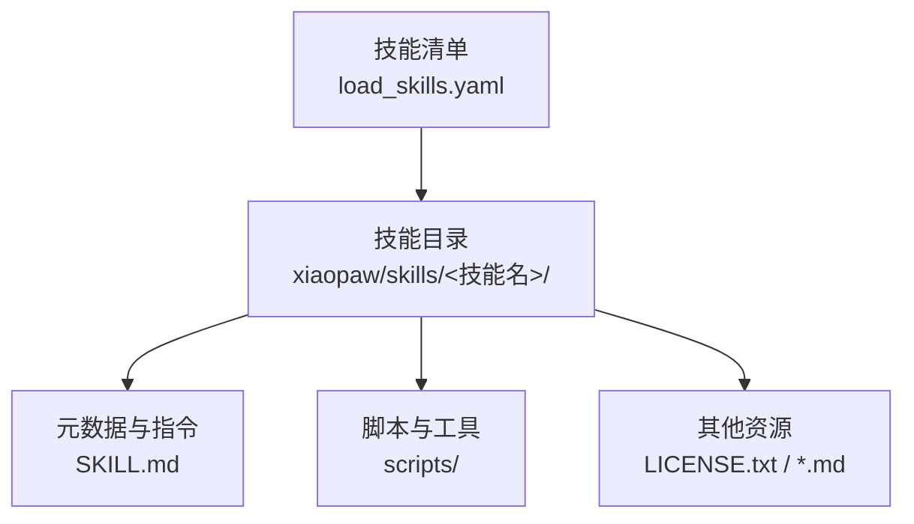
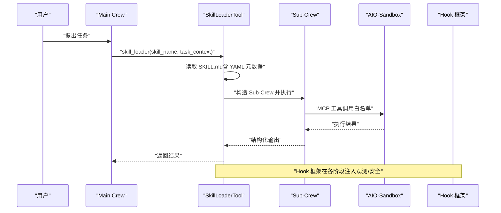
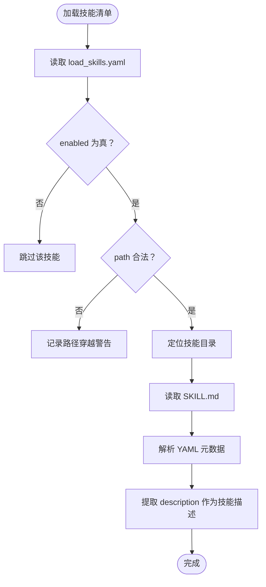
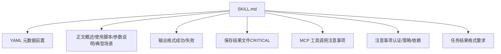
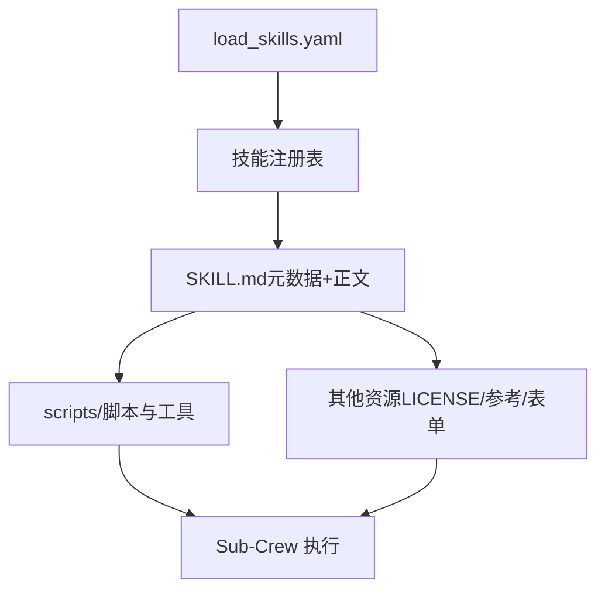
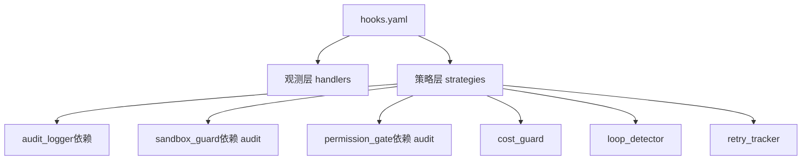
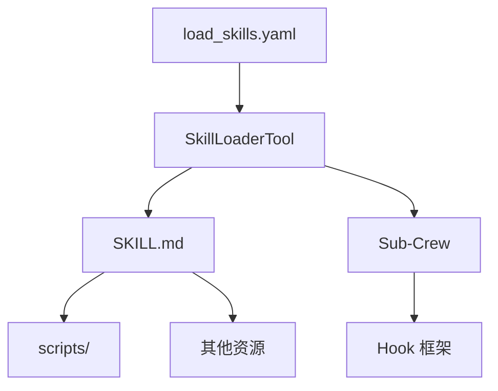

# 技能开发指南

<cite>
**本文引用的文件**
- [README.md](file://README.md)
- [DESIGN.md](file://DESIGN.md)
- [load_skills.yaml](file://xiaopaw/skills/load_skills.yaml)
- [skill_loader.py](file://xiaopaw/tools/skill_loader.py)
- [skill_crew.py](file://xiaopaw/agents/skill_crew.py)
- [hooks.yaml](file://shared_hooks/hooks.yaml)
- [loader.py](file://xiaopaw/hook_framework/loader.py)
- [agents.yaml](file://xiaopaw/agents/config/agents.yaml)
- [tasks.yaml](file://xiaopaw/agents/config/tasks.yaml)
- [baidu_search SKILL.md](file://xiaopaw/skills/baidu_search/SKILL.md)
- [pdf SKILL.md](file://xiaopaw/skills/pdf/SKILL.md)
- [docx SKILL.md](file://xiaopaw/skills/docx/SKILL.md)
- [pptx SKILL.md](file://xiaopaw/skills/pptx/SKILL.md)
- [xlsx SKILL.md](file://xiaopaw/skills/xlsx/SKILL.md)
- [history_reader SKILL.md](file://xiaopaw/skills/history_reader/SKILL.md)
</cite>

## 目录
1. [简介](#简介)
2. [项目结构](#项目结构)
3. [核心组件](#核心组件)
4. [架构总览](#架构总览)
5. [详细组件分析](#详细组件分析)
6. [依赖分析](#依赖分析)
7. [性能考虑](#性能考虑)
8. [故障排查指南](#故障排查指南)
9. [结论](#结论)
10. [附录](#附录)

## 简介
本指南面向技能开发者，系统阐述 XiaoPaw 技能体系的文件结构、YAML 前置参数、Markdown 指令编写规范、资源组织方式，以及“元数据、SKILL.md 正文、捆绑资源”三层加载系统的工作机制。文档还提供技能命名规范、工具使用限制、脚本编写指南与引用文件管理的最佳实践，帮助你在不修改业务代码的前提下，快速、安全、可维护地扩展技能生态。

## 项目结构
技能位于 xiaopaw/skills/<技能名>/ 目录下，每个技能包含：
- SKILL.md：技能元数据与执行指令
- scripts/：技能脚本与辅助工具
- 其他资源：如 LICENSE.txt、reference.md、forms.md 等

技能清单由 xiaopaw/skills/load_skills.yaml 统一声明，支持 task 与 reference 两类类型，并通过 SkillLoaderTool 动态加载与展示。

**图表来源**
- [load_skills.yaml:1-55](file://xiaopaw/skills/load_skills.yaml#L1-L55)
- [baidu_search SKILL.md:1-181](file://xiaopaw/skills/baidu_search/SKILL.md#L1-L181)

**章节来源**
- [load_skills.yaml:1-55](file://xiaopaw/skills/load_skills.yaml#L1-L55)
- [README.md:314-329](file://README.md#L314-L329)

## 核心组件
- 技能清单与类型
  - task：需要在沙箱中执行的技能，具备独立的脚本与资源
  - reference：仅返回 SKILL.md 指令，不执行沙箱任务
- SkillLoaderTool：负责加载 SKILL.md、构造 Sub-Crew、在沙箱中执行任务
- Sub-Crew：在隔离环境中执行技能，使用 MCP 工具链
- Hook 框架：通过 hooks.yaml 声明观测与安全策略，贯穿技能执行全过程

**章节来源**
- [load_skills.yaml:1-55](file://xiaopaw/skills/load_skills.yaml#L1-L55)
- [skill_loader.py:223-535](file://xiaopaw/tools/skill_loader.py#L223-L535)
- [skill_crew.py:98-155](file://xiaopaw/agents/skill_crew.py#L98-L155)
- [hooks.yaml:1-73](file://shared_hooks/hooks.yaml#L1-L73)

## 架构总览
技能执行采用“渐进式能力披露 + 零编排”的两层 Crew 架构：
- Main Crew 仅看到技能清单与简要描述，不接触具体实现
- 调用 skill_loader 后，工具读取 SKILL.md，构造 Sub-Crew，交由沙箱执行
- Hook 框架在观测与安全层面全程介入，保障 trace 完整与执行安全

**图表来源**
- [skill_loader.py:392-449](file://xiaopaw/tools/skill_loader.py#L392-L449)
- [skill_crew.py:98-155](file://xiaopaw/agents/skill_crew.py#L98-L155)
- [hooks.yaml:1-73](file://shared_hooks/hooks.yaml#L1-L73)

## 详细组件分析

### 技能清单与类型系统
- 类型声明
  - task：在沙箱中执行，具备独立脚本与资源
  - reference：仅返回 SKILL.md 指令文本，不执行沙箱任务
- 启用控制
  - enabled 字段控制技能是否对外展示
  - path 字段可指定相对 skills/ 的子目录（防止路径穿越）

**图表来源**
- [load_skills.yaml:1-55](file://xiaopaw/skills/load_skills.yaml#L1-L55)
- [skill_loader.py:254-310](file://xiaopaw/tools/skill_loader.py#L254-L310)

**章节来源**
- [load_skills.yaml:1-55](file://xiaopaw/skills/load_skills.yaml#L1-L55)
- [skill_loader.py:254-310](file://xiaopaw/tools/skill_loader.py#L254-L310)

### YAML 元数据与 Markdown 指令规范
- YAML 元数据（前置参数）
  - name：技能唯一标识，与目录名一致
  - description：技能用途与能力概述
  - license：许可证声明
  - type：可选，reference 时用于区分
  - version：可选，便于追踪
- Markdown 指令结构
  - 概述：简要说明技能目标与适用场景
  - 使用脚本：列出脚本路径与基本用法
  - 参数说明：表格形式列出参数与示例
  - 典型场景：给出常见任务的命令示例
  - 输出格式：成功/失败的 JSON 结构
  - 保存结果文件：强调 stdout 重定向的重要性
  - MCP 工具调用注意事项：参数类型与路径规范
  - 注意事项：认证、top_k 选择策略、依赖库等
  - 任务结果格式要求：标准化输出结构

**图表来源**
- [baidu_search SKILL.md:1-181](file://xiaopaw/skills/baidu_search/SKILL.md#L1-L181)
- [pdf SKILL.md:1-315](file://xiaopaw/skills/pdf/SKILL.md#L1-L315)
- [docx SKILL.md:1-591](file://xiaopaw/skills/docx/SKILL.md#L1-L591)
- [pptx SKILL.md:1-233](file://xiaopaw/skills/pptx/SKILL.md#L1-L233)
- [xlsx SKILL.md:1-292](file://xiaopaw/skills/xlsx/SKILL.md#L1-L292)
- [history_reader SKILL.md:1-72](file://xiaopaw/skills/history_reader/SKILL.md#L1-L72)

**章节来源**
- [baidu_search SKILL.md:1-181](file://xiaopaw/skills/baidu_search/SKILL.md#L1-L181)
- [pdf SKILL.md:1-315](file://xiaopaw/skills/pdf/SKILL.md#L1-L315)
- [docx SKILL.md:1-591](file://xiaopaw/skills/docx/SKILL.md#L1-L591)
- [pptx SKILL.md:1-233](file://xiaopaw/skills/pptx/SKILL.md#L1-L233)
- [xlsx SKILL.md:1-292](file://xiaopaw/skills/xlsx/SKILL.md#L1-L292)
- [history_reader SKILL.md:1-72](file://xiaopaw/skills/history_reader/SKILL.md#L1-L72)

### 三层加载系统：元数据、SKILL.md 正文、捆绑资源
- 元数据层（YAML）
  - 通过 load_skills.yaml 声明技能类型、启用状态与路径
  - SkillLoaderTool 读取并构建技能注册表
- SKILL.md 正文层
  - 提供技能执行指令、参数与输出规范
  - Sub-Crew 读取 SKILL.md 构建 Agent/Task
- 捆绑资源层
  - scripts/ 目录下的脚本与工具
  - 其他资源文件（如 LICENSE.txt、reference.md、forms.md）

**图表来源**
- [load_skills.yaml:1-55](file://xiaopaw/skills/load_skills.yaml#L1-L55)
- [skill_loader.py:321-359](file://xiaopaw/tools/skill_loader.py#L321-L359)
- [skill_crew.py:98-155](file://xiaopaw/agents/skill_crew.py#L98-L155)

**章节来源**
- [load_skills.yaml:1-55](file://xiaopaw/skills/load_skills.yaml#L1-L55)
- [skill_loader.py:321-359](file://xiaopaw/tools/skill_loader.py#L321-L359)
- [skill_crew.py:98-155](file://xiaopaw/agents/skill_crew.py#L98-L155)

### 技能命名规范与工具使用限制
- 命名规范
  - 目录名与 YAML 元数据 name 一致
  - 仅使用小写字母、数字与短横线，避免特殊字符
- 工具使用限制
  - Sub-Crew 仅暴露技能声明的 MCP 工具白名单
  - 工具参数类型：空值省略或传 null，布尔值用 true/false，数字用原生数字，文件路径使用绝对路径
  - 不要使用字符串形式的 None/true/false/数字

**章节来源**
- [agents.yaml:36-45](file://xiaopaw/agents/config/agents.yaml#L36-L45)
- [DESIGN.md:227-231](file://DESIGN.md#L227-L231)

### 脚本编写指南与引用文件管理
- 脚本编写
  - 使用 stdout JSON 输出结构化结果，避免使用 file_operations write 写入 JSON 对象
  - 通过 shell 重定向将 stdout 直接写入 {session_dir}/outputs/ 目录
  - 参数校验与错误处理：返回标准化 JSON，包含 errcode、errmsg
- 引用文件管理
  - 脚本路径使用 {skill_base} 或 {session_dir} 占位符
  - 脚本与资源文件放置在 scripts/ 目录下，避免硬编码绝对路径
  - 参考文件（如 forms.md、reference.md）与 SKILL.md 同目录，便于引用

**章节来源**
- [baidu_search SKILL.md:110-129](file://xiaopaw/skills/baidu_search/SKILL.md#L110-L129)
- [docx SKILL.md:400-441](file://xiaopaw/skills/docx/SKILL.md#L400-L441)
- [xlsx SKILL.md:132-150](file://xiaopaw/skills/xlsx/SKILL.md#L132-L150)

### Hook 框架与安全策略
- hooks.yaml 两段式声明
  - hooks：观测层（log + langfuse），先于策略层执行
  - strategies：策略层（sandbox_guard、permission_gate、cost_guard、loop_detector、retry_tracker）
- 依赖注入与执行顺序
  - strategies 按声明顺序实例化，依赖必须先于被依赖声明
  - audit_logger 必须在 sandbox_guard/permission_gate 之前，否则运行时 AttributeError

**图表来源**
- [hooks.yaml:1-73](file://shared_hooks/hooks.yaml#L1-L73)
- [loader.py:88-154](file://xiaopaw/hook_framework/loader.py#L88-L154)

**章节来源**
- [hooks.yaml:1-73](file://shared_hooks/hooks.yaml#L1-L73)
- [loader.py:88-154](file://xiaopaw/hook_framework/loader.py#L88-L154)

## 依赖分析
- 技能清单依赖
  - load_skills.yaml 依赖 SKILL.md 的存在与合法 path
  - SkillLoaderTool 依赖 YAML 元数据与 SKILL.md 正文
- 执行依赖
  - Sub-Crew 依赖 MCP 工具白名单与沙箱可用
  - Hook 框架在各阶段注入观测与安全策略
- 资源依赖
  - scripts/ 目录下的脚本与工具
  - 其他资源文件（LICENSE.txt、reference.md、forms.md）

**图表来源**
- [load_skills.yaml:1-55](file://xiaopaw/skills/load_skills.yaml#L1-L55)
- [skill_loader.py:254-359](file://xiaopaw/tools/skill_loader.py#L254-L359)
- [skill_crew.py:98-155](file://xiaopaw/agents/skill_crew.py#L98-L155)
- [hooks.yaml:1-73](file://shared_hooks/hooks.yaml#L1-L73)

**章节来源**
- [load_skills.yaml:1-55](file://xiaopaw/skills/load_skills.yaml#L1-L55)
- [skill_loader.py:254-359](file://xiaopaw/tools/skill_loader.py#L254-L359)
- [skill_crew.py:98-155](file://xiaopaw/agents/skill_crew.py#L98-L155)
- [hooks.yaml:1-73](file://shared_hooks/hooks.yaml#L1-L73)

## 性能考虑
- 上下文控制
  - Main Crew 仅显示技能清单与简要描述，避免上下文膨胀
- 执行隔离
  - Sub-Crew 在沙箱中执行，避免阻塞主线程
- 超时与资源限制
  - Sub-Crew 执行设置超时，防止长时间占用
  - Hook 框架的成本围栏与循环检测降低高消耗风险

[本节为通用指导，无需特定文件引用]

## 故障排查指南
- 沙箱连接问题
  - 症状：MCP 连接启动后卡住 5 分钟
  - 根因：Transport 不匹配或 URL 空串
  - 处理：确认使用 MCPServerHTTP，检查 sandbox_mcp_url
- 权限问题
  - 症状：memory-save 写入失败或权限错误
  - 根因：workspace 权限不正确或目录 inode 变更
  - 处理：修复权限或重启沙箱容器，确保 inode 一致
- 技能未找到
  - 症状：调用 skill_loader 报 Tool not found
  - 根因：未使用 skill_loader(skill_name="...") 调用
  - 处理：确保使用正确的工具名与参数

**章节来源**
- [README.md:663-725](file://README.md#L663-L725)

## 结论
通过三层加载系统与 Hook 框架，XiaoPaw 实现了“渐进式能力披露 + 零编排”的技能执行架构。开发者只需专注于 SKILL.md 的指令编写与脚本实现，即可安全、可控地扩展技能生态。遵循命名规范、工具使用限制与脚本编写指南，将显著提升技能的稳定性与可维护性。

[本节为总结，无需特定文件引用]

## 附录
- 快速检查清单
  - YAML 元数据 name 与目录名一致
  - SKILL.md 包含完整的前置参数与正文
  - scripts/ 目录结构清晰，脚本使用 {skill_base}、{session_dir} 占位符
  - 输出使用 stdout JSON，避免 file_operations write
  - hooks.yaml 策略顺序正确，依赖声明在前
  - 沙箱 URL 正确，MCP 工具白名单与参数类型符合规范

[本节为补充说明，无需特定文件引用]