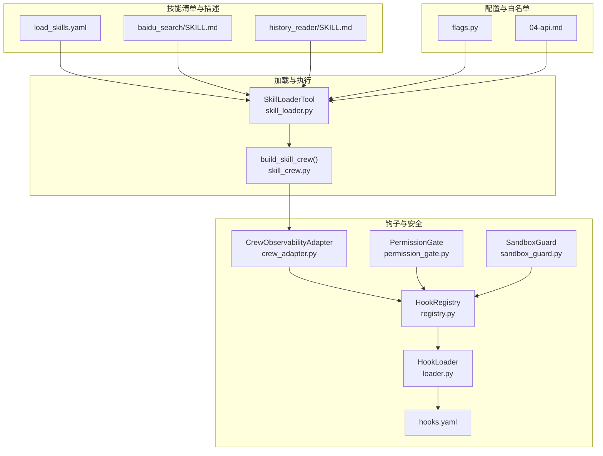
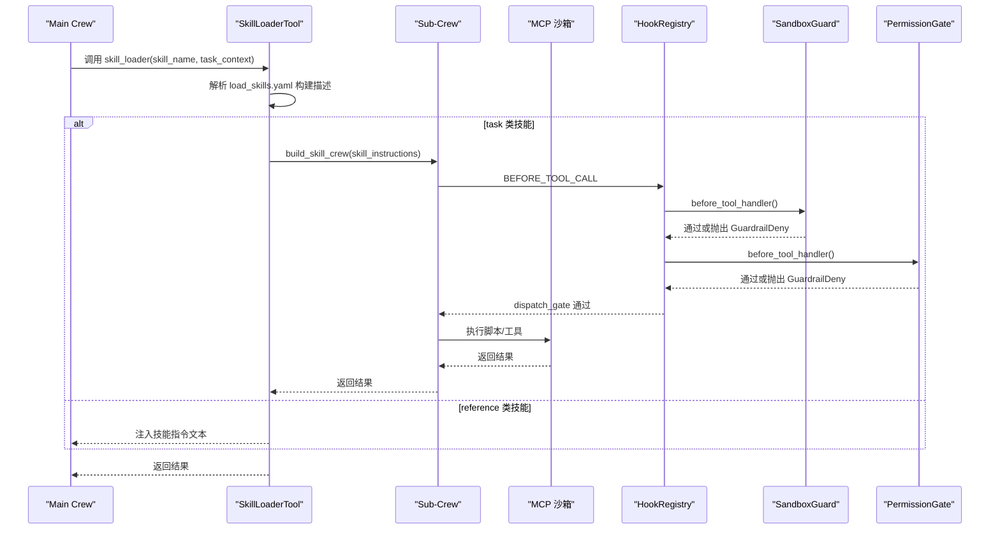
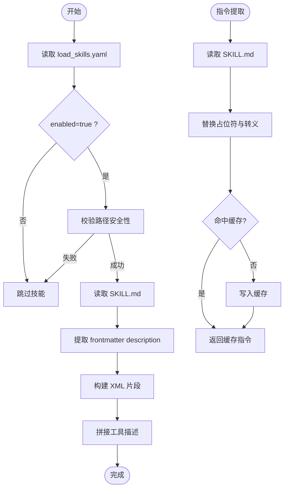
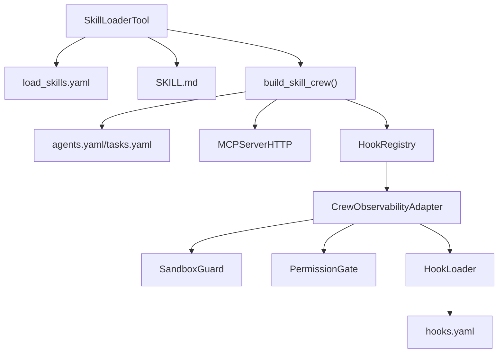

# 技能加载系统

<cite>
**本文引用的文件**
- [load_skills.yaml](file://xiaopaw/skills/load_skills.yaml)
- [skill_loader.py](file://xiaopaw/tools/skill_loader.py)
- [skill_crew.py](file://xiaopaw/agents/skill_crew.py)
- [loader.py](file://xiaopaw/hook_framework/loader.py)
- [registry.py](file://xiaopaw/hook_framework/registry.py)
- [crew_adapter.py](file://xiaopaw/hook_framework/crew_adapter.py)
- [hooks.yaml](file://shared_hooks/hooks.yaml)
- [flags.py](file://xiaopaw/config/flags.py)
- [permission_gate.py](file://shared_hooks/permission_gate.py)
- [sandbox_guard.py](file://shared_hooks/sandbox_guard.py)
- [baidu_search/SKILL.md](file://xiaopaw/skills/baidu_search/SKILL.md)
- [history_reader/SKILL.md](file://xiaopaw/skills/history_reader/SKILL.md)
- [04-api.md](file://docs/04-api.md)
- [12-hook-hardening.md](file://docs/12-hook-hardening.md)
</cite>

## 目录
1. [简介](#简介)
2. [项目结构](#项目结构)
3. [核心组件](#核心组件)
4. [架构总览](#架构总览)
5. [详细组件分析](#详细组件分析)
6. [依赖分析](#依赖分析)
7. [性能考虑](#性能考虑)
8. [故障排查指南](#故障排查指南)
9. [结论](#结论)
10. [附录](#附录)

## 简介
本文件面向 XiaoPaw v2 的“技能加载系统”，系统性阐述以下主题：
- 技能注册与发现机制：如何从技能清单中加载可用技能、构建工具描述、建立技能索引
- 技能类型分类系统：task 与 reference 的差异及执行路径
- MCP 工具白名单与权限控制：Main Agent 与 Sub-Crew 的双层安全控制
- 配置文件 load_skills.yaml 的结构、作用与启用/禁用管理
- 技能加载流程与缓存机制：描述构建、指令提取、模板替换与缓存策略
- 动态加载策略与错误处理：路径遍历防护、异常传播、清理与超时控制
- 开发指南：新增技能、编写 SKILL.md、配置与调试建议

## 项目结构
技能加载系统围绕“技能清单 + 技能描述 + Sub-Crew 执行”展开，主要文件与模块如下：
- 技能清单与描述：xiaopaw/skills/load_skills.yaml、各技能目录下的 SKILL.md
- 加载与执行：xiaopaw/tools/skill_loader.py、xiaopaw/agents/skill_crew.py
- 安全与钩子框架：shared_hooks/*、xiaopaw/hook_framework/*
- 配置与白名单：xiaopaw/config/flags.py、docs/04-api.md

图表来源
- [load_skills.yaml:1-55](file://xiaopaw/skills/load_skills.yaml#L1-L55)
- [skill_loader.py:254-310](file://xiaopaw/tools/skill_loader.py#L254-L310)
- [skill_crew.py:98-155](file://xiaopaw/agents/skill_crew.py#L98-L155)
- [loader.py:29-65](file://xiaopaw/hook_framework/loader.py#L29-L65)
- [registry.py:118-198](file://xiaopaw/hook_framework/registry.py#L118-L198)
- [crew_adapter.py:63-90](file://xiaopaw/hook_framework/crew_adapter.py#L63-L90)
- [hooks.yaml:1-73](file://shared_hooks/hooks.yaml#L1-L73)
- [flags.py:9-23](file://xiaopaw/config/flags.py#L9-L23)
- [04-api.md:614-632](file://docs/04-api.md#L614-L632)

章节来源
- [load_skills.yaml:1-55](file://xiaopaw/skills/load_skills.yaml#L1-L55)
- [skill_loader.py:254-310](file://xiaopaw/tools/skill_loader.py#L254-L310)
- [skill_crew.py:98-155](file://xiaopaw/agents/skill_crew.py#L98-L155)
- [loader.py:29-65](file://xiaopaw/hook_framework/loader.py#L29-L65)
- [registry.py:118-198](file://xiaopaw/hook_framework/registry.py#L118-L198)
- [crew_adapter.py:63-90](file://xiaopaw/hook_framework/crew_adapter.py#L63-L90)
- [hooks.yaml:1-73](file://shared_hooks/hooks.yaml#L1-L73)
- [flags.py:9-23](file://xiaopaw/config/flags.py#L9-L23)
- [04-api.md:614-632](file://docs/04-api.md#L614-L632)

## 核心组件
- 技能清单与类型：load_skills.yaml 定义技能名、类型（task/reference）、启用状态与可选路径
- 技能描述与指令：各技能目录下的 SKILL.md 提供技能描述与执行说明，SkillLoaderTool 读取并注入 Sub-Crew
- 加载器：SkillLoaderTool 负责构建工具描述、注册技能、提取指令、执行 task 或注入 reference
- Sub-Crew 构建：build_skill_crew 依据 SKILL.md 与配置构建 Agent/Task/Crew，并接入 MCP 沙箱
- 钩子与安全：HookLoader/Registry/Adapter 组成 5+2 事件体系，SandboxGuard/PermissionGate 实施输入消毒与权限控制
- 白名单与超时：MCP 工具白名单与超时控制由配置与文档定义，结合 flags 控制

章节来源
- [load_skills.yaml:1-55](file://xiaopaw/skills/load_skills.yaml#L1-L55)
- [skill_loader.py:223-310](file://xiaopaw/tools/skill_loader.py#L223-L310)
- [skill_crew.py:98-155](file://xiaopaw/agents/skill_crew.py#L98-L155)
- [loader.py:29-65](file://xiaopaw/hook_framework/loader.py#L29-L65)
- [registry.py:118-198](file://xiaopaw/hook_framework/registry.py#L118-L198)
- [crew_adapter.py:63-90](file://xiaopaw/hook_framework/crew_adapter.py#L63-L90)
- [flags.py:9-23](file://xiaopaw/config/flags.py#L9-L23)

## 架构总览
技能加载系统采用“渐进式能力披露 + Sub-Crew 执行”的零编排架构：
- Main Crew 仅看到技能清单与简要描述，不接触具体实现
- SkillLoaderTool 读取 SKILL.md，构造 Sub-Crew 并在沙箱中执行 task 类技能
- reference 类技能直接注入指令文本，由 Main Crew 内部处理
- 安全链路在 BEFORE_TOOL_CALL 阶段由 SandboxGuard/PermissionGate 拦截风险

图表来源
- [skill_loader.py:392-449](file://xiaopaw/tools/skill_loader.py#L392-L449)
- [skill_crew.py:98-155](file://xiaopaw/agents/skill_crew.py#L98-L155)
- [registry.py:170-198](file://xiaopaw/hook_framework/registry.py#L170-L198)
- [sandbox_guard.py:109-145](file://shared_hooks/sandbox_guard.py#L109-L145)
- [permission_gate.py:57-93](file://shared_hooks/permission_gate.py#L57-L93)

章节来源
- [skill_loader.py:392-449](file://xiaopaw/tools/skill_loader.py#L392-L449)
- [skill_crew.py:98-155](file://xiaopaw/agents/skill_crew.py#L98-L155)
- [registry.py:170-198](file://xiaopaw/hook_framework/registry.py#L170-L198)
- [sandbox_guard.py:109-145](file://shared_hooks/sandbox_guard.py#L109-L145)
- [permission_gate.py:57-93](file://shared_hooks/permission_gate.py#L57-L93)

## 详细组件分析

### 技能清单与发现机制（load_skills.yaml）
- 结构要点
  - 每个技能项包含 type（task/reference）、enabled（布尔）、可选 path（相对 skills 目录）
  - type 为 task 时，SkillLoaderTool 通过 Sub-Crew 执行；reference 时直接注入指令
  - enabled=false 时技能不参与描述构建
- 发现流程
  - SkillLoaderTool 初始化时读取 YAML，遍历条目，校验路径安全性（防路径穿越），定位 SKILL.md
  - 从 SKILL.md frontmatter 提取 description 作为技能描述，构建 XML 片段并拼接为工具描述
- 缓存与模板
  - _instruction_cache 缓存已解析的技能指令，避免重复读取与正则替换
  - 指令中包含 {session_id}、{session_dir}、{skill_base} 等占位符，运行时替换为实际值

章节来源
- [load_skills.yaml:1-55](file://xiaopaw/skills/load_skills.yaml#L1-L55)
- [skill_loader.py:254-310](file://xiaopaw/tools/skill_loader.py#L254-L310)
- [skill_loader.py:321-359](file://xiaopaw/tools/skill_loader.py#L321-L359)

### 技能类型分类系统（task vs reference）
- task 类技能
  - 通过 Sub-Crew 在沙箱中执行，具备完整的工具链与安全控制
  - 指令中包含 sandbox_execution_directive，明确工作目录与路由键
- reference 类技能
  - 直接返回 <skill_instructions> 包裹的文本，由调用方自行处理
  - history_reader 为 reference 类示例，直接返回历史消息分页结果

章节来源
- [load_skills.yaml:36-54](file://xiaopaw/skills/load_skills.yaml#L36-L54)
- [skill_loader.py:401-402](file://xiaopaw/tools/skill_loader.py#L401-L402)
- [history_reader/SKILL.md:1-72](file://xiaopaw/skills/history_reader/SKILL.md#L1-L72)

### MCP 工具白名单与权限控制
- 白名单过滤
  - 当 flags.enable_mcp_whitelist 为真且 allowed_tools 非空时，仅保留白名单内的工具
  - 否则放行全部工具（教学模式）
- Main Agent 与 Sub-Crew 的双层控制
  - Main Agent：PermissionGate 按工具名与默认策略进行权限判定
  - Sub-Crew：SandboxGuard 对输入进行确定性消毒，拦截路径穿越、危险命令、Shell 注入、Prompt 注入
- 事件与钩子
  - hooks.yaml 定义观测层与策略层 handler，策略层在 BEFORE_TOOL_CALL 阶段阻断
  - HookLoader 严格按 hooks 段先于 strategies 段加载，确保 deny 时仍有观测记录

章节来源
- [04-api.md:622-631](file://docs/04-api.md#L622-L631)
- [flags.py:17-17](file://xiaopaw/config/flags.py#L17-L17)
- [hooks.yaml:1-73](file://shared_hooks/hooks.yaml#L1-L73)
- [loader.py:37-65](file://xiaopaw/hook_framework/loader.py#L37-L65)
- [registry.py:170-198](file://xiaopaw/hook_framework/registry.py#L170-L198)
- [permission_gate.py:57-93](file://shared_hooks/permission_gate.py#L57-L93)
- [sandbox_guard.py:109-145](file://shared_hooks/sandbox_guard.py#L109-L145)
- [12-hook-hardening.md:432-440](file://docs/12-hook-hardening.md#L432-L440)

### 技能加载流程与缓存机制
- 描述构建流程
  - 读取 load_skills.yaml → 过滤 enabled=true → 校验 path → 读取 SKILL.md → 提取 frontmatter description → 构建 XML 片段 → 拼接工具描述
- 指令提取与模板替换
  - 读取 SKILL.md 去除 frontmatter → 替换 {session_id}、{session_dir}、{skill_base} → 为 task 类注入 sandbox_execution_directive
  - 未解析的花括号通过 CrewAI 变量模式转义，避免模板错误
- 缓存策略
  - _instruction_cache：按 skill_name 缓存指令文本
  - _module_cache：HookLoader 对模块进行缓存，避免重复加载
- 执行路径
  - task：build_skill_crew → Crew.akickoff → MCP 工具执行 → 清理与停止
  - reference：直接返回指令文本或内置逻辑（如 history_reader）

图表来源
- [skill_loader.py:254-310](file://xiaopaw/tools/skill_loader.py#L254-L310)
- [skill_loader.py:321-359](file://xiaopaw/tools/skill_loader.py#L321-L359)
- [loader.py:216-233](file://xiaopaw/hook_framework/loader.py#L216-L233)

章节来源
- [skill_loader.py:254-310](file://xiaopaw/tools/skill_loader.py#L254-L310)
- [skill_loader.py:321-359](file://xiaopaw/tools/skill_loader.py#L321-L359)
- [loader.py:216-233](file://xiaopaw/hook_framework/loader.py#L216-L233)

### 动态加载策略与错误处理
- 动态加载
  - SkillLoaderTool 在运行时解析 YAML 与 SKILL.md，按需构建描述与指令
  - HookLoader 两层加载：先全局 shared_hooks，后 workspace 私有 hooks，按顺序注册
- 错误处理
  - 路径穿越阻断：对 path 与模块路径进行相对化检查，发现越界直接告警
  - 工具不可用：未找到技能名时返回可用列表提示
  - Sub-Crew 清理：捕获并优雅停止 MCP，超时警告后交由事件循环清理
  - 安全拦截：SandboxGuard/PermissionGate 抛出 GuardrailDeny，由 Registry 在 dispatch_gate 中传播

章节来源
- [skill_loader.py:267-269](file://xiaopaw/tools/skill_loader.py#L267-L269)
- [skill_loader.py:442-449](file://xiaopaw/tools/skill_loader.py#L442-L449)
- [skill_loader.py:430-441](file://xiaopaw/tools/skill_loader.py#L430-L441)
- [loader.py:156-184](file://xiaopaw/hook_framework/loader.py#L156-L184)
- [loader.py:186-214](file://xiaopaw/hook_framework/loader.py#L186-L214)

### 技能执行与上下文传递（Sub-Crew 与 Langfuse）
- 线程与上下文
  - SkillLoaderTool._run 使用 ThreadPoolExecutor，通过 contextvars.copy_context() 将 ContextVar 快照传递至子线程
  - 子线程内 _reset_langfuse_contextvars 对 Langfuse 相关 ContextVar 进行选择性重置，确保 trace 挂载正确
- Trace 与清理
  - _flush_langfuse_subcrew 在子线程结束前刷新缓冲区，保证父 trace 完整
  - 子线程关闭时取消剩余任务，避免资源泄漏

章节来源
- [skill_loader.py:451-535](file://xiaopaw/tools/skill_loader.py#L451-L535)
- [skill_loader.py:109-182](file://xiaopaw/tools/skill_loader.py#L109-L182)
- [crew_adapter.py:42-53](file://xiaopaw/hook_framework/crew_adapter.py#L42-L53)

## 依赖分析
- 组件耦合
  - SkillLoaderTool 依赖技能清单与 SKILL.md，间接依赖 HookRegistry 与 Crew 事件链
  - build_skill_crew 依赖配置文件与 MCP 服务器，与 HookAdapter 协同
  - HookLoader/Registry/Adapter 构成安全与可观测的基础设施
- 外部依赖
  - YAML 解析、CrewAI、MCP 适配器、Langfuse 上下文变量

图表来源
- [skill_loader.py:223-310](file://xiaopaw/tools/skill_loader.py#L223-L310)
- [skill_crew.py:98-155](file://xiaopaw/agents/skill_crew.py#L98-L155)
- [registry.py:118-198](file://xiaopaw/hook_framework/registry.py#L118-L198)
- [crew_adapter.py:63-90](file://xiaopaw/hook_framework/crew_adapter.py#L63-L90)
- [loader.py:29-65](file://xiaopaw/hook_framework/loader.py#L29-L65)
- [hooks.yaml:1-73](file://shared_hooks/hooks.yaml#L1-L73)

章节来源
- [skill_loader.py:223-310](file://xiaopaw/tools/skill_loader.py#L223-L310)
- [skill_crew.py:98-155](file://xiaopaw/agents/skill_crew.py#L98-L155)
- [registry.py:118-198](file://xiaopaw/hook_framework/registry.py#L118-L198)
- [crew_adapter.py:63-90](file://xiaopaw/hook_framework/crew_adapter.py#L63-L90)
- [loader.py:29-65](file://xiaopaw/hook_framework/loader.py#L29-L65)
- [hooks.yaml:1-73](file://shared_hooks/hooks.yaml#L1-L73)

## 性能考虑
- 缓存优化
  - 指令缓存：避免重复解析 SKILL.md 与正则替换
  - 模块缓存：HookLoader 对已加载模块进行缓存，减少 I/O 与导入开销
- 线程与事件循环
  - 子线程独立事件循环，避免与主线程冲突；超时控制与任务取消保障稳定性
- 资源清理
  - Sub-Crew 执行后主动停止 MCP，超时后清理缓冲区与任务，降低资源泄漏风险

章节来源
- [skill_loader.py:321-359](file://xiaopaw/tools/skill_loader.py#L321-L359)
- [loader.py:216-233](file://xiaopaw/hook_framework/loader.py#L216-L233)
- [skill_loader.py:430-441](file://xiaopaw/tools/skill_loader.py#L430-L441)

## 故障排查指南
- 技能不可用
  - 检查 load_skills.yaml 中 enabled 是否为 true，type 是否正确
  - 确认 SKILL.md 存在且 frontmatter 正确
- 路径遍历与模块加载失败
  - 检查 path 是否包含 “..”；确认模块路径相对 hooks 目录
- 输入拦截
  - SandboxGuard 可能拦截危险命令或 Shell 注入；检查工具输入与工具名是否为沙箱原生工具
  - PermissionGate 可能因权限策略 deny；核对 security.yaml 中的 tools/default
- Trace 与上下文
  - 若子线程 trace 挂载异常，检查 ContextVar 快照与 _reset_langfuse_contextvars 的调用顺序
- 超时与清理
  - Sub-Crew 超时后会尝试停止 MCP；若长时间无响应，检查沙箱服务与路由键

章节来源
- [skill_loader.py:267-269](file://xiaopaw/tools/skill_loader.py#L267-L269)
- [loader.py:156-184](file://xiaopaw/hook_framework/loader.py#L156-L184)
- [sandbox_guard.py:109-145](file://shared_hooks/sandbox_guard.py#L109-L145)
- [permission_gate.py:57-93](file://shared_hooks/permission_gate.py#L57-L93)
- [skill_loader.py:451-535](file://xiaopaw/tools/skill_loader.py#L451-L535)

## 结论
XiaoPaw v2 的技能加载系统通过“渐进式能力披露 + Sub-Crew 执行 + 双层安全控制”实现了高扩展性与强安全性：
- 以 load_skills.yaml 与 SKILL.md 为核心，构建轻量技能清单与清晰指令
- 通过 Hook 框架与 MCP 白名单，实现 Main Agent 与 Sub-Crew 的分层治理
- 以缓存与线程隔离提升性能与稳定性，以严格的错误处理与清理机制保障生产可用性

## 附录

### 配置示例与开发指南
- 新增技能步骤
  - 在 skills 目录创建新技能目录，添加 SKILL.md（frontmatter 包含 name/description）
  - 在 load_skills.yaml 中新增条目，设置 type（task/reference）、enabled、可选 path
  - 如为 task 类，确保脚本目录与 MCP 工具配合，遵循占位符替换规则
- 编写 SKILL.md
  - frontmatter 提供 description 作为工具描述
  - 指令中使用 {session_id}、{session_dir}、{skill_base} 等占位符，由系统自动替换
  - task 类技能建议提供 sandbox_execution_directive，明确工作目录与路由键
- 安全与白名单
  - 启用 flags.enable_mcp_whitelist 并配置 allowed_tools，仅暴露必要工具
  - hooks.yaml 中策略层 handlers 严格按顺序声明，确保 deny 时仍有观测记录
- 参考文件
  - [baidu_search/SKILL.md:1-181](file://xiaopaw/skills/baidu_search/SKILL.md#L1-L181)
  - [history_reader/SKILL.md:1-72](file://xiaopaw/skills/history_reader/SKILL.md#L1-L72)
  - [04-api.md:614-665](file://docs/04-api.md#L614-L665)

章节来源
- [load_skills.yaml:1-55](file://xiaopaw/skills/load_skills.yaml#L1-L55)
- [baidu_search/SKILL.md:1-181](file://xiaopaw/skills/baidu_search/SKILL.md#L1-L181)
- [history_reader/SKILL.md:1-72](file://xiaopaw/skills/history_reader/SKILL.md#L1-L72)
- [04-api.md:614-665](file://docs/04-api.md#L614-L665)