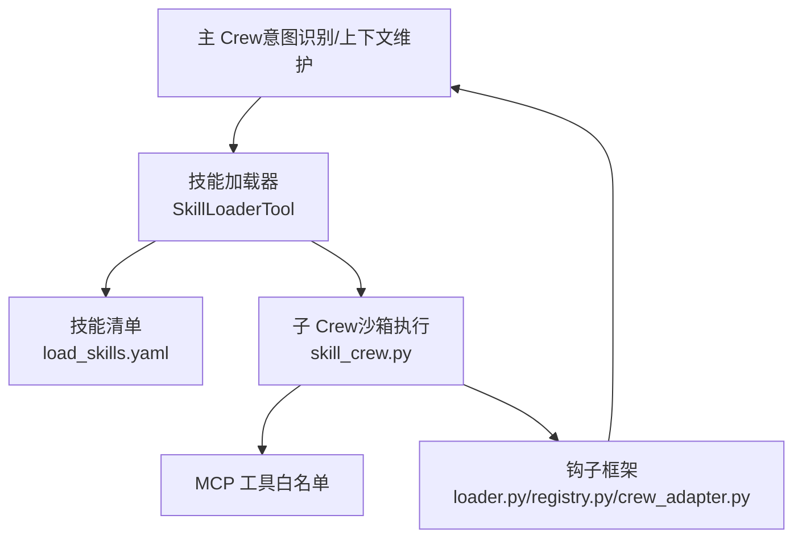
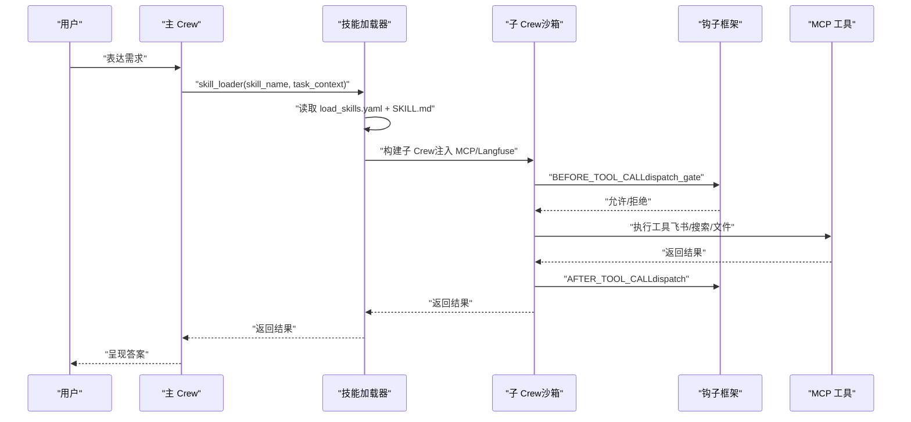
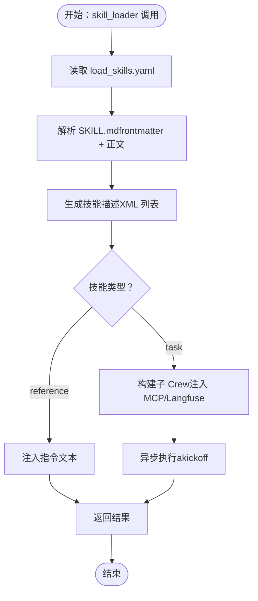
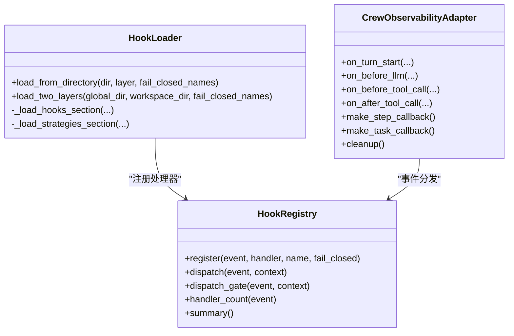
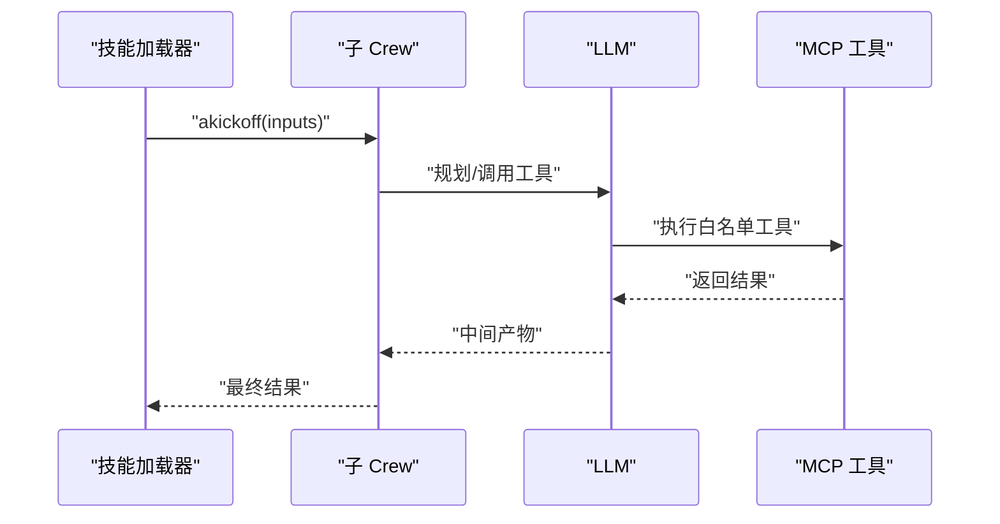
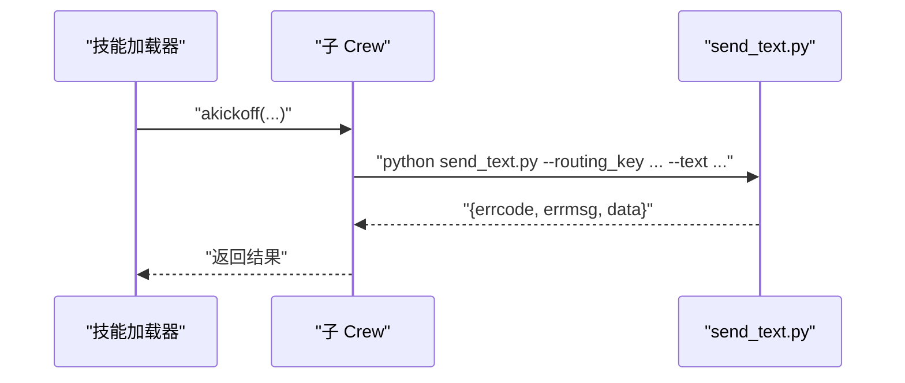
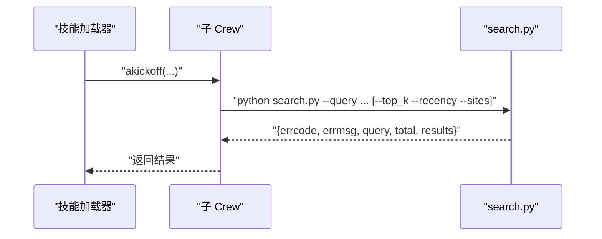
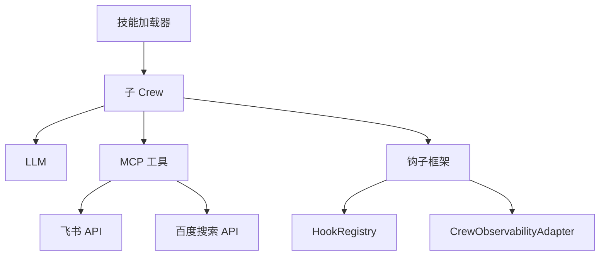

# 技能生态系统

<cite>
**本文引用的文件**
- [load_skills.yaml](file://xiaopaw/skills/load_skills.yaml)
- [skill_loader.py](file://xiaopaw/tools/skill_loader.py)
- [loader.py](file://xiaopaw/hook_framework/loader.py)
- [registry.py](file://xiaopaw/hook_framework/registry.py)
- [crew_adapter.py](file://xiaopaw/hook_framework/crew_adapter.py)
- [skill_crew.py](file://xiaopaw/agents/skill_crew.py)
- [SKILL.md（PDF）](file://xiaopaw/skills/pdf/SKILL.md)
- [SKILL.md（DOCX）](file://xiaopaw/skills/docx/SKILL.md)
- [SKILL.md（PPTX）](file://xiaopaw/skills/pptx/SKILL.md)
- [SKILL.md（XLSX）](file://xiaopaw/skills/xlsx/SKILL.md)
- [SKILL.md（飞书操作）](file://xiaopaw/skills/feishu_ops/SKILL.md)
- [SKILL.md（搜索）](file://xiaopaw/skills/baidu_search/SKILL.md)
- [SKILL.md（网页浏览）](file://xiaopaw/skills/web_browse/SKILL.md)
- [SKILL.md（记忆保存）](file://xiaopaw/skills/memory-save/SKILL.md)
- [send_text.py（飞书）](file://xiaopaw/skills/feishu_ops/scripts/send_text.py)
- [search.py（搜索）](file://xiaopaw/skills/baidu_search/scripts/search.py)
- [check_fillable_fields.py（PDF）](file://xiaopaw/skills/pdf/scripts/check_fillable_fields.py)
</cite>

## 目录
1. [简介](#简介)
2. [项目结构](#项目结构)
3. [核心组件](#核心组件)
4. [架构总览](#架构总览)
5. [详细组件分析](#详细组件分析)
6. [依赖分析](#依赖分析)
7. [性能考虑](#性能考虑)
8. [故障排除指南](#故障排除指南)
9. [结论](#结论)
10. [附录](#附录)

## 简介
本文件系统性阐述 XiaoPaw v2 的技能生态系统，涵盖技能加载与注册、技能发现与清单构建、MCP 工具白名单与技能类型分类、以及各类技能的实现细节与使用模式。文档还提供技能开发指南、最佳实践、代码示例路径与使用场景，并解释技能之间的关系与集成方式。

## 项目结构
XiaoPaw v2 的技能生态围绕“主 Crew + 技能加载器 + 子 Crew（沙箱）”三层协作展开：
- 主 Crew 通过技能加载器选择合适技能并触发执行。
- 技能加载器读取技能清单与技能说明，构造子 Crew 并在沙箱中执行。
- 子 Crew 通过 MCP 工具与外部系统交互（如飞书、搜索 API、文件系统等），并在钩子框架下接受可观测与安全加固。

图表来源
- [skill_loader.py:223-535](file://xiaopaw/tools/skill_loader.py#L223-L535)
- [load_skills.yaml:1-55](file://xiaopaw/skills/load_skills.yaml#L1-L55)
- [skill_crew.py:98-155](file://xiaopaw/agents/skill_crew.py#L98-L155)
- [loader.py:29-246](file://xiaopaw/hook_framework/loader.py#L29-L246)
- [registry.py:118-209](file://xiaopaw/hook_framework/registry.py#L118-L209)
- [crew_adapter.py:63-357](file://xiaopaw/hook_framework/crew_adapter.py#L63-L357)

章节来源
- [skill_loader.py:223-535](file://xiaopaw/tools/skill_loader.py#L223-L535)
- [load_skills.yaml:1-55](file://xiaopaw/skills/load_skills.yaml#L1-L55)
- [skill_crew.py:98-155](file://xiaopaw/agents/skill_crew.py#L98-L155)
- [loader.py:29-246](file://xiaopaw/hook_framework/loader.py#L29-L246)
- [registry.py:118-209](file://xiaopaw/hook_framework/registry.py#L118-L209)
- [crew_adapter.py:63-357](file://xiaopaw/hook_framework/crew_adapter.py#L63-L357)

## 核心组件
- 技能加载器（SkillLoaderTool）
  - 负责读取技能清单、构建技能描述、解析 SKILL.md、构造子 Crew 并在沙箱中执行。
  - 支持“历史阅读”等 reference 类型技能的直接指令注入。
- 子 Crew 构建器（build_skill_crew）
  - 基于 SKILL.md 中的说明动态生成子 Crew，注入 MCP 工具与 LLM，设置 step_callback 与工具输入规范化钩子。
- 钩子框架（HookLoader/Registry/CrewObservabilityAdapter）
  - 提供两段式事件体系（观测层 dispatch 与策略层 dispatch_gate），贯穿 BEFORE_TURN/BEFORE_LLM/BEFORE_TOOL_CALL/AFTER_TOOL_CALL/AFTER_TURN/TASK_COMPLETE/SESSION_END。
  - 通过 ContextVar 在主线程与子线程之间传递 trace 上下文，确保子 Crew 的观察数据挂靠在父技能之下。
- 技能清单与类型
  - 通过 load_skills.yaml 声明技能类型（task/reference）与启用状态，驱动加载器的描述构建与执行路径。

章节来源
- [skill_loader.py:223-535](file://xiaopaw/tools/skill_loader.py#L223-L535)
- [skill_crew.py:98-155](file://xiaopaw/agents/skill_crew.py#L98-L155)
- [loader.py:29-246](file://xiaopaw/hook_framework/loader.py#L29-L246)
- [registry.py:118-209](file://xiaopaw/hook_framework/registry.py#L118-L209)
- [crew_adapter.py:63-357](file://xiaopaw/hook_framework/crew_adapter.py#L63-L357)
- [load_skills.yaml:1-55](file://xiaopaw/skills/load_skills.yaml#L1-L55)

## 架构总览
技能执行的端到端流程如下：

图表来源
- [skill_loader.py:392-449](file://xiaopaw/tools/skill_loader.py#L392-L449)
- [skill_crew.py:141-154](file://xiaopaw/agents/skill_crew.py#L141-L154)
- [crew_adapter.py:160-227](file://xiaopaw/hook_framework/crew_adapter.py#L160-L227)
- [registry.py:170-198](file://xiaopaw/hook_framework/registry.py#L170-L198)

## 详细组件分析

### 技能加载系统与注册发现机制
- 渐进式能力披露
  - 主 Crew 的提示词仅包含技能名与简述，避免上下文膨胀；实现细节延迟到子 Crew 内部执行。
- 清单与描述构建
  - 读取 load_skills.yaml，过滤 enabled 技能，解析 SKILL.md frontmatter 与正文，生成可用技能 XML 列表。
- 指令注入与模板替换
  - 将 SKILL.md 中的占位符（如 {session_dir}、{skill_base}）替换为实际路径，注入沙箱执行指令。
- 子 Crew 构建与执行
  - 对 task 类型技能，构造子 Crew 并异步执行；对 reference 类型技能，直接返回指令文本。
- 历史阅读特殊处理
  - 对 history_reader 的 task_context 进行分页解析，返回结构化历史消息列表。

图表来源
- [skill_loader.py:254-359](file://xiaopaw/tools/skill_loader.py#L254-L359)
- [skill_loader.py:392-449](file://xiaopaw/tools/skill_loader.py#L392-L449)

章节来源
- [skill_loader.py:254-359](file://xiaopaw/tools/skill_loader.py#L254-L359)
- [skill_loader.py:392-449](file://xiaopaw/tools/skill_loader.py#L392-L449)
- [load_skills.yaml:1-55](file://xiaopaw/skills/load_skills.yaml#L1-L55)

### 钩子框架与安全/可观测性
- 事件体系与分发
  - 两段式分发：dispatch（观测层吞异常）与 dispatch_gate（策略层 GuardrailDeny 阻断）。
  - 事件顺序：BEFORE_TURN → BEFORE_LLM → BEFORE_TOOL_CALL → AFTER_TOOL_CALL → AFTER_TURN → TASK_COMPLETE → SESSION_END。
- 上下文与 Trace
  - CrewObservabilityAdapter 通过 ContextVar 在主线程与子线程之间传递 trace 上下文，确保子 Crew 的 span 自动挂靠父技能。
- 策略层
  - 通过 HookLoader 从 hooks.yaml 两层加载（全局与工作区），按声明顺序注册，支持依赖注入与 fail-closed 策略。

图表来源
- [registry.py:118-209](file://xiaopaw/hook_framework/registry.py#L118-L209)
- [loader.py:29-246](file://xiaopaw/hook_framework/loader.py#L29-L246)
- [crew_adapter.py:63-357](file://xiaopaw/hook_framework/crew_adapter.py#L63-L357)

章节来源
- [registry.py:118-209](file://xiaopaw/hook_framework/registry.py#L118-L209)
- [loader.py:29-246](file://xiaopaw/hook_framework/loader.py#L29-L246)
- [crew_adapter.py:63-357](file://xiaopaw/hook_framework/crew_adapter.py#L63-L357)

### 子 Crew 与 MCP 工具白名单
- 子 Crew 构建
  - 从 agents.yaml/tasks.yaml 读取配置，注入 AliyunLLM 与 MCPServerHTTP，设置 step_callback 与工具输入规范化钩子。
- 工具白名单
  - 仅允许在 SKILL.md 中明确列出的脚本与工具通过 MCP 执行，避免任意命令注入。
- 输入规范化
  - 将 dict/list 等非字符串字段序列化为 JSON 字符串，避免 MCP 工具的 Pydantic 校验失败。

图表来源
- [skill_crew.py:98-155](file://xiaopaw/agents/skill_crew.py#L98-L155)
- [skill_loader.py:404-441](file://xiaopaw/tools/skill_loader.py#L404-L441)

章节来源
- [skill_crew.py:98-155](file://xiaopaw/agents/skill_crew.py#L98-L155)
- [skill_loader.py:404-441](file://xiaopaw/tools/skill_loader.py#L404-L441)

### 技能类型与分类
- task 类型
  - 需要在沙箱中执行子 Crew，具备完整的工具链与可观测/安全加固。
- reference 类型
  - 仅注入指令文本，不执行子 Crew，适用于轻量或纯指令型技能（如 history_reader）。

章节来源
- [load_skills.yaml:1-55](file://xiaopaw/skills/load_skills.yaml#L1-L55)
- [skill_loader.py:401-402](file://xiaopaw/tools/skill_loader.py#L401-L402)

### PDF/DOCX/PPTX/XLSX 处理技能
- PDF
  - 支持合并/拆分/旋转/水印/表单填充/加密解密/OCR/文本/表格提取等。
  - 可通过脚本检测可填写字段是否存在，辅助后续表单处理。
- DOCX
  - 支持创建/编辑/分析 Word 文档，包含样式、列表、表格、图像、目录、页眉页脚等高级特性。
  - 提供 XML 编辑与打包流程，确保合规与修复。
- PPTX
  - 支持读取/分析、编辑/创建、缩略图生成、设计建议与质量检查。
- XLSX
  - 支持读取/分析、公式/格式/颜色/数字格式/图表/公式计算与错误检查。
  - 严禁硬编码计算值，必须使用 Excel 公式保持动态性。

章节来源
- [SKILL.md（PDF）:1-315](file://xiaopaw/skills/pdf/SKILL.md#L1-L315)
- [check_fillable_fields.py（PDF）:1-12](file://xiaopaw/skills/pdf/scripts/check_fillable_fields.py#L1-L12)
- [SKILL.md（DOCX）:1-591](file://xiaopaw/skills/docx/SKILL.md#L1-L591)
- [SKILL.md（PPTX）:1-233](file://xiaopaw/skills/pptx/SKILL.md#L1-L233)
- [SKILL.md（XLSX）:1-292](file://xiaopaw/skills/xlsx/SKILL.md#L1-L292)

### 飞书操作技能
- 能力范围
  - 发送纯文本/富文本/图片/文件消息；读取云文档/电子表格；查询群成员；日历事件管理；创建/导入/写入文档/表格；多维表格（Bitable）管理。
- 调用方式
  - 通过沙盒内脚本执行，自动从 /workspace/.config/feishu.json 读取凭证。
- 输出规范
  - 统一输出 JSON（errcode=0 成功，1 失败），包含 data 字段或错误信息与建议。

图表来源
- [SKILL.md（飞书操作）:1-347](file://xiaopaw/skills/feishu_ops/SKILL.md#L1-L347)
- [send_text.py（飞书）:1-52](file://xiaopaw/skills/feishu_ops/scripts/send_text.py#L1-L52)

章节来源
- [SKILL.md（飞书操作）:1-347](file://xiaopaw/skills/feishu_ops/SKILL.md#L1-L347)
- [send_text.py（飞书）:1-52](file://xiaopaw/skills/feishu_ops/scripts/send_text.py#L1-L52)

### 搜索技能（Baidu Search）
- 能力范围
  - 基于百度千帆搜索 API 的网络搜索，支持时间过滤与站点过滤，返回标题、URL 与摘要。
- 调用方式
  - 通过沙盒内脚本执行，凭证来自 /workspace/.config/baidu.json。
- 输出规范
  - 统一 JSON，支持 shell 重定向保存结果文件，避免 JSON 写入工具的类型校验问题。

图表来源
- [SKILL.md（搜索）:1-181](file://xiaopaw/skills/baidu_search/SKILL.md#L1-L181)
- [search.py（搜索）:1-139](file://xiaopaw/skills/baidu_search/scripts/search.py#L1-L139)

章节来源
- [SKILL.md（搜索）:1-181](file://xiaopaw/skills/baidu_search/SKILL.md#L1-L181)
- [search.py（搜索）:1-139](file://xiaopaw/skills/baidu_search/scripts/search.py#L1-L139)

### 网页浏览技能（Web Browse）
- 能力范围
  - 快速 Markdown 转换与浏览器全功能（导航、元素提取、截图、表单填写、JS 执行）。
- 使用建议
  - 优先使用 sandbox_convert_to_markdown；任务完成后必须调用 browser_close() 释放资源。
- 输出规范
  - 统一 JSON，包含 url、content_type、content、links、output_files 等字段。

章节来源
- [SKILL.md（网页浏览）:1-171](file://xiaopaw/skills/web_browse/SKILL.md#L1-L171)

### 记忆保存技能（Memory Save）
- 能力范围
  - 将对话中的重要信息持久化到 /workspace/soul.md、/workspace/user.md、/workspace/agent.md 或 /workspace/memory_<name>.md。
- 限制与规则
  - 仅允许一次 Read + 一次 Write；目标路径严格限定；禁止绕过权限与静默失败。
- 失败处理
  - 严格返回失败 JSON，避免跨会话召回失效。

章节来源
- [SKILL.md（记忆保存）:1-98](file://xiaopaw/skills/memory-save/SKILL.md#L1-L98)

### 技能开发指南与最佳实践
- 清单与类型
  - 在 load_skills.yaml 中声明技能类型与启用状态；task 类型需提供 SKILL.md 与脚本工具链。
- SKILL.md 规范
  - frontmatter 包含 name/description；正文提供“快速参考/常见任务/依赖/注意事项/输出格式要求”等。
  - 使用 {session_dir}、{skill_base} 等占位符，由加载器自动替换。
- 子 Crew 配置
  - 在 agents.yaml/tasks.yaml 中定义子 Agent 与 Task 的模板，注入 LLM 与 MCP。
- 工具白名单
  - 仅允许在 SKILL.md 中列出的脚本与工具通过 MCP 执行；避免任意命令注入。
- 输入规范化
  - 对 dict/list 等非字符串字段进行 JSON 序列化，避免 MCP 工具校验失败。
- 安全与可观测
  - 通过钩子框架的 dispatch_gate 与 fail-closed 策略，确保安全策略拦截后阻断链路。
  - 使用 CrewObservabilityAdapter 的 ContextVar 机制，确保子 Crew 的 trace 自动挂靠父节点。

章节来源
- [load_skills.yaml:1-55](file://xiaopaw/skills/load_skills.yaml#L1-L55)
- [SKILL.md（PDF）:1-315](file://xiaopaw/skills/pdf/SKILL.md#L1-L315)
- [SKILL.md（DOCX）:1-591](file://xiaopaw/skills/docx/SKILL.md#L1-L591)
- [SKILL.md（PPTX）:1-233](file://xiaopaw/skills/pptx/SKILL.md#L1-L233)
- [SKILL.md（XLSX）:1-292](file://xiaopaw/skills/xlsx/SKILL.md#L1-L292)
- [SKILL.md（飞书操作）:1-347](file://xiaopaw/skills/feishu_ops/SKILL.md#L1-L347)
- [SKILL.md（搜索）:1-181](file://xiaopaw/skills/baidu_search/SKILL.md#L1-L181)
- [SKILL.md（网页浏览）:1-171](file://xiaopaw/skills/web_browse/SKILL.md#L1-L171)
- [SKILL.md（记忆保存）:1-98](file://xiaopaw/skills/memory-save/SKILL.md#L1-L98)
- [skill_crew.py:98-155](file://xiaopaw/agents/skill_crew.py#L98-L155)
- [crew_adapter.py:63-357](file://xiaopaw/hook_framework/crew_adapter.py#L63-L357)
- [registry.py:118-209](file://xiaopaw/hook_framework/registry.py#L118-L209)

## 依赖分析
- 组件耦合
  - 技能加载器与子 Crew 通过 SKILL.md 解耦；子 Crew 与 MCP 工具通过白名单解耦。
  - 钩子框架与 CrewObservabilityAdapter 通过 ContextVar 解耦线程边界，确保 trace 一致性。
- 外部依赖
  - 飞书：HTTP API（IM、文档、表格、日历、Bitable）。
  - 搜索：百度千帆搜索 API。
  - 文档/表格：LibreOffice、pandoc、Poppler、docx、pptxgenjs、openpyxl、pandas 等。
- 潜在风险
  - 子 Crew 的 URL 必须为 http(s)；否则会触发协议异常导致超时。
  - MCP 工具的参数类型必须符合规范（布尔/数字/路径），避免沙箱执行失败。

图表来源
- [skill_loader.py:404-441](file://xiaopaw/tools/skill_loader.py#L404-L441)
- [skill_crew.py:107-114](file://xiaopaw/agents/skill_crew.py#L107-L114)
- [crew_adapter.py:63-90](file://xiaopaw/hook_framework/crew_adapter.py#L63-L90)
- [registry.py:118-134](file://xiaopaw/hook_framework/registry.py#L118-L134)

章节来源
- [skill_loader.py:404-441](file://xiaopaw/tools/skill_loader.py#L404-L441)
- [skill_crew.py:107-114](file://xiaopaw/agents/skill_crew.py#L107-L114)
- [crew_adapter.py:63-90](file://xiaopaw/hook_framework/crew_adapter.py#L63-L90)
- [registry.py:118-134](file://xiaopaw/hook_framework/registry.py#L118-L134)

## 性能考虑
- 子 Crew 在独立线程与事件循环中执行，避免与主线程事件循环冲突。
- 子 Crew 的工具输入规范化减少重复重试与校验失败带来的成本。
- 钩子框架的 dispatch 与 dispatch_gate 分离，观测层失败不影响业务，策略层失败即时阻断。
- 快速模式优先（如网页浏览的 sandbox_convert_to_markdown），减少浏览器资源占用。

## 故障排除指南
- 子 Crew 5 分钟超时
  - 可能原因：沙箱 MCP URL 非 http(s)；子线程事件循环未正确关闭。
  - 处理：确保传入有效 URL；检查子线程清理逻辑。
- MCP 工具执行失败
  - 可能原因：参数类型不符、路径错误、权限不足。
  - 处理：遵循参数类型规范；使用绝对路径；检查沙盒内文件权限。
- 安全策略拦截
  - 可能原因：策略层 GuardrailDeny 抛出。
  - 处理：查看 deny 原因与详细信息，调整输入或策略配置。
- 飞书/搜索 API 失败
  - 可能原因：凭证缺失、网络异常、HTTP 错误。
  - 处理：检查 /workspace/.config 下凭证文件；重试或调整参数。

章节来源
- [skill_crew.py:107-114](file://xiaopaw/agents/skill_crew.py#L107-L114)
- [search.py（搜索）:96-112](file://xiaopaw/skills/baidu_search/scripts/search.py#L96-L112)
- [send_text.py（飞书）:42-47](file://xiaopaw/skills/feishu_ops/scripts/send_text.py#L42-L47)
- [registry.py:170-198](file://xiaopaw/hook_framework/registry.py#L170-L198)

## 结论
XiaoPaw v2 的技能生态系统通过“主 Crew + 技能加载器 + 子 Crew（沙箱）”的三层协作，实现了渐进式能力披露与零编排的技能执行模式。结合钩子框架的可观测与安全加固，以及严格的 MCP 工具白名单与输入规范化，系统在保证安全性与可追溯性的同时，提供了强大的文档处理、办公协作与信息检索能力。开发者可依据本文档提供的规范与最佳实践，快速扩展新的技能并确保其与现有生态的无缝集成。

## 附录
- 使用场景示例（路径指引）
  - PDF 表单检测：[check_fillable_fields.py（PDF）:1-12](file://xiaopaw/skills/pdf/scripts/check_fillable_fields.py#L1-L12)
  - 飞书发送消息：[send_text.py（飞书）:1-52](file://xiaopaw/skills/feishu_ops/scripts/send_text.py#L1-L52)
  - 百度搜索：[search.py（搜索）:1-139](file://xiaopaw/skills/baidu_search/scripts/search.py#L1-L139)
  - 子 Crew 构建：[skill_crew.py:98-155](file://xiaopaw/agents/skill_crew.py#L98-L155)
  - 钩子框架加载：[loader.py:235-246](file://xiaopaw/hook_framework/loader.py#L235-L246)
  - 钩子注册与分发：[registry.py:135-198](file://xiaopaw/hook_framework/registry.py#L135-L198)
  - 观测适配器：[crew_adapter.py:160-300](file://xiaopaw/hook_framework/crew_adapter.py#L160-L300)