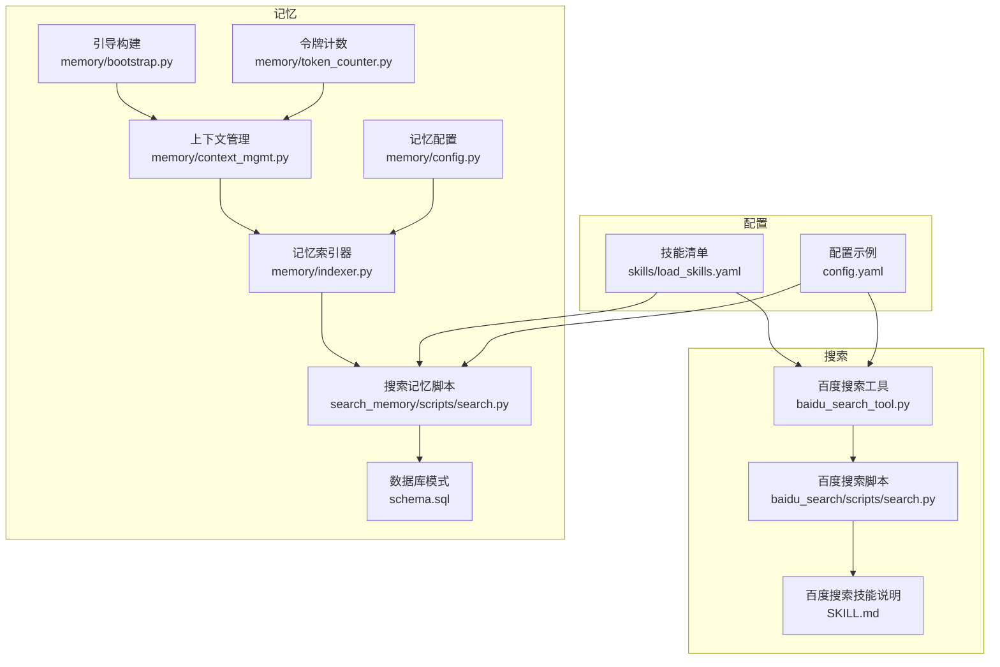
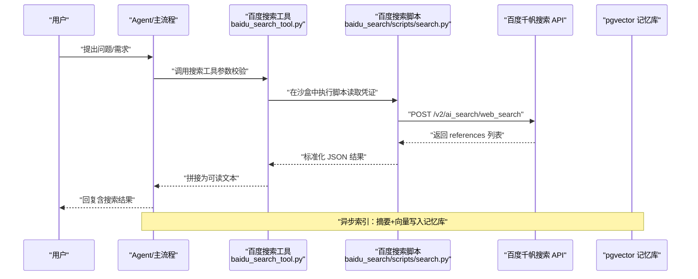
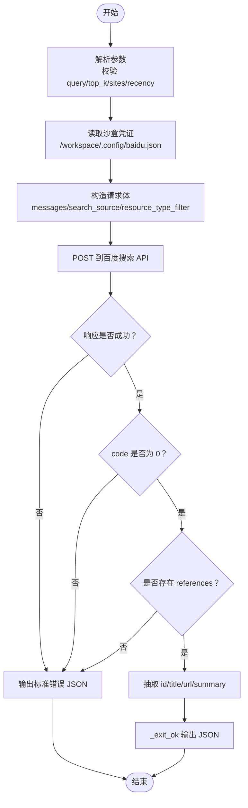
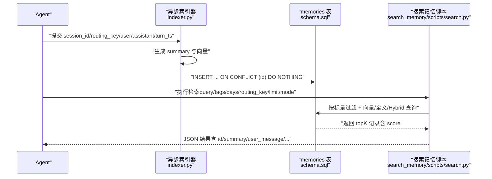
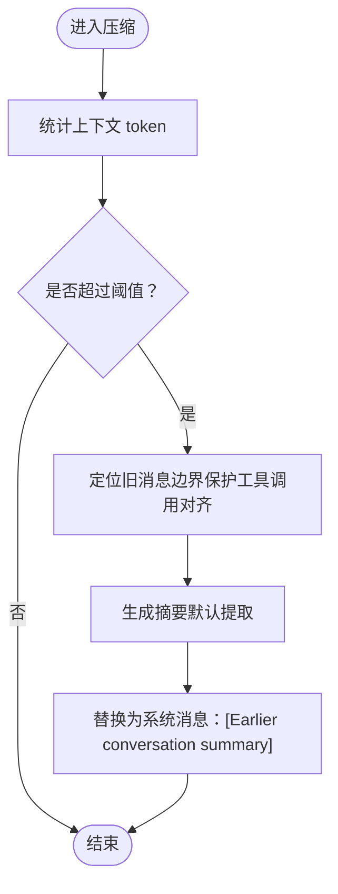
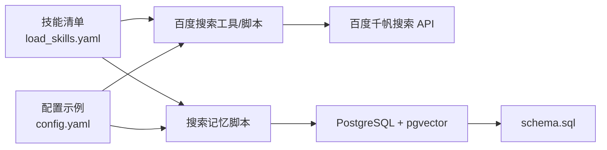

# 搜索与记忆技能

<cite>
**本文档引用的文件**
- [baidu_search 脚本](file://xiaopaw/skills/baidu_search/scripts/search.py)
- [百度搜索工具](file://xiaopaw/tools/baidu_search_tool.py)
- [百度搜索技能说明](file://xiaopaw/skills/baidu_search/SKILL.md)
- [搜索记忆脚本](file://xiaopaw/skills/search_memory/scripts/search.py)
- [搜索记忆技能说明](file://xiaopaw/skills/search_memory/SKILL.md)
- [记忆索引器](file://xiaopaw/memory/indexer.py)
- [记忆上下文管理](file://xiaopaw/memory/context_mgmt.py)
- [记忆配置](file://xiaopaw/memory/config.py)
- [记忆引导构建](file://xiaopaw/memory/bootstrap.py)
- [内存令牌计数](file://xiaopaw/memory/token_counter.py)
- [技能清单](file://xiaopaw/skills/load_skills.yaml)
- [配置示例](file://config.yaml)
- [端到端测试：搜索](file://tests/e2e/test_e2e_05_search.py)
- [端到端测试：搜索记忆](file://tests/e2e/test_e2e_08_search_memory.py)
- [数据库模式](file://schema.sql)
</cite>

## 目录
1. [简介](#简介)
2. [项目结构](#项目结构)
3. [核心组件](#核心组件)
4. [架构总览](#架构总览)
5. [详细组件分析](#详细组件分析)
6. [依赖关系分析](#依赖关系分析)
7. [性能考量](#性能考量)
8. [故障排除指南](#故障排除指南)
9. [结论](#结论)
10. [附录](#附录)

## 简介
本文件面向 XiaoPaw v2 的“搜索与记忆技能”，系统性阐述以下能力：
- 百度搜索集成：从工具层到沙盒脚本的完整链路，包括参数校验、请求构造、错误处理与结果标准化输出。
- 搜索结果处理：统一的 JSON 输出格式、摘要截断与展示策略。
- 搜索记忆管理：基于 pgvector 的异步索引、混合检索（向量×0.7 + 全文×0.3）、标量过滤与降级策略。
- 算法优化与排序：向量距离、全文 BM25 近似、混合打分与去重策略。
- 存储与检索：PostgreSQL + pgvector 模式、索引设计与查询优化。
- 使用示例、配置项与故障排除。

## 项目结构
围绕“搜索与记忆”的关键目录与文件如下：
- 百度搜索
  - 工具层：xiaopaw/tools/baidu_search_tool.py
  - 沙盒脚本：xiaopaw/skills/baidu_search/scripts/search.py
  - 技能说明：xiaopaw/skills/baidu_search/SKILL.md
- 搜索记忆
  - 脚本：xiaopaw/skills/search_memory/scripts/search.py
  - 技能说明：xiaopaw/skills/search_memory/SKILL.md
  - 异步索引：xiaopaw/memory/indexer.py
  - 上下文管理：xiaopaw/memory/context_mgmt.py
  - 配置与引导：xiaopaw/memory/config.py, xiaopaw/memory/bootstrap.py
  - 令牌计数：xiaopaw/memory/token_counter.py
- 配置与模式
  - 技能清单：xiaopaw/skills/load_skills.yaml
  - 配置示例：config.yaml
  - 数据库模式：schema.sql
- 测试
  - 端到端测试：tests/e2e/test_e2e_05_search.py, tests/e2e/test_e2e_08_search_memory.py

图表来源
- [百度搜索工具:1-105](file://xiaopaw/tools/baidu_search_tool.py#L1-L105)
- [baidu_search 脚本:1-139](file://xiaopaw/skills/baidu_search/scripts/search.py#L1-L139)
- [百度搜索技能说明:1-181](file://xiaopaw/skills/baidu_search/SKILL.md#L1-L181)
- [记忆索引器:1-96](file://xiaopaw/memory/indexer.py#L1-L96)
- [记忆上下文管理:1-99](file://xiaopaw/memory/context_mgmt.py#L1-L99)
- [记忆配置:1-5](file://xiaopaw/memory/config.py#L1-L5)
- [记忆引导构建:1-37](file://xiaopaw/memory/bootstrap.py#L1-L37)
- [内存令牌计数:1-44](file://xiaopaw/memory/token_counter.py#L1-L44)
- [搜索记忆脚本:1-209](file://xiaopaw/skills/search_memory/scripts/search.py#L1-L209)
- [数据库模式:1-44](file://schema.sql#L1-L44)
- [技能清单:1-55](file://xiaopaw/skills/load_skills.yaml#L1-L55)
- [配置示例:1-90](file://config.yaml#L1-L90)

章节来源
- [百度搜索工具:1-105](file://xiaopaw/tools/baidu_search_tool.py#L1-L105)
- [baidu_search 脚本:1-139](file://xiaopaw/skills/baidu_search/scripts/search.py#L1-L139)
- [百度搜索技能说明:1-181](file://xiaopaw/skills/baidu_search/SKILL.md#L1-L181)
- [搜索记忆脚本:1-209](file://xiaopaw/skills/search_memory/scripts/search.py#L1-L209)
- [搜索记忆技能说明:1-135](file://xiaopaw/skills/search_memory/SKILL.md#L1-L135)
- [记忆索引器:1-96](file://xiaopaw/memory/indexer.py#L1-L96)
- [记忆上下文管理:1-99](file://xiaopaw/memory/context_mgmt.py#L1-L99)
- [记忆配置:1-5](file://xiaopaw/memory/config.py#L1-L5)
- [记忆引导构建:1-37](file://xiaopaw/memory/bootstrap.py#L1-L37)
- [内存令牌计数:1-44](file://xiaopaw/memory/token_counter.py#L1-L44)
- [技能清单:1-55](file://xiaopaw/skills/load_skills.yaml#L1-L55)
- [配置示例:1-90](file://config.yaml#L1-L90)
- [数据库模式:1-44](file://schema.sql#L1-L44)

## 核心组件
- 百度搜索工具与脚本
  - 工具层负责参数校验、请求构造与错误处理，并将结果标准化为人类可读文本。
  - 沙盒脚本负责凭证读取、请求百度 API、解析响应并输出统一 JSON。
- 搜索记忆
  - 异步索引器：对每轮对话生成摘要、向量化并写入数据库。
  - 搜索脚本：支持向量、全文与混合三种检索模式，支持标签、时间与路由键过滤。
- 上下文与配置
  - 上下文管理：压缩旧消息、裁剪工具结果、持久化会话上下文。
  - 配置与引导：硬限制、最大长度、引导提示构建与令牌计数策略。

章节来源
- [百度搜索工具:1-105](file://xiaopaw/tools/baidu_search_tool.py#L1-L105)
- [baidu_search 脚本:1-139](file://xiaopaw/skills/baidu_search/scripts/search.py#L1-L139)
- [搜索记忆脚本:1-209](file://xiaopaw/skills/search_memory/scripts/search.py#L1-L209)
- [记忆索引器:1-96](file://xiaopaw/memory/indexer.py#L1-L96)
- [记忆上下文管理:1-99](file://xiaopaw/memory/context_mgmt.py#L1-L99)
- [记忆配置:1-5](file://xiaopaw/memory/config.py#L1-L5)
- [记忆引导构建:1-37](file://xiaopaw/memory/bootstrap.py#L1-L37)
- [内存令牌计数:1-44](file://xiaopaw/memory/token_counter.py#L1-L44)

## 架构总览
下图展示了“搜索与记忆”在系统中的交互关系与数据流：

图表来源
- [百度搜索工具:1-105](file://xiaopaw/tools/baidu_search_tool.py#L1-L105)
- [baidu_search 脚本:1-139](file://xiaopaw/skills/baidu_search/scripts/search.py#L1-L139)
- [搜索记忆脚本:1-209](file://xiaopaw/skills/search_memory/scripts/search.py#L1-L209)
- [记忆索引器:1-96](file://xiaopaw/memory/indexer.py#L1-L96)

## 详细组件分析

### 百度搜索：工具与脚本
- 参数与校验
  - 工具层：query 必填、top_k 0-50、sites 最多 20 个、recency 可选枚举。
  - 脚本层：解析参数、读取沙盒凭证、构造 payload、设置超时与过滤。
- 请求与响应
  - 使用百度千帆搜索接口，支持时间过滤与站点过滤。
  - 统一输出 JSON，包含 errcode、errmsg、query、total、results。
- 错误处理
  - 超时、HTTP 错误、网络异常、JSON 解析失败、API 错误码均转为标准错误输出。
- 结果处理
  - 将 references 转换为 id/title/url/summary 的结构化列表，便于后续处理。

图表来源
- [baidu_search 脚本:1-139](file://xiaopaw/skills/baidu_search/scripts/search.py#L1-L139)

章节来源
- [百度搜索工具:1-105](file://xiaopaw/tools/baidu_search_tool.py#L1-L105)
- [baidu_search 脚本:1-139](file://xiaopaw/skills/baidu_search/scripts/search.py#L1-L139)
- [百度搜索技能说明:1-181](file://xiaopaw/skills/baidu_search/SKILL.md#L1-L181)

### 搜索记忆：检索与索引
- 异步索引
  - 对话轮次生成摘要与向量，写入 memories 表，主键为 session_id:turn_ts 的哈希。
  - 使用 OpenAI 兼容客户端进行 chat/completions 与 embeddings。
- 检索策略
  - 模式选择：vector（纯向量）、fulltext（纯全文）、hybrid（推荐）。
  - 标量过滤：tags（数组交集）、days（基于 make_interval 的时间窗口）、routing_key。
  - 混合打分：向量得分×0.7 + 全文 BM25 得分×0.3。
- 查询实现
  - 向量：使用向量余弦距离（hnsw 索引）。
  - 全文：使用 to_tsvector('simple', search_text) 与 ts_rank 近似 BM25。
  - 混合：单 SQL 同时计算两部分得分并加权排序。
- 输出序列化
  - datetime 转 ISO 字符串，score 保留 4 位小数。

图表来源
- [记忆索引器:1-96](file://xiaopaw/memory/indexer.py#L1-L96)
- [搜索记忆脚本:1-209](file://xiaopaw/skills/search_memory/scripts/search.py#L1-L209)
- [数据库模式:1-44](file://schema.sql#L1-L44)

章节来源
- [搜索记忆脚本:1-209](file://xiaopaw/skills/search_memory/scripts/search.py#L1-L209)
- [搜索记忆技能说明:1-135](file://xiaopaw/skills/search_memory/SKILL.md#L1-L135)
- [记忆索引器:1-96](file://xiaopaw/memory/indexer.py#L1-L96)
- [数据库模式:1-44](file://schema.sql#L1-L44)

### 上下文管理与压缩
- 压缩阈值与策略
  - 当上下文超过模型限制的 0.45 比例时，对旧消息进行压缩。
  - 保护工具调用配对边界，避免切分不完整。
- 裁剪工具结果
  - 对旧的 tool_result 内容进行摘要式裁剪，保留关键片段。
- 会话持久化
  - 以 JSON/JSONL 形式保存上下文与原始消息，支持加载与追加。

图表来源
- [记忆上下文管理:1-99](file://xiaopaw/memory/context_mgmt.py#L1-L99)
- [内存令牌计数:1-44](file://xiaopaw/memory/token_counter.py#L1-L44)

章节来源
- [记忆上下文管理:1-99](file://xiaopaw/memory/context_mgmt.py#L1-L99)
- [内存令牌计数:1-44](file://xiaopaw/memory/token_counter.py#L1-L44)

## 依赖关系分析
- 技能启用
  - 百度搜索与搜索记忆在技能清单中均标记为 task 并启用。
- 配置依赖
  - 搜索工具依赖 BAIDU_API_KEY 环境变量。
  - 搜索记忆依赖 MEMORY_DB_DSN 环境变量与 pgvector 扩展。
- 数据库索引
  - 向量：hnsw cosine 索引（summary_vec/message_vec）。
  - 全文：gin 索引（search_tsv）。
  - 标量：gin（tags）、btree（routing_key/created_at）。

图表来源
- [技能清单:1-55](file://xiaopaw/skills/load_skills.yaml#L1-L55)
- [配置示例:1-90](file://config.yaml#L1-L90)
- [百度搜索工具:1-105](file://xiaopaw/tools/baidu_search_tool.py#L1-L105)
- [baidu_search 脚本:1-139](file://xiaopaw/skills/baidu_search/scripts/search.py#L1-L139)
- [搜索记忆脚本:1-209](file://xiaopaw/skills/search_memory/scripts/search.py#L1-L209)
- [数据库模式:1-44](file://schema.sql#L1-L44)

章节来源
- [技能清单:1-55](file://xiaopaw/skills/load_skills.yaml#L1-L55)
- [配置示例:1-90](file://config.yaml#L1-L90)
- [百度搜索工具:1-105](file://xiaopaw/tools/baidu_search_tool.py#L1-L105)
- [baidu_search 脚本:1-139](file://xiaopaw/skills/baidu_search/scripts/search.py#L1-L139)
- [搜索记忆脚本:1-209](file://xiaopaw/skills/search_memory/scripts/search.py#L1-L209)
- [数据库模式:1-44](file://schema.sql#L1-L44)

## 性能考量
- 搜索工具
  - 超时控制：统一 30 秒；top_k 控制召回规模，减少网络与解析开销。
  - 结果摘要截断：避免长内容影响 LLM 接收与上下文占用。
- 搜索记忆
  - 向量索引：hnsw cosine 索引，支持高效近似最近邻检索。
  - 全文索引：gin + to_tsvector，BM25 近似提升精确检索效率。
  - 混合检索：单 SQL 同时计算两部分得分，兼顾语义与精确匹配。
  - 标量过滤：利用数组交集与时间窗口，缩小候选集。
- 上下文管理
  - 令牌计数：优先使用本地分词器，回退粗估，平衡准确性与性能。
  - 压缩阈值与保留新鲜轮次，降低重复信息带来的 token 占用。

[本节为通用性能指导，不直接分析具体文件]

## 故障排除指南
- 百度搜索
  - 凭证缺失：确认沙盒内 /workspace/.config/baidu.json 存在且包含 api_key。
  - API Key 无效：检查 BAIDU_API_KEY 环境变量与百度侧权限。
  - 超时/网络异常：适当降低 top_k 或延后重试；检查沙盒网络连通性。
  - 无结果：尝试放宽 recency/sites 限制，或改用混合检索。
- 搜索记忆
  - 无法连接数据库：检查 MEMORY_DB_DSN 环境变量与数据库可达性。
  - pgvector 扩展缺失：确保已创建 vector 扩展并执行 schema.sql。
  - 搜索结果为空：按“去掉 days → 去掉 tags → 纯向量检索”的顺序降级。
  - 向量/全文检索差异：向量侧重语义相似，全文侧重关键字匹配，按场景选择模式。
- 上下文与压缩
  - 压缩后丢失关键信息：调整 compress_threshold 或减少压缩比例。
  - 会话持久化失败：检查数据目录权限与磁盘空间。

章节来源
- [baidu_search 脚本:1-139](file://xiaopaw/skills/baidu_search/scripts/search.py#L1-L139)
- [百度搜索技能说明:1-181](file://xiaopaw/skills/baidu_search/SKILL.md#L1-L181)
- [搜索记忆技能说明:1-135](file://xiaopaw/skills/search_memory/SKILL.md#L1-L135)
- [数据库模式:1-44](file://schema.sql#L1-L44)
- [记忆上下文管理:1-99](file://xiaopaw/memory/context_mgmt.py#L1-L99)

## 结论
XiaoPaw v2 的“搜索与记忆技能”通过工具层与沙盒脚本的协同，实现了稳定可靠的外部信息检索；通过 pgvector 的异步索引与混合检索，提供了高相关性的历史记忆召回。结合上下文压缩与配置化策略，系统在准确性、性能与可维护性之间取得良好平衡。建议在生产环境中：
- 明确各场景下的检索模式选择；
- 合理设置 top_k 与过滤条件；
- 关注凭证与数据库连接的可用性；
- 定期评估与优化索引与查询策略。

[本节为总结性内容，不直接分析具体文件]

## 附录

### 使用示例与配置要点
- 百度搜索
  - 基本用法与参数详见技能说明；注意使用 shell 重定向保存结果，避免 LLM 写文件导致的类型校验失败。
- 搜索记忆
  - 通过命令行参数传入 query/tags/days/routing_key/limit/mode，按需组合标量过滤与检索模式。
- 配置项
  - BAIDU_API_KEY：百度搜索凭证。
  - MEMORY_DB_DSN：pgvector 数据库连接串。
  - token_counter_mode：令牌计数策略（rough 粗估）。
  - context_window_tokens/compress_threshold：上下文压缩阈值与窗口大小。

章节来源
- [百度搜索技能说明:1-181](file://xiaopaw/skills/baidu_search/SKILL.md#L1-L181)
- [搜索记忆技能说明:1-135](file://xiaopaw/skills/search_memory/SKILL.md#L1-L135)
- [配置示例:1-90](file://config.yaml#L1-L90)

### 端到端验证参考
- 搜索技能：验证 Agent → 工具 → 沙盒 → 搜索结果的完整链路。
- 搜索记忆：验证语义召回与降级策略，确保在无匹配时合理回退。

章节来源
- [端到端测试：搜索:1-62](file://tests/e2e/test_e2e_05_search.py#L1-L62)
- [端到端测试：搜索记忆:1-79](file://tests/e2e/test_e2e_08_search_memory.py#L1-L79)