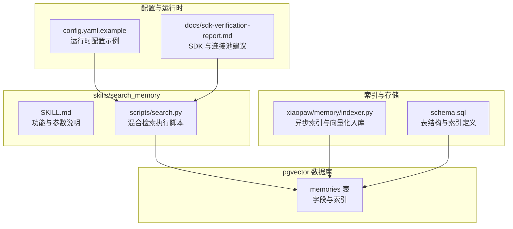
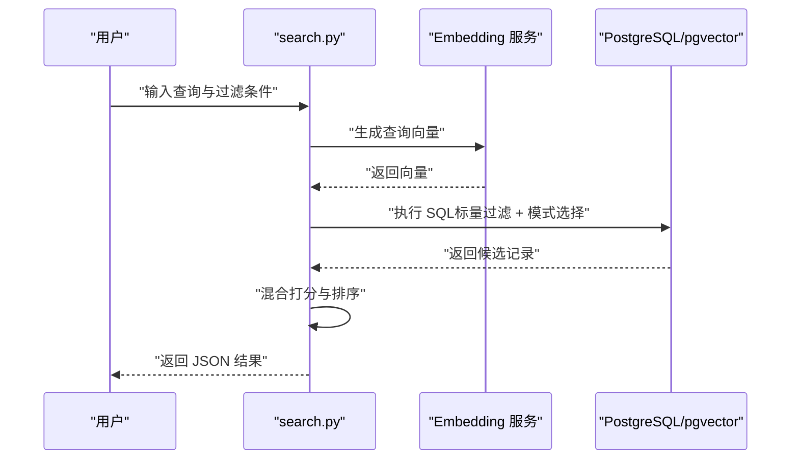
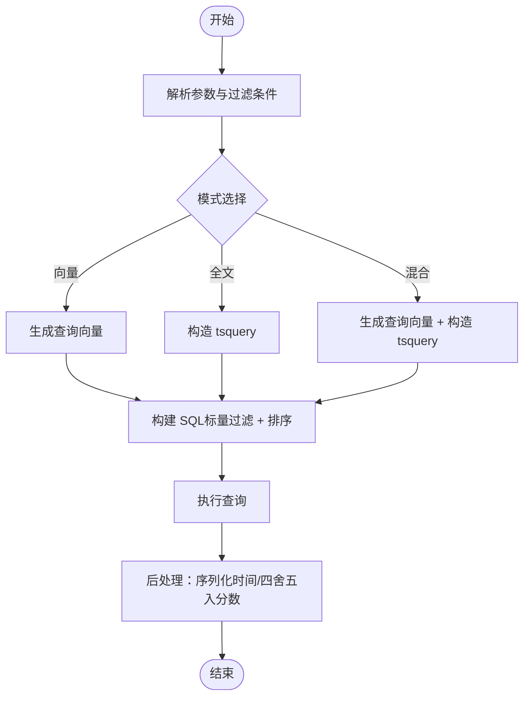
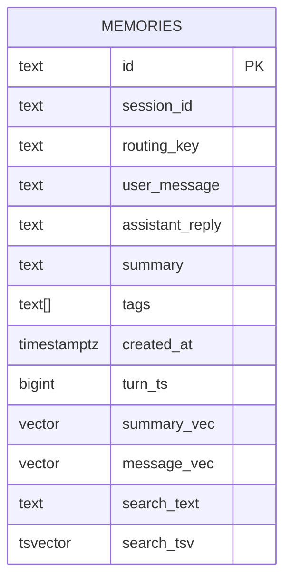
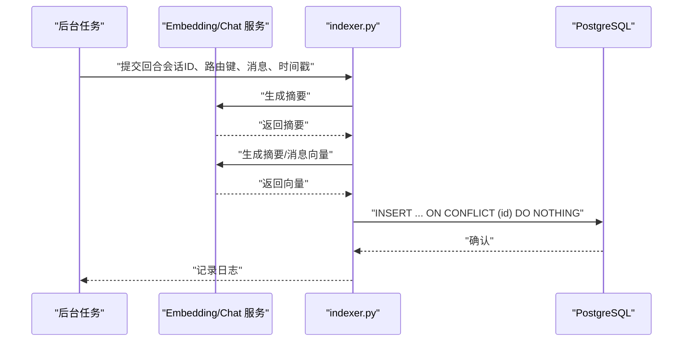
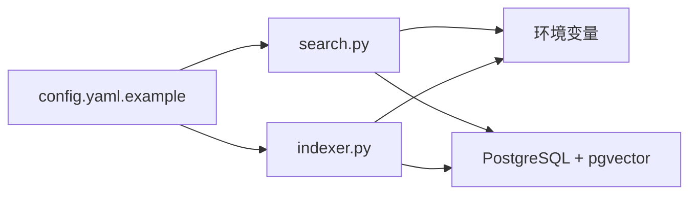

# 搜索记忆技能

<cite>
**本文引用的文件**
- [xiaopaw/skills/search_memory/scripts/search.py](file://xiaopaw/skills/search_memory/scripts/search.py)
- [xiaopaw/skills/search_memory/SKILL.md](file://xiaopaw/skills/search_memory/SKILL.md)
- [schema.sql](file://schema.sql)
- [xiaopaw/memory/indexer.py](file://xiaopaw/memory/indexer.py)
- [xiaopaw/memory/config.py](file://xiaopaw/memory/config.py)
- [xiaopaw/memory/token_counter.py](file://xiaopaw/memory/token_counter.py)
- [tests/e2e/test_e2e_08_search_memory.py](file://tests/e2e/test_e2e_08_search_memory.py)
- [config.yaml.example](file://config.yaml.example)
- [docs/02-modules.md](file://docs/02-modules.md)
- [docs/sdk-verification-report.md](file://docs/sdk-verification-report.md)
</cite>

## 目录
1. [简介](#简介)
2. [项目结构](#项目结构)
3. [核心组件](#核心组件)
4. [架构总览](#架构总览)
5. [组件详解](#组件详解)
6. [依赖关系分析](#依赖关系分析)
7. [性能考量](#性能考量)
8. [故障排查指南](#故障排查指南)
9. [结论](#结论)
10. [附录](#附录)

## 简介
本文件系统性阐述 XiaoPaw v2 的“搜索记忆”技能，涵盖记忆存储策略、检索算法、与 pgvector 的集成方式、配置选项、使用场景与最佳实践，并提供高效查询与排序的参考路径。文档还说明数据生命周期管理、缓存策略与性能调优方法，帮助读者在生产环境中稳定、高效地使用搜索记忆能力。

## 项目结构
搜索记忆技能位于 skills 目录下的 search_memory 子目录，核心实现为一个独立的 Python 脚本，负责：
- 从环境变量读取数据库连接信息
- 使用外部 Embedding 服务生成查询向量
- 基于三种模式执行检索：纯向量、纯全文、混合检索
- 通过标量过滤（标签、时间窗口、路由键）与排序输出结果

图表来源
- [xiaopaw/skills/search_memory/SKILL.md:1-135](file://xiaopaw/skills/search_memory/SKILL.md#L1-L135)
- [xiaopaw/skills/search_memory/scripts/search.py:1-209](file://xiaopaw/skills/search_memory/scripts/search.py#L1-L209)
- [schema.sql:1-44](file://schema.sql#L1-L44)
- [xiaopaw/memory/indexer.py:1-96](file://xiaopaw/memory/indexer.py#L1-L96)
- [config.yaml.example:1-90](file://config.yaml.example#L1-L90)
- [docs/sdk-verification-report.md:109-122](file://docs/sdk-verification-report.md#L109-L122)

章节来源
- [xiaopaw/skills/search_memory/SKILL.md:1-135](file://xiaopaw/skills/search_memory/SKILL.md#L1-L135)
- [xiaopaw/skills/search_memory/scripts/search.py:1-209](file://xiaopaw/skills/search_memory/scripts/search.py#L1-L209)
- [schema.sql:1-44](file://schema.sql#L1-L44)
- [xiaopaw/memory/indexer.py:1-96](file://xiaopaw/memory/indexer.py#L1-L96)
- [config.yaml.example:1-90](file://config.yaml.example#L1-L90)
- [docs/sdk-verification-report.md:109-122](file://docs/sdk-verification-report.md#L109-L122)

## 核心组件
- 检索脚本：提供命令行入口，封装向量化、SQL 查询、标量过滤与结果序列化。
- 数据库模式：定义 memories 表结构与 pgvector/HNSW、Gin、标量索引。
- 异步索引器：负责摘要生成、向量嵌入、全文文本拼接与写入数据库。
- 配置与运行时：运行时配置示例、连接池与 SDK 兼容性建议。

章节来源
- [xiaopaw/skills/search_memory/scripts/search.py:27-38](file://xiaopaw/skills/search_memory/scripts/search.py#L27-L38)
- [schema.sql:4-43](file://schema.sql#L4-L43)
- [xiaopaw/memory/indexer.py:32-96](file://xiaopaw/memory/indexer.py#L32-L96)
- [config.yaml.example:25-30](file://config.yaml.example#L25-L30)
- [docs/sdk-verification-report.md:109-122](file://docs/sdk-verification-report.md#L109-L122)

## 架构总览
搜索记忆的端到端流程如下：
- 输入：用户意图（自然语言）
- 处理：生成查询向量（Embedding）
- 检索：基于标量过滤与三种检索模式（向量/全文/混合）执行 SQL 查询
- 排序：按混合得分（向量×0.7 + 全文×0.3）降序
- 输出：标准化 JSON 结果（时间转字符串、保留 4 位小数）

图表来源
- [xiaopaw/skills/search_memory/scripts/search.py:45-172](file://xiaopaw/skills/search_memory/scripts/search.py#L45-L172)
- [schema.sql:4-43](file://schema.sql#L4-L43)

章节来源
- [xiaopaw/skills/search_memory/scripts/search.py:58-172](file://xiaopaw/skills/search_memory/scripts/search.py#L58-L172)
- [schema.sql:4-43](file://schema.sql#L4-L43)

## 组件详解

### 检索脚本（search.py）
- 配置项
  - 数据库 DSN：从环境变量读取，默认值可在脚本中查看
  - Embedding 模型与维度：固定模型与维度
  - LLM 客户端：从环境变量读取密钥与基础地址
- 检索模式
  - 纯向量：计算余弦距离作为相似度得分
  - 纯全文：使用 BM25 近似（plainto_tsquery + ts_rank）
  - 混合：向量得分×0.7 + 全文得分×0.3
- 标量过滤
  - 标签（数组交集）
  - 时间窗口（使用 make_interval 替代参数绑定）
  - 路由键（用户隔离）
- 结果处理
  - datetime 序列化为 ISO 字符串
  - score 保留 4 位小数
  - CLI 入口支持参数解析与错误输出

图表来源
- [xiaopaw/skills/search_memory/scripts/search.py:58-172](file://xiaopaw/skills/search_memory/scripts/search.py#L58-L172)

章节来源
- [xiaopaw/skills/search_memory/scripts/search.py:27-38](file://xiaopaw/skills/search_memory/scripts/search.py#L27-L38)
- [xiaopaw/skills/search_memory/scripts/search.py:58-172](file://xiaopaw/skills/search_memory/scripts/search.py#L58-L172)
- [xiaopaw/skills/search_memory/scripts/search.py:179-207](file://xiaopaw/skills/search_memory/scripts/search.py#L179-L207)

### 数据库模式（schema.sql）
- 表结构要点
  - 主键 id、会话与路由键、用户消息、助手回复、摘要、标签、时间戳
  - 向量字段：summary_vec、message_vec（1024 维）
  - 全文字段：search_text（自动生成 TSVECTOR）
- 索引策略
  - HNSW（余弦距离）：summary_vec、message_vec
  - GIN：search_tsv（全文索引）
  - GIN：tags（数组索引）
  - 单列：routing_key、created_at

图表来源
- [schema.sql:4-18](file://schema.sql#L4-L18)

章节来源
- [schema.sql:4-43](file://schema.sql#L4-L43)

### 异步索引器（indexer.py）
- 角色：在后台异步将对话回合写入数据库，生成摘要、向量并插入记录
- 关键流程
  - 生成 content_id（会话ID+时间戳哈希）
  - 摘要生成（Chat Completions）
  - 向量生成（Embeddings，1024 维）
  - 拼接 search_text 并写入数据库（ON CONFLICT 忽略重复）
- 错误处理：异常记录日志，不影响主流程

图表来源
- [xiaopaw/memory/indexer.py:32-96](file://xiaopaw/memory/indexer.py#L32-L96)

章节来源
- [xiaopaw/memory/indexer.py:32-96](file://xiaopaw/memory/indexer.py#L32-L96)

### 配置与运行时
- 运行时配置示例
  - memory.db_dsn：数据库连接 DSN
  - memory.hard_limit_lines：记忆硬上限（用于引导上下文裁剪）
  - memory.max_save_length：单条记忆最大长度
- SDK 与连接池建议
  - v2 建议：保持 psycopg2 + ThreadedConnectionPool + pgvector.psycopg2，或升级到 psycopg3（AsyncConnectionPool + pgvector.psycopg）

章节来源
- [config.yaml.example:25-30](file://config.yaml.example#L25-L30)
- [docs/sdk-verification-report.md:109-122](file://docs/sdk-verification-report.md#L109-L122)

### 使用场景与最佳实践
- 场景选择
  - 语义模糊查询：优先纯向量
  - 精确关键字：优先纯全文
  - 有时间/标签限制：混合检索
  - 通用查询：混合检索（推荐）
- 退化策略
  - 若无结果，按“去时间限制 → 去标签限制 → 切换纯向量”的顺序逐步放宽条件
- 输出利用
  - assistant_reply 已包含完整回复内容，可直接用于后续回答

章节来源
- [xiaopaw/skills/search_memory/SKILL.md:50-134](file://xiaopaw/skills/search_memory/SKILL.md#L50-L134)

### 数据生命周期管理
- 写入：异步索引器在后台写入，避免阻塞主线程
- 清理：结合“记忆治理”技能定期审计与清理，防止记忆文件膨胀
- 上下文控制：通过上下文管理模块进行剪枝、压缩与快照

章节来源
- [xiaopaw/memory/indexer.py:32-96](file://xiaopaw/memory/indexer.py#L32-L96)
- [docs/02-modules.md:790-842](file://docs/02-modules.md#L790-L842)
- [xiaopaw/skills/memory-governance/SKILL.md:1-225](file://xiaopaw/skills/memory-governance/SKILL.md#L1-L225)

## 依赖关系分析
- 检索脚本依赖
  - 环境变量：MEMORY_DB_DSN、DEEPSEEK/QWEN 相关
  - 第三方库：psycopg2、OpenAI SDK
  - 数据库：pgvector 扩展、HNSW/GIN 索引
- 索引器依赖
  - OpenAI SDK（摘要与向量）
  - psycopg2（写入数据库）
- 运行时依赖
  - 连接池与 SDK 版本兼容性（psycopg2 vs psycopg3）

图表来源
- [xiaopaw/skills/search_memory/scripts/search.py:27-38](file://xiaopaw/skills/search_memory/scripts/search.py#L27-L38)
- [xiaopaw/memory/indexer.py:32-96](file://xiaopaw/memory/indexer.py#L32-L96)
- [config.yaml.example:25-30](file://config.yaml.example#L25-L30)

章节来源
- [xiaopaw/skills/search_memory/scripts/search.py:19-38](file://xiaopaw/skills/search_memory/scripts/search.py#L19-L38)
- [xiaopaw/memory/indexer.py:13-24](file://xiaopaw/memory/indexer.py#L13-L24)
- [config.yaml.example:25-30](file://config.yaml.example#L25-L30)
- [docs/sdk-verification-report.md:109-122](file://docs/sdk-verification-report.md#L109-L122)

## 性能考量
- 索引优化
  - HNSW（余弦）：加速向量检索
  - GIN（全文）：加速 tsquery 匹配
  - 标量过滤：路由键与时间索引提升过滤效率
- 检索策略
  - 混合检索在语义与精确匹配间取得平衡，推荐作为默认策略
  - 严格控制 limit，避免全表扫描
- 连接与并发
  - v2 建议：保持 psycopg2 + ThreadedConnectionPool，或升级至 psycopg3 AsyncConnectionPool
  - 避免在事件循环中阻塞，必要时使用线程池包装
- 文本长度与 Token
  - 记忆内容长度上限与上下文压缩阈值需与模型上下文窗口匹配

章节来源
- [schema.sql:20-43](file://schema.sql#L20-L43)
- [xiaopaw/skills/search_memory/SKILL.md:125-134](file://xiaopaw/skills/search_memory/SKILL.md#L125-L134)
- [docs/sdk-verification-report.md:109-122](file://docs/sdk-verification-report.md#L109-L122)
- [xiaopaw/memory/token_counter.py:15-44](file://xiaopaw/memory/token_counter.py#L15-L44)
- [config.yaml.example:27-30](file://config.yaml.example#L27-L30)

## 故障排查指南
- 环境变量缺失
  - MEMORY_DB_DSN、DEEPSEEK/QWEN 相关密钥与基础地址
- 数据库扩展
  - 确保已创建 vector 扩展并具备相应权限
- 索引缺失
  - 检查 HNSW/GIN 索引是否存在，必要时重建
- 检索无结果
  - 逐步放宽时间/标签限制，或切换到纯向量检索
- 连接池与 SDK 兼容性
  - 避免 psycopg2 与 psycopg_pool（psycopg3 生态）混用
  - 如需连接池，使用 ThreadedConnectionPool 或升级到 psycopg3

章节来源
- [xiaopaw/skills/search_memory/scripts/search.py:27-38](file://xiaopaw/skills/search_memory/scripts/search.py#L27-L38)
- [schema.sql:1-44](file://schema.sql#L1-L44)
- [xiaopaw/skills/search_memory/SKILL.md:125-134](file://xiaopaw/skills/search_memory/SKILL.md#L125-L134)
- [docs/sdk-verification-report.md:109-122](file://docs/sdk-verification-report.md#L109-L122)

## 结论
搜索记忆技能通过“向量 + 全文 + 标量过滤”的混合检索，在语义理解与精确匹配之间取得平衡。配合完善的索引策略与运行时配置，能够在生产环境中实现稳定、高效的检索体验。建议以混合检索为默认策略，结合严格的生命周期管理与性能调优，持续保障检索质量与系统稳定性。

## 附录

### 配置选项速查
- 数据库
  - memory.db_dsn：数据库连接 DSN
- 记忆与上下文
  - memory.hard_limit_lines：记忆硬上限
  - memory.max_save_length：单条记忆最大长度
  - memory.compress_threshold：上下文压缩阈值
  - memory.context_window_tokens：上下文窗口 token 数
- 运行时
  - feature_flags：包含 token_counter_mode 等开关

章节来源
- [config.yaml.example:25-31](file://config.yaml.example#L25-L31)
- [config.yaml.example:80-90](file://config.yaml.example#L80-L90)

### 使用示例（参考路径）
- 纯向量检索
  - 参考：[示例命令:108-111](file://xiaopaw/skills/search_memory/SKILL.md#L108-L111)
- 混合检索（带标签与时间）
  - 参考：[示例命令:113-116](file://xiaopaw/skills/search_memory/SKILL.md#L113-L116)
- 纯全文检索（关键字）
  - 参考：[示例命令:118-121](file://xiaopaw/skills/search_memory/SKILL.md#L118-L121)

### 端到端测试参考
- 语义回忆与退化行为
  - 参考：[E2E 测试:36-79](file://tests/e2e/test_e2e_08_search_memory.py#L36-L79)