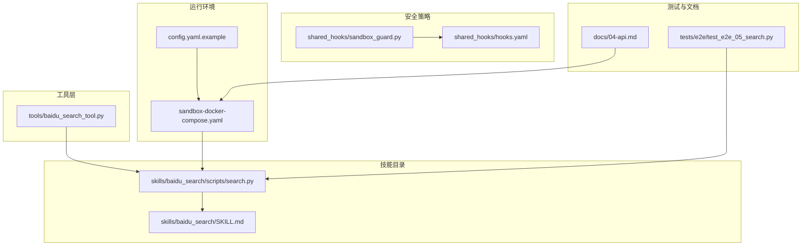
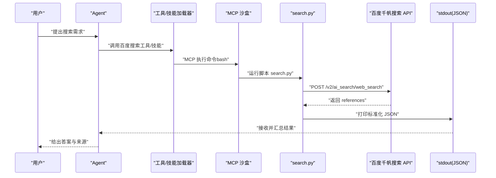
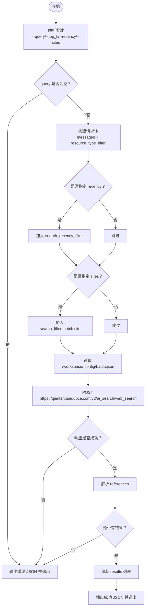
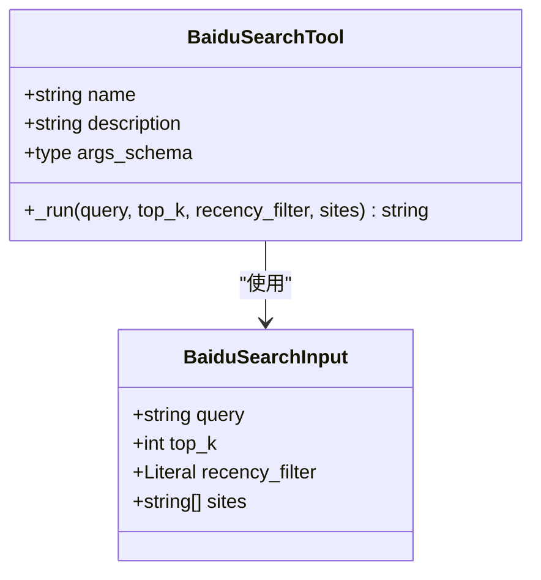
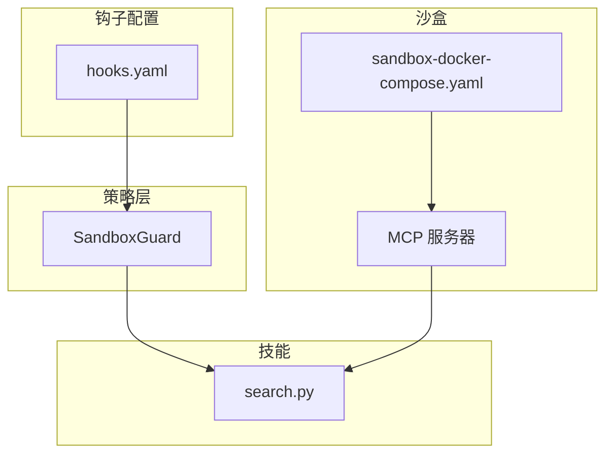
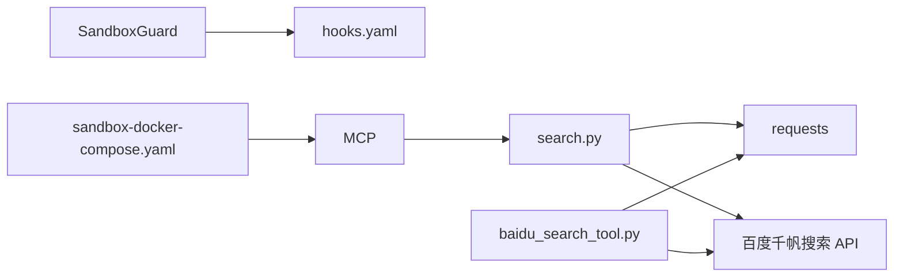

# 百度搜索技能

<cite>
**本文引用的文件**
- [xiaopaw/skills/baidu_search/scripts/search.py](file://xiaopaw/skills/baidu_search/scripts/search.py)
- [xiaopaw/skills/baidu_search/SKILL.md](file://xiaopaw/skills/baidu_search/SKILL.md)
- [xiaopaw/tools/baidu_search_tool.py](file://xiaopaw/tools/baidu_search_tool.py)
- [shared_hooks/sandbox_guard.py](file://shared_hooks/sandbox_guard.py)
- [shared_hooks/hooks.yaml](file://shared_hooks/hooks.yaml)
- [sandbox-docker-compose.yaml](file://sandbox-docker-compose.yaml)
- [config.yaml.example](file://config.yaml.example)
- [tests/e2e/test_e2e_05_search.py](file://tests/e2e/test_e2e_05_search.py)
- [docs/04-api.md](file://docs/04-api.md)
</cite>

## 目录
1. [简介](#简介)
2. [项目结构](#项目结构)
3. [核心组件](#核心组件)
4. [架构总览](#架构总览)
5. [详细组件分析](#详细组件分析)
6. [依赖分析](#依赖分析)
7. [性能考量](#性能考量)
8. [故障排查指南](#故障排查指南)
9. [结论](#结论)
10. [附录](#附录)

## 简介
本文件面向 XiaoPaw v2 的“百度搜索技能”，系统性阐述百度千帆搜索 API 的集成实现，涵盖搜索参数配置（query、top_k、recency、sites）、结果处理与输出格式、搜索脚本使用方法、MCP 工具调用规范以及文件保存机制。同时提供典型应用场景（最新资讯搜索、技术问题搜索、精准事实查询）的参数选择策略、常见错误处理与性能优化建议，并解释认证机制、沙盒执行环境与安全考虑。

## 项目结构
百度搜索技能位于技能目录下，包含沙盒执行脚本与技能文档；同时提供 CrewAI 工具版本用于非沙盒场景或直接调用。安全策略通过 hooks.yaml 配置，沙盒通过 docker-compose 启动并挂载工作区。

图表来源
- [xiaopaw/skills/baidu_search/scripts/search.py:1-139](file://xiaopaw/skills/baidu_search/scripts/search.py#L1-L139)
- [xiaopaw/skills/baidu_search/SKILL.md:1-181](file://xiaopaw/skills/baidu_search/SKILL.md#L1-L181)
- [xiaopaw/tools/baidu_search_tool.py:1-105](file://xiaopaw/tools/baidu_search_tool.py#L1-L105)
- [shared_hooks/sandbox_guard.py:1-168](file://shared_hooks/sandbox_guard.py#L1-L168)
- [shared_hooks/hooks.yaml:1-73](file://shared_hooks/hooks.yaml#L1-L73)
- [sandbox-docker-compose.yaml:1-32](file://sandbox-docker-compose.yaml#L1-L32)
- [config.yaml.example:1-90](file://config.yaml.example#L1-L90)
- [tests/e2e/test_e2e_05_search.py:1-62](file://tests/e2e/test_e2e_05_search.py#L1-L62)
- [docs/04-api.md:603-665](file://docs/04-api.md#L603-L665)

章节来源
- [xiaopaw/skills/baidu_search/scripts/search.py:1-139](file://xiaopaw/skills/baidu_search/scripts/search.py#L1-L139)
- [xiaopaw/skills/baidu_search/SKILL.md:1-181](file://xiaopaw/skills/baidu_search/SKILL.md#L1-L181)
- [xiaopaw/tools/baidu_search_tool.py:1-105](file://xiaopaw/tools/baidu_search_tool.py#L1-L105)
- [shared_hooks/sandbox_guard.py:1-168](file://shared_hooks/sandbox_guard.py#L1-L168)
- [shared_hooks/hooks.yaml:1-73](file://shared_hooks/hooks.yaml#L1-L73)
- [sandbox-docker-compose.yaml:1-32](file://sandbox-docker-compose.yaml#L1-L32)
- [config.yaml.example:1-90](file://config.yaml.example#L1-L90)
- [tests/e2e/test_e2e_05_search.py:1-62](file://tests/e2e/test_e2e_05_search.py#L1-L62)
- [docs/04-api.md:603-665](file://docs/04-api.md#L603-L665)

## 核心组件
- 沙盒执行脚本：负责读取凭证、构造请求、调用百度千帆搜索 API、解析响应并输出标准化 JSON。
- CrewAI 工具：封装相同搜索能力，适合在非沙盒环境中直接调用。
- 安全策略：SandboxGuard 在工具调用前进行输入消毒，阻断路径穿越、危险命令、Shell 注入与提示词注入。
- 沙盒与配置：通过 docker-compose 启动 MCP 沙盒，挂载工作区并暴露 MCP 接口；配置文件定义沙盒超时等参数。
- 测试与文档：端到端测试验证搜索流程，文档说明参数、输出格式与保存机制。

章节来源
- [xiaopaw/skills/baidu_search/scripts/search.py:1-139](file://xiaopaw/skills/baidu_search/scripts/search.py#L1-L139)
- [xiaopaw/tools/baidu_search_tool.py:1-105](file://xiaopaw/tools/baidu_search_tool.py#L1-L105)
- [shared_hooks/sandbox_guard.py:1-168](file://shared_hooks/sandbox_guard.py#L1-L168)
- [sandbox-docker-compose.yaml:1-32](file://sandbox-docker-compose.yaml#L1-L32)
- [config.yaml.example:1-90](file://config.yaml.example#L1-L90)
- [tests/e2e/test_e2e_05_search.py:1-62](file://tests/e2e/test_e2e_05_search.py#L1-L62)

## 架构总览
百度搜索技能在 XiaoPaw v2 中的调用链路如下：Agent 通过工具或技能加载器触发搜索；在沙盒环境中执行脚本或直接调用工具；脚本/工具向百度千帆搜索 API 发起请求；返回结果经统一格式化输出；最终由 Agent 进行总结与汇报。

图表来源
- [xiaopaw/skills/baidu_search/scripts/search.py:47-134](file://xiaopaw/skills/baidu_search/scripts/search.py#L47-L134)
- [docs/04-api.md:603-665](file://docs/04-api.md#L603-L665)
- [sandbox-docker-compose.yaml:13-32](file://sandbox-docker-compose.yaml#L13-L32)

## 详细组件分析

### 沙盒执行脚本 search.py
- 功能职责
  - 读取沙盒内凭证文件，构造百度千帆搜索请求体，调用 API 并解析响应。
  - 标准化输出 JSON，包含 errcode、errmsg、query、total、results 等字段。
  - 提供参数校验与错误处理，保证失败时输出可读的错误信息与建议。
- 关键点
  - 凭证读取：从 /workspace/.config/baidu.json 读取 api_key，未找到或为空时报错。
  - 请求体：messages、search_source、resource_type_filter（含 top_k）；可选 search_recency_filter 与 search_filter（按站点过滤）。
  - 超时与异常：统一捕获网络、HTTP、JSON 解析异常并输出建议。
  - 结果处理：遍历 references，提取 id、title、url、content，组装 results。
- 输出规范
  - 成功：errcode=0，包含 query、total、results。
  - 失败：errcode=1，errmsg 包含错误说明与建议。

图表来源
- [xiaopaw/skills/baidu_search/scripts/search.py:47-134](file://xiaopaw/skills/baidu_search/scripts/search.py#L47-L134)

章节来源
- [xiaopaw/skills/baidu_search/scripts/search.py:1-139](file://xiaopaw/skills/baidu_search/scripts/search.py#L1-L139)

### CrewAI 工具 baidu_search_tool.py
- 功能职责
  - 通过环境变量 BAIDU_API_KEY 直接调用百度千帆搜索 API，返回人类可读的结果文本。
  - 参数校验：query 非空、sites 最多 20 个；top_k 0-50。
  - 错误处理：超时、HTTP 错误、网络异常、JSON 解析失败均返回可读错误信息。
- 输出格式
  - 文本列表，每条包含标题、URL 与内容摘要片段，便于 Agent 进一步分析。

图表来源
- [xiaopaw/tools/baidu_search_tool.py:19-105](file://xiaopaw/tools/baidu_search_tool.py#L19-L105)

章节来源
- [xiaopaw/tools/baidu_search_tool.py:1-105](file://xiaopaw/tools/baidu_search_tool.py#L1-L105)

### 安全策略与沙盒执行
- SandboxGuard
  - 在 BEFORE_TOOL_CALL 阶段对输入进行四类检测：路径穿越、危险命令、Shell 注入、提示词注入。
  - 对沙盒原生工具（sandbox_*、mcp_*）豁免 Shell 注入检测，但仍阻断危险命令。
  - 输入预处理：NFKC 归一化、最多三轮 URL 解码、空字节拦截。
- hooks.yaml
  - 将 SandboxGuard 作为策略层钩子，fail_closed=true，确保违规即阻断。
- 沙盒与 MCP
  - 通过 docker-compose 启动 aio-sandbox，挂载技能目录与工作区，暴露 MCP 接口。
  - 文档说明 MCP 工具清单、白名单过滤、workspace 挂载与超时控制。

图表来源
- [shared_hooks/sandbox_guard.py:93-145](file://shared_hooks/sandbox_guard.py#L93-L145)
- [shared_hooks/hooks.yaml:28-49](file://shared_hooks/hooks.yaml#L28-L49)
- [sandbox-docker-compose.yaml:13-32](file://sandbox-docker-compose.yaml#L13-L32)
- [docs/04-api.md:603-665](file://docs/04-api.md#L603-L665)

章节来源
- [shared_hooks/sandbox_guard.py:1-168](file://shared_hooks/sandbox_guard.py#L1-L168)
- [shared_hooks/hooks.yaml:1-73](file://shared_hooks/hooks.yaml#L1-L73)
- [sandbox-docker-compose.yaml:1-32](file://sandbox-docker-compose.yaml#L1-L32)
- [docs/04-api.md:603-665](file://docs/04-api.md#L603-L665)

### 搜索参数与输出格式
- 参数
  - --query：必填，搜索关键词或自然语言问题。
  - --top_k：可选，默认 20，范围 1-50。
  - --recency：可选，week/month/semiyear/year。
  - --sites：可选，逗号分隔的站点列表，最多 20 个。
- 输出
  - 成功 JSON：包含 errcode、errmsg、query、total、results。
  - 失败 JSON：包含 errcode、errmsg（含建议）。
- 任务结果格式要求
  - 在任务层面可扩展增加 summary 字段，用于对结果进行综合分析与回答原始问题。

章节来源
- [xiaopaw/skills/baidu_search/SKILL.md:36-106](file://xiaopaw/skills/baidu_search/SKILL.md#L36-L106)
- [xiaopaw/skills/baidu_search/scripts/search.py:47-134](file://xiaopaw/skills/baidu_search/scripts/search.py#L47-L134)

### 典型应用场景与参数选择策略
- 最新资讯搜索
  - 推荐：--recency month，--top_k 10。
- 技术问题搜索（限定高质量站点）
  - 推荐：--top_k 5，--sites 指定 stackoverflow.com、docs.python.org、github.com 等。
- 精准事实查询
  - 推荐：--top_k 3，--recency month。
- 结果进一步阅读
  - 如需完整页面内容，配合 web_browse 技能使用 sandbox_convert_to_markdown 抓取具体 URL。

章节来源
- [xiaopaw/skills/baidu_search/SKILL.md:47-74](file://xiaopaw/skills/baidu_search/SKILL.md#L47-L74)

### MCP 工具调用规范与文件保存机制
- 调用规范
  - 使用 MCP 工具在沙盒中执行命令；参数类型严格：空值用 null，布尔用 true/false，数字不加引号，路径使用绝对路径。
  - 常见错误示例与正确写法在文档中明确列出。
- 文件保存
  - 必须使用 shell 重定向保存结果，禁止使用 file_operations write 写入 JSON 对象（会因 Pydantic 类型校验失败导致反复重试）。
  - 正确做法：一步完成搜索 + 保存，stdout JSON 直接写入目标文件。

章节来源
- [xiaopaw/skills/baidu_search/SKILL.md:110-152](file://xiaopaw/skills/baidu_search/SKILL.md#L110-L152)

## 依赖分析
- 组件耦合
  - search.py 与 CrewAI 工具共享相同的 API 调用逻辑与参数校验，分别服务于沙盒与非沙盒场景。
  - SandboxGuard 与 hooks.yaml 形成前置安全关卡，阻断高风险输入。
  - 沙盒与 MCP 通过 docker-compose 与配置文件协同，提供受控执行环境。
- 外部依赖
  - requests 库用于 HTTP 请求；在沙盒中通常已预装。
  - 百度千帆搜索 API：/v2/ai_search/web_search。

图表来源
- [xiaopaw/skills/baidu_search/scripts/search.py:11-15](file://xiaopaw/skills/baidu_search/scripts/search.py#L11-L15)
- [xiaopaw/tools/baidu_search_tool.py:10-11](file://xiaopaw/tools/baidu_search_tool.py#L10-L11)
- [shared_hooks/sandbox_guard.py:32-58](file://shared_hooks/sandbox_guard.py#L32-L58)
- [shared_hooks/hooks.yaml:28-49](file://shared_hooks/hooks.yaml#L28-L49)
- [sandbox-docker-compose.yaml:13-32](file://sandbox-docker-compose.yaml#L13-L32)

章节来源
- [xiaopaw/skills/baidu_search/scripts/search.py:1-139](file://xiaopaw/skills/baidu_search/scripts/search.py#L1-L139)
- [xiaopaw/tools/baidu_search_tool.py:1-105](file://xiaopaw/tools/baidu_search_tool.py#L1-L105)
- [shared_hooks/sandbox_guard.py:1-168](file://shared_hooks/sandbox_guard.py#L1-L168)
- [shared_hooks/hooks.yaml:1-73](file://shared_hooks/hooks.yaml#L1-L73)
- [sandbox-docker-compose.yaml:1-32](file://sandbox-docker-compose.yaml#L1-L32)

## 性能考量
- top_k 与响应时间
  - top_k 越大，API 响应可能越慢；建议根据场景选择：精准事实查询 3-5，一般调研 10-20，全面调研 30-50。
- 超时与重试
  - 沙盒默认超时配置可在配置文件中调整；脚本侧已设置 30 秒超时，失败时建议降低 top_k 或去除 recency/sites 限制。
- 网络与依赖
  - 若沙盒内缺少 requests，可先执行安装；确保沙盒网络连通性。

章节来源
- [xiaopaw/skills/baidu_search/SKILL.md:155-163](file://xiaopaw/skills/baidu_search/SKILL.md#L155-L163)
- [config.yaml.example:21-23](file://config.yaml.example#L21-L23)

## 故障排查指南
- 常见错误与建议
  - 凭证缺失：检查 /workspace/.config/baidu.json 是否存在且包含 api_key。
  - 查询为空：提供有效的 --query。
  - API 调用失败：检查 BAIDU_API_KEY 是否有效，或稍后重试。
  - 网络异常：检查沙盒网络连通性。
  - 响应解析失败：稍后重试。
  - 未找到结果：尝试更通用的关键词，或去掉 recency/sites 限制。
- 安全拦截
  - SandboxGuard 会阻断路径穿越、危险命令、Shell 注入与提示词注入；若误拦截，检查输入是否符合规范。
- MCP 调用错误
  - 确认参数类型与路径均为绝对路径；避免传递字符串化的空值、布尔或数字。

章节来源
- [xiaopaw/skills/baidu_search/scripts/search.py:92-119](file://xiaopaw/skills/baidu_search/scripts/search.py#L92-L119)
- [shared_hooks/sandbox_guard.py:120-145](file://shared_hooks/sandbox_guard.py#L120-L145)
- [xiaopaw/skills/baidu_search/SKILL.md:132-152](file://xiaopaw/skills/baidu_search/SKILL.md#L132-L152)

## 结论
百度搜索技能在 XiaoPaw v2 中提供了两种调用方式：沙盒内的 search.py 脚本与 CrewAI 工具版本。通过严格的参数校验、标准化输出与安全策略，确保在可控环境中高效、安全地获取最新网络信息。结合 MCP 沙盒与白名单机制，既能满足复杂检索需求，又能有效防范安全风险。建议在不同场景下合理选择 top_k 与过滤条件，并遵循文件保存规范，以获得最佳体验与稳定性。

## 附录
- 端到端验证
  - E2E 测试覆盖函数式调用、参数校验与两层架构，验证 Agent -> 技能加载器 -> 子 Crew -> 沙盒 MCP -> 搜索结果的完整链路。
- 配置参考
  - 沙盒超时、MCP 地址等关键配置在配置文件中定义，便于统一管理。

章节来源
- [tests/e2e/test_e2e_05_search.py:28-62](file://tests/e2e/test_e2e_05_search.py#L28-L62)
- [config.yaml.example:21-23](file://config.yaml.example#L21-L23)