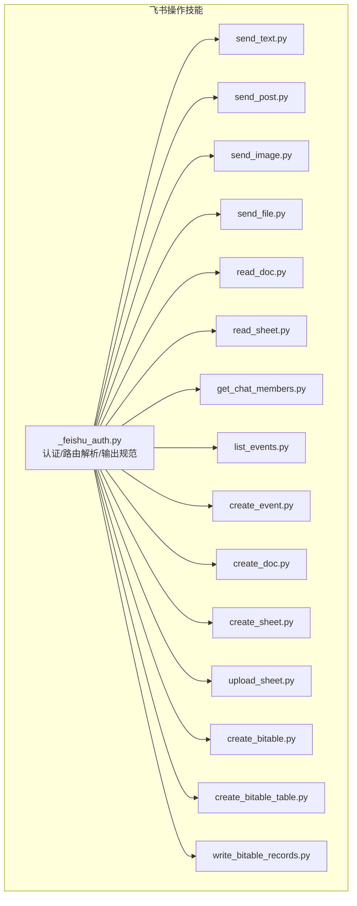
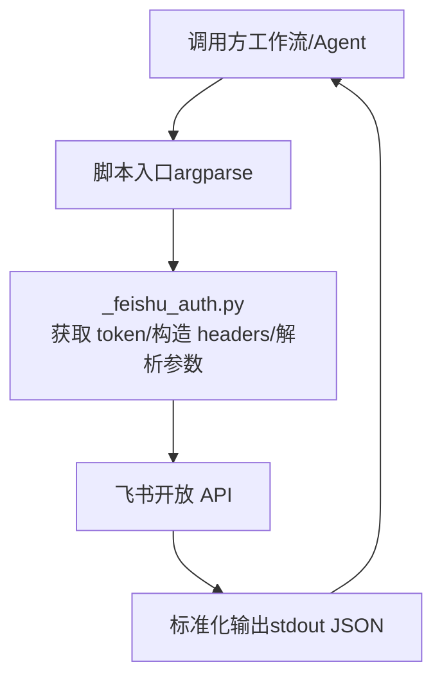
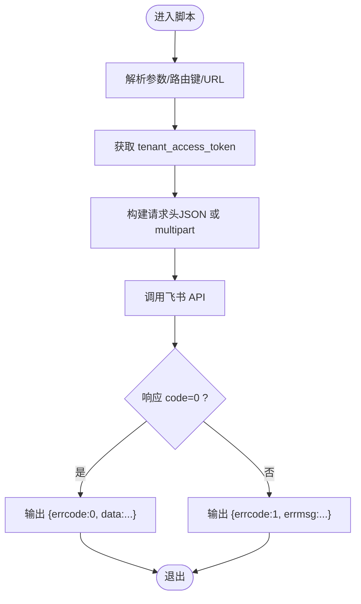
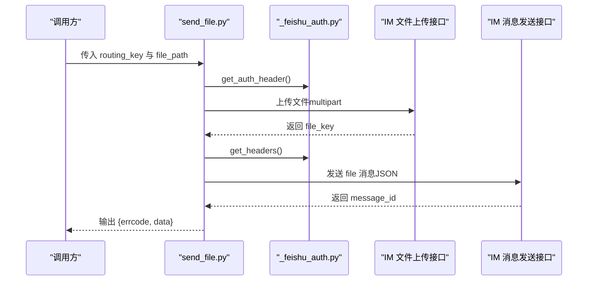
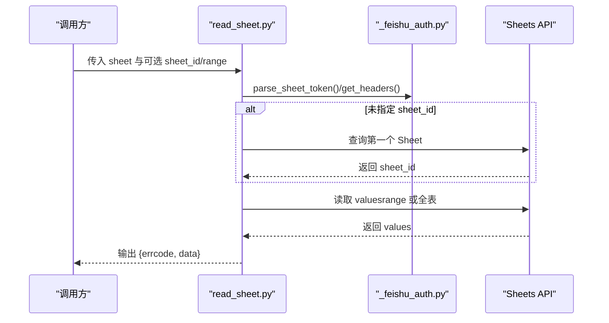
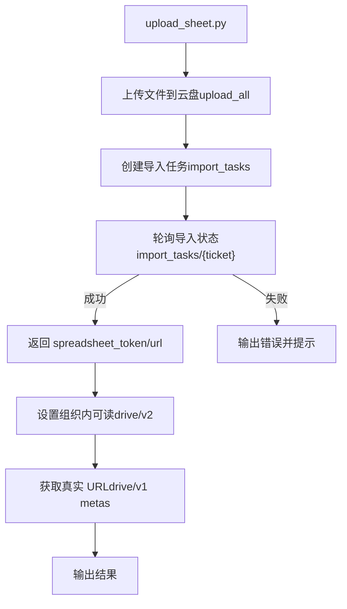
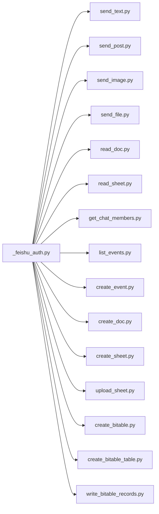

# 飞书操作技能

<cite>
**本文引用的文件**
- [SKILL.md](file://xiaopaw/skills/feishu_ops/SKILL.md)
- [_feishu_auth.py](file://xiaopaw/skills/feishu_ops/scripts/_feishu_auth.py)
- [send_text.py](file://xiaopaw/skills/feishu_ops/scripts/send_text.py)
- [send_post.py](file://xiaopaw/skills/feishu_ops/scripts/send_post.py)
- [send_image.py](file://xiaopaw/skills/feishu_ops/scripts/send_image.py)
- [send_file.py](file://xiaopaw/skills/feishu_ops/scripts/send_file.py)
- [read_doc.py](file://xiaopaw/skills/feishu_ops/scripts/read_doc.py)
- [read_sheet.py](file://xiaopaw/skills/feishu_ops/scripts/read_sheet.py)
- [get_chat_members.py](file://xiaopaw/skills/feishu_ops/scripts/get_chat_members.py)
- [list_events.py](file://xiaopaw/skills/feishu_ops/scripts/list_events.py)
- [create_event.py](file://xiaopaw/skills/feishu_ops/scripts/create_event.py)
- [create_doc.py](file://xiaopaw/skills/feishu_ops/scripts/create_doc.py)
- [create_sheet.py](file://xiaopaw/skills/feishu_ops/scripts/create_sheet.py)
- [upload_sheet.py](file://xiaopaw/skills/feishu_ops/scripts/upload_sheet.py)
- [create_bitable.py](file://xiaopaw/skills/feishu_ops/scripts/create_bitable.py)
- [create_bitable_table.py](file://xiaopaw/skills/feishu_ops/scripts/create_bitable_table.py)
- [write_bitable_records.py](file://xiaopaw/skills/feishu_ops/scripts/write_bitable_records.py)
</cite>

## 目录
1. [简介](#简介)
2. [项目结构](#项目结构)
3. [核心组件](#核心组件)
4. [架构总览](#架构总览)
5. [详细组件分析](#详细组件分析)
6. [依赖分析](#依赖分析)
7. [性能考虑](#性能考虑)
8. [故障排查指南](#故障排查指南)
9. [结论](#结论)
10. [附录](#附录)

## 简介
本文件面向 XiaoPaw v2 的飞书操作技能（feishu_ops），系统性阐述飞书文档与表格读写、消息发送、日历事件管理、多维表格（Bitable）建模与写入等能力的实现原理、调用方式、错误处理与性能优化策略。技能通过沙盒内独立脚本执行，自动从固定路径读取凭证，统一输出标准化 JSON，便于在工作流中可靠集成。

## 项目结构
飞书操作技能位于 xiaopaw/skills/feishu_ops，核心由一个通用认证与工具模块及一组功能脚本组成。所有脚本通过 sys.path 引入同一认证模块，确保鉴权与输出规范一致。



图表来源
- [_feishu_auth.py:1-145](file://xiaopaw/skills/feishu_ops/scripts/_feishu_auth.py#L1-L145)
- [send_text.py:1-52](file://xiaopaw/skills/feishu_ops/scripts/send_text.py#L1-L52)
- [send_post.py:1-86](file://xiaopaw/skills/feishu_ops/scripts/send_post.py#L1-L86)
- [send_image.py:1-83](file://xiaopaw/skills/feishu_ops/scripts/send_image.py#L1-L83)
- [send_file.py:1-105](file://xiaopaw/skills/feishu_ops/scripts/send_file.py#L1-L105)
- [read_doc.py:1-43](file://xiaopaw/skills/feishu_ops/scripts/read_doc.py#L1-L43)
- [read_sheet.py:1-72](file://xiaopaw/skills/feishu_ops/scripts/read_sheet.py#L1-L72)
- [get_chat_members.py:1-57](file://xiaopaw/skills/feishu_ops/scripts/get_chat_members.py#L1-L57)
- [list_events.py:1-72](file://xiaopaw/skills/feishu_ops/scripts/list_events.py#L1-L72)
- [create_event.py:1-97](file://xiaopaw/skills/feishu_ops/scripts/create_event.py#L1-L97)
- [create_doc.py:1-255](file://xiaopaw/skills/feishu_ops/scripts/create_doc.py#L1-L255)
- [create_sheet.py:1-80](file://xiaopaw/skills/feishu_ops/scripts/create_sheet.py#L1-L80)
- [upload_sheet.py:1-213](file://xiaopaw/skills/feishu_ops/scripts/upload_sheet.py#L1-L213)
- [create_bitable.py:1-80](file://xiaopaw/skills/feishu_ops/scripts/create_bitable.py#L1-L80)
- [create_bitable_table.py:1-164](file://xiaopaw/skills/feishu_ops/scripts/create_bitable_table.py#L1-L164)
- [write_bitable_records.py](file://xiaopaw/skills/feishu_ops/scripts/write_bitable_records.py)

章节来源
- [SKILL.md:1-347](file://xiaopaw/skills/feishu_ops/SKILL.md#L1-L347)

## 核心组件
- 通用认证与工具模块（_feishu_auth.py）
  - 凭证来源：/workspace/.config/feishu.json
  - 功能：获取 tenant_access_token、生成请求头、解析 routing_key、解析文档/表格/多维表格 token、统一输出规范与错误处理
- 消息发送系列
  - 文本：send_text.py
  - 富文本：send_post.py（支持段落内链接）
  - 图片：send_image.py（上传 image_key 后发送 image 消息）
  - 文件：send_file.py（上传 file_key 后发送 file 消息）
- 文档与表格读取
  - 文档：read_doc.py（读取纯文本）
  - 表格：read_sheet.py（支持 sheet_id 与 range）
- 群成员查询：get_chat_members.py
- 日历事件
  - 查询：list_events.py（分页拉取）
  - 创建：create_event.py（时间转 Unix、attendees open_id）
- 文档/表格/多维表格创建与导入
  - 文档：create_doc.py（支持 Markdown 转 block 并批量写入）
  - 表格：create_sheet.py、upload_sheet.py（导入 .xlsx/.xls）
  - 多维表格：create_bitable.py、create_bitable_table.py、write_bitable_records.py（字段类型映射、批量写入）

章节来源
- [_feishu_auth.py:1-145](file://xiaopaw/skills/feishu_ops/scripts/_feishu_auth.py#L1-L145)
- [send_text.py:1-52](file://xiaopaw/skills/feishu_ops/scripts/send_text.py#L1-L52)
- [send_post.py:1-86](file://xiaopaw/skills/feishu_ops/scripts/send_post.py#L1-L86)
- [send_image.py:1-83](file://xiaopaw/skills/feishu_ops/scripts/send_image.py#L1-L83)
- [send_file.py:1-105](file://xiaopaw/skills/feishu_ops/scripts/send_file.py#L1-L105)
- [read_doc.py:1-43](file://xiaopaw/skills/feishu_ops/scripts/read_doc.py#L1-L43)
- [read_sheet.py:1-72](file://xiaopaw/skills/feishu_ops/scripts/read_sheet.py#L1-L72)
- [get_chat_members.py:1-57](file://xiaopaw/skills/feishu_ops/scripts/get_chat_members.py#L1-L57)
- [list_events.py:1-72](file://xiaopaw/skills/feishu_ops/scripts/list_events.py#L1-L72)
- [create_event.py:1-97](file://xiaopaw/skills/feishu_ops/scripts/create_event.py#L1-L97)
- [create_doc.py:1-255](file://xiaopaw/skills/feishu_ops/scripts/create_doc.py#L1-L255)
- [create_sheet.py:1-80](file://xiaopaw/skills/feishu_ops/scripts/create_sheet.py#L1-L80)
- [upload_sheet.py:1-213](file://xiaopaw/skills/feishu_ops/scripts/upload_sheet.py#L1-L213)
- [create_bitable.py:1-80](file://xiaopaw/skills/feishu_ops/scripts/create_bitable.py#L1-L80)
- [create_bitable_table.py:1-164](file://xiaopaw/skills/feishu_ops/scripts/create_bitable_table.py#L1-L164)
- [write_bitable_records.py](file://xiaopaw/skills/feishu_ops/scripts/write_bitable_records.py)

## 架构总览
飞书操作技能采用“脚本即服务”的轻量架构：每个功能脚本独立运行，复用统一认证模块，通过飞书开放平台 API 完成业务操作。整体交互如下：



图表来源
- [_feishu_auth.py:16-46](file://xiaopaw/skills/feishu_ops/scripts/_feishu_auth.py#L16-L46)
- [send_text.py:20-48](file://xiaopaw/skills/feishu_ops/scripts/send_text.py#L20-L48)
- [send_post.py:42-81](file://xiaopaw/skills/feishu_ops/scripts/send_post.py#L42-L81)
- [send_image.py:50-78](file://xiaopaw/skills/feishu_ops/scripts/send_image.py#L50-L78)
- [send_file.py:66-100](file://xiaopaw/skills/feishu_ops/scripts/send_file.py#L66-L100)

## 详细组件分析

### 认证与工具模块（_feishu_auth.py）
- 凭证获取：从 /workspace/.config/feishu.json 读取 app_id/app_secret，调用飞书内部接口获取 tenant_access_token
- 请求头生成：提供 JSON 与 multipart 两种 header，分别用于 JSON API 与文件上传
- 路由解析：将 routing_key 解析为 receive_id_type 与 receive_id，兼容 p2p/group 与直接 open_id/chat_id
- URL 解析：从文档/表格/多维表格 URL 或 token 提取 token
- 输出规范：统一输出 JSON，包含 errcode、errmsg、data；错误时也以 exit 0 返回，便于外部捕获



图表来源
- [_feishu_auth.py:16-46](file://xiaopaw/skills/feishu_ops/scripts/_feishu_auth.py#L16-L46)
- [_feishu_auth.py:138-145](file://xiaopaw/skills/feishu_ops/scripts/_feishu_auth.py#L138-L145)

章节来源
- [_feishu_auth.py:1-145](file://xiaopaw/skills/feishu_ops/scripts/_feishu_auth.py#L1-L145)

### 消息发送（IM）
- send_text.py：发送纯文本消息，支持 p2p 与 group
- send_post.py：发送富文本（post），支持段落内链接解析
- send_image.py：上传图片并发送 image 消息
- send_file.py：上传文件并发送 file 消息



图表来源
- [send_file.py:66-100](file://xiaopaw/skills/feishu_ops/scripts/send_file.py#L66-L100)
- [_feishu_auth.py:43-45](file://xiaopaw/skills/feishu_ops/scripts/_feishu_auth.py#L43-L45)
- [_feishu_auth.py:120-130](file://xiaopaw/skills/feishu_ops/scripts/_feishu_auth.py#L120-L130)

章节来源
- [send_text.py:1-52](file://xiaopaw/skills/feishu_ops/scripts/send_text.py#L1-L52)
- [send_post.py:1-86](file://xiaopaw/skills/feishu_ops/scripts/send_post.py#L1-L86)
- [send_image.py:1-83](file://xiaopaw/skills/feishu_ops/scripts/send_image.py#L1-L83)
- [send_file.py:1-105](file://xiaopaw/skills/feishu_ops/scripts/send_file.py#L1-L105)

### 文档与表格读取
- read_doc.py：读取飞书文档纯文本内容
- read_sheet.py：读取电子表格值，支持 sheet_id 与 range；若未指定 sheet_id，则自动获取第一个 Sheet



图表来源
- [read_sheet.py:34-67](file://xiaopaw/skills/feishu_ops/scripts/read_sheet.py#L34-L67)
- [_feishu_auth.py:89-101](file://xiaopaw/skills/feishu_ops/scripts/_feishu_auth.py#L89-L101)

章节来源
- [read_doc.py:1-43](file://xiaopaw/skills/feishu_ops/scripts/read_doc.py#L1-L43)
- [read_sheet.py:1-72](file://xiaopaw/skills/feishu_ops/scripts/read_sheet.py#L1-L72)

### 群成员查询
- get_chat_members.py：按 chat_id 分页查询成员列表，支持 open_id 类型

章节来源
- [get_chat_members.py:1-57](file://xiaopaw/skills/feishu_ops/scripts/get_chat_members.py#L1-L57)

### 日历事件
- list_events.py：查询共享日历事件，支持分页
- create_event.py：创建事件，要求 calendar_id 对应应用已订阅的共享日历，时间需转换为 Unix

```mermaid
sequenceDiagram
participant Caller as "调用方"
participant List as "list_events.py"
participant Create as "create_event.py"
participant Auth as "_feishu_auth.py"
participant Cal as "Calendar API"
Caller->>List : 传入 calendar_id/start/end
List->>Cal : 分页查询事件
Cal-->>List : 返回事件列表
List-->>Caller : 输出 {errcode, data}
Caller->>Create : 传入 calendar_id/summary/start/end/description/attendees
Create->>Auth : get_headers()
Create->>Cal : 创建事件
Cal-->>Create : 返回 event_id
Create-->>Caller : 输出 {errcode, data}
```

图表来源
- [list_events.py:21-67](file://xiaopaw/skills/feishu_ops/scripts/list_events.py#L21-L67)
- [create_event.py:26-76](file://xiaopaw/skills/feishu_ops/scripts/create_event.py#L26-L76)
- [_feishu_auth.py:35-45](file://xiaopaw/skills/feishu_ops/scripts/_feishu_auth.py#L35-L45)

章节来源
- [list_events.py:1-72](file://xiaopaw/skills/feishu_ops/scripts/list_events.py#L1-L72)
- [create_event.py:1-97](file://xiaopaw/skills/feishu_ops/scripts/create_event.py#L1-L97)

### 文档/表格/多维表格创建与导入
- create_doc.py：创建文档并可选写入 Markdown 内容（批量追加 block）
- create_sheet.py：创建电子表格并设置组织内可读
- upload_sheet.py：将本地 xlsx/xls 导入为飞书表格（上传文件 → 创建导入任务 → 轮询完成）
- create_bitable.py：创建多维表格应用
- create_bitable_table.py：在多维表格内创建数据表并定义字段（含类型映射与 options 校验）
- write_bitable_records.py：批量写入记录（每批最多 500 条）



图表来源
- [upload_sheet.py:66-208](file://xiaopaw/skills/feishu_ops/scripts/upload_sheet.py#L66-L208)

章节来源
- [create_doc.py:1-255](file://xiaopaw/skills/feishu_ops/scripts/create_doc.py#L1-L255)
- [create_sheet.py:1-80](file://xiaopaw/skills/feishu_ops/scripts/create_sheet.py#L1-L80)
- [upload_sheet.py:1-213](file://xiaopaw/skills/feishu_ops/scripts/upload_sheet.py#L1-L213)
- [create_bitable.py:1-80](file://xiaopaw/skills/feishu_ops/scripts/create_bitable.py#L1-L80)
- [create_bitable_table.py:1-164](file://xiaopaw/skills/feishu_ops/scripts/create_bitable_table.py#L1-L164)
- [write_bitable_records.py](file://xiaopaw/skills/feishu_ops/scripts/write_bitable_records.py)

## 依赖分析
- 组件耦合
  - 所有脚本均依赖 _feishu_auth.py，形成统一认证与输出规范，降低重复代码与出错风险
  - 个别脚本（如 read_sheet.py）内部封装了对飞书 API 的二次调用（如查询第一个 Sheet），保持对外接口简洁
- 外部依赖
  - requests 库用于 HTTP 请求
  - argparse 用于命令行参数解析
  - json/re/uuid 等标准库用于数据处理与唯一标识
- 潜在循环依赖
  - 无循环依赖，脚本之间通过模块导入形成单向依赖链



图表来源
- [_feishu_auth.py:1-145](file://xiaopaw/skills/feishu_ops/scripts/_feishu_auth.py#L1-L145)
- [send_text.py:1-52](file://xiaopaw/skills/feishu_ops/scripts/send_text.py#L1-L52)
- [send_post.py:1-86](file://xiaopaw/skills/feishu_ops/scripts/send_post.py#L1-L86)
- [send_image.py:1-83](file://xiaopaw/skills/feishu_ops/scripts/send_image.py#L1-L83)
- [send_file.py:1-105](file://xiaopaw/skills/feishu_ops/scripts/send_file.py#L1-L105)
- [read_doc.py:1-43](file://xiaopaw/skills/feishu_ops/scripts/read_doc.py#L1-L43)
- [read_sheet.py:1-72](file://xiaopaw/skills/feishu_ops/scripts/read_sheet.py#L1-L72)
- [get_chat_members.py:1-57](file://xiaopaw/skills/feishu_ops/scripts/get_chat_members.py#L1-L57)
- [list_events.py:1-72](file://xiaopaw/skills/feishu_ops/scripts/list_events.py#L1-L72)
- [create_event.py:1-97](file://xiaopaw/skills/feishu_ops/scripts/create_event.py#L1-L97)
- [create_doc.py:1-255](file://xiaopaw/skills/feishu_ops/scripts/create_doc.py#L1-L255)
- [create_sheet.py:1-80](file://xiaopaw/skills/feishu_ops/scripts/create_sheet.py#L1-L80)
- [upload_sheet.py:1-213](file://xiaopaw/skills/feishu_ops/scripts/upload_sheet.py#L1-L213)
- [create_bitable.py:1-80](file://xiaopaw/skills/feishu_ops/scripts/create_bitable.py#L1-L80)
- [create_bitable_table.py:1-164](file://xiaopaw/skills/feishu_ops/scripts/create_bitable_table.py#L1-L164)
- [write_bitable_records.py](file://xiaopaw/skills/feishu_ops/scripts/write_bitable_records.py)

章节来源
- [_feishu_auth.py:1-145](file://xiaopaw/skills/feishu_ops/scripts/_feishu_auth.py#L1-L145)

## 性能考虑
- 批量写入
  - 文档写入：create_doc.py 将 blocks 分批（每批≤50）追加，避免单次请求过大
- 轮询等待
  - 电子表格导入：upload_sheet.py 轮询导入任务，间隔 2 秒，最长等待 60 秒，兼顾成功率与延迟
- 连接与超时
  - 各脚本根据 API 特性设置合理超时（如 IM 上传 60s、文件上传 120s、常规 API 15s）
- 权限设置
  - 自动设置组织内可读（drive/v2），减少后续分享成本

章节来源
- [create_doc.py:141-154](file://xiaopaw/skills/feishu_ops/scripts/create_doc.py#L141-L154)
- [upload_sheet.py:116-150](file://xiaopaw/skills/feishu_ops/scripts/upload_sheet.py#L116-L150)

## 故障排查指南
- 常见错误类型与定位
  - 鉴权失败：检查 /workspace/.config/feishu.json 是否存在、app_id/app_secret 是否正确
  - 参数错误：检查 routing_key、URL/Token 解析、JSON 参数格式（如 --paragraphs/--attendees）
  - 权限不足：确认应用已订阅共享日历、拥有文档/表格读写权限、已加入群组
  - 资源不存在：确认 doc_token/sheet_token/app_token/chat_id 正确
- 输出规范
  - 所有脚本统一输出 JSON 至 stdout，errcode=0 表示成功，errcode=1 表示失败，包含具体 errmsg 与建议
- 建议排查步骤
  - 使用最小化参数复现问题
  - 查看飞书 API 返回的 code/msg 并结合 hint 字段
  - 检查网络连通性与超时设置
  - 对于导入/写入类操作，关注分批与轮询逻辑

章节来源
- [_feishu_auth.py:120-145](file://xiaopaw/skills/feishu_ops/scripts/_feishu_auth.py#L120-L145)
- [send_post.py:51-55](file://xiaopaw/skills/feishu_ops/scripts/send_post.py#L51-L55)
- [create_event.py:40-44](file://xiaopaw/skills/feishu_ops/scripts/create_event.py#L40-L44)
- [upload_sheet.py:147-150](file://xiaopaw/skills/feishu_ops/scripts/upload_sheet.py#L147-L150)

## 结论
飞书操作技能通过统一认证与输出规范，将复杂的消息发送、文档/表格读写、日历事件管理与多维表格建模封装为易用的命令行脚本，具备良好的可维护性与可扩展性。建议在生产环境中结合凭证隔离、重试与可观察能力，持续完善可靠性与安全性。

## 附录
- 调用方式与参数
  - 所有脚本通过命令行参数传参，遵循各脚本内置帮助信息
  - 输出统一为 JSON，errcode=0 成功，errcode=1 失败
- 最佳实践
  - 使用沙盒内绝对路径，避免跨域与权限问题
  - 对于大文件/大批量写入，关注超时与轮询策略
  - 对外展示链接前，确保已设置组织内可读
- 扩展开发指南
  - 新增脚本：复用 _feishu_auth.py，遵循统一输出规范
  - 新增 API：在 _feishu_auth.py 中补充解析函数与 header 工具
  - 错误处理：优先使用 check_feishu_resp 并提供 hint

章节来源
- [SKILL.md:1-347](file://xiaopaw/skills/feishu_ops/SKILL.md#L1-L347)