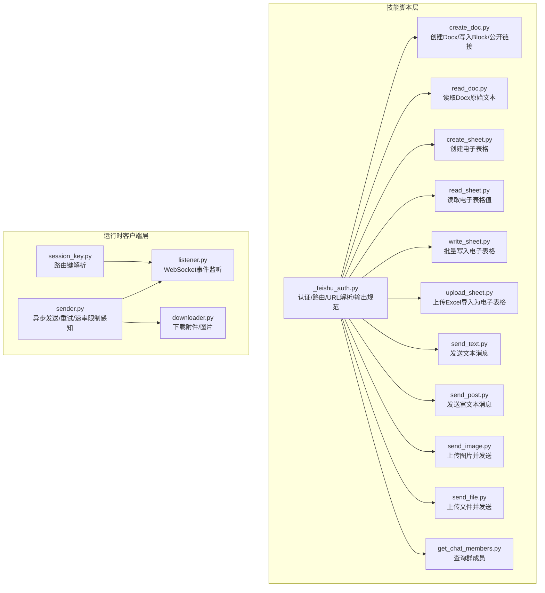
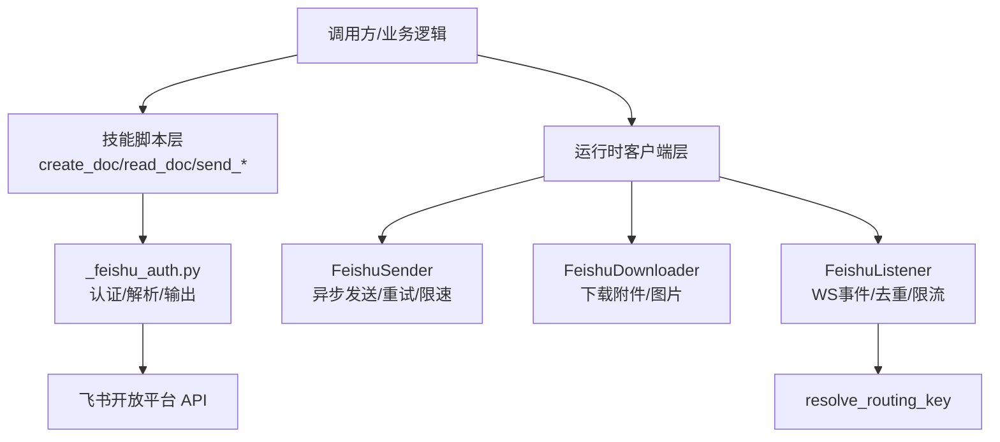
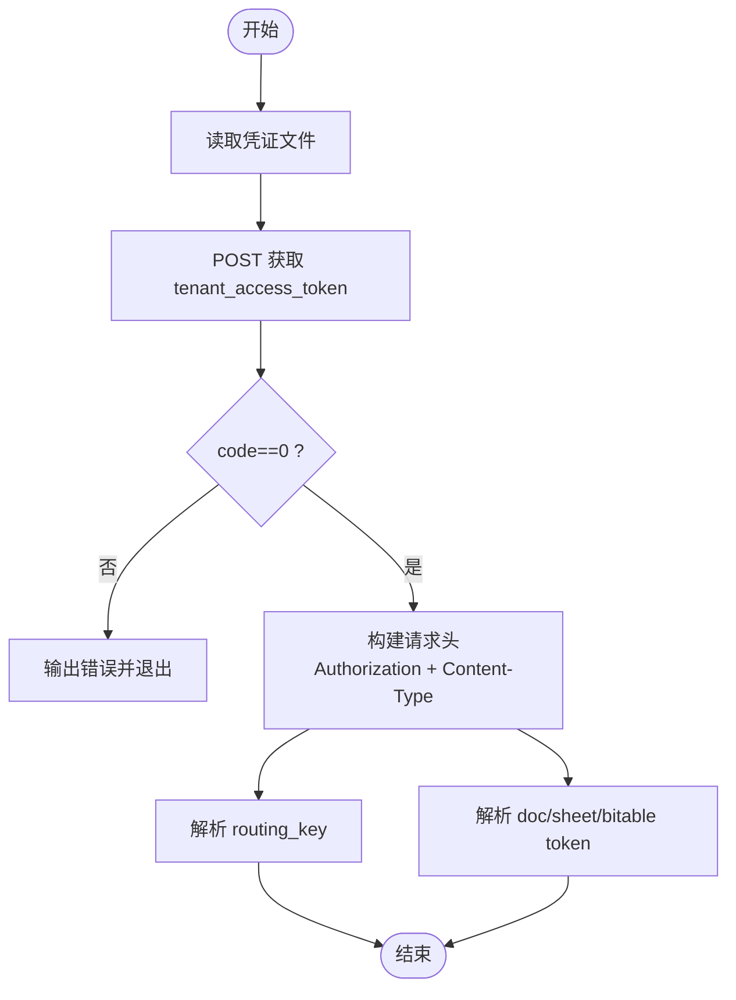
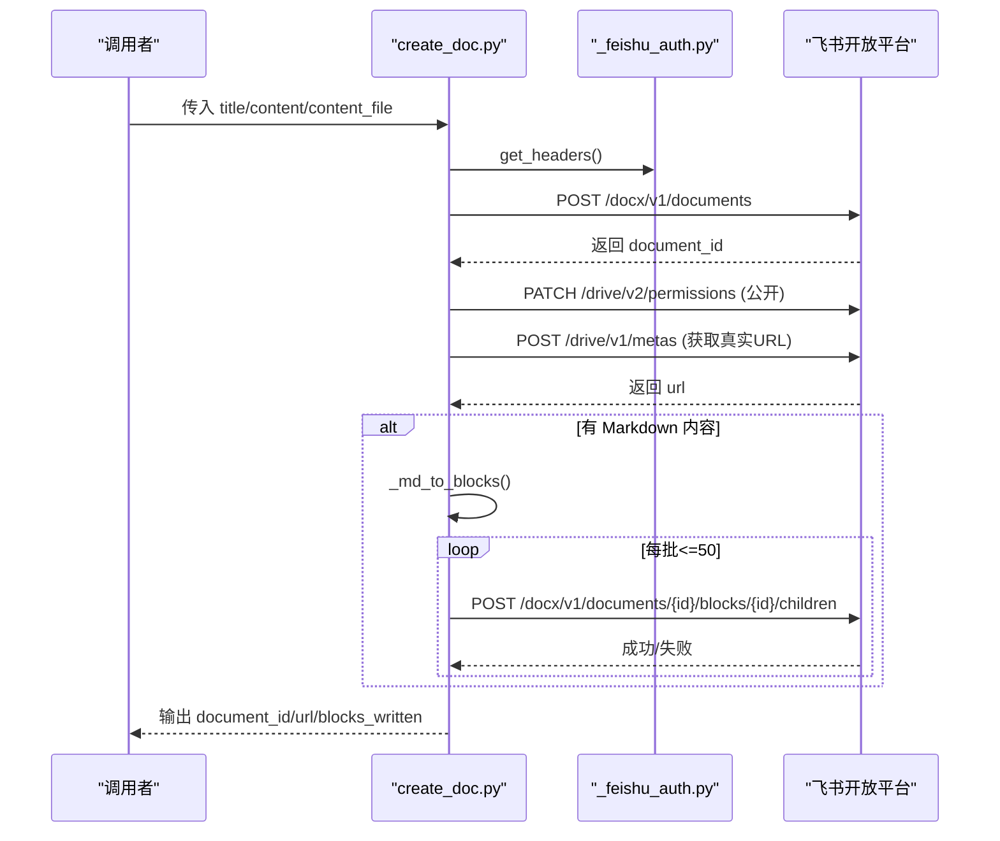
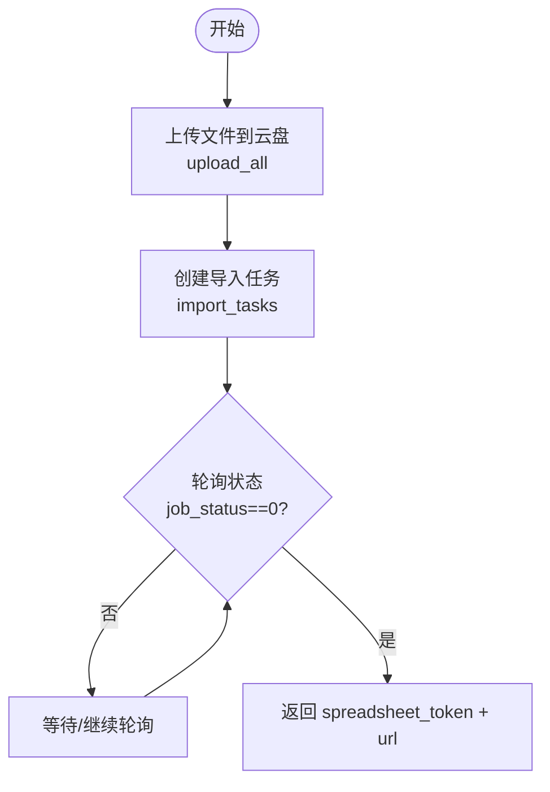
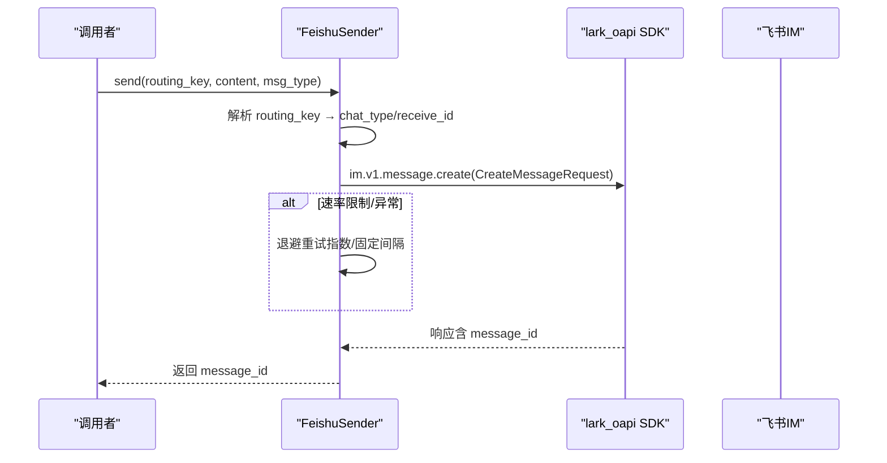
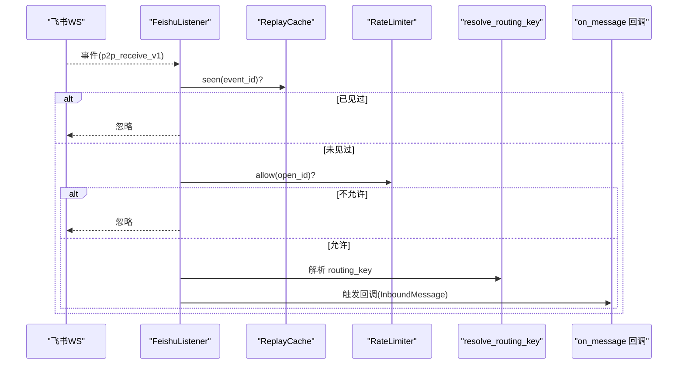
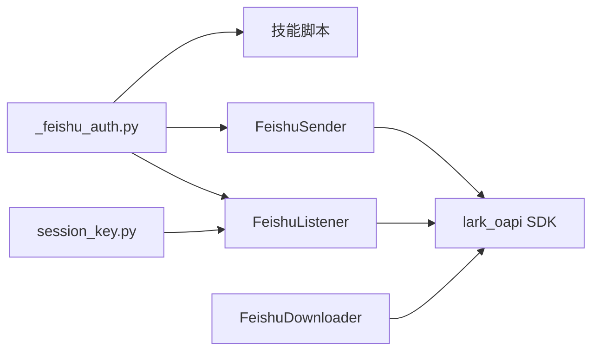

# 飞书文档操作

<cite>
**本文引用的文件**
- [xiaopaw/skills/feishu_ops/scripts/_feishu_auth.py](file://xiaopaw/skills/feishu_ops/scripts/_feishu_auth.py)
- [xiaopaw/skills/feishu_ops/scripts/create_doc.py](file://xiaopaw/skills/feishu_ops/scripts/create_doc.py)
- [xiaopaw/skills/feishu_ops/scripts/read_doc.py](file://xiaopaw/skills/feishu_ops/scripts/read_doc.py)
- [xiaopaw/skills/feishu_ops/scripts/send_text.py](file://xiaopaw/skills/feishu_ops/scripts/send_text.py)
- [xiaopaw/skills/feishu_ops/scripts/send_post.py](file://xiaopaw/skills/feishu_ops/scripts/send_post.py)
- [xiaopaw/skills/feishu_ops/scripts/send_image.py](file://xiaopaw/skills/feishu_ops/scripts/send_image.py)
- [xiaopaw/skills/feishu_ops/scripts/send_file.py](file://xiaopaw/skills/feishu_ops/scripts/send_file.py)
- [xiaopaw/skills/feishu_ops/scripts/read_sheet.py](file://xiaopaw/skills/feishu_ops/scripts/read_sheet.py)
- [xiaopaw/skills/feishu_ops/scripts/write_sheet.py](file://xiaopaw/skills/feishu_ops/scripts/write_sheet.py)
- [xiaopaw/skills/feishu_ops/scripts/upload_sheet.py](file://xiaopaw/skills/feishu_ops/scripts/upload_sheet.py)
- [xiaopaw/skills/feishu_ops/scripts/create_sheet.py](file://xiaopaw/skills/feishu_ops/scripts/create_sheet.py)
- [xiaopaw/skills/feishu_ops/scripts/get_chat_members.py](file://xiaopaw/skills/feishu_ops/scripts/get_chat_members.py)
- [xiaopaw/feishu/sender.py](file://xiaopaw/feishu/sender.py)
- [xiaopaw/feishu/downloader.py](file://xiaopaw/feishu/downloader.py)
- [xiaopaw/feishu/listener.py](file://xiaopaw/feishu/listener.py)
- [xiaopaw/feishu/session_key.py](file://xiaopaw/feishu/session_key.py)
</cite>

## 目录
1. [简介](#简介)
2. [项目结构](#项目结构)
3. [核心组件](#核心组件)
4. [架构总览](#架构总览)
5. [详细组件分析](#详细组件分析)
6. [依赖关系分析](#依赖关系分析)
7. [性能考量](#性能考量)
8. [故障排查指南](#故障排查指南)
9. [结论](#结论)
10. [附录](#附录)

## 简介
本文件系统性梳理飞书文档与消息相关能力，覆盖以下主题：
- 文档创建与内容写入（Docx）、纯文本读取
- 电子表格创建、读取、写入、导入（xlsx/xls）
- 消息发送（文本、富文本、图片、文件）
- 权限与认证（tenant_access_token 获取、请求头封装）
- 数据格式与路由键解析（doc_token、sheet_token、routing_key）
- 客户端 SDK 使用（异步发送、重试、速率限制感知）
- 最佳实践与常见问题

## 项目结构
飞书相关能力主要分布在两类位置：
- 技能脚本层（xiaopaw/skills/feishu_ops/scripts）：面向 CLI 的具体操作脚本，统一复用认证与工具模块
- 运行时客户端层（xiaopaw/feishu）：基于官方 SDK 的异步发送、下载、监听等

图表来源
- [xiaopaw/skills/feishu_ops/scripts/_feishu_auth.py:1-145](file://xiaopaw/skills/feishu_ops/scripts/_feishu_auth.py#L1-L145)
- [xiaopaw/skills/feishu_ops/scripts/create_doc.py:1-255](file://xiaopaw/skills/feishu_ops/scripts/create_doc.py#L1-L255)
- [xiaopaw/skills/feishu_ops/scripts/read_doc.py:1-43](file://xiaopaw/skills/feishu_ops/scripts/read_doc.py#L1-L43)
- [xiaopaw/skills/feishu_ops/scripts/create_sheet.py:1-80](file://xiaopaw/skills/feishu_ops/scripts/create_sheet.py#L1-L80)
- [xiaopaw/skills/feishu_ops/scripts/read_sheet.py:1-72](file://xiaopaw/skills/feishu_ops/scripts/read_sheet.py#L1-L72)
- [xiaopaw/skills/feishu_ops/scripts/write_sheet.py:1-150](file://xiaopaw/skills/feishu_ops/scripts/write_sheet.py#L1-L150)
- [xiaopaw/skills/feishu_ops/scripts/upload_sheet.py:1-213](file://xiaopaw/skills/feishu_ops/scripts/upload_sheet.py#L1-L213)
- [xiaopaw/skills/feishu_ops/scripts/send_text.py:1-52](file://xiaopaw/skills/feishu_ops/scripts/send_text.py#L1-L52)
- [xiaopaw/skills/feishu_ops/scripts/send_post.py:1-86](file://xiaopaw/skills/feishu_ops/scripts/send_post.py#L1-L86)
- [xiaopaw/skills/feishu_ops/scripts/send_image.py:1-83](file://xiaopaw/skills/feishu_ops/scripts/send_image.py#L1-L83)
- [xiaopaw/skills/feishu_ops/scripts/send_file.py:1-105](file://xiaopaw/skills/feishu_ops/scripts/send_file.py#L1-L105)
- [xiaopaw/skills/feishu_ops/scripts/get_chat_members.py:1-57](file://xiaopaw/skills/feishu_ops/scripts/get_chat_members.py#L1-L57)
- [xiaopaw/feishu/sender.py:1-149](file://xiaopaw/feishu/sender.py#L1-L149)
- [xiaopaw/feishu/downloader.py:1-77](file://xiaopaw/feishu/downloader.py#L1-L77)
- [xiaopaw/feishu/listener.py:1-148](file://xiaopaw/feishu/listener.py#L1-L148)
- [xiaopaw/feishu/session_key.py:1-21](file://xiaopaw/feishu/session_key.py#L1-L21)

章节来源
- [xiaopaw/skills/feishu_ops/scripts/_feishu_auth.py:1-145](file://xiaopaw/skills/feishu_ops/scripts/_feishu_auth.py#L1-L145)
- [xiaopaw/feishu/sender.py:1-149](file://xiaopaw/feishu/sender.py#L1-L149)

## 核心组件
- 认证与工具模块：统一管理 tenant_access_token 获取、请求头生成、路由键与资源 token 解析、标准化输出与错误处理
- 文档操作：创建 Docx、按 Block 写入、批量追加、公开链接与真实 URL 获取
- 电子表格操作：创建、读取、写入（分批）、导入 Excel
- 消息发送：文本、富文本（post）、图片、文件；支持 SDK 异步发送与重试
- 下载器：从消息资源下载图片/文件
- 监听器：WebSocket 事件监听与去重、限流、路由键解析

章节来源
- [xiaopaw/skills/feishu_ops/scripts/_feishu_auth.py:16-46](file://xiaopaw/skills/feishu_ops/scripts/_feishu_auth.py#L16-L46)
- [xiaopaw/skills/feishu_ops/scripts/create_doc.py:141-182](file://xiaopaw/skills/feishu_ops/scripts/create_doc.py#L141-L182)
- [xiaopaw/skills/feishu_ops/scripts/read_sheet.py:19-31](file://xiaopaw/skills/feishu_ops/scripts/read_sheet.py#L19-L31)
- [xiaopaw/skills/feishu_ops/scripts/write_sheet.py:115-138](file://xiaopaw/skills/feishu_ops/scripts/write_sheet.py#L115-L138)
- [xiaopaw/skills/feishu_ops/scripts/upload_sheet.py:66-84](file://xiaopaw/skills/feishu_ops/scripts/upload_sheet.py#L66-L84)
- [xiaopaw/skills/feishu_ops/scripts/send_text.py:30-47](file://xiaopaw/skills/feishu_ops/scripts/send_text.py#L30-L47)
- [xiaopaw/skills/feishu_ops/scripts/send_post.py:60-81](file://xiaopaw/skills/feishu_ops/scripts/send_post.py#L60-L81)
- [xiaopaw/skills/feishu_ops/scripts/send_image.py:21-37](file://xiaopaw/skills/feishu_ops/scripts/send_image.py#L21-L37)
- [xiaopaw/skills/feishu_ops/scripts/send_file.py:43-63](file://xiaopaw/skills/feishu_ops/scripts/send_file.py#L43-L63)
- [xiaopaw/feishu/sender.py:18-71](file://xiaopaw/feishu/sender.py#L18-L71)
- [xiaopaw/feishu/downloader.py:12-32](file://xiaopaw/feishu/downloader.py#L12-L32)
- [xiaopaw/feishu/listener.py:21-106](file://xiaopaw/feishu/listener.py#L21-L106)
- [xiaopaw/feishu/session_key.py:6-16](file://xiaopaw/feishu/session_key.py#L6-L16)

## 架构总览
整体分为三层：
- 调用层：CLI 脚本（技能脚本）与业务逻辑对接
- 认证与工具层：统一认证、路由解析、输出规范
- 客户端层：SDK 封装的发送、下载、监听

图表来源
- [xiaopaw/skills/feishu_ops/scripts/_feishu_auth.py:16-46](file://xiaopaw/skills/feishu_ops/scripts/_feishu_auth.py#L16-L46)
- [xiaopaw/feishu/sender.py:18-71](file://xiaopaw/feishu/sender.py#L18-L71)
- [xiaopaw/feishu/downloader.py:12-32](file://xiaopaw/feishu/downloader.py#L12-L32)
- [xiaopaw/feishu/listener.py:21-106](file://xiaopaw/feishu/listener.py#L21-L106)
- [xiaopaw/feishu/session_key.py:6-16](file://xiaopaw/feishu/session_key.py#L6-L16)

## 详细组件分析

### 认证与工具模块（_feishu_auth.py）
- 凭证来源：/workspace/.config/feishu.json，包含 app_id、app_secret
- 获取 tenant_access_token：POST /open-apis/auth/v3/tenant_access_token/internal
- 请求头封装：
  - JSON 请求：Authorization: Bearer <token>，Content-Type: application/json
  - 文件上传：仅 Authorization: Bearer <token>
- 路由键解析：支持 p2p:ou_xxx、group:oc_xxx、ou_xxx、oc_xxx 等多种格式
- URL/Token 解析：
  - 文档：docx/docxs，支持 https://xxx.feishu.cn/docx/{token}、https://xxx.feishu.cn/docs/{token}
  - 电子表格：sheets/spreadsheets
  - 多维表格：base
- 统一输出与错误处理：输出规范 JSON，错误时 exit 0 并返回 errcode=1

图表来源
- [xiaopaw/skills/feishu_ops/scripts/_feishu_auth.py:16-46](file://xiaopaw/skills/feishu_ops/scripts/_feishu_auth.py#L16-L46)
- [xiaopaw/skills/feishu_ops/scripts/_feishu_auth.py:51-115](file://xiaopaw/skills/feishu_ops/scripts/_feishu_auth.py#L51-L115)
- [xiaopaw/skills/feishu_ops/scripts/_feishu_auth.py:120-145](file://xiaopaw/skills/feishu_ops/scripts/_feishu_auth.py#L120-L145)

章节来源
- [xiaopaw/skills/feishu_ops/scripts/_feishu_auth.py:16-46](file://xiaopaw/skills/feishu_ops/scripts/_feishu_auth.py#L16-L46)
- [xiaopaw/skills/feishu_ops/scripts/_feishu_auth.py:51-115](file://xiaopaw/skills/feishu_ops/scripts/_feishu_auth.py#L51-L115)
- [xiaopaw/skills/feishu_ops/scripts/_feishu_auth.py:120-145](file://xiaopaw/skills/feishu_ops/scripts/_feishu_auth.py#L120-L145)

### 文档操作（Docx）
- 创建文档：POST /open-apis/docx/v1/documents
- 写入内容：
  - Markdown → Block 列表（标题、列表、代码块、段落）
  - 批量追加：每批最多 50 个 Block，按 index 顺序插入
- 公开链接：PATCH /open-apis/drive/v2/permissions/{token}/public（tenant_readable）
- 获取真实 URL：POST /open-apis/drive/v1/metas/batch_query

图表来源
- [xiaopaw/skills/feishu_ops/scripts/create_doc.py:141-182](file://xiaopaw/skills/feishu_ops/scripts/create_doc.py#L141-L182)
- [xiaopaw/skills/feishu_ops/scripts/create_doc.py:214-250](file://xiaopaw/skills/feishu_ops/scripts/create_doc.py#L214-L250)
- [xiaopaw/skills/feishu_ops/scripts/_feishu_auth.py:35-46](file://xiaopaw/skills/feishu_ops/scripts/_feishu_auth.py#L35-L46)

章节来源
- [xiaopaw/skills/feishu_ops/scripts/create_doc.py:69-138](file://xiaopaw/skills/feishu_ops/scripts/create_doc.py#L69-L138)
- [xiaopaw/skills/feishu_ops/scripts/create_doc.py:141-182](file://xiaopaw/skills/feishu_ops/scripts/create_doc.py#L141-L182)
- [xiaopaw/skills/feishu_ops/scripts/read_doc.py:18-38](file://xiaopaw/skills/feishu_ops/scripts/read_doc.py#L18-L38)

### 电子表格操作（Sheets）
- 创建：POST /open-apis/sheets/v3/spreadsheets
- 读取：GET /open-apis/sheets/v2/spreadsheets/{token}/values/{range}
  - 可选 sheet_id 或自动取首个 Sheet
- 写入：PUT /open-apis/sheets/v2/spreadsheets/{token}/values
  - 每批最多 5000 行，自动计算范围
- 导入 Excel：
  - 上传文件：POST /open-apis/drive/v1/files/upload_all → file_token
  - 创建导入任务：POST /open-apis/drive/v1/import_tasks → ticket
  - 轮询状态：GET /open-apis/drive/v1/import_tasks/{ticket}
  - 成功后设置公开与获取真实 URL

图表来源
- [xiaopaw/skills/feishu_ops/scripts/upload_sheet.py:66-151](file://xiaopaw/skills/feishu_ops/scripts/upload_sheet.py#L66-L151)
- [xiaopaw/skills/feishu_ops/scripts/create_sheet.py:46-75](file://xiaopaw/skills/feishu_ops/scripts/create_sheet.py#L46-L75)
- [xiaopaw/skills/feishu_ops/scripts/read_sheet.py:19-67](file://xiaopaw/skills/feishu_ops/scripts/read_sheet.py#L19-L67)
- [xiaopaw/skills/feishu_ops/scripts/write_sheet.py:115-145](file://xiaopaw/skills/feishu_ops/scripts/write_sheet.py#L115-L145)

章节来源
- [xiaopaw/skills/feishu_ops/scripts/create_sheet.py:46-75](file://xiaopaw/skills/feishu_ops/scripts/create_sheet.py#L46-L75)
- [xiaopaw/skills/feishu_ops/scripts/read_sheet.py:19-67](file://xiaopaw/skills/feishu_ops/scripts/read_sheet.py#L19-L67)
- [xiaopaw/skills/feishu_ops/scripts/write_sheet.py:115-145](file://xiaopaw/skills/feishu_ops/scripts/write_sheet.py#L115-L145)
- [xiaopaw/skills/feishu_ops/scripts/upload_sheet.py:66-151](file://xiaopaw/skills/feishu_ops/scripts/upload_sheet.py#L66-L151)

### 消息发送（IM）
- 文本消息：POST /open-apis/im/v1/messages?receive_id_type={open_id|chat_id}
- 富文本（post）：解析段落中的 [text](url) 为链接元素
- 图片消息：先 POST /open-apis/im/v1/images 获取 image_key，再发送 image 消息
- 文件消息：先 POST /open-apis/im/v1/files 获取 file_key，再发送 file 消息
- SDK 客户端（异步）：FeishuSender
  - 互聊/群聊：p2p/group
  - 速率限制感知：对特定 code 与 429 做退避重试
  - 并发控制：信号量限制最大并发
  - 卡片消息：支持发送/更新交互卡片

图表来源
- [xiaopaw/feishu/sender.py:43-116](file://xiaopaw/feishu/sender.py#L43-L116)
- [xiaopaw/skills/feishu_ops/scripts/send_text.py:30-47](file://xiaopaw/skills/feishu_ops/scripts/send_text.py#L30-L47)
- [xiaopaw/skills/feishu_ops/scripts/send_post.py:60-81](file://xiaopaw/skills/feishu_ops/scripts/send_post.py#L60-L81)
- [xiaopaw/skills/feishu_ops/scripts/send_image.py:21-37](file://xiaopaw/skills/feishu_ops/scripts/send_image.py#L21-L37)
- [xiaopaw/skills/feishu_ops/scripts/send_file.py:43-63](file://xiaopaw/skills/feishu_ops/scripts/send_file.py#L43-L63)

章节来源
- [xiaopaw/feishu/sender.py:18-149](file://xiaopaw/feishu/sender.py#L18-L149)
- [xiaopaw/skills/feishu_ops/scripts/send_text.py:20-47](file://xiaopaw/skills/feishu_ops/scripts/send_text.py#L20-L47)
- [xiaopaw/skills/feishu_ops/scripts/send_post.py:25-81](file://xiaopaw/skills/feishu_ops/scripts/send_post.py#L25-L81)
- [xiaopaw/skills/feishu_ops/scripts/send_image.py:21-78](file://xiaopaw/skills/feishu_ops/scripts/send_image.py#L21-L78)
- [xiaopaw/skills/feishu_ops/scripts/send_file.py:43-100](file://xiaopaw/skills/feishu_ops/scripts/send_file.py#L43-L100)

### 附件下载与事件监听
- 下载器：根据消息类型（image/file）下载到本地目录
- 监听器：WebSocket 接收事件，去重（ReplayCache）、限流（RateLimiter），解析路由键，构造 InboundMessage

图表来源
- [xiaopaw/feishu/listener.py:81-144](file://xiaopaw/feishu/listener.py#L81-L144)
- [xiaopaw/feishu/session_key.py:6-16](file://xiaopaw/feishu/session_key.py#L6-L16)

章节来源
- [xiaopaw/feishu/downloader.py:12-77](file://xiaopaw/feishu/downloader.py#L12-L77)
- [xiaopaw/feishu/listener.py:21-148](file://xiaopaw/feishu/listener.py#L21-L148)
- [xiaopaw/feishu/session_key.py:6-21](file://xiaopaw/feishu/session_key.py#L6-L21)

## 依赖关系分析
- 脚本层依赖认证模块（_feishu_auth.py）提供统一的凭证、请求头、解析与输出
- 运行时客户端层依赖官方 SDK（lark_oapi）进行 IM 消息的创建/更新、资源下载、WS 事件处理
- 路由键解析在监听器与发送器中复用，确保一致性

图表来源
- [xiaopaw/skills/feishu_ops/scripts/_feishu_auth.py:1-145](file://xiaopaw/skills/feishu_ops/scripts/_feishu_auth.py#L1-L145)
- [xiaopaw/feishu/sender.py:1-149](file://xiaopaw/feishu/sender.py#L1-L149)
- [xiaopaw/feishu/listener.py:1-148](file://xiaopaw/feishu/listener.py#L1-L148)
- [xiaopaw/feishu/session_key.py:1-21](file://xiaopaw/feishu/session_key.py#L1-L21)
- [xiaopaw/feishu/downloader.py:1-77](file://xiaopaw/feishu/downloader.py#L1-L77)

章节来源
- [xiaopaw/skills/feishu_ops/scripts/_feishu_auth.py:1-145](file://xiaopaw/skills/feishu_ops/scripts/_feishu_auth.py#L1-L145)
- [xiaopaw/feishu/sender.py:1-149](file://xiaopaw/feishu/sender.py#L1-L149)
- [xiaopaw/feishu/listener.py:1-148](file://xiaopaw/feishu/listener.py#L1-L148)
- [xiaopaw/feishu/session_key.py:1-21](file://xiaopaw/feishu/session_key.py#L1-L21)
- [xiaopaw/feishu/downloader.py:1-77](file://xiaopaw/feishu/downloader.py#L1-L77)

## 性能考量
- 速率限制与退避
  - SDK 发送器对特定 code 与 429 状态码进行指数/固定间隔退避重试
  - 通过信号量限制并发，避免触发平台限流
- 批量写入
  - 文档写入：每批最多 50 个 Block
  - 电子表格写入：每批最多 5000 行
- 超时设置
  - 各接口设置合理超时，避免长时间阻塞
- 资源下载
  - 下载器按类型分别处理，失败记录日志但不中断主流程

章节来源
- [xiaopaw/feishu/sender.py:14-29](file://xiaopaw/feishu/sender.py#L14-L29)
- [xiaopaw/feishu/sender.py:95-115](file://xiaopaw/feishu/sender.py#L95-L115)
- [xiaopaw/skills/feishu_ops/scripts/create_doc.py:142-153](file://xiaopaw/skills/feishu_ops/scripts/create_doc.py#L142-L153)
- [xiaopaw/skills/feishu_ops/scripts/write_sheet.py:115-137](file://xiaopaw/skills/feishu_ops/scripts/write_sheet.py#L115-L137)

## 故障排查指南
- 认证失败
  - 检查凭证文件是否存在与字段完整
  - 确认 tenant_access_token 获取接口返回 code=0
- 权限不足
  - 文档/表格：确认应用对该资源有编辑/只读权限
  - 群组：确认应用已加入群组并具备成员查询权限
- 路由键错误
  - 文本/富文本/图片/文件消息需使用正确的 receive_id_type（open_id 或 chat_id）
- 资源 token 解析
  - 文档/表格 token 支持 URL 与直传 token，注意正则匹配
- 导入 Excel
  - 文件大小不超过 20MB，仅支持 .xlsx/.xls
  - 轮询超时（>60s）可稍后在云空间确认导入结果
- 速率限制
  - SDK 发送器会自动退避重试；若仍失败，检查限流策略与并发配置

章节来源
- [xiaopaw/skills/feishu_ops/scripts/_feishu_auth.py:16-46](file://xiaopaw/skills/feishu_ops/scripts/_feishu_auth.py#L16-L46)
- [xiaopaw/skills/feishu_ops/scripts/_feishu_auth.py:138-145](file://xiaopaw/skills/feishu_ops/scripts/_feishu_auth.py#L138-L145)
- [xiaopaw/skills/feishu_ops/scripts/send_text.py:42-47](file://xiaopaw/skills/feishu_ops/scripts/send_text.py#L42-L47)
- [xiaopaw/skills/feishu_ops/scripts/send_post.py:78-81](file://xiaopaw/skills/feishu_ops/scripts/send_post.py#L78-L81)
- [xiaopaw/skills/feishu_ops/scripts/send_image.py:36-37](file://xiaopaw/skills/feishu_ops/scripts/send_image.py#L36-L37)
- [xiaopaw/skills/feishu_ops/scripts/send_file.py:59-63](file://xiaopaw/skills/feishu_ops/scripts/send_file.py#L59-L63)
- [xiaopaw/skills/feishu_ops/scripts/upload_sheet.py:147-150](file://xiaopaw/skills/feishu_ops/scripts/upload_sheet.py#L147-L150)
- [xiaopaw/feishu/sender.py:100-108](file://xiaopaw/feishu/sender.py#L100-L108)

## 结论
本方案通过统一认证与工具模块，结合 CLI 脚本与 SDK 客户端，实现了飞书文档、电子表格与消息的完整操作链路。在性能方面采用批量写入、并发控制与退避重试，在可靠性方面提供统一输出与错误处理。建议在生产环境中：
- 明确权限范围与资源 token 来源
- 控制并发与重试策略，避免触发平台限流
- 对导入/写入等耗时操作增加进度反馈与可观测指标

## 附录
- 最佳实践
  - 文档创建后立即设置公开链接，便于后续分享
  - 电子表格写入前先读取 sheet_id，避免跨 Sheet 写错
  - 富文本消息中链接使用 [text](url) 格式，脚本自动解析为飞书链接元素
  - 图片/文件发送前先上传，获取 key 再发送，避免大文件直接嵌入
- 常见问题
  - “找不到 Sheet”：确认 spreadsheet_token 与 sheet_id 正确
  - “导入超时”：检查文件大小与格式，稍后再查云空间
  - “消息发送失败”：核对 routing_key 与 receive_id_type