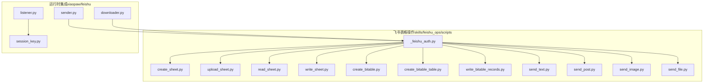
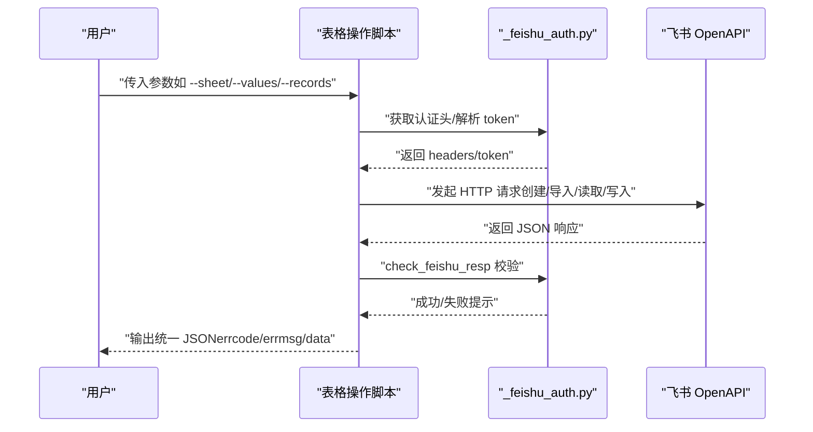
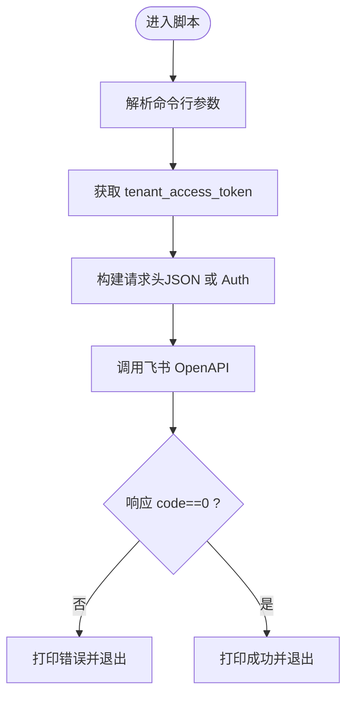
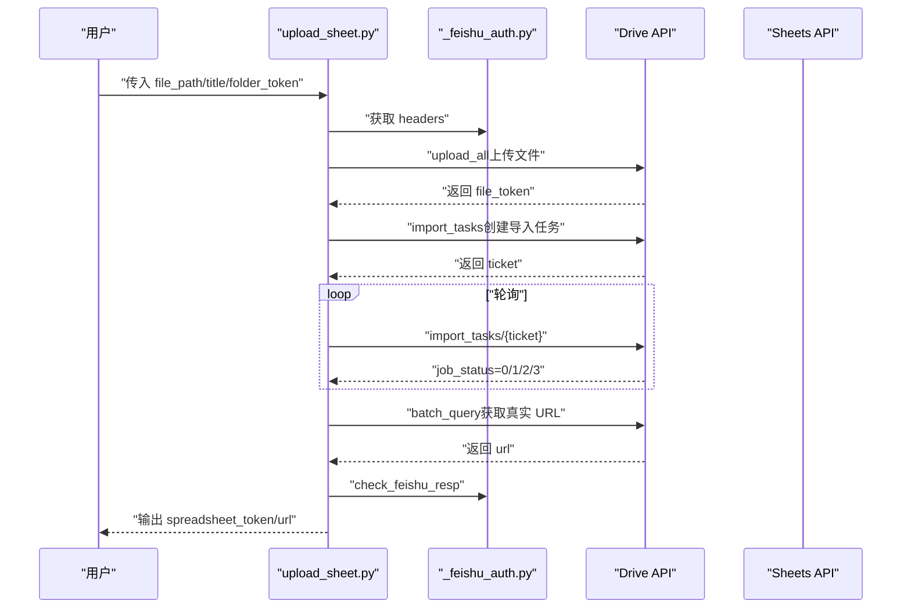
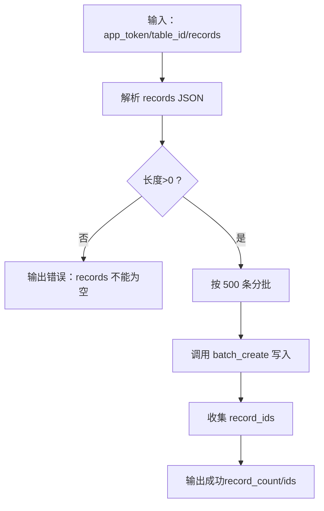
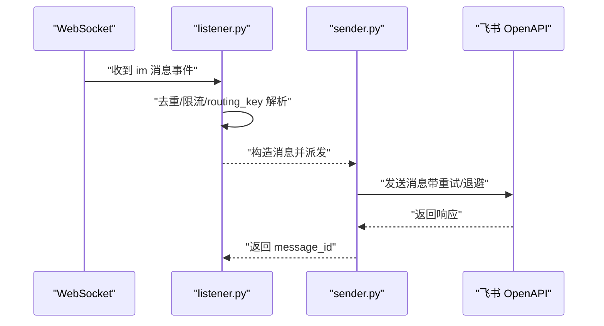
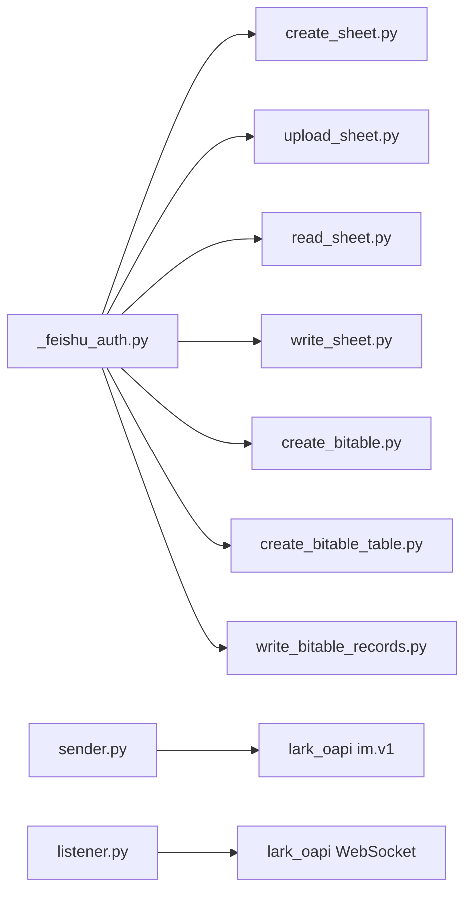

# 飞书表格操作

<cite>
**本文引用的文件**
- [SKILL.md](file://xiaopaw/skills/feishu_ops/SKILL.md)
- [_feishu_auth.py](file://xiaopaw/skills/feishu_ops/scripts/_feishu_auth.py)
- [create_sheet.py](file://xiaopaw/skills/feishu_ops/scripts/create_sheet.py)
- [upload_sheet.py](file://xiaopaw/skills/feishu_ops/scripts/upload_sheet.py)
- [write_sheet.py](file://xiaopaw/skills/feishu_ops/scripts/write_sheet.py)
- [read_sheet.py](file://xiaopaw/skills/feishu_ops/scripts/read_sheet.py)
- [create_bitable.py](file://xiaopaw/skills/feishu_ops/scripts/create_bitable.py)
- [create_bitable_table.py](file://xiaopaw/skills/feishu_ops/scripts/create_bitable_table.py)
- [write_bitable_records.py](file://xiaopaw/skills/feishu_ops/scripts/write_bitable_records.py)
- [send_text.py](file://xiaopaw/skills/feishu_ops/scripts/send_text.py)
- [send_post.py](file://xiaopaw/skills/feishu_ops/scripts/send_post.py)
- [send_image.py](file://xiaopaw/skills/feishu_ops/scripts/send_image.py)
- [send_file.py](file://xiaopaw/skills/feishu_ops/scripts/send_file.py)
- [session_key.py](file://xiaopaw/feishu/session_key.py)
- [sender.py](file://xiaopaw/feishu/sender.py)
- [listener.py](file://xiaopaw/feishu/listener.py)
- [downloader.py](file://xiaopaw/feishu/downloader.py)
</cite>

## 目录
1. [简介](#简介)
2. [项目结构](#项目结构)
3. [核心组件](#核心组件)
4. [架构总览](#架构总览)
5. [详细组件分析](#详细组件分析)
6. [依赖关系分析](#依赖关系分析)
7. [性能考量](#性能考量)
8. [故障排查指南](#故障排查指南)
9. [结论](#结论)
10. [附录](#附录)

## 简介
本文件面向“飞书表格操作”能力，系统性梳理电子表格创建、Excel 导入、数据读取与写入、多维表格（Bitable）建表与批量写入的实现与使用方法。文档重点覆盖：
- 飞书电子表格 API 使用：创建、导入、读取、写入
- 多维表格 API 使用：创建应用、建表、字段定义、批量写入
- 数据格式转换与批量操作优化
- 脚本示例、数据验证与错误处理机制
- 性能优化策略与最佳实践

## 项目结构
飞书表格相关能力集中在 skills/feishu_ops 子目录，采用“独立脚本 + 统一认证模块”的设计：
- 统一认证与工具：_feishu_auth.py
- 电子表格：create_sheet.py、upload_sheet.py、read_sheet.py、write_sheet.py
- 多维表格：create_bitable.py、create_bitable_table.py、write_bitable_records.py
- 消息发送（辅助场景）：send_text.py、send_post.py、send_image.py、send_file.py
- 事件监听与消息发送（运行时集成）：listener.py、sender.py、session_key.py、downloader.py

图表来源
- [SKILL.md](file://xiaopaw/skills/feishu_ops/SKILL.md)
- [_feishu_auth.py](file://xiaopaw/skills/feishu_ops/scripts/_feishu_auth.py)
- [create_sheet.py](file://xiaopaw/skills/feishu_ops/scripts/create_sheet.py)
- [upload_sheet.py](file://xiaopaw/skills/feishu_ops/scripts/upload_sheet.py)
- [read_sheet.py](file://xiaopaw/skills/feishu_ops/scripts/read_sheet.py)
- [write_sheet.py](file://xiaopaw/skills/feishu_ops/scripts/write_sheet.py)
- [create_bitable.py](file://xiaopaw/skills/feishu_ops/scripts/create_bitable.py)
- [create_bitable_table.py](file://xiaopaw/skills/feishu_ops/scripts/create_bitable_table.py)
- [write_bitable_records.py](file://xiaopaw/skills/feishu_ops/scripts/write_bitable_records.py)
- [send_text.py](file://xiaopaw/skills/feishu_ops/scripts/send_text.py)
- [send_post.py](file://xiaopaw/skills/feishu_ops/scripts/send_post.py)
- [send_image.py](file://xiaopaw/skills/feishu_ops/scripts/send_image.py)
- [send_file.py](file://xiaopaw/skills/feishu_ops/scripts/send_file.py)
- [listener.py](file://xiaopaw/feishu/listener.py)
- [sender.py](file://xiaopaw/feishu/sender.py)
- [session_key.py](file://xiaopaw/feishu/session_key.py)
- [downloader.py](file://xiaopaw/feishu/downloader.py)

章节来源
- [SKILL.md](file://xiaopaw/skills/feishu_ops/SKILL.md)

## 核心组件
- 统一认证与工具模块（_feishu_auth.py）
  - 提供 tenant_access_token 获取、请求头生成、路由键解析、URL token 解析、统一输出与错误处理
  - 作为所有脚本的公共依赖，避免重复代码
- 电子表格脚本族
  - create_sheet.py：创建空白电子表格并设置公开可读
  - upload_sheet.py：本地 Excel 导入为电子表格（上传文件→创建导入任务→轮询状态）
  - read_sheet.py：按 Sheet 与范围读取数据
  - write_sheet.py：按二维数组写入，支持批量分片与范围计算
- 多维表格脚本族
  - create_bitable.py：创建 Bitable 应用
  - create_bitable_table.py：创建数据表并定义字段（含类型映射与选项校验）
  - write_bitable_records.py：按字段名批量写入记录（每批最多 500 条）
- 运行时集成（消息发送与事件处理）
  - listener.py：WebSocket 事件监听与去重、限流
  - sender.py：消息发送、卡片更新、速率限制感知与重试
  - session_key.py：路由键解析
  - downloader.py：资源下载（图片/文件）

章节来源
- [_feishu_auth.py](file://xiaopaw/skills/feishu_ops/scripts/_feishu_auth.py)
- [create_sheet.py](file://xiaopaw/skills/feishu_ops/scripts/create_sheet.py)
- [upload_sheet.py](file://xiaopaw/skills/feishu_ops/scripts/upload_sheet.py)
- [read_sheet.py](file://xiaopaw/skills/feishu_ops/scripts/read_sheet.py)
- [write_sheet.py](file://xiaopaw/skills/feishu_ops/scripts/write_sheet.py)
- [create_bitable.py](file://xiaopaw/skills/feishu_ops/scripts/create_bitable.py)
- [create_bitable_table.py](file://xiaopaw/skills/feishu_ops/scripts/create_bitable_table.py)
- [write_bitable_records.py](file://xiaopaw/skills/feishu_ops/scripts/write_bitable_records.py)
- [listener.py](file://xiaopaw/feishu/listener.py)
- [sender.py](file://xiaopaw/feishu/sender.py)
- [session_key.py](file://xiaopaw/feishu/session_key.py)
- [downloader.py](file://xiaopaw/feishu/downloader.py)

## 架构总览
飞书表格操作的整体流程分为“离线脚本模式”和“运行时集成模式”两类：
- 离线脚本模式：直接调用飞书 OpenAPI，适用于一次性任务（创建、导入、读取、写入）
- 运行时集成模式：通过 listener 接收事件，sender 发送消息，downloader 下载资源，session_key 解析路由

图表来源
- [_feishu_auth.py](file://xiaopaw/skills/feishu_ops/scripts/_feishu_auth.py)
- [create_sheet.py](file://xiaopaw/skills/feishu_ops/scripts/create_sheet.py)
- [upload_sheet.py](file://xiaopaw/skills/feishu_ops/scripts/upload_sheet.py)
- [read_sheet.py](file://xiaopaw/skills/feishu_ops/scripts/read_sheet.py)
- [write_sheet.py](file://xiaopaw/skills/feishu_ops/scripts/write_sheet.py)
- [create_bitable.py](file://xiaopaw/skills/feishu_ops/scripts/create_bitable.py)
- [create_bitable_table.py](file://xiaopaw/skills/feishu_ops/scripts/create_bitable_table.py)
- [write_bitable_records.py](file://xiaopaw/skills/feishu_ops/scripts/write_bitable_records.py)

## 详细组件分析

### 统一认证与工具模块（_feishu_auth.py）
- 凭证与令牌
  - 从 /workspace/.config/feishu.json 读取 app_id/app_secret，调用内部 tenant_access_token 接口获取 token
  - 提供 get_headers()/get_auth_header() 生成不同场景的请求头
- URL 与路由解析
  - parse_sheet_token()/parse_bitable_token()/parse_doc_token()：从 URL 或 token 字符串中提取 token
  - parse_routing_key()：将 routing_key 解析为 receive_id_type/receive_id
- 输出与错误处理
  - output_ok()/output_error()：统一输出 JSON 并退出
  - check_feishu_resp()：对飞书 API 响应进行 errcode 校验

图表来源
- [_feishu_auth.py](file://xiaopaw/skills/feishu_ops/scripts/_feishu_auth.py)

章节来源
- [_feishu_auth.py](file://xiaopaw/skills/feishu_ops/scripts/_feishu_auth.py)

### 电子表格：创建、导入、读取、写入
- 创建电子表格（create_sheet.py）
  - 步骤：创建表格 → 设置公开可读 → 通过 drive meta 获取真实 URL
  - 关键点：folder_token 可选，支持根目录或指定云空间目录
- Excel 导入（upload_sheet.py）
  - 三步流程：上传文件（drive/v1/files/upload_all）→ 创建导入任务（drive/v1/import_tasks）→ 轮询任务（drive/v1/import_tasks/{ticket}）
  - 限制：文件大小≤20MB，格式支持 .xlsx/.xls
  - 超时控制：轮询间隔 2s，最长 60s
- 读取电子表格（read_sheet.py）
  - 支持指定 sheet_id 与范围（如 A1:D10），未指定则读取首个 Sheet
  - 通过 sheets/v2/values 接口获取二维数组
- 写入电子表格（write_sheet.py）
  - 输入：二维数组 values，支持 start_cell 与 sheet_id
  - 批量写入：每批最多 5000 行，自动分片并计算覆盖范围
  - 范围计算：列字母与行列号互转、起止单元格推导

图表来源
- [upload_sheet.py](file://xiaopaw/skills/feishu_ops/scripts/upload_sheet.py)
- [_feishu_auth.py](file://xiaopaw/skills/feishu_ops/scripts/_feishu_auth.py)

章节来源
- [create_sheet.py](file://xiaopaw/skills/feishu_ops/scripts/create_sheet.py)
- [upload_sheet.py](file://xiaopaw/skills/feishu_ops/scripts/upload_sheet.py)
- [read_sheet.py](file://xiaopaw/skills/feishu_ops/scripts/read_sheet.py)
- [write_sheet.py](file://xiaopaw/skills/feishu_ops/scripts/write_sheet.py)

### 多维表格：创建应用、建表、字段定义、批量写入
- 创建多维表格应用（create_bitable.py）
  - 步骤：创建应用 → 设置公开可读 → 通过 drive meta 获取真实 URL
- 在多维表格内创建数据表（create_bitable_table.py）
  - 字段类型映射：text/number/select/multiselect/date/checkbox/url
  - 选项校验：select/multiselect 必须提供 options
  - 流程：创建空表 → 逐个创建字段 → 返回 field_id 列表
- 批量写入记录（write_bitable_records.py）
  - 输入：records 为字段名到值的字典数组
  - 批量：每批最多 500 条，自动分批写入并返回 record_ids

图表来源
- [write_bitable_records.py](file://xiaopaw/skills/feishu_ops/scripts/write_bitable_records.py)
- [create_bitable_table.py](file://xiaopaw/skills/feishu_ops/scripts/create_bitable_table.py)

章节来源
- [create_bitable.py](file://xiaopaw/skills/feishu_ops/scripts/create_bitable.py)
- [create_bitable_table.py](file://xiaopaw/skills/feishu_ops/scripts/create_bitable_table.py)
- [write_bitable_records.py](file://xiaopaw/skills/feishu_ops/scripts/write_bitable_records.py)

### 运行时集成：事件监听、消息发送、资源下载
- 事件监听（listener.py）
  - 基于 WebSocket 的事件处理器，支持去重与限流
  - 解析 routing_key，构造 InboundMessage 并派发
- 消息发送（sender.py）
  - 支持 text/post/interactive（卡片）消息
  - 速率限制感知（特定 code/status）与指数退避重试
  - 并发控制（信号量），默认最大并发 5
- 资源下载（downloader.py）
  - 下载图片/文件资源到本地目录
- 路由键解析（session_key.py）
  - 支持 thread/p2p/group 三种路由键格式

图表来源
- [listener.py](file://xiaopaw/feishu/listener.py)
- [sender.py](file://xiaopaw/feishu/sender.py)

章节来源
- [listener.py](file://xiaopaw/feishu/listener.py)
- [sender.py](file://xiaopaw/feishu/sender.py)
- [session_key.py](file://xiaopaw/feishu/session_key.py)
- [downloader.py](file://xiaopaw/feishu/downloader.py)

## 依赖关系分析
- 脚本对认证模块的依赖
  - 所有表格脚本均依赖 _feishu_auth.py 进行认证与工具函数调用
- API 依赖
  - 电子表格：sheets/v2、sheets/v3、drive/v1、drive/v2
  - 多维表格：bitable/v1
- 运行时依赖
  - sender 依赖 lark_oapi SDK 的 im.v1 消息接口
  - listener 依赖 lark_oapi WebSocket 客户端

图表来源
- [_feishu_auth.py](file://xiaopaw/skills/feishu_ops/scripts/_feishu_auth.py)
- [create_sheet.py](file://xiaopaw/skills/feishu_ops/scripts/create_sheet.py)
- [upload_sheet.py](file://xiaopaw/skills/feishu_ops/scripts/upload_sheet.py)
- [read_sheet.py](file://xiaopaw/skills/feishu_ops/scripts/read_sheet.py)
- [write_sheet.py](file://xiaopaw/skills/feishu_ops/scripts/write_sheet.py)
- [create_bitable.py](file://xiaopaw/skills/feishu_ops/scripts/create_bitable.py)
- [create_bitable_table.py](file://xiaopaw/skills/feishu_ops/scripts/create_bitable_table.py)
- [write_bitable_records.py](file://xiaopaw/skills/feishu_ops/scripts/write_bitable_records.py)
- [sender.py](file://xiaopaw/feishu/sender.py)
- [listener.py](file://xiaopaw/feishu/listener.py)

章节来源
- [_feishu_auth.py](file://xiaopaw/skills/feishu_ops/scripts/_feishu_auth.py)
- [sender.py](file://xiaopaw/feishu/sender.py)
- [listener.py](file://xiaopaw/feishu/listener.py)

## 性能考量
- 批量写入优化
  - 电子表格：write_sheet.py 每批最多 5000 行，减少请求次数与网络开销
  - 多维表格：write_bitable_records.py 每批最多 500 条，降低 API 调用频率
- 轮询与超时
  - upload_sheet.py 轮询间隔 2s，最长 60s，避免频繁请求导致超时
- 并发与重试
  - sender.py 默认最大并发 5，结合指数退避重试，提升稳定性
- 资源下载
  - downloader.py 对图片/文件分别处理，避免不必要的二次请求

章节来源
- [write_sheet.py](file://xiaopaw/skills/feishu_ops/scripts/write_sheet.py)
- [write_bitable_records.py](file://xiaopaw/skills/feishu_ops/scripts/write_bitable_records.py)
- [upload_sheet.py](file://xiaopaw/skills/feishu_ops/scripts/upload_sheet.py)
- [sender.py](file://xiaopaw/feishu/sender.py)
- [downloader.py](file://xiaopaw/feishu/downloader.py)

## 故障排查指南
- 统一输出格式
  - 所有脚本输出 JSON，errcode=0 表示成功，errcode=1 表示失败，包含 errmsg 与 data
- 常见问题定位
  - 认证失败：检查 /workspace/.config/feishu.json 是否存在、字段是否正确
  - token 解析失败：确认传入的是 URL 或 token，或使用 parse_* 工具函数
  - 权限不足：确认应用对目标文件夹/表格有编辑/读取权限
  - 导入超时：upload_sheet.py 轮询最长 60s，文件过大或服务繁忙可能导致超时
  - 写入范围错误：write_sheet.py 需确保 sheet_id 与 start_cell 正确
  - 字段类型不匹配：create_bitable_table.py 与 write_bitable_records.py 的字段定义需一致
- 运行时消息发送
  - sender.py 对特定速率限制 code 进行退避重试；若仍失败，检查网络与凭证

章节来源
- [_feishu_auth.py](file://xiaopaw/skills/feishu_ops/scripts/_feishu_auth.py)
- [upload_sheet.py](file://xiaopaw/skills/feishu_ops/scripts/upload_sheet.py)
- [write_sheet.py](file://xiaopaw/skills/feishu_ops/scripts/write_sheet.py)
- [create_bitable_table.py](file://xiaopaw/skills/feishu_ops/scripts/create_bitable_table.py)
- [write_bitable_records.py](file://xiaopaw/skills/feishu_ops/scripts/write_bitable_records.py)
- [sender.py](file://xiaopaw/feishu/sender.py)

## 结论
本方案通过“独立脚本 + 统一认证模块”的设计，实现了飞书电子表格与多维表格的完整操作链路。脚本提供了清晰的参数约束、严格的错误处理与统一输出格式，便于在自动化流程中复用。配合运行时集成组件，可在事件驱动场景中实现稳定的消息发送与资源处理。

## 附录
- 使用示例与参数说明详见 SKILL.md 中各脚本章节
- 输出格式规范：统一 JSON，errcode/errmsg/data 字段

章节来源
- [SKILL.md](file://xiaopaw/skills/feishu_ops/SKILL.md)