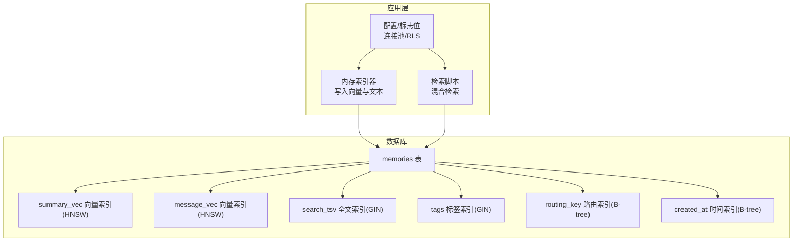
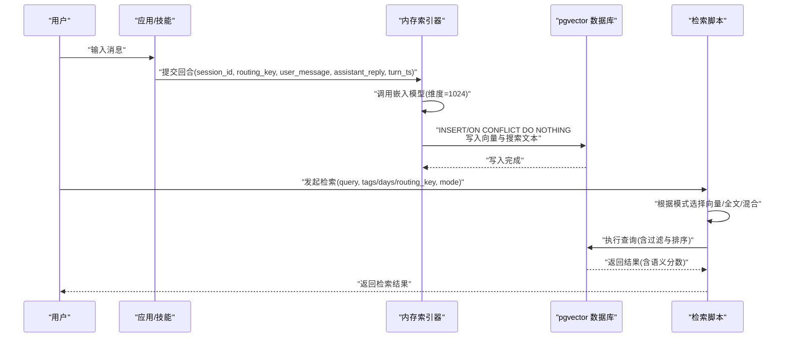
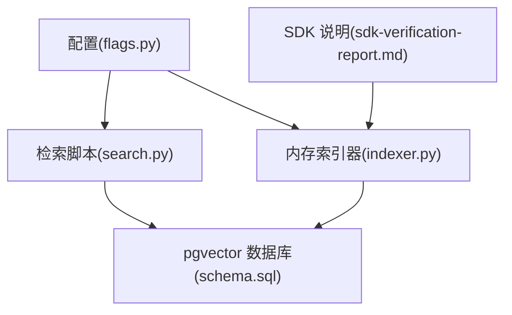

# pgvector 数据库模式

<cite>
**本文引用的文件**
- [schema.sql](file://schema.sql)
- [indexer.py](file://xiaopaw/memory/indexer.py)
- [search.py](file://xiaopaw/skills/search_memory/scripts/search.py)
- [11-migration-v1-to-v2.md](file://docs/11-migration-v1-to-v2.md)
- [flags.py](file://xiaopaw/config/flags.py)
- [config.py](file://xiaopaw/memory/config.py)
- [test_e2e_08_search_memory.py](file://tests/e2e/test_e2e_08_search_memory.py)
- [04-api.md](file://docs/04-api.md)
- [sdk-verification-report.md](file://docs/sdk-verification-report.md)
</cite>

## 目录
1. [简介](#简介)
2. [项目结构](#项目结构)
3. [核心组件](#核心组件)
4. [架构总览](#架构总览)
5. [详细组件分析](#详细组件分析)
6. [依赖关系分析](#依赖关系分析)
7. [性能考量](#性能考量)
8. [故障排除指南](#故障排除指南)
9. [结论](#结论)
10. [附录](#附录)

## 简介
本文件系统化梳理 XiaoPaw v2 的 pgvector 数据库模式，围绕 memories 表结构、向量索引与检索策略、全文与标签索引、时间戳索引、维度与相似度配置、初始化与重建、数据导入导出与迁移、以及查询性能优化与故障排除进行深入说明。目标是帮助数据库管理员与工程团队高效落地与维护该模式。

## 项目结构
- 数据库模式定义位于 schema.sql，包含表结构、向量字段与多类索引。
- 记忆体写入与向量嵌入由内存索引器负责，将对话回合转换为向量并写入数据库。
- 检索脚本提供混合检索能力，结合向量相似度与全文检索，并支持标签与时间过滤。
- 迁移文档提供从 v1 到 v2 的 schema 变更、RLS 与索引重建建议。
- 配置与标志位控制连接池、RLS 等运行期行为。

图表来源
- [schema.sql:4-43](file://schema.sql#L4-L43)
- [indexer.py:32-96](file://xiaopaw/memory/indexer.py#L32-L96)
- [search.py:58-172](file://xiaopaw/skills/search_memory/scripts/search.py#L58-L172)

章节来源
- [schema.sql:1-44](file://schema.sql#L1-L44)

## 核心组件
- 表结构与字段
  - 主键 id、会话标识 session_id、路由键 routing_key、用户消息 user_message、助手回复 assistant_reply、摘要 summary、标签数组 tags、创建时间 created_at、回合时间戳 turn_ts、摘要向量 summary_vec、消息向量 message_vec、搜索文本 search_text、全文 TSVector search_tsv。
- 向量维度与相似度
  - 向量维度为 1024；相似度采用余弦距离（cosine_ops），检索时以“1 - 余弦距离”作为语义分数。
- 索引配置
  - HNSW 向量索引：m=16，ef_construction=64；分别针对 summary_vec 与 message_vec。
  - 全文索引：GIN 索引 on search_tsv。
  - 标签索引：GIN 索引 on tags。
  - 路由键索引：B-tree on routing_key。
  - 时间索引：B-tree on created_at（降序）。
- 检索策略
  - 混合检索：向量得分权重 0.7 + 全文 BM25 得分权重 0.3；支持 tags、days、routing_key 过滤。
  - 纯向量检索：基于余弦距离排序。
  - 纯全文检索：基于 to_tsvector('simple') 与 ts_rank 排序。
- 初始化与迁移
  - schema.sql 提供幂等创建；v2 新增 routing_key NOT NULL 约束，迁移时需显式 ALTER 或两阶段约束。
  - 可选启用 RLS 并设置策略；可对表执行并发重建索引以降低升级抖动。
- 运行期配置
  - 连接池：psycopg2.ThreadedConnectionPool（最小 2，最大 10）。
  - RLS：feature_flags.enable_pgvector_rls 控制。
  - 检索脚本：支持 CLI 与函数两种入口，统一参数与输出格式。

章节来源
- [schema.sql:4-43](file://schema.sql#L4-L43)
- [indexer.py:61-67](file://xiaopaw/memory/indexer.py#L61-L67)
- [search.py:96-161](file://xiaopaw/skills/search_memory/scripts/search.py#L96-L161)
- [11-migration-v1-to-v2.md:168-262](file://docs/11-migration-v1-to-v2.md#L168-L262)
- [flags.py:21-22](file://xiaopaw/config/flags.py#L21-L22)
- [04-api.md:548-591](file://docs/04-api.md#L548-L591)

## 架构总览
下图展示从对话回合到向量索引、再到检索查询的整体流程与关键组件交互。

图表来源
- [indexer.py:32-96](file://xiaopaw/memory/indexer.py#L32-L96)
- [search.py:58-172](file://xiaopaw/skills/search_memory/scripts/search.py#L58-L172)
- [schema.sql:4-18](file://schema.sql#L4-L18)

## 详细组件分析

### 表结构与字段定义
- 字段概览
  - id: 主键，TEXT
  - session_id: 会话标识，TEXT
  - routing_key: 路由键，TEXT（v2 新增 NOT NULL 约束）
  - user_message: 用户消息，TEXT
  - assistant_reply: 助手回复，TEXT
  - summary: 摘要，TEXT
  - tags: 标签数组，TEXT[]
  - created_at: 创建时间，TIMESTAMPTZ，默认 NOW()
  - turn_ts: 回合时间戳，BIGINT
  - summary_vec: 向量，vector(1024)
  - message_vec: 向量，vector(1024)
  - search_text: 搜索文本，TEXT，默认空串
  - search_tsv: 全文 TSVECTOR，GENERATED ALWAYS AS (to_tsvector('simple', search_text)) STORED
- 设计要点
  - 将摘要与消息分别向量化，便于检索策略灵活选择。
  - search_tsv 自动生成，简化全文检索的维护成本。
  - routing_key 用于跨用户隔离，v2 强制 NOT NULL。

章节来源
- [schema.sql:4-18](file://schema.sql#L4-L18)

### 向量索引与 HNSW 参数
- 索引类型与字段
  - idx_memories_summary_vec: HNSW on summary_vec(vector_cosine_ops)
  - idx_memories_message_vec: HNSW on message_vec(vector_cosine_ops)
- HNSW 参数
  - m = 16
  - ef_construction = 64
- 相似度与检索
  - 使用余弦距离；检索时以 1 - (summary_vec <=> query_vec) 作为语义分数。
  - 混合检索中向量部分权重 0.7。

章节来源
- [schema.sql:21-27](file://schema.sql#L21-L27)
- [search.py:106](file://xiaopaw/skills/search_memory/scripts/search.py#L106)
- [search.py:148-151](file://xiaopaw/skills/search_memory/scripts/search.py#L148-L151)

### 全文搜索索引与标签索引
- 全文索引
  - idx_memories_search_tsv: GIN on search_tsv
  - 查询使用 to_tsvector('simple', ...) 与 ts_rank(...) 进行 BM25 近似评分。
- 标签索引
  - idx_memories_tags: GIN on tags
  - 查询使用数组交集运算符 && 进行标签过滤。

章节来源
- [schema.sql:29-35](file://schema.sql#L29-L35)
- [search.py:77-80](file://xiaopaw/skills/search_memory/scripts/search.py#L77-L80)
- [search.py:125](file://xiaopaw/skills/search_memory/scripts/search.py#L125)

### 时间戳索引与路由键隔离
- created_at 索引
  - idx_memories_created_at: B-tree on created_at DESC
  - 支持按时间范围过滤（如 days 参数）。
- routing_key 隔离
  - idx_memories_routing_key: B-tree on routing_key
  - 支持按用户/租户隔离检索。
- RLS（可选）
  - 可启用行级安全策略，强制查询时设置当前 routing_key。

章节来源
- [schema.sql:37-43](file://schema.sql#L37-L43)
- [11-migration-v1-to-v2.md:238-254](file://docs/11-migration-v1-to-v2.md#L238-L254)

### 向量维度、相似度与检索策略
- 维度
  - 文本嵌入维度固定为 1024。
- 相似度
  - 余弦距离；检索时以 1 - 距离作为分数。
- 检索模式
  - vector: 仅向量检索，按余弦距离升序。
  - fulltext: 仅全文检索，按 ts_rank 降序。
  - hybrid: 向量得分×0.7 + 全文得分×0.3，综合排序。

章节来源
- [indexer.py:64](file://xiaopaw/memory/indexer.py#L64)
- [search.py:96-161](file://xiaopaw/skills/search_memory/scripts/search.py#L96-L161)

### 数据导入导出与备份恢复
- 逻辑备份
  - 使用 pg_dump 对 pgvector 数据库进行逻辑备份，便于迁移与归档。
- 备份与恢复建议
  - 迁移前对 v1 数据进行备份；升级后保留旧备份直至回滚窗口结束。
- 迁移注意事项
  - schema.sql 提供幂等创建；如表已存在，需显式 ALTER 添加 NOT NULL 约束。
  - 大表建议两阶段添加约束，避免全表扫描锁表。

章节来源
- [11-migration-v1-to-v2.md:114-127](file://docs/11-migration-v1-to-v2.md#L114-L127)
- [11-migration-v1-to-v2.md:168-234](file://docs/11-migration-v1-to-v2.md#L168-L234)

### 索引重建与维护
- 升级后索引复查
  - 可执行并发重建索引以降低升级后的查询抖动。
- 索引参数建议
  - HNSW m 与 ef_construction 为 16 与 64；可根据数据规模与查询延迟微调。
  - 全文与标签索引默认 GIN，满足大多数过滤需求。

章节来源
- [11-migration-v1-to-v2.md:256-262](file://docs/11-migration-v1-to-v2.md#L256-L262)
- [schema.sql:21-27](file://schema.sql#L21-L27)

### 数据写入与一致性
- 写入流程
  - 索引器调用嵌入模型生成摘要与消息向量，拼接 search_text，写入数据库。
  - 使用 INSERT ... ON CONFLICT DO NOTHING 避免重复写入。
- 运行期连接
  - 使用 ThreadedConnectionPool（最小 2，最大 10），所有 DB 调用在 asyncio 线程池中执行。

章节来源
- [indexer.py:61-67](file://xiaopaw/memory/indexer.py#L61-L67)
- [indexer.py:75-87](file://xiaopaw/memory/indexer.py#L75-L87)
- [04-api.md:548-572](file://docs/04-api.md#L548-L572)

### 检索接口与参数
- 支持参数
  - query: 检索意图
  - tags: 标签过滤（逗号分隔）
  - days: 时间范围（最近 N 天）
  - routing_key: 用户/租户隔离
  - limit: 返回条数
  - mode: hybrid/vector/fulltext
- 输出
  - 统一序列化，时间字段转为 ISO 字符串，分数保留 4 位小数。

章节来源
- [search.py:58-65](file://xiaopaw/skills/search_memory/scripts/search.py#L58-L65)
- [search.py:179-203](file://xiaopaw/skills/search_memory/scripts/search.py#L179-L203)

## 依赖关系分析
- 组件耦合
  - 检索脚本依赖数据库模式与索引；索引器依赖外部嵌入服务与数据库连接池。
  - RLS 与连接池通过配置标志位控制，避免硬编码。
- 外部依赖
  - 嵌入模型：text-embedding-v3（维度 1024）
  - 数据库扩展：pgvector vector 类型与 HNSW 索引
  - 客户端：psycopg2（v2.1 推荐使用 ThreadedConnectionPool）

图表来源
- [search.py:58-172](file://xiaopaw/skills/search_memory/scripts/search.py#L58-L172)
- [indexer.py:32-96](file://xiaopaw/memory/indexer.py#L32-L96)
- [schema.sql:4-43](file://schema.sql#L4-L43)
- [flags.py:21-22](file://xiaopaw/config/flags.py#L21-L22)
- [sdk-verification-report.md:109-122](file://docs/sdk-verification-report.md#L109-L122)

章节来源
- [flags.py:21-22](file://xiaopaw/config/flags.py#L21-L22)
- [sdk-verification-report.md:109-122](file://docs/sdk-verification-report.md#L109-L122)

## 性能考量
- 向量检索
  - HNSW 参数 m=16、ef_construction=64 适合中小规模数据；大规模数据可考虑增大 m 或调整 ef_construction。
  - 检索时使用余弦距离，混合检索中向量权重 0.7，兼顾语义与精确匹配。
- 全文检索
  - GIN 索引 on search_tsv；BM25 近似评分 ts_rank，满足多数关键词检索场景。
- 标签与路由过滤
  - GIN 数组交集与 B-tree 路由键过滤，支持高效标量过滤。
- 连接池与并发
  - ThreadedConnectionPool（min=2, max=10）；所有 DB 调用在线程池中执行，避免阻塞事件循环。
- 时间索引
  - created_at 降序索引，配合 days 过滤提升时间范围查询效率。

章节来源
- [schema.sql:21-27](file://schema.sql#L21-L27)
- [search.py:137-161](file://xiaopaw/skills/search_memory/scripts/search.py#L137-L161)
- [04-api.md:548-572](file://docs/04-api.md#L548-L572)

## 故障排除指南
- 迁移后约束问题
  - 若表已存在，schema.sql 不会重新应用约束；需显式 ALTER 或两阶段添加 NOT NULL 约束。
- RLS 启用导致写入失败
  - v1 回滚时可临时禁用 RLS；生产环境需确保应用层正确设置 current_setting。
- 检索降级
  - 当 pgvector 不可用时，系统具备降级能力（测试用例覆盖）。
- 连接池与超时
  - 检查连接池大小与超时设置；必要时调整 feature_flags.enable_pgvector_connection_pool。
- 索引重建
  - 升级后可执行并发重建索引以缓解抖动。

章节来源
- [11-migration-v1-to-v2.md:168-234](file://docs/11-migration-v1-to-v2.md#L168-L234)
- [11-migration-v1-to-v2.md:238-254](file://docs/11-migration-v1-to-v2.md#L238-L254)
- [test_e2e_08_search_memory.py:36-79](file://tests/e2e/test_e2e_08_search_memory.py#L36-L79)
- [04-api.md:574-591](file://docs/04-api.md#L574-L591)

## 结论
XiaoPaw v2 的 pgvector 模式以简洁的表结构与完善的索引体系支撑语义检索与标量过滤。通过 HNSW 向量索引、全文 GIN 索引与标签数组索引的组合，配合混合检索策略与连接池优化，可在生产环境中实现稳定高效的检索体验。迁移与维护方面，遵循 schema 幂等创建、约束两阶段添加、并发重建索引与 RLS 可选启用的原则，可有效降低风险并保障业务连续性。

## 附录

### 数据库初始化脚本与索引重建
- 初始化
  - 使用 schema.sql 幂等创建表与索引。
- 索引重建
  - 升级后可执行并发重建索引以降低抖动。

章节来源
- [schema.sql:1-44](file://schema.sql#L1-L44)
- [11-migration-v1-to-v2.md:256-262](file://docs/11-migration-v1-to-v2.md#L256-L262)

### 迁移方案与回滚
- 从 v1 升级到 v2
  - 幂等创建 schema.sql；显式添加 routing_key NOT NULL 约束（小表可直接 ALTER，大表采用两阶段）。
  - 可选启用 RLS 并设置策略。
- 回滚
  - v1 可继续读取 v2 写入的数据；如启用 RLS，回滚后需先禁用 RLS。

章节来源
- [11-migration-v1-to-v2.md:168-234](file://docs/11-migration-v1-to-v2.md#L168-L234)
- [11-migration-v1-to-v2.md:687-700](file://docs/11-migration-v1-to-v2.md#L687-L700)

### 查询性能优化建议
- 合理设置 HNSW 参数：根据数据规模与延迟目标调整 m 与 ef_construction。
- 使用混合检索：向量权重 0.7 + 全文权重 0.3 通常取得较好平衡。
- 标量过滤先行：尽量利用 tags、routing_key、days 过滤缩小候选集。
- 连接池调优：根据并发与资源限制调整 min/max。

章节来源
- [schema.sql:21-27](file://schema.sql#L21-L27)
- [search.py:137-161](file://xiaopaw/skills/search_memory/scripts/search.py#L137-L161)
- [04-api.md:548-572](file://docs/04-api.md#L548-L572)