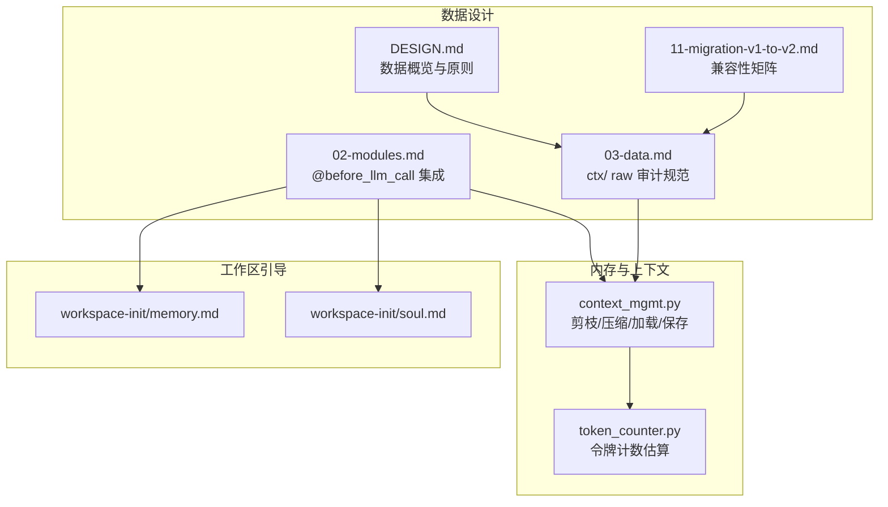
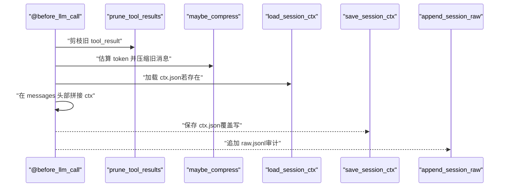
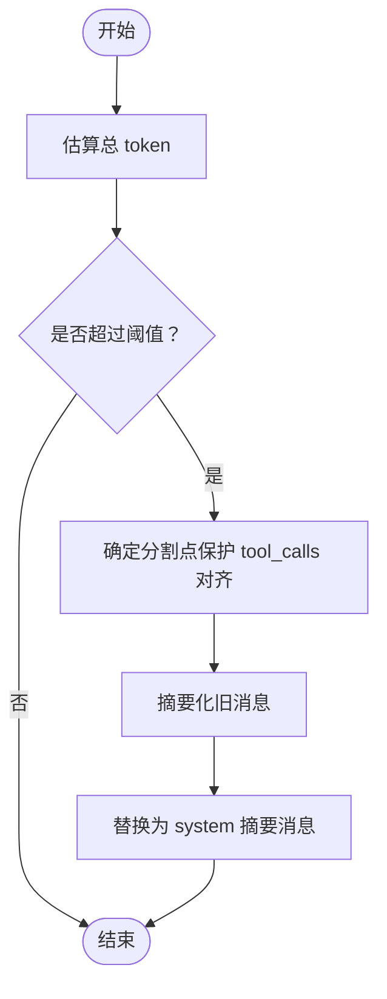
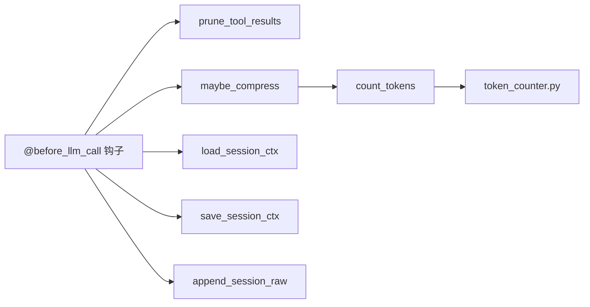

# 上下文 JSON 格式

<cite>
**本文引用的文件**
- [context_mgmt.py](file://xiaopaw/memory/context_mgmt.py)
- [token_counter.py](file://xiaopaw/memory/token_counter.py)
- [03-data.md](file://docs/03-data.md)
- [02-modules.md](file://docs/02-modules.md)
- [DESIGN.md](file://DESIGN.md)
- [11-migration-v1-to-v2.md](file://docs/11-migration-v1-to-v2.md)
- [memory.md](file://workspace-init/memory.md)
- [soul.md](file://workspace-init/soul.md)
</cite>

## 目录
1. [简介](#简介)
2. [项目结构](#项目结构)
3. [核心组件](#核心组件)
4. [架构总览](#架构总览)
5. [详细组件分析](#详细组件分析)
6. [依赖关系分析](#依赖关系分析)
7. [性能考量](#性能考量)
8. [故障排查指南](#故障排查指南)
9. [结论](#结论)
10. [附录](#附录)

## 简介
本文件系统化阐述 XiaoPaw v2 的“上下文 JSON”格式与序列化规范，涵盖：
- ctx.json 的结构、字段与数据类型
- 序列化格式、版本与兼容性策略
- 历史记录管理、增量更新与持久化
- 压缩、去重与存储优化策略
- 上下文模板示例与自定义字段说明
- 验证规则、错误处理与恢复机制
- 性能基准与存储空间估算方法

## 项目结构
围绕上下文 JSON 的关键实现位于内存与数据设计文档中：
- 上下文生命周期管理与序列化：xiaopaw/memory/context_mgmt.py
- 上下文长度估算与阈值判定：xiaopaw/memory/token_counter.py
- 数据设计与文件格式：docs/03-data.md
- 模块集成与调用链：docs/02-modules.md
- 设计原则与数据概览：DESIGN.md
- v1→v2 迁移与兼容性：docs/11-migration-v1-to-v2.md
- 工作区引导文件（用于构建 bootstrap 背景）：workspace-init/*.md

**图表来源**
- [context_mgmt.py:1-99](file://xiaopaw/memory/context_mgmt.py#L1-L99)
- [token_counter.py:1-44](file://xiaopaw/memory/token_counter.py#L1-L44)
- [03-data.md:294-376](file://docs/03-data.md#L294-L376)
- [02-modules.md:463-582](file://docs/02-modules.md#L463-L582)
- [DESIGN.md:469-495](file://DESIGN.md#L469-L495)
- [11-migration-v1-to-v2.md:139-158](file://docs/11-migration-v1-to-v2.md#L139-L158)
- [memory.md:1-18](file://workspace-init/memory.md#L1-L18)
- [soul.md:1-29](file://workspace-init/soul.md#L1-L29)

**章节来源**
- [context_mgmt.py:1-99](file://xiaopaw/memory/context_mgmt.py#L1-L99)
- [token_counter.py:1-44](file://xiaopaw/memory/token_counter.py#L1-L44)
- [03-data.md:294-376](file://docs/03-data.md#L294-L376)
- [02-modules.md:463-582](file://docs/02-modules.md#L463-L582)
- [DESIGN.md:469-495](file://DESIGN.md#L469-L495)
- [11-migration-v1-to-v2.md:139-158](file://docs/11-migration-v1-to-v2.md#L139-L158)
- [memory.md:1-18](file://workspace-init/memory.md#L1-L18)
- [soul.md:1-29](file://workspace-init/soul.md#L1-L29)

## 核心组件
- 上下文剪枝与压缩
  - 剪枝：对早期 tool_result 内容进行摘要化裁剪，保留最近 fresh_keep_turns 的消息
  - 压缩：当上下文总 token 超过阈值时，将旧消息摘要化为一条 system 消息，保留新鲜对话
- 上下文序列化
  - ctx.json：压缩后的 messages 数组，作为 LLM 调用的上下文输入
  - raw.jsonl：完整原始消息流，用于审计与离线分析
- 上下文加载与持久化
  - 首次 LLM 调用前加载 ctx.json 并拼接到 messages 头部
  - 每次 LLM 调用后保存 ctx.json 并追加 raw.jsonl

**章节来源**
- [context_mgmt.py:14-99](file://xiaopaw/memory/context_mgmt.py#L14-L99)
- [03-data.md:294-376](file://docs/03-data.md#L294-L376)
- [02-modules.md:507-582](file://docs/02-modules.md#L507-L582)

## 架构总览
上下文在运行时的生命周期如下：
- 每轮 LLM 调用前：
  - 剪枝 tool_result
  - 估算 token，按阈值压缩旧消息
  - 加载 ctx.json（若存在）并拼接至 messages 头部
- LLM 调用后：
  - 保存 ctx.json（覆盖写）
  - 追加 raw.jsonl（审计日志）

**图表来源**
- [02-modules.md:507-582](file://docs/02-modules.md#L507-L582)
- [context_mgmt.py:14-99](file://xiaopaw/memory/context_mgmt.py#L14-L99)

**章节来源**
- [02-modules.md:507-582](file://docs/02-modules.md#L507-L582)
- [context_mgmt.py:14-99](file://xiaopaw/memory/context_mgmt.py#L14-L99)

## 详细组件分析

### ctx.json 结构与字段定义
- 结构：OpenAI/DeepSeek messages 数组（与 LLM 调用直接互通）
- 字段
  - role：system / user / assistant / tool
  - content：字符串，承载对话内容
  - tool_calls：可选，数组，描述工具调用
  - tool_call_id：可选，字符串，与 tool 消息对应
- 语义
  - 压缩后，旧消息被汇总为一条 system 消息，保留最近 fresh_keep_turns 的 user/assistant 对话
  - ctx.json 仅包含压缩后的 messages，不包含原始 tool_result 的长内容

**图表来源**
- [context_mgmt.py:27-61](file://xiaopaw/memory/context_mgmt.py#L27-L61)

**章节来源**
- [03-data.md:307-326](file://docs/03-data.md#L307-L326)
- [context_mgmt.py:27-71](file://xiaopaw/memory/context_mgmt.py#L27-L71)

### raw.jsonl 审计日志
- 每行一条消息，包含：
  - role：user / assistant / tool
  - content：原始内容（可能包含工具结果）
  - ts：ISO UTC 时间戳
  - tool_calls/tool_call_id：可选，用于追踪工具调用链
- 用途：离线分析、调试、审计
- 生命周期：默认 30 天

**章节来源**
- [03-data.md:330-340](file://docs/03-data.md#L330-L340)
- [context_mgmt.py:93-99](file://xiaopaw/memory/context_mgmt.py#L93-L99)

### 历史记录管理与增量更新
- 增量更新策略
  - 每轮 LLM 调用后保存 ctx.json（覆盖写）
  - 每轮 LLM 调用后追加 raw.jsonl（审计）
- 剪枝与压缩
  - 剪枝：对早期 tool_result 内容进行摘要化裁剪
  - 压缩：基于 token 估算与阈值，将旧消息摘要化
- fresh_keep_turns
  - 默认保留最近 10 个对话轮次（20 条消息）的完整内容

**章节来源**
- [context_mgmt.py:14-61](file://xiaopaw/memory/context_mgmt.py#L14-L61)
- [02-modules.md:518-525](file://docs/02-modules.md#L518-L525)

### 压缩、去重与存储优化
- 压缩算法
  - 默认摘要：提取 user/assistant 的片段，拼接为摘要
  - 可插拔 compress_fn：支持自定义摘要函数
- 去重与边界保护
  - 压缩前扫描旧消息，确保 tool_calls 对齐（assistant 的 tool_calls 与 tool 的响应匹配）
  - 保护边界：从最后的 user 消息开始向前扩展，避免破坏工具调用完整性
- 存储优化
  - ctx.json：仅保存压缩后的 messages，显著降低体积
  - raw.jsonl：保留完整原始消息，便于审计
  - token 估算：优先使用官方 tokenizer，降级到粗估策略

**章节来源**
- [context_mgmt.py:27-71](file://xiaopaw/memory/context_mgmt.py#L27-L71)
- [token_counter.py:15-44](file://xiaopaw/memory/token_counter.py#L15-L44)

### 上下文模板示例与自定义字段
- 模板来源：bootstrap 背景（workspace-init/*.md）
  - soul.md：角色定位、性格、工作原则、回复风格
  - memory.md：长期记忆索引（自动维护）
- 上下文注入：bootstrap 背景在首次 LLM 调用前注入到 messages 中，随后由 ctx.json 持久化

**章节来源**
- [02-modules.md:793-813](file://docs/02-modules.md#L793-L813)
- [memory.md:1-18](file://workspace-init/memory.md#L1-L18)
- [soul.md:1-29](file://workspace-init/soul.md#L1-L29)

### 版本控制与兼容性
- 文件格式
  - ctx.json：messages 数组（与 LLM 调用格式一致）
  - raw.jsonl：每行一条消息
- 兼容性
  - v1 → v2 完全向前兼容：可直接读取 v1 生成的 ctx.json/raw.jsonl
  - 迁移注意事项：凭证与配置迁移、pgvector 约束变更等

**章节来源**
- [03-data.md:294-376](file://docs/03-data.md#L294-L376)
- [11-migration-v1-to-v2.md:139-158](file://docs/11-migration-v1-to-v2.md#L139-L158)

### 验证规则、错误处理与恢复
- 验证规则
  - messages 数组必须为 JSON 数组
  - role 必须为受支持的枚举值
  - tool_calls 与 tool_call_id 需成对出现
- 错误处理
  - load_session_ctx：JSON 解析失败或 IO 异常时记录警告并返回空列表
  - token 估算：降级策略确保在 tokenizer 不可用时仍能估算
- 恢复机制
  - 首次 LLM 调用前加载 ctx.json 并拼接到 messages 头部
  - 若加载失败，系统继续运行，不影响后续流程

**章节来源**
- [context_mgmt.py:74-82](file://xiaopaw/memory/context_mgmt.py#L74-L82)
- [token_counter.py:35-44](file://xiaopaw/memory/token_counter.py#L35-L44)

## 依赖关系分析
- 模块耦合
  - context_mgmt.py 依赖 token_counter.py 进行 token 估算
  - @before_llm_call 钩子在 MemoryAwareCrew 中调用剪枝与压缩
- 外部依赖
  - JSON 序列化/反序列化
  - 文件系统写入（ctx.json 覆盖写，raw.jsonl 追加写）

**图表来源**
- [02-modules.md:507-582](file://docs/02-modules.md#L507-L582)
- [context_mgmt.py:14-99](file://xiaopaw/memory/context_mgmt.py#L14-L99)
- [token_counter.py:35-44](file://xiaopaw/memory/token_counter.py#L35-L44)

**章节来源**
- [02-modules.md:507-582](file://docs/02-modules.md#L507-L582)
- [context_mgmt.py:14-99](file://xiaopaw/memory/context_mgmt.py#L14-L99)
- [token_counter.py:1-44](file://xiaopaw/memory/token_counter.py#L1-L44)

## 性能考量
- token 估算
  - 优先使用官方 tokenizer；不可用时采用粗估策略
  - 估算偏差与压缩阈值共同决定触发压缩的时机
- 压缩阈值与窗口大小
  - compress_threshold：默认 0.45，表示当旧消息 token 占比超过 45% 时触发压缩
  - fresh_keep_turns：默认 10，保留最近 20 条消息的完整内容
- I/O 模式
  - ctx.json：覆盖写（write-then-rename 可选）
  - raw.jsonl：append-only，适合长期审计
- 生命周期与清理
  - raw.jsonl 默认 30 天清理，避免磁盘膨胀

**章节来源**
- [context_mgmt.py:27-61](file://xiaopaw/memory/context_mgmt.py#L27-L61)
- [token_counter.py:15-44](file://xiaopaw/memory/token_counter.py#L15-L44)
- [03-data.md:364-376](file://docs/03-data.md#L364-L376)

## 故障排查指南
- ctx.json 无法加载
  - 现象：加载失败并记录警告
  - 处理：检查文件是否存在与权限；确认 JSON 格式正确；必要时删除损坏文件让系统重新生成
- 压缩后工具调用链断裂
  - 现象：assistant 的 tool_calls 与 tool 响应不匹配
  - 处理：确认压缩边界扫描逻辑已保护 tool_calls 对齐；检查 messages 中 tool_call_id 是否正确
- token 估算异常
  - 现象：tokenizer 初始化失败或估算异常
  - 处理：检查依赖安装；确认降级策略生效；调整 token_counter_mode
- 审计日志过大
  - 现象：raw.jsonl 体积增长过快
  - 处理：启用 30 天清理策略；定期归档历史数据

**章节来源**
- [context_mgmt.py:74-82](file://xiaopaw/memory/context_mgmt.py#L74-L82)
- [context_mgmt.py:46-48](file://xiaopaw/memory/context_mgmt.py#L46-L48)
- [token_counter.py:15-44](file://xiaopaw/memory/token_counter.py#L15-L44)
- [03-data.md:364-376](file://docs/03-data.md#L364-L376)

## 结论
XiaoPaw v2 的上下文 JSON 格式以“messages 数组”为核心，结合剪枝、压缩与审计日志，实现了高效、可审计的上下文管理。其设计遵循“压缩优先、审计分离”的原则，既满足 LLM 调用的性能需求，又保障了历史记录的可追溯性。通过合理的阈值与边界保护机制，系统能在复杂工具调用场景下保持上下文完整性。

## 附录

### ctx.json 字段定义一览
- role：system / user / assistant / tool
- content：字符串
- tool_calls：可选，数组
- tool_call_id：可选，字符串

**章节来源**
- [03-data.md:307-326](file://docs/03-data.md#L307-L326)

### raw.jsonl 字段定义一览
- role：user / assistant / tool
- content：字符串
- ts：ISO UTC 时间戳
- tool_calls/tool_call_id：可选

**章节来源**
- [03-data.md:330-340](file://docs/03-data.md#L330-L340)

### 存储空间估算方法
- 估算步骤
  - 使用 token_counter.py 的估算策略计算 messages 的近似 token 数
  - 根据 compress_threshold（默认 0.45）判断是否触发压缩
  - 压缩后 ctx.json 的大小 ≈ system 摘要 + fresh_keep_turns 的完整消息
- 建议
  - 结合业务对话长度与工具调用频率，动态调整 fresh_keep_turns 与阈值
  - 定期监控 raw.jsonl 体积，确保 30 天清理策略有效执行

**章节来源**
- [context_mgmt.py:27-61](file://xiaopaw/memory/context_mgmt.py#L27-L61)
- [token_counter.py:35-44](file://xiaopaw/memory/token_counter.py#L35-L44)
- [03-data.md:364-376](file://docs/03-data.md#L364-L376)