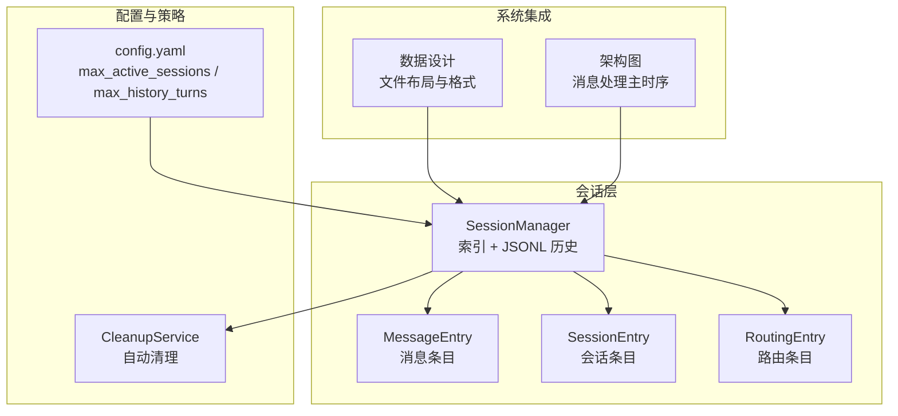
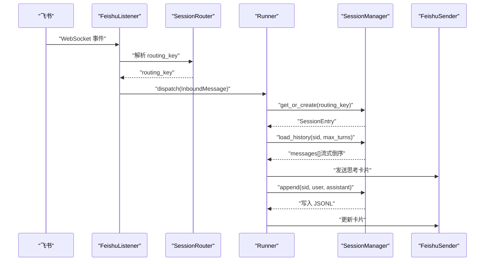
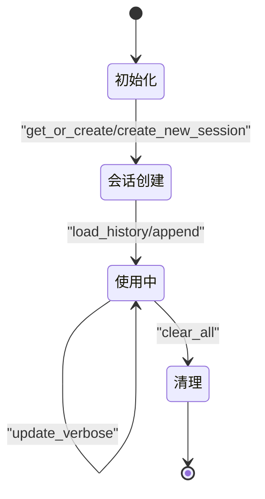
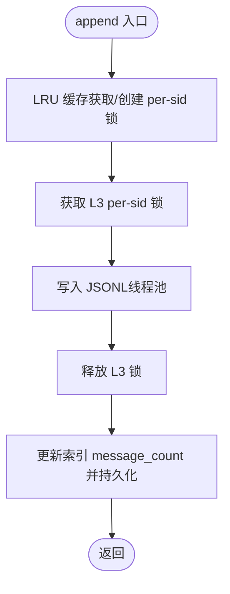
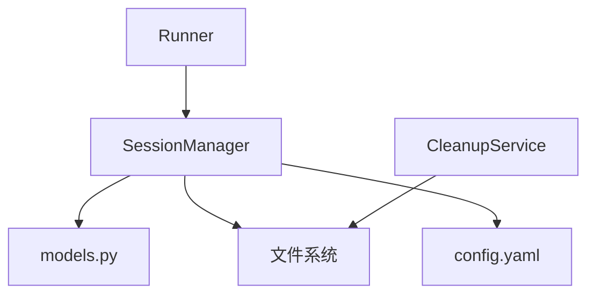

# 会话存储格式

<cite>
**本文引用的文件**
- [xiaopaw/session/models.py](file://xiaopaw/session/models.py)
- [xiaopaw/session/manager.py](file://xiaopaw/session/manager.py)
- [docs/03-data.md](file://docs/03-data.md)
- [docs/05-concurrency.md](file://docs/05-concurrency.md)
- [docs/01-architecture.md](file://docs/01-architecture.md)
- [config.yaml.example](file://config.yaml.example)
- [xiaopaw/cleanup/service.py](file://xiaopaw/cleanup/service.py)
- [DESIGN.md](file://DESIGN.md)
- [docs/10-testing.md](file://docs/10-testing.md)
</cite>

## 目录
1. [简介](#简介)
2. [项目结构](#项目结构)
3. [核心组件](#核心组件)
4. [架构总览](#架构总览)
5. [详细组件分析](#详细组件分析)
6. [依赖关系分析](#依赖关系分析)
7. [性能考量](#性能考量)
8. [故障排查指南](#故障排查指南)
9. [结论](#结论)
10. [附录](#附录)

## 简介
本文件面向 XiaoPaw v2 的“会话存储格式”，系统化说明会话数据结构、字段定义与数据类型；文档化会话状态管理、LRU 缓存与并发控制；解释会话生命周期、超时与自动清理策略；涵盖会话序列化格式、持久化存储与恢复机制；提供会话状态转换图与典型使用场景；说明会话隔离、路由键管理与多租户支持；并给出性能优化建议与内存使用最佳实践。

## 项目结构
围绕会话存储的关键文件与职责如下：
- 会话数据模型：定义消息条目、会话条目与路由条目
- 会话管理器：负责索引与 JSONL 历史的读写、并发锁与索引持久化
- 数据设计文档：权威的文件布局、格式与生命周期
- 并发设计文档：两级锁模型与 LRU 锁缓存的必要性
- 架构文档：会话在整体系统中的位置与交互
- 配置：会话相关参数（最大活跃会话数、历史轮数等）
- 清理服务：会话历史与追踪的自动清理策略
- 设计总览：会话与上下文、追踪、工作区的关系

图表来源
- [xiaopaw/session/manager.py:1-183](file://xiaopaw/session/manager.py#L1-L183)
- [xiaopaw/session/models.py:1-38](file://xiaopaw/session/models.py#L1-L38)
- [config.yaml.example:32-34](file://config.yaml.example#L32-L34)
- [xiaopaw/cleanup/service.py:1-77](file://xiaopaw/cleanup/service.py#L1-L77)
- [docs/03-data.md:129-210](file://docs/03-data.md#L129-L210)
- [docs/01-architecture.md:132-213](file://docs/01-architecture.md#L132-L213)

章节来源
- [xiaopaw/session/models.py:1-38](file://xiaopaw/session/models.py#L1-L38)
- [xiaopaw/session/manager.py:1-183](file://xiaopaw/session/manager.py#L1-L183)
- [docs/03-data.md:129-210](file://docs/03-data.md#L129-L210)
- [docs/05-concurrency.md:339-407](file://docs/05-concurrency.md#L339-L407)
- [docs/01-architecture.md:132-213](file://docs/01-architecture.md#L132-L213)
- [config.yaml.example:32-34](file://config.yaml.example#L32-L34)
- [xiaopaw/cleanup/service.py:1-77](file://xiaopaw/cleanup/service.py#L1-L77)
- [DESIGN.md:469-495](file://DESIGN.md#L469-L495)

## 核心组件
- 会话数据模型
  - MessageEntry：单轮消息条目，包含角色、内容、毫秒时间戳与可选飞书消息 ID
  - SessionEntry：会话元数据，包含会话 ID、创建时间、是否详细模式、消息计数
  - RoutingEntry：路由键下的会话集合与当前活跃会话 ID
- 会话管理器
  - 索引 index.json：按路由键维护会话快照，支持并发写入（单进程锁 + 原子写）
  - JSONL 历史：每个会话一个文件，首行为 meta，后续为 message 行，支持流式倒序读取
  - 并发控制：LRU 锁缓存 + 两级锁，防止 OOM 与竞态
  - 生命周期：支持更新 verbose、加载历史、追加消息、清空索引

章节来源
- [xiaopaw/session/models.py:18-38](file://xiaopaw/session/models.py#L18-L38)
- [xiaopaw/session/manager.py:38-183](file://xiaopaw/session/manager.py#L38-L183)
- [docs/03-data.md:129-210](file://docs/03-data.md#L129-L210)

## 架构总览
会话在系统中的位置与交互：
- 输入：飞书 WebSocket 事件经 Listener 解析为 InboundMessage
- 路由：SessionRouter 基于 routing_key 决定会话归属
- 会话：Runner 通过 SessionManager 获取或创建会话，加载历史，追加消息
- 存储：index.json（索引）与 sessions/{sid}.jsonl（历史）持久化
- 清理：CleanupService 按策略清理过期数据

图表来源
- [docs/01-architecture.md:132-213](file://docs/01-architecture.md#L132-L213)
- [xiaopaw/session/manager.py:70-183](file://xiaopaw/session/manager.py#L70-L183)

章节来源
- [docs/01-architecture.md:132-213](file://docs/01-architecture.md#L132-L213)

## 详细组件分析

### 会话数据结构与字段定义
- MessageEntry
  - 字段：role（"user"|"assistant"）、content（字符串）、ts（毫秒时间戳）、feishu_msg_id（可选）
  - 用途：JSONL 中的消息行
- SessionEntry
  - 字段：id（s-uuid 前缀）、created_at（ISO-8601 UTC）、verbose（是否详细模式）、message_count（消息对数×2）
  - 用途：索引中每个会话的元数据快照
- RoutingEntry
  - 字段：active_session_id（当前活跃会话）、sessions（会话列表）
  - 用途：按 routing_key 维护会话集合与活跃会话指针

章节来源
- [xiaopaw/session/models.py:18-38](file://xiaopaw/session/models.py#L18-L38)
- [docs/03-data.md:129-210](file://docs/03-data.md#L129-L210)

### 会话序列化格式与持久化
- index.json（会话索引）
  - 结构：键为 routing_key，值为 active_session_id + sessions[]
  - 写入：临时文件 + 原子重命名，确保崩溃安全
  - 读取：启动时加载，运行时按需更新
- sessions/{sid}.jsonl（对话历史）
  - 首行：meta（包含 session_id、routing_key、workspace_id、created_at）
  - 后续：message 行（role、content、ts、feishu_msg_id?）
  - 写入：追加写，线程池执行 + flush + fsync（v2 保持 flush，清理策略中考虑卷剩余空间）
  - 读取：流式倒序读取，避免大文件 OOM

章节来源
- [docs/03-data.md:129-210](file://docs/03-data.md#L129-L210)
- [xiaopaw/session/manager.py:49-131](file://xiaopaw/session/manager.py#L49-L131)

### 会话状态管理与生命周期
- 状态转换
  - 创建：get_or_create/create_new_session 返回 SessionEntry
  - 更新：update_verbose 切换 verbose
  - 使用：load_history 获取历史，append 追加消息
  - 清理：clear_all 清空索引
- 生命周期
  - 索引：永久（按策略清理）
  - 历史：默认 180 天后归档冷存储
  - 审计日志：raw.jsonl 默认 30 天
  - 追踪：默认 30 天

图表来源
- [xiaopaw/session/manager.py:70-183](file://xiaopaw/session/manager.py#L70-L183)
- [docs/03-data.md:198-283](file://docs/03-data.md#L198-L283)

章节来源
- [xiaopaw/session/manager.py:70-183](file://xiaopaw/session/manager.py#L70-L183)
- [docs/03-data.md:198-283](file://docs/03-data.md#L198-L283)

### LRU 缓存机制与并发控制
- LRU 锁缓存
  - 作用：限制 per-session 锁数量，防止 OOM
  - 实现：LRU 最大容量，超出时淘汰最旧锁
- 两级锁模型
  - L1：保护“检查 + 创建 + 获取”三步原子性（避免驱逐后并发竞争）
  - L3：真正的 per-session 写互斥（短时持有，不阻塞 L1）
- 并发正确性
  - 同 sid 并发 append：通过 per-sid 锁保证互斥
  - 不同 sid 并发：LRU 驱逐后新建锁，但不会出现双锁并存导致的互斥失效

图表来源
- [docs/05-concurrency.md:339-407](file://docs/05-concurrency.md#L339-L407)
- [xiaopaw/session/manager.py:132-168](file://xiaopaw/session/manager.py#L132-L168)

章节来源
- [docs/05-concurrency.md:339-407](file://docs/05-concurrency.md#L339-L407)
- [xiaopaw/session/manager.py:18-46](file://xiaopaw/session/manager.py#L18-L46)

### 路由键管理与多租户支持
- 路由键
  - 格式：p2p:ou_xxx、group:oc_xxx、thread:oc_xxx:ot_xxx
  - 作用：隔离不同用户、群组、话题的会话
- 多租户
  - 通过 routing_key 将不同租户的消息隔离在各自的会话树中
  - 会话历史与索引均按 routing_key 维度组织，天然支持多租户

章节来源
- [docs/03-data.md:106-126](file://docs/03-data.md#L106-L126)
- [docs/01-architecture.md:132-213](file://docs/01-architecture.md#L132-L213)

### 自动清理策略与超时处理
- 清理服务
  - 运行时间：UTC 小时触发（默认 3 点）
  - 清理范围：raw 审计日志、trace 目录（按 mtime）
  - 会话历史：默认 180 天，CleanupService 扫描并移动到 archive 目录（冷存储）
- 超时处理
  - Runner 空闲 worker 自动退出（idle_timeout_s）
  - Skill 超时主动 kill sandbox 进程，避免僵尸进程
  - 会话 verbose 模式与 message_count 用于快速判断会话状态

章节来源
- [xiaopaw/cleanup/service.py:14-77](file://xiaopaw/cleanup/service.py#L14-L77)
- [config.yaml.example:36-38](file://config.yaml.example#L36-L38)
- [docs/01-architecture.md:449-455](file://docs/01-architecture.md#L449-L455)

### 典型使用场景
- 同一用户多轮对话：使用 get_or_create 获取活跃会话，load_history 读取最近 N 轮，append 追加消息
- 多用户并发：不同 routing_key 的消息分别串行处理，互不干扰
- 并发写入验证：单元测试覆盖 100 协程并发 append 同一 sid，确保无交叉写入
- 跨用户隔离：E2E 测试验证不同用户路由键下的会话相互独立

章节来源
- [docs/10-testing.md:687-718](file://docs/10-testing.md#L687-L718)
- [tests/e2e/test_e2e_02_routing.py:23-42](file://tests/e2e/test_e2e_02_routing.py#L23-L42)

## 依赖关系分析
- SessionManager 依赖
  - models：MessageEntry、SessionEntry、RoutingEntry
  - 文件系统：sessions 目录、index.json、各 sid.jsonl
  - 并发：asyncio.Lock、线程池 asyncio.to_thread
  - 配置：max_active_sessions、max_history_turns
- 与其他模块的耦合
  - Runner：通过 get_or_create/load_history/append 与 SessionManager 交互
  - CleanupService：清理 sessions 与 traces、raw 日志
  - MemoryAwareCrew：在 before_llm_call 阶段写 ctx.json 与 raw.jsonl

图表来源
- [xiaopaw/session/manager.py:1-183](file://xiaopaw/session/manager.py#L1-L183)
- [config.yaml.example:32-34](file://config.yaml.example#L32-L34)
- [xiaopaw/cleanup/service.py:1-77](file://xiaopaw/cleanup/service.py#L1-L77)

章节来源
- [xiaopaw/session/manager.py:1-183](file://xiaopaw/session/manager.py#L1-L183)
- [config.yaml.example:32-34](file://config.yaml.example#L32-L34)
- [xiaopaw/cleanup/service.py:1-77](file://xiaopaw/cleanup/service.py#L1-L77)

## 性能考量
- 内存占用
  - LRU 锁缓存上限 1000，每把锁约 200 字节，稳态内存约 200KB
  - 建议：日活接近上限时调大 max_active_sessions，避免持续驱逐
- I/O 与吞吐
  - JSONL 追加写 + flush + fsync，保证可靠性
  - 流式倒序读取避免大文件 OOM，提高响应性
- 并发与锁
  - 两级锁模型降低锁竞争，提升并发写入稳定性
  - per-rk 队列串行化同路由键消息，避免乱序与死锁
- 清理与容量
  - CleanupService 在磁盘剩余空间低时优先归档，避免写放大
  - 历史轮数 max_history_turns 可调，平衡内存与历史长度

章节来源
- [docs/05-concurrency.md:401-407](file://docs/05-concurrency.md#L401-L407)
- [docs/03-data.md:249-274](file://docs/03-data.md#L249-L274)
- [DESIGN.md:469-495](file://DESIGN.md#L469-L495)

## 故障排查指南
- 并发写入异常
  - 现象：100 协程并发 append 同一 sid 出现交叉写入
  - 排查：确认两级锁是否生效（LRU 驱逐后重建锁不会导致双锁并存）
  - 验证：参考并发正确性测试用例
- OOM 或锁过多
  - 现象：活跃会话数超过上限导致持续驱逐
  - 处理：调大 config.yaml.session.max_active_sessions，或监控告警
- 历史读取缓慢
  - 现象：load_history 大文件阻塞事件循环
  - 处理：确认使用流式倒序读取（已在 v2 实现）
- 清理策略未生效
  - 现象：历史文件未被清理
  - 处理：确认 CleanupService 运行时间与 TTL 配置，检查 mtime

章节来源
- [docs/10-testing.md:687-718](file://docs/10-testing.md#L687-L718)
- [docs/05-concurrency.md:367-407](file://docs/05-concurrency.md#L367-L407)
- [docs/03-data.md:249-274](file://docs/03-data.md#L249-L274)
- [xiaopaw/cleanup/service.py:42-52](file://xiaopaw/cleanup/service.py#L42-L52)

## 结论
XiaoPaw v2 的会话存储以“索引 + JSONL”的轻量方案实现高可用与可扩展性。通过 LRU 锁缓存与两级锁模型，既防止 OOM 又保证并发正确性；通过流式倒序读取与原子写，兼顾性能与可靠性。结合路由键隔离与清理策略，满足多租户与长期运营需求。建议在生产中合理设置活跃会话上限与历史轮数，并关注 CleanupService 的运行与磁盘空间。

## 附录
- 相关配置项
  - session.max_active_sessions：LRU 锁缓存上限
  - session.max_history_turns：历史读取轮数
  - runner.idle_timeout_s：Runner 空闲 worker 退出时间
- 数据生命周期与清理矩阵
  - 会话索引：永久（策略清理）
  - 会话历史：180 天后归档
  - 审计日志：30 天
  - 追踪：30 天

章节来源
- [config.yaml.example:32-38](file://config.yaml.example#L32-L38)
- [DESIGN.md:469-495](file://DESIGN.md#L469-L495)
- [docs/03-data.md:198-283](file://docs/03-data.md#L198-L283)