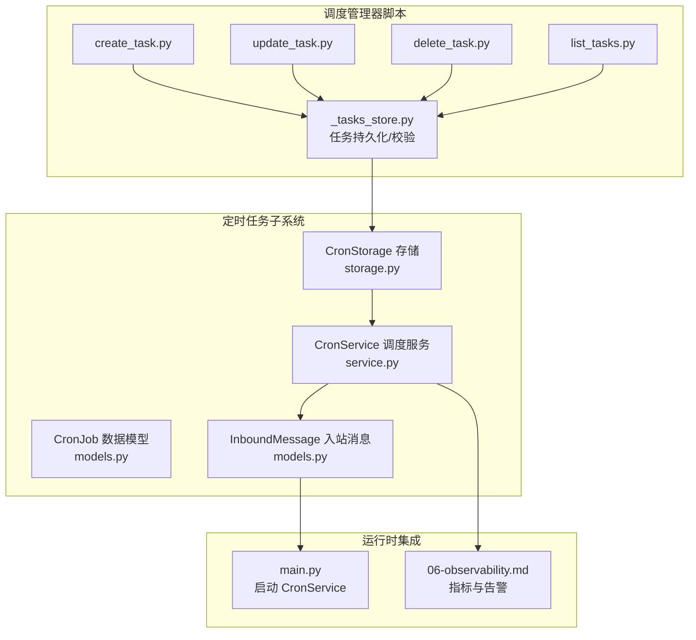
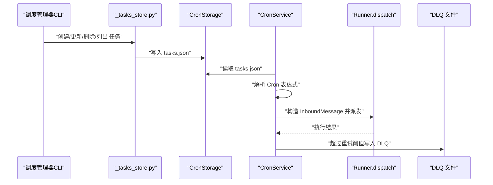
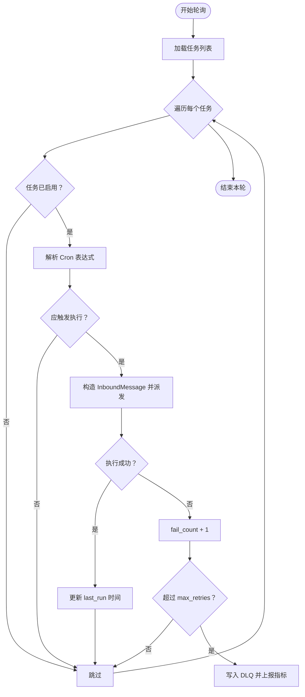
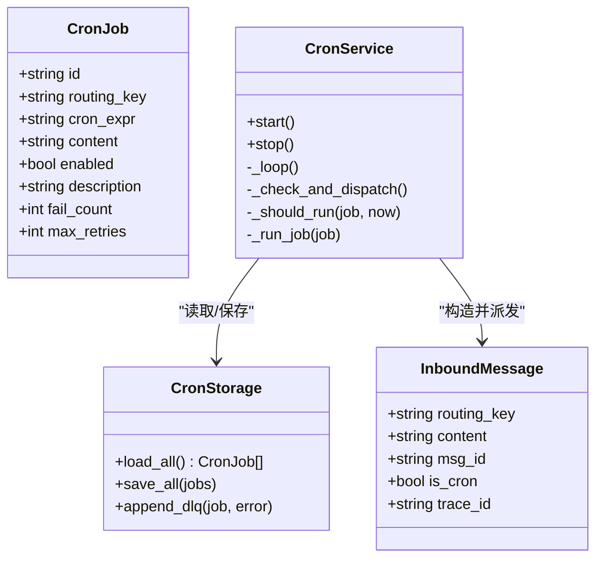

# 定时任务格式

<cite>
**本文引用的文件**
- [models.py](file://xiaopaw/cron/models.py)
- [service.py](file://xiaopaw/cron/service.py)
- [storage.py](file://xiaopaw/cron/storage.py)
- [main.py](file://xiaopaw/main.py)
- [models.py](file://xiaopaw/models.py)
- [_tasks_store.py](file://xiaopaw/skills/scheduler_mgr/scripts/_tasks_store.py)
- [create_task.py](file://xiaopaw/skills/scheduler_mgr/scripts/create_task.py)
- [update_task.py](file://xiaopaw/skills/scheduler_mgr/scripts/update_task.py)
- [delete_task.py](file://xiaopaw/skills/scheduler_mgr/scripts/delete_task.py)
- [list_tasks.py](file://xiaopaw/skills/scheduler_mgr/scripts/list_tasks.py)
- [pyproject.toml](file://pyproject.toml)
- [06-observability.md](file://docs/06-observability.md)
- [tasks.md](file://docs/ssot/tasks.md)
</cite>

## 目录
1. [简介](#简介)
2. [项目结构](#项目结构)
3. [核心组件](#核心组件)
4. [架构总览](#架构总览)
5. [详细组件分析](#详细组件分析)
6. [依赖关系分析](#依赖关系分析)
7. [性能与可靠性考量](#性能与可靠性考量)
8. [故障排查指南](#故障排查指南)
9. [结论](#结论)
10. [附录](#附录)

## 简介
本文件系统性地文档化 XiaoPaw v2 的“定时任务格式”，覆盖 Cron 任务的数据结构、字段定义、调度规则与执行流程；任务类型分类、执行参数与回调机制；任务状态管理、重试策略与失败处理；并发控制与资源限制；任务配置示例与最佳实践；持久化、恢复与一致性保障；以及调度算法、负载均衡与性能监控方案。内容基于仓库中实际实现与文档，确保可操作与可验证。

## 项目结构
围绕定时任务的核心代码位于以下模块：
- cron 子系统：数据模型、服务与存储
- 入站消息模型：统一承载定时任务派发
- 调度管理器脚本：提供 at/every/cron 三类任务的创建、更新、删除与查询
- 主程序：启动 CronService 并注入调度器
- 观测性指标：DLQ 计数等关键指标

图表来源
- [models.py:8-17](file://xiaopaw/cron/models.py#L8-L17)
- [service.py:19-97](file://xiaopaw/cron/service.py#L19-L97)
- [storage.py:14-49](file://xiaopaw/cron/storage.py#L14-L49)
- [models.py:17-28](file://xiaopaw/models.py#L17-L28)
- [_tasks_store.py:12-134](file://xiaopaw/skills/scheduler_mgr/scripts/_tasks_store.py#L12-L134)
- [create_task.py:8-37](file://xiaopaw/skills/scheduler_mgr/scripts/create_task.py#L8-L37)
- [update_task.py:8-50](file://xiaopaw/skills/scheduler_mgr/scripts/update_task.py#L8-L50)
- [delete_task.py:8-21](file://xiaopaw/skills/scheduler_mgr/scripts/delete_task.py#L8-L21)
- [list_tasks.py:7-16](file://xiaopaw/skills/scheduler_mgr/scripts/list_tasks.py#L7-L16)
- [main.py:130-150](file://xiaopaw/main.py#L130-L150)
- [06-observability.md:456-466](file://docs/06-observability.md#L456-L466)

章节来源
- [models.py:1-17](file://xiaopaw/cron/models.py#L1-L17)
- [service.py:1-97](file://xiaopaw/cron/service.py#L1-L97)
- [storage.py:1-49](file://xiaopaw/cron/storage.py#L1-L49)
- [models.py:17-28](file://xiaopaw/models.py#L17-L28)
- [_tasks_store.py:1-322](file://xiaopaw/skills/scheduler_mgr/scripts/_tasks_store.py#L1-L322)
- [create_task.py:1-37](file://xiaopaw/skills/scheduler_mgr/scripts/create_task.py#L1-L37)
- [update_task.py:1-50](file://xiaopaw/skills/scheduler_mgr/scripts/update_task.py#L1-L50)
- [delete_task.py:1-21](file://xiaopaw/skills/scheduler_mgr/scripts/delete_task.py#L1-L21)
- [list_tasks.py:1-16](file://xiaopaw/skills/scheduler_mgr/scripts/list_tasks.py#L1-L16)
- [main.py:130-150](file://xiaopaw/main.py#L130-L150)
- [06-observability.md:456-466](file://docs/06-observability.md#L456-L466)

## 核心组件
- CronJob 数据模型：定义任务标识、路由键、Cron 表达式、内容、开关、描述、失败计数与最大重试次数等字段。
- CronService：周期性检查任务并触发执行，负责调度决策、失败重试与 DLQ 移动。
- CronStorage：基于文件的持久化存储，支持文件锁保护与 DLQ 追加。
- InboundMessage：统一的入站消息载体，用于将定时任务转换为普通消息进行派发。
- 调度管理器脚本：提供 at/every/cron 三种任务类型的创建、更新、删除与列表查询，内部以 JSON 文件持久化。

章节来源
- [models.py:8-17](file://xiaopaw/cron/models.py#L8-L17)
- [service.py:19-97](file://xiaopaw/cron/service.py#L19-L97)
- [storage.py:14-49](file://xiaopaw/cron/storage.py#L14-L49)
- [models.py:17-28](file://xiaopaw/models.py#L17-L28)
- [_tasks_store.py:49-134](file://xiaopaw/skills/scheduler_mgr/scripts/_tasks_store.py#L49-L134)

## 架构总览
定时任务从“调度管理器脚本”创建并持久化到文件，CronService 周期扫描任务，匹配 Cron 表达式后构造 InboundMessage 并派发给 Runner。执行失败时按最大重试阈值进入 DLQ，并上报观测指标。

图表来源
- [_tasks_store.py:27-32](file://xiaopaw/skills/scheduler_mgr/scripts/_tasks_store.py#L27-L32)
- [storage.py:31-43](file://xiaopaw/cron/storage.py#L31-L43)
- [service.py:53-97](file://xiaopaw/cron/service.py#L53-L97)
- [models.py:17-28](file://xiaopaw/models.py#L17-L28)
- [06-observability.md:456-466](file://docs/06-observability.md#L456-L466)

## 详细组件分析

### Cron 任务数据结构与字段定义
- id：任务唯一标识
- routing_key：消息路由键，决定消息投递目标
- cron_expr：Cron 表达式，用于调度决策
- content：任务内容（字符串），作为消息正文
- enabled：是否启用，默认开启
- description：任务描述
- fail_count：当前失败次数，非负
- max_retries：最大重试次数，非负

字段约束与默认值由 Pydantic 校验保障，确保数据一致性与可序列化。

章节来源
- [models.py:8-17](file://xiaopaw/cron/models.py#L8-L17)

### 调度规则与执行流程
- 周期检查：CronService 在固定间隔轮询任务列表
- 表达式判断：使用 croniter 解析表达式，比较下一次触发时间与当前时间
- 派发执行：构造 InboundMessage 并通过回调函数派发
- 失败处理：捕获异常并增加失败计数，达到阈值后移入 DLQ

图表来源
- [service.py:45-97](file://xiaopaw/cron/service.py#L45-L97)
- [models.py:17-28](file://xiaopaw/models.py#L17-L28)
- [06-observability.md:456-466](file://docs/06-observability.md#L456-L466)

章节来源
- [service.py:45-97](file://xiaopaw/cron/service.py#L45-L97)

### 任务类型分类与执行参数
- Cron 类型：通过 cron_expr 字段指定周期表达式，结合 tz（调度管理器脚本中支持）实现时区感知
- At 类型：在指定时间戳 at_ms 执行一次
- Every 类型：每隔 every_ms 毫秒重复执行

执行参数与负载：
- payload 中包含 routing_key 与 message，分别对应消息路由与内容
- delete_after_run 标志用于任务执行后自动删除

章节来源
- [_tasks_store.py:49-134](file://xiaopaw/skills/scheduler_mgr/scripts/_tasks_store.py#L49-L134)
- [create_task.py:8-37](file://xiaopaw/skills/scheduler_mgr/scripts/create_task.py#L8-L37)
- [update_task.py:8-50](file://xiaopaw/skills/scheduler_mgr/scripts/update_task.py#L8-L50)
- [delete_task.py:8-21](file://xiaopaw/skills/scheduler_mgr/scripts/delete_task.py#L8-L21)
- [list_tasks.py:7-16](file://xiaopaw/skills/scheduler_mgr/scripts/list_tasks.py#L7-L16)

### 回调机制与消息派发
- CronService 通过回调函数将 InboundMessage 派发至 Runner
- InboundMessage 字段包含 routing_key、content、msg_id、sender_id、ts、is_cron、trace_id 等，便于追踪与审计

章节来源
- [service.py:75-85](file://xiaopaw/cron/service.py#L75-L85)
- [models.py:17-28](file://xiaopaw/models.py#L17-L28)
- [main.py:130-150](file://xiaopaw/main.py#L130-L150)

### 任务状态管理、重试策略与失败处理
- 状态字段：fail_count、max_retries 控制重试与终止
- 重试策略：每次失败增加 fail_count，未达阈值则等待下次轮询重试
- 失败处理：超过阈值后写入 DLQ（JSON Lines），同时上报 xiaopaw_cron_dlq_total 指标

章节来源
- [models.py:15-17](file://xiaopaw/cron/models.py#L15-L17)
- [service.py:75-97](file://xiaopaw/cron/service.py#L75-L97)
- [06-observability.md:456-466](file://docs/06-observability.md#L456-L466)

### 并发控制与资源限制
- 文件锁保护：CronStorage 使用 filelock 防止跨进程写冲突
- 线程安全：读写均包裹锁；写入采用临时文件 + 原子重命名
- 资源限制：CronService 以异步循环运行，间隔可配置；任务执行通过 Runner 派发，遵循整体并发与队列限制

章节来源
- [storage.py:23-49](file://xiaopaw/cron/storage.py#L23-L49)
- [service.py:32-51](file://xiaopaw/cron/service.py#L32-L51)
- [tasks.md:62-94](file://docs/ssot/tasks.md#L62-L94)

### 持久化、恢复机制与一致性保证
- 持久化：tasks.json 存放任务列表；DLQ 以 tasks.dlq.jsonl 追加写入
- 一致性：文件锁 + 临时文件 + 原子重命名；读取失败返回空列表或上次缓存
- 恢复：重启后 CronService 从 tasks.json 加载任务并继续调度

章节来源
- [storage.py:14-49](file://xiaopaw/cron/storage.py#L14-L49)
- [service.py:32-51](file://xiaopaw/cron/service.py#L32-L51)

### 调度算法、负载均衡与性能监控
- 调度算法：基于 croniter 的 Cron 表达式解析，考虑检查间隔偏移
- 负载均衡：单实例 CronService；任务粒度的负载主要受 Runner 并发与队列限制影响
- 性能监控：DLQ 指标 xiaopaw_cron_dlq_total；可观测性文档提供告警规则与仪表盘建议

章节来源
- [service.py:65-73](file://xiaopaw/cron/service.py#L65-L73)
- [06-observability.md:456-466](file://docs/06-observability.md#L456-L466)

## 依赖关系分析
- CronService 依赖 CronStorage 提供任务持久化能力
- CronService 通过回调函数将任务转换为 InboundMessage 并派发
- 主程序在启动阶段初始化 CronStorage 与 CronService，并在关闭阶段优雅停止

图表来源
- [models.py:8-17](file://xiaopaw/cron/models.py#L8-L17)
- [storage.py:14-49](file://xiaopaw/cron/storage.py#L14-L49)
- [service.py:19-97](file://xiaopaw/cron/service.py#L19-L97)
- [models.py:17-28](file://xiaopaw/models.py#L17-L28)

章节来源
- [models.py:1-17](file://xiaopaw/cron/models.py#L1-L17)
- [storage.py:1-49](file://xiaopaw/cron/storage.py#L1-L49)
- [service.py:1-97](file://xiaopaw/cron/service.py#L1-L97)
- [models.py:1-35](file://xiaopaw/models.py#L1-L35)

## 性能与可靠性考量
- 调度精度：CronService 基于 croniter 的表达式解析，检查间隔为可配置参数
- 锁竞争：filelock 保护读写，避免跨进程 JSON 损坏；写入采用临时文件 + 原子重命名
- 失败隔离：DLQ 独立文件追加，不影响主任务表；失败后不再推进下次执行时间，便于人工介入
- 指标与告警：DLQ 指标用于 P1 告警，结合 Prometheus/Grafana 实现可视化监控

章节来源
- [storage.py:23-49](file://xiaopaw/cron/storage.py#L23-L49)
- [service.py:75-97](file://xiaopaw/cron/service.py#L75-L97)
- [06-observability.md:456-466](file://docs/06-observability.md#L456-L466)

## 故障排查指南
- Cron 表达式无效：日志会记录警告信息；请检查表达式语法
- DLQ 增长：确认任务执行链路是否存在外部依赖失败；查看 DLQ 文件内容定位具体任务
- 文件锁超时：检查是否有长时间持有锁的进程；适当调整 filelock 超时参数
- 任务未触发：确认任务 enabled 状态、cron_expr 与当前时间的关系；核对检查间隔配置

章节来源
- [service.py:65-73](file://xiaopaw/cron/service.py#L65-L73)
- [service.py:90-97](file://xiaopaw/cron/service.py#L90-L97)
- [storage.py:23-29](file://xiaopaw/cron/storage.py#L23-L29)
- [06-observability.md:641-647](file://docs/06-observability.md#L641-L647)

## 结论
XiaoPaw v2 的定时任务体系以简洁可靠为核心设计：CronJob 数据模型清晰、CronService 调度逻辑稳健、CronStorage 采用文件锁与原子写保障一致性，配合 DLQ 与可观测性指标形成完整的失败处理闭环。调度管理器脚本提供了 at/every/cron 三类任务的完整生命周期管理，适合在生产环境中稳定运行。

## 附录

### 任务配置示例与最佳实践
- Cron 类型
  - 使用 cron_expr 指定表达式；如需时区，请参考调度管理器脚本中的 tz 支持
  - 将 routing_key 设为合适的通道标识，content 为可被下游处理的内容
- At 类型
  - 提供 at_ms（毫秒时间戳），仅执行一次
- Every 类型
  - 提供 every_ms（毫秒间隔），周期性执行
- 最佳实践
  - 明确 max_retries 与检查间隔，避免频繁抖动
  - 对关键任务启用 DLQ 监控与告警
  - 使用 delete_after_run 减少长期维护负担

章节来源
- [_tasks_store.py:49-134](file://xiaopaw/skills/scheduler_mgr/scripts/_tasks_store.py#L49-L134)
- [create_task.py:8-37](file://xiaopaw/skills/scheduler_mgr/scripts/create_task.py#L8-L37)
- [update_task.py:8-50](file://xiaopaw/skills/scheduler_mgr/scripts/update_task.py#L8-L50)
- [delete_task.py:8-21](file://xiaopaw/skills/scheduler_mgr/scripts/delete_task.py#L8-L21)
- [list_tasks.py:7-16](file://xiaopaw/skills/scheduler_mgr/scripts/list_tasks.py#L7-L16)

### 关键依赖与版本要求
- croniter：Cron 表达式解析
- filelock：文件锁保护
- prometheus_client：指标导出

章节来源
- [pyproject.toml:22-31](file://pyproject.toml#L22-L31)