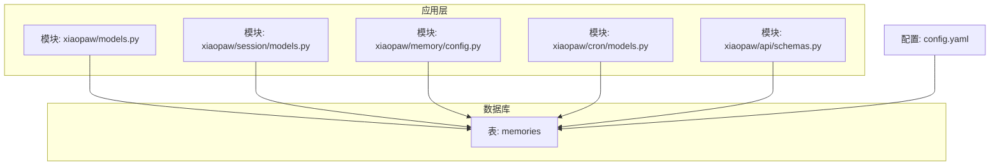
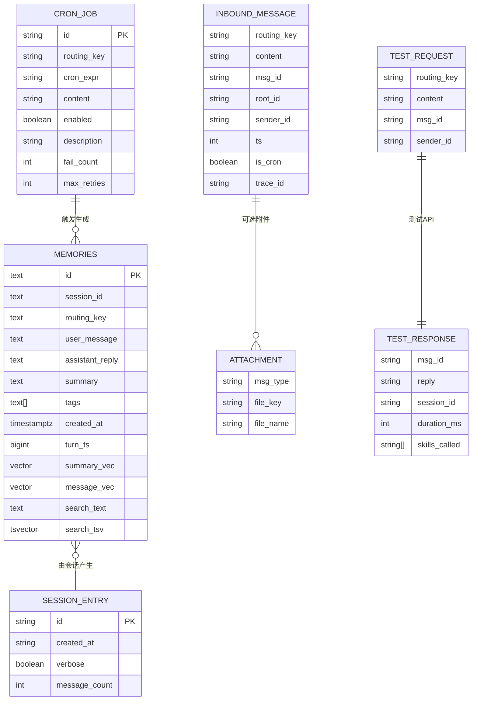
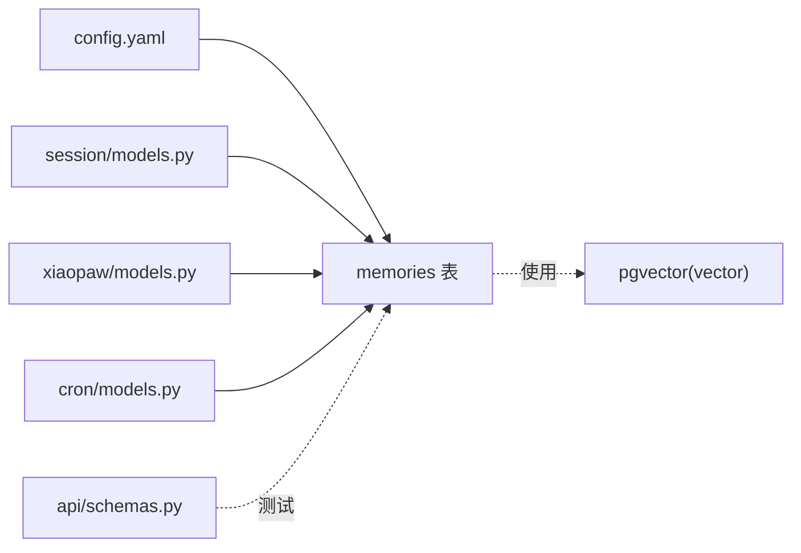

# 数据模型

<cite>
**本文引用的文件**
- [schema.sql](file://schema.sql)
- [models.py](file://xiaopaw/models.py)
- [session/models.py](file://xiaopaw/session/models.py)
- [memory/config.py](file://xiaopaw/memory/config.py)
- [cron/models.py](file://xiaopaw/cron/models.py)
- [api/schemas.py](file://xiaopaw/api/schemas.py)
- [config.yaml](file://config.yaml)
- [11-migration-v1-to-v2.md](file://docs/11-migration-v1-to-v2.md)
- [hooks.yaml](file://shared_hooks/hooks.yaml)
</cite>

## 目录
1. [简介](#简介)
2. [项目结构](#项目结构)
3. [核心组件](#核心组件)
4. [架构总览](#架构总览)
5. [详细组件分析](#详细组件分析)
6. [依赖分析](#依赖分析)
7. [性能考量](#性能考量)
8. [故障排查指南](#故障排查指南)
9. [结论](#结论)
10. [附录](#附录)

## 简介
本文件为 XiaoPaw v2 的数据模型文档，聚焦于持久化存储、内存与会话模型、以及与可观测性/安全钩子的交互。重点覆盖：
- 实体关系与字段定义
- 主键/外键、索引与约束
- 数据验证规则与业务规则
- 数据库模式图与示例数据
- 数据访问模式、缓存策略与性能考虑
- 数据生命周期、保留策略与归档规则
- 数据迁移路径与版本管理
- 数据安全、隐私与访问控制

## 项目结构
围绕数据模型的关键文件分布如下：
- 数据库模式：schema.sql
- 应用层数据模型：xiaopaw/models.py、xiaopaw/session/models.py、xiaopaw/memory/config.py、xiaopaw/cron/models.py、xiaopaw/api/schemas.py
- 运行配置：config.yaml
- 迁移文档：docs/11-migration-v1-to-v2.md
- 观测与安全钩子：shared_hooks/hooks.yaml

图表来源
- [schema.sql:1-44](file://schema.sql#L1-L44)
- [models.py:1-35](file://xiaopaw/models.py#L1-L35)
- [session/models.py:1-38](file://xiaopaw/session/models.py#L1-L38)
- [memory/config.py:1-5](file://xiaopaw/memory/config.py#L1-L5)
- [cron/models.py:1-17](file://xiaopaw/cron/models.py#L1-L17)
- [api/schemas.py:1-27](file://xiaopaw/api/schemas.py#L1-L27)
- [config.yaml:1-90](file://config.yaml#L1-L90)

章节来源
- [schema.sql:1-44](file://schema.sql#L1-L44)
- [models.py:1-35](file://xiaopaw/models.py#L1-L35)
- [session/models.py:1-38](file://xiaopaw/session/models.py#L1-L38)
- [memory/config.py:1-5](file://xiaopaw/memory/config.py#L1-L5)
- [cron/models.py:1-17](file://xiaopaw/cron/models.py#L1-L17)
- [api/schemas.py:1-27](file://xiaopaw/api/schemas.py#L1-L27)
- [config.yaml:1-90](file://config.yaml#L1-L90)

## 核心组件
- 记忆（memories）表：承载对话记忆、向量与全文检索字段，支持跨用户路由隔离与时间序列查询。
- 会话（SessionEntry）：会话标识、创建时间、消息计数等元信息。
- 输入消息（InboundMessage）：路由键、内容、消息 ID、根消息 ID、发送者 ID、时间戳、是否定时任务、附件、追踪 ID。
- 附件（Attachment）：消息类型、对象存储键、文件名。
- CronJob：定时任务模型，包含调度表达式、目标路由键、内容、启用状态、重试上限等。
- 测试请求/响应（TestRequest/TestResponse）：用于测试 API 的输入输出结构。

章节来源
- [schema.sql:4-18](file://schema.sql#L4-L18)
- [session/models.py:26-38](file://xiaopaw/session/models.py#L26-L38)
- [models.py:10-28](file://xiaopaw/models.py#L10-L28)
- [cron/models.py:8-17](file://xiaopaw/cron/models.py#L8-L17)
- [api/schemas.py:13-27](file://xiaopaw/api/schemas.py#L13-L27)

## 架构总览
下图展示数据模型在系统中的位置与交互：

图表来源
- [schema.sql:4-18](file://schema.sql#L4-L18)
- [session/models.py:26-38](file://xiaopaw/session/models.py#L26-L38)
- [models.py:10-28](file://xiaopaw/models.py#L10-L28)
- [cron/models.py:8-17](file://xiaopaw/cron/models.py#L8-L17)
- [api/schemas.py:13-27](file://xiaopaw/api/schemas.py#L13-L27)

## 详细组件分析

### 数据库模式：memories 表
- 主键：id（TEXT）
- 外键：无（跨用户隔离通过 routing_key 实现）
- 字段与类型
  - session_id（TEXT，NOT NULL）：关联会话
  - routing_key（TEXT，NOT NULL）：路由键，实现跨用户/群组隔离
  - user_message（TEXT，NOT NULL）：用户输入
  - assistant_reply（TEXT，NOT NULL）：助手回复
  - summary（TEXT，NOT NULL）：摘要
  - tags（TEXT[]，NOT NULL，默认空数组）：标签数组，支持 GIN 索引
  - created_at（TIMESTAMPTZ，NOT NULL，默认当前时间）：创建时间
  - turn_ts（BIGINT，NOT NULL）：轮次时间戳
  - summary_vec（vector(1024)）：摘要向量
  - message_vec（vector(1024)）：消息向量
  - search_text（TEXT，NOT NULL，默认空字符串）：全文检索文本
  - search_tsv（TSVECTOR，GENERATED ALWAYS AS ... STORED）：全文检索向量
- 约束与索引
  - 主键：id
  - 索引：HNSW 向量索引（summary_vec、message_vec）、GIN 全文索引（search_tsv）、GIN 标签索引（tags）、普通索引（routing_key、created_at DESC）

章节来源
- [schema.sql:4-18](file://schema.sql#L4-L18)
- [schema.sql:20-43](file://schema.sql#L20-L43)

### 应用层数据模型

#### 会话模型
- SessionEntry：包含会话 ID、创建时间、verbose 标志、消息计数
- MessageEntry：包含角色、内容、时间戳、飞书消息 ID

章节来源
- [session/models.py:18-38](file://xiaopaw/session/models.py#L18-L38)

#### 输入消息与附件
- InboundMessage：包含路由键、内容、消息 ID、根消息 ID、发送者 ID、时间戳、是否定时任务、附件、追踪 ID
- Attachment：消息类型、对象存储键、文件名

章节来源
- [models.py:10-28](file://xiaopaw/models.py#L10-L28)

#### 定时任务模型
- CronJob：包含任务 ID、路由键、cron 表达式、内容、启用状态、描述、失败次数、最大重试次数（均带最小值约束）

章节来源
- [cron/models.py:8-17](file://xiaopaw/cron/models.py#L8-L17)

#### 测试 API 模型
- TestRequest：路由键、内容、消息 ID、发送者 ID、附件
- TestResponse：消息 ID、回复、会话 ID、耗时、调用的技能列表

章节来源
- [api/schemas.py:8-27](file://xiaopaw/api/schemas.py#L8-L27)

### 数据访问模式与缓存策略
- 数据访问模式
  - 写入：InboundMessage → 生成 SessionEntry → 构造 memories 记录（含向量与搜索文本）
  - 查询：按 routing_key 与 created_at 排序检索；支持标签过滤与全文检索；向量相似度检索
- 缓存策略
  - replay_cache：最大容量与 TTL（来自配置项）
  - 会话与追踪：Langfuse 使用 session_id 作为 trace_id，确保同一会话内链路一致

章节来源
- [config.yaml:63-65](file://config.yaml#L63-L65)
- [hooks.yaml:1-26](file://shared_hooks/hooks.yaml#L1-L26)

### 数据验证规则与业务规则
- 验证规则
  - CronJob.fail_count、max_retries ≥ 0
  - NOT NULL 约束：session_id、routing_key、user_message、assistant_reply、summary、search_text
  - routing_key 强约束：v2 升级后需保证 NOT NULL（迁移文档提供两阶段 ALTER 方案）
- 业务规则
  - 跨用户隔离：通过 routing_key 实现
  - 会话生命周期：cleanup 配置定义会话、trace、原始数据的 TTL
  - 内存限制：memory.hard_limit_lines 与 max_save_length 控制历史长度与保存长度

章节来源
- [cron/models.py:15-16](file://xiaopaw/cron/models.py#L15-L16)
- [schema.sql:5-17](file://schema.sql#L5-L17)
- [11-migration-v1-to-v2.md:175-236](file://docs/11-migration-v1-to-v2.md#L175-L236)
- [config.yaml:25-31](file://config.yaml#L25-L31)
- [config.yaml:73-79](file://config.yaml#L73-L79)

### 示例数据
- memories 记录示例（字段对应 schema.sql）
  - id: "mem_abc123"
  - session_id: "s_xxxxx"
  - routing_key: "group:oc_xxx"
  - user_message: "如何创建表格？"
  - assistant_reply: "您可以使用飞书多维表格功能..."
  - summary: "用户询问如何创建表格"
  - tags: ["表格", "飞书"]
  - created_at: "2025-01-01T12:00:00+08:00"
  - turn_ts: 1700000000000
  - summary_vec: 向量(1024)
  - message_vec: 向量(1024)
  - search_text: "如何创建表格"
  - search_tsv: 全文向量

章节来源
- [schema.sql:4-18](file://schema.sql#L4-L18)

### 数据生命周期、保留策略与归档规则
- 生命周期
  - 会话：cleanup.session_ttl_days 定义会话保留天数
  - Trace：cleanup.trace_ttl_days
  - 原始数据：cleanup.raw_ttl_days
- 归档与清理
  - cleanup.run_hour_utc 指定清理运行时间
  - 建议结合路由键进行分桶归档，便于按租户/群组迁移与删除

章节来源
- [config.yaml:73-79](file://config.yaml#L73-L79)

### 数据迁移路径与版本管理
- v1 → v2 升级要点
  - schema.sql 为幂等创建（IF NOT EXISTS），但 v2 新增 routing_key NOT NULL 约束
  - 小表（< 10 万行）：直接 ALTER COLUMN ... SET NOT NULL
  - 大表（≥ 100 万行）：两阶段 ALTER（CHECK NOT VALID → VALIDATE → 可选 SET NOT NULL）
- 版本管理
  - 项目版本：3.0.0（来自 pyproject.toml）
  - 升级时需先执行 schema.sql，再按迁移文档补强约束

章节来源
- [schema.sql:1-3](file://schema.sql#L1-L3)
- [11-migration-v1-to-v2.md:164-236](file://docs/11-migration-v1-to-v2.md#L164-L236)
- [pyproject.toml:1-63](file://pyproject.toml#L1-L63)

### 数据安全、隐私与访问控制
- 隔离与审计
  - 路由键 routing_key 实现跨用户/群组隔离
  - 观测钩子在 BEFORE_TOOL_CALL 即使被拒绝也会记录，确保审计完整性
- 隐私处理
  - 日志与追踪采用结构化日志与 Langfuse，建议结合 PII 掩码策略（参见 observability.pii_mask）
- 访问控制
  - 钩子策略包括 SandboxGuard、PermissionGate、LoopDetector、RetryTracker 等，贯穿工具调用前后

章节来源
- [hooks.yaml:1-73](file://shared_hooks/hooks.yaml#L1-L73)
- [config.yaml:51-58](file://config.yaml#L51-L58)

## 依赖分析
- 表与模型的依赖关系
  - memories 表被会话模型、输入消息模型、定时任务模型间接使用
  - 测试 API 模型独立于数据库表，用于端到端验证
- 外部依赖
  - PostgreSQL 扩展：vector（pgvector）
  - 可观测性：Langfuse、Prometheus（可选依赖）

图表来源
- [config.yaml:1-90](file://config.yaml#L1-L90)
- [schema.sql:14-15](file://schema.sql#L14-L15)
- [pyproject.toml:22-31](file://pyproject.toml#L22-L31)

章节来源
- [config.yaml:1-90](file://config.yaml#L1-L90)
- [schema.sql:14-15](file://schema.sql#L14-L15)
- [pyproject.toml:22-31](file://pyproject.toml#L22-L31)

## 性能考量
- 向量检索
  - HNSW 索引（cosine 距离）支持大规模向量相似度检索
  - 建议定期评估索引质量与查询延迟
- 全文检索
  - GIN 索引加速 TSVector 查询
  - search_text 与 search_tsv 的维护成本需平衡
- 索引维护
  - 大表 ALTER 约束采用两阶段方案，避免长时间排他锁
- 缓存
  - replay_cache 提供短期高频命中，降低数据库压力
- 内存与上下文
  - memory.hard_limit_lines 与 max_save_length 控制上下文窗口大小，避免过载

章节来源
- [schema.sql:20-43](file://schema.sql#L20-L43)
- [11-migration-v1-to-v2.md:208-236](file://docs/11-migration-v1-to-v2.md#L208-L236)
- [config.yaml:25-31](file://config.yaml#L25-L31)
- [config.yaml:63-65](file://config.yaml#L63-L65)

## 故障排查指南
- 约束冲突
  - 若出现 routing_key 为 NULL 的错误，参考迁移文档两阶段 ALTER 步骤
- 向量索引异常
  - 检查 pgvector 扩展是否安装；确认向量维度与索引参数匹配
- 全文检索性能差
  - 检查 search_text 是否合理；确认 TSVector 更新逻辑
- 缓存命中率低
  - 调整 replay_cache.maxsize 与 ttl_sec；核对会话 ID 与 trace_id 一致性

章节来源
- [11-migration-v1-to-v2.md:175-236](file://docs/11-migration-v1-to-v2.md#L175-L236)
- [schema.sql:20-43](file://schema.sql#L20-L43)
- [config.yaml:63-65](file://config.yaml#L63-L65)
- [hooks.yaml:1-26](file://shared_hooks/hooks.yaml#L1-L26)

## 结论
XiaoPaw v2 的数据模型以 memories 表为核心，结合路由键隔离、向量与全文检索索引，支撑高效的记忆检索与跨用户隔离。配合配置化的生命周期管理、两阶段迁移策略与可观测性/安全钩子，形成从数据到行为的闭环治理。建议在生产环境中持续监控索引与缓存表现，并严格执行迁移与审计流程。

## 附录

### 字段与类型速查
- memories
  - id: TEXT（主键）
  - session_id: TEXT（NOT NULL）
  - routing_key: TEXT（NOT NULL）
  - user_message: TEXT（NOT NULL）
  - assistant_reply: TEXT（NOT NULL）
  - summary: TEXT（NOT NULL）
  - tags: TEXT[]（NOT NULL，默认空数组）
  - created_at: TIMESTAMPTZ（NOT NULL，默认 NOW）
  - turn_ts: BIGINT（NOT NULL）
  - summary_vec: vector(1024)
  - message_vec: vector(1024)
  - search_text: TEXT（NOT NULL，默认空字符串）
  - search_tsv: TSVECTOR（GENERATED ALWAYS AS ... STORED）

章节来源
- [schema.sql:4-18](file://schema.sql#L4-L18)