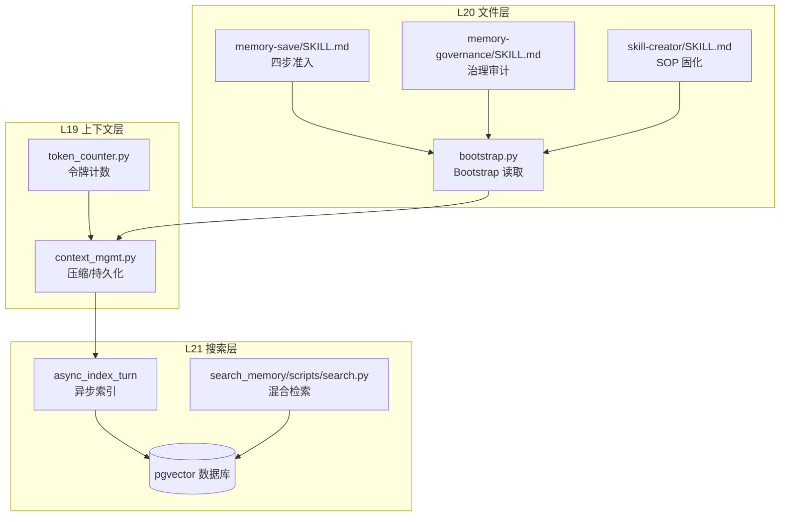
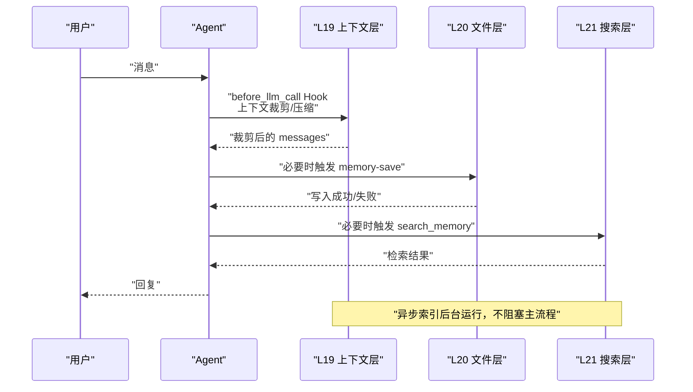
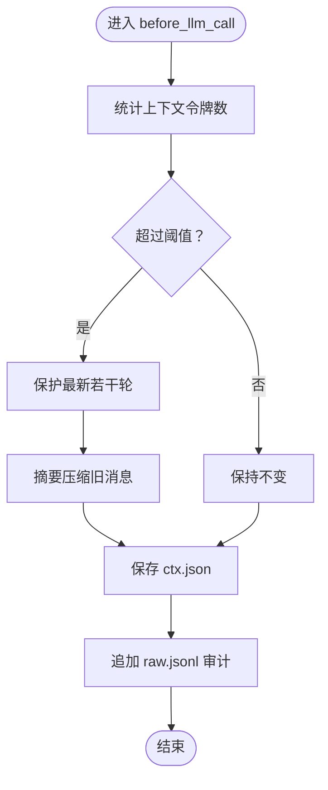
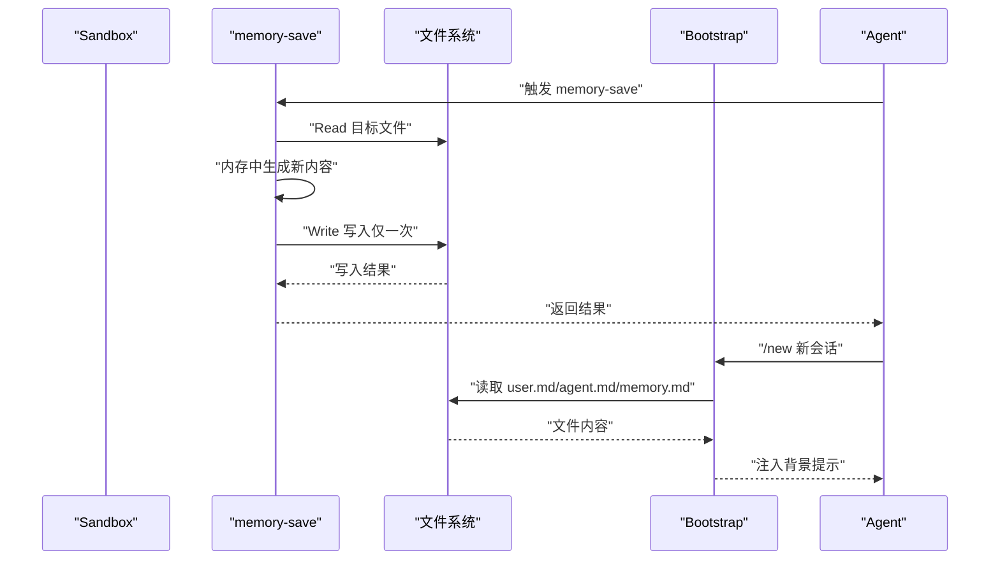
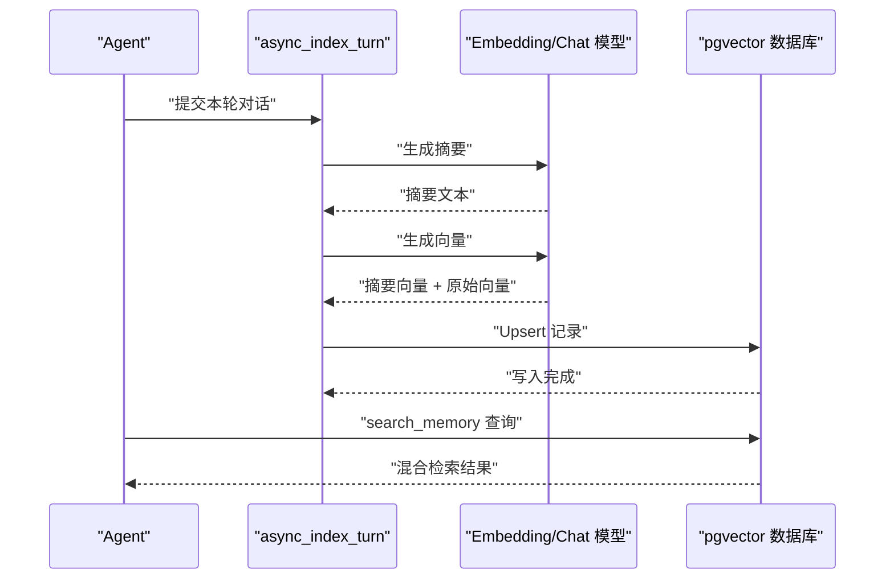
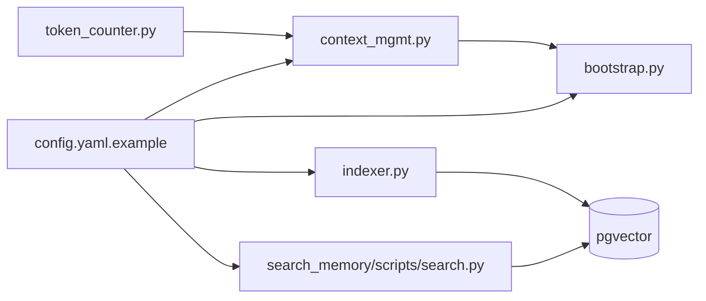

# 三层记忆数据流

<cite>
**本文引用的文件**
- [bootstrap.py](file://xiaopaw/memory/bootstrap.py)
- [context_mgmt.py](file://xiaopaw/memory/context_mgmt.py)
- [indexer.py](file://xiaopaw/memory/indexer.py)
- [config.py](file://xiaopaw/memory/config.py)
- [token_counter.py](file://xiaopaw/memory/token_counter.py)
- [schema.sql](file://schema.sql)
- [load_skills.yaml](file://xiaopaw/skills/load_skills.yaml)
- [memory-save/SKILL.md](file://xiaopaw/skills/memory-save/SKILL.md)
- [search_memory/SKILL.md](file://xiaopaw/skills/search_memory/SKILL.md)
- [search_memory/scripts/search.py](file://xiaopaw/skills/search_memory/scripts/search.py)
- [memory-governance/SKILL.md](file://xiaopaw/skills/memory-governance/SKILL.md)
- [skill-creator/SKILL.md](file://xiaopaw/skills/skill-creator/SKILL.md)
- [config.yaml.example](file://config.yaml.example)
- [test_e2e_04_bootstrap.py](file://tests/e2e/test_e2e_04_bootstrap.py)
- [test_e2e_07_memory_save.py](file://tests/e2e/test_e2e_07_memory_save.py)
- [test_e2e_08_search_memory.py](file://tests/e2e/test_e2e_08_search_memory.py)
</cite>

## 目录
1. [简介](#简介)
2. [项目结构](#项目结构)
3. [核心组件](#核心组件)
4. [架构总览](#架构总览)
5. [详细组件分析](#详细组件分析)
6. [依赖关系分析](#依赖关系分析)
7. [性能考量](#性能考量)
8. [故障排查指南](#故障排查指南)
9. [结论](#结论)
10. [附录](#附录)

## 简介
本文件系统化阐述 XiaoPaw v2 的三层记忆数据流架构：L19 上下文层（单轮内）、L20 文件层（跨轮持久化）、L21 搜索层（跨 session 海量）。围绕 Bootstrap 读取、before_llm_call Hook、ctx.json 压缩快照、raw.jsonl 审计日志、memory-save Skill 四信号准入、skill-creator SOP 固化、memory-governance 审计、async_index_turn 异步索引、extract_summary_and_tags 提取、embed_texts 向量化、pgvector 内存存储等关键流程，给出数据流转过程、隔离规则与安全策略。

## 项目结构
三层记忆相关的关键模块分布如下：
- L19 上下文层：会话内上下文管理、压缩与持久化
- L20 文件层：Bootstrap 初始化、memory-save 写入、跨轮持久化
- L21 搜索层：异步索引、向量化、pgvector 检索

图表来源
- [context_mgmt.py:1-99](file://xiaopaw/memory/context_mgmt.py#L1-L99)
- [token_counter.py:1-44](file://xiaopaw/memory/token_counter.py#L1-L44)
- [bootstrap.py:1-37](file://xiaopaw/memory/bootstrap.py#L1-L37)
- [memory-save/SKILL.md:1-98](file://xiaopaw/skills/memory-save/SKILL.md#L1-L98)
- [memory-governance/SKILL.md:1-225](file://xiaopaw/skills/memory-governance/SKILL.md#L1-L225)
- [skill-creator/SKILL.md:1-157](file://xiaopaw/skills/skill-creator/SKILL.md#L1-L157)
- [indexer.py:1-96](file://xiaopaw/memory/indexer.py#L1-L96)
- [search_memory/scripts/search.py:1-209](file://xiaopaw/skills/search_memory/scripts/search.py#L1-L209)
- [schema.sql:1-44](file://schema.sql#L1-L44)

章节来源
- [context_mgmt.py:1-99](file://xiaopaw/memory/context_mgmt.py#L1-L99)
- [bootstrap.py:1-37](file://xiaopaw/memory/bootstrap.py#L1-L37)
- [indexer.py:1-96](file://xiaopaw/memory/indexer.py#L1-L96)
- [search_memory/scripts/search.py:1-209](file://xiaopaw/skills/search_memory/scripts/search.py#L1-L209)
- [schema.sql:1-44](file://schema.sql#L1-L44)

## 核心组件
- L19 上下文层：负责单轮内上下文窗口裁剪、压缩与持久化，确保模型输入规模可控。
- L20 文件层：负责跨轮持久化与跨 session 回忆注入，包含 Bootstrap 初始化、memory-save 写入、memory-governance 审计、skill-creator SOP 固化。
- L21 搜索层：负责异步索引、向量化与 pgvector 检索，提供语义与全文混合检索能力。

章节来源
- [context_mgmt.py:1-99](file://xiaopaw/memory/context_mgmt.py#L1-L99)
- [bootstrap.py:1-37](file://xiaopaw/memory/bootstrap.py#L1-L37)
- [indexer.py:1-96](file://xiaopaw/memory/indexer.py#L1-L96)
- [search_memory/scripts/search.py:1-209](file://xiaopaw/skills/search_memory/scripts/search.py#L1-L209)

## 架构总览
三层记忆数据流的总体交互如下：

图表来源
- [context_mgmt.py:1-99](file://xiaopaw/memory/context_mgmt.py#L1-L99)
- [memory-save/SKILL.md:1-98](file://xiaopaw/skills/memory-save/SKILL.md#L1-L98)
- [search_memory/SKILL.md:1-135](file://xiaopaw/skills/search_memory/SKILL.md#L1-L135)
- [indexer.py:1-96](file://xiaopaw/memory/indexer.py#L1-L96)

## 详细组件分析

### L19 上下文层：单轮内控制与持久化
- 上下文裁剪与压缩
  - 基于令牌计数的阈值控制，超过阈值时对旧消息进行摘要压缩，保护最新若干轮对话。
  - 压缩策略避免破坏工具调用配对边界，确保消息对齐。
- 会话上下文持久化
  - 将当前会话的 messages 以 JSON 格式保存为 ctx.json，并以 JSONL 追加 raw.jsonl 作为审计日志。
- 令牌计数策略
  - 优先使用本地分词器估算，降级为粗略估算，保证在缺少依赖时仍可用。

图表来源
- [context_mgmt.py:14-99](file://xiaopaw/memory/context_mgmt.py#L14-L99)
- [token_counter.py:15-44](file://xiaopaw/memory/token_counter.py#L15-L44)

章节来源
- [context_mgmt.py:1-99](file://xiaopaw/memory/context_mgmt.py#L1-L99)
- [token_counter.py:1-44](file://xiaopaw/memory/token_counter.py#L1-L44)

### L20 文件层：跨轮持久化与跨 session 回忆注入
- Bootstrap 初始化
  - 从工作区读取 soul.md、user.md、agent.md、memory.md，构建 LLM 背景提示，其中 memory.md 有硬性行数限制。
- memory-save 四信号准入
  - 严格限制为 1 次 Read + 1 次 Write，禁止替代路径与静默绕过，确保跨 session 可靠召回。
- memory-governance 审计
  - 定期扫描记忆文件与 skills 目录，输出结构化报告，经用户确认后执行清理，防止记忆腐化与技能膨胀。
- skill-creator SOP 固化
  - 将标准化工作流沉淀为可复用技能，统一触发条件与工具约束，避免重复实现。

图表来源
- [memory-save/SKILL.md:1-98](file://xiaopaw/skills/memory-save/SKILL.md#L1-L98)
- [bootstrap.py:20-37](file://xiaopaw/memory/bootstrap.py#L20-L37)
- [test_e2e_07_memory_save.py:35-93](file://tests/e2e/test_e2e_07_memory_save.py#L35-L93)

章节来源
- [bootstrap.py:1-37](file://xiaopaw/memory/bootstrap.py#L1-L37)
- [memory-save/SKILL.md:1-98](file://xiaopaw/skills/memory-save/SKILL.md#L1-L98)
- [memory-governance/SKILL.md:1-225](file://xiaopaw/skills/memory-governance/SKILL.md#L1-L225)
- [skill-creator/SKILL.md:1-157](file://xiaopaw/skills/skill-creator/SKILL.md#L1-L157)
- [test_e2e_07_memory_save.py:1-93](file://tests/e2e/test_e2e_07_memory_save.py#L1-L93)

### L21 搜索层：跨 session 海量检索
- 异步索引与向量化
  - 异步提取摘要、生成向量并写入 pgvector，不阻塞主流程。
- 混合检索策略
  - 向量语义（cosine 距离）×0.7 + 全文 BM25 ×0.3，支持标签过滤、时间范围与路由键隔离。
- 数据库结构与索引
  - 使用 HNSW 向量索引、GIN 全文索引、数组标签索引与路由键索引，支撑高效检索。

图表来源
- [indexer.py:32-96](file://xiaopaw/memory/indexer.py#L32-L96)
- [search_memory/scripts/search.py:58-173](file://xiaopaw/skills/search_memory/scripts/search.py#L58-L173)
- [schema.sql:4-44](file://schema.sql#L4-L44)

章节来源
- [indexer.py:1-96](file://xiaopaw/memory/indexer.py#L1-L96)
- [search_memory/SKILL.md:1-135](file://xiaopaw/skills/search_memory/SKILL.md#L1-L135)
- [search_memory/scripts/search.py:1-209](file://xiaopaw/skills/search_memory/scripts/search.py#L1-L209)
- [schema.sql:1-44](file://schema.sql#L1-L44)

### 三层隔离规则与数据安全策略
- 路由键隔离
  - 每条记忆记录包含 routing_key，检索时可按用户维度隔离，避免跨用户泄露。
- 文件位置合规
  - 记忆文件仅允许位于 /workspace/ 或 /workspace/archive/ 根目录，防止路径漂移。
- 写入路径白名单
  - memory-save 仅允许写入 /workspace/{soul,user,agent}.md 或 /workspace/memory_<name>.md，拒绝替代路径。
- 审计与可追溯
  - raw.jsonl 作为审计日志，结合 Langfuse Trace 追踪端到端流程。
- 治理与清理
  - memory-governance 生成结构化报告，经用户确认后执行清理，降低记忆腐化与安全风险。

章节来源
- [search_memory/SKILL.md:26-47](file://xiaopaw/skills/search_memory/SKILL.md#L26-L47)
- [memory-governance/SKILL.md:58-84](file://xiaopaw/skills/memory-governance/SKILL.md#L58-L84)
- [memory-save/SKILL.md:34-51](file://xiaopaw/skills/memory-save/SKILL.md#L34-L51)
- [test_e2e_08_search_memory.py:33-79](file://tests/e2e/test_e2e_08_search_memory.py#L33-L79)

## 依赖关系分析
- 组件耦合
  - L19 上下文层依赖令牌计数器；L21 搜索层依赖向量化服务与 pgvector 数据库。
- 外部依赖
  - OpenAI 兼容客户端用于摘要与嵌入；PostgreSQL + pgvector 提供向量与全文检索。
- 配置与常量
  - 配置文件定义上下文窗口、压缩阈值、硬性行数限制等关键参数。

图表来源
- [token_counter.py:1-44](file://xiaopaw/memory/token_counter.py#L1-L44)
- [context_mgmt.py:1-99](file://xiaopaw/memory/context_mgmt.py#L1-L99)
- [bootstrap.py:1-37](file://xiaopaw/memory/bootstrap.py#L1-L37)
- [indexer.py:1-96](file://xiaopaw/memory/indexer.py#L1-L96)
- [search_memory/scripts/search.py:1-209](file://xiaopaw/skills/search_memory/scripts/search.py#L1-L209)
- [config.yaml.example:25-31](file://config.yaml.example#L25-L31)

章节来源
- [config.yaml.example:1-90](file://config.yaml.example#L1-L90)
- [config.py:1-5](file://xiaopaw/memory/config.py#L1-L5)

## 性能考量
- 令牌计数降级策略：在缺少分词器时采用粗略估算，保障稳定性。
- 压缩阈值与窗口大小：通过配置项控制压缩触发时机与保留轮次，平衡上下文质量与成本。
- 检索混合权重：向量与全文权重 0.7:0.3，兼顾语义与精确匹配，减少回召回开销。
- 异步索引：索引写入与主流程解耦，避免延迟放大。

## 故障排查指南
- 上下文过大
  - 现象：模型报错或响应异常缓慢。
  - 排查：确认压缩阈值与保留轮次配置，检查 raw.jsonl 是否频繁触发压缩。
- 写入失败
  - 现象：memory-save 返回失败。
  - 排查：确认写入路径是否在白名单内，检查文件系统权限与只读状态。
- 检索无结果
  - 现象：search_memory 未命中或命中率低。
  - 排查：确认索引是否完成、向量维度与模型一致、标签与时间范围设置是否过严。
- 跨 session 未召回
  - 现象：/new 后记忆未注入。
  - 排查：确认 Bootstrap 是否读取到目标文件，memory.md 行数是否超过硬性限制。

章节来源
- [memory-save/SKILL.md:37-51](file://xiaopaw/skills/memory-save/SKILL.md#L37-L51)
- [search_memory/SKILL.md:129-133](file://xiaopaw/skills/search_memory/SKILL.md#L129-L133)
- [bootstrap.py:27-35](file://xiaopaw/memory/bootstrap.py#L27-L35)
- [test_e2e_08_search_memory.py:65-75](file://tests/e2e/test_e2e_08_search_memory.py#L65-L75)

## 结论
XiaoPaw v2 的三层记忆数据流通过 L19 上下文层的实时控制、L20 文件层的可靠持久化与治理、L21 搜索层的异步索引与混合检索，实现了从单轮到跨 session 的完整记忆闭环。严格的准入与隔离规则、审计与治理机制，有效降低了记忆腐化与安全风险，满足生产级稳定性与可运维性要求。

## 附录
- 配置要点
  - 上下文窗口、压缩阈值、硬性行数限制等参数集中于配置文件，便于统一治理。
- 测试验证
  - E2E 测试覆盖 Bootstrap、memory-save 与 search_memory 的关键路径，确保端到端可用性。

章节来源
- [config.yaml.example:25-31](file://config.yaml.example#L25-L31)
- [test_e2e_04_bootstrap.py:1-69](file://tests/e2e/test_e2e_04_bootstrap.py#L1-L69)
- [test_e2e_07_memory_save.py:1-93](file://tests/e2e/test_e2e_07_memory_save.py#L1-L93)
- [test_e2e_08_search_memory.py:1-79](file://tests/e2e/test_e2e_08_search_memory.py#L1-L79)