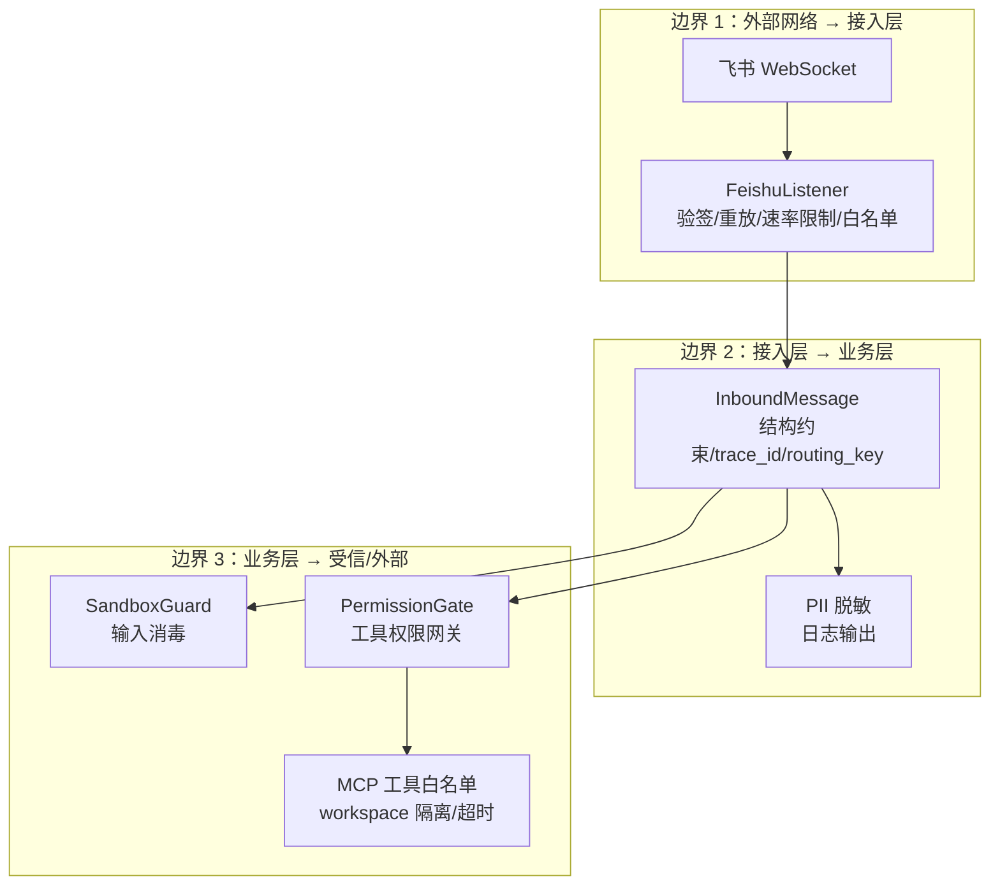
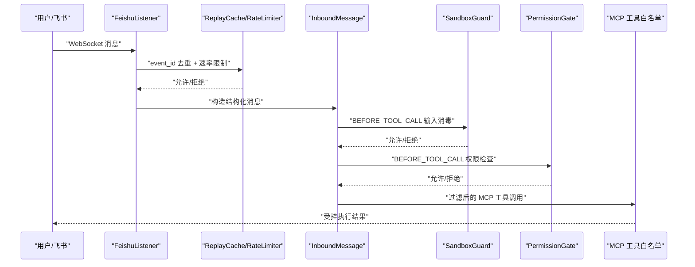
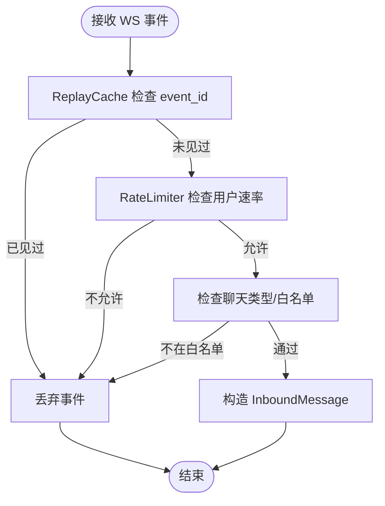
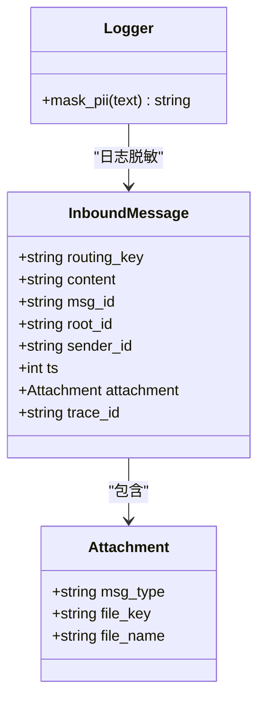
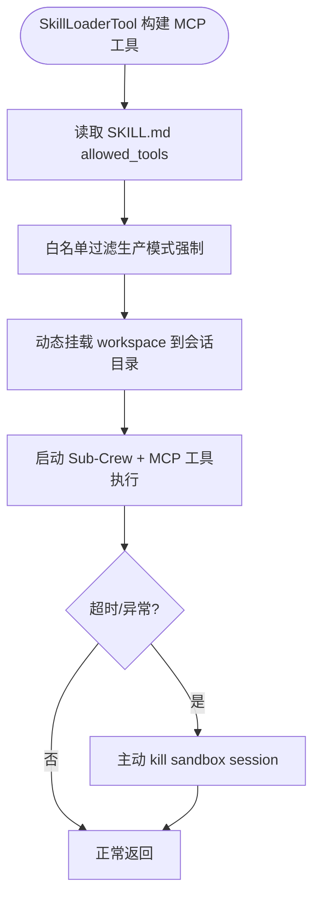
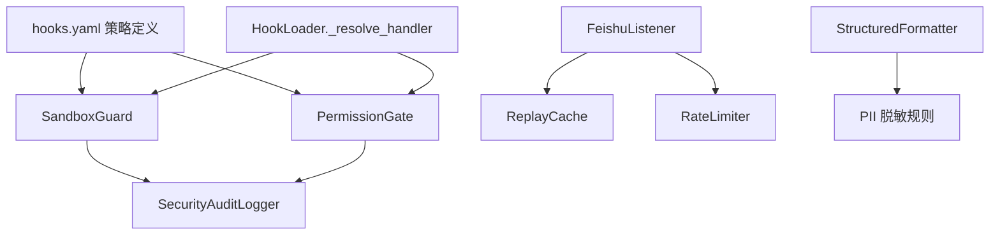

# 信任边界

<cite>
**本文引用的文件**
- [listener.py](file://xiaopaw/feishu/listener.py)
- [security.py](file://xiaopaw/observability/security.py)
- [models.py](file://xiaopaw/models.py)
- [session_key.py](file://xiaopaw/feishu/session_key.py)
- [permission_gate.py](file://shared_hooks/permission_gate.py)
- [sandbox_guard.py](file://shared_hooks/sandbox_guard.py)
- [hooks.yaml](file://shared_hooks/hooks.yaml)
- [logging_config.py](file://xiaopaw/observability/logging_config.py)
- [pii_mask.py](file://xiaopaw/observability/pii_mask.py)
- [07-security.md](file://docs/07-security.md)
- [04-api.md](file://docs/04-api.md)
- [12-hook-hardening.md](file://docs/12-hook-hardening.md)
- [test_permission_gate.py](file://tests/unit/shared_hooks/test_permission_gate.py)
- [test_sandbox_guard.py](file://tests/unit/shared_hooks/test_sandbox_guard.py)
- [security_policy_samples.py](file://tests/fixtures/security_policy_samples.py)
- [loader.py](file://xiaopaw/hook_framework/loader.py)
</cite>

## 目录
1. [引言](#引言)
2. [项目结构](#项目结构)
3. [核心组件](#核心组件)
4. [架构总览](#架构总览)
5. [详细组件分析](#详细组件分析)
6. [依赖分析](#依赖分析)
7. [性能考虑](#性能考虑)
8. [故障排查指南](#故障排查指南)
9. [结论](#结论)
10. [附录](#附录)

## 引言
本文面向 XiaoPaw v2 的安全架构，围绕“三层信任边界”进行系统化梳理与落地说明。目标是帮助安全与工程人员理解边界划分、关键控制点、实现方式与防护效果，并提供可操作的安全配置示例与最佳实践。

## 项目结构
XiaoPaw v2 的安全控制横跨三层边界：
- 边界 1：外部网络 → Semi-Trusted 接入层（飞书 WebSocket → FeishuListener）
- 边界 2：接入层 → Business 层（InboundMessage 结构约束、PII 脱敏、路径安全）
- 边界 3：Business 层 → Trusted/External 层（MCP 工具白名单、DB 权限最小化、workspace 路径隔离）

**图表来源**
- [listener.py:21-148](file://xiaopaw/feishu/listener.py#L21-L148)
- [models.py:17-28](file://xiaopaw/models.py#L17-L28)
- [logging_config.py:15-38](file://xiaopaw/observability/logging_config.py#L15-L38)
- [sandbox_guard.py:93-146](file://shared_hooks/sandbox_guard.py#L93-L146)
- [permission_gate.py:32-107](file://shared_hooks/permission_gate.py#L32-L107)
- [04-api.md:614-665](file://docs/04-api.md#L614-L665)

**章节来源**
- [listener.py:21-148](file://xiaopaw/feishu/listener.py#L21-L148)
- [models.py:17-28](file://xiaopaw/models.py#L17-L28)
- [07-security.md:108-149](file://docs/07-security.md#L108-L149)

## 核心组件
- 接入层组件
  - FeishuListener：负责飞书 WebSocket 事件接入，内置重放防护、速率限制与聊天白名单控制。
  - ReplayCache/RateLimiter：应用层去重与滑动窗口限流。
  - InboundMessage：内部生成的结构化消息体，字段不可被外部覆盖。
  - 日志与 PII 脱敏：结构化日志格式化器与 PII 脱敏规则。
- 业务层组件
  - SandboxGuard：前置输入消毒，阻断路径穿越、危险命令、Shell 注入、Prompt 注入等。
  - PermissionGate：工具权限矩阵，支持 deny/warn/allow 三级策略与默认 deny 原则。
  - Hook 框架：hooks.yaml 定义策略层挂载点，依赖注入共享审计日志器。
- 受信/外部层组件
  - MCP 工具白名单：基于技能声明的 allowed_tools 过滤，生产模式强制启用。
  - workspace 路径隔离：容器内精确挂载到会话目录，结合路径越界检查。
  - PostgreSQL 权限最小化：独立用户、表级权限与 routing_key 强隔离。

**章节来源**
- [security.py:11-73](file://xiaopaw/observability/security.py#L11-L73)
- [models.py:17-28](file://xiaopaw/models.py#L17-L28)
- [logging_config.py:15-38](file://xiaopaw/observability/logging_config.py#L15-L38)
- [sandbox_guard.py:93-146](file://shared_hooks/sandbox_guard.py#L93-L146)
- [permission_gate.py:32-107](file://shared_hooks/permission_gate.py#L32-L107)
- [hooks.yaml:28-73](file://shared_hooks/hooks.yaml#L28-L73)
- [04-api.md:614-665](file://docs/04-api.md#L614-L665)

## 架构总览
三层信任边界的数据流与控制要点如下：

**图表来源**
- [listener.py:81-148](file://xiaopaw/feishu/listener.py#L81-L148)
- [security.py:47-73](file://xiaopaw/observability/security.py#L47-L73)
- [sandbox_guard.py:109-146](file://shared_hooks/sandbox_guard.py#L109-L146)
- [permission_gate.py:57-94](file://shared_hooks/permission_gate.py#L57-L94)
- [04-api.md:622-632](file://docs/04-api.md#L622-L632)

## 详细组件分析

### 边界 1：飞书 Webhook → FeishuListener（验签、重放防护、速率限制、白名单）
- 安全目标
  - 防止重放攻击与消息洪水，降低重复处理与资源滥用风险。
  - 限制非授权聊天通道的消息进入业务层。
- 实现方式
  - 飞书服务端在 WebSocket 握手阶段完成身份验签，应用层无需 HMAC 校验。
  - 应用层通过 ReplayCache 对 event_id 进行 LRU + TTL 去重。
  - RateLimiter 基于用户维度的滑动窗口进行速率限制。
  - 允许聊天类型限定：仅允许 p2p 或白名单内的群组聊天。
- 防护效果
  - 有效阻断 SDK 重连抖动或代理重试导致的重复事件。
  - 限制单用户消息速率，缓解 DoS 风险。
  - 通过聊天白名单缩小潜在攻击面。

**图表来源**
- [listener.py:81-105](file://xiaopaw/feishu/listener.py#L81-L105)
- [security.py:47-73](file://xiaopaw/observability/security.py#L47-L73)

**章节来源**
- [listener.py:21-148](file://xiaopaw/feishu/listener.py#L21-L148)
- [security.py:11-73](file://xiaopaw/observability/security.py#L11-L73)
- [07-security.md:416-539](file://docs/07-security.md#L416-L539)

### 边界 2：InboundMessage 结构约束（内部生成机制、PII 脱敏、路径安全）
- 安全目标
  - 确保路由键、trace_id 等关键字段不可被外部覆盖，防止路由欺骗与追踪混淆。
  - 在日志输出中对 PII 进行脱敏，降低敏感信息泄露风险。
- 实现方式
  - InboundMessage 由 FeishuListener 内部构造，字段来源于飞书事件解析，trace_id 与 routing_key 由内部生成。
  - StructuredFormatter 在日志输出时调用 PII 脱敏规则，屏蔽手机号、邮箱、身份证号等。
  - 路由键解析与类型判定由 resolve_routing_key 提供，避免伪造。
- 防护效果
  - 有效阻断外部对内部路由与追踪标识的篡改。
  - 降低日志中敏感信息泄露概率，满足可观测性与隐私保护双重要求。

**图表来源**
- [models.py:17-28](file://xiaopaw/models.py#L17-L28)
- [logging_config.py:15-38](file://xiaopaw/observability/logging_config.py#L15-L38)
- [pii_mask.py:14-18](file://xiaopaw/observability/pii_mask.py#L14-L18)
- [session_key.py:6-21](file://xiaopaw/feishu/session_key.py#L6-L21)

**章节来源**
- [models.py:17-28](file://xiaopaw/models.py#L17-L28)
- [logging_config.py:15-38](file://xiaopaw/observability/logging_config.py#L15-L38)
- [pii_mask.py:14-18](file://xiaopaw/observability/pii_mask.py#L14-L18)
- [session_key.py:6-21](file://xiaopaw/feishu/session_key.py#L6-L21)

### 边界 3：MCP 工具白名单（受控执行、DB 权限最小化、workspace 路径隔离）
- 安全目标
  - 限制 Sub-Crew 可用工具集，避免越权或意外执行高危操作。
  - 通过数据库最小权限与强隔离，防止跨用户数据泄露。
  - 通过 workspace 精确挂载与路径越界检查，防止容器逃逸与任意文件读写。
- 实现方式
  - 基于技能声明的 allowed_tools 过滤，生产模式强制启用白名单。
  - 容器内通过 seccomp 与 capability 限制，挂载精确到会话目录。
  - workspace 路径越界检查，确保所有文件操作落在限定范围内。
  - PostgreSQL 使用独立用户与表级权限，结合 routing_key 强隔离。
- 防护效果
  - 有效降低 Prompt Injection 与工具误用导致的宿主机逃逸风险。
  - 降低跨用户数据访问与写入风险，保障租户隔离。
  - 通过超时与主动 kill 机制，避免僵尸进程与资源泄漏。

**图表来源**
- [04-api.md:622-632](file://docs/04-api.md#L622-L632)
- [04-api.md:633-644](file://docs/04-api.md#L633-L644)
- [04-api.md:645-662](file://docs/04-api.md#L645-L662)

**章节来源**
- [04-api.md:614-665](file://docs/04-api.md#L614-L665)
- [07-security.md:183-290](file://docs/07-security.md#L183-L290)

## 依赖分析
- 策略层挂载与依赖注入
  - hooks.yaml 定义了策略层的执行顺序与依赖关系，SandboxGuard 与 PermissionGate 共享审计日志器实例。
  - HookLoader 对处理器模块路径进行相对路径校验，防止路径穿越加载非法模块。
- 关键依赖链
  - FeishuListener 依赖 ReplayCache 与 RateLimiter 进行去重与限流。
  - InboundMessage 依赖 session_key 生成 routing_key，日志系统依赖 PII 脱敏规则。
  - 策略层（SandboxGuard/PermissionGate）依赖共享审计日志器进行事件记录与统计。

**图表来源**
- [hooks.yaml:28-73](file://shared_hooks/hooks.yaml#L28-L73)
- [loader.py:156-184](file://xiaopaw/hook_framework/loader.py#L156-L184)
- [listener.py:21-41](file://xiaopaw/feishu/listener.py#L21-L41)
- [logging_config.py:15-38](file://xiaopaw/observability/logging_config.py#L15-L38)
- [pii_mask.py:14-18](file://xiaopaw/observability/pii_mask.py#L14-L18)

**章节来源**
- [hooks.yaml:28-73](file://shared_hooks/hooks.yaml#L28-L73)
- [loader.py:156-184](file://xiaopaw/hook_framework/loader.py#L156-L184)
- [listener.py:21-41](file://xiaopaw/feishu/listener.py#L21-L41)
- [logging_config.py:15-38](file://xiaopaw/observability/logging_config.py#L15-L38)

## 性能考虑
- 输入消毒与 URL 解码
  - SandboxGuard 对输入进行 NFKC 归一化与最多 3 轮 URL 解码，平衡安全性与性能。
- 速率限制与去重
  - RateLimiter 使用滑动窗口，内存占用与计算开销可控；ReplayCache 使用 LRU + TTL，避免无限增长。
- 日志输出
  - 结构化日志与 PII 脱敏在输出阶段一次性处理，避免在业务路径中重复计算。

**章节来源**
- [sandbox_guard.py:65-91](file://shared_hooks/sandbox_guard.py#L65-L91)
- [security.py:11-27](file://xiaopaw/observability/security.py#L11-L27)
- [security.py:47-73](file://xiaopaw/observability/security.py#L47-L73)
- [logging_config.py:15-38](file://xiaopaw/observability/logging_config.py#L15-L38)

## 故障排查指南
- 飞书重放与限流
  - 现象：重复消息或被限流。
  - 排查：检查 ReplayCache 是否命中、RateLimiter 是否超过阈值；确认 event_id 与用户维度。
- 工具权限策略
  - 现象：工具被拒绝或记录“默认策略”。
  - 排查：确认 security.yaml 中 permissions.default 与 tools 配置；查看决策记录与审计日志。
- 输入消毒告警
  - 现象：出现路径穿越、危险命令、Shell 注入或 Prompt 注入告警。
  - 排查：检查输入是否经过 URL 编码绕过；确认沙箱工具命名是否符合豁免规则。
- workspace 路径越界
  - 现象：文件操作失败或被拒绝。
  - 排查：确认挂载路径是否精确到会话目录；检查路径越界检查逻辑。

**章节来源**
- [listener.py:81-105](file://xiaopaw/feishu/listener.py#L81-L105)
- [security.py:47-73](file://xiaopaw/observability/security.py#L47-L73)
- [permission_gate.py:57-94](file://shared_hooks/permission_gate.py#L57-L94)
- [sandbox_guard.py:109-146](file://shared_hooks/sandbox_guard.py#L109-L146)
- [04-api.md:633-644](file://docs/04-api.md#L633-L644)

## 结论
XiaoPaw v2 通过三层信任边界与多层安全控制，有效降低了来自外部接入、内部数据流与外部执行的多种风险。边界 1 侧重接入层的去重、限流与白名单；边界 2 强化结构化消息与日志脱敏；边界 3 则通过 MCP 白名单、数据库最小权限与 workspace 路径隔离实现受控执行与租户隔离。配合 hooks.yaml 的策略层挂载与审计日志，系统在安全与可用性之间取得平衡。

## 附录

### 安全配置示例与最佳实践
- 飞书接入层
  - 启用 ReplayCache 与 RateLimiter，设置 per_user_per_minute 合理阈值。
  - 配置 allowed_chats 仅允许 p2p 或特定群组。
- 工具权限策略
  - permissions.default 设为 deny 或 warn，避免默认 allow。
  - 为高风险工具（如 shell_executor）显式声明 deny。
- 输入消毒
  - 确保输入预处理（NFKC + 多轮 URL 解码）生效；对沙箱工具的合法 shell 操作保持豁免。
- MCP 工具白名单
  - 在 SKILL.md 中明确 allowed_tools；生产模式强制启用白名单过滤。
  - 容器内启用 seccomp 与 capability 限制；挂载精确到会话目录。
- 数据库与 workspace
  - 使用独立 DB 用户与表级权限；结合 routing_key 强隔离。
  - workspace 路径越界检查与 resolve() 校验，防止任意文件读写。

**章节来源**
- [security_policy_samples.py:3-25](file://tests/fixtures/security_policy_samples.py#L3-L25)
- [test_permission_gate.py:34-51](file://tests/unit/shared_hooks/test_permission_gate.py#L34-L51)
- [test_sandbox_guard.py:156-191](file://tests/unit/shared_hooks/test_sandbox_guard.py#L156-L191)
- [07-security.md:183-290](file://docs/07-security.md#L183-L290)
- [04-api.md:614-665](file://docs/04-api.md#L614-L665)