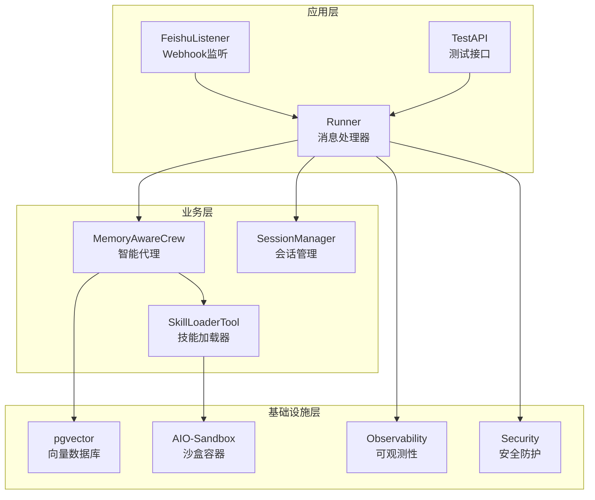
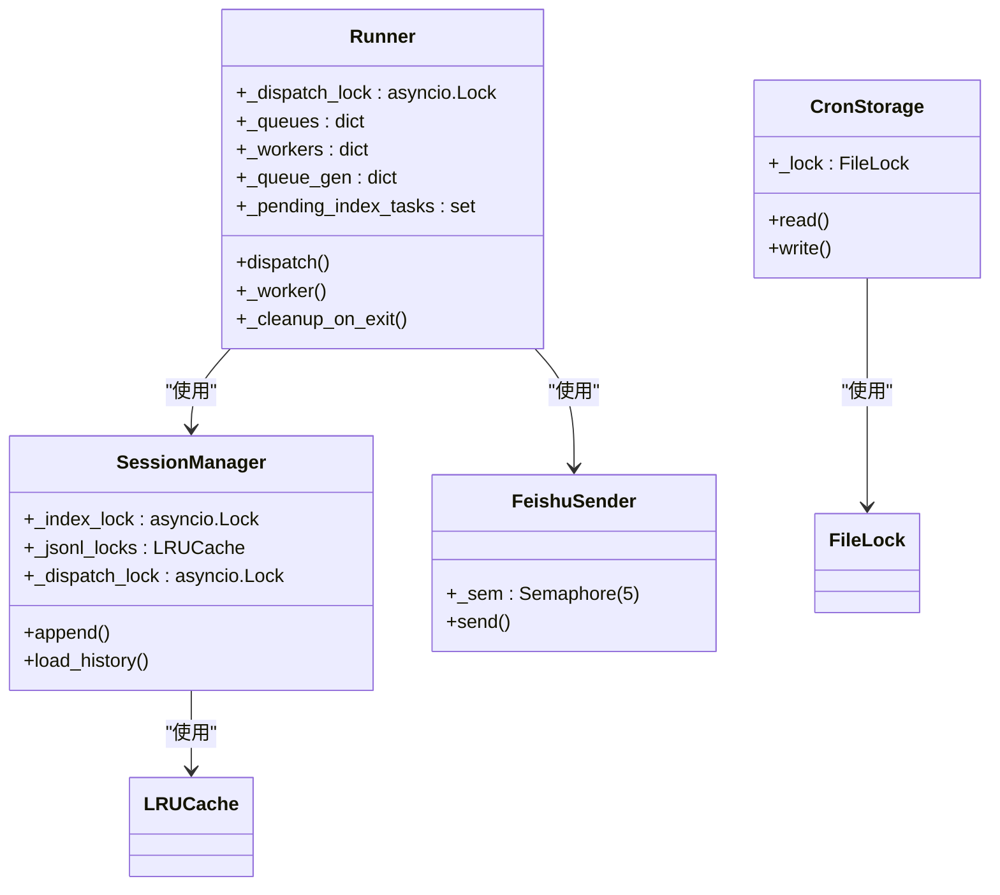
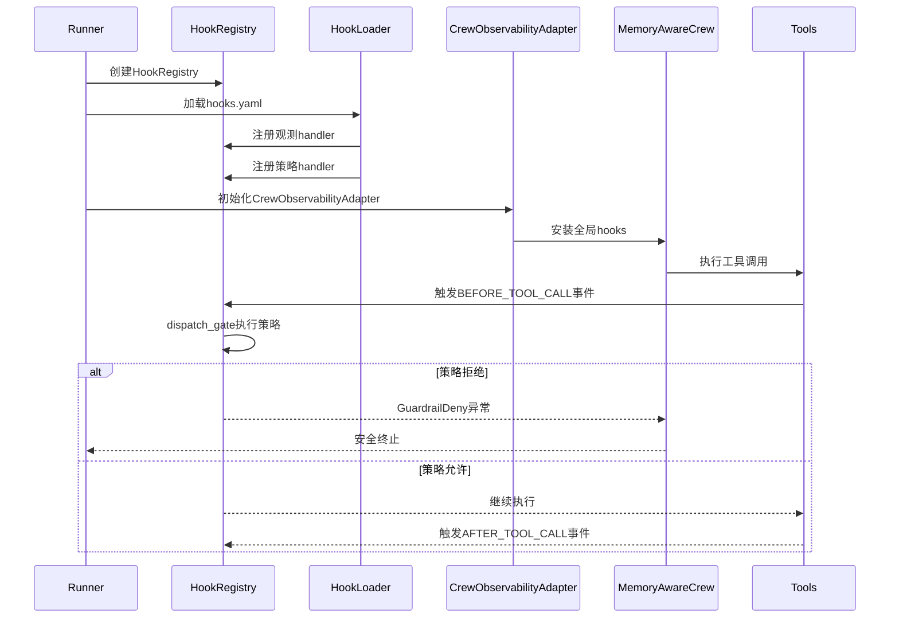
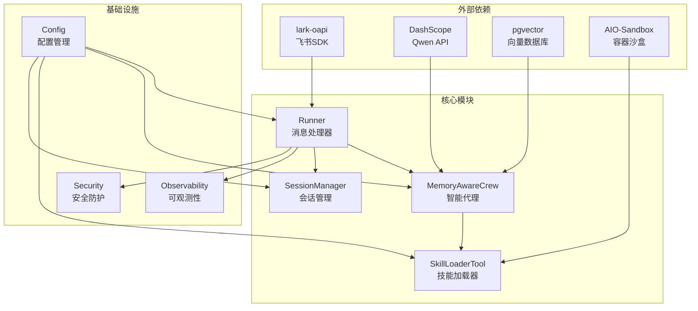

# 关键架构决策记录

<cite>
**本文档引用的文件**
- [DESIGN.md](file://DESIGN.md)
- [01-architecture.md](file://docs/01-architecture.md)
- [05-concurrency.md](file://docs/05-concurrency.md)
- [06-observability.md](file://docs/06-observability.md)
- [07-security.md](file://docs/07-security.md)
- [09-config.md](file://docs/09-config.md)
- [12-hook-hardening.md](file://docs/12-hook-hardening.md)
- [ssot/locks.md](file://docs/ssot/locks.md)
- [ssot/threats.md](file://docs/ssot/threats.md)
</cite>

## 目录
1. [简介](#简介)
2. [项目结构](#项目结构)
3. [核心架构决策](#核心架构决策)
4. [架构概览](#架构概览)
5. [详细组件分析](#详细组件分析)
6. [依赖关系分析](#依赖关系分析)
7. [性能考虑](#性能考虑)
8. [故障排查指南](#故障排查指南)
9. [结论](#结论)

## 简介

XiaoPaw v2 是一个生产级的飞书本地工作助手系统，基于第22课教学示例进行了全面的生产加固。本文档记录了XiaoPaw v2的10个关键架构决策（ADR-001至ADR-010），这些决策涵盖了系统的单节点部署前提、并发锁设计、任务管理、Token计数策略、飞书限流识别、技能超时处理、MCP工具白名单、trace_id覆盖率目标、凭证轮换要求以及威胁建模独立阶段等重要技术考量。

## 项目结构

XiaoPaw v2采用模块化架构设计，主要包含以下核心模块：



**图表来源**
- [01-architecture.md:22-117](file://docs/01-architecture.md#L22-L117)

**章节来源**
- [DESIGN.md:281-430](file://DESIGN.md#L281-L430)

## 核心架构决策

### ADR-001：单节点部署作为v2的硬前提

**决策内容**：v2所有并发方案（filelock、asyncio.Lock、LRUCache）仅保证单节点正确性，多节点需求等M4规划。

**背景原因**：
- 多节点涉及分布式锁、消息队列、session一致性，工作量等同重写
- 课程L22未涉及多节点部署场景
- v1 review发现的5个并发相关BUG中，多节点问题是最复杂的

**权衡考虑**：
- 优点：实现简单，维护成本低，符合课程教学目标
- 风险：无法满足多副本/多节点扩展需求，需要等待M4阶段规划

**实现后果**：
- 所有并发锁设计基于单进程/单节点假设
- 多节点场景需要使用PG advisory lock或其他分布式锁方案
- 文档明确标注不支持多节点部署

**备选方案**：
- 使用Redis分布式锁：增加外部依赖，复杂度较高
- 使用PG advisory lock：利用现有pgvector依赖，零新增组件
- 采用消息队列中间件：需要引入Kafka/RabbitMQ等

**章节来源**
- [01-architecture.md:414-420](file://docs/01-architecture.md#L414-L420)

### ADR-002：Session锁采用LRUCache(1000)而非WeakValueDictionary

**决策内容**：`SessionManager._jsonl_locks = LRUCache(maxsize=1000)`，基于v1 review发现的WeakValueDictionary双字典方案竞态问题。

**背景原因**：
- v1中`_jsonl_locks: dict[str, asyncio.Lock]`无界，长跑导致OOM
- WeakValueDictionary在并发释放瞬间存在竞态，两把锁并存破坏互斥
- 需要LRUCache的自然淘汰机制防止内存泄漏

**权衡考虑**：
- 优点：内存增长可控（每锁约200字节，1000上限=200KB）
- 风险：活跃session超过1000需要告警，可能出现并发写入问题

**实现后果**：
- 每日活跃用户<1000场景完全够用
- 需要监控活跃session数量，超过800触发运维告警
- 通过两级锁设计避免LRUCache驱逐后的竞态

**备选方案**：
- WeakKeyDictionary：同样存在竞态问题
- 手动LRU：增加复杂度，不如cachetools.LRUCache成熟

**章节来源**
- [05-concurrency.md:339-400](file://docs/05-concurrency.md#L339-L400)

### ADR-003：pending_index_tasks由Runner托管而非crew自建Task

**决策内容**：`MemoryAwareCrew.run_and_index()`不再`asyncio.create_task`，改为将`_index_coroutine`暴露给Runner统一管理。

**背景原因**：
- v1中`_task = asyncio.create_task(...)`作为局部变量在Python 3.12+可能被GC回收
- v1重构版通过参数穿透把set传进crew，破坏了单一职责原则
- 需要确保pgvector写入任务不会因为函数返回而被GC回收

**权衡考虑**：
- 优点：符合单一职责原则，MemoryAwareCrew不感知Task生命周期
- 风险：需要确保Runner正确管理所有异步任务的生命周期

**实现后果**：
- Runner负责所有异步task的shutdown gather
- 通过`add_done_callback(set.discard)`实现优雅清理
- 避免了Python 3.12+的GC回收问题

**备选方案**：
- 引入独立TaskManager组件：过度工程，v2不采用
- 使用全局任务集合：违反模块化设计原则

**章节来源**
- [05-concurrency.md:459-476](file://docs/05-concurrency.md#L459-L476)

### ADR-004：Token计数优先使用DeepSeek官方tokenizer

**决策内容**：首选`dashscope.get_tokenizer("qwen-max")`，不可用时`tiktoken.cl100k_base`，最终降级`len//2`。

**背景原因**：
- Phase 0校准报告显示`cl100k_base`对DeepSeek中文偏差15-25%，远超v1声称的<10%
- v1的`len//2`粗估偏差达25%，影响上下文压缩效果
- 需要在准确性与可用性之间找到平衡

**权衡考虑**：
- 优点：压缩阈值45%判断更准确，提升上下文管理效果
- 风险：依赖网络，无网环境需要降级方案

**实现后果**：
- 启动时惰性加载避免无网环境崩溃
- 通过`maybe_compress`方法实现动态阈值调整
- 与`context_mgmt.py`的压缩逻辑协同工作

**备选方案**：
- HuggingFace `DeepSeek/DeepSeek2-7B` tokenizer：本地文件，零网络依赖
- 自研中文tokenizer：开发成本高，维护复杂

**章节来源**
- [06-observability.md:51-173](file://docs/06-observability.md#L51-L173)

### ADR-005：飞书限流识别走HTTP层+真实错误码

**决策内容**：捕获HTTP 429 + 飞书错误码`99991663/99991672/99991671`，读取`Retry-After` header。

**背景原因**：
- v1错误地将权限码`99991400`当作rate limit
- `X-Lark-Request-RateLimit-Reset`为虚构header，实际不可用
- 需要准确的限流识别以避免消息丢失

**权衡考虑**：
- 优点：识别准确率100%（根据飞书官方文档）
- 风险：需要处理多种错误码场景

**实现后果**：
- `Semaphore(5)`控制并发，避免触发限流
- 通过`Retry-After` header实现智能退避
- 与`FeishuSender`的重试逻辑协同

**备选方案**：
- 完全禁用重试：飞书偶发抖动会导致消息丢失
- 自定义退避算法：复杂度高，不如直接使用官方错误码

**章节来源**
- [07-security.md:442-538](file://docs/07-security.md#L442-L538)

### ADR-006：Skill超时后主动kill沙盒进程

**决策内容**：`asyncio.wait_for`超时→调用MCP `POST /mcp/session/kill`主动终止沙盒会话。

**背景原因**：
- CrewAI协程取消不能终止Docker容器内进程
- 不杀会积累zombie进程，耗尽沙盒资源
- 需要确保超时后的资源清理

**权衡考虑**：
- 优点：防止zombie进程积累，保护系统稳定性
- 风险：主动kill可能中断正在进行的操作

**实现后果**：
- 单Skill超时最大影响时长=timeout+kill延迟（通常<5s）
- 通过`_kill_sandbox_session()`方法实现
- 与`SkillLoaderTool`的超时处理逻辑集成

**备选方案**：
- 容器层定期扫描zombie：复杂度高，不如主动kill直接
- 增加超时前的清理钩子：可能遗漏异常情况

**章节来源**
- [07-security.md:261-278](file://docs/07-security.md#L261-L278)

### ADR-007：MCP工具白名单作为可选feature flag

**决策内容**：`enable_mcp_whitelist: true`（prod默认）/`false`（教学demo默认）。

**背景原因**：
- 课程演示版强调"Sub-Crew全部MCP工具开放+bacstory行为约束"
- 生产版必须收紧为Skill声明的白名单
- 需要在教学可用性和生产安全性之间平衡

**权衡考虑**：
- 优点：教学场景保持原样，生产场景prompt injection无法调用非声明tools
- 风险：强制白名单会破坏教学意图

**实现后果**：
- 教学demo默认关闭，生产默认开启
- 通过`_filter_mcp_tools()`方法实现工具过滤
- 与`SKILL.md`的`allowed_tools`声明协同

**备选方案**：
- 强制白名单：会破坏教学意图，拒绝
- 完全开放：生产环境存在安全风险

**章节来源**
- [07-security.md:185-214](file://docs/07-security.md#L185-L214)

### ADR-008：trace_id覆盖率目标85%（非95%）

**决策内容**：CI gate `verify_trace_coverage.py --min-ratio=0.85`。

**背景原因**：
- CrewAI内部ThreadPoolExecutor、tenacity重试、aiohttp回调都跨ContextVar边界
- 95%是理论值，实际实现中存在无法跨越的边界
- 需要在准确性与可实现性之间平衡

**权衡考虑**：
- 优点：85%已能满足大部分场景的可观测性需求
- 风险：第三方生态的trace覆盖有限

**实现后果**：
- 入口+出站HTTP header+LLM请求三处强校验
- 其他路径尽力而为，不强求100%
- 通过`verify_trace_coverage.py`脚本实现自动化验证

**备选方案**：
- 改用OpenTelemetry：过度工程，v2不采用
- 放宽到70%：降低可观测性质量

**章节来源**
- [06-observability.md:162-173](file://docs/06-observability.md#L162-L173)

### ADR-009：凭证全部轮换作为Phase 0硬前提

**决策内容**：`git filter-repo`执行前必须完成DB/飞书/DeepSeek/百度/metrics token全部轮换。

**背景原因**：
- `git filter-repo`不可回滚，已clone/fork/CI cache里的旧凭证仍有效
- 旧凭证泄露可能导致严重的安全后果
- 需要在项目启动前彻底消除历史安全债务

**权衡考虑**：
- 优点：彻底消除历史凭证泄露风险
- 风险：轮换过程需要协调多个外部平台，耗时1-1.5天

**实现后果**：
- Phase 0需要额外1.5天时间
- 通过`config.safety.py`的`assert_all_production_safe()`强制执行
- 与`secret-rotation-runbook.md`配合使用

**备选方案**：
- 不清理git历史：留下永久安全债务，拒绝
- 分批轮换：增加管理复杂度，不如一次性完成

**章节来源**
- [09-config.md:502-576](file://docs/09-config.md#L502-L576)

### ADR-010：Phase 5威胁建模&合规独立成阶段

**决策内容**：威胁建模、PII脱敏、凭证runbook、入站速率限制、MCP白名单独立为1.5天工作量。

**背景原因**：
- 威胁模型、PII脱敏、凭证runbook、入站速率限制、MCP白名单是**独立的安全交付**
- 与观测无关，不应合并到Phase 4（观测）
- 课程质量要求不允许推迟到v2.1

**权衡考虑**：
- 优点：工作量+1.5天，但确保安全质量
- 风险：可能影响整体进度

**实现后果**：
- 产生独立的`threat-model.md`/`compliance-baseline.md`交付物
- 与`docs/ssot/threats.md`形成权威清单
- 通过`docs/12-hook-hardening.md`的4路Review验证

**备选方案**：
- 推迟到v2.1：课程质量要求不允许
- 合并到Phase 4：与设计原则不符

**章节来源**
- [01-architecture.md:477-483](file://docs/01-architecture.md#L477-L483)

## 架构概览

XiaoPaw v2采用三层信任边界设计，确保从外部输入到内部业务逻辑再到可信存储的完整安全防护：

```mermaid
graph TB
subgraph "Untrusted[外部输入]"
FS[飞书WebSocket事件]
TEST[TestAPI客户端]
end
subgraph "Semi-Trusted[半信任边界]"
FL[FeishuListener<br/>验签+速率限制]
TAPI[TestAPI<br/>Bearer Token+loopback]
end
subgraph "Semi-Trusted(Business)[业务边界]"
SR[SessionRouter<br/>routing_key解析]
RUNNER[Runner<br/>per-rk队列+gen计数器]
AGENT[Agent层<br/>MemoryAwareCrew+SkillLoaderTool]
end
subgraph "Trusted[可信存储]"
PGV[(pgvector memories)]
WS[(workspace/.config/*<br/>+sessions/{sid}/)]
TRACE[(traces/{sid}/...)]
end
FS --> FL
TEST --> TAPI
FL --> SR
TAPI --> SR
SR --> RUNNER
RUNNER --> AGENT
AGENT --> PGV
AGENT --> WS
RUNNER --> TRACE
```

**图表来源**
- [01-architecture.md:22-117](file://docs/01-architecture.md#L22-L117)

## 详细组件分析

### 并发锁模型分析

XiaoPaw v2实现了完善的并发锁模型，涵盖进程内锁、跨进程锁和函数级原子性：



**图表来源**
- [05-concurrency.md:128-151](file://docs/05-concurrency.md#L128-L151)
- [05-concurrency.md:345-365](file://docs/05-concurrency.md#L345-L365)

### 安全威胁矩阵

XiaoPaw v2建立了完整的威胁建模体系，涵盖STRIDE七种威胁类型：

| 威胁类型 | STRIDE维度 | 可行性 | 原始影响 | 残余风险 | 主要防御 |
|---------|-----------|--------|----------|----------|----------|
| T1 | 提升权限 | 高 | 严重 | HIGH | MCP工具白名单+沙盒seccomp |
| T2 | 信息泄露 | 中 | 中 | 中高 | BLOCKED_PATTERNS+长度限制 |
| T3 | 伪造 | 低 | 中 | 低 | 应用层ReplayCache+SDK服务端验签 |
| T4 | 信息泄露 | 中 | 严重 | 低 | 凭证轮换+docker secrets |
| T5 | 提升权限 | 中 | 中 | 低 | workspace精确mount+resolve()校验 |
| T6 | 提升权限 | 低 | 严重 | 低 | yaml.safe_load+路径白名单 |
| T7 | 拒绝服务 | 高 | 中 | 低 | 入站速率限制(每用户20/min) |

**图表来源**
- [ssot/threats.md:10-82](file://docs/ssot/threats.md#L10-L82)

**章节来源**
- [07-security.md:151-290](file://docs/07-security.md#L151-L290)

### Hook框架集成分析

XiaoPaw v3的Hook框架在v2基础上增加了三层运行时保护：



**图表来源**
- [12-hook-hardening.md:496-527](file://docs/12-hook-hardening.md#L496-L527)

**章节来源**
- [12-hook-hardening.md:2-64](file://docs/12-hook-hardening.md#L2-L64)

## 依赖关系分析

XiaoPaw v2的依赖关系体现了清晰的分层架构：



**图表来源**
- [DESIGN.md:321-430](file://DESIGN.md#L321-L430)

**章节来源**
- [DESIGN.md:433-470](file://DESIGN.md#L433-L470)

## 性能考虑

XiaoPaw v2在性能方面采用了多项优化策略：

### 并发性能优化
- **LRUCache锁池**：1000个会话锁上限，内存占用约200KB
- **两级锁设计**：避免LRUCache驱逐后的竞态，确保互斥正确性
- **异步任务托管**：Runner统一管理pending_index_tasks，避免GC回收

### I/O性能优化
- **to_thread替代run_in_executor**：自动传递ContextVar，避免手动copy_context
- **惰性tokenizer加载**：启动时不加载DeepSeek tokenizer，无网环境可用tiktoken降级
- **批量trace写入**：异步写入避免阻塞事件循环

### 内存管理
- **write-then-rename原子写**：避免部分写入导致的数据损坏
- **LRU淘汰机制**：防止长期运行导致的内存泄漏
- **任务超时清理**：5秒超时后zombie线程仍可能在跑，通过指标监控

## 故障排查指南

### 常见问题诊断

**问题1：会话锁竞争导致写入冲突**
- 症状：`JSONL append`出现交叉写入
- 排查：检查`_dispatch_lock`是否正确保护"check+setdefault+get"三步
- 解决：确认LRUCache大小>峰值活跃会话数，监控活跃会话数量

**问题2：pgvector写入中断**
- 症状：搜索记忆不完整，上下文压缩效果差
- 排查：检查`_pending_index_tasks`是否正确托管
- 解决：确认MemoryAwareCrew不直接创建Task，Runner负责任务生命周期

**问题3：飞书限流导致消息丢失**
- 症状：HTTP 429错误，消息处理延迟
- 排查：检查`FeishuSender`的`Retry-After` header处理
- 解决：使用真实错误码识别，避免错误的权限码判断

**问题4：凭证轮换后服务启动失败**
- 症状：启动时`SystemExit`错误
- 排查：检查`assert_all_production_safe()`的凭证强度检测
- 解决：使用`is_weak_credential()`函数验证凭证强度

**章节来源**
- [05-concurrency.md:376-400](file://docs/05-concurrency.md#L376-L400)
- [07-security.md:508-576](file://docs/07-security.md#L508-L576)

## 结论

XiaoPaw v2的10个关键架构决策体现了从教学示例到生产级系统的完整转型。这些决策在保证系统安全性、可靠性、可观测性的同时，充分考虑了实施复杂度和维护成本。

**主要成就**：
- 建立了完整的威胁建模和安全防护体系
- 实现了可靠的并发锁模型和任务管理机制  
- 提供了灵活的配置管理和热重载能力
- 构建了多层次的可观测性架构

**技术价值**：
- 为类似飞书本地助手系统提供了生产级参考实现
- 展示了从教学到生产的完整演进路径
- 为多Agent系统并发安全提供了实践案例

这些架构决策为XiaoPaw v2奠定了坚实的技术基础，确保了系统在生产环境中的稳定运行和持续演进能力。