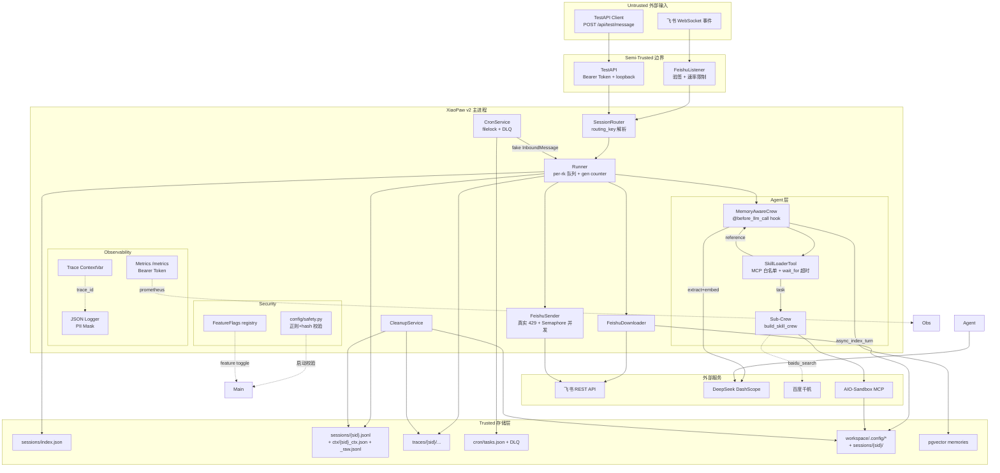
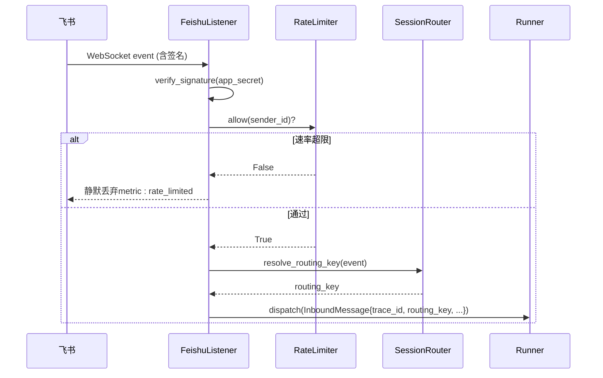
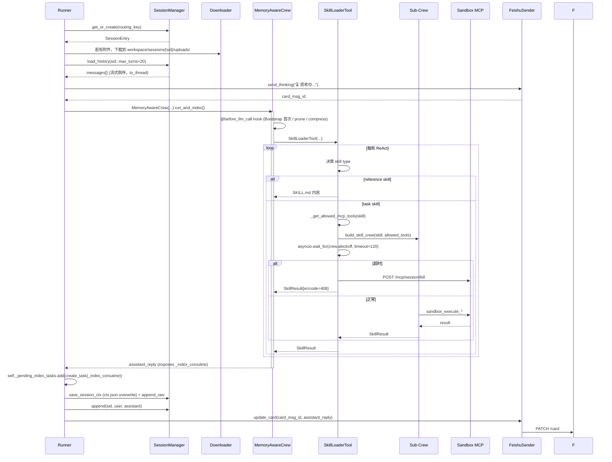
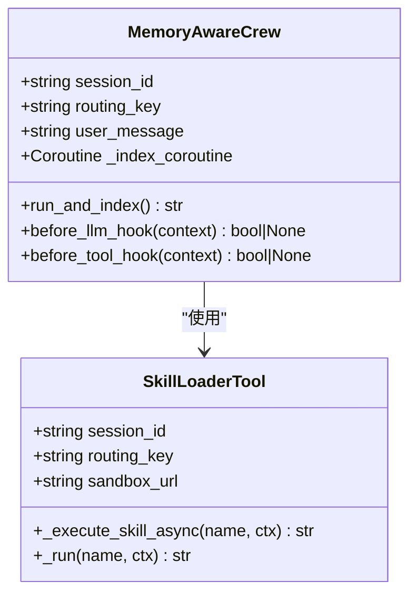
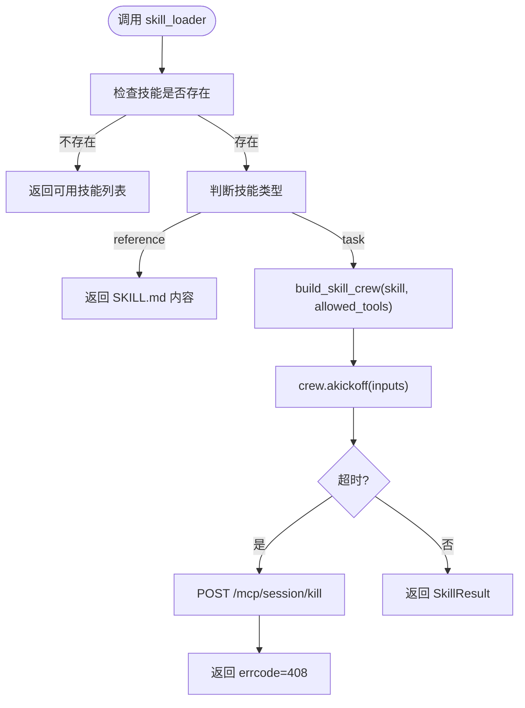
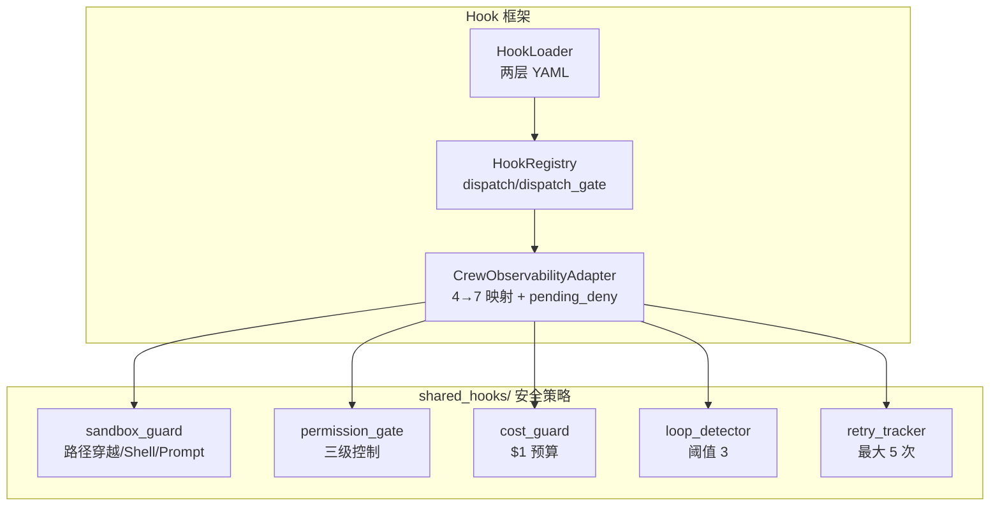
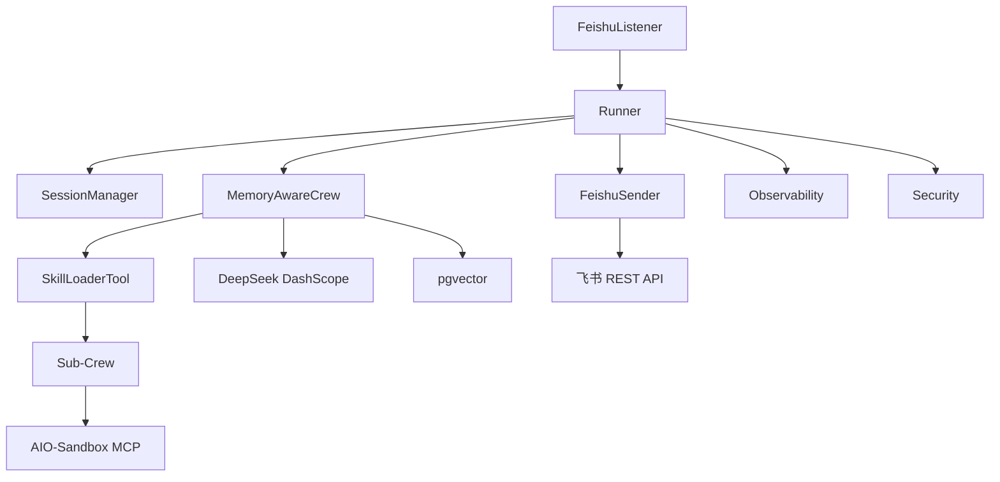

# 整体架构图

<cite>
**本文档引用的文件**
- [01-架构设计.md](file://docs/01-architecture.md)
- [XiaoPaw v2 详细设计文档（总纲）.md](file://DESIGN.md)
- [v1 → v2 迁移指南.md](file://docs/11-migration-v1-to-v2.md)
- [main.py](file://xiaopaw/main.py)
- [runner.py](file://xiaopaw/runner.py)
- [main_crew.py](file://xiaopaw/agents/main_crew.py)
- [skill_loader.py](file://xiaopaw/tools/skill_loader.py)
- [listener.py](file://xiaopaw/feishu/listener.py)
- [manager.py](file://xiaopaw/session/manager.py)
- [trace.py](file://xiaopaw/observability/trace.py)
- [registry.py](file://xiaopaw/hook_framework/registry.py)
- [langfuse_trace.py](file://shared_hooks/langfuse_trace.py)
</cite>

## 目录
1. [简介](#简介)
2. [项目结构](#项目结构)
3. [核心组件](#核心组件)
4. [架构总览](#架构总览)
5. [详细组件分析](#详细组件分析)
6. [依赖关系分析](#依赖关系分析)
7. [性能考量](#性能考量)
8. [故障排查指南](#故障排查指南)
9. [结论](#结论)
10. [附录](#附录)

## 简介
本文件面向 XiaoPaw v2 的整体架构图文档，系统化阐述三层信任边界（Untrusted → Semi-Trusted → Trusted）的划分与职责，以及飞书 WebSocket 事件处理、TestAPI 接口、SessionRouter 路由、Runner 执行引擎、MemoryAwareCrew 智能体、SkillLoaderTool 技能加载、Sub-Crew 容器化执行等核心组件之间的交互关系。文档还展示了数据流向与处理流程，说明系统如何实现安全隔离与可观测性，并总结 v2 相较 v1 的架构改进与新增特性。

## 项目结构
XiaoPaw v2 采用模块化分层设计，围绕“飞书入站事件 → 接入层 → 业务层 → 受信任层”的数据流组织代码。主要模块包括：
- 入口与配置：main.py、config/validator.py、config/safety.py、config/flags.py
- 飞书接入：feishu/listener.py、feishu/sender.py、feishu/session_key.py
- 会话管理：session/manager.py
- 执行引擎：runner.py
- 智能体与记忆：agents/main_crew.py、memory/*
- 技能与工具：tools/skill_loader.py、skills/*
- 可观测性：observability/*、hook_framework/*
- 安全与合规：observability/security.py、observability/pii_mask.py、observability/metrics.py、observability/metrics_server.py
- TestAPI：api/test_server.py、api/capture_sender.py

**图表来源**
- [01-架构设计.md:22-117](file://docs/01-architecture.md#L22-L117)
- [DESIGN.md:281-429](file://DESIGN.md#L281-L429)

**章节来源**
- [01-架构设计.md:20-117](file://docs/01-architecture.md#L20-L117)
- [DESIGN.md:281-429](file://DESIGN.md#L281-L429)

## 核心组件
- **FeishuListener（Semi-Trusted）**：负责飞书 WebSocket 事件的接入，执行验签、速率限制与重放防护，解析 routing_key 并生成 InboundMessage。
- **TestAPI（Semi-Trusted）**：提供受 Bearer Token 保护的 TestAPI，仅在 loopback 地址监听，生产环境默认禁用。
- **Runner（业务层）**：按 routing_key 维度维护 per-rk 队列与 worker 生命周期，串行处理消息，集成 Hook 框架与可观测性。
- **MemoryAwareCrew（业务层）**：基于 CrewAI 的主智能体，实现 @before_llm_call 钩子、上下文裁剪与压缩、会话上下文恢复与持久化。
- **SkillLoaderTool（业务层）**：技能加载与分发器，支持 reference（返回 SKILL.md 内容）与 task（派生 Sub-Crew）两类技能，具备 MCP 白名单与超时控制。
- **Sub-Crew（Trusted）**：在 AIO-Sandbox 容器内执行的任务型技能，通过 MCP 白名单限制工具调用，支持超时主动 kill。
- **SessionManager（业务层）**：管理 sessions/index.json 与每个会话的 JSONL 历史，提供 LRUCache + asyncio.to_thread 的流式倒序读取。
- **Observability（可观测性层）**：Trace ContextVar、Structured Log、Metrics（/metrics Bearer Token）、PII 脱敏、Langfuse Trace。
- **Security（安全层）**：config/safety.py 启动校验、FeatureFlags registry、RateLimiter、ReplayCache、PII Mask、Sandbox seccomp 等。

**章节来源**
- [01-架构设计.md:29-117](file://docs/01-architecture.md#L29-L117)
- [DESIGN.md:433-470](file://DESIGN.md#L433-L470)

## 架构总览
XiaoPaw v2 的架构以“三层信任边界”为核心：
- **Untrusted（外部输入）**：飞书 WebSocket 事件、TestAPI 调用方、Webhook 请求
- **Semi-Trusted（接入层）**：FeishuListener（验签/速率限制/重放防护）、TestAPI（Bearer Token/loopback）
- **Semi-Trusted Business（业务层）**：Runner、MemoryAwareCrew、SkillLoaderTool
- **Trusted（受信任层）**：Sub-Crew（MCP 白名单）、pgvector（权限最小化）、workspace（路径隔离）

v2 相较 v1 的关键改进：
- 引入 Semi-Trusted 边界（FeishuListener 验签 + 速率限制；TestAPI Bearer Token）
- Trusted → 存储层：pgvector 作为独立组件
- Observability 层：Trace ContextVar / Metrics Bearer / PII Mask
- Security 层：config/safety.py 启动校验 + FeatureFlags registry
- Runner：queue_gen counter + _pending_index_tasks set
- MemoryAwareCrew：不再自己 create_task，只暴露 _index_coroutine
- SkillLoaderTool：MCP tool 白名单 + asyncio.wait_for
- SessionManager：LRUCache + asyncio.to_thread 流式倒序读

**章节来源**
- [01-架构设计.md:119-129](file://docs/01-architecture.md#L119-L129)
- [DESIGN.md:138-157](file://DESIGN.md#L138-L157)

## 详细组件分析

### 组件 A：飞书 WebSocket 事件处理（FeishuListener）
- 职责：接入飞书 WebSocket 事件，执行 SDK 服务端验签（app_secret）、应用层 ReplayCache（event_id LRU+TTL）、速率限制（per_user_per_minute=20），解析 routing_key，生成 InboundMessage 并注入 trace_id。
- 安全要点：WS 模式下 SDK 已完成身份验签，应用层通过 ReplayCache 防重放；速率限制防止 DoS。
- 输出：InboundMessage（含 routing_key、trace_id、content、attachment）交由 Runner。

**图表来源**
- [01-架构设计.md:136-163](file://docs/01-architecture.md#L136-L163)
- [listener.py:81-147](file://xiaopaw/feishu/listener.py#L81-L147)

**章节来源**
- [01-架构设计.md:316-331](file://docs/01-architecture.md#L316-L331)
- [listener.py:21-148](file://xiaopaw/feishu/listener.py#L21-L148)

### 组件 B：Runner 执行引擎
- 职责：按 routing_key 维度维护队列与 worker，串行处理消息；集成 Hook 框架（5+2 事件体系）、可观测性（trace_id、metrics、structured_log）；执行 pre-flight 安全检查（agent_execution virtual tool）。
- 关键增强：queue_gen counter + _pending_index_tasks set；worker 生命周期管理；GuardrailDeny 拦截与友好回复。
- 输出：会话上下文恢复与持久化、思考中卡片、最终回复。

**图表来源**
- [01-架构设计.md:136-213](file://docs/01-architecture.md#L136-L213)
- [runner.py:109-282](file://xiaopaw/runner.py#L109-L282)
- [main_crew.py:280-311](file://xiaopaw/agents/main_crew.py#L280-L311)

**章节来源**
- [runner.py:33-335](file://xiaopaw/runner.py#L33-L335)
- [01-架构设计.md:215-227](file://docs/01-architecture.md#L215-L227)

### 组件 C：MemoryAwareCrew 智能体
- 职责：基于 CrewAI 的 Orchestrator Agent，实现 @before_llm_call 钩子（Bootstrap 首次加载、prune_tool_results、maybe_compress），在 run_and_index 中返回回复并暴露 _index_coroutine 供 Runner 统一托管。
- 输出：assistant_reply、_index_coroutine（异步索引任务）。

**图表来源**
- [main_crew.py:118-348](file://xiaopaw/agents/main_crew.py#L118-L348)
- [skill_loader.py:223-535](file://xiaopaw/tools/skill_loader.py#L223-L535)

**章节来源**
- [main_crew.py:118-348](file://xiaopaw/agents/main_crew.py#L118-L348)

### 组件 D：SkillLoaderTool 技能加载与 Sub-Crew 执行
- 职责：动态加载技能清单，区分 reference 与 task 两类技能；task 技能通过 build_skill_crew 构建 Sub-Crew，在独立线程 + 独立 event loop 中执行；支持 MCP 白名单与超时控制（默认 120s），超时后主动 kill sandbox session。
- 安全要点：ContextVar 跨线程传递（copy_context + 部分 reset），确保 trace_id 与 adapter 在子线程可见；Langfuse span 栈管理，避免父子关系错乱。

**图表来源**
- [skill_loader.py:392-450](file://xiaopaw/tools/skill_loader.py#L392-L450)
- [skill_loader.py:451-535](file://xiaopaw/tools/skill_loader.py#L451-L535)

**章节来源**
- [skill_loader.py:1-535](file://xiaopaw/tools/skill_loader.py#L1-L535)
- [01-架构设计.md:332-336](file://docs/01-architecture.md#L332-L336)

### 组件 E：SessionManager 会话管理
- 职责：维护 sessions/index.json 与每个会话的 JSONL 历史；LRUCache 缓存 per-session asyncio.Lock，避免 OOM；load_history 使用 asyncio.to_thread 倒序流式读取，max_turns 控制上下文长度。
- 输出：SessionEntry、历史消息列表。

**章节来源**
- [manager.py:38-183](file://xiaopaw/session/manager.py#L38-L183)

### 组件 F：可观测性与安全加固
- 可观测性：Trace ContextVar（trace_id_var）、Structured Log（JSON + PII Mask）、Metrics（/metrics Bearer Token）、Langfuse Trace（5+2 事件映射、span 栈管理、批量 flush）。
- 安全加固：Hook 框架（HookRegistry + HookLoader + CrewObservabilityAdapter）、Sandbox Guard（路径穿越/Shell/Prompt 注入）、Permission Gate（三级控制）、Cost Guard（预算围栏）、Loop Detector（循环检测）、Retry Tracker（重试追踪）。

**图表来源**
- [registry.py:118-209](file://xiaopaw/hook_framework/registry.py#L118-L209)
- [langfuse_trace.py:1-800](file://shared_hooks/langfuse_trace.py#L1-L800)

**章节来源**
- [trace.py:1-34](file://xiaopaw/observability/trace.py#L1-L34)
- [registry.py:1-209](file://xiaopaw/hook_framework/registry.py#L1-L209)
- [langfuse_trace.py:1-800](file://shared_hooks/langfuse_trace.py#L1-L800)

## 依赖关系分析
- 组件耦合与内聚：Runner 与 SessionManager、FeishuSender、MemoryAwareCrew 高内聚；SkillLoaderTool 与 Sub-Crew 通过 MCP 白名单解耦；Hook 框架提供横切关注点的低耦合扩展。
- 直接与间接依赖：FeishuListener → Runner；Runner → MemoryAwareCrew → SkillLoaderTool → Sub-Crew；Observability 与 Security 通过 ContextVar 与 HookRegistry 间接影响各组件。
- 外部依赖与集成点：飞书 REST API、DeepSeek DashScope、百度千帆、pgvector、AIO-Sandbox MCP。

**图表来源**
- [01-架构设计.md:22-117](file://docs/01-architecture.md#L22-L117)
- [runner.py:115-123](file://xiaopaw/runner.py#L115-L123)

**章节来源**
- [01-架构设计.md:22-117](file://docs/01-architecture.md#L22-L117)

## 性能考量
- 并发与队列：Runner 按 routing_key 维度串行队列，避免跨会话竞争；Semaphore(5) 控制飞书 API 并发；LRUCache(1000) 会话锁避免 OOM。
- 异步索引：MemoryAwareCrew 将 _index_coroutine 注册到 _pending_index_tasks，异步写入 pgvector，不阻塞主流程。
- Token 计数：优先使用 DeepSeek 官方 tokenizer，降级策略（HuggingFace/len//2），提升压缩阈值判断准确性。
- 指标与延迟：关键路径延迟预期（如 FeishuListener verify + 入队 <10ms；MainCrew akickoff <30s；Skill Sub-Crew akickoff <10s）。

**章节来源**
- [01-架构设计.md:215-227](file://docs/01-architecture.md#L215-L227)
- [DESIGN.md:512-535](file://DESIGN.md#L512-L535)

## 故障排查指南
- Trace 覆盖率：trace_id 贯穿入口 → LLM → Skill → 出站，覆盖率 ≥85%；使用 verify_trace_coverage.py 进行 CI gate。
- PII 脱敏：日志落盘前 mask 手机/邮箱/身份证；PII mask 验证通过。
- 安全拦截：GuardrailDeny 捕获与友好提示；sandbox_guard/permission_gate 的 fail_closed 模式确保安全 handler 自崩时默认拒绝。
- TestAPI：生产环境默认禁用；开发环境启用，仅 loopback 绑定，需 Bearer Token。
- 迁移验证：v1 → v2 迁移需通过 canary 72h 观测、内存增长斜率 < 1MB/h、指标齐全度、trace_id 覆盖率等。

**章节来源**
- [DESIGN.md:610-615](file://DESIGN.md#L610-L615)
- [v1 → v2 迁移指南.md:440-518](file://docs/11-migration-v1-to-v2.md#L440-L518)

## 结论
XiaoPaw v2 通过三层信任边界与加固的接入层（FeishuListener/TestAPI）、业务层（Runner/MemoryAwareCrew/SkillLoaderTool）与受信任层（Sub-Crew/pgvector/workspace），实现了生产级的安全隔离与可观测性。v2 在 v1 的基础上显著增强了安全性（MCP 白名单、凭证轮换、路径隔离）、可靠性（超时 kill、filelock、降级策略）与可观测性（Trace ContextVar、Langfuse、Metrics Bearer），并在迁移路径、测试覆盖与合规基线上提供了系统化的交付保障。

## 附录
- 进程/组件部署视图：单节点生产部署（Docker Network: xiaopaw-net），pgvector 与 AIO-Sandbox 独立部署，/metrics 与 /health 同端口 8090，TestAPI 仅在开发环境启用。
- 配置管理：config.yaml 与 .env 分离，凭证通过 secret manager 注入；FeatureFlags 通过 registry 管理，支持热切换。
- 迁移路径：蓝绿部署（推荐），零停机升级，数据兼容性矩阵与 schema 变更 SOP 明确。

**章节来源**
- [01-架构设计.md:349-410](file://docs/01-architecture.md#L349-L410)
- [DESIGN.md:618-671](file://DESIGN.md#L618-L671)
- [v1 → v2 迁移指南.md:521-633](file://docs/11-migration-v1-to-v2.md#L521-L633)